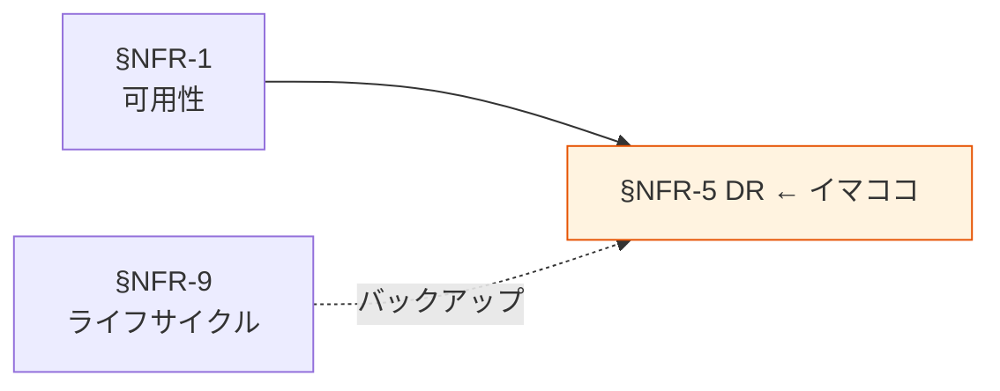

# §NFR-5 DR（災害対策）

> 上位 SSOT: [../00-index.md](../00-index.md) / [00-index.md](00-index.md)
> IPA 対応: **A. 可用性（災害対策）**（復旧可能性 / バックアップ）
> 詳細: [../../non-functional-requirements.md §NFR-DR](../../non-functional-requirements.md)

---

## §NFR-5.0 前提と背景

### 用語整理

| 用語 | 本標準での意味 |
|---|---|
| **RTO**（Recovery Time Objective） | 障害発生から復旧までの目標時間 |
| **RPO**（Recovery Point Objective） | 許容可能なデータ損失時間 |
| **クロスリージョン**（Cross-Region） | 別 AWS リージョンへの冗長化 |
| **CRR**（Cross-Region Replication） | S3 のクロスリージョン複製 |
| **Aurora Global Database** | Aurora のクロスリージョン複製機能 |

### なぜここ（§NFR-5）で決めるか

§NFR-1 可用性が「単一リージョン内の冗長性」を扱うのに対し、§NFR-5 はリージョン全体の障害（地震・大規模クラウド障害）への備えを扱う。

### IPA マッピング

| 本章サブセクション | IPA 中項目 |
|---|---|
| §NFR-5.1 RTO / RPO 目標 | A.3 災害対策 |
| §NFR-5.2 バックアップ・複製 | A.4 復旧可能性 |
| §NFR-5.3 リストア検証 | A.4 復旧可能性 |

### §NFR-5.0.A 本標準のスタンス

> **データ区分・機密度別に RTO / RPO 目標を定める。監査ログ・Restricted データは必ずクロスリージョン複製。それ以外はバックアップ + 必要時リストアを基本とする。BCP 演習を年次必須化し、リストア可能性を担保する。**

### 本章で扱うサブセクション

| サブセクション | 内容 |
|---|---|
| §NFR-5.1 RTO / RPO 目標 | データ区分別の RTO / RPO |
| §NFR-5.2 バックアップ・複製 | S3 CRR / Aurora バックアップ / DynamoDB PITR 等 |
| §NFR-5.3 リストア検証 | 年次 BCP 演習、リストア手順整備 |

---

## §NFR-5.1 RTO / RPO 目標

> **このサブセクションで定めること**: データ区分別の RTO / RPO 目標。
> **主な判断軸**: 業務影響度 / 機密度 / コスト
> **§NFR-5 全体との関係**: バックアップ・複製方式選定の前提

### ベースライン

| データ区分 | RTO | RPO | 標準実装 |
|---|---|---|---|
| 業務 TX | 4 時間 | 15 分 | Aurora 自動バックアップ + CRR、Aurora Global Database 検討 |
| アプリログ | 24 時間 | 24 時間 | S3 CRR（重要ログ）/ バージョニング |
| 監査ログ | 4 時間 | 0（書き込み即時複製）| S3 CRR 必須、Object Lock 維持 |
| メトリクス | 24 時間 | 1 時間 | CloudWatch クロスリージョン export |
| 外部連携データ | 24 時間 | 24 時間 | レイク raw 層 CRR |

### TBD / 要確認

- 業務 TX の RTO/RPO（業務部門ヒアリング）
- 監査ログのクロスリージョン要件（規制側の要件）
- DR リージョン選定（東京 → 大阪 / シンガポール 等）

---

## §NFR-5.2 バックアップ・複製

> **このサブセクションで定めること**: 各保存先のバックアップ・複製の実装方式。
> **主な判断軸**: RTO/RPO / コスト / 運用負荷
> **§NFR-5 全体との関係**: §NFR-5.1 の実装

### ベースライン

| 保存先 | バックアップ | クロスリージョン複製 |
|---|---|---|
| S3 | バージョニング有効 | CRR（重要バケットのみ）|
| Aurora | 自動バックアップ 30 日 | Aurora Global Database（業務 TX）|
| RDS | 自動バックアップ 30 日 | 手動スナップショット クロスリージョン Copy |
| DynamoDB | PITR 有効化、Backup 日次 | Global Tables（業務 TX）|
| Redshift | スナップショット日次、保持 30 日 | クロスリージョン Copy |
| OpenSearch | スナップショット日次 | クロスリージョン Copy |

### TBD / 要確認

- バックアップ保持期間（規制要件との整合）
- 複製コストの許容範囲

---

## §NFR-5.3 リストア検証

> **このサブセクションで定めること**: バックアップ・複製が実際に使えることを検証する演習。
> **主な判断軸**: 演習頻度 / 範囲 / コスト
> **§NFR-5 全体との関係**: バックアップ取得とリストア成功は別物。検証なしでは DR は機能しない

### ベースライン

- 年次 BCP 演習必須。
- リストア手順書を保存先別に整備、年次レビュー。
- 重要データ（業務 TX / 監査ログ）は半年に 1 回の小規模リストア確認。

### TBD / 要確認

- 演習範囲（全アカウント vs サンプリング）
- 演習時の業務影響評価方法

---

## §NFR-5.X 関連リンク

- [00-index.md](00-index.md): NFR インデックス
- [01-availability.md](01-availability.md): §NFR-1 可用性
- [09-lifecycle.md](09-lifecycle.md): §NFR-9 データライフサイクル（バックアップ保管期間）
