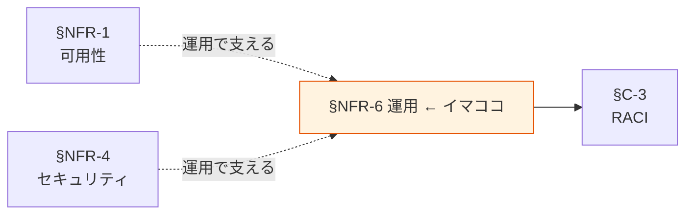

# §NFR-6 運用

> 上位 SSOT: [../00-index.md](../00-index.md) / [00-index.md](00-index.md)
> IPA 対応: **C. 運用・保守性**（通常運用 / 障害時運用 / 保守運用 / サポート体制）
> 詳細: [../../non-functional-requirements.md §NFR-OPS](../../non-functional-requirements.md)

---

## §NFR-6.0 前提と背景

### 用語整理

| 用語 | 本標準での意味 |
|---|---|
| **データ品質**（Data Quality） | データの正確性・完全性・適時性・整合性 |
| **データ品質メトリクス** | 品質を測る指標（NULL 率 / 重複率 / 鮮度 / スキーマ違反 等）|
| **可観測性**（Observability） | システム状態を外部から把握できる度合い |
| **SLO**（Service Level Objective） | 内部目標（SLA は外部約束）|

### なぜここ（§NFR-6）で決めるか

§NFR-1〜5 の目標を「日々の運用で支える」ための仕組み（監視・データ品質・体制）を定める章。

### IPA マッピング

| 本章サブセクション | IPA 中項目 |
|---|---|
| §NFR-6.1 監視・可観測性 | C.1 通常運用 / C.2 障害時運用 |
| §NFR-6.2 データ品質監視 | C.1 通常運用（独自項目）|
| §NFR-6.3 体制・運用 SLA | C.4 運用環境 / C.5 サポート体制 |

### §NFR-6.0.A 本標準のスタンス

> **マネージドサービス優先で運用負荷を抑えつつ、データプラットフォーム固有の観点（データ品質・コスト）を含む可観測性を担保する。監視は CloudWatch + EventBridge を中心とし、データ品質は Glue Data Quality を標準採用。運用主体は §C-3 RACI で明示する。**

### 本章で扱うサブセクション

| サブセクション | 内容 |
|---|---|
| §NFR-6.1 監視・可観測性 | CloudWatch メトリクス / アラート / ダッシュボード |
| §NFR-6.2 データ品質監視 | Glue Data Quality、品質指標と閾値 |
| §NFR-6.3 体制・運用 SLA | 運用主体、エスカレーション、SLA |

---

## §NFR-6.1 監視・可観測性

> **このサブセクションで定めること**: 各保存先・パイプラインの監視項目とアラート閾値。
> **主な判断軸**: 障害検知速度 / 誤検知率 / 通知コスト
> **§NFR-6 全体との関係**: 障害時運用の前提

### ベースライン

| 監視対象 | メトリクス例 | アラート閾値 |
|---|---|---|
| S3 | 4xx/5xx エラー率 | 1% 超で警告 |
| Aurora / RDS | CPU / 接続数 / レプリカ遅延 | CPU > 80%、レプリカ遅延 > 30 秒 |
| Athena | クエリエラー率 / スキャン量 | エラー > 5%、月次スキャン超過 |
| Glue ETL | ジョブ失敗 / 実行時間 | 失敗即通知、想定実行時間 1.5 倍 |
| Kinesis | IteratorAge | 5 分超で警告 |
| Lake Formation | 監査ログ異常パターン | カスタム検知 |

**ダッシュボード**: CloudWatch Dashboards に標準テンプレ。データ区分別・保存先別のサマリービュー。

**通知**: SNS + 重要度別チャネル（Slack / メール / PagerDuty 等）。

### TBD / 要確認

- 通知先チャネル選定
- 24/365 監視の必要範囲
- 既存監視ツールとの併用

---

## §NFR-6.2 データ品質監視

> **このサブセクションで定めること**: データ品質メトリクスと品質劣化検知。
> **主な判断軸**: 品質指標選定 / 閾値 / 検知頻度
> **§NFR-6 全体との関係**: データプラットフォーム固有の監視項目（IPA には独立項目なし）

### ベースライン

**品質指標**:
| 指標 | 説明 | 標準閾値 |
|---|---|---|
| 完全性 | 必須カラム NULL 率 | 1% 超で警告 |
| 重複率 | 一意キー重複 | 0.1% 超で警告 |
| 鮮度 | 最終更新からの経過時間 | 期待間隔の 1.5 倍超で警告 |
| 件数変動 | 前日比 / 前週比の変化 | ±30% 超で警告 |
| スキーマ違反 | 型違反・許容値違反 | 即通知 |

**実装**:
- Glue Data Quality を標準採用。
- 重要テーブル（Restricted / 業務 TX）には品質チェック必須化。

### TBD / 要確認

- 品質劣化時のオペレーション（パイプライン停止 vs 警告のみ）
- データオーナーへの通知方法

---

## §NFR-6.3 体制・運用 SLA

> **このサブセクションで定めること**: 運用主体、エスカレーション、SLA（応答時間・復旧時間）。
> **主な判断軸**: 内製 vs 外部委託 / コスト / スキル
> **§NFR-6 全体との関係**: §C-3 RACI の運用詳細

### ベースライン

- 各アプリの運用は基本各アプリチームが担う（分散標準ゆえに）。
- プラットフォーム標準化推進者は標準改訂・横断課題対応。
- データオーナーは品質劣化・インシデント時の指揮。
- 運用 SLA: 重大障害（業務影響大）30 分以内一次応答、24 時間以内復旧目標。

### TBD / 要確認

- 24/365 体制の必要性
- 運用窓口の集約 vs 各アプリ分散
- 外部委託の範囲

---

## §NFR-6.X 関連リンク

- [00-index.md](00-index.md): NFR インデックス
- [../common/03-ownership-raci.md](../common/03-ownership-raci.md): §C-3 RACI
- [01-availability.md](01-availability.md): §NFR-1 可用性（運用で支える目標）
