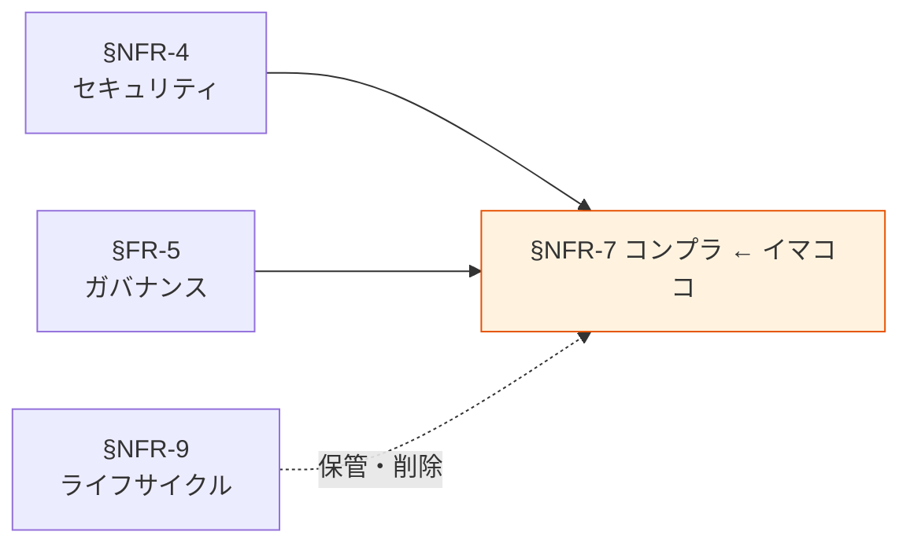

# §NFR-7 コンプライアンス

> 上位 SSOT: [../00-index.md](../00-index.md) / [00-index.md](00-index.md)
> IPA 対応: **E + C**（独立章。規制適合・業界認定・データガバナンス）
> 詳細: [../../non-functional-requirements.md §NFR-COMP](../../non-functional-requirements.md)

---

## §NFR-7.0 前提と背景

### 用語整理

| 用語 | 本標準での意味 |
|---|---|
| **個人情報保護法**（日本）| 個人情報の取り扱いに関する基本法令 |
| **GDPR** | EU 一般データ保護規則。「忘れられる権利」「データ移転規制」等を含む |
| **業界規制** | 金融（FISC）/ 医療（HIPAA / 医療情報安全管理ガイドライン）/ クレジットカード（PCI DSS）等 |
| **ISMS / ISO 27001** | 情報セキュリティマネジメントシステム認証 |
| **SOC 2** | 信頼性レポート（セキュリティ・可用性・処理整合性・機密性・プライバシー）|
| **データガバナンス** | データの取得・利用・保管・廃棄の組織的統制 |

### なぜここ（§NFR-7）で決めるか

§NFR-4 セキュリティ・§FR-5 ガバナンス・§NFR-9 ライフサイクル の上位に位置する「**外部要請への適合**」を扱う章。法令・業界規制・第三者認証が決定要因。

### IPA マッピング

| 本章サブセクション | 対応領域 |
|---|---|
| §NFR-7.1 規制・法令対応 | E. セキュリティ + 業界規制 |
| §NFR-7.2 業界認定・監査 | E. セキュリティ + C. 運用・保守性 |
| §NFR-7.3 データガバナンス | E + C + D（保管・廃棄） |

### §NFR-7.0.A 本標準のスタンス

> **個人情報保護法を最低ラインとし、対象アプリの業界規制（金融 / 医療 / クレカ 等）に応じて段階的に追加要件を適用する。GDPR は越境取扱がある場合のみ。ISMS / SOC 2 等の第三者認証は組織方針に従う。データガバナンスは §FR-1 / §FR-5 / §NFR-9 の遵守を本章で再確認する位置付け。**

### 本章で扱うサブセクション

| サブセクション | 内容 |
|---|---|
| §NFR-7.1 規制・法令対応 | 個人情報保護法 / GDPR / 業界規制 |
| §NFR-7.2 業界認定・監査 | ISMS / SOC 2 / PCI DSS 等 |
| §NFR-7.3 データガバナンス | §FR-1 / §FR-5 / §NFR-9 の遵守確認 |

---

## §NFR-7.1 規制・法令対応

> **このサブセクションで定めること**: 適用される規制・法令と、本標準がどう対応するか。
> **主な判断軸**: 取り扱いデータの性質 / 対象アプリの業界 / 越境取扱の有無
> **§NFR-7 全体との関係**: 最低ライン

### ベースライン

| 規制 | 適用条件 | 本標準の対応 |
|---|---|---|
| 個人情報保護法（日本） | PII を扱う全アプリ | §FR-1.2（機密度）/ §FR-5.3（PII 取り扱い）で対応 |
| GDPR | EU 居住者データを取り扱う場合 | データ越境制限 / 忘れられる権利 → §NFR-9 削除プロセス |
| 改正電気通信事業法 / Cookie 規制 | 該当アプリで個別判定 | §FR-5 / §NFR-7.3 で都度判定 |
| FISC 安全対策基準 | 金融系アプリ | §NFR-4 セキュリティ強化適用 |
| 医療情報安全管理ガイドライン | 医療系アプリ | §NFR-4 / §NFR-9 強化適用 |
| PCI DSS | 決済情報を扱う場合 | カード番号は本標準対象外を原則 |

### TBD / 要確認

- 各アプリで該当する規制の特定
- GDPR 適用範囲（EU 関連サービスの有無）
- PCI DSS スコープからの除外設計

---

## §NFR-7.2 業界認定・監査

> **このサブセクションで定めること**: 第三者認証取得の方針と、それに必要な記録・運用。
> **主な判断軸**: 顧客要請 / 競合優位 / 取得・維持コスト
> **§NFR-7 全体との関係**: 規制対応の上位（任意取得）

### ベースライン

- ISMS / ISO 27001、SOC 2 などは組織方針に従う（本標準では強制せず）。
- 認証取得が必要なアプリには、本標準が認証要件を満たすことを示す対応表を整備。
- AWS の SOC レポート / ISO 認証は本標準採用時にそのまま継承（ベースライン）。

### TBD / 要確認

- 認証取得計画
- 監査時の証憑準備プロセス

---

## §NFR-7.3 データガバナンス

> **このサブセクションで定めること**: §FR-1 / §FR-5 / §NFR-9 の規定を組織的に運用する仕組み（オーナー任命・棚卸し・改訂サイクル）。
> **主な判断軸**: 運用負荷 / 形骸化リスク
> **§NFR-7 全体との関係**: 規制適合を支える組織的基盤

### ベースライン

- 全データへのオーナー任命を年次で確認（§FR-1.3）。
- Restricted データの棚卸しを四半期実施（§FR-5.1）。
- PII 棚卸しを Macie + 手動で四半期実施（§FR-5.3）。
- 本標準の改訂は年 2 回（春・秋）。

### TBD / 要確認

- 棚卸し結果の保管・報告ルート
- 形骸化チェック（標準と実態の乖離）の仕組み

---

## §NFR-7.X 関連リンク

- [00-index.md](00-index.md): NFR インデックス
- [04-security.md](04-security.md): §NFR-4 セキュリティ
- [../fr/05-governance.md](../fr/05-governance.md): §FR-5 ガバナンス
- [09-lifecycle.md](09-lifecycle.md): §NFR-9 データライフサイクル
