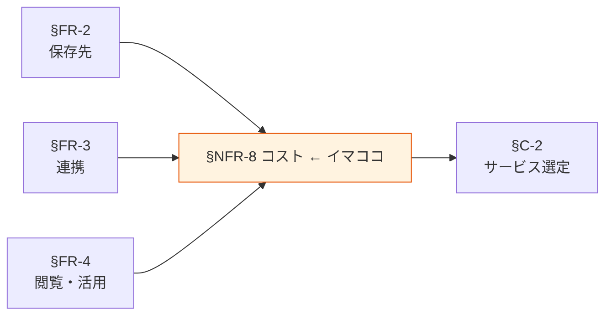

# §NFR-8 コスト

> 上位 SSOT: [../00-index.md](../00-index.md) / [00-index.md](00-index.md)
> IPA 対応: （IPA 範囲外、独立章）
> 詳細: [../../non-functional-requirements.md §NFR-COST](../../non-functional-requirements.md)

---

## §NFR-8.0 前提と背景

### 用語整理

| 用語 | 本標準での意味 |
|---|---|
| **3 年 TCO** | 3 年間の総所有コスト（初期 + 運用 + 移行）|
| **保存コスト** | ストレージ容量・ストレージクラス・複製コスト |
| **転送コスト** | リージョン間・インターネット転送のデータ転送費用 |
| **分析コスト** | クエリスキャン量・コンピュート時間 |
| **コスト按分** | 複数アプリ・複数部門での利用に応じた費用配分 |

### なぜここ（§NFR-8）で決めるか

§FR-2〜4 で選んだサービス構成のコスト影響を一元的に管理する章。「運用負荷・コスト最小」の基本方針 4 軸目の中核。

### IPA マッピング

| 本章サブセクション | 対応領域 |
|---|---|
| §NFR-8.1 コスト統制 | 独立（本標準固有）|
| §NFR-8.2 コスト按分 | C. 運用・保守性（按分運用）|
| §NFR-8.3 TCO 評価 | 独立（本標準固有）|

### §NFR-8.0.A 本標準のスタンス

> **AWS マネージドサービスの従量課金を前提に、コスト統制（予算・上限・監視）を組み込む。サーバレス系（S3 / Athena / DynamoDB On-Demand）優先で初期費用を抑え、利用パターンが固まった領域は予約・固定費用で TCO 最適化する。SaaS 採用は TCO 評価で AWS ネイティブを明らかに上回る場合のみ許容。**

### 本章で扱うサブセクション

| サブセクション | 内容 |
|---|---|
| §NFR-8.1 コスト統制 | 予算・上限・アラート |
| §NFR-8.2 コスト按分 | タグ運用・按分計算 |
| §NFR-8.3 TCO 評価 | サービス採否判断の TCO 比較 |

---

## §NFR-8.1 コスト統制

> **このサブセクションで定めること**: 月次予算・スキャン量上限・アラート設定の標準。
> **主な判断軸**: 予算枠 / 暴走防止 / 利用阻害のバランス
> **§NFR-8 全体との関係**: 日常的なコスト管理の基盤

### ベースライン

- AWS Budgets でアプリ別・サービス別の月次予算 + 80% / 100% アラート必須。
- Athena は per-query スキャン量上限を必須設定。
- S3 / 転送系のコスト異常検知（Cost Anomaly Detection）有効化。
- 上限超過時の自動停止ポリシーをサービス別に整備（業務停止リスクとのバランス）。

### TBD / 要確認

- アプリ別予算枠の決め方
- 上限超過時の自動停止の許容範囲

---

## §NFR-8.2 コスト按分

> **このサブセクションで定めること**: タグ運用と按分計算ルール（複数アプリ・複数部門で共有するリソースの費用配分）。
> **主な判断軸**: 按分粒度 / タグ運用負荷 / 共有リソースの扱い
> **§NFR-8 全体との関係**: 組織内の費用認識を正しく行う土台

### ベースライン

**必須タグ**:
- `App`: アプリ識別子
- `Owner`: データオーナー
- `DataClassification`: 機密度（Public / Internal / Confidential / Restricted）
- `Environment`: dev / staging / prod
- `CostCenter`: 部門コード

タグ未付与リソースは作成不可（IaC で強制）。

**按分**:
- 共有リソース（監査ログバケット等）はプラットフォーム標準化推進者がコストセンター。
- アプリ専用リソースは当該アプリがコストセンター。

### TBD / 要確認

- タグ命名規約（既存社内規定との整合）
- 既存リソースの遡及タグ付与計画

---

## §NFR-8.3 TCO 評価

> **このサブセクションで定めること**: サービス採否判断の TCO 評価方法（特に SaaS 採用検討時）。
> **主な判断軸**: 3 年 TCO / 移行コスト / 機会損失
> **§NFR-8 全体との関係**: §C-2 サービス選定軸 の判断材料

### ベースライン

**評価項目**（3 年 TCO）:
- 初期構築費 / ライセンス費 / 運用費 / 移行費 / 機会損失

**SaaS 採用検討時の判断基準**:
- 本標準採用（AWS ネイティブ）と比較し、3 年 TCO で **30% 以上のメリット**があるか
- ベンダーロックインリスクの評価
- 既存資産との統合コスト
- ADR で意思決定経緯を残す

### TBD / 要確認

- TCO 評価テンプレートの整備
- SaaS 採用例外件数の見込み

---

## §NFR-8.X 関連リンク

- [00-index.md](00-index.md): NFR インデックス
- [../common/02-service-selection.md](../common/02-service-selection.md): §C-2 AWS サービス選定軸
- [../fr/02-storage.md](../fr/02-storage.md): §FR-2 保存先標準（主要コストドライバ）
