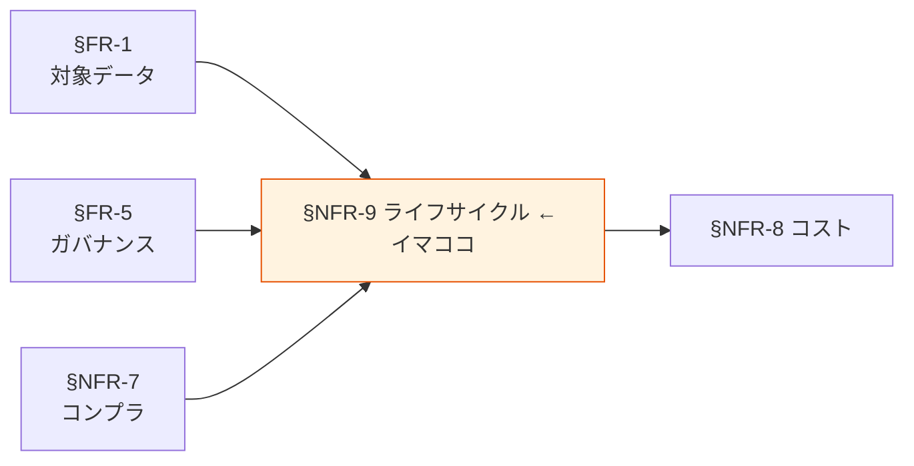

# §NFR-9 データライフサイクル

> 上位 SSOT: [../00-index.md](../00-index.md) / [00-index.md](00-index.md)
> IPA 対応: **D. 移行性** に準じる（保管 / アーカイブ / 廃棄）
> 詳細: [../../non-functional-requirements.md §NFR-LCM](../../non-functional-requirements.md)

---

## §NFR-9.0 前提と背景

### 用語整理

| 用語 | 本標準での意味 |
|---|---|
| **保管期間** | データを利用可能な状態で保持する期間 |
| **アーカイブ** | コールドストレージ（Glacier 等）への退避 |
| **削除** | データを復元不可能にする操作 |
| **論理削除 / 物理削除** | フラグ立ての削除 / 実データの削除 |
| **忘れられる権利** | GDPR 上の権利。本人請求による個人データ削除 |
| **WORM**（Write Once Read Many） | 一度書いたら変更不可なストレージモード（Object Lock Compliance）|
| **既存データ移行** | 既存環境から本標準環境へのデータ移行 |

### なぜここ（§NFR-9）で決めるか

「**いつまで持つか / いつアーカイブするか / いつ削除するか / 既存をどう持ち込むか**」を扱う章。データを使う側（§FR-2〜4）の上位に位置し、コンプラ（§NFR-7）と密結合。

### 認証側との違い

認証側 §NFR-9 は「移行性」だが、データプラットフォームでは **データの保管・廃棄が中核論点**となるため、章題を「データライフサイクル」に変更（IPA D. 移行性は本章 §NFR-9.4 既存データ移行で扱う）。

### IPA マッピング

| 本章サブセクション | IPA 中項目 |
|---|---|
| §NFR-9.1 保管期間 | D.1 / E.5（独立扱い）|
| §NFR-9.2 アーカイブ | D.2（独立扱い）|
| §NFR-9.3 削除 | E.5 / D.3 |
| §NFR-9.4 既存データ移行 | **D.1〜D.4 移行性**（IPA 直対応）|

### §NFR-9.0.A 本標準のスタンス

> **データ区分・機密度別に保管期間を明示し、アーカイブ・削除を自動化する（S3 ライフサイクル / Glacier）。GDPR の「忘れられる権利」要請に対応できるよう、PII の個別削除手順を整備する。監査ログ等の WORM 保管は Object Lock Compliance モードで担保。既存データの本標準への移行は §NFR-9.4 で計画立案。**

### 本章で扱うサブセクション

| サブセクション | 内容 |
|---|---|
| §NFR-9.1 保管期間 | データ区分別の保管年数 |
| §NFR-9.2 アーカイブ | Glacier / コールドストレージ移行ポリシー |
| §NFR-9.3 削除 | 自動削除・個別削除（忘れられる権利）・WORM |
| §NFR-9.4 既存データ移行 | 既存環境から本標準環境への移行 |

---

## §NFR-9.1 保管期間

> **このサブセクションで定めること**: データ区分・機密度別の保管期間の標準値。
> **主な判断軸**: 法令要件 / 業務要件 / コスト
> **§NFR-9 全体との関係**: ライフサイクルの最初の意思決定

### ベースライン

| データ区分 | 標準保管期間 | 根拠 |
|---|---|---|
| 業務 TX | 7 年 | 法人税法・商法（取引記録の保管義務）|
| アプリログ | 1 年 | 業務分析・トラブル調査 |
| 監査ログ | 7 年（最低 1 年）| 内部統制・規制要件 |
| メトリクス | 13 ヶ月 | 前年比較 |
| 外部連携データ | 連携元の要件に従う | 契約・規制次第 |

**機密度別の追加要件**:
- **Restricted**: 必要最小限期間に短縮を検討、棚卸し必須。
- **Public**: 業務不要なら削除を検討。

### TBD / 要確認

- 各アプリの業界規制による保管年数
- 法務部門・コンプラ部門との確定協議

---

## §NFR-9.2 アーカイブ

> **このサブセクションで定めること**: 保管期間中のアクセス頻度に応じたストレージクラス移行ポリシー。
> **主な判断軸**: アクセス頻度 / 復元 SLA / コスト
> **§NFR-9 全体との関係**: 保管コスト最適化の主軸

### ベースライン

**S3 標準ライフサイクル**:
- 0-30 日: Standard
- 31-90 日: Standard-IA
- 91-365 日: Glacier Instant Retrieval（数ミリ秒で取り出し可）
- 1 年-保管期間終了: Glacier Deep Archive（取り出し 12 時間）

**例外**:
- 監査ログ: 全期間 Object Lock Compliance（クラスは S3 Standard or Glacier Instant、アクセス頻度次第）
- 業務 TX 履歴: アクセス頻度次第で Standard-IA 据え置きも可

### TBD / 要確認

- 各データ区分の実アクセス頻度
- Glacier 復元 SLA の許容範囲

---

## §NFR-9.3 削除

> **このサブセクションで定めること**: 自動削除・個別削除（忘れられる権利対応）・WORM 保管の標準。
> **主な判断軸**: 法令要件 / GDPR 対応 / 削除取消不可性
> **§NFR-9 全体との関係**: ライフサイクルの終端

### ベースライン

**自動削除**:
- 保管期間満了で S3 ライフサイクルにより自動削除。
- 削除前に通知（30 日前）、データオーナー承認で延長可。

**個別削除（忘れられる権利）**:
- PII を含むデータについて、本人からの削除請求に対応するプロセスを整備。
- 削除完了報告書をデータオーナー責任で作成。
- バックアップ・複製先での削除整合性を担保する手順を整備。

**WORM 保管**（Object Lock Compliance）:
- 監査ログは保管期間中、削除・上書き不可。
- Restricted データの一部に WORM 適用を検討（規制要件次第）。

**削除証跡**:
- 削除操作は CloudTrail に記録、データオーナーがレビュー。

### TBD / 要確認

- 「忘れられる権利」対応の具体プロセス・SLA
- バックアップ・複製先の削除整合性検証方法
- WORM 適用範囲

---

## §NFR-9.4 既存データ移行

> **このサブセクションで定めること**: 既存環境（標準化前のアプリ・既存 DB / 既存レイク）から本標準環境へのデータ移行計画。
> **主な判断軸**: 移行データ量 / 業務影響 / 期間
> **§NFR-9 全体との関係**: 認証側 §NFR-9 の主題（移行性）に相当。データ領域では本サブセクションで集約

### ベースライン

**移行アプローチ**:
- **新規データ**: 本標準準拠で新規構築。
- **既存データ**:
  - 重要・継続利用データ → 本標準準拠で再構築 + 移行
  - 過去ログ・参照データ → S3 にそのまま移送、Glue Catalog に再登録
  - 不要データ → 移行せず保管期間満了で削除

**移行ツール**:
- DMS（DB → S3 / 別 DB）
- AWS DataSync（ファイル系）
- Snowball（大容量オフライン）

**並行運用**:
- 既存 / 新環境の並行運用期間を最大 6 ヶ月とし、その間に切替・検証を完了する。

### TBD / 要確認

- 各アプリの既存データ規模
- 並行運用期間の業務影響
- 移行優先順位

---

## §NFR-9.X 関連リンク

- [00-index.md](00-index.md): NFR インデックス
- [../fr/01-data-catalog.md](../fr/01-data-catalog.md): §FR-1 対象データ（保管対象の定義）
- [../fr/05-governance.md](../fr/05-governance.md): §FR-5 ガバナンス（削除権限）
- [07-compliance.md](07-compliance.md): §NFR-7 コンプラ（規制要件）
- [08-cost.md](08-cost.md): §NFR-8 コスト（保管コスト）
