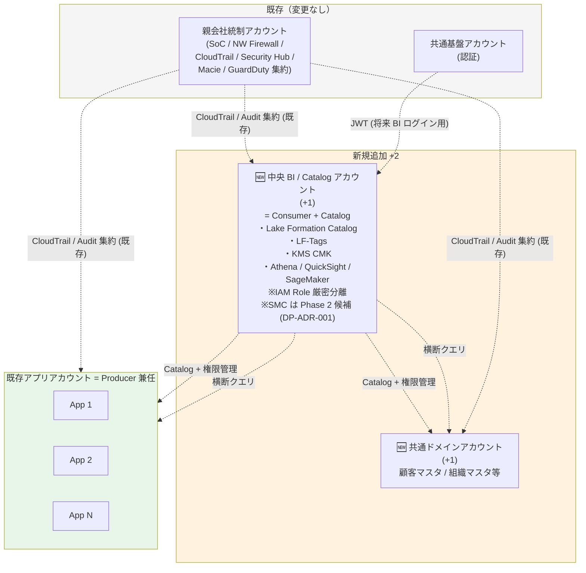
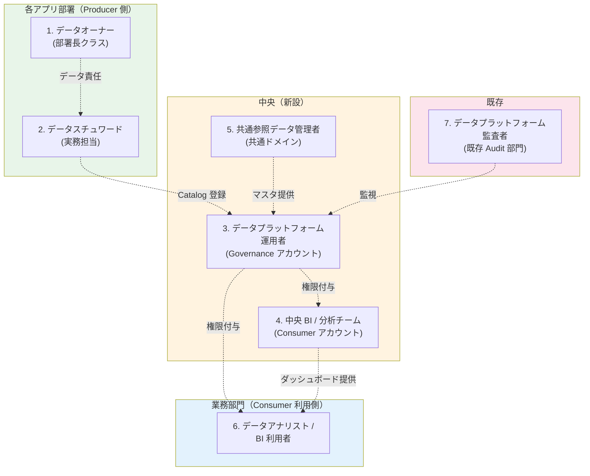
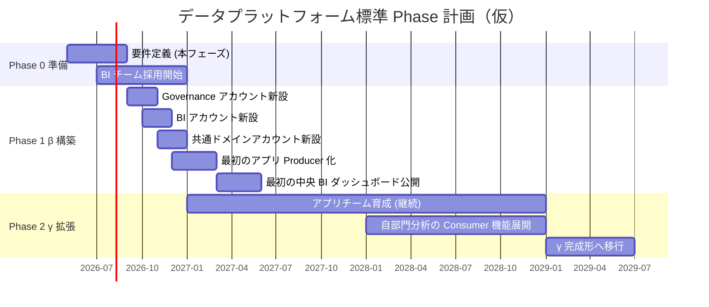
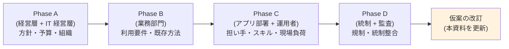

# データプラットフォーム標準 仮案（ヒアリング用 Strawman）

> ステータス: 🚧 仮案（ヒアリング Phase A 前の strawman）
> 対象読者: **社内のみ**。ヒアリング実施者 / ヒアリング対象部署のリード
> 位置付け: ヒアリングで「**この仮案に対するリアクションを引き出す**」ための叩き台
> 関連: [account-architecture-analysis.md](account-architecture-analysis.md) / [data-platform-document-structure.md](data-platform-document-structure.md) / [internal-evaluation.md](internal-evaluation.md)

---

## 0. 本資料の目的と扱い

要件定義初期では「ご要望をお聞かせください」という白紙の問いはヒアリング相手を困らせ、有効な情報が得られない。**仮案を提示して反応を引き出す**ことで:

- 各部署が「自分事として何が起きるか」を具体的に想像できる
- 反対意見・違和感が明確に出る
- 「修正したい点」と「そのままで良い点」が分離できる
- ヒアリング時間が効率化する

**重要**: 本資料は**確定方針ではなく仮案**。ヒアリングで覆ることを前提とし、項目ごとに「なぜそう決めたか」の根拠を併記して**論破・修正の起点**として使う。

---

## 1. 仮案の根拠（なぜこの構成か）

### 1.1 これまでの議論で確定したこと

| 確定事項 | 根拠 |
|---|---|
| **Federated 3 役割**（Producer / Central Governance / Consumer）を採用 | AWS Prescriptive Guidance、業界標準（[account-architecture-analysis.md §1](account-architecture-analysis.md)）|
| 共通基盤アカウントには Data Governance を**同居させない** | 責務分離、AWS Well-Architected |
| 各アプリアカウントが **Producer 役割を兼任** | 既存アカウント体系を活かす |

### 1.2 ヒアリング前の仮回答（Q1〜Q5 への暫定対応）

| 質問 | 回答 | 仮案への影響 |
|---|---|---|
| Q1 アプリチームの分析スキル | なし | α（各アプリで分析）は**不採用** |
| Q2 全社統合 KPI 要件 | あるかも | 中央 BI チームを**前提** |
| Q3 共通参照データ | 今回検討 | **共通ドメインアカウントを新設** |
| Q4 専属 BI チーム | なし | **新設前提**（最小規模で開始）|
| Q5 横断業務部門の利用 | 要ヒアリング | 中央 BI で受け入れ可能な構成にしておく |

### 1.3 採用パターンと担い手戦略

- **Consumer パターン**: **β（中央 Consumer 集約）+ 共通ドメイン**
- **アカウント配置**: **Option B（Catalog 同居 Consumer、+2 アカウント）**
- **担い手戦略**: **Path C（段階移行）** — Phase 1 で β、Phase 2 で γ
- **理由**:
  - 「アプリチームスキルなし + BI チームなし」の両方を解決するため、まず BI チームを最小規模で立ち上げ、段階的にアプリチームを育成
  - 親会社統制アカウントが CloudTrail / Security Hub / Macie 等の監査・セキュリティ集約を担うため、データ標準で必要な中央責務は **「Catalog」だけ**に縮小される
  - Catalog を Consumer（中央 BI チーム）アカウント内に同居させ、**IAM Role 厳密分離**（`DataLakeAdminRole` ≠ `DataAnalystRole`）で責務分離を担保
  - **アカウント追加 +2**（中央 BI / Catalog + 共通ドメイン）に抑えられる
  - 将来規模拡大時には Catalog を別アカウントに分離可能な設計（Phase 2 で検討）
  - 詳細根拠は [account-architecture-analysis.md §5](account-architecture-analysis.md) 参照

---

## 2. 仮案のアカウント構成（Option B: Catalog 同居 Consumer、+2）

### 2.1 全体構成図

### 2.2 アカウント別の役割と中身

| アカウント | 役割 | 主な AWS リソース | データ規模 |
|---|---|---|---|
| **親会社統制**（既存）| 全社 Audit / Security 集約 / NW 統制 | CloudTrail Org Trail / Security Hub / Macie / GuardDuty / Network Firewall | 監査ログのみ |
| **共通基盤**（既存）| 認証 | Cognito / Keycloak | データなし |
| **🆕 中央 BI / Catalog**（+1）| **Catalog 管理 + 横断分析の同居** ・Catalog 側: Lake Formation / LF-Tags / KMS ・Consumer 側: 横断分析 / 経営層 KPI / ML ・**SMC は Phase 2 で再評価**（[DP-ADR-001](adr/DP-ADR-001-sagemaker-catalog-adoption-deferred.md)）| Lake Formation / KMS / Athena / QuickSight / SageMaker / S3 (結果保存) | 派生データのみ（バルクなし）|
| **🆕 共通ドメイン**（+1）| 顧客マスタ・組織マスタ等 | S3 / Glue Catalog / RDS（オプション）| マスタデータ |
| **既存アプリ × N**（Producer 兼任）| アプリ業務 + データ生産 | API GW / Lambda / Aurora / S3 (raw/curated/analytics) | 業務データ |

### 2.3 中央 BI / Catalog アカウント内の IAM Role 分離（責務分離の核）

Option B では**同じアカウント内で IAM Role により責務分離**を実装する。アカウント境界の代わりに Role 境界で守る。

| Role | 想定担当者 | 権限スコープ |
|---|---|---|
| **`DataLakeAdminRole`**（Catalog 管理特権）| データプラットフォーム運用者（役割 3、§3 参照）| Lake Formation 管理、LF-Tag 編集、クロスアカウント Grant、KMS 鍵管理 |
| **`DataAnalystRole`**（分析者）| 中央 BI チーム（役割 4）/ 一部の業務部門 Author | Athena クエリ、QuickSight 操作・編集、自分の S3 への書込み、**Lake Formation 管理操作は Permission Boundary で拒否** |
| **`DataReaderRole`**（閲覧のみ）| 業務部門 Reader（役割 6）| QuickSight ダッシュボード閲覧のみ |

**緩和策**（[account-architecture-analysis.md §5.5](account-architecture-analysis.md) 参照）:
- Permission Boundary で `DataAnalystRole` の Lake Formation 管理操作を拒否
- SCP で当該アカウントの権限上昇系操作を拒否
- AWS Config Rules で「Catalog 管理権限と Consumer 権限の重複ユーザー」を検出
- 将来 Catalog 分離（Option C 移行）の手順書を初日から準備

---

## 3. 7 つの役割定義（仮案）

### 3.1 役割マップ

### 3.2 役割詳細

#### 役割 1. データオーナー（Producer 側）

| 項目 | 仮案 |
|---|---|
| **配置** | 各アプリの所管部署（例：販売管理アプリなら営業企画部の部長クラス）|
| **責任範囲** | 当該データの収集・利用・公開範囲・保管期間・削除の最終決定権 |
| **業務量** | 月 2-4 時間（権限承認・棚卸し対応）|
| **必要スキル** | データの業務意味を理解、組織判断ができる |
| **人数** | アプリ数 × 1 名 |
| **新設 / 既存兼任** | **既存兼任**（業務部署のリーダーが追加責任を持つ）|
| **想定タイトル** | 「データオーナー権限を新設し、既存部署長が兼任」 |

> ⚠ **ヒアリングで確認**: 各部署長がこの追加責任を引き受けられるか、業務量上限の妥当性

#### 役割 2. データスチュワード（Producer 側）

| 項目 | 仮案 |
|---|---|
| **配置** | 各アプリの開発・運用チーム |
| **責任範囲** | スキーマ管理、Catalog 登録、データ品質、日常的なアクセス権申請の一次対応 |
| **業務量** | 月 8-16 時間 |
| **必要スキル** | SQL / Glue Catalog 基本操作 / S3 操作 |
| **人数** | アプリ数 × 1-2 名 |
| **新設 / 既存兼任** | **既存兼任**（アプリ開発者 / 運用者の追加役割）|
| **想定タイトル** | 「データスチュワード権限を新設、各アプリの実務担当が兼任」 |

> ⚠ **ヒアリングで確認**: スキル不足を補う研修プログラムの必要性、Glue Catalog 操作の習得難易度

#### 役割 3. データプラットフォーム運用者（Catalog 管理特権 = 新設）

| 項目 | 仮案 |
|---|---|
| **配置（Option B 改訂）** | **中央 BI / Catalog アカウント内**（独立アカウントではなく、IAM `DataLakeAdminRole` として実装）|
| **所属組織** | 標準化推進部 or 既存インフラ・セキュリティチーム |
| **責任範囲** | Lake Formation 管理、LF-Tag 体系の設計・維持、クロスアカウント権限承認、共通 KMS 鍵管理、Catalog 利用統計把握 |
| **業務量** | Phase 1: フルタイム 1 名 / Phase 2: 2 名 |
| **必要スキル** | AWS Lake Formation / IAM / KMS の中級〜上級、データガバナンス知識 |
| **新設 / 既存兼任** | **新設**（または既存インフラ / セキュリティチームの増員）|
| **採用 / 育成戦略** | 既存 AWS インフラ運用者の中から Lake Formation 専任に育成、または中途採用 |
| **責務分離担保** | 中央 BI チーム（役割 4 = `DataAnalystRole`）と**ユーザー集合が完全に重複しない**ことを Config Rules で監視 |

> ⚠ **ヒアリングで確認**:
> - 既存インフラ / セキュリティチームから人員を出せるか、外部採用の予算感
> - 中央 BI チームと**人員が重ならない**運用が可能か（責務分離の前提）

#### 役割 4. 中央 BI / データ分析チーム（Consumer 側 = 新設）

| 項目 | 仮案 |
|---|---|
| **配置（Option B 改訂）** | **中央 BI / Catalog アカウント内**（役割 3 と同じアカウント、IAM `DataAnalystRole` として実装）|
| **所属組織** | 新設チーム（経営企画 or 経理 or 経営層直轄 のどこかに配置）|
| **責任範囲** | 横断分析、経営層向け KPI ダッシュボード、業務部門向け BI 提供、ML 推進、データ品質基準の運用 |
| **業務量** | フルタイム |
| **必要スキル** | SQL / Python / BI ツール（QuickSight）/ ビジネス理解、Lead 級はデータエンジニアリングも |
| **人数** | **Phase 1: 2 名**（Lead 1 + Analyst 1）→ Phase 2: 3-5 名 |
| **新設 / 既存兼任** | **新設**（市場でデータ人材は不足、採用難易度高）|
| **配置候補** | (a) 経営企画 配下 / (b) 経理部 配下 / (c) 新設「データ戦略室」/ (d) IT 部門配下 |
| **責務分離担保** | Permission Boundary により Lake Formation 管理操作は不可、役割 3（`DataLakeAdminRole`）と Role を明確に分離 |

> ⚠ **ヒアリングで確認**:
> - どの部署配下が組織的に妥当か、最初の 2 名の役割分担、外部委託との分業ライン
> - **Option B 採用に伴い、役割 3 と人員が重ならない**運用が可能か

#### 役割 5. 共通参照データ管理者（共通ドメイン側 = 新設）

| 項目 | 仮案 |
|---|---|
| **配置** | 中央 BI チームと近接（同部署内 or 兼任）|
| **責任範囲** | 顧客マスタ・組織マスタ・商品マスタ等の整備・維持、各アプリへの提供、品質保証 |
| **業務量** | Phase 1: 0.5 名分（中央 BI チームと兼任）、Phase 2: 1 名 |
| **必要スキル** | 業務知識（顧客 / 商品 / 組織のマスタ定義）、SQL、Glue Catalog |
| **人数** | **Phase 1: 兼任 1 名分**、Phase 2: 専任 1 名 |
| **新設 / 既存兼任** | Phase 1 は中央 BI チームのメンバーが兼任、Phase 2 で独立 |
| **既存マスタの所管** | 既存に「顧客マスタは A 部、商品マスタは B 部」が散在する場合、移管 or 二重管理の論点 |

> ⚠ **ヒアリングで確認**: 既存マスタの所管部署、移管交渉の難易度、二重管理を避ける統合プロセス

#### 役割 6. データアナリスト / BI 利用者（Consumer 利用側 = 業務部門）

| 項目 | 仮案 |
|---|---|
| **配置** | 経理 / 人事 / 営業企画 / マーケティング / 経営層 等 |
| **責任範囲** | QuickSight でダッシュボード閲覧、簡易クエリ（一部の利用者のみ）、業務判断 |
| **業務量** | 既存業務の一部として吸収 |
| **必要スキル** | QuickSight UI 操作（SQL は不要、一部 Author 用に簡易 SQL）|
| **人数** | Reader: **50-100 名**（推定）、Author: 5-10 名 |
| **新設 / 既存兼任** | **既存業務に新ツールが加わる**形 |

> ⚠ **ヒアリングで確認**: 各部署の想定利用者数、現状の分析手段（Excel / 既存 BI ツール）、研修ニーズ

#### 役割 7. データプラットフォーム監査者（既存 Audit）

| 項目 | 仮案 |
|---|---|
| **配置** | **既存 Audit 部門**（親会社統制チーム or 内部監査部）|
| **責任範囲** | アクセスログ閲覧、PII 棚卸し、権限レビュー、コンプラ報告 |
| **業務量** | 四半期 8-16 時間 |
| **必要スキル** | Audit / コンプラ知識、CloudTrail / Lake Formation Audit ログ読解 |
| **人数** | 既存 1-2 名 |
| **新設 / 既存兼任** | **既存兼任**（業務追加）|

> ⚠ **ヒアリングで確認**: 親会社統制チームの稼働余力、Lake Formation 監査ログ読解の研修要否

---

## 4. Phase 移行プラン（仮案）

### 4.1 Phase 構成

### 4.2 Phase 1（最初 18 ヶ月）の到達目標

| 領域 | 到達目標 |
|---|---|
| **組織** | BI チーム 2 名稼働、Catalog 管理者 1 名配属（役割 3、別 Role）|
| **アカウント** | **中央 BI / Catalog**（+1）/ **共通ドメイン**（+1）の **2 アカウント**開設・運用開始 |
| **IAM Role 分離** | `DataLakeAdminRole` / `DataAnalystRole` / `DataReaderRole` の運用ルール確立、Permission Boundary・SCP・Config Rules 整備 |
| **アプリ** | 全アプリの 30-50% が Producer 化（Catalog 登録、Lake Formation 委任）|
| **共通参照データ** | 顧客マスタ / 組織マスタ 2 つ稼働 |
| **ダッシュボード** | 経営層向け週次 KPI、3-5 業務部門の基本ダッシュボード |
| **コンプラ** | PII 棚卸しサイクル稼働、四半期権限レビュー稼働 |
| **将来分離準備** | Catalog 分離手順書（Option C 移行）を整備、トリガ条件を明文化 |
| **SMC 採用への布石** | ビジネスメタデータの命名規約、データオーナー / スチュワード明示、業務グロッサリの仮整備（Confluence 等）、データ製品 README 必須化（Phase 2 で SMC 採用判断時に移行容易化、[DP-ADR-001 §2.2](adr/DP-ADR-001-sagemaker-catalog-adoption-deferred.md)）|

### 4.3 Phase 2（18 ヶ月以降）への移行条件

- アプリチームのデータエンジニアリング研修完了（ターゲット 50% 以上）
- 自部門分析需要が中央 BI チームで処理しきれなくなる兆候
- 経営層から「もっと深い分析を」の要望
- **Catalog 分離検討トリガ**（以下のいずれかに該当する場合 Option B → C 移行を検討）:
  - Consumer アカウントが 2 つ以上必要になる
  - BI チーム規模が 5 名を超え、Catalog 管理者と分析者の人員重複リスクが顕在化
  - 規制要件・監査指摘で「Catalog の独立性」が求められる
  - データ機密度 Restricted データの取扱が想定以上に増える
- **SMC（旧 DataZone）再評価トリガ**（[DP-ADR-001 §4](adr/DP-ADR-001-sagemaker-catalog-adoption-deferred.md) 参照）:
  - アクティブ利用者が 30+ になる
  - BI チームの月次取り次ぎ件数が 50+ になる
  - 公開データ製品数が 15+ になる
  - γ パターン移行が現実化し横断検索性の重要度が上がる
  - 経営・組織レベルで「Self-service データ活用」方針が出る
  - 規制対応強化でビジネスグロッサリ・データオーナー明示が必要になる

---

## 5. 仮案の前提条件と変動要因

ヒアリングで覆る可能性のある前提を**明示**しておく。

| # | 前提 | 覆ると何が変わるか |
|---|---|---|
| 1 | BI チームを新設できる（最小 2 名）+ Catalog 管理者 1 名を別人員で確保できる | 不可なら → Path B 外部委託、Path D 要件絞り込み、または Option C / A への変更 |
| 2 | データオーナー権限を既存部署長が兼任できる | 不可なら → 専任 Data Owner 役を新設、または所管部署再編 |
| 3 | アプリ運用者がスチュワードを兼任できる | 不可なら → 各アプリにスチュワード専任配置、または中央集約 |
| 4 | 共通参照データの所管移管が合意できる | 不可なら → 二重管理 / 部分移管 / 既存所管を維持しつつ Catalog 登録のみ |
| 5 | 業務部門が QuickSight を使う意思がある | 不可なら → 既存ツール（Excel 等）併用、または既存 BI ツール延命 |
| 6 | アカウント追加 **+2** が組織として許容される | 不可なら → 共通ドメインを既存アプリに寄せる（-1）|
| 7 | 経営層が統合 KPI を本気で使う | 使わないなら → 中央 BI チーム規模縮小、γ 移行の優先度低下 |
| 8 | **親会社統制アカウントが CloudTrail / Security Hub / Macie / GuardDuty 等の集約を担っている**（Option B 成立の必須前提）| 担っていない場合 → Option C（Catalog 独立 +3）または Option A（広義 Governance +3）に変更必要 |
| 9 | 役割 3（Catalog 管理者）と役割 4（BI チーム）の人員が**重ならない**運用が可能 | 重なる場合 → 責務分離の効果が弱まる、Option C への分離移行検討 |

---

## 6. ヒアリング項目（仮案を起点に）

> **スライド単位の具体物**: ヒアリング当日に PowerPoint で提示する **タイトル / 内容 / 回答例** の 41 スライドは [hearing-slide-deck.md](hearing-slide-deck.md) を参照。本セクションは **ステークホルダー別の質問リスト** の側面で整理（**§7.2 スライド使い分け** とクロスリファレンス）。

### 6.1 各ヒアリング相手と確認項目

#### A. 経営層 / 経営企画

| # | 質問 | 仮案検証ポイント |
|---|---|---|
| A-1 | 全社統合 KPI ダッシュボードは本当に必要か？ どの粒度・頻度？ | Q2 確認、§5 前提 7 |
| A-2 | 中央 BI チームを配置するなら、組織的にはどこ配下が妥当？ | 役割 4 の配置 |
| A-3 | 役員向け週次レポートは現状どう作られている？ | 現状把握 |
| A-4 | データプラットフォーム標準化の予算規模感 | 新設 3 アカウント + 人員のコスト感 |

#### B. 経理部

| # | 質問 | 仮案検証ポイント |
|---|---|---|
| B-1 | 月次決算データの集計手順と所要時間 | 現状把握 |
| B-2 | 売上 / コスト分析の頻度・粒度 | ダッシュボード要件 |
| B-3 | QuickSight で受け入れ可能か、既存 BI ツールが必須か | §5 前提 5 |
| B-4 | 経理として共通参照データ（取引先マスタ等）の所管に関与するか | 役割 5 |

#### C. 人事部

| # | 質問 | 仮案検証ポイント |
|---|---|---|
| C-1 | 人事 KPI（離職率・採用効率・在籍数推移）の可視化要件 | ダッシュボード要件 |
| C-2 | 機密性（個人情報・給与情報）の取り扱い要件 | 機密度分類、Lake Formation 権限 |
| C-3 | 組織マスタの所管はどこか、共通ドメインに移管できるか | 役割 5 |

#### D. 営業企画 / マーケティング

| # | 質問 | 仮案検証ポイント |
|---|---|---|
| D-1 | 顧客分析・パイプライン分析・キャンペーン分析の要件 | ダッシュボード要件 |
| D-2 | 顧客マスタの所管はどこか | 役割 5 |
| D-3 | 既存の分析方法（Excel / 既存 BI / SaaS）からの移行可否 | §5 前提 5 |

#### E. 各アプリ部署（部署長 = データオーナー候補）

| # | 質問 | 仮案検証ポイント |
|---|---|---|
| E-1 | データオーナー役を兼任で引き受けられるか、業務量上限の妥当性 | 役割 1、§5 前提 2 |
| E-2 | アプリ運用者がスチュワード役を兼任できるか | 役割 2、§5 前提 3 |
| E-3 | 自部署のデータを他部署に公開することへの抵抗・懸念 | データ共有文化 |
| E-4 | 既存の自部署内分析（Excel 等）は今後どう扱うか | 移行戦略 |

#### F. 各アプリ運用者（スチュワード候補）

| # | 質問 | 仮案検証ポイント |
|---|---|---|
| F-1 | Glue Catalog 登録・Lake Formation 委任の作業負荷感 | 役割 2、研修必要性 |
| F-2 | データ品質チェック（NULL 率・型違反）の実装難易度 | 役割 2 |
| F-3 | スキル不足を補う研修プログラムへの要望 | 役割 2、§5 前提 3 |

#### G. インフラ / セキュリティチーム

| # | 質問 | 仮案検証ポイント |
|---|---|---|
| G-1 | Catalog 管理者（役割 3）として既存チームから人員を出せるか | 役割 3、§5 前提 1 |
| G-2 | Lake Formation / KMS / Macie の運用知識習得の研修ニーズ | 役割 3 |
| G-3 | アカウント追加 **+2** が AWS Organizations 運用上許容できるか | §5 前提 6 |
| G-4 | **【Option B 必須確認】親会社統制アカウントが現在担当している範囲**: ・CloudTrail Org Trail 集約 ✅ / ❌ ・Security Hub 集約 ✅ / ❌ ・GuardDuty 集約 ✅ / ❌ ・Macie 集約 ✅ / ❌ ・AWS Config Aggregator ✅ / ❌ | §5 前提 8（Option B 成立可否を決める）|
| G-5 | Catalog 管理者と BI 分析者の**人員が重ならない**運用が可能か（責務分離の前提）| §5 前提 9、役割 3 / 役割 4 の Role 分離 |
| G-6 | 将来 Option C（Catalog 独立アカウント分離）への移行可能性（規模拡大時）| §4.3 Phase 2 移行条件 |

#### H. 親会社統制 / 監査部門

| # | 質問 | 仮案検証ポイント |
|---|---|---|
| H-1 | データプラットフォーム監査の責任を引き受けられるか | 役割 7 |
| H-2 | Lake Formation 監査ログ読解の研修要否 | 役割 7 |
| H-3 | 親会社統制ルールとの整合確認事項 | 全体 |

#### I. IT 経営層 / CIO

| # | 質問 | 仮案検証ポイント |
|---|---|---|
| I-1 | BI チーム新設の予算・採用承認の可能性 | 役割 4、§5 前提 1 |
| I-2 | データ人材の市場確保戦略（採用 / 育成 / 外部委託のミックス）| Path A vs C |
| I-3 | Phase 1 → Phase 2 への投資継続性 | Phase 計画 |

### 6.2 ヒアリングの進め方（仮案）

各 Phase 後、本仮案を改訂する。**改訂履歴を §7 に記録**する。

---

## 7. 改訂履歴

| 日付 | 内容 |
|---|---|
| 2026-05-27 | 初版作成。Q1〜Q5 への暫定回答をベースに β + 共通ドメイン + Path C の仮案 |
| 2026-05-27 (改訂) | **Option B（Catalog 同居 Consumer、+2）に変更**。親会社統制アカウントが CloudTrail / Security Hub / Macie 等を集約する前提で Catalog Account を Consumer に統合。アカウント追加 +3 → +2。役割 3 を中央 BI アカウント内の `DataLakeAdminRole` として位置付け。前提 8, 9 追加（親会社統制責務範囲確認 / 役割 3-4 人員分離）。詳細根拠は [account-architecture-analysis.md §5](account-architecture-analysis.md) |
| 2026-05-27 (再改訂) | **SageMaker Catalog（旧 DataZone）は Phase 1 不採用に確定**（[DP-ADR-001](adr/DP-ADR-001-sagemaker-catalog-adoption-deferred.md)）。Phase 1 規模では ROI 低い、+$1,360/年コスト・運用複雑度を抑制。§2.1 図 / §2.2 表から DataZone を削除し「Phase 2 候補」と表記。§4.2 Phase 1 到達目標に「SMC 採用への布石」追加（ビジネスメタデータ規約・Confluence グロッサリ・README 必須化）。§4.3 Phase 2 移行条件に「SMC 再評価トリガ」6 条件を追加。役割 3b（SageMakerCatalogAdminRole）は Phase 1 では設けない |

---

## 8. 関連ドキュメント

- [account-architecture-analysis.md](account-architecture-analysis.md) — Pattern α/β/γ/δ の分析、本仮案の選定根拠
- [internal-evaluation.md](internal-evaluation.md) — 抽出方針
- [data-platform-document-structure.md](data-platform-document-structure.md) — 領域全体 SSOT
- [proposal/](proposal/00-index.md) — 標準ベースライン提示版（本仮案で固まった部分を順次反映予定）
- [../api-platform/proposal/common/01-reference-architecture.md](../api-platform/proposal/common/01-reference-architecture.md) — API 側の Federated 決定（雛形元）
