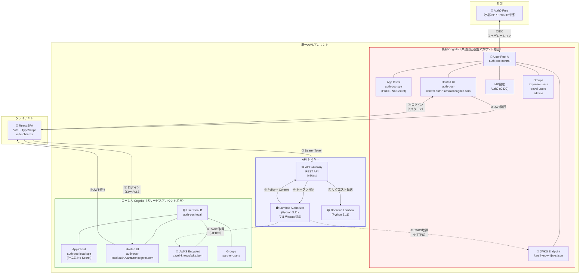
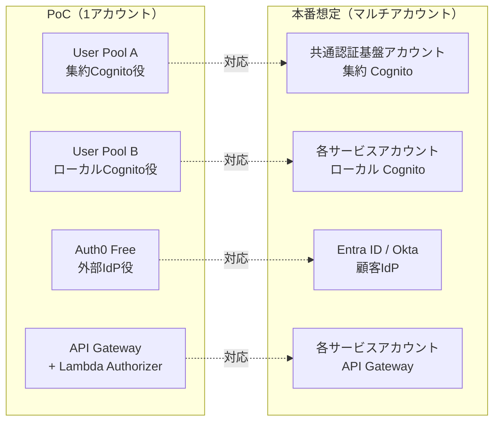

# 全体アーキテクチャ（PoC実構成）

**最終更新**: 2026-03-17（Phase 4 完了時点）

---

## 1. PoC 実構成図

### 1.1 全体構成



### 1.2 本番想定構成との対応



| 要素 | PoC | 本番想定 | 差異 |
|------|-----|---------|------|
| 集約Cognito | User Pool A（同一アカウント） | 共通認証基盤アカウント | アカウント分離のみ |
| ローカルCognito | User Pool B（同一アカウント） | 各サービスアカウント | 同上 |
| 外部IdP | Auth0 Free | Entra ID / Okta | OIDC設定は同一構造 |
| JWKS取得 | 同一アカウント HTTPS | クロスアカウント HTTPS | **動作差異なし** |
| API Gateway | 同一アカウント | 各サービスアカウント | アカウント分離のみ |

---

## 2. コンポーネント詳細

### 2.1 集約 Cognito User Pool（User Pool A）

| 設定項目 | 値 |
|---------|-----|
| 名前 | auth-poc-central |
| ユーザー名 | email |
| カスタム属性 | custom:tenant_id, custom:roles |
| 外部IdP | Auth0（OIDC） |
| App Client | auth-poc-spa（PKCE, シークレットなし） |
| トークン有効期限 | ID: 1h, Access: 1h, Refresh: 30d |
| グループ | expense-users, travel-users, admins |

### 2.2 ローカル Cognito User Pool（User Pool B）

| 設定項目 | 値 |
|---------|-----|
| 名前 | auth-poc-local |
| ユーザー名 | email |
| カスタム属性 | custom:tenant_id |
| 外部IdP | なし（ローカルユーザーのみ） |
| App Client | auth-poc-local-spa（PKCE, シークレットなし） |
| グループ | partner-users |

### 2.3 Lambda Authorizer

| 設定項目 | 値 |
|---------|-----|
| ランタイム | Python 3.11 |
| ライブラリ | PyJWT[crypto] 2.9.0 |
| タイプ | TOKEN |
| キャッシュ TTL | 300秒（5分） |
| 対応issuer | 集約Cognito + ローカルCognito |

### 2.4 API Gateway

| 設定項目 | 値 |
|---------|-----|
| タイプ | REST API |
| エンドポイント | GET /v1/test |
| 認可 | Lambda Authorizer（CUSTOM） |
| CORS | Access-Control-Allow-Origin: * |

### 2.5 React SPA

| 設定項目 | 値 |
|---------|-----|
| フレームワーク | React 19 + TypeScript |
| ビルドツール | Vite 8 |
| 認証ライブラリ | oidc-client-ts |
| ルーティング | react-router-dom |

---

## 3. Terraform ファイル構成

```
infra/
├── main.tf           # プロバイダ設定
├── variables.tf      # 変数定義（Auth0設定含む）
├── cognito.tf        # 集約Cognito + ローカルCognito + Auth0 IdP
├── api-gateway.tf    # API Gateway + Lambda Authorizer + Backend
└── outputs.tf        # 各種出力（SPA用.env値含む）
```

---

## 4. Lambda ファイル構成

```
lambda/
├── authorizer/
│   ├── index.py          # JWT検証 + マルチissuer対応
│   ├── requirements.txt  # PyJWT[crypto]
│   ├── build.sh          # Linux向けパッケージビルド
│   └── package.zip       # デプロイパッケージ（.gitignore対象）
└── backend/
    ├── index.py          # サンプルAPI（Context情報を返す）
    └── package.zip       # デプロイパッケージ（.gitignore対象）
```

---

## 5. React SPA ファイル構成

```
app/src/
├── auth/
│   ├── config.ts         # 集約Cognito OIDC設定
│   ├── localConfig.ts    # ローカルCognito OIDC設定
│   ├── AuthProvider.tsx  # 認証コンテキスト（マルチUserManager）
│   ├── CallbackPage.tsx  # OAuthコールバック（集約/ローカル両対応）
│   └── tokenUtils.ts    # JWTデコードユーティリティ
├── components/
│   ├── AuthFlow/
│   │   ├── AuthStatus.tsx    # 認証状態 + ログインボタン3種
│   │   └── FlowDiagram.tsx   # 認証フロー可視化（動的切替）
│   ├── TokenViewer/
│   │   └── TokenViewer.tsx   # トークンデコード表示
│   ├── ApiTester/
│   │   └── ApiTester.tsx     # API呼び出しテスト
│   └── LogViewer/
│       └── LogViewer.tsx     # 認証イベントログ
└── pages/
    └── HomePage.tsx          # メインページ
```
