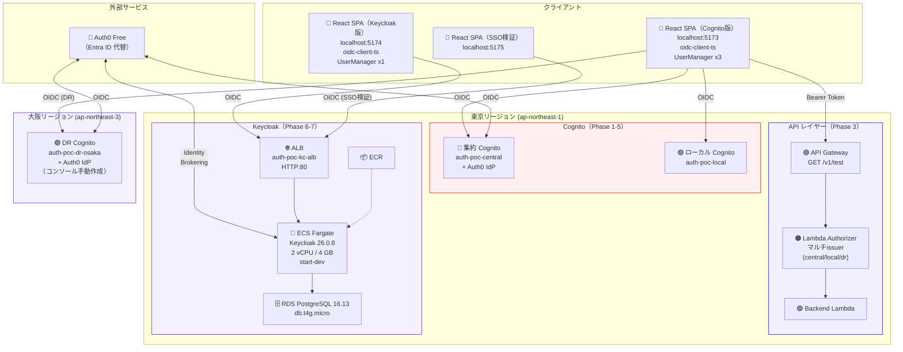

# 全体アーキテクチャ（PoC実構成）

**最終更新**: 2026-03-29（Phase 7 完了、全環境削除済み）

---

## 1. PoC 全体構成図

### 1.1 Cognito構成（Phase 1-5）+ Keycloak構成（Phase 6-7）



### 1.2 本番想定構成との対応

| 要素 | PoC | 本番想定 | 差異 |
|------|-----|---------|------|
| 集約Cognito | User Pool A（東京） | 共通認証基盤アカウント | アカウント分離のみ |
| ローカルCognito | User Pool B（東京） | 各サービスアカウント | 同上 |
| DR Cognito | User Pool C（大阪） | 共通認証基盤（大阪DR） | 同一構成 |
| 外部IdP | Auth0 Free | Entra ID / Okta | OIDC設定は同一構造 |
| JWKS取得 | HTTPS（3 User Pool） | クロスアカウント HTTPS | **動作差異なし** |
| API Gateway | 東京のみ | 各サービスアカウント | 大阪にはAPI GWなし |
| Keycloak | ECS Fargate + RDS | ECS Fargate + Aurora | start-dev → start --optimized + HTTPS |

---

## 2. コンポーネント一覧

### 2.1 Cognito（Phase 1-5）

| User Pool | リージョン | 名前 | 役割 | Auth0 IdP |
|-----------|----------|------|------|-----------|
| A（集約） | 東京 | auth-poc-central | 共通認証基盤 | Terraform |
| B（ローカル） | 東京 | auth-poc-local | パートナーユーザー | なし |
| C（DR） | 大阪 | auth-poc-dr-osaka | 災害復旧 | コンソール手動（※） |

※ 大阪の制限: [ADR-007](../adr/007-osaka-auth0-idp-limitation.md)

### 2.2 API Gateway + Lambda（Phase 3）

| リソース | 役割 | 詳細 |
|---------|------|------|
| API Gateway | REST API | GET /v1/test, CORS有効 |
| Lambda Authorizer | JWT検証 + 認可 | Python 3.11, PyJWT, マルチissuer(central/local/dr) |
| Backend Lambda | サンプルAPI | Context情報を返却 |

### 2.3 Keycloak（Phase 6-7）

| リソース | 名前 | 仕様 |
|---------|------|------|
| ALB | auth-poc-kc-alb | HTTP:80, ヘルスチェック: /realms/master |
| ECS Fargate | auth-poc-kc-service | 2 vCPU / 4 GB, Keycloak 26.0.8 (start-dev) |
| RDS PostgreSQL | auth-poc-kc-db | 16.13, db.t4g.micro, 停止可能 |
| ECR | auth-poc-kc-repo | カスタムKeycloakイメージ |
| Keycloak Realm | auth-poc | Client: auth-poc-spa / auth-poc-spa-2 |
| Identity Provider | auth0 | Auth0をOIDC IdPとしてBrokering |

### 2.4 React SPA

| アプリ | ポート | 接続先 | UserManager数 | 用途 |
|--------|:-----:|--------|:------------:|------|
| app/ | 5173 | Cognito (central/local/dr) | 3 | Phase 1-5: Cognito検証 |
| app-keycloak/ | 5174 | Keycloak (auth-poc-spa) | 1 | Phase 6-7: Keycloak検証 |
| app-keycloak-2/ | 5175 | Keycloak (auth-poc-spa-2) | 1 | Phase 7: SSO検証 |

### 2.5 Terraform state の分離

| state | ディレクトリ | 管理対象 | 独立destroy |
|-------|------------|---------|:-----------:|
| 東京 Cognito + API | infra/ | Cognito x2 + API GW + Lambda x2 | ✅ |
| 大阪 DR | infra/dr-osaka/ | DR Cognito | ✅ |
| Keycloak | infra/keycloak/ | ALB + ECS + RDS + ECR | ✅ |

---

## 3. 認証パターン一覧

### Cognito（Phase 1-5: 5パターン）

| # | パターン | フロー | Phase |
|---|---------|--------|:-----:|
| 1 | 集約Cognito Hosted UI | SPA → Cognito → PW認証 → SPA | 1 |
| 2 | Auth0 フェデレーション | SPA → Cognito → Auth0 → Cognito → SPA | 2 |
| 3 | ローカルCognito | SPA → ローカルCognito → PW認証 → SPA | 4 |
| 4 | DR Hosted UI | SPA → 大阪Cognito → PW認証 → SPA | 5 |
| 5 | DR Auth0 フェデレーション | SPA → 大阪Cognito → Auth0 → 大阪Cognito → SPA | 5 |

### Keycloak（Phase 6-7: 3パターン）

| # | パターン | フロー | Phase |
|---|---------|--------|:-----:|
| 6 | ローカルユーザー + MFA | SPA → Keycloak → PW + TOTP → SPA | 6-7 |
| 7 | Auth0 Identity Brokering | SPA → Keycloak → Auth0 → Keycloak(JIT) → SPA | 7 |
| 8 | SSO（複数Client） | Client A認証済み → Client B → PW/MFA不要 | 7 |

---

## 4. ディレクトリ構成

```
aws-auth-poc/
├── app/                          # React SPA（Cognito版, port:5173）
│   ├── src/
│   │   ├── auth/
│   │   │   ├── config.ts         # 集約Cognito OIDC設定（prefix: oidc.central.）
│   │   │   ├── localConfig.ts    # ローカルCognito設定（prefix: oidc.local.）
│   │   │   ├── drConfig.ts       # DR Cognito設定（prefix: oidc.dr.）
│   │   │   ├── AuthProvider.tsx  # 認証コンテキスト（3つのUserManager管理）
│   │   │   ├── CallbackPage.tsx  # OAuthコールバック（3 UserManager順番試行）
│   │   │   └── tokenUtils.ts    # JWTデコード
│   │   ├── components/           # AuthFlow / TokenViewer / ApiTester / LogViewer
│   │   └── pages/
│   ├── .env.example
│   └── vite.config.ts
│
├── app-keycloak/                 # React SPA（Keycloak版, port:5174）
│   ├── src/
│   │   ├── auth/
│   │   │   ├── config.ts         # Keycloak OIDC設定（OIDC Discovery自動）
│   │   │   ├── AuthProvider.tsx  # 認証コンテキスト（UserManager 1つ）
│   │   │   └── CallbackPage.tsx  # OAuthコールバック（シンプル）
│   │   ├── components/           # Cognito版と同構造
│   │   └── pages/
│   ├── .env.example
│   └── vite.config.ts            # port: 5174
│
├── app-keycloak-2/               # React SPA（SSO検証用, port:5175）
│   └── ...                       # app-keycloakのコピー、client_id=auth-poc-spa-2
│
├── keycloak/                     # Keycloakコンテナ・設定
│   ├── Dockerfile                # Keycloak 26.0 ベースイメージ
│   ├── docker-compose.yml        # ローカル開発用（参考）
│   ├── deploy.sh                 # ECRにpush + ECS更新
│   ├── stop.sh                   # ECS+RDS停止（コスト削減）
│   ├── start.sh                  # ECS+RDS起動
│   └── config/
│       ├── realm-export.json     # Realm設定（Git管理）
│       ├── export-realm.sh       # 設定エクスポート
│       └── import-realm.sh       # 設定インポート
│
├── infra/                        # Terraform（東京 Cognito + API Gateway）
│   ├── main.tf
│   ├── cognito.tf                # 集約Cognito + ローカルCognito + Auth0 IdP
│   ├── api-gateway.tf            # API GW + Lambda Authorizer + Backend + CloudWatch Logs
│   ├── outputs.tf
│   └── dr-osaka/                 # Terraform（大阪 DR Cognito）
│       ├── cognito.tf
│       └── outputs.tf
│
├── infra/keycloak/               # Terraform（Keycloak）★独立state
│   ├── main.tf                   # Provider + VPC + 自動IP取得
│   ├── security-groups.tf        # ALB/ECS/RDS の SG（IPアドレス自動取得）
│   ├── rds.tf                    # RDS PostgreSQL 16.13
│   ├── ecr.tf                    # ECRリポジトリ
│   ├── alb.tf                    # ALB + Target Group
│   ├── ecs.tf                    # ECS Fargate（2 vCPU / 4 GB）
│   └── outputs.tf                # URL + 停止/起動コマンド
│
├── lambda/
│   ├── authorizer/
│   │   ├── index.py              # JWT検証（マルチissuer: central/local/dr）
│   │   ├── requirements.txt
│   │   └── build.sh              # venv + Linux向けビルド
│   └── backend/
│       └── index.py              # サンプルAPI
│
└── doc/
    ├── design/                   # 設計・検証結果・手順
    ├── adr/                      # Architecture Decision Records（001-009）
    ├── reference/                # 参考情報（認証基礎/Cognito/Keycloak）
    └── old/                      # 過去の検討ドキュメント（読み取り専用）
```
