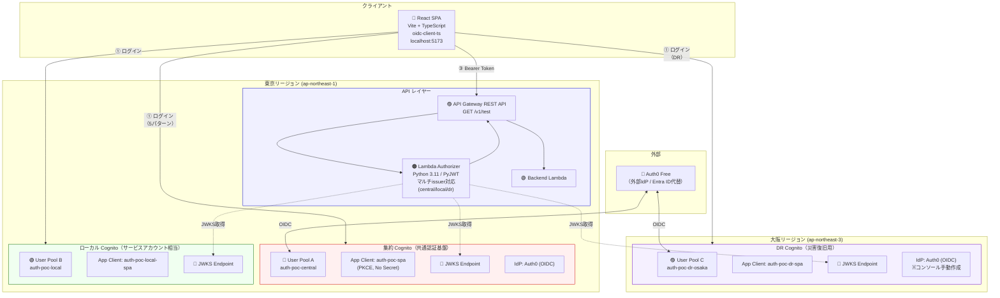

# 全体アーキテクチャ（PoC実構成）

**最終更新**: 2026-03-18（Phase 5 完了時点）

---

## 1. PoC 実構成図

### 1.1 全体構成



### 1.2 本番想定構成との対応

| 要素 | PoC | 本番想定 | 差異 |
|------|-----|---------|------|
| 集約Cognito | User Pool A（東京） | 共通認証基盤アカウント | アカウント分離のみ |
| ローカルCognito | User Pool B（東京） | 各サービスアカウント | 同上 |
| DR Cognito | User Pool C（大阪） | 共通認証基盤（大阪DR） | 同一構成 |
| 外部IdP | Auth0 Free | Entra ID / Okta | OIDC設定は同一構造 |
| JWKS取得 | HTTPS（3 User Pool） | クロスアカウント HTTPS | **動作差異なし** |
| API Gateway | 東京のみ | 各サービスアカウント | 大阪にはAPI GWなし |

---

## 2. コンポーネント一覧

### 2.1 Cognito User Pools

| User Pool | リージョン | 名前 | 役割 | Auth0 IdP |
|-----------|----------|------|------|-----------|
| A（集約） | 東京 | auth-poc-central | 共通認証基盤 | Terraform |
| B（ローカル） | 東京 | auth-poc-local | パートナーユーザー | なし |
| C（DR） | 大阪 | auth-poc-dr-osaka | 災害復旧 | コンソール手動（※） |

※ 大阪リージョンのCognitoからAuth0への`.well-known`自動検出が失敗するため、コンソール「Manual input」モードで作成し`terraform import`で管理。詳細: [ADR-007](../adr/007-osaka-auth0-idp-limitation.md)

### 2.2 Lambda

| Lambda | 役割 | ランタイム | 主要ライブラリ |
|--------|------|----------|-------------|
| auth-poc-authorizer | JWT検証 + 認可判定 | Python 3.11 | PyJWT[crypto] 2.9.0 |
| auth-poc-backend | サンプルAPI | Python 3.11 | 標準ライブラリのみ |

### 2.3 API Gateway

| 設定 | 値 |
|------|-----|
| タイプ | REST API |
| エンドポイント | GET /v1/test |
| 認可 | Lambda Authorizer (TOKEN, TTL 300秒) |
| CORS | Access-Control-Allow-Origin: * |

### 2.4 React SPA

| 設定 | 値 |
|------|-----|
| フレームワーク | React 19 + TypeScript + Vite 8 |
| 認証ライブラリ | oidc-client-ts |
| UserManager | 3つ（central/local/dr、各プレフィックス付きstateStore） |

---

## 3. ディレクトリ構成

```
aws-auth-poc/
├── app/                          # React SPA
│   ├── src/
│   │   ├── auth/
│   │   │   ├── config.ts         # 集約Cognito OIDC設定（prefix: oidc.central.）
│   │   │   ├── localConfig.ts    # ローカルCognito設定（prefix: oidc.local.）
│   │   │   ├── drConfig.ts       # DR Cognito設定（prefix: oidc.dr.）
│   │   │   ├── AuthProvider.tsx  # 認証コンテキスト（3つのUserManager管理）
│   │   │   ├── CallbackPage.tsx  # OAuthコールバック（3 UserManager順番試行）
│   │   │   └── tokenUtils.ts    # JWTデコード
│   │   ├── components/
│   │   │   ├── AuthFlow/         # 認証状態 + フロー図
│   │   │   ├── TokenViewer/      # トークンデコード表示
│   │   │   ├── ApiTester/        # API呼び出しテスト
│   │   │   └── LogViewer/        # 認証イベントログ
│   │   └── pages/
│   │       └── HomePage.tsx
│   ├── .env                      # 環境変数（git対象外）
│   └── .env.example              # 環境変数テンプレート
│
├── infra/                        # Terraform（東京リージョン）
│   ├── main.tf                   # プロバイダ
│   ├── variables.tf              # 変数（Auth0, DR設定含む）
│   ├── cognito.tf                # 集約Cognito + ローカルCognito + Auth0 IdP
│   ├── api-gateway.tf            # API GW + Lambda Authorizer + Backend
│   ├── outputs.tf                # 出力（SPA .env値含む）
│   └── dr-osaka/                 # Terraform（大阪リージョン）
│       ├── main.tf
│       ├── variables.tf
│       ├── cognito.tf            # DR Cognito + Auth0 IdP（手動import）
│       └── outputs.tf
│
├── lambda/
│   ├── authorizer/
│   │   ├── index.py              # JWT検証（マルチissuer: central/local/dr）
│   │   ├── requirements.txt
│   │   └── build.sh              # venv + Linux向けビルド
│   └── backend/
│       └── index.py              # サンプルAPI
│
└── doc/
    ├── design/                   # 最新設計ドキュメント
    ├── adr/                      # Architecture Decision Records
    ├── reference/                # 参考情報
    └── old/                      # 過去の検討ドキュメント（読み取り専用）
```
