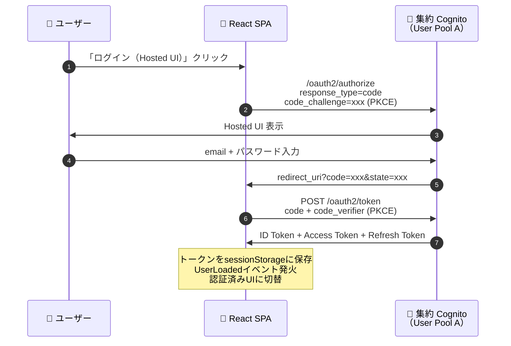
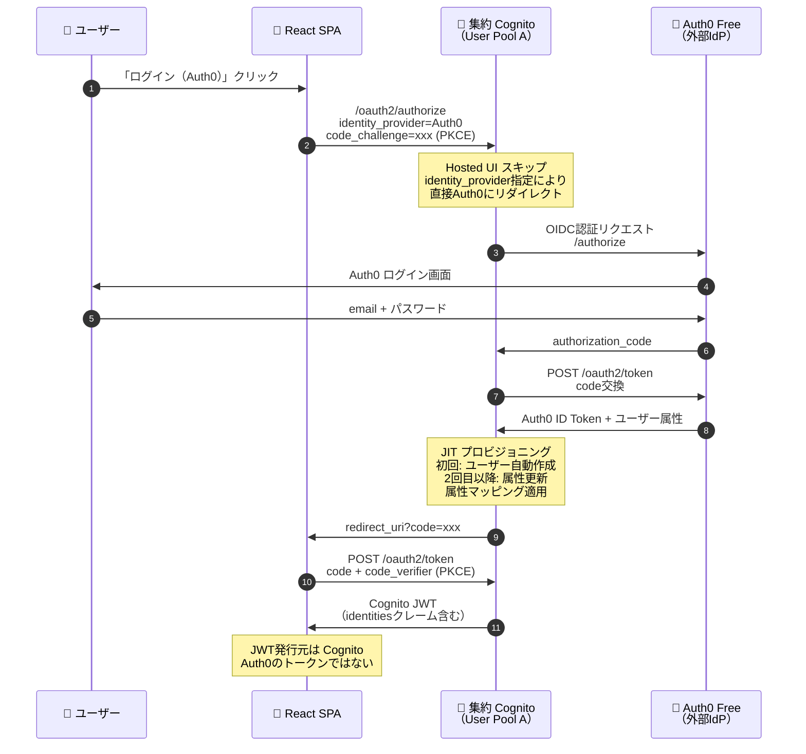
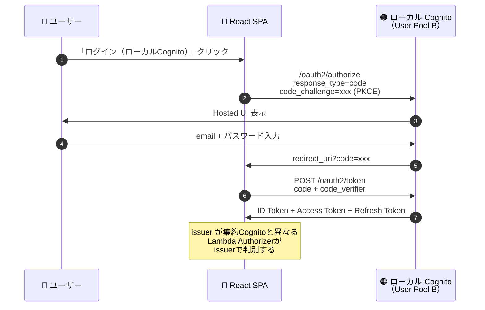
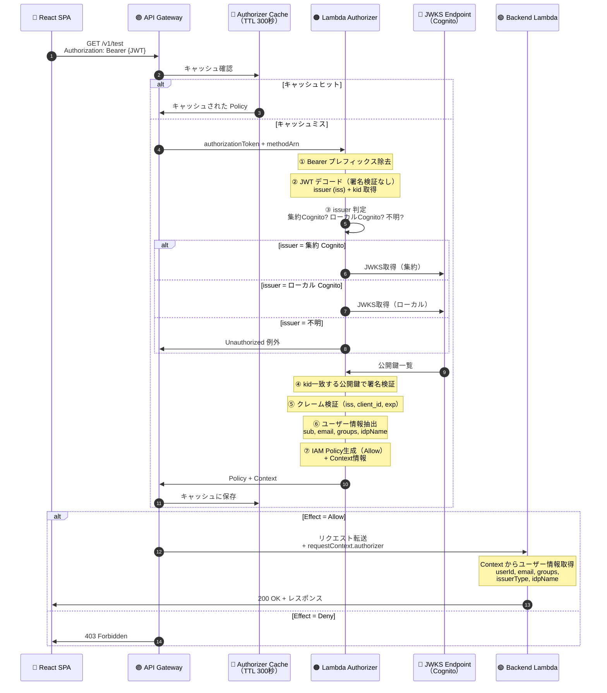
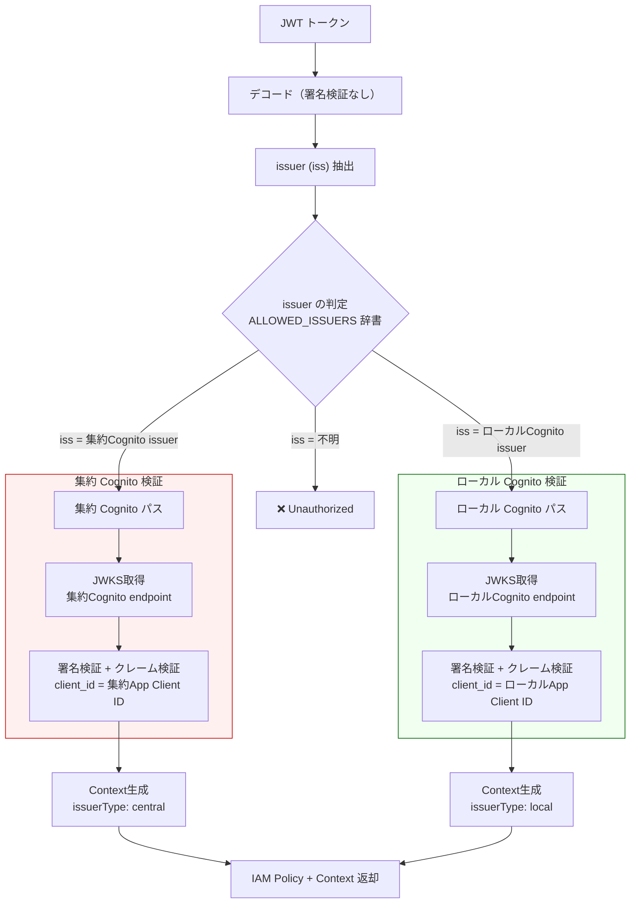
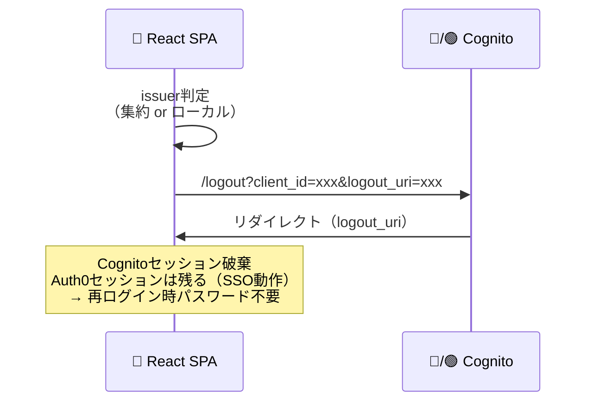
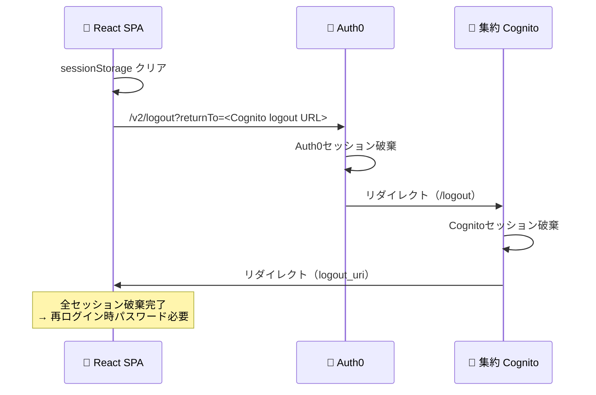

# 認証フロー設計（PoC実装済み）

**最終更新**: 2026-03-17（Phase 4 完了時点）
**ベースドキュメント**: `doc/old/authentication-authorization-detail.md`

---

## 1. 認証パターン一覧

本PoCでは3種類の認証パターンを実装・検証済み。

| パターン | 経路 | issuerType | 用途（本番想定） |
|---------|------|------------|--------------|
| A. Hosted UI ログイン | SPA → 集約Cognito Hosted UI → SPA | central | 管理者・テストユーザー |
| B. フェデレーション（Auth0） | SPA → 集約Cognito → Auth0 → 集約Cognito → SPA | central | 顧客企業ユーザー（Entra ID/Okta） |
| C. ローカルCognito | SPA → ローカルCognito Hosted UI → SPA | local | パートナー企業ユーザー |

---

## 2. パターンA: Hosted UI ログイン（集約Cognito ローカルユーザー）

**ポイント**:
- Authorization Code Flow + PKCE
- Client Secretなし（SPA用App Client）
- oidc-client-ts が PKCE を自動処理

---

## 3. パターンB: フェデレーション認証（Auth0 = 外部IdP）

**ポイント**:
- `identity_provider=Auth0` パラメータでHosted UIをスキップ
- CognitoとAuth0間でOIDC Authorization Code Flowが実行される
- Cognitoが**自身のJWT**を発行（Auth0のトークンではない）
- `identities`クレームにフェデレーション元の情報が含まれる
- JITプロビジョニング: 初回ログイン時にCognito User Pool内にユーザーエントリが自動作成

---

## 4. パターンC: ローカルCognito ログイン

**ポイント**:
- フローはパターンAと同じだが、**issuer（User Pool ID）が異なる**
- Lambda Authorizerが issuer で集約/ローカルを判別

---

## 5. API 認可フロー（全パターン共通）

**ポイント**:
- Lambda Authorizerは**ALLOWED_ISSUERS辞書**でissuerを判定
- Cognitoアクセストークンは`aud`ではなく`client_id`クレームを使用（PyJWTの`verify_aud`をオフにして手動検証）
- JWKSはキャッシュ付き（TTL 1時間、Lambda内メモリ）
- API Gatewayもキャッシュ（TTL 5分、トークン値がキー）

---

## 6. Lambda Authorizer マルチissuer判定

---

## 7. ログアウトフロー

### 7.1 通常ログアウト（Cognitoセッションのみ破棄）

### 7.2 完全ログアウト（SSO破棄）

---

## 8. 検証結果サマリー

### 確認済み項目

| 項目 | パターンA Hosted UI | パターンB Auth0連携 | パターンC ローカルCognito |
|------|:---:|:---:|:---:|
| ログイン | ✅ | ✅ | ✅ |
| JWT取得（3種） | ✅ | ✅ | ✅ |
| トークンデコード表示 | ✅ | ✅ | ✅ |
| identitiesクレーム | - | ✅ | - |
| JITプロビジョニング | - | ✅ | - |
| API呼び出し（トークンあり） | ✅ 200 | ✅ 200 | ✅ 200 |
| API呼び出し（トークンなし） | ✅ 401 | ✅ 401 | ✅ 401 |
| issuerType判定 | central | central | local |
| 通常ログアウト | ✅ | ✅（SSO残る） | ✅ |
| 完全ログアウト | ✅ | ✅（SSO破棄） | ✅ |

### 確認された技術的知見

| 知見 | 詳細 |
|------|------|
| Cognitoアクセストークンに`aud`がない | `client_id`クレームで代替。PyJWTの`verify_aud`をオフにして手動検証が必要 |
| JWKSは公開エンドポイント | クロスアカウントでもIAM設定不要。PoCと本番で動作差異なし |
| SSOセッションはIdP側に残る | Cognitoログアウトだけでは外部IdPのセッションは破棄されない。完全ログアウトには多段リダイレクトが必要 |
| Lambda依存ライブラリのビルド | macOSでビルドしたcryptographyはLambda(Linux)で動かない。`--platform manylinux2014_x86_64`が必要 |
| oidc-client-tsのUserManager共有 | CallbackPageで別インスタンスを作るとUserLoadedイベントが伝わらない。Contextで共有する必要がある |
