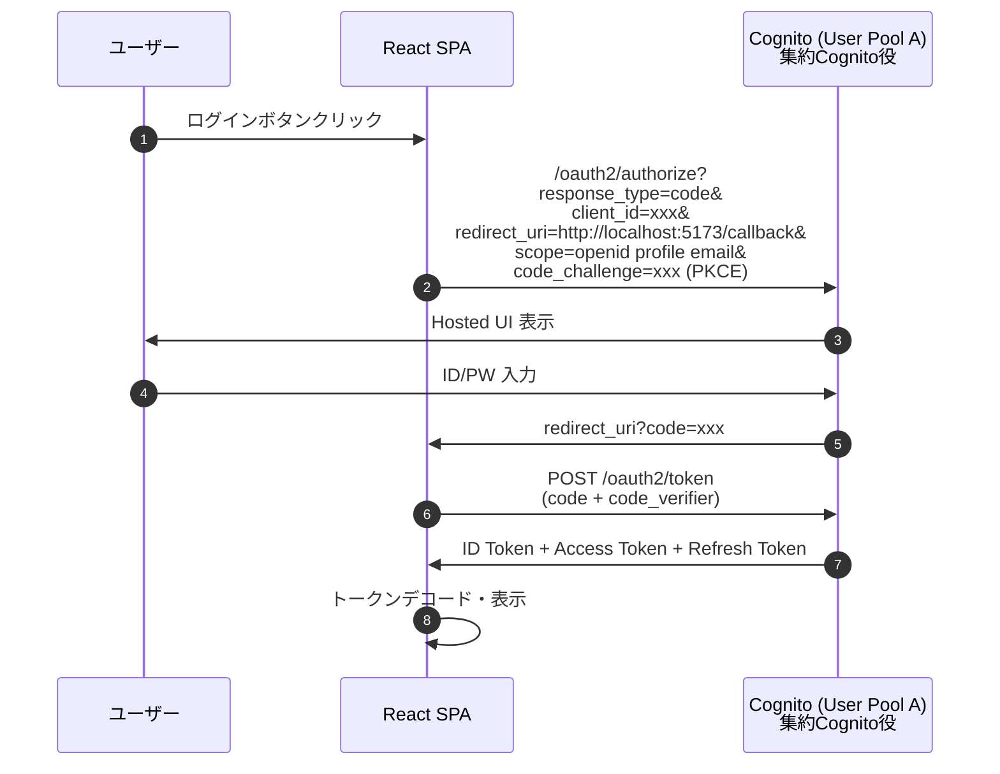
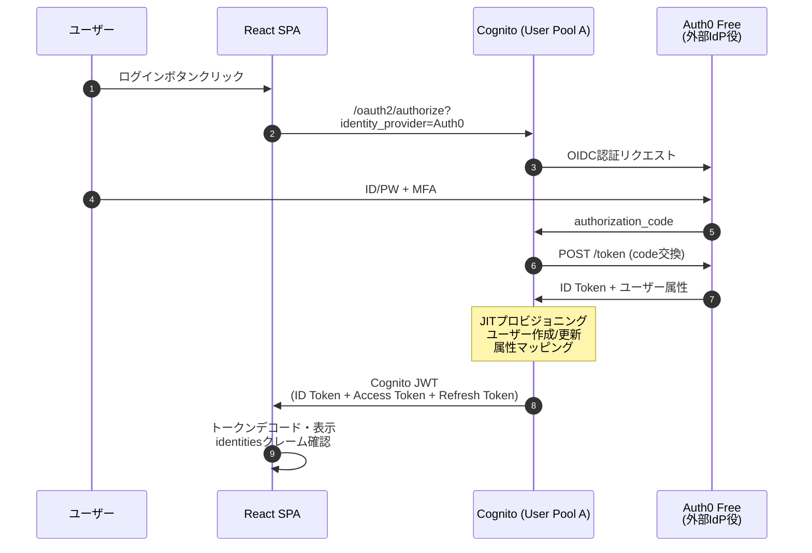
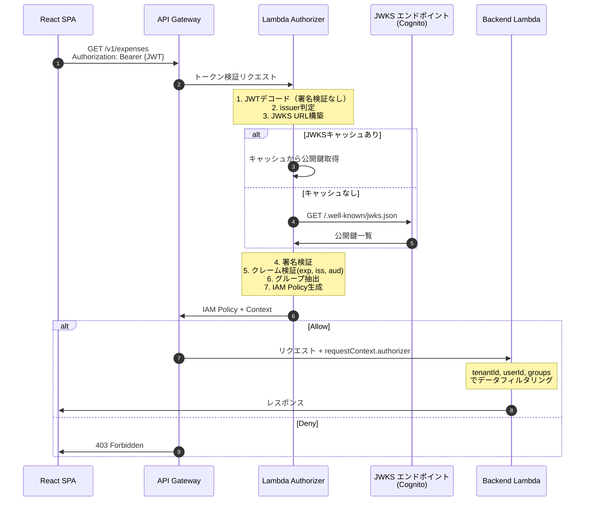
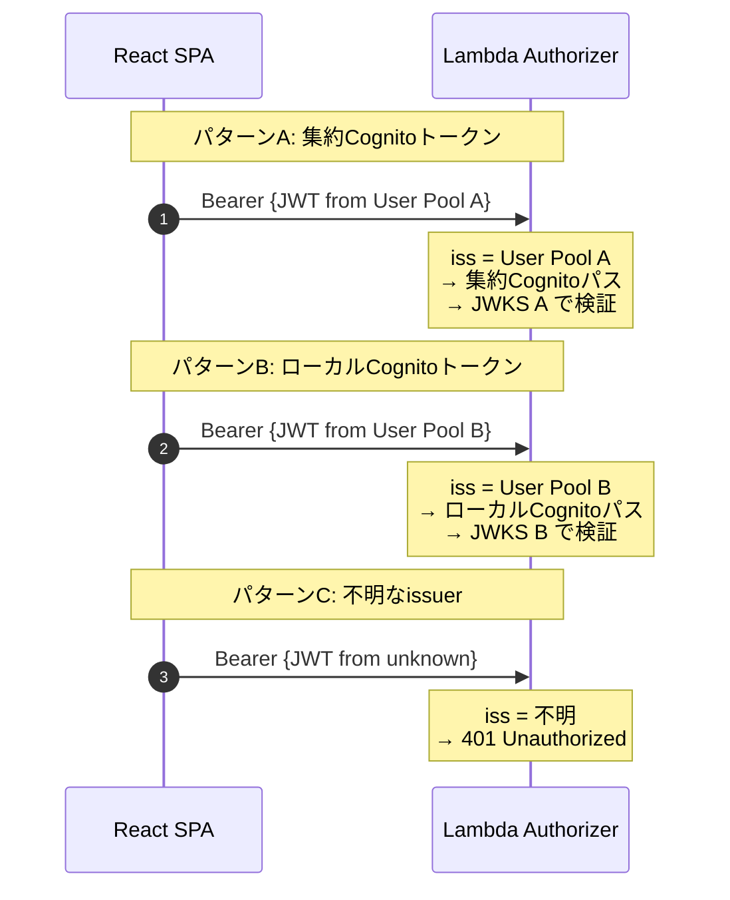

# 認証フロー設計

**最終更新**: 2026-03-17
**ベースドキュメント**: `doc/old/authentication-authorization-detail.md`

---

## Phase 1: 基本認証フロー（Hosted UI）

**検証ポイント:**
- Authorization Code Flow + PKCE の完全な動作
- 3種類のトークンの取得と内容確認
- トークンの有効期限、リフレッシュ動作

---

## Phase 2: フェデレーション認証（Auth0 = 外部IdP）

**検証ポイント:**
- CognitoとAuth0間のOIDCフェデレーション
- JITプロビジョニング（初回ログイン時のユーザー自動作成）
- 属性マッピング（Auth0の属性→Cognitoカスタム属性）
- `identities`クレームの内容確認

---

## Phase 3: 認可（Lambda Authorizer）

**検証ポイント:**
- Lambda AuthorizerのJWT検証全ステップ
- IAM Policy生成とAPI GatewayのPolicy評価
- Context伝播（authorizer→Backend）
- キャッシュ動作（TTL 300秒）

---

## Phase 4: ハイブリッド構成（マルチissuer）

**検証ポイント:**
- マルチissuer対応の動作確認
- issuer判定ロジック（ALLOWED_ISSUERS）
- 集約/ローカルで異なるクレーム内容の確認

---

## 詳細リファレンス

認証フローの網羅的な詳細は `doc/old/authentication-authorization-detail.md` を参照。
本ドキュメントはPoC実装に必要な部分を抽出・整理したもの。
