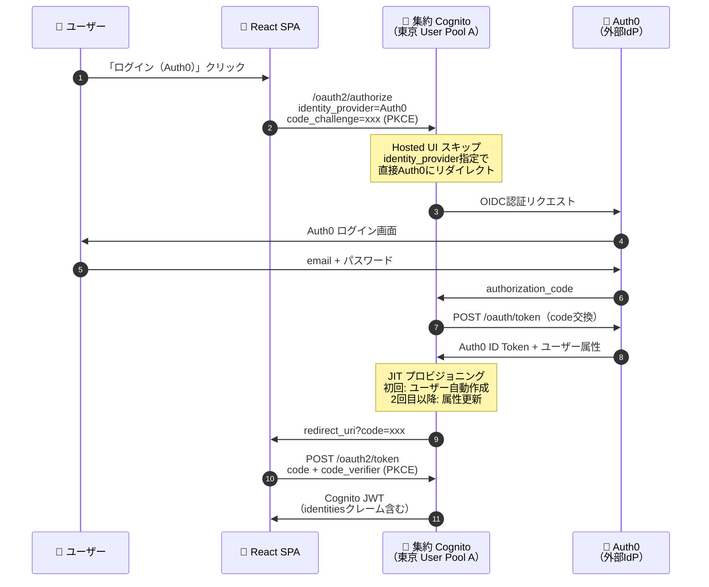
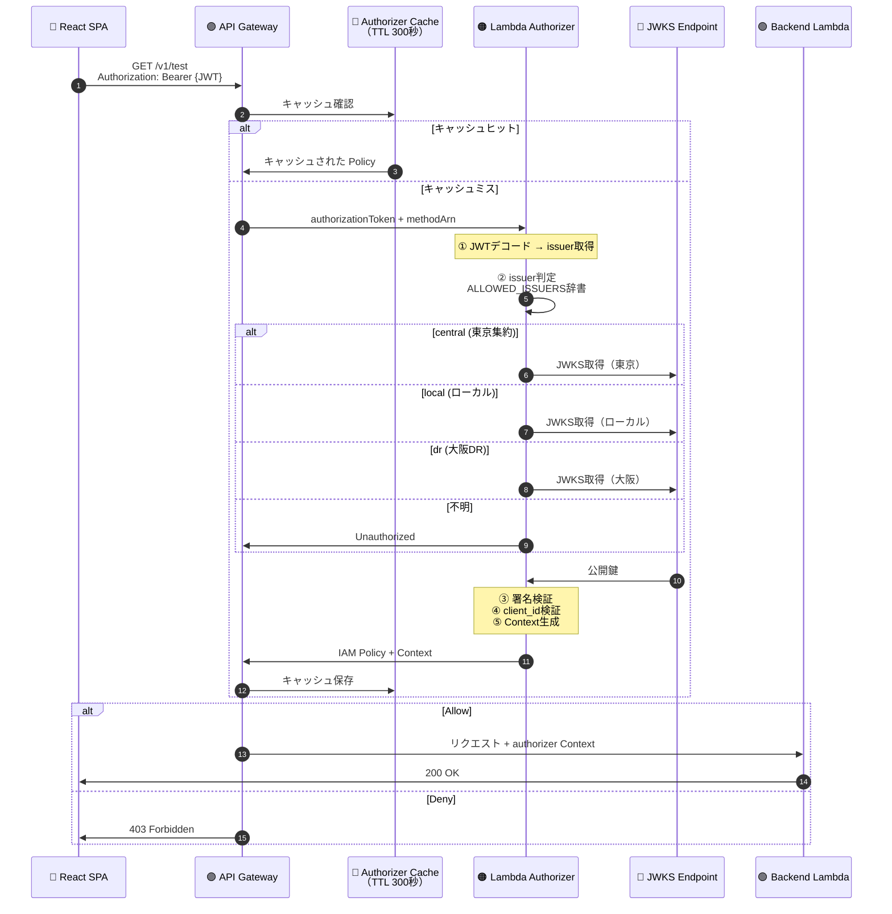
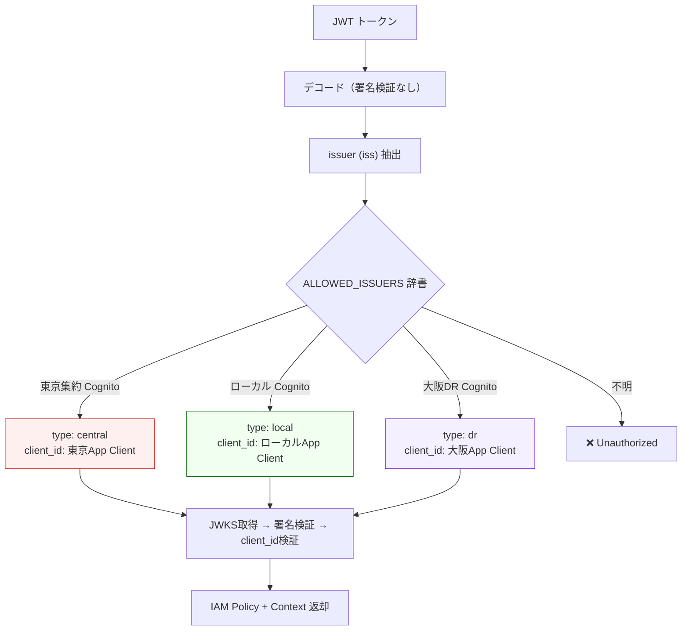
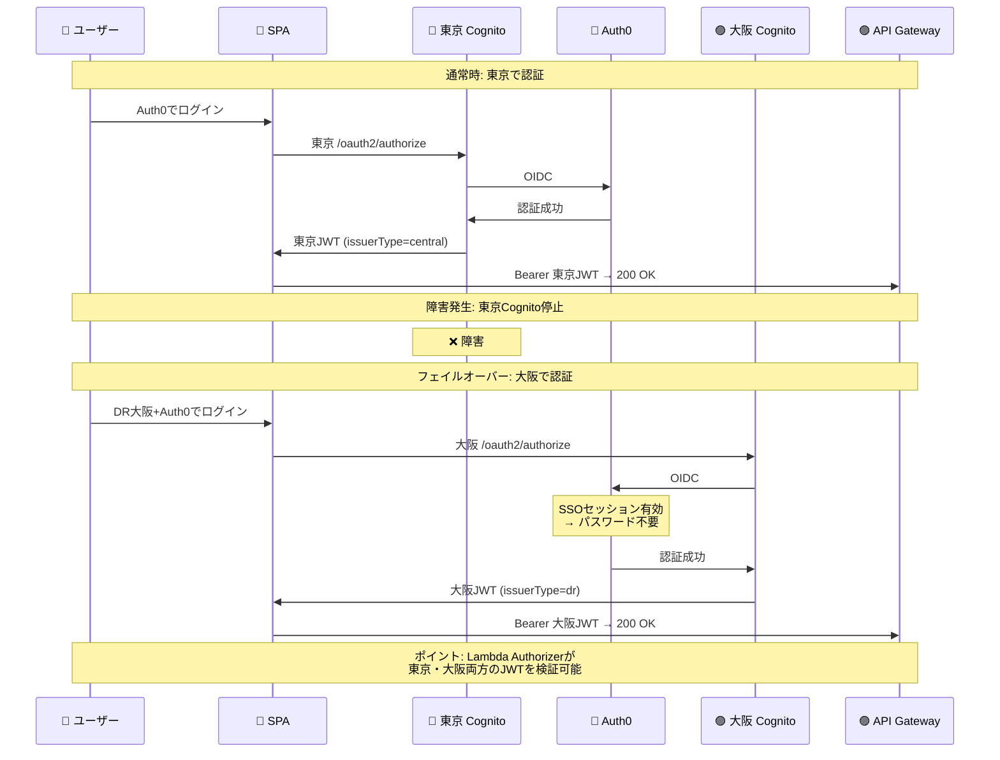
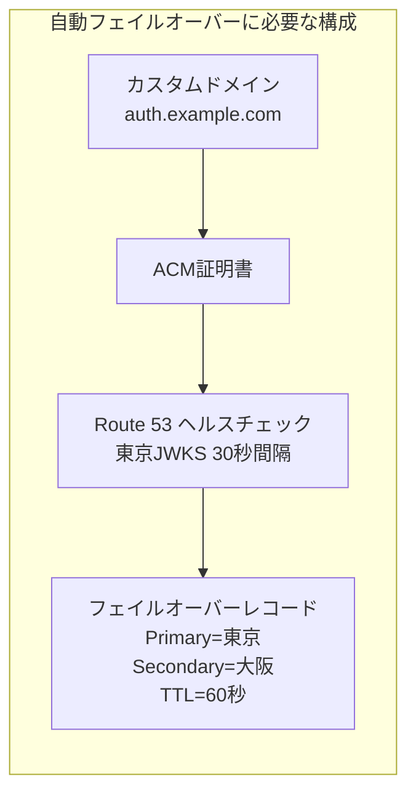
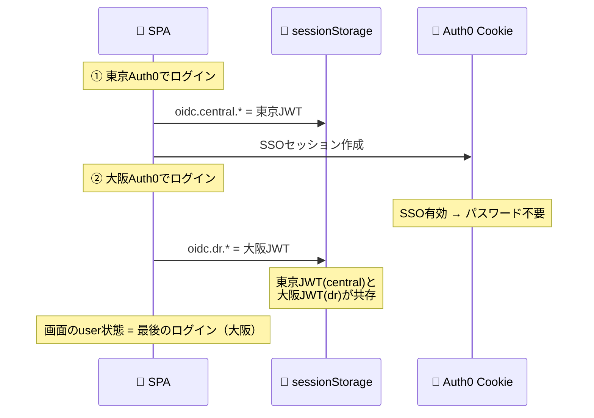

# 認証フロー設計（PoC実装済み）

**最終更新**: 2026-03-18（Phase 5 完了時点）
**ベースドキュメント**: `doc/old/authentication-authorization-detail.md`

---

## 1. 認証パターン一覧

本PoCでは5種類の認証パターンを実装・検証済み。

| # | パターン | Cognito | 経路 | issuerType |
|---|---------|---------|------|------------|
| A | Hosted UI ログイン | 集約（東京） | SPA → 東京Hosted UI → SPA | central |
| B | Auth0 フェデレーション | 集約（東京） | SPA → 東京 → Auth0 → 東京 → SPA | central |
| C | ローカルCognito | ローカル（東京） | SPA → ローカルHosted UI → SPA | local |
| D | DR Hosted UI | DR（大阪） | SPA → 大阪Hosted UI → SPA | dr |
| E | DR Auth0 フェデレーション | DR（大阪） | SPA → 大阪 → Auth0 → 大阪 → SPA | dr |

---

## 2. パターンB: フェデレーション認証（Auth0 経由）

最も複雑で重要なフロー。本番の「Cognito ↔ Entra ID」に相当。



---

## 3. API 認可フロー（全パターン共通）



---

## 4. Lambda Authorizer マルチissuer判定



---

## 5. ログアウトフロー

### 5.1 ログアウト種別

| ボタン | 動作 | IdPセッション |
|--------|------|-------------|
| ログアウト | ログイン元Cognitoのセッション破棄 | 残る（SSO動作） |
| 完全ログアウト（SSO破棄） | Auth0 → Cognito の多段ログアウト | 破棄される |

### 5.2 ログアウト先の判定

```mermaid
flowchart TB
    Start["ログアウト開始"] --> GetType["JWTのissからユーザー種別判定"]
    GetType --> Type{getUserType()}

    Type -->|"central"| CentralLogout["集約Cognito /logout"]
    Type -->|"local"| LocalLogout["ローカルCognito /logout"]
    Type -->|"dr"| DRLogout["大阪DR Cognito /logout"]

    subgraph FullLogout["完全ログアウト（SSO破棄）の場合"]
        CentralLogout --> Auth0Central["Auth0 /v2/logout\n→ 集約Cognito /logout\n→ SPA"]
        DRLogout --> Auth0DR["Auth0 /v2/logout\n→ 大阪Cognito /logout\n→ SPA"]
    end

    LocalLogout --> SPALocal["→ SPA\n（Auth0セッションなし）"]
```

### 5.3 Auth0 Allowed Logout URLs 設定

完全ログアウトのreturnToに指定するURL。**URLエンコード済み**の完全一致で登録が必要：

```
https://auth-poc-central.auth.ap-northeast-1.amazoncognito.com/logout?client_id=<東京CLIENT_ID>&logout_uri=http%3A%2F%2Flocalhost%3A5173%2F
https://auth-poc-dr-osaka.auth.ap-northeast-3.amazoncognito.com/logout?client_id=<大阪CLIENT_ID>&logout_uri=http%3A%2F%2Flocalhost%3A5173%2F
```

---

## 6. DR フェイルオーバーの検証

### 6.1 フェイルオーバーシナリオ



### 6.2 DR検証での確認事項

| 項目 | 結果 | 備考 |
|------|------|------|
| 大阪Cognito Hosted UIログイン | ✅ | |
| 大阪Auth0フェデレーション | ✅ | コンソール手動作成 |
| 大阪JWTでAPI認可（issuerType=dr） | ✅ | |
| Auth0 SSOでパスワード不要 | ✅ | IdPセッション維持 |
| ログアウト（通常/完全） | ✅ | getUserTypeで大阪判定 |
| **Route 53 自動フェイルオーバー** | **未検証** | 本番フェーズで実施 |

### 6.3 自動フェイルオーバー（本番フェーズで実施）

PoCでは**手動切替**（ボタン選択）で大阪Cognitoの動作を確認した。
本番では以下の構成でユーザーが意識しない自動切替を実現する。



- 切替時間: ヘルスチェック失敗検知（約90秒） + DNS TTL（60秒） = **約2.5分**
- 切替後はAuth0 SSOでパスワード再入力不要
- 詳細は [poc-results.md](poc-results.md) のDRセクションを参照

---

## 7. 同一ブラウザでの複数Cognitoログイン（PoC固有の挙動）

PoCでは1つのSPAから東京・大阪・ローカルの3つのCognitoにログインできるため、同一ブラウザで複数のJWTが共存する場合がある。本番ではカスタムドメイン統一によりこの状況は発生しない。

### 7.1 セッションの保存場所

| セッション | 保存場所 | スコープ |
|-----------|---------|---------|
| 東京 JWT | sessionStorage `oidc.central.*` | ブラウザタブ単位 |
| ローカル JWT | sessionStorage `oidc.local.*` | ブラウザタブ単位 |
| 大阪 JWT | sessionStorage `oidc.dr.*` | ブラウザタブ単位 |
| Auth0 SSOセッション | Auth0 Cookie（`auth0.com`） | **ブラウザ全体で共有** |

### 7.2 東京→大阪の順でAuth0ログインした場合



### 7.3 API呼び出し

SPAは現在の`user`状態のJWTをBearerトークンとして送信する。Lambda Authorizerは`ALLOWED_ISSUERS`に東京・大阪両方を登録しているため、**どちらのJWTでもAPI認可は成功する**。

### 7.4 ログアウト時の挙動

| 操作 | 破棄されるもの | 残るもの |
|------|-------------|---------|
| ログアウト（通常） | 現在表示中のCognito（例: 大阪）のセッション | 東京JWT + Auth0 SSOセッション |
| 完全ログアウト（SSO破棄） | Auth0 SSOセッション + 現在のCognitoセッション | **もう片方のJWT（sessionStorage内）** |
| 完全ログアウト後にページリロード | - | AuthProviderが初期化時にsessionStorageを走査し、残存JWTを発見 → **認証済み状態に復元** |

### 7.5 本番との違い

| 観点 | PoC | 本番 |
|------|-----|------|
| Cognito接続先 | 3つのCognito（ボタン選択） | 1つのカスタムドメイン（Route 53で自動切替） |
| JWT共存 | 複数のJWTがsessionStorageに共存し得る | 常に1つのCognitoからのJWTのみ |
| ログアウト | 現在のCognitoのみ破棄、他が残る場合あり | 1つのCognitoのみなので問題なし |
| Auth0 SSO | 全Cognitoで共有（正常動作） | 同様（正常動作） |

**結論**: この挙動はPoCの検証用UI（複数ログインボタン）に起因するものであり、本番のカスタムドメイン統一構成では発生しない。PoCの動作確認時は**テスト前にsessionStorageをクリアする**ことで混乱を避けられる。

---

## 8. 技術的知見サマリー

| 知見 | 詳細 |
|------|------|
| Cognitoアクセストークンに`aud`がない | `client_id`クレームで代替検証 |
| JWKSは公開エンドポイント | クロスアカウント・クロスリージョンでもIAM不要 |
| SSOセッションはIdP側に残る | 完全ログアウトには多段リダイレクトが必要 |
| 大阪CognitoからAuth0の.well-known検出が失敗 | コンソール「Manual input」で回避（ADR-007） |
| マルチUserManagerのstateStore衝突 | プレフィックス分離が必須（oidc.central./oidc.local./oidc.dr.） |
| Auth0 Allowed Logout URLsはURLエンコード済み完全一致 | returnToパラメータと完全に一致する形で登録 |
