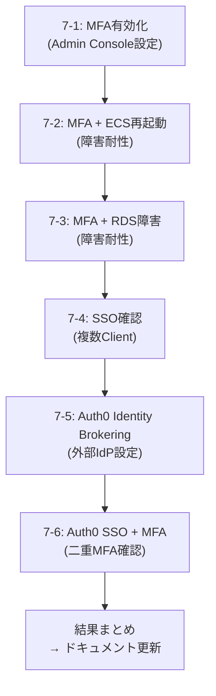

# Phase 7: MFA・SSO・Auth0 検証シナリオ

**作成日**: 2026-03-26

---

## 目的

Keycloak環境でMFA・SSO・Auth0連携を検証し、Cognito構成との違いを明らかにする。

---

## シナリオ7-1: Keycloak MFA（TOTP）有効化

### 目的
ローカルユーザーにTOTP MFAを設定し、ログインフローを確認する。

### 事前準備
- Keycloak Admin Console にアクセス可能
- Google Authenticator 等のTOTPアプリを用意

### 手順

| # | 操作 | 期待結果 |
|---|------|---------|
| 1 | Admin Console → `auth-poc` realm → Authentication → Required actions → `Configure OTP` を **Default Action** に設定 | 全ユーザーに次回ログイン時TOTP登録を強制 |
| 2 | SPA (localhost:5174) → ログイン → test@example.com / TestUser1! | TOTP登録画面が表示される（QRコード） |
| 3 | Google Authenticator でQRコードをスキャン → コード入力 | TOTP登録完了 → SPA にリダイレクト |
| 4 | ログアウト → 再ログイン → PW入力 | TOTP入力画面が表示される |
| 5 | TOTPコード入力 | ログイン成功 |
| 6 | トークンビューアーで確認 | `acr` クレームに認証レベルが含まれるか確認 |

### Cognito との対比
| 観点 | Cognito | Keycloak |
|------|---------|----------|
| MFA有効化 | User Pool設定（Terraform） | Admin Console → Authentication |
| TOTP登録 | Hosted UI 内で自動 | Keycloakログイン画面内で自動 |
| MFA強制タイミング | Required / Optional | **Required Actions で柔軟に制御** |

### 結果
| 確認項目 | 結果 | 備考 |
|---------|:----:|------|
| TOTP登録画面表示 | ⬜ | |
| TOTP登録→ログイン成功 | ⬜ | |
| 再ログイン時TOTP要求 | ⬜ | |

---

## シナリオ7-2: MFA + ECS再起動（障害耐性）

### 目的
MFAデータ（TOTPシークレット）がECS再起動後も維持されるか確認する。

### 手順

| # | 操作 | 期待結果 |
|---|------|---------|
| 1 | シナリオ7-1完了状態（TOTP登録済み） | |
| 2 | ECSタスク停止: `aws ecs update-service --cluster auth-poc-kc-cluster --service auth-poc-kc-service --desired-count 0` | Keycloak停止 |
| 3 | ECSタスク起動: `aws ecs update-service ... --desired-count 1` | Keycloak起動（2-3分） |
| 4 | SPA → ログイン → PW入力 | TOTP入力画面が表示される |
| 5 | 元のTOTPコード入力 | **ログイン成功（TOTP再登録不要）** |

### 確認ポイント
- MFAデータは `credential` テーブル（RDS）に保存 → ECS再起動で消えない
- Cognito でも同様（マネージドなので当然だが、仕組みが異なる）

### 結果
| 確認項目 | 結果 | 備考 |
|---------|:----:|------|
| ECS再起動後にTOTP有効 | ⬜ | |
| TOTP再登録不要 | ⬜ | |

---

## シナリオ7-3: MFA + RDS障害（障害耐性）

### 目的
RDS停止→復旧後にMFAデータが維持されるか確認する。

### 手順

| # | 操作 | 期待結果 |
|---|------|---------|
| 1 | TOTP登録済み状態 | |
| 2 | RDS停止: `aws rds stop-db-instance --db-instance-identifier auth-poc-kc-db` | RDS停止（5-10分） |
| 3 | RDS停止完了を確認 | `stopped` 状態 |
| 4 | SPA → ログイン試行 | **失敗**（Keycloak→RDS接続エラー → Keycloak停止） |
| 5 | RDS起動: `aws rds start-db-instance --db-instance-identifier auth-poc-kc-db` | RDS起動（5-10分） |
| 6 | ECSタスクが自動再起動するのを待つ | Keycloak復旧 |
| 7 | SPA → ログイン → PW入力 → TOTP入力 | **ログイン成功（MFAデータ維持）** |

### 確認ポイント
- `credential` テーブルはRDSの永続データ → RDS再起動で消えない
- RDS停止中はKeycloakも停止する（Phase 6 シナリオ3-2で確認済み）

### 結果
| 確認項目 | 結果 | 備考 |
|---------|:----:|------|
| RDS復旧後にTOTP有効 | ⬜ | |
| TOTP再登録不要 | ⬜ | |

---

## シナリオ7-4: SSO確認（複数Client）

### 目的
同一Realm内の複数ClientでSSOが動作するか確認する。

### 事前準備
Admin Console → `auth-poc` realm → Clients → **Create client** で2つ目のClientを作成:

| 項目 | 値 |
|------|-----|
| Client ID | `auth-poc-spa-2` |
| Client Authentication | OFF（Public） |
| Standard Flow | ON |
| Valid Redirect URIs | `http://localhost:5175/*` |
| Web Origins | `http://localhost:5175` |

→ `app-keycloak` をコピーしてポート5175で起動するか、同じSPAの別タブで検証

### 手順

| # | 操作 | 期待結果 |
|---|------|---------|
| 1 | SPA-A (localhost:5174, client=auth-poc-spa) → ログイン → PW + TOTP | ログイン成功 |
| 2 | SPA-B (localhost:5175, client=auth-poc-spa-2) → ログインボタン | **PW/TOTP入力なしでログイン成功**（SSO） |
| 3 | Admin Console → Sessions | 1つのSSOセッションに2つのClient Sessionが紐づいている |
| 4 | SPA-A → ログアウト | SPA-Aからログアウト |
| 5 | SPA-B → ページリロード or API呼び出し | **SPA-Bも無効化されているか**（Back-Channel Logout） |

### Cognito との対比
| 観点 | Cognito + Auth0 | Keycloak |
|------|----------------|----------|
| SSO範囲 | Auth0セッション経由（User Pool横断） | **Realm内の全Client（ネイティブ）** |
| SSO時に外部通信 | Auth0に毎回リダイレクト | **Keycloak内で完結（高速）** |
| Back-Channel Logout | 非対応 | **対応** |

### 結果
| 確認項目 | 結果 | 備考 |
|---------|:----:|------|
| Client AログインでClient BがSSO | ⬜ | |
| TOTP再入力不要 | ⬜ | |
| Client Aログアウト→Client B無効 | ⬜ | |

---

## シナリオ7-5: Auth0 Identity Brokering

### 目的
Auth0をKeycloakの外部IdPとして設定し、フェデレーション認証を確認する。

### 事前準備

#### Auth0 側
1. Auth0 Dashboard → Applications → Create Application → **Regular Web Application**
2. Settings:
   - Allowed Callback URLs: `http://auth-poc-kc-alb-256501875.ap-northeast-1.elb.amazonaws.com/realms/auth-poc/broker/auth0/endpoint`
   - Allowed Logout URLs: `http://auth-poc-kc-alb-256501875.ap-northeast-1.elb.amazonaws.com/realms/auth-poc/broker/auth0/endpoint/logout_response`
3. Domain, Client ID, Client Secret をメモ

#### Keycloak 側
1. Admin Console → `auth-poc` realm → Identity Providers → Add Provider → **OpenID Connect v1.0**
2. 設定:

| 項目 | 値 |
|------|-----|
| Alias | `auth0` |
| Display Name | `Login with Auth0` |
| Discovery Endpoint | `https://<auth0-domain>/.well-known/openid-configuration` |
| Client ID | Auth0のClient ID |
| Client Secret | Auth0のClient Secret |
| Client Authentication | Client secret sent as post |
| Default Scopes | `openid profile email` |
| Trust Email | ON |

### 手順

| # | 操作 | 期待結果 |
|---|------|---------|
| 1 | SPA → ログイン画面 | 「Login with Auth0」ボタンが表示される |
| 2 | 「Login with Auth0」クリック | Auth0ログイン画面にリダイレクト |
| 3 | Auth0でユーザー作成 or 既存ユーザーでログイン | Auth0認証成功 → Keycloakに戻る |
| 4 | 初回: Keycloakアカウントリンク画面 | メールアドレス確認 or 自動リンク |
| 5 | SPA にリダイレクト | ログイン成功 |
| 6 | トークンビューアー確認 | issuer=Keycloak（Auth0ではない）、ユーザー属性がマッピングされている |
| 7 | Admin Console → Users | フェデレーションユーザーが作成されている（`federated_identity` テーブル） |

### Cognito との対比
| 観点 | Cognito + Auth0 | Keycloak + Auth0 |
|------|----------------|-----------------|
| 設定方法 | Terraform（OIDC IdP設定） | Admin Console（Identity Providers） |
| トークン発行元 | Cognito | **Keycloak**（Auth0ではない） |
| JITプロビジョニング | 自動（identities クレーム付与） | 自動（federated_identity テーブル） |

### 結果
| 確認項目 | 結果 | 備考 |
|---------|:----:|------|
| Auth0ログイン画面表示 | ⬜ | |
| Auth0認証→Keycloakに戻る | ⬜ | |
| JITプロビジョニング | ⬜ | |
| トークンのissuer=Keycloak | ⬜ | |

---

## シナリオ7-6: Auth0 SSO + MFA

### 目的
Auth0経由でログイン後のSSO動作と、MFAの二重要求がないことを確認する。

### 事前準備
- Auth0 Dashboard → Security → Multi-factor Auth → **Enable** (TOTP)
- シナリオ7-5完了（Auth0 IdP設定済み）

### 手順

| # | 操作 | 期待結果 |
|---|------|---------|
| 1 | SPA-A → 「Login with Auth0」→ Auth0でPW + Auth0 MFA（TOTP） | SPA-Aログイン成功 |
| 2 | SPA-B → ログインボタン | **PW/MFA不要でログイン**（Keycloak SSOセッション有効） |
| 3 | Keycloak MFAが要求されないことを確認 | **Auth0 MFAとKeycloak MFAが二重にならない** |
| 4 | ログアウト → 再度Auth0でログイン | Auth0セッション有効なら**Auth0 MFAもスキップ** |

### MFA責任の確認

```
Auth0ユーザー:  Auth0がMFA提供 → KeycloakはMFAスキップ
ローカルユーザー: KeycloakがMFA提供
→ 二重MFAにならないことを確認
```

### 結果
| 確認項目 | 結果 | 備考 |
|---------|:----:|------|
| Auth0 MFAでログイン成功 | ⬜ | |
| Keycloak MFA二重要求なし | ⬜ | |
| SSO: Client BでPW/MFA不要 | ⬜ | |
| Auth0 SSOセッションでMFAスキップ | ⬜ | |

---

## 検証の進め方



---

## 結果サマリー（検証後に記入）

| シナリオ | 結果 | Cognito優位 | Keycloak優位 | 備考 |
|---------|:----:|:-----------:|:----------:|------|
| 7-1 MFA有効化 | ⬜ | | | |
| 7-2 MFA + ECS再起動 | ⬜ | | | |
| 7-3 MFA + RDS障害 | ⬜ | | | |
| 7-4 SSO（複数Client） | ⬜ | | | |
| 7-5 Auth0 Brokering | ⬜ | | | |
| 7-6 Auth0 SSO + MFA | ⬜ | | | |
