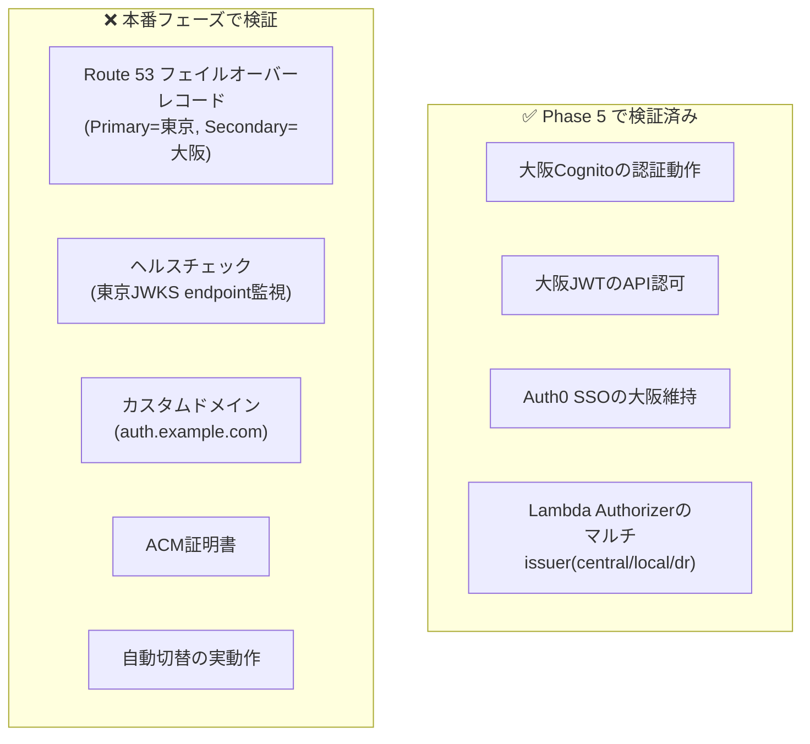
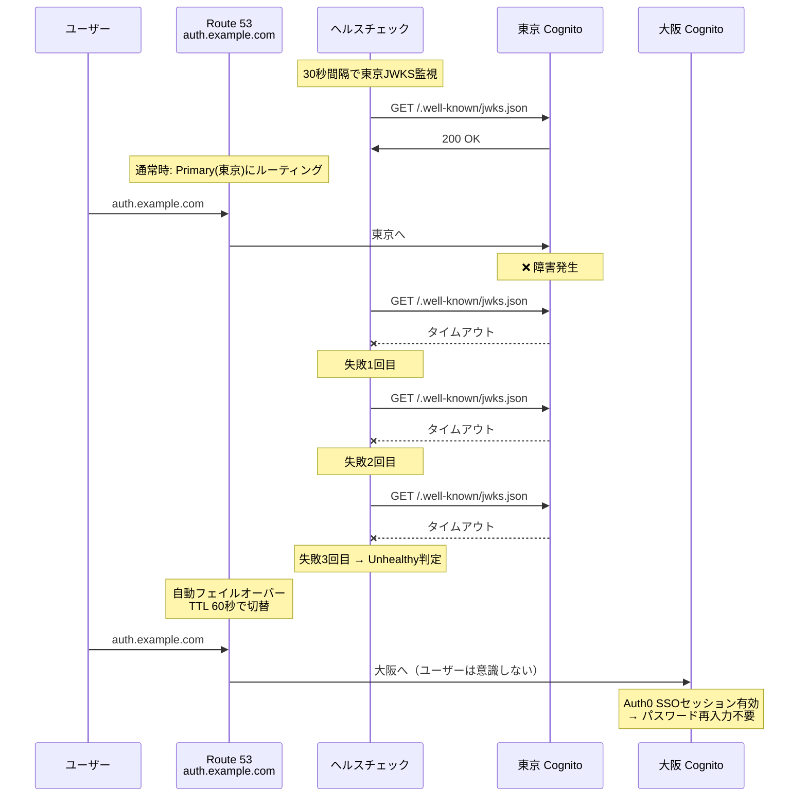
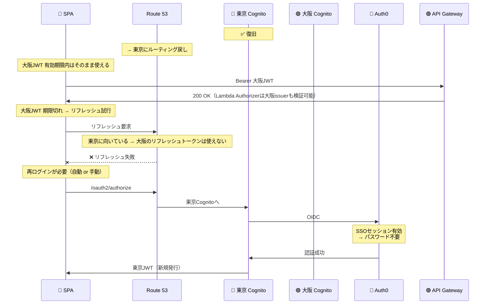

# PoC 検証結果サマリー（Phase 1〜5）

**最終更新**: 2026-03-18

---

## 1. 検証目的と達成状況

| 目的 | 達成 | Phase |
|------|:---:|-------|
| Cognito ハイブリッド構成の実現性検証 | ✅ | 1-4 |
| OIDC フェデレーション認証の動作確認 | ✅ | 2 |
| Lambda Authorizer による JWT検証 | ✅ | 3 |
| マルチissuer対応の動作確認 | ✅ | 4 |
| 認証フローの可視化 | ✅ | 1-4 |
| マルチリージョンDR検証 | ✅ | 5 |

---

## 2. 検証シナリオと結果

### 認証（5パターン）

| パターン | ログイン | JWT取得 | issuerType |
|---------|:---:|:---:|:---:|
| Hosted UI（集約Cognito） | ✅ | ✅ | central |
| Auth0 フェデレーション（集約） | ✅ | ✅ | central |
| ローカルCognito | ✅ | ✅ | local |
| DR Hosted UI（大阪） | ✅ | ✅ | dr |
| DR Auth0 フェデレーション（大阪） | ✅ | ✅ | dr |

### 認可

| テスト | 結果 |
|--------|:---:|
| トークンあり → API呼び出し | ✅ 200 OK |
| トークンなし → API呼び出し | ✅ 401 Unauthorized |
| 集約Cognitoトークン → issuerType=central | ✅ |
| ローカルCognitoトークン → issuerType=local | ✅ |
| DR Cognitoトークン → issuerType=dr | ✅ |

### ログアウト

| テスト | 結果 |
|--------|:---:|
| 通常ログアウト（集約） | ✅ |
| 通常ログアウト（ローカル） | ✅ |
| 通常ログアウト（DR） | ✅ |
| 完全ログアウト SSO破棄（集約+Auth0） | ✅ |
| 完全ログアウト SSO破棄（DR+Auth0） | ✅ |
| SSO動作確認（ログアウト後再ログインでパスワード不要） | ✅ |

### DR

| テスト | 結果 | 備考 |
|--------|:---:|------|
| 大阪Cognito作成 | ✅ | |
| 大阪Auth0フェデレーション | ✅ | コンソール手動作成 |
| 大阪JWTでAPI認可 | ✅ | issuerType=dr |
| 東京→大阪切替時のSSO維持 | ✅ | Auth0セッション有効でパスワード不要 |
| **Route 53 自動フェイルオーバー** | **未検証** | 本番フェーズで実施（下記参照） |

#### DR 検証の範囲と残課題

**検証済み（Phase 5）**: 大阪Cognitoが東京と同等に動作すること（手動切替で確認）

**未検証（本番フェーズ）**: Route 53による自動フェイルオーバー

**自動フェイルオーバーに必要な構成**:

| コンポーネント | 設定内容 | PoC状態 |
|--------------|---------|---------|
| カスタムドメイン | `auth.example.com` 等 | 未取得（PoCではCognito標準ドメイン使用） |
| ACM証明書 | カスタムドメイン用SSL証明書 | 未作成 |
| Route 53 ホステッドゾーン | ドメイン管理 | 未作成 |
| Route 53 ヘルスチェック | 東京CognitoのJWKS endpointを監視 | 未作成 |
| Route 53 フェイルオーバーレコード | Primary=東京, Secondary=大阪, TTL=60秒 | 未作成 |
| Cognito カスタムドメイン設定 | 東京・大阪両方にカスタムドメイン紐付け | 未設定 |

**本番での自動フェイルオーバーの流れ**:

**補足**: 東京のJWTで認証済みのユーザーは、トークン有効期限内は引き続きAPIアクセス可能（Lambda AuthorizerがJWKSキャッシュを保持）。トークン期限切れ後は大阪Cognitoで再認証が必要だが、Auth0のSSOセッションが有効であればパスワード不要。

#### フェイルバック（復旧）時の挙動

東京復旧後、Route 53が東京にルーティングを戻した場合の挙動：

| フェイルバック時の状況 | 動作 | ユーザー影響 |
|---------------------|------|------------|
| 大阪JWT有効期限内 | APIアクセス継続可能 | なし |
| 大阪JWT期限切れ → リフレッシュ | 失敗（リフレッシュトークンは大阪専用） | 再ログイン必要 |
| 再ログイン | 東京Cognito → Auth0（SSO有効）| パスワード不要（リダイレクトのみ） |

**改善策（本番設計で検討）**:

| 策 | 内容 | 効果 |
|----|------|------|
| トークン有効期限を短縮 | 1時間→15分 | フェイルバック時の最大待ち時間を15分に短縮 |
| SPA側で自動再ログイン | リフレッシュ失敗時に`signinRedirect()`自動実行 | ユーザーはリダイレクトが走るだけ |
| カスタムドメインでトークン・リフレッシュ統一 | `auth.example.com`を全エンドポイントに使用 | リフレッシュもフェイルオーバー対象になる |

#### DR 構成のコスト

Cognito は**User Pool単位・リージョン単位**でMAU課金される。

| 状況 | 東京MAU課金 | 大阪MAU課金 | 合計 |
|------|-----------|-----------|------|
| **通常時（障害なし）** | 通常通り | **$0**（誰もログインしない） | 東京分のみ |
| **障害月（フェイルオーバー発生）** | 障害前にログインしたユーザー分 | **障害中にログインしたユーザー分** | 最大2倍 |
| **復旧月（翌月通常運用）** | 通常通り | **$0** | 東京分のみ |

**重要ポイント**:
- 大阪Cognito User Pool自体の**維持コストは$0**（MAU課金のみ、固定費なし）
- 障害が発生しなければ大阪のMAUは常に0
- 障害月に仮に全ユーザーが大阪でログインしても、**その月だけ2リージョン分の課金**
- Route 53ヘルスチェック: AWSエンドポイント50個まで**無料**
- Route 53ホステッドゾーン: **$0.50/月**

**コスト試算（フェデレーション $0.015/MAU）**:

| 規模 | 通常月（東京のみ） | 障害月（東京+大阪） | DR追加コスト |
|------|-----------------|-------------------|------------|
| 1,000 MAU | $15 | 最大 $30 | +$15 |
| 10,000 MAU | $150 | 最大 $300 | +$150 |
| 100,000 MAU | $1,500 | 最大 $3,000 | +$1,500 |

※ 実際には障害時間が短ければ大阪のMAUは全ユーザーにはならない。
※ Route 53: +$0.50/月（ホステッドゾーン）のみ常時発生。

---

## 3. 技術的知見

### Cognito 固有

| 知見 | 詳細 | 対応 |
|------|------|------|
| アクセストークンに`aud`がない | `client_id`クレームが代わり | PyJWTの`verify_aud`オフ + 手動検証 |
| フェデレーションでUser Pool内にユーザー作成 | JITプロビジョニング | MAU課金（$0.015/MAU）が発生 |
| Hosted UIログアウトは外部IdPセッション非破棄 | SSO仕様 | 完全ログアウトは多段リダイレクト |
| 大阪から Auth0 の .well-known 自動検出失敗 | 原因不明（Entra IDでは発生しない可能性） | コンソール Manual input で回避 |

### Lambda / ビルド

| 知見 | 詳細 | 対応 |
|------|------|------|
| cryptographyバイナリの互換性 | macOSビルドはLambda(Linux)で動かない | `--platform manylinux2014_x86_64` |
| venv 使用推奨 | システムpipの問題回避 | `build.sh` でvenv自動作成 |

### SPA / oidc-client-ts

| 知見 | 詳細 | 対応 |
|------|------|------|
| UserManagerインスタンス共有必須 | CallbackPageで別インスタンスを作るとイベント不達 | Context経由で共有 |
| マルチUserManagerのstateStore衝突 | 同じsessionStorageキーでstate消費競合 | プレフィックス分離（oidc.central./local./dr.） |
| ログアウト先の動的切替 | ログイン元のCognitoに合わせる必要 | JWTのissクレームでgetUserType()判定 |
| Auth0 Allowed Logout URLsの完全一致 | URLエンコード済みの形で登録必要 | returnToパラメータと同一文字列で登録 |

---

## 4. 本番適用に向けた残課題

| カテゴリ | 課題 | 優先度 |
|---------|------|--------|
| 認証 | Entra ID / Okta での実地検証 | 高 |
| 認証 | Pre Token Lambda（テナント識別グループ付与） | 高 |
| 認証 | クレームマッピング（IdP属性→カスタム属性） | 高 |
| 認可 | グループベース認可ルール実装 | 高 |
| 認可 | テナントスコープ検証 | 中 |
| DR | Route 53 フェイルオーバー（自動切替） | 中 |
| DR | 大阪Cognito+Entra IDの接続検証 | 中 |
| 比較 | Keycloak構成の構築・比較（Phase 6） | 中 |
| コスト | 顧客のMAU規模確認（損益分岐点17.5万MAU） | 高 |

---

## 5. 次のPhase

| Phase | 内容 | 目的 |
|-------|------|------|
| 6 | Keycloak構成（第2パターン） | Cognitoとの運用負荷・コスト比較 |
