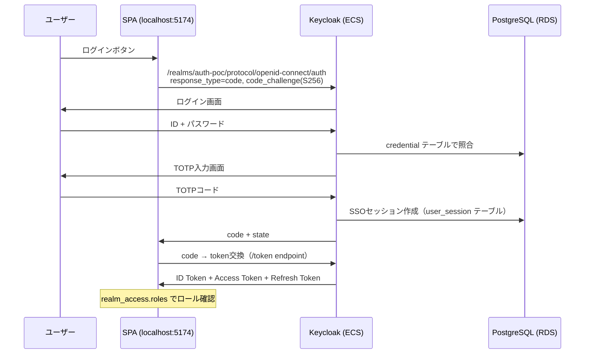
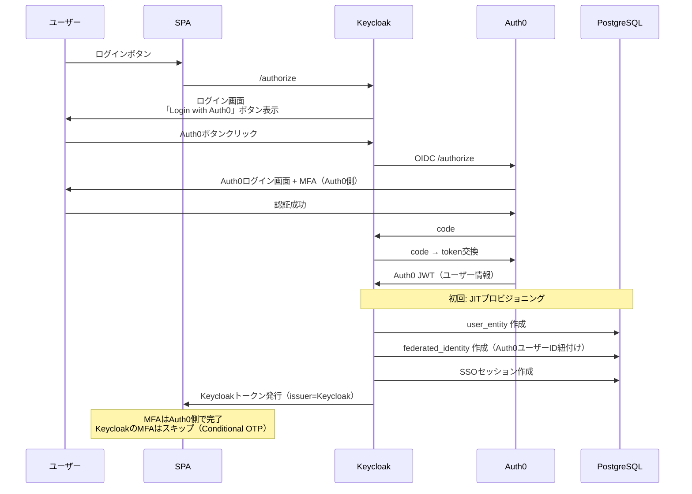
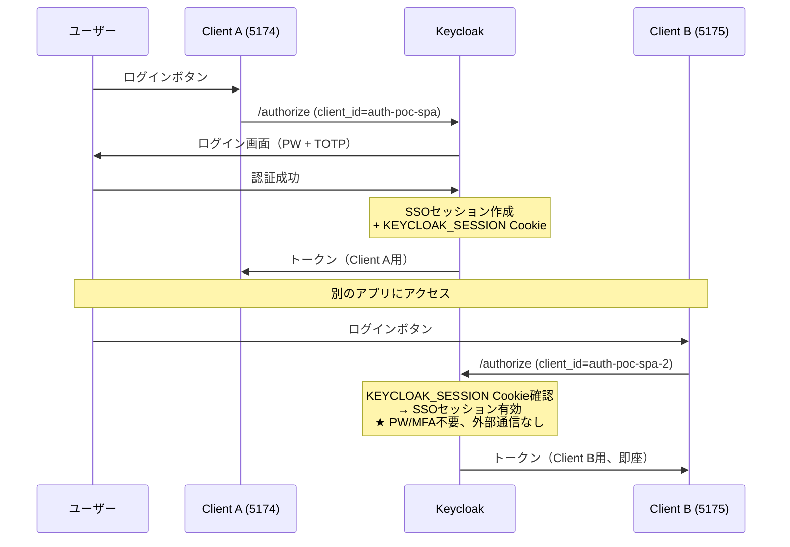

# Keycloak 認証フロー設計（Phase 6-7）

**最終更新**: 2026-03-30

---

## 1. ローカルユーザー（Authorization Code + PKCE + MFA）

**Cognitoとの違い**:
- OIDC Discovery が完全動作（metadata手動指定不要）
- `aud` クレームがアクセストークンに含まれる（Cognitoにはない）
- ログアウトは `signoutRedirect()` のみで完結（多段リダイレクト不要）
- MFAはKeycloakの認証フローで制御（Conditional OTP）

## 2. Auth0 Identity Brokering

**Cognito + Auth0との違い**:
- Keycloakログイン画面にIdPボタンが**自動表示**される（SPA側の変更不要）
- Cognito: `identity_provider` パラメータを明示的に渡す必要があった
- トークン発行元はどちらもローカル（Cognito/Keycloak）で、Auth0ではない

## 3. SSO（同一Realm内 複数Client）

**Cognito + Auth0 SSOとの違い**:
- Cognito: SSOはAuth0セッション経由（Auth0にリダイレクトが走る）
- Keycloak: **Realm内で完結**（外部通信なし、高速）
- Keycloak: **Back-Channel Logout対応**（Client Aログアウト → Client Bも無効化）
