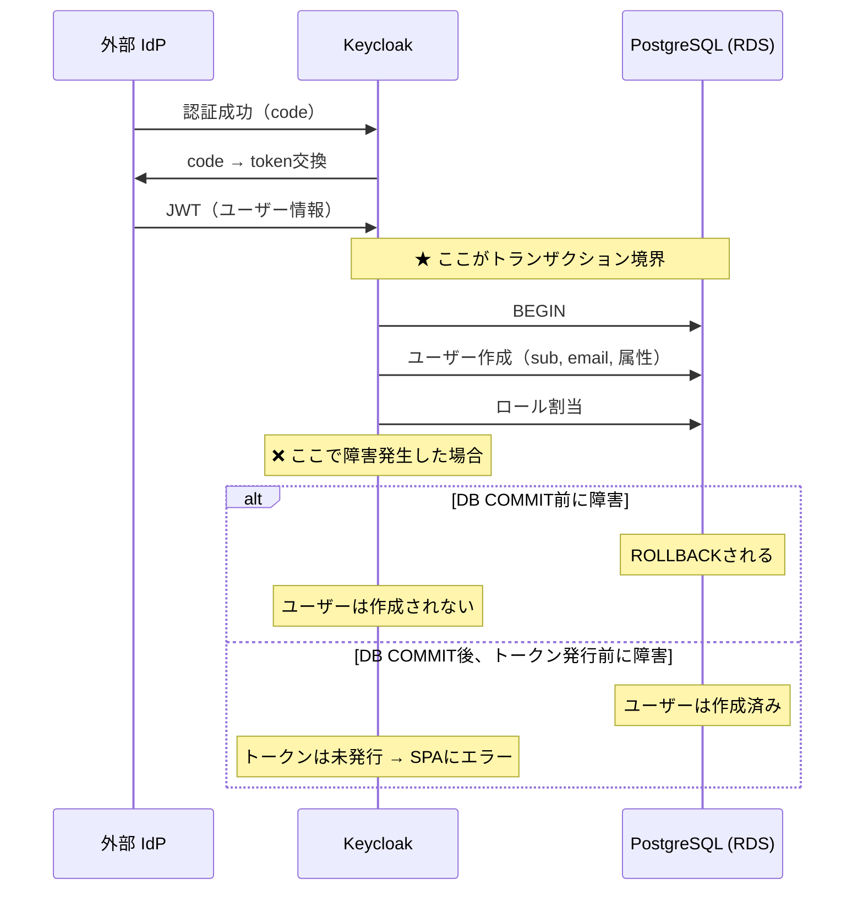
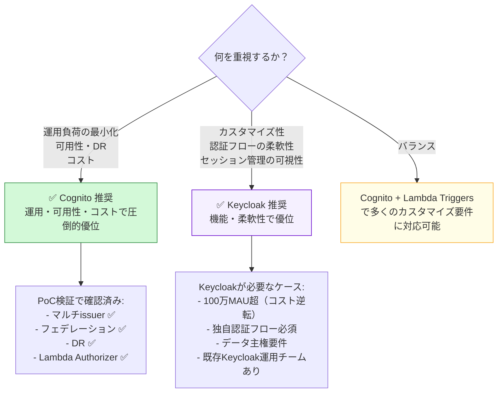
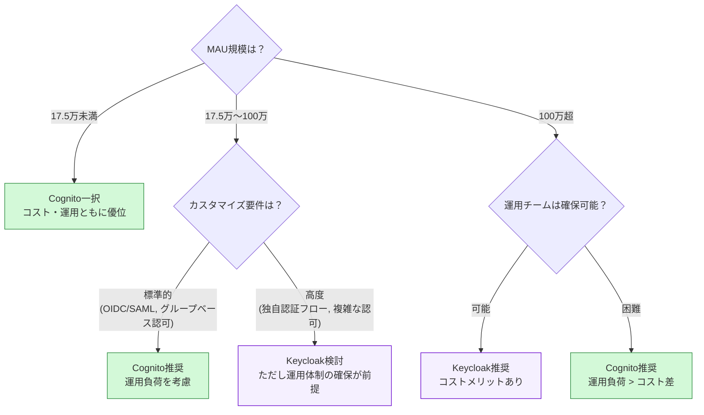
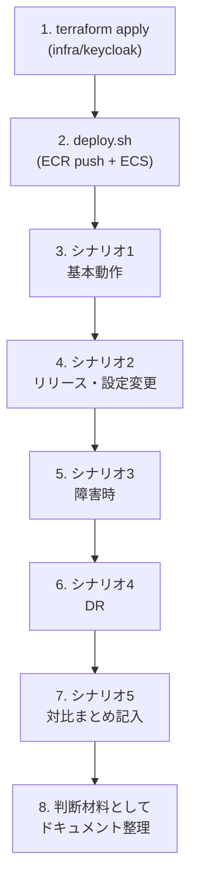

# Keycloak 検証シナリオ（基本動作・障害・DR）

**作成日**: 2026-03-24

---

## 目的

Keycloakを使った認証基盤において、以下を検証する：

1. **基本動作**: ログイン・ログアウト・トークン取得がCognitoと同等に動作するか
2. **リリース（設定変更）**: Keycloakの設定変更がサービスにどう影響するか
3. **障害・復旧**: Keycloak / RDS の障害時にどうなるか、復旧時にどうなるか

各シナリオはCognito（Phase 1-5）の結果と対比し、運用負荷の違いを明確にする。

---

## シナリオ1: 基本動作確認

### 1-1. ローカルユーザーでログイン

| 手順 | 操作 | 期待結果 |
|------|------|---------|
| 1 | SPA（localhost:5174）にアクセス | 未認証状態が表示される |
| 2 | 「ログイン（Keycloak）」をクリック | Keycloakログイン画面にリダイレクト |
| 3 | test@example.com / TestUser1! でログイン | SPA にリダイレクトされ認証済み状態 |
| 4 | トークンビューアーを確認 | JWT に `realm_access.roles` が含まれる |
| 5 | API Tester でトークンありリクエスト | 200 OK（Lambda Authorizer がKeycloak JWT を検証） |

**Cognito との対比ポイント**:
- Keycloakは `realm_access.roles` でロール、Cognito は `cognito:groups` でグループ
- Keycloakの JWT には `aud` クレームが含まれる（Cognito アクセストークンにはない）
- Keycloakは OIDC Discovery が完全動作（metadata 手動指定不要）

### 1-2. ロールベースの違いを確認

| ユーザー | ロール | 確認内容 |
|---------|--------|---------|
| test@example.com | user | `realm_access.roles` に `user` が含まれる |
| approver@example.com | user, expense-approver | 複数ロールが含まれる |
| admin@example.com | user, admin | admin ロールが含まれる |

### 1-3. ログアウト

| 手順 | 操作 | 期待結果 |
|------|------|---------|
| 1 | 「ログアウト」をクリック | Keycloakのセッション破棄 → SPA に戻る |
| 2 | 再度「ログイン」をクリック | **パスワード入力が求められる**（Cognito+Auth0ではSSO維持されていた） |

**Cognito との対比ポイント**:
- Keycloakの `signoutRedirect()` は**IdPセッションも破棄**される（end_session_endpoint 標準対応）
- Cognito では通常ログアウト後も Auth0 のSSOセッションが残っていた
- → Keycloakの方がログアウト実装がシンプルで確実

---

## シナリオ2: リリース・設定変更

### 2-1. Realm 設定変更（トークン有効期限の変更）

**目的**: Keycloakの設定変更がサービスに与える影響を確認

| 手順 | 操作 | 期待結果 |
|------|------|---------|
| 1 | test@example.com でログイン | トークン有効期限 = 1時間（デフォルト） |
| 2 | Keycloak Admin Console → Realm Settings → Tokens | 設定画面が表示される |
| 3 | Access Token Lifespan を 5分 に変更 → Save | **即座に反映される** |
| 4 | ログアウト → 再ログイン | 新しいトークンの有効期限 = 5分 |
| 5 | 5分待つ | トークン期限切れ → リフレッシュが走る |

**Cognito との対比ポイント**:
- Cognito: App Client の設定変更 → Terraform apply → **新しいログインから反映**
- Keycloak: Admin Console で**即座に反映**（Terraform不要、ホットリロード）
- → Keycloak は設定変更の柔軟性が高いが、変更管理が課題（誰がいつ何を変えたか）

### 2-2. クライアント設定変更（リダイレクトURI追加）

**目的**: 新しいアプリを追加する際のフローを確認

| 手順 | 操作 | 期待結果 |
|------|------|---------|
| 1 | Admin Console → Clients → auth-poc-spa → Valid Redirect URIs | 現在の設定が表示される |
| 2 | `http://localhost:3000/*` を追加 → Save | 即座に反映 |
| 3 | realm-export.json にエクスポート | `bash keycloak/config/export-realm.sh` |
| 4 | git diff で変更を確認 | redirectUris に新しいURLが追加されている |
| 5 | git commit で設定をバージョン管理 | 変更履歴が残る |

**Cognito との対比ポイント**:
- Cognito: `terraform.tfvars` を変更 → `terraform apply` → AWS APIで更新
- Keycloak: Admin Console で変更 → export → git commit（逆方向）
- → Keycloak はGit管理のフローが「変更→エクスポート」と逆になる点に注意

### 2-3. ECSのローリングアップデート（Keycloak バージョンアップ）

**目的**: Keycloakコンテナの更新時の挙動を確認

| 手順 | 操作 | 期待結果 |
|------|------|---------|
| 1 | test@example.com でログイン（セッション確保） | 認証済み状態 |
| 2 | `bash keycloak/deploy.sh`（新イメージをデプロイ） | ECSのローリングアップデート開始 |
| 3 | デプロイ中にAPIリクエスト | **200 OK**（JWTは自己完結型、Keycloakの稼働状態に依存しない） |
| 4 | デプロイ中にログアウト→再ログイン | **新旧タスク切替のタイミングで一時的にエラーの可能性** |
| 5 | デプロイ完了後にログイン | 正常に認証される |

**Cognito との対比ポイント**:
- Cognito: AWSマネージドなので**バージョンアップ作業自体が不要**
- Keycloak: バージョンアップは自分で行う必要がある（互換性確認・テスト含む）
- → 運用負荷の違いが最も顕著な点

---

## シナリオ3: 障害時の検証

### 3-1. ECSタスク障害（Keycloakプロセス停止）

**目的**: Keycloakが停止した場合の影響範囲を確認

| 手順 | 操作 | 期待結果 |
|------|------|---------|
| 1 | test@example.com でログイン | 認証済み、JWT取得済み |
| 2 | `aws ecs update-service --cluster auth-poc-kc-cluster --service auth-poc-kc-service --desired-count 0` | Keycloakタスクが停止 |
| 3 | APIリクエスト（トークンあり） | **200 OK**（JWTは自己完結型、Keycloak不要） |
| 4 | トークンリフレッシュ試行 | **失敗**（Keycloakのtoken endpointに到達不可） |
| 5 | ログアウト→再ログイン試行 | **失敗**（Keycloakのauthorize endpointに到達不可） |
| 6 | `aws ecs update-service ... --desired-count 1` で復旧 | 1-2分で復旧 |
| 7 | 再ログイン | 正常に認証される |

**確認ポイント**:
- JWT取得済みユーザーは**トークン有効期限まで影響なし**
- トークン期限切れ後は**再ログイン不可**（認証サーバーが落ちているため）
- → **トークン有効期限 = 障害の猶予時間** という関係

**Cognito との対比**:
- Cognito: SLA 99.9%のマネージドサービスなので、このシナリオ自体が発生しにくい
- Keycloak: ECSタスク障害は現実的に発生する → ヘルスチェック + Auto Scalingで自動復旧を設計する必要

### 3-2. RDS障害（データベース停止）

**目的**: DBが停止した場合のKeycloakの挙動を確認

| 手順 | 操作 | 期待結果 |
|------|------|---------|
| 1 | test@example.com でログイン | 認証済み |
| 2 | `aws rds stop-db-instance --db-instance-identifier auth-poc-kc-db` | RDS停止（5-10分） |
| 3 | APIリクエスト（トークンあり） | **200 OK**（JWT検証にDB不要） |
| 4 | 新規ログイン試行 | **失敗**（Keycloakがセッション保存できない） |
| 5 | `aws rds start-db-instance ...` で復旧 | 5-10分で復旧 |
| 6 | 再ログイン | 正常に認証される（ユーザーデータはDB内に保持） |

**Cognito との対比**:
- Cognito: バックエンドDBはAWSが管理、利用者は意識しない
- Keycloak: RDS障害は直接影響 → MultiAZ構成で自動フェイルオーバーを検討

### 3-3. ALB障害（ネットワーク到達不可）

| 手順 | 操作 | 期待結果 |
|------|------|---------|
| 1 | test@example.com でログイン | 認証済み |
| 2 | ALBのSecurity Groupで全Ingressルールを削除 | Keycloakへのアクセス不可 |
| 3 | APIリクエスト | **200 OK**（JWT自己完結） |
| 4 | 新規ログイン | **失敗** |
| 5 | Security Group を元に戻す | 即座に復旧 |

### 3-4. JWKS endpointの可用性確認

**目的**: Lambda AuthorizerがKeycloakのJWKSを取得できない場合の挙動

| 手順 | 操作 | 期待結果 |
|------|------|---------|
| 1 | test@example.com でログイン | 認証済み |
| 2 | Keycloak停止（desired_count=0） | JWKSエンドポイント到達不可 |
| 3 | APIリクエスト（初回、JWKSキャッシュなし） | **401/500**（JWKSフェッチ失敗） |
| 4 | APIリクエスト（JWKSキャッシュあり） | **200 OK**（キャッシュから検証） |

**確認ポイント**:
- Lambda Authorizer の JWKS キャッシュ戦略が重要
- キャッシュTTLを設定して、一時的な障害に耐えるようにする
- Cognito では JWKS endpoint は常時可用（AWS インフラ）

### 3-5. ユーザー登録途中の障害（JITプロビジョニング）

**目的**: 外部IdP認証後、JITプロビジョニング中にKeycloakが停止した場合の挙動を確認

**背景**:

フェデレーション認証では、外部IdPで認証成功後にKeycloak内にユーザーを自動作成（JIT）する。
このJITはDB書き込みを伴うため、障害タイミングによって結果が異なる。



| 手順 | 操作 | 期待結果 |
|------|------|---------|
| 1 | 外部IdP（Auth0等）を設定して、フェデレーション可能にする | IdP連携が動作 |
| 2 | 未登録ユーザーでフェデレーションログインを開始 | 外部IdPに遷移 |
| 3 | 外部IdP認証成功直後にECSタスクを強制停止 | SPAにエラーが返る |
| 4 | ECSタスクを再起動 | Keycloak復旧 |
| 5 | 同じユーザーで再度フェデレーションログイン | **正常にログインできるか確認**（半端なユーザーが残っていないか） |
| 6 | Admin Console でユーザー一覧を確認 | 半端なレコードが残っていないか |

**Cognito との対比**:

| | Cognito | Keycloak |
|---|---------|----------|
| JITのDB操作 | AWSが管理（利用者は制御不可） | PostgreSQLトランザクション |
| JIT失敗時 | 自動ロールバック（マネージド） | **DBトランザクションでロールバック** |
| 半端なユーザーが残るリスク | 極めて低い | **RDS障害のタイミング次第であり得る** |
| 未検証ユーザーの管理 | Lambda トリガー等で対応 | Admin Console or スケジュールタスク |

### 3-6. セルフ登録途中の障害

**目的**: ローカルユーザーのセルフ登録中にDB障害が発生した場合の挙動を確認

**背景**:

セルフ登録はフェデレーションと異なり、ユーザー作成とメール検証が**別トランザクション**になる。

```
ブラウザ → Keycloak登録画面 → 入力 → Submit → DB保存 → (確認メール) → メール内リンク → 検証完了
```

| 離脱・障害ポイント | 状態 | ユーザーデータ |
|-------------------|------|-------------|
| 入力中にブラウザ閉じる | 未送信 | **何も残らない** |
| Submit直後にKeycloak障害 | DB書き込み前 or 後 | **不確定**（トランザクション次第） |
| Submit成功、メール確認前に離脱 | DBに保存済み、未検証状態 | **残る（email_verified=false）** |
| メール確認リンクの有効期限切れ | DBに保存済み、未検証 | **残る**（再送が必要） |

| 手順 | 操作 | 期待結果 |
|------|------|---------|
| 1 | Keycloakの登録画面を開く | 登録フォーム表示 |
| 2 | フォームに入力後、Submit直前にRDS停止 | |
| 3 | Submitを実行 | **エラーが返る**（適切なメッセージか確認） |
| 4 | RDSを再起動 | 5-10分で復旧 |
| 5 | 同じメールアドレスで再度登録 | **正常に登録できるか確認**（重複エラーにならないか） |

**確認ポイント**:
- Submit成功→メール未確認のユーザーが蓄積する可能性がある
- 本番では未検証ユーザーの自動削除ポリシーが必要（Keycloak Authentication Flow で設定可能）
- Cognito では UNCONFIRMED ユーザーが同様に残る（Lambda Pre Sign-Up トリガーで制御可能）

---

## シナリオ4: DR（ディザスタリカバリ）

### 4-1. Keycloak DR の選択肢

| 方式 | 構成 | RTO | RPO | 運用複雑度 |
|------|------|-----|-----|-----------|
| **A. コールドスタンバイ** | DBスナップショット → 大阪でリストア | 30-60分 | 最後のスナップショット | 低 |
| **B. ウォームスタンバイ** | 大阪にもECS+RDS（停止状態）+ DBレプリカ | 5-10分 | ほぼゼロ | 中 |
| **C. ホットスタンバイ** | 大阪でKeycloak稼働 + DB同期 | 1-2分 | ゼロ | **高** |
| **D. realm-export復元** | realm-export.json から新環境構築 | 30-60分 | Git最終コミット | **低**（Git管理） |

### 4-2. コールドスタンバイ検証（方式A）

| 手順 | 操作 | 期待結果 |
|------|------|---------|
| 1 | test@example.com でログイン、設定変更を行う | セッションとデータがDB内に存在 |
| 2 | RDSスナップショットを取得 | `aws rds create-db-snapshot` |
| 3 | Keycloak停止（東京障害シミュレーション） | ログイン不可 |
| 4 | スナップショットから大阪RDSをリストア | 新しいRDSインスタンス作成（15-30分） |
| 5 | 大阪でKeycloak ECS起動 | 新しいDBに接続して起動 |
| 6 | 大阪Keycloakにログイン | **既存ユーザーでログイン可能** |
| 7 | Realm設定が復元されているか確認 | クライアント、ロール、ユーザーが全て存在 |

### 4-3. realm-export復元検証（方式D）

| 手順 | 操作 | 期待結果 |
|------|------|---------|
| 1 | 設定をエクスポート: `bash export-realm.sh` | realm-export.json が更新される |
| 2 | git commit で保存 | 設定がバージョン管理される |
| 3 | `terraform destroy`（東京のKeycloak全削除） | 全リソース削除 |
| 4 | `terraform apply`（ゼロから再構築） | 新しいECS+RDS+ALB作成 |
| 5 | `bash deploy.sh`（realm-export.json含むイメージをデプロイ） | Keycloak起動 + Realm自動インポート |
| 6 | ログイン | **テストユーザーでログイン可能** |

**確認ポイント**:
- realm-export.json にユーザーパスワードは含まれない → **ユーザーの再登録が必要**
- Realm設定（クライアント、ロール、IdP設定）は復元される
- → 方式Dはインフラ復旧向け、ユーザーデータ復旧にはDB方式（A-C）が必要

---

## シナリオ5: Cognito vs Keycloak 対比まとめ

### 検証結果

| 観点 | Cognito（Phase 1-5） | Keycloak（Phase 6） | 優位 |
|------|---------------------|---------------------|:---:|
| **初回ログイン** | ✅ Hosted UI | ✅ Keycloakログイン画面 | 同等 |
| **OIDC標準準拠** | △ metadata手動指定、audなし | ✅ OIDC Discovery完全対応、aud含む | **KC** |
| **ログアウト** | △ 多段リダイレクト（Auth0セッション別途破棄） | ✅ signoutRedirect()のみで完結 | **KC** |
| **SSO** | Auth0セッションで実現（ログアウト後もPW不要） | Keycloakセッション（DBセッション有効期限内はPW不要） | 同等 |
| **設定変更の反映** | terraform apply（数分） | Admin Consoleで即時反映（再起動不要） | **KC** |
| **設定の変更管理** | ✅ Terraform（単一の真実の情報源） | △ Admin Console→export→git commit（逆方向） | **Cognito** |
| **設定の保存場所** | ✅ 1箇所（AWS API / Terraform） | △ 3箇所（ビルド時/環境変数/DB）で管理が複雑 | **Cognito** |
| **認証サーバー障害** | ✅ マネージド SLA 99.9%（障害はAWSが対応） | △ ECS停止→認証全停止（自分で復旧） | **Cognito** |
| **DB障害** | ✅ マネージド（利用者から不可視） | ❌ RDS停止→Keycloak全停止→認証不可 | **Cognito** |
| **ECS再起動後のセッション** | N/A | ✅ DB保存のため生存（KC26の改善） | - |
| **バージョンアップ** | ✅ 不要（AWSが自動管理） | △ Dockerfile変更→再ビルド→デプロイ（互換性確認が必要） | **Cognito** |
| **DR構成** | ✅ Route 53 + 独立User Pool（RTO 1-2分, RPO 0） | △ Aurora Global DB（RTO 5-15分, RPO <1秒, 全ユーザー再ログイン） | **Cognito** |
| **DR構成の複雑さ** | ✅ Route 53のみ | △ Aurora Global + ECS + Infinispan（Active-Activeはクロスリージョン非対応） | **Cognito** |
| **DRコスト** | ✅ $0.50/月（Route 53） | △ $50-100/月（Aurora Global） | **Cognito** |
| **JWKS可用性** | ✅ AWS基盤で常時可用 | △ Keycloak稼働に依存 | **Cognito** |
| **ロール/グループ管理** | △ フラットなGroups | ✅ Realm Roles + Client Roles + Composite Roles（階層的） | **KC** |
| **トークンのカスタマイズ** | △ Pre Token Lambda（コード必要） | ✅ Protocol Mappers（Admin Consoleで設定） | **KC** |
| **セッション管理の可視性** | △ セッション一覧は見えない | ✅ Admin Consoleで全セッション可視・強制削除 | **KC** |
| **管理者ロックアウトリスク** | ✅ なし（IAMで常にアクセス可能） | ❌ あり（SSL設定/PW紛失でAdmin Console利用不可） | **Cognito** |
| **初期構築の工数** | ✅ terraform apply のみ | △ ECS + RDS + ALB + Docker + Realm設定 | **Cognito** |
| **運用コスト（人件費）** | ✅ $0（マネージド） | △ 運用チーム必要（監視・バージョンアップ・障害対応） | **Cognito** |
| **運用コスト（インフラ）** | フェデレーション $0.015/MAU | ECS + RDS + ALB（固定 $70-100/月 + 変動） | MAU次第 |
| **カスタマイズ性** | △ AWSの仕様に制約される | ✅ 認証フロー・テーマ・SPI等ほぼ全て変更可能 | **KC** |

### 集計

| カテゴリ | Cognito優位 | Keycloak優位 | 同等 |
|---------|:-----------:|:----------:|:---:|
| **運用・可用性** | 8 | 1 | 0 |
| **機能・柔軟性** | 0 | 5 | 2 |
| **コスト** | 2 | 0 | 0 |

### 総合評価



### 推奨判断フロー



---

## 検証の進め方



各シナリオの結果は実施後にこのドキュメントに追記する。
