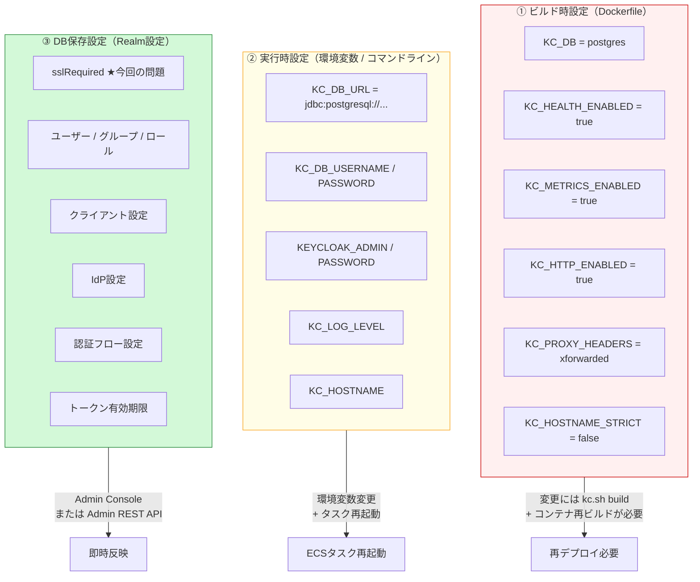
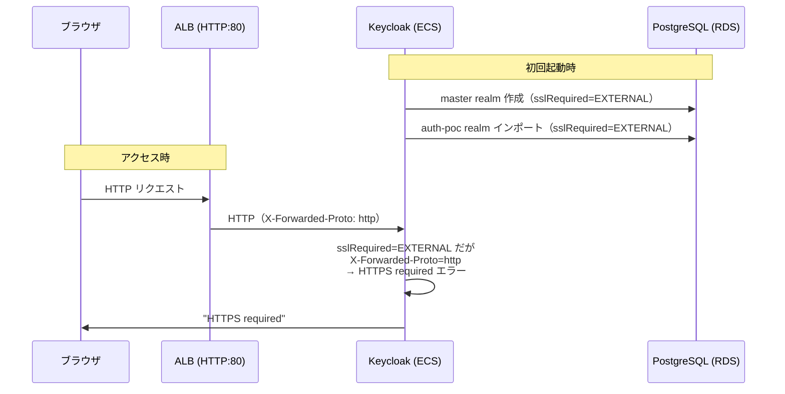

# Keycloak 設定ガイド（構成変更・トラブルシューティング）

**作成日**: 2026-03-25
**対象**: Keycloak 26.x on ECS Fargate + ALB (HTTP)

---

## 1. 起動モードの違い

Keycloakには3つの起動モードがあり、設定の扱いが大きく異なる。

| モード | コマンド | SSL | 用途 | パフォーマンス |
|--------|---------|-----|------|-------------|
| **開発モード** | `start-dev` | **不要** | 開発・PoC | 低（毎回設定を評価） |
| **本番モード** | `start` | 必須 | 本番 | 中（毎回設定を評価） |
| **最適化モード** | `start --optimized` | 必須 | 本番（推奨） | **高**（ビルド済み設定を使用） |

### PoCでの選択

**`start-dev` を使用**。理由：
- ALBがHTTPのため、SSL不要モードが必要
- 設定変更が即座に反映される（ビルド不要）
- パフォーマンスはPoCでは問題にならない

### 本番での移行

```
start-dev（PoC） → start --optimized（本番）
```

本番移行時の追加作業：
1. ALBにACM証明書を設定（HTTPS）
2. Dockerfileでマルチステージビルド（`kc.sh build`）を使用
3. `start --optimized` に変更
4. `KC_HOSTNAME` を正式ドメインに設定

---

## 2. 設定の3つの保存場所

Keycloakの設定は3箇所に保存され、変更方法がそれぞれ異なる。



### ① ビルド時設定（変更にはDockerイメージ再ビルドが必要）

`start --optimized` 使用時に影響。`start-dev` では環境変数で上書き可能。

| 設定 | 環境変数 | 説明 | 変更方法 |
|------|---------|------|---------|
| DB種類 | `KC_DB` | postgres / mysql / mariadb | Dockerfile変更 → `kc.sh build` → 再デプロイ |
| ヘルスチェック | `KC_HEALTH_ENABLED` | /health エンドポイント | 同上 |
| メトリクス | `KC_METRICS_ENABLED` | /metrics エンドポイント | 同上 |
| HTTP有効化 | `KC_HTTP_ENABLED` | HTTP(非SSL)リスナー | 同上 |
| プロキシヘッダー | `KC_PROXY_HEADERS` | xforwarded / forwarded | 同上 |
| ホスト名厳密化 | `KC_HOSTNAME_STRICT` | true / false | 同上 |
| キャッシュ設定 | `KC_CACHE` | local / ispn | 同上 |
| トランザクション | `KC_TRANSACTION_XA_ENABLED` | XAトランザクション | 同上 |

**重要**: これらの設定を変更した場合、`start --optimized` では反映されない。以下のいずれかが必要：
- Dockerfileの`kc.sh build`ステージで設定 → イメージ再ビルド → 再デプロイ
- `start-dev` モードに切り替え（PoCの場合）

### ② 実行時設定（ECS環境変数で変更可能）

| 設定 | 環境変数 | 説明 | 変更方法 |
|------|---------|------|---------|
| DB接続先 | `KC_DB_URL` | JDBC URL | ECSタスク定義変更 → 再デプロイ |
| DB認証情報 | `KC_DB_USERNAME` / `KC_DB_PASSWORD` | | 同上 |
| 管理者 | `KEYCLOAK_ADMIN` / `KEYCLOAK_ADMIN_PASSWORD` | 初回起動時のみ有効 | DB内に保存後は変更不可（Admin Consoleで変更） |
| ログレベル | `KC_LOG_LEVEL` | INFO / DEBUG / WARN | 同上 |
| ホスト名 | `KC_HOSTNAME` | 外部公開URL | 同上 |

### ③ DB保存設定（Admin Console / REST API で変更）

| 設定 | 変更方法 | 注意点 |
|------|---------|--------|
| **SSL Required** | Admin Console → Realm Settings | **★ 今回の問題箇所** |
| ユーザー | Admin Console → Users | |
| クライアント | Admin Console → Clients | |
| ロール | Admin Console → Realm Roles | |
| 認証フロー | Admin Console → Authentication | |
| IdP設定 | Admin Console → Identity Providers | |
| トークン有効期限 | Admin Console → Realm Settings → Tokens | |
| ブルートフォース設定 | Admin Console → Realm Settings → Security Defenses | |

---

## 3. 今回のSSL問題の詳細

### 3.1 何が起きたか



### 3.2 なぜ `start --optimized` + 環境変数で解決できなかったか

| 設定 | 保存場所 | `KC_HTTP_ENABLED=true` で解決？ | `KC_HOSTNAME_STRICT=false` で解決？ |
|------|---------|:---:|:---:|
| HTTPリスナーの有効化 | ビルド時設定 | ✅ | - |
| ホスト名の厳密チェック | ビルド時設定 | - | ✅ |
| **Realm の SSL Required** | **DB** | **❌** | **❌** |

`sslRequired` は**DB内のRealm設定**に保存されるため、環境変数やDockerfileでは変更できない。

### 3.3 解決方法

| 方法 | 手順 | 適用場面 |
|------|------|---------|
| **A. `start-dev` モード（採用）** | ECSコマンドを `start-dev` に変更 | PoCで最もシンプル |
| B. Admin REST API | `curl -X PUT .../realms/master -d '{"sslRequired":"NONE"}'` | Admin Console にアクセスできる場合 |
| C. DB直接更新 | `UPDATE realm SET ssl_required='NONE'` | DB接続が可能な場合 |
| D. DBリセット + realm-export | RDS削除→再作成、realm-export.json に `sslRequired: NONE` を設定 | 初期セットアップのやり直し |
| E. 起動スクリプト | entrypoint.sh で起動前にDB更新 | コンテナにpsqlが必要 |

**`start-dev` モードは `sslRequired` の設定に関係なくHTTPを許可する**ため、DB内の設定が何であっても動作する。

### 3.4 本番移行時の対応

本番ではHTTPSを使用するため、この問題は発生しない：

```
ALB (HTTPS:443, ACM証明書) → ECS (HTTP:8080)
KC_PROXY_HEADERS=xforwarded → X-Forwarded-Proto: https を認識
sslRequired=EXTERNAL → 外部はHTTPS、ALB↔ECS間はHTTPでOK
```

---

## 4. DB再作成が必要になるケース一覧

以下の設定変更は、**Admin ConsoleやREST APIで変更できない / 変更が困難**なため、DB再作成が必要になる場合がある。

### 4.1 DB再作成が必要

| 設定 | 理由 | 回避策 |
|------|------|--------|
| **master realm の管理者パスワード紛失** | `KEYCLOAK_ADMIN_PASSWORD` は初回起動時のみ有効 | DB直接更新（`credential` テーブル）、または DB リセット |
| **master realm の SSL Required（Admin Console にアクセスできない場合）** | DB内設定で環境変数では変更不可 | `start-dev` モード、またはDB直接更新 |
| **DB破損** | データ整合性問題 | バックアップからリストア |

### 4.2 コンテナ再ビルドが必要（DB再作成は不要）

| 設定 | 理由 | 変更手順 |
|------|------|---------|
| DB種類の変更（postgres→mysql等） | ビルド時設定 | Dockerfile変更 → `kc.sh build` → 再デプロイ |
| キャッシュ方式の変更（local→ispn） | ビルド時設定 | 同上 |
| プロキシヘッダー設定の変更 | ビルド時設定 | 同上 |
| カスタムSPI/テーマの追加 | JARファイルの配置 | Dockerfile変更 → 再デプロイ |
| Keycloakバージョンアップ | ベースイメージ変更 | Dockerfile変更 → 再デプロイ → 自動マイグレーション |

### 4.3 ECSタスク再起動のみ（DB・ビルド不要）

| 設定 | 変更方法 |
|------|---------|
| DB接続先の変更 | ECS環境変数 → タスク再起動 |
| ログレベル変更 | ECS環境変数 → タスク再起動 |
| ホスト名変更 | ECS環境変数 → タスク再起動 |
| JVMメモリ設定 | ECS環境変数（`JAVA_OPTS`）→ タスク再起動 |

### 4.4 即時反映（再起動不要）

| 設定 | 変更方法 |
|------|---------|
| Realm設定（トークン有効期限、MFA等） | Admin Console |
| ユーザー追加・変更・削除 | Admin Console |
| クライアント設定（リダイレクトURI等） | Admin Console |
| IdP追加・変更 | Admin Console |
| ロール・グループ変更 | Admin Console |

---

## 5. Cognito との設定管理の比較

| 観点 | Cognito | Keycloak |
|------|---------|----------|
| **設定の保存場所** | AWS API（Terraform管理） | 3箇所（ビルド時/環境変数/DB） |
| **SSL設定** | AWS管理（常にHTTPS） | 自分で管理（今回の問題） |
| **設定変更の反映** | `terraform apply`（数秒〜数分） | 設定の種類による（即時〜再ビルド） |
| **管理者ロックアウトリスク** | なし（AWS IAMで常にアクセス可能） | **あり**（SSL/パスワード問題でAdmin Console利用不可の可能性） |
| **バージョンアップ** | AWS自動（利用者は意識しない） | Dockerfileベースイメージ変更 → 再ビルド → DB自動マイグレーション |
| **設定のGit管理** | Terraform .tf ファイルで完結 | realm-export.json（DB設定のみ）+ Dockerfile + Terraform |
| **設定の一貫性** | Terraformが単一の真実の情報源 | 3箇所の設定が整合している必要あり |

**Keycloakの設定管理の複雑さは、運用負荷の主要因の一つ**である。

---

## 6. 初期設定後に変更が困難な設定

以下は一度設定すると変更コストが非常に高い。初期設計で慎重に決定する必要がある。

### 6.1 実質変更不可

| 設定 | 変更が困難な理由 |
|------|-----------------|
| **DB種類**（postgres→mysql等） | ベンダー間のデータ移行ツールなし。全データのエクスポート→インポートが必要 |
| **`http-relative-path`**（`/auth` → `/` 等） | OIDC Discovery URL、全クライアントのリダイレクトURI、ブックマークが全て壊れる |
| **Realm名** | UIやAPIでリネーム不可。エクスポート→JSON編集→旧Realm削除→インポートが必要。セッション全消失 |
| **ユーザーID形式** | UUIDが作成時に割り当てられ、全参照で使用される |

### 6.2 変更可能だが影響大

| 設定 | 変更時の影響 |
|------|------------|
| **`hostname`（公開URL）** | 既存JWTの `iss` クレームが旧URLのまま → **全トークンが無効化**。全クライアントのissuer URL更新が必要 |
| **`features`（機能フラグ）** | 使用中の機能を無効化すると既存クライアントが破壊される |
| **キャッシュ設定**（distributed→local） | 全アクティブセッション消失 |

### 6.3 Cognitoとの比較

| 変更 | Cognito | Keycloak |
|------|---------|----------|
| DB種類変更 | N/A（AWSが管理） | **実質不可** |
| URLパス変更 | N/A（固定） | **実質不可** |
| ドメイン変更 | カスタムドメイン付替え可能 | **全トークン無効化** |
| Realm/Pool名変更 | User Pool再作成 | エクスポート→インポート |

---

## 7. ALBの背後にデプロイする際の注意点

### 7.1 必須設定

```properties
# Keycloak がALBからのX-Forwarded-*ヘッダーを信頼する
proxy-headers=xforwarded

# ALBとKeycloak間はHTTP（ALBでTLS終端）
http-enabled=true
```

これがないと：
- リダイレクトURIが全て `http://` になる
- OIDC Discoveryが誤ったURLを返す
- Cookieに `Secure` フラグが付かない

### 7.2 スティッキーセッション

**複数ECSタスクを稼働させる場合、ALBのスティッキーセッションが必須。**

ログインフロー（入力→検証→同意→トークン発行）は複数HTTPリクエストにまたがり、その間の状態がInfinispanの認証セッションに保存される。スティッキーセッションなしだと、リクエストが別タスクに振られてログインが途中で失敗する。

| ECSタスク数 | スティッキーセッション | 必要か |
|-----------|:---:|:---:|
| 1 | 不要 | - |
| 2以上 | **必須** | ALB Target Group でstickiness有効化 |

### 7.3 ALBタイムアウト

ALBのデフォルトアイドルタイムアウトは60秒。Keycloakの管理操作や大量インポートは60秒を超える場合がある。必要に応じてALBのタイムアウトを延長する。

---

## 8. PoC環境のトラブルシューティング

| 症状 | 原因 | 対処 |
|------|------|------|
| `HTTPS required` | DB内のsslRequired=EXTERNAL | `start-dev` モードを使用 |
| `build time options differ` | `start --optimized` でビルド時と実行時の設定不一致 | Dockerfileで `kc.sh build` に環境変数を含める |
| Admin Console に入れない | master realmのSSL設定 | `start-dev` モード、またはDB直接更新 |
| Realm import が `already exists` でスキップ | 2回目以降の起動 | デフォルト動作（既存Realmは上書きしない）。上書きには `--override` |
| ECSタスクが繰り返し再起動 | ヘルスチェック失敗（起動に45秒かかる） | `startPeriod` を十分に設定（120秒） |
| DB接続エラー | RDS Security Groupの設定 | ECS SGからの5432ポートが許可されているか確認 |
