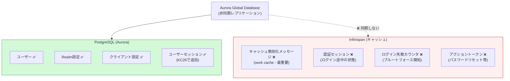
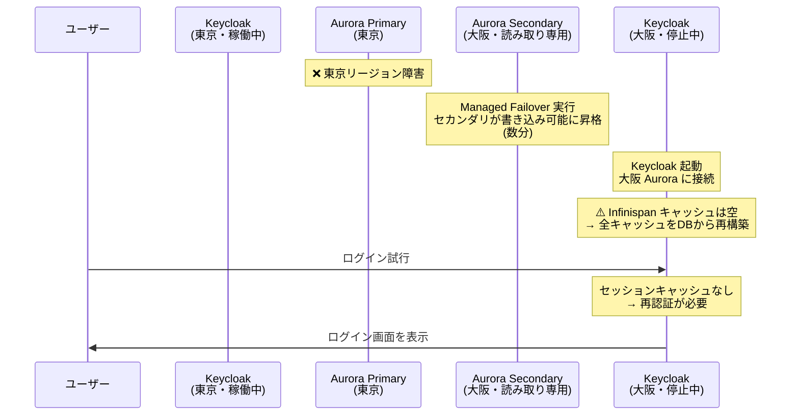
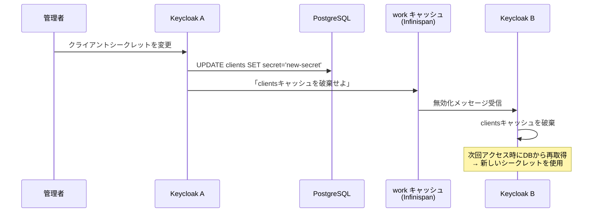
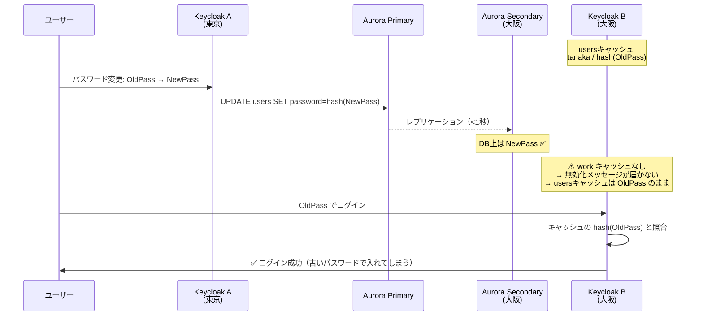
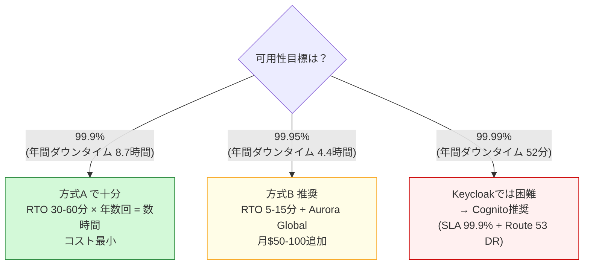
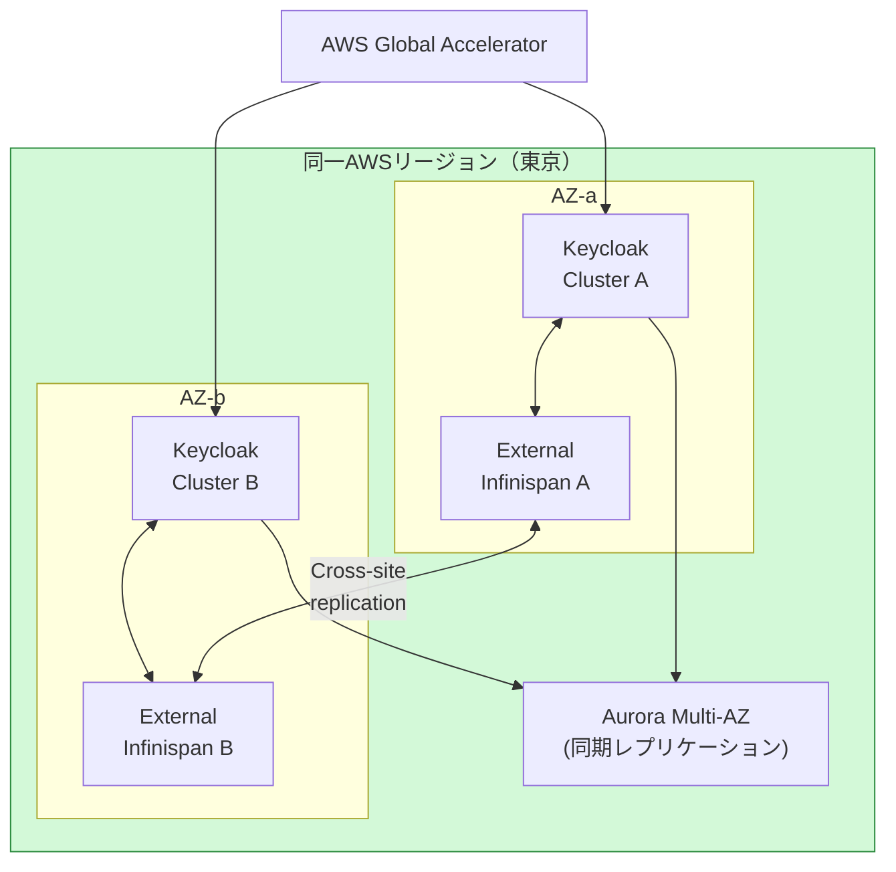
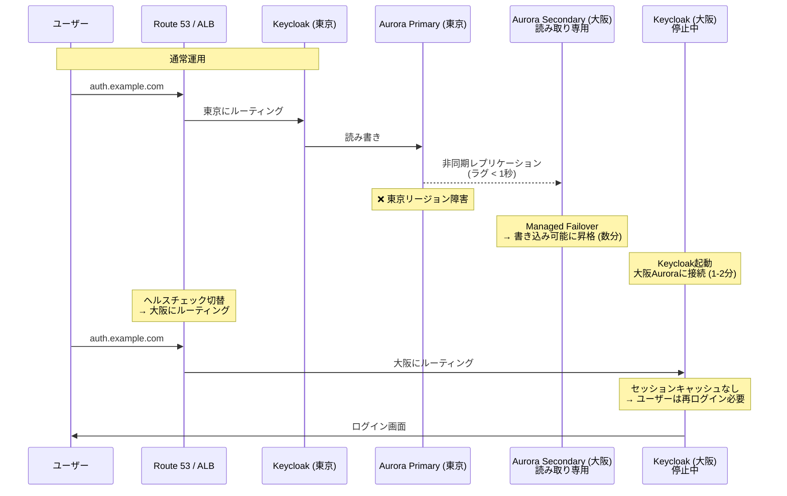
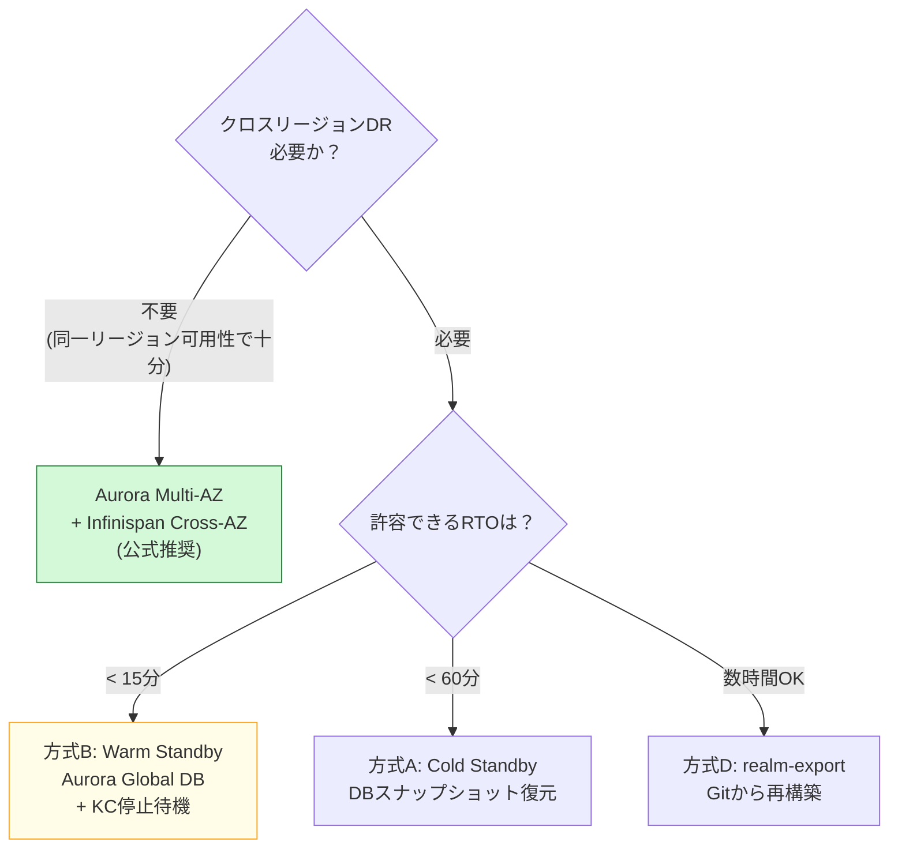

# Keycloak DR と Aurora ユーザー同期の詳細

**作成日**: 2026-03-24
**調査時点**: Keycloak 26.x / Aurora PostgreSQL

---

## 1. 結論（先に要点）

| 項目 | 内容 |
|------|------|
| **Aurora Global Database でKeycloak DRは可能か** | **限定的に可能だが、公式非推奨** |
| **DBのみの同期で何が失われるか** | セッション（KC26でDB保存）は同期される。**キャッシュ無効化・認証セッション・ブルートフォース検知は失われる** |
| **フェイルオーバー時のユーザー影響** | **全ユーザーが再ログイン必要**（セッションキャッシュが失われる） |
| **公式推奨のDR構成** | 同一リージョン内の2AZ + Aurora Multi-AZ + External Infinispan |
| **クロスリージョンDRの現実的な選択肢** | Active-Passive（コールドスタンバイ）、フェイルオーバー時に全ユーザー再認証を許容 |

---

## 2. Keycloak のデータ保存場所

Keycloakのデータは**DB（PostgreSQL）**と**Infinispan（分散キャッシュ）**の2箇所に保存される。
Aurora Global Database はDBのみを同期するため、Infinispanのデータは同期されない。

### 2.1 データの保存場所一覧（Keycloak 26.x）

| データ | 保存場所 | キャッシュ | Aurora Global DBで同期されるか |
|--------|---------|----------|---------------------------|
| ユーザー（ID/PW/属性） | **DB** | Infinispan `users` キャッシュ | **✅ 同期される** |
| Realm設定 | **DB** | Infinispan `realms` キャッシュ | **✅ 同期される** |
| クライアント設定 | **DB** | Infinispan `authorization` キャッシュ | **✅ 同期される** |
| ユーザーセッション（オンライン） | **DB**（KC26デフォルト） | Infinispan `sessions` キャッシュ | **✅ DB上は同期、キャッシュは❌** |
| クライアントセッション | **DB**（KC26デフォルト） | Infinispan `clientSessions` キャッシュ | **✅ DB上は同期、キャッシュは❌** |
| オフラインセッション | **DB** | Infinispan `offlineSessions` キャッシュ | **✅ DB上は同期、キャッシュは❌** |
| **認証セッション（ログイン中）** | **Infinispanのみ** | `authenticationSessions` | **❌ 同期されない** |
| **キャッシュ無効化メッセージ** | **Infinispanのみ** | `work`（replicated） | **❌ 同期されない（最重要）** |
| **ログイン失敗カウンタ** | **Infinispanのみ** | `loginFailures` | **❌ 同期されない** |
| **アクショントークン** | **Infinispanのみ** | `actionTokens` | **❌ 同期されない** |
| 公開鍵キャッシュ | **Infinispanのみ** | `keys` | **❌ 同期されない** |

### 2.2 図解：DB vs Infinispan



---

## 3. Aurora Global Database のレプリケーション詳細

### 3.1 レプリケーションの仕組み

- **ストレージブロック単位の非同期レプリケーション**（DBエンジンレベルではない）
- プライマリリージョンのみ書き込み可能
- セカンダリは**読み取り専用**（Keycloakは書き込みが必要なので、セカンダリでは動作しない）

### 3.2 レプリケーションラグ

| 条件 | レプリケーションラグ |
|------|-------------------|
| 通常時（東京→大阪） | **1秒未満**（典型的） |
| 書き込み負荷が高い時 | **1秒以上になることがある** |
| 同一クラスタ内のレプリカ（同一リージョン） | **100ms未満** |

### 3.3 フェイルオーバーの種類

| 種類 | 用途 | RPO（データ損失） | RTO（復旧時間） |
|------|------|-----------------|----------------|
| **Switchover（計画切替）** | メンテナンス、DR訓練 | **0（データ損失なし）** | 数分 |
| **Managed Failover（障害時）** | 障害復旧 | **障害時点のラグ分**（通常<1秒） | 数分 |
| **Manual Failover** | 手動操作 | ラグ分 | 手動操作分長い |

### 3.4 RPO制御

Aurora PostgreSQL では `rds.global_db_rpo` パラメータで最大RPOを設定可能（最小20秒）。

```
rds.global_db_rpo = 20  # セカンダリが20秒以上遅れると、プライマリの書き込みをブロック
```

→ データ損失を最大20秒に制限できるが、プライマリのパフォーマンスに影響する可能性あり

---

## 4. DB のみ同期した場合に何が起きるか

### 4.1 正常時（フェイルオーバー前）

Aurora Global Database のセカンダリは**読み取り専用**のため、セカンダリ側では**Keycloakは起動できない**（Keycloakは起動時にDBへの書き込みが必要）。

つまり、正常時はセカンダリ側のKeycloakは**停止状態**にしておく必要がある。

### 4.2 フェイルオーバー実行時



### 4.3 フェイルオーバー後に発生する問題

| 問題 | 原因 | ユーザー影響 | 深刻度 |
|------|------|------------|--------|
| **全ユーザーが再ログイン必要** | Infinispanのセッションキャッシュが空 | ログイン画面にリダイレクト | **中**（DB上にセッションはあるがキャッシュに読み込むまで時間がかかる） |
| **ログイン途中のユーザーが失敗** | 認証セッション（Infinispanのみ）が消失 | ログインを最初からやり直し | **低**（再試行すれば良い） |
| **パスワードリセットリンクが無効** | アクショントークン（Infinispanのみ）が消失 | リンクが無効になる | **低**（再送すれば良い） |
| **ブルートフォース検知がリセット** | ログイン失敗カウンタ（Infinispanのみ）が消失 | 攻撃者が再試行可能 | **中**（一時的にセキュリティ低下） |
| **キャッシュの陳腐化（通常運用時は発生しない）** | `work` キャッシュの無効化メッセージが届かない | DR切替直後は問題なし（キャッシュが空だから）| **低** |
| **レプリケーションラグ分のデータ損失** | 非同期レプリケーション（<1秒） | 障害直前の操作が失われる可能性 | **低**（通常<1秒） |

### 4.4 KC26 の改善点

Keycloak 26 で**Persistent User Sessions がデフォルト有効**になった。

| バージョン | セッション保存先 | DR時の影響 |
|-----------|----------------|-----------|
| KC25以前 | **Infinispanのみ** | フェイルオーバーで**全セッション完全消失** |
| **KC26以降** | **DB + Infinispanキャッシュ** | DB上にセッションは残る。キャッシュ再構築後に復元**可能** |

→ KC26 により、DB同期だけでもセッションデータ自体は保全されるようになった。
ただし、キャッシュの再構築（warm-up）に時間がかかり、その間は再ログインが必要。

### 4.5 キャッシュ無効化メッセージ（`work` キャッシュ）の詳細

#### そもそも何をしているのか

Keycloakはパフォーマンスのため、DBから読み取ったデータ（ユーザー情報、Realm設定、クライアント設定）をInfinispanにキャッシュしている。データが変更された時、**他のノードのキャッシュを捨てさせる**のが `work` キャッシュの無効化メッセージである。



#### 無効化メッセージが届かない場合の具体的な問題

**問題1: パスワード変更が反映されない**



キャッシュのTTL（デフォルト数分〜数時間）が切れるまで、旧パスワードが使える。

**問題2〜4:**

| 問題 | 影響 | セキュリティリスク |
|------|------|------------------|
| パスワード変更後に旧パスワードが有効 | キャッシュTTLまで | 中 |
| **アカウント無効化が反映されない** | **退職者がログイン可能** | **重大** |
| **クライアントシークレットローテーション後に旧シークレットが有効** | **漏洩対応ができない** | **重大** |
| MFA必須設定後にMFAなしでログイン可能 | セキュリティポリシー不整合 | 中 |
| ロール変更が反映されない | 過剰権限 or 認可エラー | 中 |

#### DR切替（方式A/B）では問題にならない理由

**方式A（Cold Standby）/ 方式B（Warm Standby）のDR切替時は、大阪側のKeycloakを新規起動する。**

```
新規起動 → Infinispanキャッシュは空 → DBから最新データを読み込む → 問題なし
```

上記のキャッシュ陳腐化問題が発生するのは**Active-Active構成で両方が同時稼働している場合のみ**である。方式A/Bではセカンダリは停止しているため、**DR切替のタイミングではキャッシュ無効化の問題は発生しない**。

これが、方式A/Bが方式C（Hot Standby）やActive-Activeよりも**安全かつシンプル**な理由の一つである。

---

## 5. 方式A/Bを選択すべき根拠（説得材料）

### 5.1 なぜ Active-Active（公式推奨）を選ばないか

| 項目 | 公式推奨 Active-Active | 方式A/B |
|------|----------------------|---------|
| **レイテンシ要件** | < 10ms必須 → **東京↔大阪は上限ギリギリで保証不可** | 制約なし |
| **追加コンポーネント** | External Infinispan × 2 + Cross-site設定 | **不要** |
| **運用複雑度** | Infinispan + Keycloak + Aurora の3層で障害点が増加 | Keycloak + Aurora の2層のみ |
| **構築工数** | 大（Infinispan設計・構築・テスト） | 小（Aurora Global追加のみ） |
| **公式サポート範囲** | 同一リージョン内のみ検証済み | クロスリージョンはそもそも公式非対応 |

**結論: クロスリージョンDRでは公式Active-Active構成が使えないため、方式A/Bが唯一の現実的な選択肢。**

### 5.2 方式A vs 方式B の選択

| 観点 | 方式A（Cold Standby） | 方式B（Warm Standby + Aurora Global） |
|------|---------------------|--------------------------------------|
| **RTO** | 30-60分 | **5-15分** |
| **RPO** | 最後のスナップショット（最大24時間） | **<1秒** |
| **通常時コスト** | **$0**（スナップショットストレージのみ） | $50-100/月（Aurora Global） |
| **データ損失** | スナップショット間隔分 | **ほぼなし**（<1秒） |
| **復旧手順** | 手動操作が多い（リストア→起動→DNS切替） | 半自動化可能（Managed Failover→起動） |
| **適用場面** | RTO/RPO要件が緩い場合、コスト最小化 | **業務影響を最小化したい場合** |

### 5.3 可用性要件別の推奨



### 5.4 顧客への説明ポイント

**「なぜActive-Activeにしないのか」への回答:**

1. **Keycloak公式がクロスリージョンActive-Activeを非推奨としている**
   - レイテンシ要件（<10ms）を東京↔大阪で安定的に満たせない
   - 公式ドキュメントで検証されているのは「同一リージョン内の2AZ」のみ
   - 参照: [Keycloak Multi-Site Concepts](https://www.keycloak.org/high-availability/multi-cluster/concepts)

2. **Active-Activeの複雑性が障害リスクを高める**
   - External Infinispan（分散キャッシュ）の追加が必要
   - Infinispan自体の障害でKeycloakが停止する（公式ドキュメント記載）
   - 障害点が増えることで、**DRのつもりが可用性を下げる**リスク

3. **方式A/Bで十分な理由**
   - **DR切替時にユーザーが再ログインする点はActive-Activeでも同じ**（Infinispanキャッシュのウォームアップが必要）
   - 方式Bなら RPO <1秒、RTO 5-15分 → 99.95%の可用性目標に対応可能
   - 認証基盤のDR切替中も、**JWT取得済みユーザーはAPIアクセスを継続可能**（JWTは自己完結型）

4. **Cognitoなら更にシンプル**
   - Route 53 + 2つの独立User Pool → Active-Active相当
   - 追加コンポーネントなし、SLA 99.9%のマネージド
   - コスト: User Pool維持$0 + Route 53 $0.50/月

**「方式Bのコスト（$50-100/月）は妥当か」への回答:**

| 項目 | 年間コスト |
|------|----------|
| Aurora Global Database（大阪セカンダリ） | $600-1,200 |
| ECS（大阪、停止時） | $0 |
| **合計** | **$600-1,200/年** |
| Keycloak Active-Active（参考） | $5,000-10,000/年（Infinispan運用含む） |
| **Cognito DR（参考）** | **$6/年**（Route 53のみ） |

方式Bの年間$600-1,200は、Active-Activeの1/5以下で、99.95%の可用性目標に対応可能。

---

## 6. Keycloak 公式推奨のDR構成（参考）

### 5.1 公式推奨: 同一リージョン内 Active-Active



| 要件 | 値 |
|------|-----|
| サイト間レイテンシ | **< 5ms推奨、< 10ms必須** |
| DBレプリケーション | **同期**（Aurora Multi-AZ） |
| Infinispanクロスサイト | **必須** |
| RTO | < 2分 |
| RPO | 0（データ損失なし） |

**制約**: 東京↔大阪（クロスリージョン）のレイテンシは5-10msで、公式要件の上限に位置する。**クロスリージョンでの公式Active-Active構成は実質非対応。**

### 5.2 クロスリージョンDR: 現実的な選択肢

| 方式 | 構成 | RTO | RPO | セッション | 運用複雑度 |
|------|------|-----|-----|----------|-----------|
| **A. Cold Standby** | 大阪: インフラ未構築、DBスナップショットから復元 | 30-60分 | スナップショット時点 | **全消失** | 低 |
| **B. Warm Standby + Aurora Global** | 大阪: Aurora読み取りレプリカ、KC停止 | 5-15分 | <1秒 | **全消失→再構築** | 中 |
| **C. Hot Standby + Aurora Global** | 大阪: Aurora読み取りレプリカ、KC稼働（読み取りのみ） | 2-5分 | <1秒 | **全消失→再構築** | 高 |
| **D. realm-export復元** | Git管理のrealm-export.jsonから再構築 | 30-60分 | 最終commit | **全消失、ユーザーPWも消失** | 低 |

### 5.3 推奨: 方式B（Warm Standby + Aurora Global Database）



---

## 7. Cognito DR との比較

| 観点 | Cognito DR | Keycloak DR (方式B) |
|------|-----------|-------------------|
| **レプリケーション** | AWS内部で管理（利用者は意識しない） | Aurora Global Database（非同期、<1秒ラグ） |
| **セッション維持** | User Pool間でセッション共有なし→**再ログイン必要** | Infinispanキャッシュ消失→**再ログイン必要** |
| **SSOセッション** | Auth0/Entra IDのセッションで**パスワード不要で再認証** | 外部IdP未使用ならパスワード再入力必要 |
| **フェイルオーバー** | Route 53（手動 or 自動、1-2分） | Aurora Managed Failover + KC起動（5-15分） |
| **RPO** | 0（独立したUser Pool） | <1秒（Aurora Global DBのラグ分） |
| **RTO** | 1-2分 | 5-15分 |
| **ユーザーデータ** | 各User Poolに独立して存在 | Aurora Global DBで同期（<1秒遅れ） |
| **運用負荷** | Route 53の設定のみ | Aurora Global + ECS + Infinispan管理 |
| **コスト（DR分）** | User Pool維持$0 + Route 53 $0.50/月 | Aurora Global $50-100/月 + ECS停止時$0 |

**重要な発見**: CognitoもKeycloakも、DR切替時に**ユーザーの再ログインが必要**という点は同じ。ただしCognito+Auth0の場合はSSOセッションでパスワード不要になる優位性がある。

---

## 8. まとめ



| 判断ポイント | 推奨 |
|-------------|------|
| PoCの検証範囲 | **方式A（Cold Standby）で十分**。DBスナップショットからの復元を試す |
| 本番設計 | **Cognito優位**。DR構成がシンプル（Route 53のみ）でRTOも短い |
| KeycloakでクロスリージョンDRが必要な場合 | 方式B（Aurora Global + Warm Standby）が現実的。全ユーザー再ログインを許容する設計にする |

---

## 参考

- [Keycloak Multi-Site Concepts](https://www.keycloak.org/high-availability/multi-cluster/concepts)
- [Keycloak Multi-Site Introduction](https://www.keycloak.org/high-availability/multi-cluster/introduction)
- [Keycloak Multi-Site Deploy Aurora](https://www.keycloak.org/high-availability/multi-cluster/deploy-aurora)
- [Keycloak Configuring Distributed Caches](https://www.keycloak.org/server/caching)
- [Storing Sessions in Keycloak 26](https://www.keycloak.org/2024/12/storing-sessions-in-kc26)
- [Keycloak Cross-DC Discussion #33264](https://github.com/keycloak/keycloak/discussions/33264)
- [Red Hat Keycloak 26.4 HA Guide](https://docs.redhat.com/en/documentation/red_hat_build_of_keycloak/26.4/html/high_availability_guide/)
- [Aurora Global Database Failover](https://docs.aws.amazon.com/AmazonRDS/latest/AuroraUserGuide/aurora-global-database-disaster-recovery.html)
- [Aurora Replication](https://docs.aws.amazon.com/AmazonRDS/latest/AuroraUserGuide/Aurora.Replication.html)
- [Infinispan + Keycloak Multi-Site](https://infinispan.org/blog/2024/05/16/keycloak-infinispan-secret-sauce)
