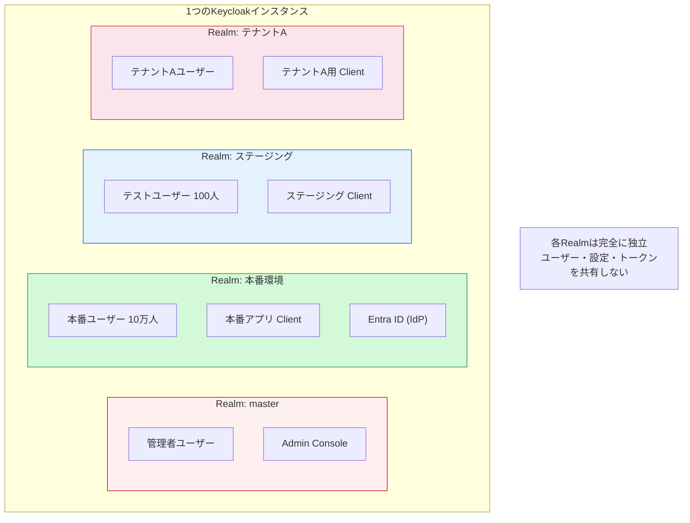
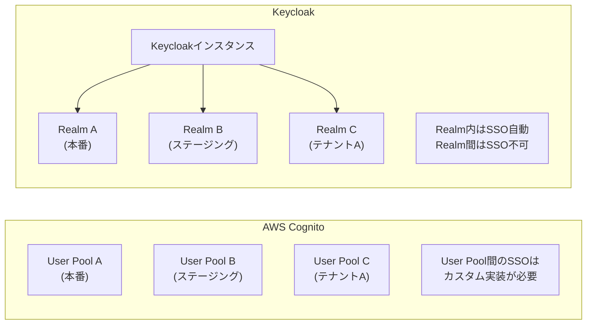
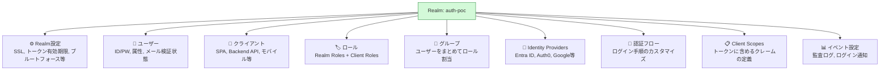
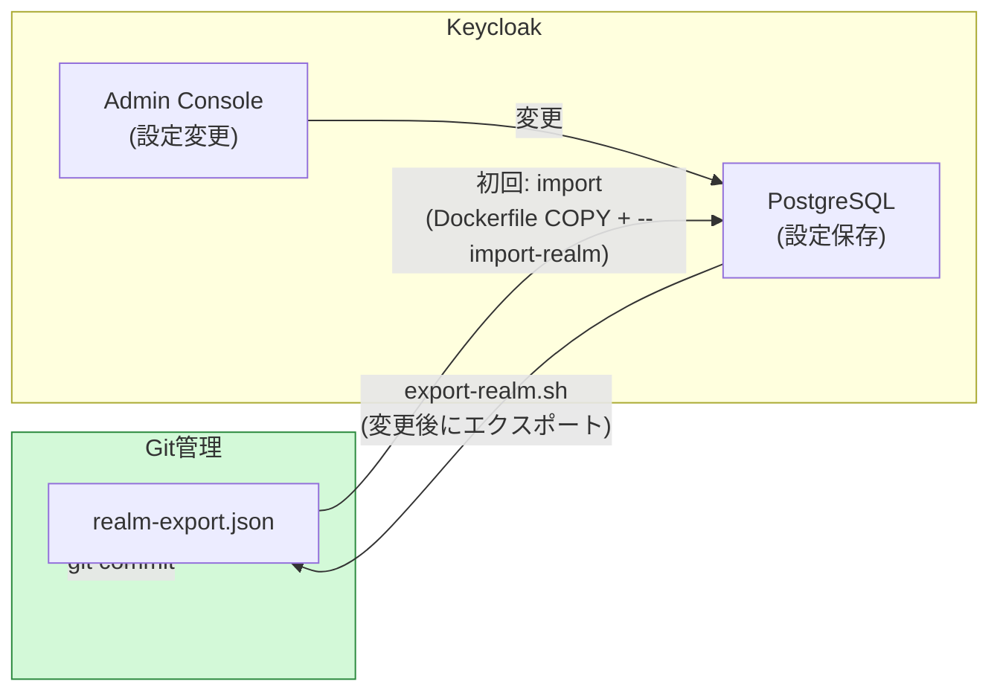
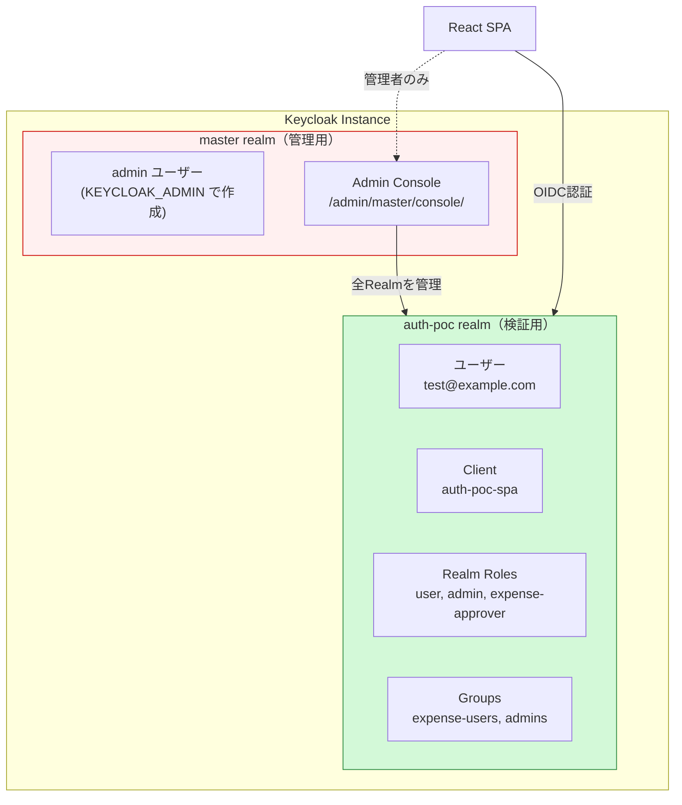
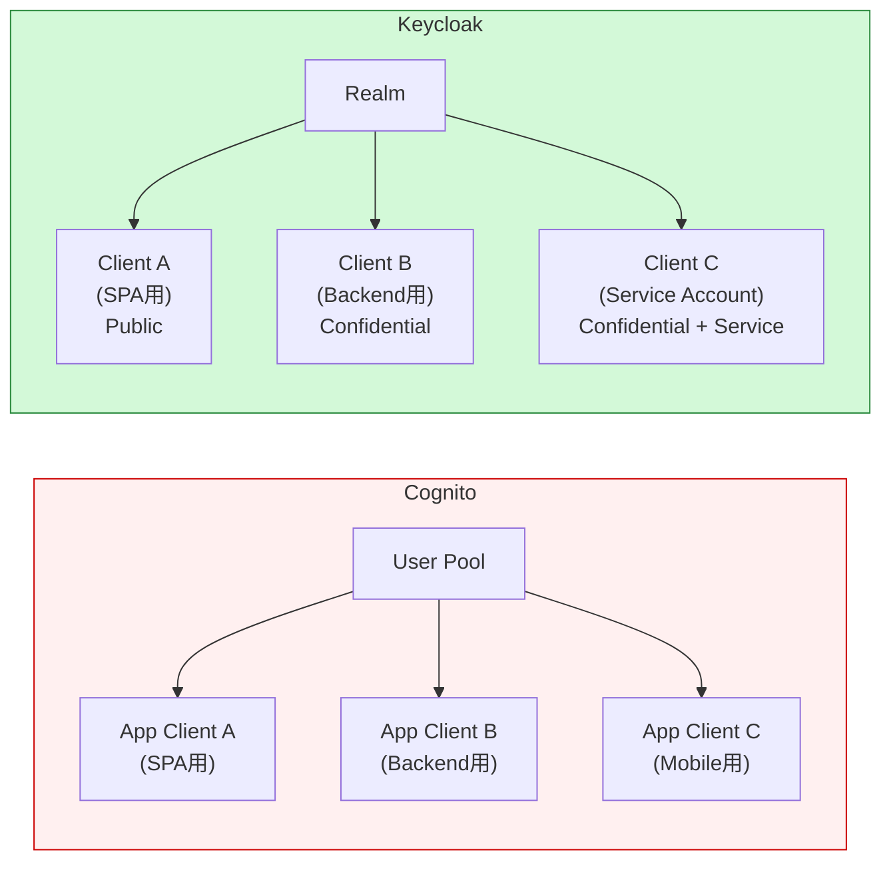
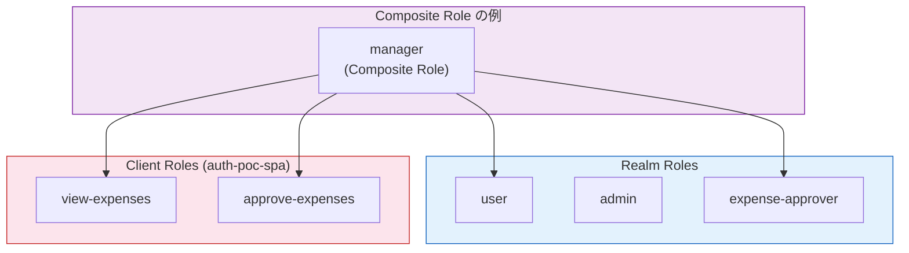
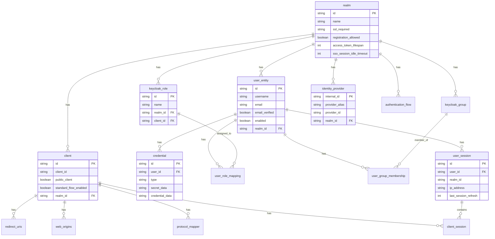
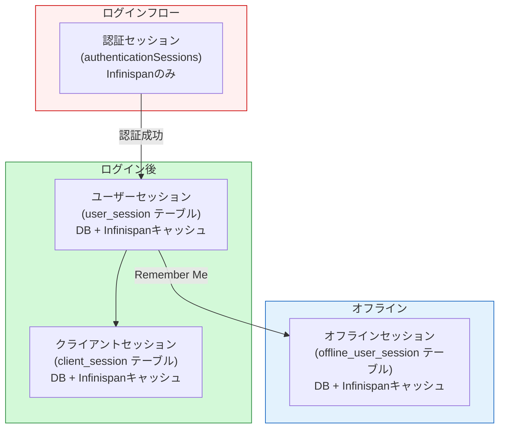

# Keycloak Realm設計とDB構造

**作成日**: 2026-03-25
**対象**: Keycloak 26.0.8 on ECS Fargate + RDS PostgreSQL 16.13

---

## 1. そもそもRealmとは何か

### 1.1 Realmの概念

**Realm = 認証の世界（境界）**。1つのKeycloakインスタンスの中に複数のRealmを持てる。

Realmは以下を**完全に分離**して管理する：
- ユーザー（同じメールアドレスでも Realm が違えば別ユーザー）
- クライアント（アプリケーション）
- ロール・グループ
- IdP設定
- 認証フロー
- セッション
- トークン（issuer が Realm ごとに異なる）



### 1.2 Realmの使い分けパターン

| パターン | Realm設計 | 適用場面 |
|---------|----------|---------|
| **環境分離** | 本番 / ステージング / 開発 | 環境ごとに別Realm |
| **テナント分離** | テナントA / テナントB / ... | マルチテナントSaaS |
| **サービス分離** | 経費精算 / 出張予約 / ... | サービスごとに別Realm |
| **統合（推奨）** | 1つのRealmに全ユーザー | **SSO が必要な場合** |

**重要**: SSO（シングルサインオン）は**同一Realm内でのみ有効**。Realm間のSSOはできない。

そのため、「経費精算にログインしたら出張予約にもログインできる」を実現するには、**1つのRealmに統合する**必要がある。

### 1.3 Cognito User Pool との概念比較



| 概念 | Cognito | Keycloak |
|------|---------|----------|
| テナント/環境の分離単位 | **User Pool** | **Realm** |
| 1インスタンスに複数持てるか | N/A（AWSアカウント内に複数Pool） | 1つのKeycloakに複数Realm |
| SSO範囲 | User Pool内（App Client間） | **Realm内（Client間）** |
| 管理用の特別な単位 | なし（IAMで管理） | **master realm** |
| 設定のエクスポート | AWS API / Terraform | **realm-export.json** |
| OIDC issuer | `https://cognito-idp.{region}.amazonaws.com/{poolId}` | `http://{host}/realms/{realm名}` |

### 1.4 Realmの中に含まれるもの

1つのRealmには以下が全て含まれる：



---

## 2. realm-export.json の解説

Realmの設定は**JSON形式でエクスポート/インポート**できる。これがGit管理の対象となる。

ファイル: `keycloak/config/realm-export.json`

### 2.1 設定ファイルの構造（注釈付き）

```jsonc
{
  // ===== Realm基本設定 =====
  "realm": "auth-poc",                    // Realm名（OIDC issuerの一部になる）
  "enabled": true,                         // Realmの有効/無効
  "displayName": "Auth PoC - Keycloak",   // Admin Console上の表示名
  "sslRequired": "NONE",                  // SSL要件: NONE/EXTERNAL/ALL
                                           //   NONE: PoCでHTTP使用時
                                           //   EXTERNAL: 本番推奨（外部はHTTPS必須、内部はHTTP可）
                                           //   ALL: 全通信HTTPS必須

  // ===== ログイン・登録設定 =====
  "registrationAllowed": true,            // セルフサインアップの許可
  "loginWithEmailAllowed": true,          // メールアドレスでログイン可能
  "duplicateEmailsAllowed": false,        // メールアドレスの重複禁止
  "resetPasswordAllowed": true,           // パスワードリセット機能
  "editUsernameAllowed": false,           // ユーザー名の変更禁止

  // ===== ブルートフォース対策 =====
  "bruteForceProtected": true,            // 有効化
  "permanentLockout": false,              // 永久ロック（falseなら一時ロック）
  "failureFactor": 5,                     // ★ ロックまでの失敗回数
  "maxFailureWaitSeconds": 900,           // 最大ロック時間（15分）
  "waitIncrementSeconds": 60,             // ロック時間の増分
  "quickLoginCheckMilliSeconds": 1000,    // 連続ログイン検知間隔
  "maxDeltaTimeSeconds": 43200,           // 失敗カウントのリセット時間（12時間）

  // ===== トークン有効期限 =====
  "accessTokenLifespan": 3600,            // アクセストークン: 1時間（秒）
  "ssoSessionIdleTimeout": 1800,          // SSOセッション無操作タイムアウト: 30分
  "ssoSessionMaxLifespan": 36000,         // SSOセッション最大寿命: 10時間
  "offlineSessionIdleTimeout": 2592000,   // オフラインセッション: 30日
  "accessCodeLifespan": 60,               // 認可コード有効期限: 60秒
  "accessCodeLifespanUserAction": 300,    // ユーザーアクション期限: 5分

  // ===== ロール定義 =====
  "roles": {
    "realm": [
      { "name": "user", "description": "一般ユーザー" },
      { "name": "admin", "description": "管理者" },
      { "name": "expense-approver", "description": "経費承認者" }
    ]
    // client ロールも定義可能（ここでは省略）
  },

  // ===== グループ定義 =====
  "groups": [
    {
      "name": "expense-users",
      "realmRoles": ["user"]              // グループに所属すると自動でロール付与
    },
    {
      "name": "expense-approvers",
      "realmRoles": ["user", "expense-approver"]  // 複数ロール
    },
    {
      "name": "admins",
      "realmRoles": ["user", "admin"]
    }
  ],

  // ===== クライアント定義 =====
  "clients": [
    {
      "clientId": "auth-poc-spa",           // Client ID（OIDCの client_id）
      "name": "Auth PoC SPA",
      "enabled": true,
      "publicClient": true,                 // ★ Public Client（シークレットなし = SPA向け）
      "standardFlowEnabled": true,          // Authorization Code Flow
      "implicitFlowEnabled": false,         // Implicit Flow（非推奨、無効）
      "directAccessGrantsEnabled": false,   // Resource Owner Password（非推奨、無効）
      "protocol": "openid-connect",
      "rootUrl": "http://localhost:5174",
      "redirectUris": [                     // ★ 許可するリダイレクトURI
        "http://localhost:5174/callback",
        "http://localhost:5174/*"
      ],
      "webOrigins": ["http://localhost:5174"], // ★ CORS許可オリジン
      "attributes": {
        "pkce.code.challenge.method": "S256",   // ★ PKCE必須
        "post.logout.redirect.uris": "http://localhost:5174/"  // ログアウト後リダイレクト
      },
      "defaultClientScopes": [             // トークンに含めるスコープ
        "openid", "profile", "email", "roles"
      ]
    },
    {
      "clientId": "auth-poc-backend",       // バックエンドAPI用
      "publicClient": false,                // ★ Confidential Client（シークレットあり）
      "serviceAccountsEnabled": true,       // サービスアカウント（Client Credentials Flow）
      "standardFlowEnabled": false,
      "secret": "change-me-in-production"   // ★ クライアントシークレット
    }
  ],

  // ===== テストユーザー =====
  "users": [
    {
      "username": "test@example.com",
      "email": "test@example.com",
      "emailVerified": true,
      "enabled": true,
      "firstName": "Test",
      "lastName": "User",
      "credentials": [{
        "type": "password",
        "value": "TestUser1!",              // ★ インポート時にハッシュ化される
        "temporary": false                  // false = 初回ログイン時にパスワード変更不要
      }],
      "groups": ["expense-users"]           // グループ所属 → user ロール自動付与
    }
    // ... 他のユーザー省略
  ],

  // ===== スコープマッピング =====
  "scopeMappings": [{
    "client": "auth-poc-spa",
    "roles": ["user", "admin", "expense-approver"]  // SPAに許可するロール
  }]
}
```

### 2.2 Cognito Terraform との設定対応

| realm-export.json | Cognito Terraform | 説明 |
|-------------------|-------------------|------|
| `realm` | `aws_cognito_user_pool.name` | 名前 |
| `sslRequired` | N/A（AWS管理） | SSL設定 |
| `registrationAllowed` | `allow_admin_create_user_only = false` | セルフサインアップ |
| `bruteForceProtected` / `failureFactor` | Advanced Security Features | ブルートフォース |
| `accessTokenLifespan` | `id_token_validity` / `access_token_validity` | トークン有効期限 |
| `clients[].clientId` | `aws_cognito_user_pool_client.name` | クライアント |
| `clients[].publicClient` | `generate_secret = false` | Public/Confidential |
| `clients[].redirectUris` | `callback_urls` | リダイレクトURI |
| `users[]` | `aws cognito-idp admin-create-user` | ユーザー作成 |
| `roles.realm[]` | `aws_cognito_user_group` | ロール/グループ |

### 2.3 設定ファイルの管理フロー



**重要な注意点**:
- `--import-realm` は**初回のみ**インポートする（既存Realmがあればスキップ）
- Admin Consoleで変更した内容は**自動ではrealm-export.jsonに反映されない**
- 変更後は `bash export-realm.sh` → `git commit` が必要
- エクスポートしたJSONにはユーザーの**パスワードハッシュ**が含まれるため、Gitに含める場合は注意
- Cognitoの場合、設定はTerraformが単一の真実の情報源。Keycloakは「Admin Console → DB → export → JSON → Git」と逆方向の管理になる

---

## 3. PoC Realm構成

### 3.1 Realm一覧

| Realm | 用途 | 自動作成 |
|-------|------|---------|
| **master** | Keycloak管理用（Admin Console認証） | Keycloak初回起動時に自動作成 |
| **auth-poc** | PoC検証用（SPA認証） | realm-export.json でインポート |

### 1.2 Realm間の関係



**重要**: master realmは管理専用。エンドユーザーの認証には**絶対に使わない**。CognitoにはこのRealm分離の概念がない（User Poolが直接テナント単位）。

### 1.3 auth-poc Realm の設定詳細

| 設定 | 値 | Cognitoの対応 |
|------|-----|-------------|
| Realm名 | `auth-poc` | User Pool名 |
| SSL Required | `NONE`（PoC、HTTPのため） | AWS管理（常にHTTPS） |
| Registration | 許可 | セルフサインアップ |
| Login with email | 有効 | Cognitoと同じ |
| Brute force protection | 有効（5回失敗でロック） | Cognito Advanced Security |
| Token有効期限 | Access: 1時間, SSO Session: 30分 idle / 10時間 max | App Client設定 |
| Refresh Token | Offline Session: 30日 | App Client設定 |

---

## 4. Client設計

### 2.1 auth-poc-spa（SPA用）

| 項目 | 値 | Cognito App Client との対応 |
|------|-----|---------------------------|
| Client ID | `auth-poc-spa` | App Client ID |
| Client Authentication | **OFF**（Public Client） | シークレットなし |
| Standard Flow | **ON**（Authorization Code） | OAuth Flow |
| Direct Access Grants | OFF | AdminAPIのみで使用 |
| PKCE | S256（必須） | Cognito も PKCE 対応 |
| Valid Redirect URIs | `http://localhost:5174/*` | コールバックURL |
| Web Origins | `http://localhost:5174` | CORS設定 |
| Post Logout Redirect URIs | `http://localhost:5174/*` | ログアウトURL |

### 2.2 Cognito App Client との構造の違い



**主な違い**:
- Keycloakの Client は Cognito の App Client より設定項目が多い（Protocol Mappers, Scope, Policies等）
- Keycloakは Client Type で「Public / Confidential / Bearer-only」を選択
- Cognito は App Client ごとに許可するOAuth Flowを選択

---

## 5. ロールとグループ

### 3.1 現在の設定

| 種別 | 名前 | 説明 |
|------|------|------|
| Realm Role | `user` | 一般ユーザー |
| Realm Role | `admin` | 管理者（未作成、必要時に追加） |
| Realm Role | `expense-approver` | 経費承認者（未作成、必要時に追加） |

### 3.2 Cognito Groups との比較

| 観点 | Cognito | Keycloak |
|------|---------|----------|
| 権限の単位 | **Groups**（グループ） | **Roles**（ロール） |
| JWTクレーム | `cognito:groups` | `realm_access.roles` |
| 階層 | フラット | Realm Roles + Client Roles（2階層） |
| 複合ロール | なし | **Composite Roles**（ロールの中にロールを含められる） |
| IAMとの連携 | Identity Pool経由 | なし（Keycloak独自） |

### 3.3 Keycloakのロール階層



PoCでは Realm Roles のみ使用。Client Roles と Composite Roles は本番設計で検討。

---

## 6. PostgreSQL DB構造

### 4.1 主要テーブル一覧

Keycloakは起動時にDBスキーマを自動作成する。主要なテーブルは以下の通り。

| テーブル | 内容 | レコード例 |
|---------|------|-----------|
| **`realm`** | Realm設定 | `id=auth-poc, ssl_required=NONE` |
| **`client`** | Client設定 | `client_id=auth-poc-spa, public_client=true` |
| **`user_entity`** | ユーザー | `username=test@example.com, email_verified=true` |
| **`credential`** | 認証情報（パスワードハッシュ等） | `type=password, secret_data={hash}` |
| **`user_role_mapping`** | ユーザー↔ロールの紐付け | `user_id=xxx, role_id=yyy` |
| **`keycloak_role`** | ロール定義 | `name=user, realm_id=auth-poc` |
| **`keycloak_group`** | グループ定義 | `name=expense-users` |
| **`user_group_membership`** | ユーザー↔グループの紐付け | `user_id=xxx, group_id=yyy` |
| **`user_session`** | アクティブセッション（KC26: DB保存） | `user_id=xxx, ip_address=...` |
| **`client_session`** | クライアントセッション | `session_id=xxx, client_id=yyy` |
| **`offline_user_session`** | オフラインセッション | リフレッシュトークン用 |
| **`identity_provider`** | 外部IdP設定 | `provider_alias=Auth0, provider_id=oidc` |
| **`identity_provider_mapper`** | IdP属性マッピング | `name=email, idp_alias=Auth0` |
| **`protocol_mapper`** | トークンクレームマッピング | `name=realm roles, protocol=openid-connect` |
| **`authentication_flow`** | 認証フロー定義 | `alias=browser, provider_id=basic-flow` |
| **`realm_attribute`** | Realm追加属性 | `name=bruteForceProtected, value=true` |
| **`redirect_uris`** | Client許可リダイレクトURI | `client_id=xxx, value=http://localhost:5174/*` |
| **`web_origins`** | Client CORS設定 | `client_id=xxx, value=http://localhost:5174` |
| **`event_entity`** | 監査ログ（有効化時） | `type=LOGIN, realm_id=auth-poc` |

### 4.2 ER図（主要テーブル）



### 4.3 Cognito User Pool との対応

| Keycloak テーブル | Cognito の対応 |
|------------------|---------------|
| `realm` | User Pool 設定 |
| `client` | App Client |
| `user_entity` + `credential` | User Pool 内ユーザー |
| `keycloak_role` | Groups |
| `identity_provider` | Identity Providers（OIDC/SAML） |
| `user_session` | Cognito内部管理（利用者から見えない） |
| `authentication_flow` | Cognito Lambda Triggers（Pre/Post Auth等） |
| `event_entity` | CloudTrail + Cognito Advanced Security |

**根本的な違い**: Cognitoではこれらは全てAWS APIで管理され、DBを直接操作することはない。Keycloakでは全てPostgreSQLのテーブルに保存されるため、DBバックアップ=設定+ユーザー+セッションの全てのバックアップとなる。

---

## 7. セッション管理の詳細（KC26）

### 5.1 セッションの種類



### 5.2 セッションの有効期限

| 設定 | デフォルト | 説明 |
|------|----------|------|
| SSO Session Idle | 30分 | 無操作でセッション切れ |
| SSO Session Max | 10時間 | 最大セッション寿命 |
| Access Token Lifespan | 5分（KC標準）/ 1時間（PoC設定） | JWT有効期限 |
| Offline Session Idle | 30日 | リフレッシュトークン寿命 |

### 5.3 Cognito との比較

| 観点 | Cognito | Keycloak |
|------|---------|----------|
| セッション保存先 | AWS内部（不可視） | **PostgreSQL + Infinispan** |
| セッション操作 | AdminAPI（globalSignOut等） | Admin Console + REST API + DB直接 |
| セッション可視性 | ログのみ | **Admin Console → Sessions タブで全セッション一覧可能** |
| 強制ログアウト | `admin-initiate-auth` で個別revoke | Admin Console から個別/全体セッション破棄 |

---

## 8. 現在のAWSリソース一覧（Phase 6）

### 6.1 Keycloak関連リソース（`auth-poc-kc-*`）

| リソース | 名前 | 仕様 | 月額コスト概算 |
|---------|------|------|-------------|
| ALB | auth-poc-kc-alb | HTTP:80 | ~$24 |
| ECS Cluster | auth-poc-kc-cluster | - | $0 |
| ECS Service | auth-poc-kc-service | Fargate, desired=1 | ~$30（稼働時） |
| ECS Task | auth-poc-kc-task | 1 vCPU / 2GB | 上記に含む |
| RDS | auth-poc-kc-db | db.t4g.micro, PostgreSQL 16.13 | ~$15（稼働時） |
| ECR | auth-poc-kc-repo | Keycloakイメージ | ~$0.10 |
| CloudWatch | /ecs/auth-poc-kc | ログ保持7日 | ~$0 |
| Security Group | auth-poc-kc-alb-sg | HTTP:80（自分のIPのみ） | $0 |
| Security Group | auth-poc-kc-ecs-sg | 8080（ALBからのみ） | $0 |
| Security Group | auth-poc-kc-rds-sg | 5432（ECSからのみ） | $0 |

### 6.2 コスト管理コマンド

```bash
# 停止（ECS + RDS → ALBの$0.80/日のみ）
bash keycloak/stop.sh

# 起動
bash keycloak/start.sh

# 完全削除（Cognito側に影響なし）
cd infra/keycloak && terraform destroy
```

### 6.3 Terraform state の分離

```
infra/                    ← Cognito + API Gateway（Phase 1-4）
infra/dr-osaka/           ← 大阪DR Cognito（Phase 5）
infra/keycloak/           ← Keycloak全リソース（Phase 6）★独立
```

`infra/keycloak/` の `terraform destroy` で Keycloak関連リソースのみ削除可能。

---

## 9. トークンの比較

### 7.1 IDトークンのクレーム

| クレーム | Cognito | Keycloak | 説明 |
|---------|---------|----------|------|
| `iss` | `https://cognito-idp.{region}.amazonaws.com/{poolId}` | `http://{alb-dns}/realms/auth-poc` | 発行者 |
| `sub` | UUID | UUID | ユーザーID |
| `aud` | Client ID | Client ID | 対象クライアント |
| `email` | ✅ | ✅ | メールアドレス |
| `email_verified` | ✅ | ✅ | メール検証済み |
| `cognito:groups` | ✅（グループ） | - | Cognito固有 |
| `realm_access.roles` | - | ✅（ロール） | Keycloak固有 |
| `identities` | ✅（フェデレーション時） | - | Cognito固有 |
| `preferred_username` | - | ✅ | Keycloak固有 |
| `name` | △（設定次第） | ✅ | フルネーム |

### 7.2 アクセストークンのクレーム

| クレーム | Cognito | Keycloak | 説明 |
|---------|---------|----------|------|
| `aud` | **なし**（`client_id`で代替） | **あり** | ★大きな違い |
| `scope` | ✅ | ✅ | 許可スコープ |
| `realm_access.roles` | - | ✅ | ロール |
| `resource_access` | - | ✅ | クライアント別ロール |

**Lambda Authorizer への影響**: CognitoのアクセストークンにはaudがないためPyJWTの`verify_aud=False`が必要だった。Keycloakではaudが含まれるため標準的な検証が可能。
