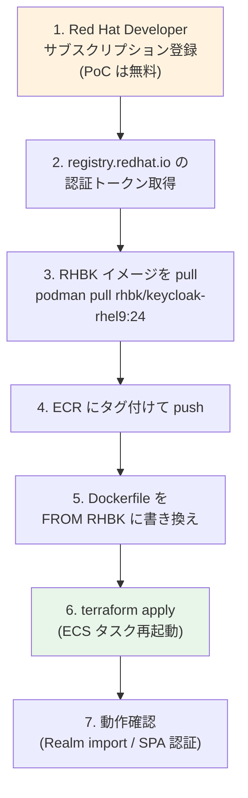

# Keycloak: Upstream（OSS版）vs Red Hat build of Keycloak（RHBK）

> 最終更新: 2026-04-24
> 対象: 共有認証基盤の本番ディストリビューション選定検討

---

## 1. 用語整理

### 1.1 「Upstream Keycloak」と「OSS 版」は同一

**結論: 一般的に同じものを指す**。Keycloak エコシステムでは以下の用語が同義に使われる:

| 呼称 | 指すもの |
|-----|--------|
| **Keycloak**（無印） | コミュニティ版 = Upstream |
| **Upstream Keycloak** | コミュニティが直接配布する元コードベース・イメージ |
| **OSS 版 Keycloak** | 同上（オープンソース版を強調する呼び方） |
| **Community Keycloak** | 同上（商用版との対比で使われる） |

実体:
- ソースコード: <https://github.com/keycloak/keycloak>
- 公式コンテナ: `quay.io/keycloak/keycloak:<version>`
- ライセンス: Apache 2.0
- 配布主体: Keycloak Community（CNCF 関連プロジェクト）

PoC は `quay.io/keycloak/keycloak:26.0.8` を使用しており、これが **Upstream = OSS 版**。

### 1.2 関連ディストリビューション

Keycloak には Upstream を基盤にした派生ディストリビューションが複数ある:

| 名称 | 提供元 | 立ち位置 |
|------|-------|---------|
| **Keycloak**（Upstream / OSS 版） | Keycloak Community | 元のコードベース・最新機能 |
| **Red Hat build of Keycloak (RHBK)** | Red Hat | Red Hat の商用ディストリビューション（後継: Red Hat Single Sign-On / RH-SSO） |
| **Red Hat SSO（RH-SSO）** | Red Hat | RHBK の前身、Keycloak 18 までの旧版（**サポート終了予定**） |
| **Phase Two** | サードパーティ | マネージド Keycloak SaaS |
| **Cloud-IAM**、その他 | サードパーティ | マネージドサービス |

**RHBK と RH-SSO の関係**:
- RH-SSO は Keycloak 18 までのバージョンを Red Hat が再パッケージ化したもの
- 2023 年の Keycloak 22 から RHBK にリブランド
- 内部実装は Quarkus 化済（Keycloak 17 以降と同じ）

---

## 2. Upstream と RHBK の関係

### 2.1 内部実装の同一性

**Keycloak 17 以降（Quarkus 化以降）、Upstream と RHBK の内部実装はほぼ完全に同一**。Red Hat はソースコードに大きな改変を加えず、以下を提供する:

| Red Hat の付加価値 | 内容 |
|----------------|------|
| 商用サポート | 24/7 もしくは営業時間サポート（プランによる） |
| 認定コンテナイメージ | UBI 9 ベース、CVE バックポート済 |
| FIPS 140-2 認定 | 米国政府要件への適合 |
| LTS 的なバージョン管理 | 主要バージョンを長期サポート |
| エラータ（CVE 修正のリリース） | Red Hat 独自のセキュリティ修正配布 |
| QE / 互換性検証 | RHEL / OpenShift / Ansible 等との統合検証 |

### 2.2 詳細比較

| 項目 | Upstream（現 PoC） | Red Hat build of Keycloak |
|------|-----------------|--------------------------|
| 提供元 | Keycloak Community | Red Hat |
| ベースイメージ | `quay.io/keycloak/keycloak:26.0` | `registry.redhat.io/rhbk/keycloak-rhel9:<ver>` |
| ベース OS | UBI / minimal | Red Hat UBI 9 |
| ライセンス | Apache 2.0 | Apache 2.0 + RH サブスクリプション |
| 内部実装 | Quarkus ベース（17+） | 同一（Quarkus ベース） |
| 設定ファイル | `realm-export.json`、env vars | **同一** |
| OIDC / SAML 機能 | 標準 OIDC / SAML | **同一** |
| 管理コンソール UI | 同一 | 同一 |
| バージョンサイクル | 月次〜四半期 | 年次（Long Life） |
| 最新追従 | 即時 | 1〜2 メジャー遅れ |
| サポート | コミュニティ | **Red Hat 商用サポート** |
| FIPS 140-2 認定 | 自前設定 | **Red Hat 認定 FIPS モード** |
| CVE / セキュリティパッチ | コミュニティ任せ | **Red Hat エラータ + バックポート** |
| 価格 | 無料 | サブスクリプション必須（本番） |
| イメージサイズ | ~250MB | ~400MB（UBI 含む） |

---

## 3. PoC 切り替え難易度（技術観点）

### 3.1 評価: **容易**（半日〜1 日作業）

技術的には Dockerfile の `FROM` 行を変更するだけ。以下の通り、**ほぼ全ての設定・インフラがそのまま流用可能**。

### 3.2 変更が必要なもの

| ファイル | 現状 | RHBK 切替後 | 難易度 |
|---------|------|-----------|:----:|
| `keycloak/Dockerfile` | `FROM quay.io/keycloak/keycloak:26.0` | `FROM registry.redhat.io/rhbk/keycloak-rhel9:24` | ★ 1 行 |
| `keycloak/deploy.sh` | `docker pull` | registry.redhat.io への認証追加 | ★★ |
| `infra/keycloak/ecs.tf` の `keycloak_image_tag` | 現タグ | RHBK のバージョン番号 | ★ |

### 3.3 変更不要なもの

| 項目 | 状態 |
|------|------|
| Terraform インフラ全般（VPC / ALB / ECS / RDS / VPC Endpoint） | ✅ そのまま |
| `realm-export.json` | ✅ 互換性あり |
| 環境変数（`KC_DB`、`KC_PROXY_HEADERS`、`KC_HOSTNAME_*` 等） | ✅ 同一 |
| Lambda Authorizer / SPA / API Gateway | ✅ 影響なし |
| `start-dev` / `start --optimized` モード | ✅ 同一 |
| ネットワーク構成（[keycloak-network-architecture.md](../common/keycloak-network-architecture.md)） | ✅ そのまま |

### 3.4 切り替え作業フロー

**所要時間目安**: 半日〜1 日（初回認証設定込み）

### 3.5 注意すべき非互換ポイント

#### バージョン差

- 現 PoC: Upstream **26.0**（最新）
- RHBK の最新（2026-01 時点想定）: 概ね **24** 系
- バージョンを下げる必要が出る可能性

PoC で使用中の機能（OIDC、SAML、Identity Brokering、TOTP MFA、Protocol Mapper、Pre Token Lambda 連携用クレーム）は **RHBK 24 系で全て利用可能**。実用上の影響は小さい。

#### 認証付きレジストリ

`registry.redhat.io` は認証必須なので、ECS Fargate での pull に工夫が必要:

| 方式 | 内容 | 推奨度 |
|-----|------|:---:|
| A | RHBK イメージを ECR にミラーリング → ECS は ECR から pull | ⭐ 推奨 |
| B | ECS タスク定義で `repositoryCredentials` に Secrets Manager 参照 | △ |
| C | Red Hat Quay (cloud) 経由で配信 | △ |

PoC は方式 A が最も簡単（既存 ECR フローをそのまま使える）。

#### イメージサイズ

Upstream ~250MB → RHBK ~400MB。ECS タスクの起動時間が若干増（数秒〜10 秒）。運用上の問題はない。

---

## 4. 本番採用判断のフレーム

### 4.1 RHBK が向いているケース

1. **顧客が既に Red Hat / OpenShift を使用** — 統合運用しやすい
2. **24/7 サポートが必須** — 自前障害対応の人員不足
3. **FIPS 140-2 / 監査要件あり** — 金融・医療・政府系
4. **保守的なバージョンポリシーが好ましい** — 機能追従より安定性
5. **CVE 対応の代行** — 自前で追い続けるコストを Red Hat に外出し

### 4.2 Upstream を選ぶべきケース

1. **コスト重視** — サブスクリプション数十万〜数百万円/年/ノードを払えない
2. **最新機能を即座に使いたい** — 例: Organizations 機能、新 Token Exchange v2
3. **Keycloak / Quarkus の社内専門家がいる** — 自己解決可能
4. **PoC・開発・非クリティカル環境** — 商用サポート不要

### 4.3 コスト影響（参考値）

Red Hat のサブスクリプションは Self-Support / Standard / Premium の階層構成:

| プラン | 想定価格帯（参考） | 備考 |
|------|-----------------|------|
| Developer Subscription | **無料** | **本番禁止、PoC・開発のみ** |
| Self-Support | $1,000〜2,000/年/ノード | 商用利用可、サポートなし |
| Standard | $5,000〜15,000/年/ノード | 営業時間サポート |
| Premium | $10,000〜30,000/年/ノード | 24/7 サポート |

PoC HA 構成（3 タスク）想定: **年間 $15,000〜90,000 程度の追加コスト**

#### ADR-006（コスト損益分岐）への影響

現 ADR-006 は Upstream Keycloak 前提で **損益分岐 175,000 MAU**。RHBK Premium 3 ノードを採用すると:

| 項目 | Upstream Keycloak | RHBK Premium |
|-----|-----------------|-------------|
| インフラ月額 | $940 | $940 |
| RHBK サブスク（3 ノード × $30,000/年 ÷ 12） | $0 | $7,500 |
| 運用人件費 | $1,680 | $840（半減想定） |
| **合計** | **$2,620** | **$9,280** |

→ **損益分岐は 600,000 MAU 程度まで上昇**（Cognito 優位の MAU 帯がさらに広がる）。  
→ ただし、自前運用工数が削減されるため、**人件費換算で実質コスト差は小さくなる**。

---

## 5. PoC への組み込み方（提案）

### 5.1 短期（PoC 内で互換性検証）

1. **Red Hat Developer Subscription（無料）** に登録
2. RHBK 24 系イメージを取得
3. ECR にミラーリング
4. Dockerfile `FROM` 行を切替
5. `terraform apply` で再デプロイ
6. **比較検証**: Upstream 26 vs RHBK 24 で機能差を実測

→ **半日〜1 日で完了**、追加コストなし（Developer Subscription は無料）

### 5.2 本番判断（要件定義で確認すべき項目）

| 確認項目 | RHBK 採用への影響 |
|---------|----------------|
| 顧客が Red Hat 製品の利用実績ありか | 採用の追い風 |
| FIPS 認定 / 業界規制（金融・医療等）の要否 | **必須要因** |
| 24/7 サポートが必須か | 強い候補 |
| 年間サブスクリプション予算（数十万〜数百万円）の余地 | **採否の決定要因** |
| Keycloak の自前運用ノウハウ（Java / Quarkus 知識）の有無 | Upstream 採用の判断材料 |
| 既存の Red Hat サブスクリプション枠の流用可否 | コスト削減可能性 |

### 5.3 関連 ADR の追加候補

| ADR | テーマ | 起票タイミング |
|-----|------|-------------|
| ADR-015（提案） | Upstream Keycloak vs RHBK 選定 | 要件定義で「サポート要否 / FIPS 要否 / 予算」を確認後 |
| ADR-006（更新） | コスト損益分岐に RHBK ケースを追記 | 同上 |

---

## 5.4 ライセンス取得不可の場合の対応（本 PoC のケース）

> **本 PoC ではこの制約に該当**: Red Hat ライセンス（無料 Developer Subscription を含む）を PoC 期間中に取得できない。
> 関連 ADR: [ADR-015](../adr/015-rhbk-validation-deferred.md)

### 5.4.1 制約の内容

`registry.redhat.io` からの RHBK イメージ取得には、最低限 Red Hat Developer Subscription（無料、個人登録）が必要。しかし以下の理由から、組織内 PoC では取得が困難:

| 制約 | 影響 |
|------|------|
| 法人契約のリードタイム | 数週間〜数ヶ月、PoC 期間内に間に合わない |
| Developer Subscription（無料）の業務利用 | コンプライアンス上グレー、組織として推奨されない |
| `registry.redhat.io` への匿名アクセス | **不可**（認証必須）|

→ **PoC 期間中、RHBK イメージを pull する手段がない = 技術的な切替検証は不可能**。

### 5.4.2 検証可能性マトリクス（Upstream のみで進める場合）

| 検証項目 | Upstream で検証可能 | RHBK 固有 |
|---------|:----------------:|:---------:|
| OIDC / SAML / Federation | ✅ | — |
| Realm / Client / User 管理 | ✅ | — |
| Pre Token Mapper / Protocol Mapper | ✅ | — |
| 起動・パフォーマンス挙動 | ✅ | — |
| ECS / RDS との統合 | ✅ | — |
| **FIPS 140-2 モード** | ❌ | **RHBK 必須** |
| **Red Hat バックポート CVE 適用版** | ❌ | RHBK 限定 |
| **`registry.redhat.io` 経由のイメージ配信** | ❌ | RHBK 限定 |
| **商用サポート挙動** | ❌ | RHBK 限定 |
| **バージョン差分（Upstream 26 vs RHBK 24）** | ❌ | RHBK 限定 |

### 5.4.3 採用した方針

**[ADR-015](../adr/015-rhbk-validation-deferred.md): PoC は Upstream のみ、RHBK 検証は本番設計フェーズに先送り**

根拠:

1. **Keycloak 17 以降、Upstream と RHBK の内部実装はほぼ完全に同一**（§2.1）
2. PoC で検証中の機能（OIDC / SAML / Federation / Mapper 群 / MFA）は **RHBK 24 系でも全て利用可能**
3. RHBK 固有の FIPS / 商用サポート / バックポート CVE は **PoC で検証する性質ではない**（OIDC フローや Realm 設定の正しさを保証するものではない）

### 5.4.4 却下した代替案

| 代替案 | 却下理由 |
|-------|--------|
| 個人の Developer Subscription を業務利用 | コンプライアンス上グレー |
| UBI 9 ベースで擬似 RHBK 構成を構築 | 手間が大きく、得られる検証価値（≒ RHBK 公式イメージ動作）に届かない |
| ライセンス取得を待ってから PoC 継続 | リードタイムが長すぎ、PoC スケジュール影響大 |

### 5.4.5 本制約下での Follow-up

要件定義フェーズで以下を確認し、必要なら本番設計時に RHBK 切り替えタスクを実施する:

| 確認項目 | RHBK 採用への影響 |
|---------|----------------|
| FIPS 140-2 認定 / 業界規制（金融・医療等）の要否 | **必須要因** |
| Red Hat 商用サポートの要否（24/7 SLA） | 強い候補 |
| 既存の Red Hat 製品利用実績 / サブスクリプション枠 | 採用の追い風 |
| Red Hat サブスクリプション予算の確保可否 | **採否の決定要因** |

これらが「RHBK 必要」と確定した場合の本番設計タスクは §5.1 を参照（手順は変わらない、実施タイミングのみが本番フェーズに移るだけ）。

---

## 6. まとめ

| 観点 | 評価 |
|------|------|
| **「OSS 版 = Upstream」は同義か** | ✅ 同義（Keycloak Community が配布する元コードベース・イメージ） |
| **PoC で RHBK に切り替える技術難易度** | ⭐ 容易（Dockerfile 1 行 + 認証設定、半日〜1 日）。**ただし本 PoC はライセンス取得不可制約のため実施不可、§5.4 / [ADR-015](../adr/015-rhbk-validation-deferred.md) で本番設計フェーズへ先送り** |
| **Upstream → RHBK で動作変わるか** | ❌ ほぼ変わらない（Keycloak 17+ は内部実装同一） |
| **本番で RHBK を採用すべきか** | ⚠ 要件次第（FIPS 認定 / 24/7 サポート / 顧客の Red Hat 利用実績で判断） |
| **コスト影響** | 🔺 サブスクリプションで年間数十万〜数百万円増。損益分岐 MAU が上昇（Cognito 優位帯が拡大） |

---

## 7. 参考

- Keycloak 公式: <https://www.keycloak.org/>
- Red Hat build of Keycloak 公式: <https://www.redhat.com/en/technologies/cloud-computing/openshift/red-hat-build-of-keycloak>
- 関連 PoC ドキュメント:
  - [keycloak-network-architecture.md](../common/keycloak-network-architecture.md)
  - [auth-patterns.md](../common/auth-patterns.md)
  - [ADR-006](../adr/006-cognito-vs-keycloak-cost-breakeven.md): Cognito vs Keycloak コスト損益分岐
  - [ADR-008](../adr/008-keycloak-start-dev-for-poc.md): PoC で start-dev モードを使用
  - [ADR-015](../adr/015-rhbk-validation-deferred.md): **PoC では RHBK 検証を実施せず本番設計フェーズへ先送り**（Proposed）
