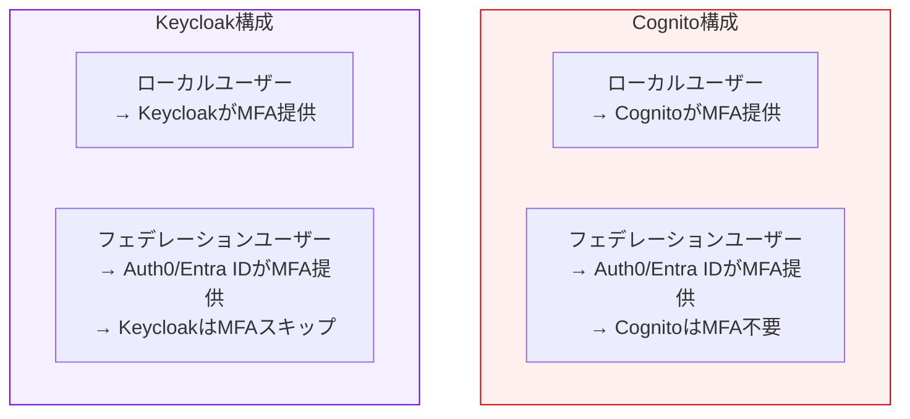
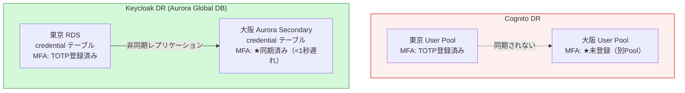
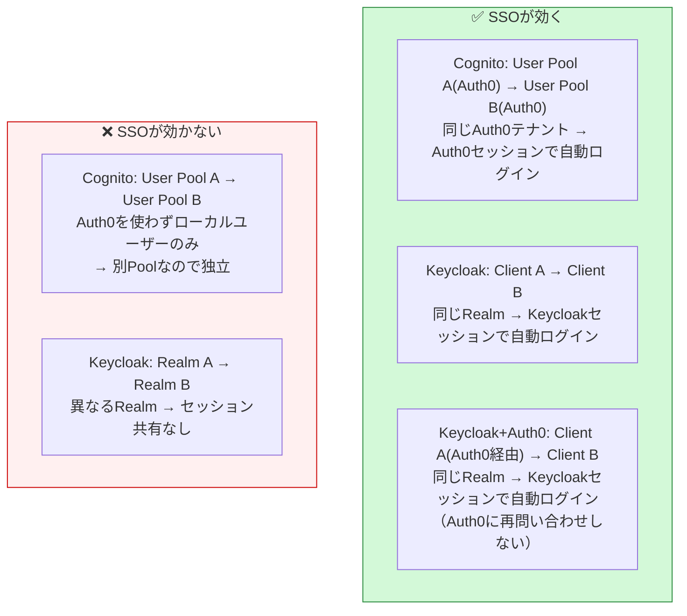
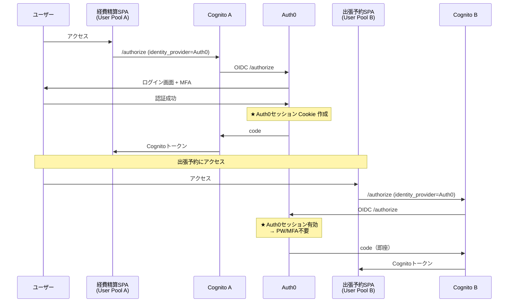
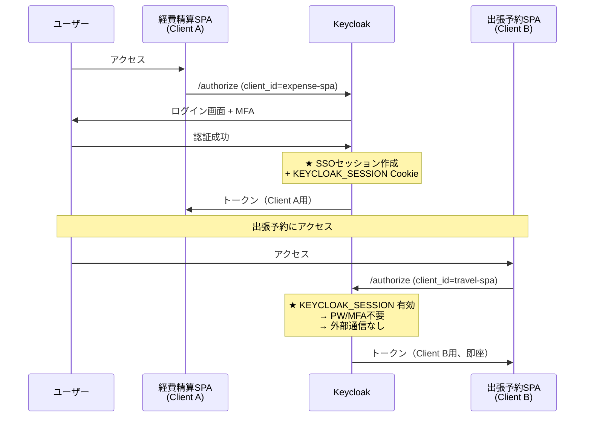
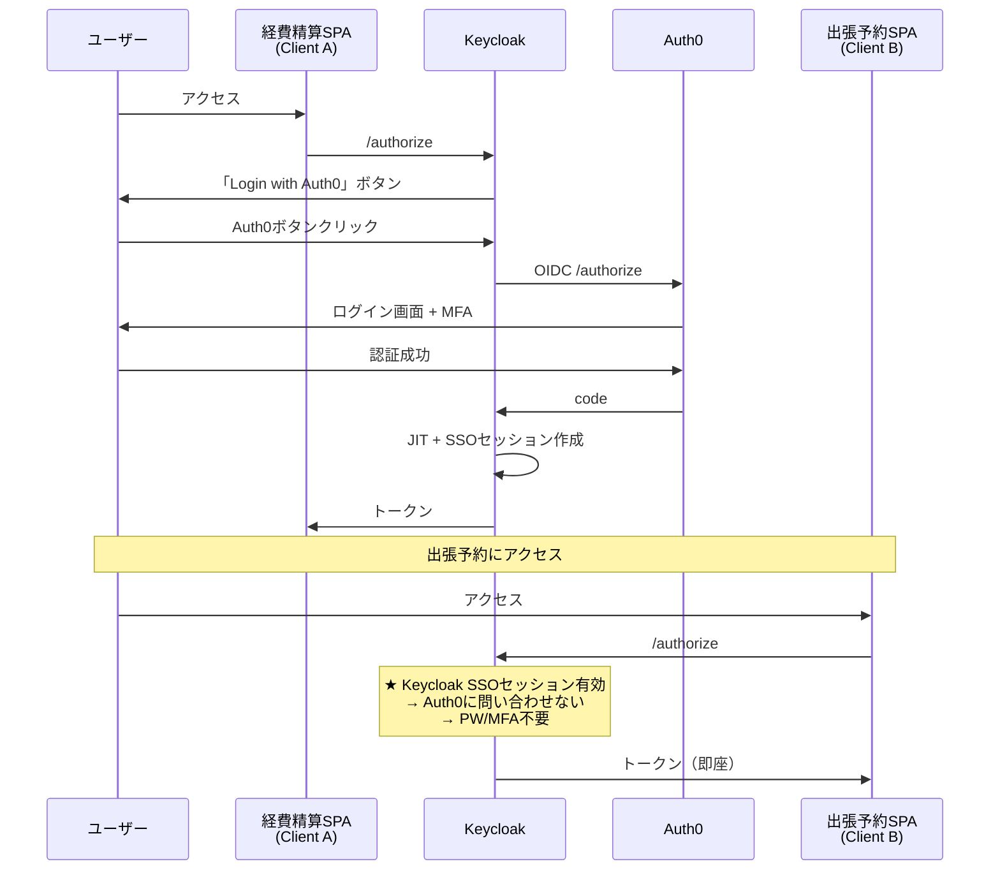
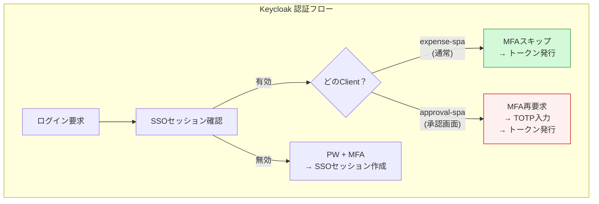

# MFA・SSO 比較マトリクス（Cognito / Keycloak / Auth0）

**作成日**: 2026-03-26

---

## 1. MFA（多要素認証）

### 1.1 MFA対応方式の比較

| MFA方式 | Cognito | Keycloak | Auth0 Free |
|---------|:-------:|:--------:|:----------:|
| **TOTP（Google Authenticator等）** | ✅ | ✅ | ✅ |
| **SMS** | ✅（SNS経由） | ✅（SPI拡張） | ✅ |
| **Email OTP** | ✅（Essentials以上） | ✅ | ✅ |
| **WebAuthn / FIDO2（指紋・顔・YubiKey）** | **✅（2024年11月追加、Essentials以上）** | ✅ | ✅（有料プラン） |
| **Push通知** | ❌ | △（SPI拡張） | ✅（有料プラン） |
| **リカバリーコード** | ❌ | ✅ | ✅ |

> **2024年11月更新**: CognitoにWebAuthn/パスキーサポートが追加された（Essentials以上のプラン）。最大20パスキー/ユーザー登録可能。ただし選択ベース認証フローでのみ利用可能。

### 1.2 MFAの設定・管理の比較

| 観点 | Cognito | Keycloak | Auth0 |
|------|---------|----------|-------|
| **MFA設定場所** | User Pool設定（Terraform） | Realm → Authentication Flow | Auth0 Dashboard |
| **ユーザーごとのMFA強制** | グループ単位 or 全ユーザー | **認証フローで条件分岐可能**（ロール・グループ・IdP別） | ルール/アクションで条件分岐 |
| **MFAデータ保存先** | AWS内部（不可視） | **`credential` テーブル（PostgreSQL）** | Auth0内部（不可視） |
| **MFAの可視性** | ユーザー単位で確認可能（API） | **Admin Console で確認・削除可能** | Dashboard で確認可能 |
| **MFAリセット（管理者）** | `admin-set-user-mfa-preference` | Admin Console → ユーザー → Credentials → 削除 | Dashboard → ユーザー → MFA |

### 1.3 ユーザー種別ごとのMFA責任

| ユーザー種別 | Cognito構成でのMFA | Keycloak構成でのMFA |
|-------------|-------------------|-------------------|
| **ローカルユーザー**（ID/PW直接管理） | Cognito MFA（TOTP/SMS） | **Keycloak MFA（TOTP/WebAuthn）** |
| **フェデレーション（Auth0経由）** | Auth0がMFA | Auth0がMFA（Keycloakスキップ） |
| **フェデレーション（Entra ID経由）** | Entra IDがMFA | Entra IDがMFA（Keycloakスキップ） |

**原則**: MFAは**ユーザーのパスワードを管理している側**が提供する。

### 1.4 MFAデータの障害耐性

| 障害シナリオ | Cognito | Keycloak |
|-------------|---------|----------|
| **認証サーバー再起動** | 影響なし（マネージド） | **影響なし**（DBに保存） |
| **DB障害 → 復旧** | 影響なし（マネージド） | **影響なし**（DB復旧で復元） |
| **DR切替（クロスリージョン）** | 別User Pool → **MFAは同期されない → ユーザーが再登録必要** | Aurora Global DB → **MFAは同期される（<1秒遅れ）** |

**重要な発見**: **DRにおけるMFA維持はKeycloakが優位**。Cognitoでは別User Poolにユーザーがいないため、DR切替後にMFAを含めて再登録が必要。Keycloakではcredentialテーブルがレプリケーションされるため、MFA設定も引き継がれる。

---

## 2. SSO（シングルサインオン）

### 2.1 SSO方式の比較

| 観点 | Cognito + Auth0 | Keycloak単体 | Keycloak + Auth0 |
|------|----------------|-------------|-----------------|
| **SSOの仕組み** | Auth0のセッションCookie | Keycloakのセッション Cookie（`KEYCLOAK_SESSION`） | Keycloakのセッション + Auth0セッション（二層） |
| **SSO範囲** | 同一Auth0テナント配下の全User Pool | **同一Realm内の全Client** | 同一Realm内の全Client |
| **SSOの設定** | 不要（Auth0セッションで自動） | **不要（同一Realm内は自動）** | 不要 |
| **SSOセッション制御** | Auth0のタイムアウト設定 | **SSO Session Idle / Max（Realm設定）** | Keycloak側で制御 |

### 2.2 SSOが効くケースと効かないケース

### 2.3 SSOフロー詳細比較

#### パターン1: Cognito + Auth0

**SSOの主体**: Auth0（Auth0セッションCookieが鍵）

#### パターン2: Keycloak単体（ローカルユーザー）

**SSOの主体**: Keycloak（Keycloakセッションが鍵。外部通信不要でレスポンスが速い）

#### パターン3: Keycloak + Auth0（フェデレーション）

**SSOの主体**: Keycloak（初回のみAuth0に問い合わせ。2回目以降はKeycloakセッションで完結）

### 2.4 SSOの制御比較

| 制御項目 | Cognito + Auth0 | Keycloak |
|---------|----------------|----------|
| **SSOセッション有効期限** | Auth0設定に依存 | **Realm設定で制御**（Idle: 30分, Max: 10時間等） |
| **アプリ別のSSO除外** | 不可 | **認証フローで条件分岐可能**（特定Clientだけ再認証要求等） |
| **SSOセッション一覧** | 不可（Auth0 Dashboardで限定的） | **Admin Console → Sessions で全セッション可視** |
| **強制ログアウト（全アプリ）** | Auth0 logout + 各Cognitoログアウト（多段） | **Keycloak 1箇所でログアウト + Back-Channel Logout** |
| **Back-Channel Logout** | 非対応 | **対応**（ログアウト時に全Clientに通知） |

### 2.5 ログアウトとSSOの関係

| 操作 | Cognito + Auth0 | Keycloak |
|------|----------------|----------|
| **アプリAからログアウト** | CognitoAのセッション削除。Auth0セッション残存 → **アプリBはまだSSOで入れる** | Keycloak SSOセッション削除 → **アプリBのセッションも無効化（Back-Channel Logout）** |
| **完全ログアウト** | Auth0 logout → Cognito logout → SPA（多段リダイレクト、Phase 2で実装） | **signoutRedirect()のみ**（Keycloak SSOセッション削除で全Client無効化） |
| **ログアウト後の再ログイン** | Auth0セッション破棄済み → **PW必要** | Keycloakセッション破棄済み → **PW必要** |

---

## 3. MFA + SSO の組み合わせ

### 3.1 「MFAは初回だけ、SSOで2つ目以降はスキップ」

| 構成 | 動作 |
|------|------|
| **Cognito + Auth0** | Auth0で初回ログイン時にMFA → Auth0セッション有効 → 2つ目のUser PoolではPW/MFA不要 |
| **Keycloak（ローカル）** | 初回ログイン時にMFA → Keycloak SSOセッション有効 → 2つ目のClientではPW/MFA不要 |
| **Keycloak + Auth0** | Auth0で初回ログイン時にMFA → Keycloak SSOセッション有効 → 2つ目のClientではAuth0にも問い合わせずPW/MFA不要 |

**全構成で「MFAは初回だけ」が実現可能。**

### 3.2 「特定アプリだけMFAを再要求」

例: 経費精算はSSO、承認画面だけMFA再要求

| 構成 | 実現可能？ | 方法 |
|------|:---------:|------|
| Cognito + Auth0 | △ | Auth0 Actions でclient_id判定 → step-up MFA（複雑） |
| **Keycloak** | **✅** | **認証フローで条件分岐**（Client別にMFA要否を設定可能） |

これはKeycloakの**Step-up Authentication**機能で、Cognito単体では実現が難しい。

---

## 4. 総合マトリクス

| 観点 | Cognito | Cognito + Auth0 | Keycloak | Keycloak + Auth0 | 優位 |
|------|:-------:|:--------------:|:--------:|:----------------:|:---:|
| **TOTP MFA** | ✅ | Auth0側 | ✅ | Auth0側 | 同等 |
| **WebAuthn MFA** | **✅（Essentials以上）** | Auth0(有料) | ✅ | Auth0(有料) | **同等**（※1） |
| **MFA条件分岐（Client別）** | △（カスタム実装必要） | △ | **✅（認証フローで設定）** | **✅** | **KC** |
| **MFA DR時の維持** | **❌（別Pool、再登録必要）** | ❌ | **✅（DB同期）** | **✅** | **KC** |
| **同一Pool/Realm内SSO** | ✅ | ✅ | ✅ | ✅ | 同等 |
| **異なるPool/Realm間SSO** | ❌ | ✅（Auth0経由） | ❌ | ✅（Auth0経由） | 同等 |
| **SSOセッション制御** | △ | △（Auth0依存） | **✅（細粒度）** | **✅** | **KC** |
| **Back-Channel Logout** | **❌（2026年時点で未対応）** | ❌ | **✅** | **✅** | **KC** |
| **ログアウトのシンプルさ** | △（多段リダイレクト） | △ | **✅** | ✅ | **KC** |
| **Step-up Authentication** | **△（カスタム実装: APIGW+Lambda+DynamoDB）** | △ | **✅（認証フロー設定のみ）** | **✅** | **KC** |
| **運用負荷** | **✅（マネージド）** | ✅ | △（自前運用） | △ | **Cognito** |
| **可用性** | **✅ SLA 99.9%** | ✅ | △ | △ | **Cognito** |

> ※1: CognitoのWebAuthnは2024年11月に追加。Essentials以上のプランが必要（追加コスト）。Keycloakは標準で対応。

### 結論

| カテゴリ | 優位 | 理由 |
|---------|------|------|
| **MFA機能の豊富さ** | **ほぼ同等** | CognitoもWebAuthn対応済み（2024年11月）。ただし条件分岐・Step-upはKeycloak優位 |
| **MFA DR時の維持** | **Keycloak** | DB同期でMFA設定も引き継がれる。**Cognitoは別User PoolのためMFA再登録が必要** |
| **SSO制御の柔軟性** | **Keycloak** | セッション制御、Back-Channel Logout（Cognito未対応）、条件付きMFA |
| **SSO基本動作** | 同等 | どちらも初回MFA → 以降スキップが可能 |
| **運用負荷・可用性** | **Cognito** | マネージド、SLA保証 |

### Cognito Essentials/Plus プランの考慮

2024年11月以降、CognitoはWebAuthn・Email OTP等の高度なMFA機能を追加したが、**Essentials以上のプランが必要**。

| Cognito プラン | 料金 | MFA |
|---------------|------|-----|
| Lite | $0.015/MAU（フェデレーション） | TOTP, SMS のみ |
| **Essentials** | $0.0150/MAU + 追加 | TOTP, SMS, **Email OTP, WebAuthn** |
| **Plus** | さらに追加 | 上記 + **適応型認証（リスクベースMFA）** |

→ WebAuthn/Step-up等の高度な要件がある場合、Cognitoのプラン・コストも再検討が必要。

---

## 参考

- [Keycloak OTP Authentication](https://www.keycloak.org/docs/latest/server_admin/index.html#otp-policies)
- [Keycloak WebAuthn](https://www.keycloak.org/docs/latest/server_admin/index.html#_webauthn)
- [Keycloak Identity Brokering](https://www.keycloak.org/docs/latest/server_admin/index.html#_identity_broker)
- [Keycloak Step-up Authentication](https://www.keycloak.org/docs/latest/server_admin/index.html#_step-up-flow)
- [Cognito MFA Configuration](https://docs.aws.amazon.com/cognito/latest/developerguide/user-pool-settings-mfa.html)
- [Auth0 MFA](https://auth0.com/docs/secure/multi-factor-authentication)
