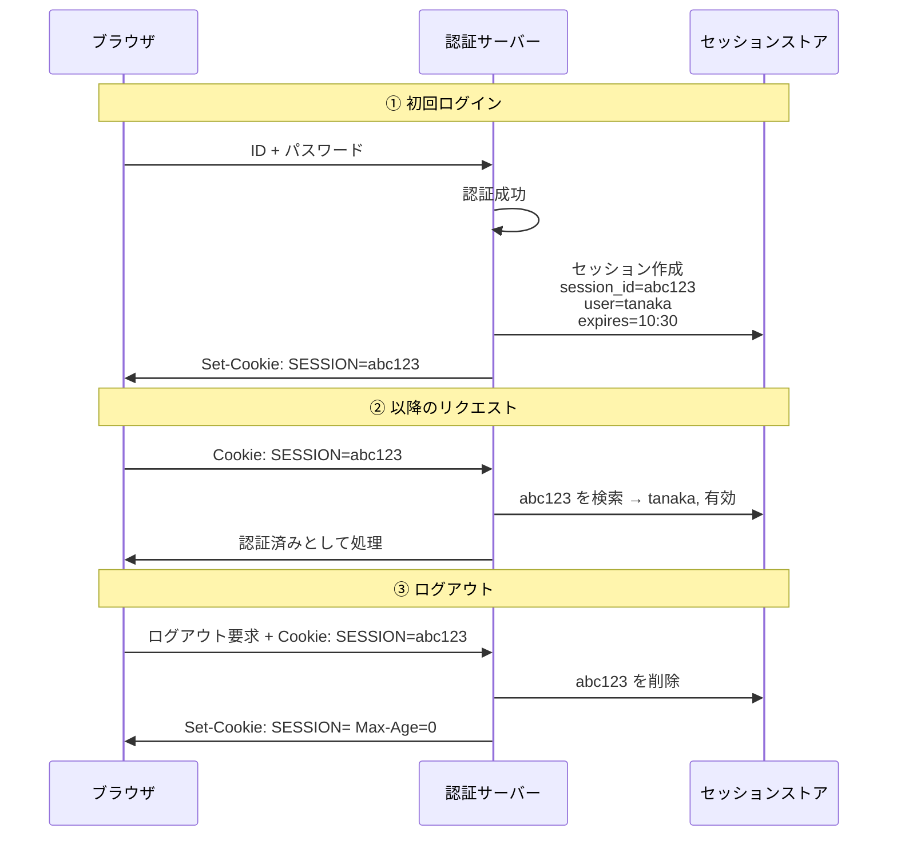
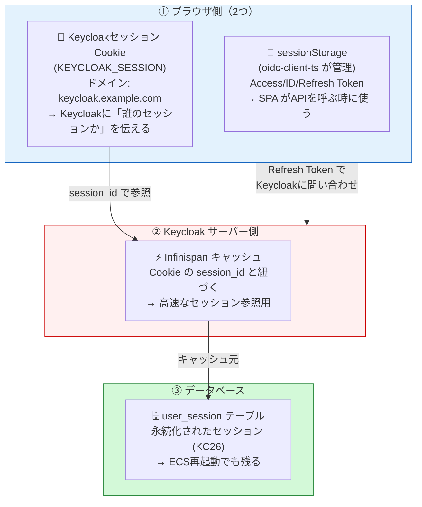
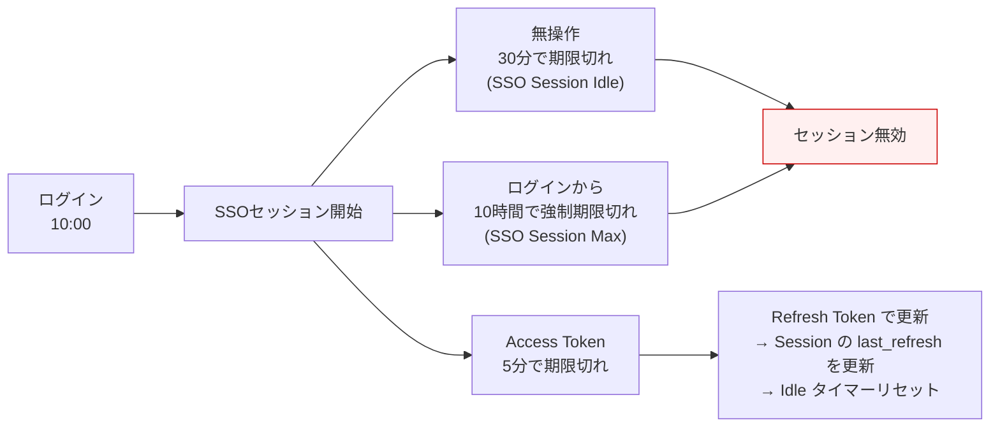
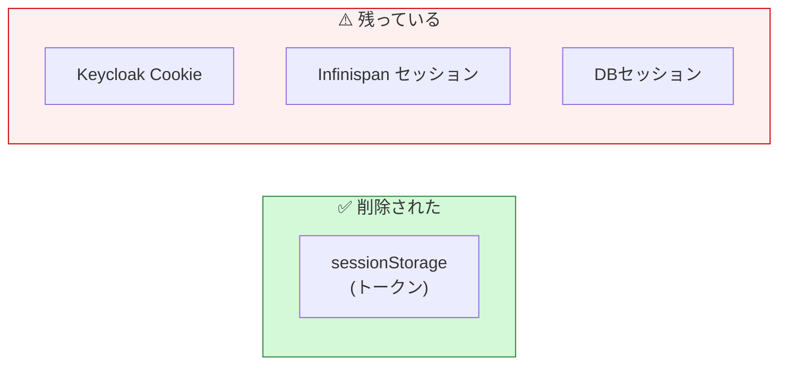
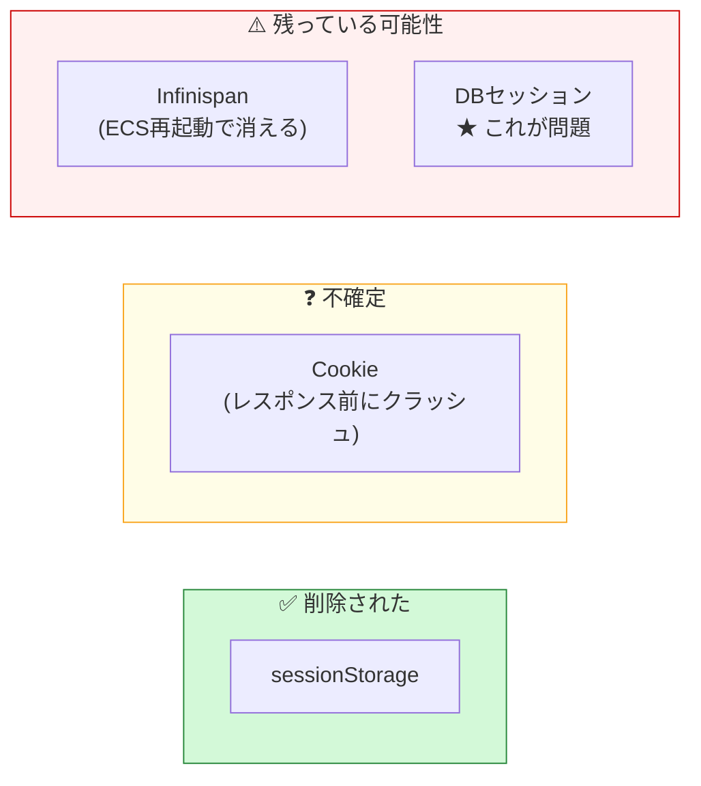
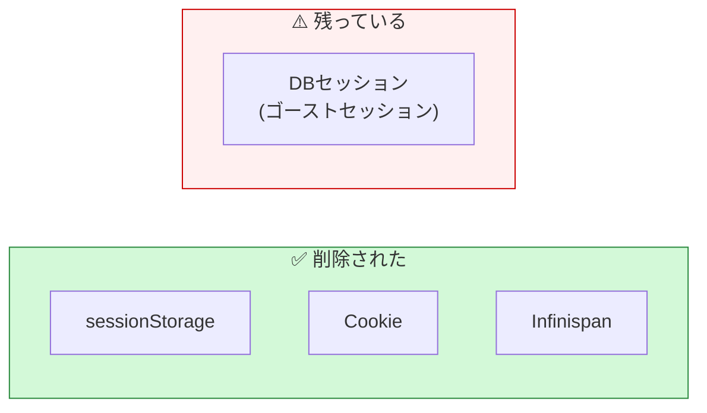
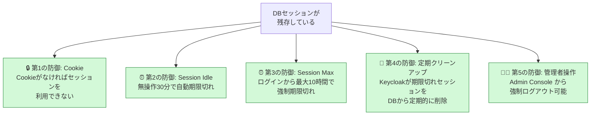
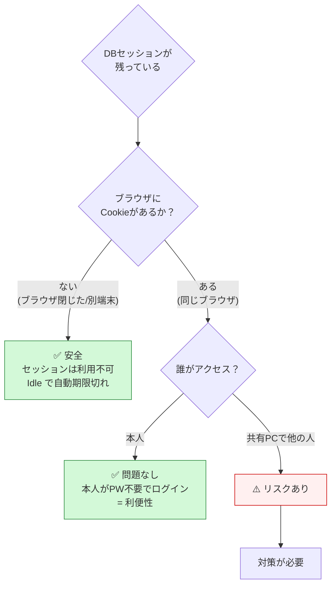

# セッション管理の基礎と中途半端なログアウト問題

**作成日**: 2026-03-26
**対象**: Keycloak 26.x / Cognito 共通

---

## 1. そもそもセッションとは何か

Webにおけるセッションとは、**「このリクエストを送っているのは、さっきログインしたあの人だ」とサーバーが認識し続けるための仕組み**である。

HTTPはステートレス（状態を持たない）なので、リクエストごとに「誰か」を伝える必要がある。これを実現するのがセッションである。

### 1.1 セッションの基本的な仕組み



### 1.2 Keycloakにおけるセッションの全体像

Keycloakでは「ログイン状態」を構成する要素が**3箇所に分散**している。



**3つの関係**:
- **Cookie**: ブラウザ → Keycloak の「鍵」。これがないとKeycloakは誰のセッションか分からない
- **Infinispanキャッシュ**: Cookieの鍵で引くセッションデータの高速コピー
- **DBセッション**: セッションの永続化された本体。ECS再起動でもデータが残る（KC26の改善）

---

## 2. セッションの種類と有効期限

### 2.1 セッションの種類

| 種類 | 保存場所 | 用途 | 有効期限（PoC設定） |
|------|---------|------|-------------------|
| **認証セッション** | Infinispanのみ | ログイン手続き中の一時状態 | `accessCodeLifespan`: 60秒 |
| **SSOセッション** | DB + Infinispan | ログイン済みの状態維持 | Idle: 30分, Max: 10時間 |
| **クライアントセッション** | DB + Infinispan | どのClientでログインしたか | SSOセッションに紐づく |
| **オフラインセッション** | DB + Infinispan | Refresh Token 用 | Idle: 30日 |

### 2.2 有効期限の関係



### 2.3 具体的なタイムライン

```
10:00  ログイン → SSOセッション開始
10:05  Access Token 期限切れ → Refresh → Session last_refresh = 10:05
10:10  Access Token 期限切れ → Refresh → Session last_refresh = 10:10
10:15  ユーザーが離席
       ...（操作なし）...
10:45  SSO Session Idle 30分経過 → ★セッション期限切れ
10:50  ユーザー戻る → ログインボタン → パスワード必要

もしくは:
10:00  ログイン
       ...（操作し続ける）...
20:00  SSO Session Max 10時間経過 → ★強制期限切れ（操作中でも）
       → ログイン画面にリダイレクト
```

---

## 3. 正常なログアウトフロー

### 3.1 全ステップ

```mermaid
sequenceDiagram
    participant User as ユーザー
    participant SPA as SPA
    participant KC as Keycloak
    participant DB as PostgreSQL

    User->>SPA: ログアウトボタン
    SPA->>SPA: ① sessionStorage クリア<br/>(トークン削除)
    SPA->>KC: ② /protocol/openid-connect/logout<br/>(end_session_endpoint)
    KC->>KC: ③ Infinispan セッション削除
    KC->>DB: ④ user_session 行を DELETE
    KC->>KC: ⑤ Set-Cookie: KEYCLOAK_SESSION=; Max-Age=0
    KC->>SPA: ⑥ post_logout_redirect_uri にリダイレクト
    SPA->>User: ログアウト完了画面

    Note over User,DB: ✅ 3箇所すべてクリーン
```

### 3.2 削除されるもの

| 箇所 | ステップ | 削除されるもの |
|------|---------|-------------|
| ブラウザ sessionStorage | ① | Access Token, ID Token, Refresh Token |
| ブラウザ Cookie | ⑤ | KEYCLOAK_SESSION |
| Infinispan | ③ | セッションキャッシュ |
| PostgreSQL | ④ | user_session 行 |

---

## 4. 中途半端なログアウトのパターン

### 4.1 パターンA: ブラウザだけクリアされた

**原因**: ネットワーク切断中にログアウト、ブラウザを閉じた、sessionStorageを手動削除



| 影響 | 説明 |
|------|------|
| ログインボタンを押すと？ | **PW不要でログイン**（Cookie → Keycloakがセッション確認 → 有効 → 即トークン発行） |
| セキュリティリスク | 低（本人の同じブラウザからのアクセス） |
| いつ解消されるか | SSO Session Idle（30分）で自動期限切れ |
| ブラウザを閉じた場合 | セッションCookieも消えるので、再度開いてもPW必要 |

### 4.2 パターンB: Keycloakに到達できなかった

**原因**: ログアウトリダイレクト中にネットワーク切断、Keycloak障害中のログアウト

パターンAと同じ状態・影響。

### 4.3 パターンC: Keycloakがセッション削除中にクラッシュ

**原因**: ログアウト処理中にECSタスクがOOMKill等でクラッシュ



| 状況 | 影響 |
|------|------|
| 同じブラウザ + Cookieが残っている | **PW不要でログインされる可能性**。ユーザーはログアウトしたつもり |
| 同じブラウザ + Cookieが消えている | PW必要 → 実害なし |
| 別のブラウザ / 別のPC | Cookieなし → PW必要 → 実害なし |
| 共有PCで次の利用者 | ⚠️ Cookieが残っていれば前のユーザーとしてログインされる |

**セキュリティリスク**: **中**（共有PC環境のみ）

### 4.4 パターンD: DB書き込み失敗（RDS障害中のログアウト）

**原因**: ログアウト時にRDSが停止していて、user_sessionの DELETE が失敗



| 状況 | 影響 |
|------|------|
| ユーザー視点 | ログアウト完了に見える |
| 再ログイン時 | Cookie削除済みなのでPW必要（問題なし） |
| Admin Console | Sessions に「ゴーストセッション」が表示される（紛らわしい） |
| 別のブラウザから | Cookieなし → PW必要 → 実害なし |

**セキュリティリスク**: **低**（Cookieがないのでセッションを利用する手段がない）

---

## 5. なぜ「中途半端」でも安全と言えるのか

### 5.1 安全弁（多層防御）



### 5.2 判断フロー



### 5.3 共有PC環境での対策

| 対策 | 効果 | 設定方法 |
|------|------|---------|
| **Session Idle を短くする** | 離席後すぐにセッション無効 | Realm Settings → Tokens → SSO Session Idle: 15分 |
| **Session Max を短くする** | 長時間ログインを防止 | SSO Session Max: 4時間 |
| **ブラウザ閉じで Cookie 消去** | セッションCookieはブラウザ終了で消える | Keycloakデフォルト動作 |
| **管理者による強制ログアウト** | 全セッション即座に無効化 | Admin Console → Sessions → Sign out all |
| **ログイン画面に注意喚起** | ユーザー教育 | Keycloakテーマのカスタマイズ |

---

## 6. Cognito との比較

### 6.1 セッション管理の構造比較

| 観点 | Cognito | Keycloak |
|------|---------|----------|
| **セッション保存場所** | AWS内部（不可視） | DB + Infinispan（可視） |
| **セッション有効期限の制御** | 制限あり（Refresh Token有効期限のみ） | **SSO Session Idle / Max / Offline 等、細かく制御可能** |
| **セッション一覧の確認** | 不可 | **Admin Console で全セッション可視** |
| **強制ログアウト** | `admin-global-sign-out` | Admin Console or REST API |
| **中途半端なログアウト** | Auth0のSSOセッションが残る（Phase 2で確認済み） | Cookie + DBセッションが残る |
| **ゴーストセッションの自動解消** | AWS内部管理 | SSO Session Idle/Max で自動期限切れ |

### 6.2 Cognito + Auth0 での中途半端なログアウト

Phase 2 で確認した通り、Cognito + Auth0 の構成でも同様の問題がある：

```
通常ログアウト → Cognitoセッション削除 → Auth0セッション残存
→ 再ログインでAuth0がPW不要でCognitoに認証成功を返す
→ 「完全ログアウト」機能が必要だった
```

これは**Keycloakのゴーストセッションと本質的に同じ問題**（認証チェーンのどこかにセッションが残る）。

### 6.3 どちらが安全か

| 観点 | Cognito + Auth0 | Keycloak |
|------|----------------|----------|
| 残存セッションの場所 | Auth0（外部サービス） | DB（自分で管理） |
| 残存セッションの制御 | Auth0のセッション設定に依存 | **自分で SSO Session Idle/Max を設定** |
| 管理者の可視性 | Auth0 Dashboard で確認（間接的） | **Admin Console で直接確認・削除** |
| 完全ログアウトの実装 | 多段リダイレクト（複雑） | **signoutRedirect() のみ（シンプル）** |

**結論**: セッション管理の制御性・可視性ではKeycloakが優位。ただしKeycloakはその分自分で管理する責任がある。Cognitoはブラックボックスだが、AWSが責任を持つ。

---

## 7. 本番設計での推奨設定

| 環境 | SSO Session Idle | SSO Session Max | 理由 |
|------|-----------------|----------------|------|
| 社内システム（個人PC） | 30分 | 10時間 | 業務時間内で再ログイン不要 |
| 社内システム（共有PC） | **15分** | **4時間** | 離席時のリスク低減 |
| 顧客向けWebサービス | 30分 | 24時間 | 利便性重視 |
| 金融・医療等 | **5-15分** | **1-2時間** | セキュリティ重視 |

---

## 参考

- [Keycloak Session Management](https://www.keycloak.org/docs/latest/server_admin/index.html#_timeouts)
- [Storing Sessions in Keycloak 26](https://www.keycloak.org/2024/12/storing-sessions-in-kc26)
- [OWASP Session Management Cheat Sheet](https://cheatsheetseries.owasp.org/cheatsheets/Session_Management_Cheat_Sheet.html)
