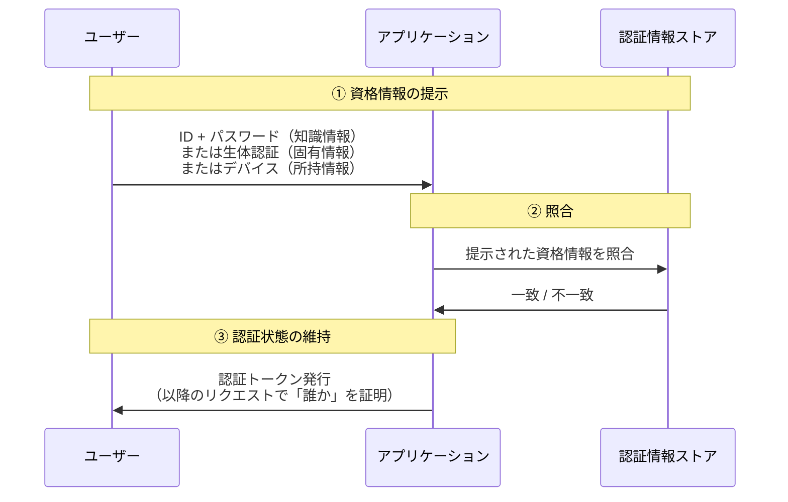
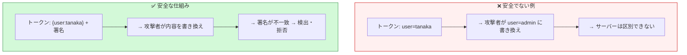
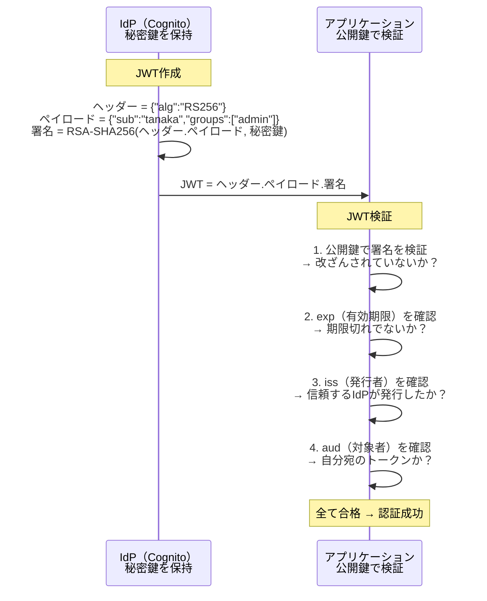
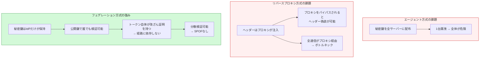
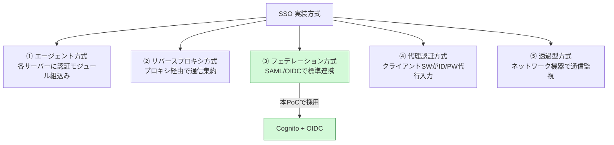
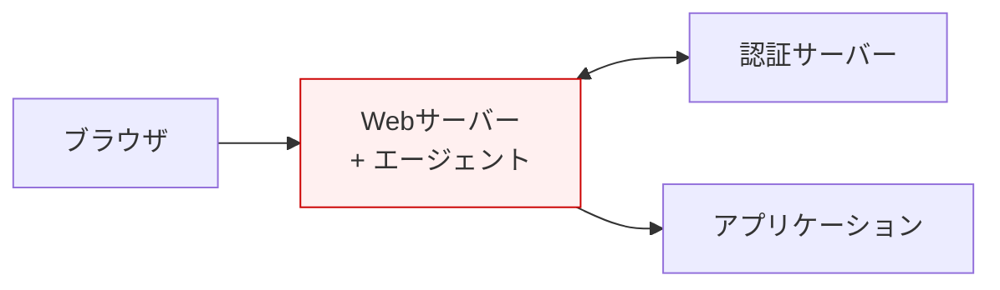
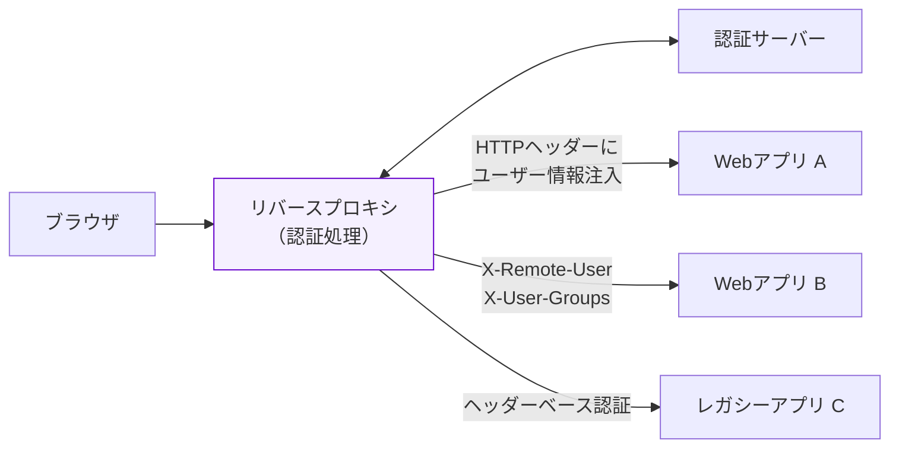
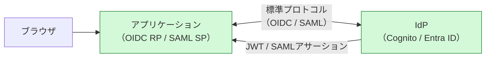
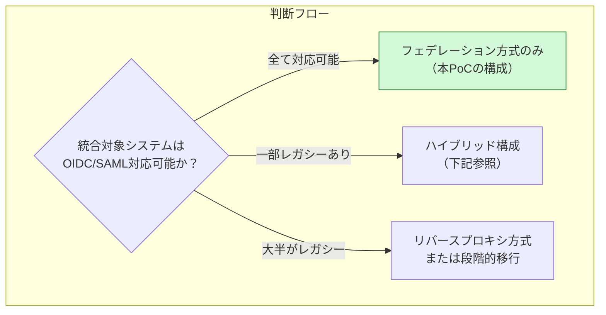
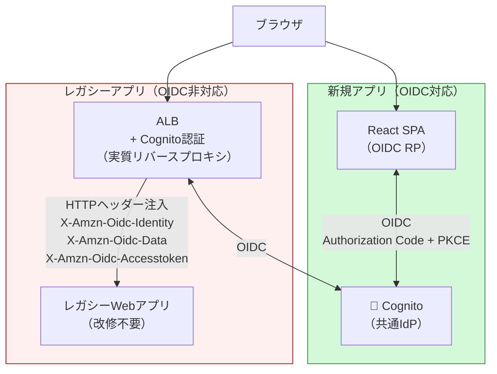

# SSO実装方式の比較と本プロジェクトでの適用

**作成日**: 2026-03-19

---

## 0. そもそも「認証」とは何か

### 0.1 認証の本質

認証（Authentication）とは、**「あなたは本当にあなたですか？」を確認する仕組み**である。

Webシステムにおける認証は、以下の3ステップで成り立つ：

**重要なのは③**である。HTTP自体はステートレス（状態を持たない）なので、毎回パスワードを送るわけにはいかない。
そこで「一度認証に成功したら、その証明書（トークン）を持ち回る」仕組みが必要になる。

### 0.2 なぜ「安全」と言えるのか — トークンの信頼性

認証の安全性は、**「トークンが偽造・改ざんされていないことを、どうやって保証するか」** に集約される。

各方式でのトークン保護の仕組み：

| 方式 | トークン形式 | 改ざん防止の仕組み | 安全性の根拠 |
|------|------------|-------------------|-------------|
| **サーバーセッション** | セッションID（ランダム文字列） | トークン自体に情報なし、サーバー側DBで照合 | IDが推測不能（十分な長さ + ランダム性） |
| **Cookie暗号化** | 暗号化Cookie | サーバーだけが持つ秘密鍵で暗号化 | 秘密鍵を知らなければ復号・改ざん不可 |
| **JWT（署名付き）** | JSON Web Token | **秘密鍵で電子署名**、公開鍵で検証 | 署名を再生成するには秘密鍵が必要 |

### 0.3 JWT署名の仕組み（フェデレーション方式の安全性の核心）

**ポイント**：
- **秘密鍵はIdPだけが持つ** → IdP以外はJWTを発行できない
- **公開鍵は誰でも取得可能**（JWKS endpoint） → どのサーバーでも検証できる
- **トークン内に「誰か」「何の権限か」が含まれる** → サーバー間でDBを共有する必要がない

これが、フェデレーション方式が**分散環境でスケール**する理由である。

### 0.4 認証の3要素と多要素認証（MFA）

| 要素 | 内容 | 例 |
|------|------|-----|
| **知識情報** | 本人だけが知っていること | パスワード、PIN、秘密の質問 |
| **所持情報** | 本人だけが持っていること | スマートフォン、ハードウェアキー、ICカード |
| **生体情報** | 本人自身の特徴 | 指紋、顔認証、虹彩 |

**MFA（多要素認証）** = 上記のうち**2つ以上を組み合わせる**。
パスワード（知識）+ SMS認証コード（所持）のように、1つが漏れても突破されない。

本PoCの構成では、MFAはIdP（Entra ID / Auth0）側で設定する。
Cognito自体もTOTPベースのMFAに対応している。

---

## 0.5 SSO方式別の安全性比較

上記を踏まえ、各SSO方式が「なぜ安全と言えるか/言えないか」を比較する。

| 観点 | エージェント方式 | リバースプロキシ方式 | フェデレーション方式 |
|------|----------------|---------------------|---------------------|
| **トークン形式** | 暗号化Cookie | HTTPヘッダー（平文） | **JWT（署名付き）** |
| **改ざん検知** | Cookie暗号鍵依存 | **検知不可**（ヘッダー信頼） | **署名で検知** |
| **トークン検証に必要なもの** | 共有秘密鍵 | なし（ヘッダー信頼） | **公開鍵のみ** |
| **中間者攻撃への耐性** | 中（Cookie暗号化） | **低**（プロキシバイパスで偽装可能） | **高**（署名で保証） |
| **秘密情報の管理** | 全サーバーで共有鍵 | プロキシのみ | **IdPのみに秘密鍵** |
| **検証の独立性** | 認証サーバーへの通信必要 | プロキシ経由必須 | **オフライン検証可能** |

### なぜフェデレーション方式が優れているのか

**まとめ**：
- エージェント方式は「鍵の共有」が弱点（漏洩リスクがサーバー数に比例）
- リバースプロキシ方式は「経路の信頼」が弱点（バイパスされたら終わり）
- フェデレーション方式は「トークン自体が信頼を持つ」（経路に依存しない、分散検証可能）

**この「トークン自体に信頼性が内包されている」という性質が、クラウド・マイクロサービス時代にフェデレーション方式が標準となった最大の理由である。**

---

## 1. SSO実装方式の全体分類

SSOの実装方式は大きく5つに分類される。

---

## 2. 主要3方式のアーキテクチャ比較

### 2.1 エージェント方式

- 各WebサーバーにエージェントSW（モジュール）を導入
- エージェントが認証サーバーと通信し、認証済みCookieを発行
- **代表製品**: CA SiteMinder（Webエージェント）、Oracle Access Manager

| メリット | デメリット |
|---------|-----------|
| ネットワーク構成の変更不要 | 全システムにエージェント導入が必要 |
| サーバー個別にアクセス制御可能 | 対応していないサーバーがある |
| | エージェントのバージョン管理が煩雑 |

### 2.2 リバースプロキシ方式

- 全アクセスをリバースプロキシ経由に集約
- プロキシが認証を処理し、バックエンドにはHTTPヘッダーでユーザー情報を渡す
- バックエンドアプリは**ヘッダーを読むだけ**（認証ロジック不要）
- **代表製品**: CA SiteMinder SPS、PingAccess（Gatewayモード）、IBM WebSEAL

| メリット | デメリット |
|---------|-----------|
| **バックエンドアプリの改修不要** | ネットワーク構成の変更が必要 |
| バックエンドを外部から隠蔽 | プロキシがSPOF/ボトルネック |
| 一元的なアクセス制御 | プロキシ直接バイパス対策が必要 |

### 2.3 フェデレーション方式（SAML/OIDC）

- アプリ自身がSAML SP / OIDC RPとして機能
- 認証はIdP側で処理、トークン/アサーションで認証結果を返す
- **代表製品/サービス**: AWS Cognito、Entra ID、Okta、Keycloak、Auth0

| メリット | デメリット |
|---------|-----------|
| 業界標準プロトコル | アプリ側がSAML/OIDC対応必要 |
| クラウド/SaaS対応が容易 | レガシーアプリには適用困難 |
| スケーラブル（分散型） | |
| クロスドメイン対応 | |

---

## 3. 方式別 詳細比較表

| 観点 | エージェント方式 | リバースプロキシ方式 | フェデレーション方式 |
|------|----------------|---------------------|---------------------|
| **認証処理の場所** | 各サーバー上のエージェント | プロキシサーバー | IdP（認証サーバー） |
| **アプリ改修** | エージェント導入 | **不要** | OIDC/SAML対応必要 |
| **ネットワーク変更** | 不要 | **必要（全通信プロキシ経由）** | 不要 |
| **認証情報の受渡し** | Cookie + セッション | **HTTPヘッダー注入** | JWT / SAMLアサーション |
| **改ざん耐性** | Cookieの暗号化依存 | プロキシバイパス対策必要 | **JWT署名で保証** |
| **スケーラビリティ** | 中 | 低（プロキシがボトルネック） | **高（分散型）** |
| **クラウド/SaaS** | 困難 | 困難 | **標準対応** |
| **レガシー対応** | エージェント対応次第 | **最も容易** | 困難（アプリ改修必要） |
| **導入コスト** | 中 | 高（プロキシ基盤） | 低〜中 |
| **運用コスト** | 高（エージェント管理） | 高（プロキシ運用） | 低（IdPマネージド） |

---

## 4. 本プロジェクトでの適用

### 4.1 採用方式

**フェデレーション方式（OIDC + Cognito）を採用。**

理由：
- 新規開発のシステム（経費精算・出張予約等）→ 設計段階からOIDC対応可能
- API Gateway + Lambda Authorizer → JWT検証で認可
- クラウドネイティブ → SaaSとの連携も標準対応
- Cognito（マネージド）→ 運用コスト最小

### 4.2 リバースプロキシ方式の検討

**基本的に不要。ただし、統合対象にレガシーアプリが含まれる場合はハイブリッド構成を検討。**

### 4.3 レガシーアプリがある場合のハイブリッド構成（AWS）

AWSでは **ALB + Cognito認証** がリバースプロキシ型SSOの役割を果たす。

**ALB + Cognito認証の仕組み**:
1. ブラウザ → ALB にアクセス
2. ALB が Cognito の OIDC 認証フローを実行（ユーザーはCognito Hosted UIにリダイレクト）
3. 認証成功後、ALB がバックエンドに以下のHTTPヘッダーを注入:
   - `X-Amzn-Oidc-Identity`: ユーザーID（sub）
   - `X-Amzn-Oidc-Data`: JWT（ユーザー属性含む）
   - `X-Amzn-Oidc-Accesstoken`: アクセストークン
4. レガシーアプリはこのヘッダーを読むだけ（**アプリ改修不要**）

**メリット**:
- 共通IdP（Cognito）を新規アプリとレガシーアプリで共有
- レガシーアプリのOIDC対応改修が不要
- ALBのマネージドサービスでプロキシ運用不要

### 4.4 確認すべき事項（本番設計時）

| 確認項目 | 影響 |
|---------|------|
| 統合対象にOIDC/SAML非対応のWebアプリがあるか | ハイブリッド構成の要否判断 |
| 既存のSiteMinder等のWAM基盤があるか | 移行計画の策定が必要 |
| オンプレミスのWebアプリを統合するか | ALBでは対応不可、別途検討が必要 |

---

## 5. まとめ

| 結論 | 詳細 |
|------|------|
| 本PoCの方式 | フェデレーション方式（OIDC + Cognito）で正しい |
| リバースプロキシ方式の検討 | 新規システムのみなら不要 |
| レガシー対応が必要な場合 | ALB + Cognito認証でハイブリッド構成が可能 |
| 長期的方針 | レガシーアプリも段階的にOIDC対応に改修し、リバースプロキシ型は過渡的手段とする |

---

## 参考

- [SSOの認証方式の仕組みを解説（kamome-e.com）](https://solution.kamome-e.com/blog/archive/blog-sso-idm-20211125/)
- [Reverse-Proxy SSO vs. SAML/OIDC (SSOJet)](https://ssojet.com/blog/reverse-proxy-sso-vs-saml)
- [ALB + Amazon Cognito Authentication (AWS Docs)](https://docs.aws.amazon.com/elasticloadbalancing/latest/application/listener-authenticate-users.html)
- [oauth2-proxy (GitHub)](https://github.com/oauth2-proxy/oauth2-proxy)
