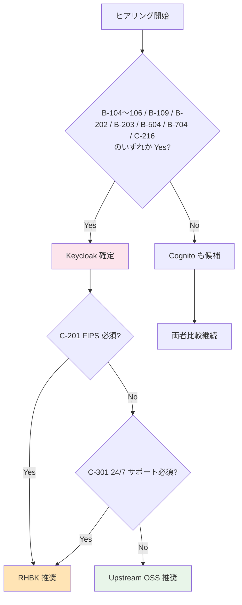
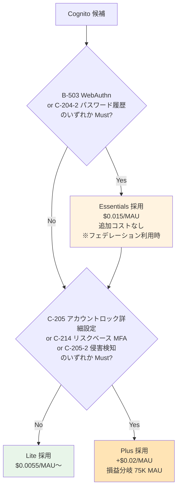

# ヒアリング項目チェックリスト（Single Source of Truth）

> 目的: 全 TBD 項目を Phase 別に一覧化し、ヒアリング進捗を一元管理   
> 上位 SSOT: [requirements-document-structure.md](requirements-document-structure.md)   
> 顧客提示版との対応: [proposal/00-index.md](proposal/00-index.md)（`proposal/fr/`, `proposal/nfr/`, `proposal/common/` 配下の各章と本表は `proposal §` 列で対応）

---

## 使い方

- ヒアリング前: 顧客に事前配布して回答を準備してもらう（可能な範囲で）
- ヒアリング中: このリストを開きながら順に質問
- ヒアリング後: 「回答」列に記入し、関連する `functional-requirements.md` / `non-functional-requirements.md` の TBD 列を更新

### 凡例
- **優先度**: 🔥 最優先 / 🟡 重要 / 🟢 通常
- **状態**: ⏳ 未確認 / ✅ 回答済 / ⚠ 要追加確認 / ❌ ペンディング
- **proposal §**: 顧客提示資料 [proposal/](proposal/) の対応サブセクション
  - **§FR-X.Y**: 機能要件章（proposal/fr/）
  - **§NFR-X**: 非機能要件章（proposal/nfr/）
  - **§C-X.Y**: 横断章（proposal/common/）
- **回答形式**: 期待する回答の形式（具体値 / Yes/No / 選択肢 / 自由記述）

---

## サマリー

| Phase | 項目数 | 🔥 最優先 | 🟡 重要 | 🟢 通常 | 状態 |
|-------|:----:|:------:|:----:|:----:|:---:|
| A. 事業要件 | 18 | 9 | 7 | 2 | ⏳ |
| B. 技術要件 | 60 | 11 | 33 | 16 | ⏳ |
| C. 運用・セキュリティ要件 | 37 | 12 | 19 | 6 | ⏳ |
| D. 最終判断 | 6 | 6 | 0 | 0 | ⏳ |
| **合計** | **121** | **38** | **59** | **24** | — |

**プラットフォーム選定への影響度が高い項目（🔥 最優先 38 件）を Stage 1 前半で先行確認**することで、ADR-014 / ADR-015 / ADR-016 / ADR-017 を早期確定できる。

**ヒアリングの最上位順序**:
1. **A-5-2（受け入れ利用者カテゴリ P-1〜P-6）+ A-5-3（採用シナリオ α/β/γ/δ）**: 後続の A-6 / B-200 系 / C-204 系の質問範囲を規定する最上位判断
2. **A-11（軸 1: アプリ別ブランディング）+ A-11-α（軸 2: 顧客別ブランディング）**: 両軸の Yes/No 組合せで B-612 / B-703-3 / B-208 / B-703-1 の 4 項目が自動決定（パターン A / A' / B / C のマッピングは §FR-2.3.3.A）

---

## Phase A: 事業要件（プロダクトオーナー / 事業企画 / 営業）

| # | 優先度 | 項目 | 関連 FR/NFR | proposal § | 質問内容 | 期待回答形式 | 回答 | 状態 |
|---|:----:|------|----------|---------|---------|------------|------|:---:|
| A-1 | 🔥 | 想定 MAU 規模（1 年後） | NFR-SCL-001 | §C-2, §NFR-3 | 1 年後の月次アクティブユーザー数の想定は? | 具体値（例: 50,000） | | ⏳ |
| A-2 | 🔥 | 想定 MAU 規模（3 年後） | NFR-SCL-001 | §C-2, §NFR-3 | 3 年後の MAU の目標は? | 具体値 | | ⏳ |
| A-3 | 🔥 | 対象システム数 | — | §FR-1.1 | 共有基盤の初期スコープのシステム数は? | リスト + 優先度 | | ⏳ |
| A-4 | 🔥 | 顧客拠点の地理分布 | NFR-COMP-008 | §NFR-7 | 国内のみか、グローバル展開か? | 国内 / グローバル | | ⏳ |
| A-5 | 🔥 | 既存認証からの移行有無 | NFR-MIG-001 | §C-1.3, §NFR-9 | 移行元システムはあるか? あればユーザー数は? | Yes/No + 具体値 | | ⏳ |
| **A-5-2** | 🔥 | **受け入れる利用者カテゴリ**（P-1〜P-6 のどれか?）| FR-AUTH / FR-FED | §FR-1.2.0.0 | 本基盤を経由するユーザーのカテゴリを全選択: **P-1** 基盤運用管理者（弊社運用） / **P-2** 顧客テナント管理者 / **P-3** 顧客一般従業員（**フェデユーザー**）/ **P-4** IdP なし顧客ユーザー（**ローカル**）/ **P-5** Break Glass ローカル管理者 / **P-6** B2C コンシューマー。**P-3 のみなら純粋なフェデ運用、P-4 含むならローカルユーザー管理機能必須**。後続の A-6 / B-200 系 / C-204 系の質問範囲を規定する最上位質問 | 該当カテゴリ複数選択 | | ⏳ |
| **A-5-3** | 🔥 | **ローカルユーザー受け入れ範囲（採用シナリオ α/β/γ/δ）** | FR-AUTH / FR-FED | §FR-1.2.0.0 | 本基盤が受け入れるローカルユーザーの範囲を 4 シナリオから選択: **α** 全カテゴリ受入（P-1〜P-6、最大規模）/ **β** 管理者 + IdP なし顧客（P-1/P-2/P-4/P-5）/ **γ** **管理者層のみ**（P-1/P-2/P-5、業界推奨、顧客に IdP 必須化）/ **δ** Break Glass のみ（P-1/P-5、全顧客 IdP 強制）。事業戦略・運用負荷・MAU 課金規模・Plus ティア対象スコープ・顧客契約での「IdP 提供必須」条件の要否に直結 | α / β / γ / δ | | ⏳ |
| A-6 | 🟡 | エンドユーザー（顧客企業）の IdP 種別の **概算分布**（詳細は B-200-B に統合 / **A-5-2 で P-3 を含む場合のみ深掘り**）| FR-FED-002〜007 | §FR-2.1 | **概算分布のみ**（Entra / Okta / SAML / LDAP / Google / IdP なし の比率%）。具体的な顧客 IdP 一覧は **B-200-B マスター表で詳細記入**。本 Phase A では「LDAP 直結や物理分離が含まれそうか」の初期把握に留める | 概算分布 | | ⏳ |
| A-7 | 🟡 | 新規顧客追加の頻度 | NFR-SCL-003 | §FR-2.3.2 | 月平均何社の追加を想定? | 具体値 | | ⏳ |
| A-8 | 🟡 | データ所在地要件 | NFR-COMP-008 | §NFR-7 | 国内限定 / 特定リージョン制約はあるか? | リージョン名 | | ⏳ |
| A-9 | 🟡 | 業界規制 | NFR-COMP-001〜005 | §FR-1.2, §NFR-7 | 顧客の業界（金融/医療/政府等）| 業界名 + 規制名（PCI DSS / FFIEC / FISC 等）| | ⏳ |
| A-10 | 🟢 | 初回リリース時期の目標 | — | §C-4 | リリース目標日は? | 日付 | | ⏳ |
| **A-11**（軸 1）| 🔥 | **ブランディング軸 1: アプリ別カスタマイズ要否** | FR-ADMIN-012 | §FR-8.3, §FR-2.3.3, §FR-2.3.3.A | 認証基盤側のログイン画面を **アプリごと**（経費精算 / 決済管理 / 人事 等）に別デザインにする必要があるか?（業界主流: Auth0 / Entra / Okta）。**Yes → パターン A' / No → パターン A**。A-11-α（軸 2 顧客別）と独立した軸。両者の組合せでパターン自動判定 | Yes（A'）/ No（A）| | ⏳ |
| **A-11-α**（軸 2）| 🔥 | **ブランディング軸 2: 顧客別カスタマイズ要否** | FR-ADMIN-012 | §FR-8.3, §FR-2.3.3, §FR-2.3.3.A | 認証基盤側のログイン画面を **顧客企業ごと**（Acme / Globex 等）に別デザインにする必要があるか?（**Yes 部分**: パターン B、Cognito 20 顧客上限 / **Yes 完全分離**: パターン C、Pool/Realm 分離で **SSO 喪失リスク** / **No**: 顧客別はアプリ側で動的差替で完結）。A-11 軸 1 と独立した軸。両者の組合せでパターン自動判定 | No / Yes 部分（B）/ Yes 完全分離（C）| | ⏳ |
| **A-11-2** | 🟡 | **アプリ側の動的差替実装責務（サインイン後・サインアウト後 両方）** | FR-ADMIN-012 | §FR-2.3.3.A | A-11 = No または A-11-α = No（= アプリ側で顧客別差替）採用時、各アプリチームが取れる責務確認: **【サインイン後】** ①JWT `tenant_id` 解釈 / ②ダッシュボード等ロゴ・配色・文言の動的差替、**【サインアウト後】** ③ログアウト後ランディング実装 / ④強制ログアウト・セッションタイムアウト画面の出し分け、**【共通】** ⑤`tenant_id` 改竄検証（JWT クレーム真実源） / ⑥CSS/JS/SSR いずれの実装方式 | 取れる / 一部支援要 / 取れない | | ⏳ |
| **A-11-3** | 🟡 | **カスタマイズレベル確認（A-11 = Yes or A-11-α = Yes 時）** | FR-ADMIN-012 | §FR-2.3.3.A | 認証基盤側でのカスタマイズを採用する場合、求めるカスタマイズレベルは?（**L1-L3**: ロゴ・配色・スペーシング・基本配置 = Cognito Managed Login Branding で対応可 / **L4-L8**: 文言変更・要素追加削除・並び順変更・完全 HTML = **Keycloak Theme 必須**（[§C-2.2 A-13](../proposal/common/02-platform.md)）または Cognito Custom UI 自前実装、または該当アプリ単独でアプリ側 UI に寄せる選択）。詳細: [branding-strategy-evidence.md §7.A/7.B](../common/branding-strategy-evidence.md) | L1-L3 / L4-L8（Keycloak 必須化）/ アプリ側寄せ | | ⏳ |
| A-12 | 🟢 | 海外展開時期 | NFR-COMP-002 | §NFR-7 | GDPR / CCPA 対応の必要時期? | 時期 / 不要 | | ⏳ |
| A-13 | 🟡 | 御社（事業者）の社内 IdP（**詳細は B-200 マスター表 A に統合**）| FR-FED-001〜007 | §FR-2.1, §FR-1.2.0.0 | **IdP の有無 + 製品名のみ**（Entra ID / Okta / HENNGE / Google Workspace / オンプレ AD / なし）。具体的な接続プロトコル・SCIM 対応・ライセンス等は **B-200 マスター表 A で詳細記入**。P-1 基盤運用管理者の認証経路に直結 | IdP 種別 + ライセンス | | ⏳ |
| A-14 | 🟡 | 既存 AWS 利用状況 | — | §C-2.3 | 既存の AWS 利用実績 / Enterprise Support 契約 / 既存 VPC / IAM 体制? | 利用状況 + 契約レベル | | ⏳ |

---

## Phase B: 技術要件（開発チーム / テックリード）

### B-1. 認証フロー / Grant Type（→ FR-AUTH §1.1 / proposal §FR-1.1）

| # | 優先度 | 項目 | 関連 FR | proposal § | 質問内容 | 期待回答 | 回答 | 状態 |
|---|:----:|------|--------|---------|---------|---------|------|:---:|
| B-101 | 🔥 | SPA Auth Code + PKCE | FR-AUTH-002 | §FR-1.1 | SPA 採用システムは? | システム名リスト | | ⏳ |
| B-102 | 🔥 | SSR Web App | FR-AUTH-003 | §FR-1.1 | Next.js / Spring MVC / Django / Rails 等の SSR は? | 有無 + システム名 | | ⏳ |
| B-103 | 🔥 | M2M / バッチ | FR-AUTH-004 | §FR-1.1 | バッチ / API 連携処理は? | 有無 + 件数想定 | | ⏳ |
| B-104 | 🔥 | **Token Exchange** | FR-AUTH-005 | §FR-1.1 | マイクロサービス間ユーザー文脈伝播（OBO）の必要性? | Yes/No | | ⏳ |
| B-105 | 🔥 | **Device Code** | FR-AUTH-006 | §FR-1.1 | CLI / IoT / Smart TV / AI Agent 認証の必要性? | Yes/No | | ⏳ |
| B-106 | 🔥 | **mTLS** | FR-AUTH-007 | §FR-1.1 | FAPI 準拠 / 高セキュリティ M2M の必要性? | Yes/No | | ⏳ |
| B-107 | 🟡 | ネイティブモバイル | FR-AUTH 全般 | §FR-1.1 | iOS / Android アプリの有無? | Yes/No + 件数 | | ⏳ |
| B-108 | 🟡 | **SPA 認証方式（BFF vs PKCE 直接）**（XSS 耐性軸）| FR-AUTH-002 | §FR-1.1, §FR-1.1.A | IETF/Curity/Duende が 2025 年から **BFF を gold standard** として推奨。BFF パターン採用か PKCE 直接か?（**ブラウザ層 XSS 対策の軸**。B-109 DPoP とは別軸で両方検討必要、両者は補完関係 → §FR-1.1.A）| BFF / PKCE 直接 / 段階移行 | | ⏳ |
| **B-109** | 🟡 | **DPoP（RFC 9449、Sender-Constrained Tokens）**（トークン使用全体軸）| FR-AUTH-015 想定 | §FR-1.1, §FR-1.1.A | mTLS の代替として DPoP 採用要否?（FAPI 2.0 準拠 / Open Banking / 高セキュリティ API。**Yes → Keycloak 必須**、Cognito 標準非対応）。**B-108 BFF とは別軸（M2M / モバイル / FAPI 2.0 含む全体防御）。BFF 採用でも DPoP が不要とは限らない → §FR-1.1.A** | Yes/No | | ⏳ |

### B-2. IdP 接続種別（→ FR-FED §2.1 / proposal §FR-2.1）

> **構成変更**: 旧 B-201 / B-203 / B-204 / B-205 / B-206 / B-207 と Phase A の A-6 / A-13 を **B-200 マスター表 2 つに統合**しました（質問の重複排除と顧客側記入負担の軽減）。詳細な選択肢・用語説明・記入テンプレートは [hearing-script/02-idp-federation.md](hearing-script/02-idp-federation.md) を参照ください。
>
> 統合された旧 ID は本表で `→ B-200 マスター表` と表記、引き続き ID 参照は可能です。

| # | 優先度 | 項目 | 関連 FR | proposal § | 質問内容 | 期待回答 | 回答 | 状態 |
|---|:----:|------|--------|---------|---------|---------|------|:---:|
| **B-200** | 🔥 | **マスター表 A: 弊社（事業者）の社内 IdP**（旧 A-13 統合）| FR-FED-001 | §FR-2.1, §FR-1.2.0.0 | 弊社運用組織の社内 IdP（P-1 基盤運用管理者の認証用）。**1 行表**（IdP 製品 / 接続プロトコル / SCIM 対応 / 用途）。詳細選択肢は [hearing-script/02-idp-federation.md マスター表 A](hearing-script/02-idp-federation.md#マスター表-a-弊社事業者の社内-idp旧-a-13-統合) | 表 A 1 行 | | ⏳ |
| **B-200-B** | 🔥 | **マスター表 B: 顧客企業の IdP 構成リスト**（旧 A-6 / B-201 / B-203〜207 統合）| FR-FED-002〜007 | §FR-2.1, §FR-2.3 | 顧客企業ごとに 1 行: **顧客名 / IdP 製品（列 X） / 接続プロトコル（列 Y） / 接続経由（列 Z） / SCIM 対応（列 W） / テナント分離希望（列 V） / 特殊要件**。詳細選択肢・用語説明は [hearing-script/02-idp-federation.md マスター表 B](hearing-script/02-idp-federation.md#マスター表-b-顧客企業の-idp-構成リスト旧-a-6--b-201b-207-統合)。**列 Y γ LDAP 直結 = Keycloak 必須化** | 表 B N 行（顧客数分） | | ⏳ |
| ~~B-201~~ | — | ~~Entra ID 実接続~~ | — | — | → **B-200-B マスター表 列 X**（A-1/A-2/A-3 で確認）| 表で回答 | — | 統合 |
| B-202 | 🔥 | **SAML IdP として発行**（独立質問として残存） | FR-FED-006 | §FR-2.1 | **本基盤を SAML IdP（発行側）として動作**させ、既存 SAML SP（業務システム）と連携する必要があるか? **マスター表は受信側、本問は発行側で別軸**。Yes → **Cognito 非対応、Keycloak 必須化** | Yes/No + 対象 SP | | ⏳ |
| ~~B-203~~ | — | ~~LDAP / AD 直接連携~~ | — | — | → **B-200-B マスター表 列 Y**（γ 選択 = Keycloak 必須化）| 表で回答 | — | 統合 |
| ~~B-204~~ | — | ~~Okta 接続~~ | — | — | → **B-200-B マスター表 列 X**（B で確認）| 表で回答 | — | 統合 |
| ~~B-205~~ | — | ~~Google Workspace~~ | — | — | → **B-200-B マスター表 列 X**（C-1/C-2 で確認）| 表で回答 | — | 統合 |
| ~~B-206~~ | — | ~~SAML SP として受入~~ | — | — | → **B-200-B マスター表 列 Y**（β で確認）| 表で回答 | — | 統合 |
| ~~B-207~~ | — | ~~独自プロトコル IdP~~ | — | — | → **B-200-B マスター表 列 Y**（δ で確認 = 接続不可）| 表で回答 | — | 統合 |
| B-208 | 🟡 | **Custom Domain**（独立質問として残存）| FR-FED-014 | §FR-2.1, §FR-2.3.3.A | **※ A-11「パターン A」採用時の標準動作: 共通 1 Custom Domain（`auth.example.com`）で全顧客カバー、Cognito 4 Custom Domain Hard Limit 問題を回避**。認証エンドポイント URL に顧客指定ドメインを使うか?（共通 1 つ推奨 / なし=プラットフォーム標準 / 顧客別=A-11 で B/C 検討要）| 共通 1 つ / なし / 顧客別 | | ⏳ |

### B-3. 認可・JWT 要件（→ FR-AUTHZ §5 / proposal §FR-6）

| # | 優先度 | 項目 | 関連 FR | proposal § | 質問内容 | 期待回答 | 回答 | 状態 |
|---|:----:|------|--------|---------|---------|---------|------|:---:|
| B-301 | 🔥 | 必須クレーム | FR-AUTHZ-006 | §FR-2.2.2, §FR-6.1 | 各システムが JWT に必要とする属性は? | 属性リスト | | ⏳ |
| B-302 | 🟡 | 認可粒度 | FR-AUTHZ 全般 | §FR-6.1 | ロール / リソース / アクション粒度? | 設計方針 | | ⏳ |
| B-303 | 🟡 | 細粒度認可（UMA） | FR-AUTHZ-009 | §FR-6.2 | リソースレベル認可の必要性?（Yes → Keycloak Authorization Services）| Yes/No | | ⏳ |
| B-304 | 🟡 | **API 間トークンリレー / ユーザー文脈伝播**（Token Exchange 要否）| FR-AUTH-005 / FR-AUTHZ | §FR-1.1, **§FR-6.0.B**, §FR-6.3 | **「認可はアプリ側」スタンス（§FR-6.0.A）でも本質問は重要**。本基盤は「**意味 A の認可フロー = 正しい Token を正しい宛先に発行する**」を担当（[§FR-6.0.B](../requirements/proposal/fr/06-authz.md)）。**Token Exchange なしだとアプリ側で『aud チェック甘くする』『ユーザー文脈を捨てる』等の妥協を強いられ、結果的にアプリ側認可がルーズ化する**。業務質問: ① マイクロサービス構成か / ② サービス A→B 内部呼び出しあり / ③ B 側ログでエンドユーザー追跡必須 / ④ サービス別の個別権限チェック / ⑤ scope 縮小（最小権限）/ ⑥ 外部システム代理操作（OBO）/ ⑦ コンプライアンス要件 — のいずれか Yes → **Token Exchange 必須 → Keycloak 必須化（K-01）** | 業務シナリオ + パターン 1/2/3 選択 | | ⏳ |
| B-305 | 🟢 | 既存ロール体系 | FR-AUTHZ-003/004 | §FR-6.1, §FR-2.2.2 | 現在のロールモデル?（階層 / グループ / 部署）| 階層図等 | | ⏳ |
| B-306 | 🔥 | **テナント分離粒度** | FR-AUTHZ-002 | §FR-6.1, §FR-2.3.1 | 共有 DB + tenant_id / DB 分離 / アカウント分離 のどれか? 認可設計の核心 | 方式 | | ⏳ |

### B-4. ユーザー管理・プロビジョニング（→ FR-USER §6 / proposal §FR-2.2.1, §FR-7）

> **用語前提**: 本セクションの「JIT」「SCIM」「Webhook」は以下の方向・契機を指す（[§FR-7.4.0](../requirements/proposal/fr/07-user.md#fr-740-scim-の位置づけと本基盤のスタンス) と整合）:
>
> | 用語 | 方向 | 契機 | 主体 |
> |---|---|---|---|
> | **JIT プロビジョニング** | 外部 IdP → 共通基盤（**ログインのついで**）| **ユーザーが本基盤に初回ログインした瞬間** | 基盤側（自動）|
> | **SCIM プロビジョニング** | 顧客 HR/IdP → 共通基盤（**独立 REST API**）| **顧客側で人事変更（入社/異動/退職）が起きた瞬間** | 顧客側 IdP（push）|
> | **Webhook 通知** | **共通基盤 → 各アプリ**（方向逆）| **基盤側でユーザーイベント（JIT/SCIM 含む全契機）が発生した瞬間** | 基盤側（push）|
>
> ※「**JIT 管理者**」（必要時のみ管理者権限を付与、Microsoft Entra PIM 等）は別概念で、[§FR-8.3 権限委譲](../requirements/proposal/fr/08-admin.md) で扱う。

| # | 優先度 | 項目 | 関連 FR | proposal § | 質問内容 | 期待回答 | 回答 | 状態 |
|---|:----:|------|--------|---------|---------|---------|------|:---:|
| B-401 | 🟡 | SCIM プロビジョニング採否 | FR-USER-003 | §FR-2.2.1, §FR-7.4 | **顧客 HR/IdP → 共通基盤への push 同期（SCIM）** を採用するか? **JIT のみ**（ログイン契機の自動作成）で十分か、**SCIM 併用**（人事変更時の即時 deprovisioning 等）が必要か? 退職者規模・SLA・顧客 IdP の SCIM 対応次第。詳細 Q1-Q4 は [§FR-7.4.0 顧客 QA フロー](../requirements/proposal/fr/07-user.md) | JIT のみ / SCIM 併用 / 顧客選択制 | | ⏳ |
| B-402 | 🟡 | セルフサービス機能 | FR-USER-004 | §FR-7.3 | パスワードリセット / プロフィール編集 / **MFA リセット** / セッション管理を **ユーザー本人が UI で操作できる範囲**?（基盤標準提供 vs アプリ側実装）| 範囲（パスワード / MFA / プロフィール / セッション）| | ⏳ |
| B-403 | 🟢 | 既存ユーザーの初期投入方法 | FR-USER-009 | §FR-2.2.1, §FR-7.4 | **新規顧客オンボーディング時、既存ユーザーをどう基盤に入れるか?** ①バルク（CSV/JSON 一括投入）/ ②SCIM 連携で初期同期 / ③JIT 任せ（ユーザーが順次ログイン時に作成、移行期間中は未登録ユーザーあり）| 方式 + 規模（数百 / 数千 / 数万）| | ⏳ |
| B-404 | 🟢 | テナント管理者の委譲 | FR-ADMIN-011 | §FR-8.3 | 顧客企業側で自社ユーザーを管理する形式か?（**P-2 テナント管理者**として基盤 Admin API 経由で CRUD 委譲）| Yes/No + 範囲（ユーザー CRUD のみ / + ロール / + IdP 設定）| | ⏳ |
| B-405 | 🟢 | Webhook 通知（**基盤 → 外部アプリ**） | FR-INT-005 | §FR-9.3 | **共通基盤でユーザーイベントが発生した時、外部アプリへリアルタイム通知する必要があるか?** 例: `user.created`（JIT/SCIM/手動いずれの契機でも発火）→ アプリ DB の users テーブルに反映 / `user.deleted`（退職 SCIM 等）→ アプリ側関連リソースクリーンアップ / `mfa.enrolled` → Slack 通知 等。**SCIM とは方向が逆**（[§FR-9.3.0](../requirements/proposal/fr/09-integration.md) 参照）| Yes/No + 対象イベント + 連携先 | | ⏳ |
| B-401-2 | 🟡 | **新規作成時のデフォルト権限**（JIT / SCIM / バルク 共通）| FR-FED-008 | §FR-2.2.1 | **ユーザーレコード新規作成時のデフォルト権限・ロールは?** 契機を問わず統一: ①JIT 作成時（IdP `groups` クレームを読まない場合の fallback）/ ②SCIM 作成時（SCIM ペイロードに `groups` 未指定の場合）/ ③バルクインポート時（CSV に role 列なしの場合）。**業界推奨は最小権限（明示的にロール付与されるまでアクセス不可）**| 最小権限 / "user" 基本ロール / 顧客側で個別指定 | | ⏳ |
| B-401-3 | 🟢 | **ユーザー作成イベントの通知先**（JIT / SCIM / バルク 共通）| FR-FED-008 / FR-INT-005 | §FR-2.2.1 | **共通基盤でユーザーレコードが作成された時の通知先?**（契機を問わず統一）。①B-405 Webhook で外部アプリへ送るか / ②CloudWatch Logs / Audit Log への記録のみか / ③SIEM (Splunk/Datadog) へストリーミングか / ④管理者メール通知か（初回 JIT 時に SOC 通知等）| 通知先 + 通知契機（JIT のみ / SCIM のみ / 全契機）| | ⏳ |
| **B-406** | 🟡 | **同一テナント内ユーザー重複の想定** | FR-FED-008 | §FR-2.2.1.A | 同一テナント内で **同一人物が複数経路でアクセスする** 想定はあるか? 経路例: 複数 IdP 接続（顧客が Okta と Entra を併用）/ IdP 切替過渡期（Okta → Entra 移行中）/ ローカル + フェデ併存（同じ人がローカル登録もしている）/ SCIM 先行作成 + JIT 後追い作成の競合 / 退職→再入社 等 | あり（経路明示）/ なし | | ⏳ |
| **B-407** | 🟡 | **重複検出時の挙動** | FR-FED-008 | §FR-2.2.1.A | B-406「あり」時の挙動?（自動リンク / Email OTP 確認 / 既存パスワード再認証 / エラー停止）。**SCIM で先に作成済 + 同じ email でフェデ JIT 試行** 等の競合シナリオを含む。**自動リンクは IdP 信頼前提で乗っ取りリスクあり** | 挙動 | | ⏳ |
| **B-408** | 🟡 | **重複検出の突合せキー** | FR-FED-008/009 | §FR-2.2.1.A, §FR-2.2.2 | アカウント統合のキー?（email / immutable sub / 雇用 ID / カスタム属性）。**email のみは乗っ取りリスク、immutable な属性を主キーに推奨** | キー | | ⏳ |
| **B-409** | 🟢 | **アカウントリンクのトリガー** | FR-FED-008 / FR-ADMIN-011 | §FR-2.2.1.A, §FR-7 | リンクのトリガー?（管理者主導 / ユーザー主導 / 自動） | トリガー | | ⏳ |
| **B-410** | 🟢 | **IdP 切り替え時のユーザー連続性要件** | FR-FED-008 / NFR-MIG-001 | §FR-2.2.1.A, §NFR-9 | 顧客が IdP を切り替えた場合（Okta → Entra 等）、同一プロファイルを保つ要件があるか?（あり → 事前リンク / 手動マージ設計）| あり / なし / 検討中 | | ⏳ |

### B-5. MFA 要素・適用ポリシー（→ FR-MFA §3 / FR-FED §2.2 / proposal §FR-2.2.3, §FR-3）

| # | 優先度 | 項目 | 関連 FR | proposal § | 質問内容 | 期待回答 | 回答 | 状態 |
|---|:----:|------|--------|---------|---------|---------|------|:---:|
| B-501 | 🟡 | MFA 必須範囲 | FR-MFA-007 | §FR-3.2 | 全ユーザー / 管理者のみ / 条件付き? | 適用範囲 | | ⏳ |
| B-502 | 🟡 | MFA 方式 | FR-MFA-001〜004 | §FR-3.1 | TOTP / WebAuthn / SMS / Email のどれを許可? | 方式リスト | | ⏳ |
| B-503 | 🟡 | **WebAuthn / FIDO2（Passkeys）** | FR-MFA-002 | §FR-3.1 | パスキー対応の必要性?（**Cognito も 2024-11〜対応**、Essentials+ ティア、ADR-016。業界 87% deploy/pilot 中）| Yes/No | | ⏳ |
| B-504 | 🟡 | Back-Channel Logout | FR-SSO-007 | §FR-5.1 | 全クライアント連動ログアウト要件?（Yes → Keycloak 必須、Cognito 非対応）| Yes/No | | ⏳ |
| B-505 | 🟢 | 端末記憶 | FR-MFA-008 | §FR-3.2 | Trusted Device 対応?（詳細期間は C-215） | Yes/No | | ⏳ |
| B-506 | 🟡 | **外部 IdP MFA 信頼度** | FR-FED-012 | §FR-2.2.3 | 外部 IdP で MFA 済みのユーザーを Broker 側でも MFA 要求するか? 全面信頼 / 部分信頼 / 全件再要求 | 信頼方針 | | ⏳ |
| B-507 | 🟡 | 信頼する `amr` / AuthnContext 値 | FR-FED-012 | §FR-2.2.3 | どの `amr` 値 / AuthnContextClassRef を MFA 済として信頼するか?（例: `mfa`, `urn:oasis:names:tc:SAML:2.0:ac:classes:MultiFactorContract`）| 値リスト | | ⏳ |
| B-508 | 🟡 | 高権限ロールへの追加 MFA 強制 | FR-MFA-009 | §FR-2.2.3, §FR-3.2 | 管理者など高権限ユーザーには Broker 側でも MFA 強制するか? | する / しない / ロール別 | | ⏳ |
| B-509 | 🟡 | SSO で繋ぐシステム範囲 | FR-SSO-001/002 | §FR-4.1 | 共通基盤 SSO で繋ぐシステム範囲?（社内システムのみ / 顧客向けも含む / 横断 SSO）| 範囲 | | ⏳ |

### B-6. マルチテナント運用（→ FR-FED §2.3 / proposal §FR-2.3）

| # | 優先度 | 項目 | 関連 FR | proposal § | 質問内容 | 期待回答 | 回答 | 状態 |
|---|:----:|------|--------|---------|---------|---------|------|:---:|
| B-601 | 🟡 | **IdP 選択 UX 案（HRD / セレクター / 組織固有 URL）** | FR-FED-013 | §FR-2.3.3 | ログイン画面の UX パターン?（A. メールドメイン HRD 推奨 / B. IdP セレクター / C. 組織固有ログイン URL）| パターン | | ⏳ |
| B-602 | 🟢 | Keycloak Organization 機能利用 | FR-FED-010 | §FR-2.3, §C-1 | Keycloak 採用時、26.0+ 標準の **Organization 機能**（マルチテナント標準サポート、Organization Groups で階層管理）を利用するか? | 利用 / 利用しない（既存 Realm 分離方式） | | ⏳ |
| B-603 | 🟡 | 顧客追加リードタイム期待値 | FR-FED-011 / NFR-SCL-004 | §FR-2.3.2 | 新規顧客 IdP 追加のリードタイム期待値?（業界デフォルト：< 1 営業日）| 時間 / 日数 | | ⏳ |
| B-604 | 🟡 | 属性マッピング: 顧客 IdP 命名差異 | FR-FED-009 | §FR-2.2.2 | 顧客 IdP ごとに属性名差異がある場合（Entra `tid` / Okta `org_id` / HENNGE 独自等）の対応?（Broker 側で統一形式に正規化が前提）| 命名対応表（必要なら）| | ⏳ |
| **B-604-2** | 🟡 | **顧客 IdP 実属性名サンプル取得手順** | FR-FED-009 | §FR-2.2.2, §FR-2.2.4 | 各顧客 IdP の **実属性名サンプル** を取得する手順は確立しているか?（メタデータ / Discovery URL / 実 ID Token サンプル）。**実物確認なしでマッピング設計は不可** | 手順テンプレ有無 | | ⏳ |
| B-605 | 🟡 | 属性更新タイミング（**フェデユーザーのログイン契機**）| FR-FED-009 | §FR-2.2.2 | **フェデユーザーが本基盤にログインしてくるたび**に、IdP アサーション（OIDC ID Token / SAML Assertion）の最新属性を **基盤側レコードに上書きするか?**: ①**Force（毎回上書き）** = IdP 側で部署変更してもログイン時に即反映、ただし基盤側で手動編集した値が消える / ②**初回 JIT のみ** = 初回ログイン時の属性を保持、IdP 側変更は反映されない / ③**別途トリガー**（SCIM 同期 / 定期バッチ）| 毎回上書き / 初回のみ / 別途トリガー | | ⏳ |
| **B-605-2** | 🟡 | **属性ごとの Source of Truth（真実の源）** | FR-FED-009 | §FR-2.2.2, §FR-2.2.4 | 属性ごとに真実の源を分けるか?（例: `groups`/`department` は IdP / `roles` は基盤 / 表示名は IdP）。**Force/Import を属性単位で切り替える設計を許容するか** | 属性別ソース表 | | ⏳ |
| **B-605-3** | 🔥 | **退職反映 SLA** | FR-FED-009 / FR-USER / NFR-SEC | §FR-2.2.2, §FR-2.2.4, §FR-5 | **顧客 HR / IdP 側で退職処理（ユーザー削除 or 無効化）した後、本基盤および各アプリで認可拒否されるまでの SLA?** 同期方式により大きく変動: ①**SCIM 採用**: HR/IdP → 共通基盤への push が走り即時〜数分 / ②**JIT のみ**: 退職者は再ログインしない限り基盤レコードが残る（**「ログイン来ない = アクセスしてこない」前提が成立しない場合、Access Token 期限切れまで侵害ウィンドウ**）/ ③**定期バッチ同期**: 数時間〜翌日。**「Import」モードで退職反映遅延は重大インシデント源**。Access Token TTL（[§FR-5.3](../requirements/proposal/fr/05-logout-session.md)）と組合せて評価 | 時間（即時 / 5 分 / 1 時間 / 翌日）+ 同期方式 | | ⏳ |
| B-606 | 🟢 | **1 ユーザー複数テナント所属の可能性** | FR-FED-010 | §FR-2.3.1, §FR-2.3.C | 1 人が複数テナントに所属する可能性はあるか?（あり → テナント切替 UI 検討）| あり / なし | | ⏳ |
| **B-606-2** | 🟡 | **複数テナント時の権限モデル** | FR-FED-010 | §FR-2.3.1, §FR-2.3.C, §FR-2.2.4 | B-606「あり」時、権限の扱い?（横断: GitHub Org 型 / 切替: Slack 型 / 別ユーザー扱い: §FR-2.2.1.A 独立派）。**`tenant_id` クレーム形式（スカラー / 配列）に直結** | モデル | | ⏳ |
| **B-606-3** | 🟢 | **テナント切替時の MFA 再要求** | FR-FED-010 / FR-MFA | §FR-2.3.C, §FR-3.2 | B-606「あり」時、テナント切替時に MFA を再要求するか?（[§FR-3.3](../proposal/fr/03-mfa.md) ステップアップと連動）| 再要求する / しない / ロール別 | | ⏳ |
| **B-606-4** | 🟢 | **複数所属時の属性ソース** | FR-FED-009/010 | §FR-2.2.4, §FR-2.3.C | B-606「あり」時、テナントごとに属性が違う場合の管理?（テナント別管理: `memberships:[{tenant, groups, dept}]` / 統合: 最終ログイン値で上書き）| 管理方式 | | ⏳ |
| B-607 | 🟢 | **物理分離が必要な特殊顧客** | FR-FED-010 | §FR-2.3.1, §FR-2.3.A | データ物理分離を契約・規制要件として求める顧客があるか?（あり → 例外的に Pool/Realm per テナント = B 案採用）| あり / なし | | ⏳ |
| B-608 | 🟡 | **オンボーディング主体** | FR-FED-011 / FR-ADMIN-011 | §FR-2.3.2 | 顧客 IdP 追加の主体?（弊社運用チーム / 顧客企業セルフサービス）— B-404 と関連 | 弊社運用 / セルフ / ハイブリッド | | ⏳ |
| B-609 | 🟡 | **IdP 情報の受領形式** | FR-FED-011 | §FR-2.3.2 | 顧客から IdP 情報を受領する形式は?（SAML Metadata URL / XML / OIDC Discovery URL / 手動）| 形式 | | ⏳ |
| B-610 | 🟢 | **メールドメインから IdP への解決ルール** | FR-FED-013 | §FR-2.3.3 | HRD 採用時、1 ドメイン = 1 IdP / 1 顧客に複数ドメイン のどちらか?（B-601 で HRD 採用時のみ）| 解決ルール | | ⏳ |
| B-611 | 🟢 | **複数テナント所属時の選択 UI** | FR-FED-010/013 | §FR-2.3.C, §FR-2.3.3 | B-606 が「あり」の場合、ログイン後にテナント選択 UI 必要か? | 必要 / 不要 | | ⏳ |
| B-612 | 🟢 | **ログイン画面のブランディング詳細**（A-11 B/C 採用時のみ）| FR-ADMIN-012 | §FR-2.3.3, §FR-2.3.3.A, §FR-8.3, §FR-8.3.A | **※ A-11「パターン A」採用時は本質問は不要**（認証基盤画面は本基盤標準、アプリ側で完結）。**A-11 で B/C 選択時のみ深掘り**: 認証基盤側画面（ログイン / MFA / PW リセット）への顧客別ロゴ表示・配色等の要件詳細（Cognito Branding Style 20 顧客上限 / Keycloak Theme 開発要） | 画面範囲 + 共通/顧客別 | | ⏳ |

### B-7. ログアウト・セッション管理（→ FR-SSO §4.2/4.3 / proposal §FR-5）

| # | 優先度 | 項目 | 関連 FR | proposal § | 質問内容 | 期待回答 | 回答 | 状態 |
|---|:----:|------|--------|---------|---------|---------|------|:---:|
| B-701 | 🟡 | **デフォルトのログアウトレイヤー** | FR-SSO-003〜007 | §FR-5.1 | 4 レイヤー（L1 ローカル / L2 IdP セッション破棄 / L3 フェデ連動 / L4 Back-Channel）のどこまでをデフォルトに? | レイヤー | | ⏳ |
| B-702 | 🟡 | **フェデ連動ログアウト要否** | FR-SSO-005 | §FR-5.1 | 外部 IdP（Entra ID / Auth0 等）セッションも連動破棄するか?(Cognito は URL エンコード制約あり) | Yes/No | | ⏳ |
| B-703 | 🟡 | **ログアウト後リダイレクト先（全体方針）** | FR-SSO-003 | §FR-5.1 | リダイレクト先の管理方針?（基盤側で集中管理 / アプリ側で個別管理 / 顧客側で持ち込み）。**事前登録（allowlist）が前提、任意 URL 不可（オープンリダイレクト対策）** | 管理方針 | | ⏳ |
| **B-703-1** | 🟡 | **許可リダイレクト URL の事前登録**（セキュリティ）| FR-SSO-003 / NFR-SEC | §FR-5.1, §FR-2.3.3.A | **※ A-11「パターン A」採用時の標準動作: 共通 URL + クエリ動的差替で 5-10 URL/アプリで完結、Cognito 100 URL Hard Limit 内で十分収まる**。各アプリで必要な URL リスト（コールバック・ログアウト・エラー・タイムアウト・強制ログアウト後 等）の確認 | URL リスト | | ⏳ |
| **B-703-2** | 🟡 | **ログアウト種類別の飛び先**（ライフサイクル）| FR-SSO-003〜007 | §FR-5.1 | L1〜L4 のログアウト種類ごとに飛び先を変えるか?（L1 = アプリトップ / L4 = 「全アプリログアウト完了」/ 強制 = 「アクセス権削除」案内 等）| 種類別 URL マッピング | | ⏳ |
| **B-703-3** | 🟢 | **テナント別カスタムランディング要否**（A-11 連動） | FR-SSO-003 / FR-FED-010 | §FR-5.1, §FR-2.3, §FR-2.3.3.A | **※ A-11「パターン A」採用時の標準動作: 共通 URL（`https://app.example.com/post-logout`）+ クエリ `?tenant=acme` でアプリ側 JS が動的差替**で対応。本質問は **A-11 で B/C 選択時のみ深掘り**: 顧客企業ごとに別の URL を allowlist 登録する要件詳細 | A-11 パターン A 連動 / B 顧客別 URL / なし | | ⏳ |
| **B-703-4** | 🟢 | **リダイレクト先での後処理要件**（監査・運用）| FR-SSO-003 / NFR-OPS | §FR-5.1, §FR-9.2 | リダイレクト後にアプリ側で必要な後処理?（SIEM ログ送信 / ローカル Storage クリア / Service Worker キャッシュクリア 等）| 後処理リスト | | ⏳ |
| **B-703-5** | 🟡 | **強制ログアウト時の飛び先**（退職・管理者操作）| FR-SSO-010 | §FR-5.1, §FR-5.3 | 管理者強制ログアウト / 退職処理時の飛び先?（「アクセス権が削除されました」案内 / 共通ログイン画面）。**自発ログアウトと別 URL にして UX 明確化を推奨** | URL + メッセージ方針 | | ⏳ |
| B-704 | 🟡 | **Access Token Revocation 要否** | FR-SSO-009 / NFR-SEC-008 | §FR-5.3 | Access Token の即時無効化が必要か?（Yes → Keycloak ネイティブ。Cognito は Refresh Token のみで代替）| 必須 / 短 TTL で吸収可 | | ⏳ |
| B-705 | 🟡 | **管理者強制ログアウト粒度** | FR-SSO-010 | §FR-5.3 | 管理者によるセッション破棄の粒度?（全ユーザー / テナント単位 / 個別ユーザー）| 粒度 | | ⏳ |
| B-706 | 🟢 | **ユーザー自身のセッション管理 UI** | FR-USER-004 | §FR-5.3 | ユーザー自身がアクティブセッションを確認・破棄できる UI 必要?（Yes → Keycloak Account Console 利用）| Yes/No | | ⏳ |

### B-8. SSO 詳細（→ FR-SSO §4.1 / proposal §FR-4）

| # | 優先度 | 項目 | 関連 FR | proposal § | 質問内容 | 期待回答 | 回答 | 状態 |
|---|:----:|------|--------|---------|---------|---------|------|:---:|
| B-801 | 🟡 | **クロス IdP SSO 方針（全体方針）** | FR-SSO-002 | §FR-4.2 | 外部 IdP（Auth0 / Entra ID 等）の SSO セッションを基盤側でも信頼するか?（全顧客有効 / 限定 / 無効）。**業界標準は L1 完全信頼、ただし金融・規制業種では L3/L4 採用例あり** | 方針 | | ⏳ |
| **B-801-1** | 🟡 | **信頼レベル**（L1〜L4）| FR-SSO-002 | §FR-4.2 | デフォルトの信頼レベルは?（**L1 完全信頼** = 業界標準 / L2 部分信頼 = TTL 別管理 / L3 検証ありき = acr 検査 + ステップアップ / L4 不信任 = 毎回再認証）| L1 / L2 / L3 / L4 | | ⏳ |
| **B-801-2** | 🟡 | **顧客 / IdP / アプリ別の差別化要否** | FR-SSO-002 / FR-FED-010 | §FR-4.2, §FR-2.3 | 全顧客 / 全 IdP / 全アプリで同じ信頼レベル?それとも差別化?（例: 経費精算は L1、決済管理は L3、金融顧客は L4 等）| 全顧客同一 / 顧客別 / アプリ別 / 両方 | | ⏳ |
| **B-801-3** | 🟢 | **規制業種向け L3 オプションの要否** | FR-SSO-002 / NFR-SEC | §FR-4.2, §FR-3.3 | 金融・医療・PCI DSS 等の規制対応で L3 検証ありき信頼（acr_values + ステップアップ）を提供する必要があるか? | 必須（業種名）/ 将来検討 / 不要 | | ⏳ |
| B-802 | 🟢 | **外部 IdP の SSO セッション TTL 尊重** | FR-SSO-008 | §FR-4.2, §FR-5.2 | 外部 IdP のセッション TTL に従うか、本基盤側で上書きするか?（業界標準は IdP TTL に従う + 本基盤 Access Token は短 TTL 5-15 分）| 従う / 上書き / IdP TTL + 短 Access TTL | | ⏳ |
| **B-802-2** | 🟢 | **`max_age` 制約の適用** | FR-SSO-008 / FR-AUTH | §FR-4.2 | 「N 秒以上経過した IdP 認証は再認証要求」する `max_age` 制約を適用するか?（**Cognito は未サポート、Keycloak は標準対応**）| 適用する（時間）/ 適用しない | | ⏳ |
| B-803 | 🟢 | **同一テナント内 SSO 切断システム** | FR-SSO-001 | §FR-4.1 | 同一テナント内でも SSO を意図的に切りたいシステム（高権限管理画面等）あるか? | あり / なし | | ⏳ |

---

## Phase C: 運用・セキュリティ要件（インフラ / セキュリティ / 情シス）

### C-1. 可用性・性能・DR（🔥 プラットフォーム選定直結 / proposal §NFR-1, §NFR-2, §NFR-5）

| # | 優先度 | 項目 | 関連 NFR | proposal § | 質問内容 | 期待回答 | 回答 | 状態 |
|---|:----:|------|---------|---------|---------|---------|------|:---:|
| C-101 | 🔥 | **SLA 目標** | NFR-AVL-001 | §NFR-1 | 99.9% / 99.95% / 99.99% のどれ? | 数値 | | ⏳ |
| C-102 | 🔥 | **RTO** | NFR-DR-001 | §NFR-5 | 災害復旧時の目標復旧時間? | 分 / 時間 | | ⏳ |
| C-103 | 🔥 | **RPO** | NFR-DR-002 | §NFR-5 | 災害復旧時のデータ損失許容? | 分 / 0 | | ⏳ |
| C-104 | 🔥 | フェイルオーバー方式 | NFR-DR-003 | §NFR-5 | 自動 / 手動? | 方式 | | ⏳ |
| C-105 | 🟡 | 認証応答時間目標 | NFR-PERF-001 | §NFR-2 | P95 / P99 の目標? | ms 値 | | ⏳ |
| C-106 | 🟡 | ピーク時想定 | NFR-PERF-007 | §NFR-2 | 朝 / 業務開始時の倍率? | 倍数 | | ⏳ |
| C-107 | 🟢 | 計画メンテナンス窓 | NFR-AVL-002 | §NFR-1 | 月何時間まで許容? | 時間 | | ⏳ |

### C-2. セキュリティ・コンプライアンス（🔥 Cognito ティア / RHBK 必要性決定 / proposal §FR-1.2, §FR-3, §FR-5.2, §NFR-4, §NFR-7）

| # | 優先度 | 項目 | 関連 NFR | proposal § | 質問内容 | 期待回答 | 回答 | 状態 |
|---|:----:|------|---------|---------|---------|---------|------|:---:|
| C-201 | 🔥 | **FIPS 140-2 認定** | NFR-COMP-006 | §NFR-7 | 業界規制で必須か?（Yes → RHBK 必須）| Yes/No | | ⏳ |
| C-202 | 🔥 | コンプライアンス認証 | NFR-COMP-002〜005 | §NFR-7 | SOC2 / ISO27001 / PCI DSS / FFIEC の必要性? | 認証リスト | | ⏳ |
| C-203 | 🔥 | 監査ログ保存期間 | NFR-OPS-003 / NFR-COMP-007 | §FR-8.2, §FR-9.2, §NFR-7 | **認証イベント / 管理操作 / 設定変更履歴**のログ保存期間? **法定要件次第で大きく異なる**: SOC 2 = 1 年以上 / PCI DSS = 1 年（うち 3 ヶ月は即時アクセス）/ HIPAA = **6 年**（医療）/ FFIEC = **5-7 年**（金融）/ GDPR = データ主体権利応答可能期間 | 期間（ログ種別ごとに違う場合あり）| | ⏳ |
| C-204 | 🟡 | パスワードポリシー（基本） | FR-AUTH-009 | §FR-1.2 | **ローカルユーザー**（[§FR-1.2.0.0](../requirements/proposal/fr/01-auth.md) P-1 Break Glass / P-2 IdP なしテナント管理者 / P-4 IdP なし顧客従業員 / P-6 B2C）の**パスワードポリシー**要件?（最小長・複雑性・履歴・有効期限）。**顧客 IdP 経由のフェデユーザー（P-3）は顧客 IdP 側のポリシーが適用される**ため本項は対象外。**顧客ごとに別ポリシーを許容するか / 基盤共通ポリシーで統一するか**も論点 | 仕様 + 適用粒度（基盤共通 / 顧客別） | | ⏳ |
| C-204-2 | 🟡 | パスワード履歴 | FR-AUTH-010 | §FR-1.2 | 過去 N 個と一致禁止が必須か? Cognito は Essentials+ で対応（ADR-016）| Yes/No + N 個 | | ⏳ |
| C-204-3 | 🟡 | **NIST SP 800-63B Rev 4 準拠方針** | FR-AUTH-009/010/011 | §FR-1.2 | NIST Rev 4（2024 公開、複雑性要件・90 日ローテーション非推奨、侵害検出推奨）を目指すか? | 完全準拠 / 部分採用 / 不要 | | ⏳ |
| C-204-4 | 🟡 | **既存パスワードハッシュ移行** | NFR-MIG-001/002 | §FR-1.2, §NFR-9 | 既存ユーザーのパスワードハッシュ形式 + 持ち越し希望は? | 形式（bcrypt 等）+ 持ち越し有無 + 件数 | | ⏳ |
| **C-204-5** | 🔥 | **既存システムで独自ローカル認証を持つアプリの有無** | FR-AUTH / NFR-MIG-001 | §FR-1.2.0, §C-1.3 | アプリ独自の Login UI + ユーザー DB + パスワード管理を持つ既存システムはあるか?（あれば移行戦略を要検討）。本基盤は **A 案: 共通基盤集約** が前提、C 案ハイブリッドは移行期限定で許容 | あり（システム名 + 件数 + 移行方針: 段階移行 / 並行稼働 / 即時切替 / 維持）/ なし | | ⏳ |
| C-205 | 🟡 | アカウントロック詳細設定 | FR-AUTH-011 | §FR-1.2 | 自動 BF 保護で十分か / 連続失敗回数・ロック時間の**設定可能性**が必須か? 後者なら Cognito Plus ティア必要（ADR-016）| 自動で可 / 設定 N 回 N 分 | | ⏳ |
| C-205-2 | 🟡 | 侵害クレデンシャル検出 | NFR-SEC-010-2 | §FR-1.2 | 漏洩パスワードの自動検知・拒否が必要か?（NIST 推奨、Cognito Plus / Keycloak+HIBP）| Yes/No | | ⏳ |
| C-206 | 🟡 | トークン TTL | NFR-SEC-004〜006 | §FR-5.2, §NFR-4 | **共通基盤が発行する** Access Token / Refresh Token / ID Token の有効期限? **TTL 短縮で B-704 Access Token Revocation 不要化を狙うアプローチも考慮**（短 TTL = 侵害ウィンドウ短縮）。業界標準: Access 15-60 分 / Refresh 30 日（rotation 前提）/ ID Token 15 分 | 各トークンの時間 | | ⏳ |
| C-206-2 | 🟡 | セッションタイムアウト目標（アイドル） | NFR-SEC-004 / FR-SSO-008 | §FR-5.2 | アイドルタイムアウトの目標値?（NIST AAL2: 1 時間 / AAL3: 15 分）| 時間 | | ⏳ |
| C-206-3 | 🟡 | **絶対経過タイムアウト** | NFR-SEC-004 / FR-SSO-008 | §FR-5.2 | セッション絶対経過タイムアウトの目標値?（NIST AAL2: 24 時間 / AAL3: 12 時間 / 緩い場合 7-30 日）| 時間 / 日 | | ⏳ |
| C-207 | 🟡 | トークン失効要件 | FR-SSO-009 | §FR-5.3 | 即時無効化の必要性?（B-704 と連動）| Yes/No | | ⏳ |
| C-208 | 🟡 | ペネトレーションテスト | NFR-SEC-013 | §NFR-4 | 年何回実施? | 回数 | | ⏳ |
| C-209 | 🟢 | 個人データ削除権 | NFR-COMP-009 | §NFR-7 | GDPR 等の対応必要? | Yes/No | | ⏳ |
| C-210 | 🔥 | **目標 NIST AAL レベル** | FR-MFA 全般 / NFR-SEC | §FR-3.0, §FR-3.1, §FR-5.2 | 認証保証レベルの目標は?（AAL1 = パスワードのみ / **AAL2** = MFA 必須（推奨） / AAL3 = Phishing-resistant 必須）| AAL1 / AAL2 / AAL3 | | ⏳ |
| C-211 | 🟡 | **Phishing-resistant MFA 採用方針** | FR-MFA-002 | §FR-3.1 | Passkeys / FIDO2 を Must として位置付けるか?（業界 87% deploy/pilot、NIST AAL2/3 整合）| Must / Should / Could | | ⏳ |
| C-212 | 🟢 | **ハードウェアキー対応** | FR-MFA 全般 | §FR-3.1 | YubiKey 等ハードウェアキー対応必要?（AAL3 必須時 or 管理者向け）| Yes/No | | ⏳ |
| C-213 | 🟢 | **MFA 要素の登録個数制限** | FR-MFA 全般 | §FR-3.1 | 1 ユーザーあたりの MFA 要素登録個数?（業界推奨：複数許可）| 1 / 複数 | | ⏳ |
| C-214 | 🟡 | **条件付き MFA の判定軸** | FR-MFA-006 | §FR-3.2 | リスクベース MFA の判定軸?（IP / 地理 / デバイス / 時間帯 / 行動パターン）| 判定軸リスト | | ⏳ |
| C-215 | 🟢 | **端末記憶の有効期間** | FR-MFA-008 | §FR-3.2 | Trusted Device の MFA スキップ期間?（業界デフォルト: 30 日、範囲 0〜90 日）| 日数 | | ⏳ |
| **C-216** | 🟡 | **ステップアップ認証（RFC 9470）の要否** | FR-MFA 全般 / FR-AUTHZ | §FR-3.3 | 高セキュ操作（決済 / 管理画面 / 大量データ出力等）で**動的に AAL を引き上げる**仕組みが必要か?（RFC 9470。Yes → 宣言的実装なら Keycloak、Cognito は Lambda 自前実装）| Yes/No + 対象操作 | | ⏳ |
| **C-217** | 🟢 | **CAEP / 継続的アクセス評価（将来発展）** | FR-SSO-010 / NFR-SEC | §FR-5.4 | リアルタイム deprovision / デバイス侵害時の即時遮断 / リスクシグナル伝播が必要か?（**現時点 Cognito/Keycloak とも未対応**、将来発展経路として位置付け）| 必須 / 将来検討 / 不要 | | ⏳ |

### C-3. 運用体制（🔥 RHBK サポート要否決定 / proposal §C-2, §NFR-6）

| # | 優先度 | 項目 | 関連 NFR | proposal § | 質問内容 | 期待回答 | 回答 | 状態 |
|---|:----:|------|---------|---------|---------|---------|------|:---:|
| C-301 | 🔥 | **サポート体制** | NFR-OPS-008 | §C-2.3, §NFR-6 | 24/7 必須 or 営業時間 or 不要? | 体制 | | ⏳ |
| C-302 | 🔥 | 既存の Red Hat 利用実績 | — | §C-2.3 | OpenShift / RHEL の既存利用?（Yes → RHBK 採用の追い風）| Yes/No + 契約規模 | | ⏳ |
| C-303 | 🔥 | RHBK サブスクリプション予算 | NFR-COST-006 | §C-2.3, §NFR-8 | 年 $15K〜90K 規模の予算枠? | Yes/No / 上限 | | ⏳ |
| C-304 | 🟡 | 監視ツール | NFR-OPS-001 | §FR-9.2, §NFR-6 | CloudWatch / Datadog / Grafana / Splunk 等? | 既存ツール | | ⏳ |
| C-305 | 🟡 | バージョンアップ方針 | NFR-OPS-005 | §NFR-6 | LTS のみ / 最新追従 / 任意? | 方針 | | ⏳ |
| C-306 | 🟡 | 変更管理プロセス | NFR-OPS-007 | §NFR-6 | **共通基盤アカウントの構成変更**（App Client 追加 / IdP 追加 / Realm 設定変更 等）の承認フローと SLA?（**共通基盤はアプリと別 AWS アカウント**のため、アプリチームからの申請プロセスが発生）。本基盤の標準は **Git PR ベース**（[§NFR-6.4 構成変更プロセス](../requirements/proposal/nfr/06-operations.md)）、各変更種別の SLA は [§NFR-6.4 A-F 表](../requirements/proposal/nfr/06-operations.md) 参照。**緊急対応の Fast Track ルートも要確定** | プロセス + 各変更種別 SLA + 緊急対応ルート | | ⏳ |

---

## Phase D: 最終判断会議（意思決定者）

| # | 優先度 | 項目 | 関連 ADR | proposal § | 質問内容 | 回答 | 状態 |
|---|:----:|------|---------|---------|---------|------|:---:|
| D-1 | 🔥 | プラットフォーム選定 | ADR-017, 018 | §C-2 | Cognito（Lite/Essentials/Plus）or Keycloak（OSS / RHBK）? | | ⏳ |
| D-2 | 🔥 | 段階的移行 vs ビッグバン | NFR-MIG-005 | §NFR-9 | 移行戦略? | | ⏳ |
| D-3 | 🔥 | 運用体制の確定 | NFR-OPS 全般 | §NFR-6 | 専任 / 兼任 / 外部委託? | | ⏳ |
| D-4 | 🔥 | 予算の確定 | NFR-COST 全般 | §NFR-8 | 年間予算枠? | | ⏳ |
| D-5 | 🔥 | リリーススケジュール | — | §C-4 | 設計 → 開発 → テスト → 移行の各マイルストーン? | | ⏳ |
| D-6 | 🔥 | **Identity Broker パターン採用前提合意** | — | §C-1 | Hub-and-Spoke 型 Identity Broker パターンを基盤アーキテクチャの前提として合意できるか?（業界標準パターン、§C-1 で詳述）| 合意 / 異論 / 別案検討 | | ⏳ |

---

## 補足: 「Keycloak 必須要因」と「RHBK 必須要因」の判定フロー

**早期に B-104〜106 / B-109 / B-202 / B-203 / B-504 / B-704 / C-216 / C-201 / C-301 を確認できれば、プラットフォーム選定の見通しが立つ**。

※ Keycloak 必須要因に以下を追加（proposal §FR-1.1 / §FR-3.3 / §FR-5 で詳述）:
- B-109（DPoP / RFC 9449、FAPI 2.0 準拠）
- B-504（Back-Channel Logout、確実なログアウト伝播）
- B-704（Access Token Revocation、即時無効化）
- C-216（ステップアップ認証 / RFC 9470、宣言的実装）

## 補足: Cognito ティア選定の判定フロー（[ADR-016](../adr/016-cognito-feature-tier-selection.md)）

Cognito が候補に残った場合、ティア選定のためのヒアリング項目フロー:

**注**: フェデレーション利用なら Lite と Essentials の単価は同額（$0.015/MAU）のため、Essentials 採用は事実上**追加コストなし**で機能拡張できる。Plus 採用は $0.02/MAU 追加 → 損益分岐 MAU が 175K → 75K に下がる。

## 補足: NIST AAL 別の推奨パラメータ（C-210 が確定すると以下が連動）

| AAL レベル | C-211 MFA | C-206-2 アイドル | C-206-3 絶対経過 | 採用例 |
|---|---|:---:|:---:|---|
| AAL1（パスワードのみ）| 不要 | 任意 | 30 日 | 内部の機密性低システム |
| **AAL2（MFA 必須、推奨）** | **必須**（TOTP 以上、Passkey 推奨）| **1 時間** | **24 時間** | 一般的な B2B SaaS |
| AAL3（最高、Phishing-resistant）| 必須（Passkey / YubiKey）| 15 分 | 12 時間 | 金融 / 政府系 |

C-210（NIST AAL レベル）が確定すれば、C-211 / C-206-2 / C-206-3 / B-505 / C-215 等のデフォルト値が連動して決まる。

## 補足: proposal サブセクション完成度別の項目数

| proposal § | 状態 | 対応項目 ID | 件数 |
|---|:---:|---|:---:|
| §FR-1.1 認証フロー / Grant Type | ✅ 記載済 | B-101〜B-108, B-304 | 9 |
| §FR-1.2 パスワード・ローカルユーザー管理 | ✅ 記載済 | A-9, C-204, C-204-2〜4, C-205, C-205-2 | 7 |
| §FR-1.2.0 ローカルユーザー認証の主体 | ✅ 記載済 | A-5-3, C-204-5 | 2 |
| §FR-1.2.0.0 利用者カテゴリと採用シナリオ | ✅ 記載済 | A-5-2, A-5-3 | 2 |
| §FR-2.1 IdP 接続種別 | ✅ 記載済 | A-6, A-13, B-201〜B-208 | 10 |
| §FR-2.2.1 JIT プロビジョニング | ✅ 記載済 | B-401, B-401-2, B-401-3, B-403 | 4 |
| §FR-2.2.1.A 同一テナント内ユーザー重複 | ✅ 記載済 | B-406〜B-410 | 5 |
| §FR-2.2.2 属性マッピング | ✅ 記載済 | B-301, B-302, B-305, B-604, B-604-2, B-605, B-605-2, B-605-3 | 8 |
| §FR-2.2.4 属性ライフサイクル設計の絡み合い | ✅ 記載済 | B-604〜B-606-4（絡み合い統合） | 11 |
| §FR-2.2.3 MFA 重複回避 | ✅ 記載済 | B-506, B-507, B-508 | 3 |
| §FR-2.3 マルチテナント運用 | ✅ 記載済 | A-7, B-601〜B-612, B-606-2〜B-606-4, B-306, B-803 | 17 |
| §FR-3 MFA | ✅ 記載済 | B-501〜B-505, B-508, C-210〜C-215 | 12 |
| §FR-4 SSO | ✅ 記載済 | B-509, B-801, B-801-1〜3, B-802, B-802-2, B-803 | 9 |
| §FR-5 ログアウト・セッション管理 | ✅ 記載済 | B-504, B-701〜B-706, B-703-1〜B-703-5, C-206, C-206-2, C-206-3, C-207 | 17 |
| §FR-6 認可 | 📋 骨格のみ | B-301〜B-306 | 6 |
| §FR-6.1.A 最小クレーム設計 | ✅ 記載済 | （§FR-6.1 既存 TBD 4 項目 + §FR-6.1.A TBD 6 項目）| 10 |
| §FR-7 ユーザー管理 | 📋 骨格のみ | A-1, A-2, B-401, B-402, B-403 | 5 |
| §FR-8 管理機能 | 📋 骨格のみ | A-11, B-404, B-612, C-203 | 4 |
| §FR-9 外部統合 | 📋 骨格のみ | B-405, C-203, C-304 | 3 |
| §C-1 アーキテクチャ | ✅ 記載済 | A-5, B-602, C-204-5, D-3, D-6 | 5 |
| §C-2 プラットフォーム | 📋 骨格のみ | A-1, A-2, A-14, C-201, C-301〜C-303, D-1 | 8 |
| §NFR-1〜§NFR-9 非機能要件 | 📋 骨格のみ | C-101〜C-107, C-201〜C-209, C-301〜C-306, D-2, D-4 | 22+ |

→ proposal §FR-1〜§FR-5（認証 / フェデ / MFA / SSO / ログアウト）と §C-1（アーキテクチャ）はヒアリング項目側も**完備**。§FR-6 認可以降と §C-2 プラットフォーム / §NFR は proposal が骨格のみのため、本表の項目を起点に proposal を肉付けしていく順序。

---

## 関連ドキュメント

- [requirements-document-structure.md](requirements-document-structure.md): 要件定義フェーズ全体 SSOT
- [proposal/00-index.md](proposal/00-index.md): 顧客提示版 SSOT（`fr/` `nfr/` `common/` 配下の各章と本表は `proposal §` 列で対応）
- [proposal/fr/00-index.md](proposal/fr/00-index.md): 機能要件章一覧
- [proposal/nfr/00-index.md](proposal/nfr/00-index.md): 非機能要件章一覧（IPA グレード対応）
- [proposal/common/00-index.md](proposal/common/00-index.md): 横断章一覧
- [requirements-process-plan.md](requirements-process-plan.md): 進め方
- [requirements-hearing-strategy.md](requirements-hearing-strategy.md): ヒアリング戦略（Phase 詳細）
- [functional-requirements.md](functional-requirements.md): 機能要件
- [non-functional-requirements.md](non-functional-requirements.md): 非機能要件
- ADR-014（認証パターン範囲）、ADR-015（RHBK 検証先送り）、[ADR-016](../adr/016-cognito-feature-tier-selection.md)（Cognito ティア選定基準）

---

## 変更履歴

| 日付 | 内容 |
|---|---|
| 2026-05-18 | 業界最新動向 3 項目を補完: B-109（DPoP / RFC 9449）、C-216（ステップアップ認証 / RFC 9470）、C-217（CAEP / 継続的アクセス評価）。proposal §FR-1.1 / §FR-3.3 / §FR-5.4 と整合 |
| 2026-05-15 | proposal 章番号体系を §FR-X / §NFR-X / §C-X に全面リナンバリング（proposal フォルダが fr/ nfr/ common/ に再編されたことに伴う） |
| 2026-05-14 | C-204-5 追加（既存システムで独自ローカル認証を持つアプリの有無、§2.2.0 / §11.3 連動）|
| 2026-05-14 | proposal §4 / §5 / §6 章拡充・章リナンバリング反映、23 項目補完（B-606〜B-612, B-701〜B-706, B-801〜B-803, C-206-3, C-210〜C-215）|
| 2026-05-13 | proposal SSOT との対応列追加、Keycloak 26 Organization / BFF パターン等の最新動向反映、22 項目補完 |
| 2026-05-13 | Cognito 2024-11 WebAuthn 対応反映（C-204-2, C-205-2 追加） |
| 2026-04-21 | 初版作成（69 項目）|
