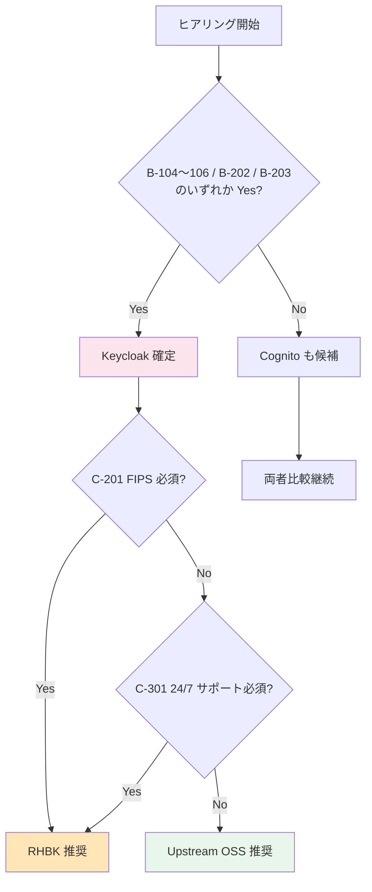

# ヒアリング項目チェックリスト（Single Source of Truth）

> 最終更新: 2026-05-13（Cognito 2024-11 WebAuthn 対応反映）
> 目的: 全 TBD 項目を Phase 別に一覧化し、ヒアリング進捗を一元管理

---

## 使い方

- ヒアリング前: 顧客に事前配布して回答を準備してもらう（可能な範囲で）
- ヒアリング中: このリストを開きながら順に質問
- ヒアリング後: 「回答」列に記入し、関連する `functional-requirements.md` / `non-functional-requirements.md` の TBD 列を更新

### 凡例
- **優先度**: 🔥 最優先 / 🟡 重要 / 🟢 通常
- **状態**: ⏳ 未確認 / ✅ 回答済 / ⚠ 要追加確認 / ❌ ペンディング
- **回答形式**: 期待する回答の形式（具体値 / Yes/No / 選択肢 / 自由記述）

---

## サマリー

| Phase | 項目数 | 🔥 最優先 | 🟡 重要 | 🟢 通常 | 状態 |
|-------|:----:|:------:|:----:|:----:|:---:|
| A. 事業要件 | 12 | 5 | 4 | 3 | ⏳ |
| B. 技術要件 | 28 | 10 | 12 | 6 | ⏳ |
| C. 運用・セキュリティ要件 | 22 | 8 | 10 | 4 | ⏳ |
| D. 最終判断 | 5 | 5 | 0 | 0 | ⏳ |
| **合計** | **67** | **28** | **26** | **13** | — |

**プラットフォーム選定への影響度が高い項目（🔥 最優先 28 件）を Stage 1 前半で先行確認**することで、ADR-014 / ADR-015 / ADR-017 を早期確定できる。

---

## Phase A: 事業要件（プロダクトオーナー / 事業企画 / 営業）

| # | 優先度 | 項目 | 関連 FR/NFR | 質問内容 | 期待回答形式 | 回答 | 状態 |
|---|:----:|------|----------|---------|------------|------|:---:|
| A-1 | 🔥 | 想定 MAU 規模（1 年後） | NFR-SCL-001 | 1 年後の月次アクティブユーザー数の想定は? | 具体値（例: 50,000） | | ⏳ |
| A-2 | 🔥 | 想定 MAU 規模（3 年後） | NFR-SCL-001 | 3 年後の MAU の目標は? | 具体値 | | ⏳ |
| A-3 | 🔥 | 対象システム数 | — | 共有基盤の初期スコープのシステム数は? | リスト + 優先度 | | ⏳ |
| A-4 | 🔥 | 顧客拠点の地理分布 | NFR-COMP-008 | 国内のみか、グローバル展開か? | 国内 / グローバル | | ⏳ |
| A-5 | 🔥 | 既存認証からの移行有無 | NFR-MIG-001 | 移行元システムはあるか? あればユーザー数は? | Yes/No + 具体値 | | ⏳ |
| A-6 | 🟡 | 顧客の IdP 種別の分布 | FR-FED-002〜007 | Entra ID / Okta / SAML / LDAP の比率は? | 概算分布 | | ⏳ |
| A-7 | 🟡 | 新規顧客追加の頻度 | NFR-SCL-003 | 月平均何社の追加を想定? | 具体値 | | ⏳ |
| A-8 | 🟡 | データ所在地要件 | NFR-COMP-008 | 国内限定 / 特定リージョン制約はあるか? | リージョン名 | | ⏳ |
| A-9 | 🟡 | 業界規制 | NFR-COMP-001〜005 | 顧客の業界（金融/医療/政府等） | 業界名 + 規制名 | | ⏳ |
| A-10 | 🟢 | 初回リリース時期の目標 | — | リリース目標日は? | 日付 | | ⏳ |
| A-11 | 🟢 | ブランディング要件 | FR-ADMIN-012 | ログイン UI のカスタマイズ要否? | カスタマイズ範囲 | | ⏳ |
| A-12 | 🟢 | 海外展開時期 | NFR-COMP-002 | GDPR / CCPA 対応の必要時期? | 時期 / 不要 | | ⏳ |

---

## Phase B: 技術要件（開発チーム / テックリード）

### B-1. 認証パターン要否（🔥 ADR-014 確定の入力）

| # | 優先度 | 項目 | 関連 FR | 質問内容 | 期待回答 | 回答 | 状態 |
|---|:----:|------|--------|---------|---------|------|:---:|
| B-101 | 🔥 | SPA Auth Code + PKCE | FR-AUTH-002 | SPA 採用システムは? | システム名リスト | | ⏳ |
| B-102 | 🔥 | SSR Web App | FR-AUTH-003 | Next.js / Spring MVC 等の SSR は? | 有無 + システム名 | | ⏳ |
| B-103 | 🔥 | M2M / バッチ | FR-AUTH-004 | バッチ / API 連携処理は? | 有無 + 件数想定 | | ⏳ |
| B-104 | 🔥 | **Token Exchange** | FR-AUTH-005 | マイクロサービス間ユーザー文脈伝播の必要性? | Yes/No | | ⏳ |
| B-105 | 🔥 | **Device Code** | FR-AUTH-006 | CLI / IoT 認証の必要性? | Yes/No | | ⏳ |
| B-106 | 🔥 | **mTLS** | FR-AUTH-007 | FAPI 準拠 / 高セキュリティ M2M の必要性? | Yes/No | | ⏳ |
| B-107 | 🟡 | ネイティブモバイル | FR-AUTH 全般 | iOS / Android アプリの有無? | Yes/No | | ⏳ |

### B-2. フェデレーション要件

| # | 優先度 | 項目 | 関連 FR | 質問内容 | 期待回答 | 回答 | 状態 |
|---|:----:|------|--------|---------|---------|------|:---:|
| B-201 | 🔥 | Entra ID 実接続 | FR-FED-002 | 接続必要な顧客はあるか? | Yes/No + 顧客 | | ⏳ |
| B-202 | 🔥 | **SAML IdP として発行** | FR-FED-006 | 既存 SAML SP（業務システム）と連携必要? | Yes/No | | ⏳ |
| B-203 | 🔥 | **LDAP 直接連携** | FR-FED-007 | LDAP/AD 連携必要な顧客はあるか? | Yes/No + 顧客 | | ⏳ |
| B-204 | 🟡 | Okta 接続 | FR-FED-003 | 接続必要な顧客? | Yes/No | | ⏳ |
| B-205 | 🟡 | Google Workspace | FR-FED-004 | 必要性? | Yes/No | | ⏳ |
| B-206 | 🟡 | SAML SP として受入 | FR-FED-005 | 顧客 IdP が SAML 専用の場合あり? | Yes/No | | ⏳ |

### B-3. 認可・JWT 要件

| # | 優先度 | 項目 | 関連 FR | 質問内容 | 期待回答 | 回答 | 状態 |
|---|:----:|------|--------|---------|---------|------|:---:|
| B-301 | 🔥 | 必須クレーム | FR-AUTHZ-006 | 各システムが JWT に必要とする属性は? | 属性リスト | | ⏳ |
| B-302 | 🟡 | 認可粒度 | FR-AUTHZ 全般 | ロール / リソース / アクション粒度? | 設計方針 | | ⏳ |
| B-303 | 🟡 | 細粒度認可（UMA） | FR-AUTHZ-009 | リソースレベル認可の必要性? | Yes/No | | ⏳ |
| B-304 | 🟡 | API 間トークンリレー | FR-AUTH-005 | サービス間呼び出しでトークン伝播必要? | Yes/No | | ⏳ |
| B-305 | 🟢 | 既存ロール体系 | FR-AUTHZ-003/004 | 現在のロールモデル? | 階層図等 | | ⏳ |

### B-4. ユーザー管理要件

| # | 優先度 | 項目 | 関連 FR | 質問内容 | 期待回答 | 回答 | 状態 |
|---|:----:|------|--------|---------|---------|------|:---:|
| B-401 | 🟡 | SCIM プロビジョニング | FR-USER-003 | 自動同期要件の有無? | Yes/No | | ⏳ |
| B-402 | 🟡 | セルフサービス機能 | FR-USER-004 | パスワードリセット / プロフィール編集の UI 提供? | 範囲 | | ⏳ |
| B-403 | 🟢 | バルクインポート | FR-USER-009 | 一括登録の必要性? | Yes/No | | ⏳ |
| B-404 | 🟢 | テナント管理者の委譲 | FR-ADMIN-011 | 顧客側で自社ユーザーを管理? | Yes/No | | ⏳ |
| B-405 | 🟢 | Webhook 通知 | FR-INT-005 | user.created 等のイベント連携必要? | Yes/No + 連携先 | | ⏳ |

### B-5. MFA / SSO 要件

| # | 優先度 | 項目 | 関連 FR | 質問内容 | 期待回答 | 回答 | 状態 |
|---|:----:|------|--------|---------|---------|------|:---:|
| B-501 | 🟡 | MFA 必須範囲 | FR-MFA-007 | 全ユーザー / 管理者のみ / 条件付き? | 適用範囲 | | ⏳ |
| B-502 | 🟡 | MFA 方式 | FR-MFA-001〜004 | TOTP / WebAuthn / SMS のどれを許可? | 方式リスト | | ⏳ |
| B-503 | 🟡 | **WebAuthn / FIDO2（Passkeys）** | FR-MFA-002 | パスキー対応の必要性?（**Cognito も 2024-11〜対応**、Essentials+ ティア必要）| Yes/No | | ⏳ |
| B-504 | 🟡 | Back-Channel Logout | FR-SSO-007 | 全クライアント連動ログアウト要件? | Yes/No | | ⏳ |
| B-505 | 🟢 | 端末記憶 | FR-MFA-008 | Trusted Device 対応? | Yes/No | | ⏳ |

---

## Phase C: 運用・セキュリティ要件（インフラ / セキュリティ / 情シス）

### C-1. 可用性・性能（🔥 プラットフォーム選定直結）

| # | 優先度 | 項目 | 関連 NFR | 質問内容 | 期待回答 | 回答 | 状態 |
|---|:----:|------|---------|---------|---------|------|:---:|
| C-101 | 🔥 | **SLA 目標** | NFR-AVL-001 | 99.9% / 99.95% / 99.99% のどれ? | 数値 | | ⏳ |
| C-102 | 🔥 | **RTO** | NFR-DR-001 | 災害復旧時の目標復旧時間? | 分 / 時間 | | ⏳ |
| C-103 | 🔥 | **RPO** | NFR-DR-002 | 災害復旧時のデータ損失許容? | 分 / 0 | | ⏳ |
| C-104 | 🔥 | フェイルオーバー方式 | NFR-DR-003 | 自動 / 手動? | 方式 | | ⏳ |
| C-105 | 🟡 | 認証応答時間目標 | NFR-PERF-001 | P95 / P99 の目標? | ms 値 | | ⏳ |
| C-106 | 🟡 | ピーク時想定 | NFR-PERF-007 | 朝 / 業務開始時の倍率? | 倍数 | | ⏳ |
| C-107 | 🟢 | 計画メンテナンス窓 | NFR-AVL-002 | 月何時間まで許容? | 時間 | | ⏳ |

### C-2. セキュリティ・コンプライアンス（🔥 RHBK 必要性決定）

| # | 優先度 | 項目 | 関連 NFR | 質問内容 | 期待回答 | 回答 | 状態 |
|---|:----:|------|---------|---------|---------|------|:---:|
| C-201 | 🔥 | **FIPS 140-2 認定** | NFR-COMP-006 | 業界規制で必須か? | Yes/No | | ⏳ |
| C-202 | 🔥 | コンプライアンス認証 | NFR-COMP-002〜005 | SOC2 / ISO27001 / PCI DSS の必要性? | 認証リスト | | ⏳ |
| C-203 | 🔥 | 監査ログ保存期間 | NFR-OPS-003 / NFR-COMP-007 | 何ヶ月 / 年? | 期間 | | ⏳ |
| C-204 | 🟡 | パスワードポリシー | FR-AUTH-009 | 顧客固有要件? | 仕様 | | ⏳ |
| C-205 | 🟡 | アカウントロック | FR-AUTH-011 | 連続失敗回数 / ロック時間 | N 回 / N 分 | | ⏳ |
| C-206 | 🟡 | トークン TTL | NFR-SEC-004〜006 | Access / Refresh / ID Token の有効期限? | 時間 | | ⏳ |
| C-207 | 🟡 | トークン失効要件 | FR-SSO-009 | 即時無効化の必要性? | Yes/No | | ⏳ |
| C-208 | 🟡 | ペネトレーションテスト | NFR-SEC-013 | 年何回実施? | 回数 | | ⏳ |
| C-209 | 🟢 | 個人データ削除権 | NFR-COMP-009 | GDPR 等の対応必要? | Yes/No | | ⏳ |

### C-3. 運用体制（🔥 RHBK サポート要否決定）

| # | 優先度 | 項目 | 関連 NFR | 質問内容 | 期待回答 | 回答 | 状態 |
|---|:----:|------|---------|---------|---------|------|:---:|
| C-301 | 🔥 | **サポート体制** | NFR-OPS-008 | 24/7 必須 or 営業時間? | 体制 | | ⏳ |
| C-302 | 🔥 | 既存の Red Hat 利用実績 | — | OpenShift / RHEL の既存利用? | Yes/No | | ⏳ |
| C-303 | 🔥 | RHBK サブスクリプション予算 | NFR-COST-006 | 年 $15K〜90K 規模の予算枠? | Yes/No / 上限 | | ⏳ |
| C-304 | 🟡 | 監視ツール | NFR-OPS-001 | CloudWatch / Datadog / Grafana? | 既存ツール | | ⏳ |
| C-305 | 🟡 | バージョンアップ方針 | NFR-OPS-005 | LTS のみ / 最新追従? | 方針 | | ⏳ |
| C-306 | 🟡 | 変更管理プロセス | NFR-OPS-007 | 承認フロー / SLA? | プロセス | | ⏳ |

---

## Phase D: 最終判断会議（意思決定者）

| # | 優先度 | 項目 | 質問内容 | 関連 ADR | 回答 | 状態 |
|---|:----:|------|---------|---------|------|:---:|
| D-1 | 🔥 | プラットフォーム選定 | Cognito or Keycloak（OSS / RHBK）? | ADR-016, 017 | | ⏳ |
| D-2 | 🔥 | 段階的移行 vs ビッグバン | 移行戦略? | NFR-MIG-005 | | ⏳ |
| D-3 | 🔥 | 運用体制の確定 | 専任 / 兼任 / 外部委託? | NFR-OPS 全般 | | ⏳ |
| D-4 | 🔥 | 予算の確定 | 年間予算枠? | NFR-COST 全般 | | ⏳ |
| D-5 | 🔥 | リリーススケジュール | 設計 → 開発 → テスト → 移行の各マイルストーン? | — | | ⏳ |

---

## 補足: 「Keycloak 必須要因」と「RHBK 必須要因」の判定フロー

**早期に B-104〜106 / B-202 / B-203 / C-201 / C-301 を確認できれば、プラットフォーム選定の見通しが立つ**。

---

## 関連ドキュメント

- [requirements-process-plan.md](requirements-process-plan.md): 進め方
- [requirements-hearing-strategy.md](requirements-hearing-strategy.md): ヒアリング戦略（Phase 詳細）
- [functional-requirements.md](functional-requirements.md): 機能要件
- [non-functional-requirements.md](non-functional-requirements.md): 非機能要件
- ADR-014（認証パターン範囲）、ADR-015（RHBK 検証先送り）
