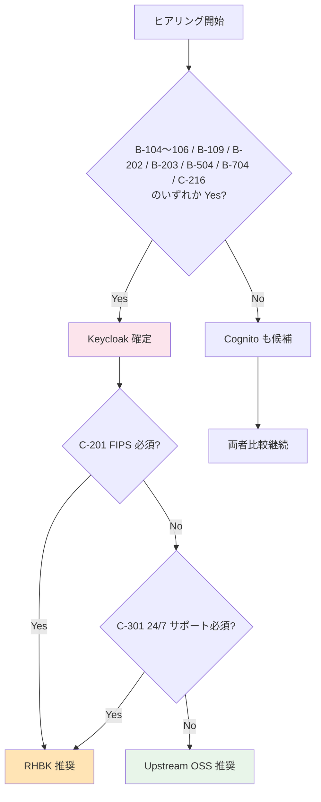
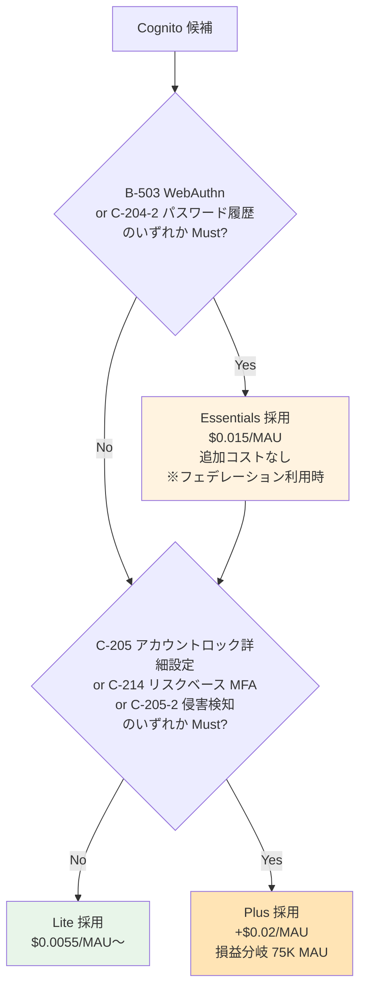

# ヒアリング項目チェックリスト（Single Source of Truth）

> 目的: 全 TBD 項目を Phase 別に一覧化し、ヒアリング進捗を一元管理   
> 上位 SSOT: [requirements-document-structure.md](requirements-document-structure.md)   
> 顧客提示版との対応: [proposal/00-index.md](proposal/00-index.md)（`proposal/fr/`, `proposal/nfr/`, `proposal/common/` 配下の各章と本表は `proposal §` 列で対応）

---

## 使い方

- ヒアリング前: 顧客に事前配布して回答を準備してもらう（可能な範囲で）
- ヒアリング中: このリストを開きながら順に質問
- ヒアリング後: 「回答」列に記入し、関連する `functional-requirements.md` / `non-functional-requirements.md` の TBD 列を更新

### 凡例
- **優先度**: 🔥 最優先 / 🟡 重要 / 🟢 通常
- **状態**: ⏳ 未確認 / ✅ 回答済 / ⚠ 要追加確認 / ❌ ペンディング
- **proposal §**: 顧客提示資料 [proposal/](proposal/) の対応サブセクション
  - **§FR-X.Y**: 機能要件章（proposal/fr/）
  - **§NFR-X**: 非機能要件章（proposal/nfr/）
  - **§C-X.Y**: 横断章（proposal/common/）
- **回答形式**: 期待する回答の形式（具体値 / Yes/No / 選択肢 / 自由記述）

---

## サマリー

| Phase | 項目数 | 🔥 最優先 | 🟡 重要 | 🟢 通常 | 状態 |
|-------|:----:|:------:|:----:|:----:|:---:|
| A. 事業要件 | 14 | 5 | 6 | 3 | ⏳ |
| B. 技術要件 | 60 | 11 | 33 | 16 | ⏳ |
| C. 運用・セキュリティ要件 | 37 | 12 | 19 | 6 | ⏳ |
| D. 最終判断 | 6 | 6 | 0 | 0 | ⏳ |
| **合計** | **117** | **34** | **58** | **25** | — |

**プラットフォーム選定への影響度が高い項目（🔥 最優先 34 件）を Stage 1 前半で先行確認**することで、ADR-014 / ADR-015 / ADR-016 / ADR-017 を早期確定できる。

---

## Phase A: 事業要件（プロダクトオーナー / 事業企画 / 営業）

| # | 優先度 | 項目 | 関連 FR/NFR | proposal § | 質問内容 | 期待回答形式 | 回答 | 状態 |
|---|:----:|------|----------|---------|---------|------------|------|:---:|
| A-1 | 🔥 | 想定 MAU 規模（1 年後） | NFR-SCL-001 | §C-2, §NFR-3 | 1 年後の月次アクティブユーザー数の想定は? | 具体値（例: 50,000） | | ⏳ |
| A-2 | 🔥 | 想定 MAU 規模（3 年後） | NFR-SCL-001 | §C-2, §NFR-3 | 3 年後の MAU の目標は? | 具体値 | | ⏳ |
| A-3 | 🔥 | 対象システム数 | — | §FR-1.1 | 共有基盤の初期スコープのシステム数は? | リスト + 優先度 | | ⏳ |
| A-4 | 🔥 | 顧客拠点の地理分布 | NFR-COMP-008 | §NFR-7 | 国内のみか、グローバル展開か? | 国内 / グローバル | | ⏳ |
| A-5 | 🔥 | 既存認証からの移行有無 | NFR-MIG-001 | §C-1.3, §NFR-9 | 移行元システムはあるか? あればユーザー数は? | Yes/No + 具体値 | | ⏳ |
| A-6 | 🟡 | エンドユーザー（顧客企業）の IdP 種別の分布 | FR-FED-002〜007 | §FR-2.1 | Entra ID / Okta / SAML / LDAP / HENNGE 等の比率は? | 概算分布 + 顧客リスト | | ⏳ |
| A-7 | 🟡 | 新規顧客追加の頻度 | NFR-SCL-003 | §FR-2.3.2 | 月平均何社の追加を想定? | 具体値 | | ⏳ |
| A-8 | 🟡 | データ所在地要件 | NFR-COMP-008 | §NFR-7 | 国内限定 / 特定リージョン制約はあるか? | リージョン名 | | ⏳ |
| A-9 | 🟡 | 業界規制 | NFR-COMP-001〜005 | §FR-1.2, §NFR-7 | 顧客の業界（金融/医療/政府等）| 業界名 + 規制名（PCI DSS / FFIEC / FISC 等）| | ⏳ |
| A-10 | 🟢 | 初回リリース時期の目標 | — | §C-4 | リリース目標日は? | 日付 | | ⏳ |
| A-11 | 🟢 | ブランディング要件 | FR-ADMIN-012 | §FR-8.3, §FR-2.3.3 | ログイン UI のカスタマイズ要否?（詳細は B-612 参照）| カスタマイズ範囲 | | ⏳ |
| A-12 | 🟢 | 海外展開時期 | NFR-COMP-002 | §NFR-7 | GDPR / CCPA 対応の必要時期? | 時期 / 不要 | | ⏳ |
| A-13 | 🟡 | 御社（事業者）の社内 IdP | FR-FED-001〜007 | §FR-2.1 | 御社自身の社内 IdP は? (Entra ID / Okta / HENNGE / オンプレ AD / なし) — 基盤の管理アクセスにも関わる | IdP 種別 | | ⏳ |
| A-14 | 🟡 | 既存 AWS 利用状況 | — | §C-2.3 | 既存の AWS 利用実績 / Enterprise Support 契約 / 既存 VPC / IAM 体制? | 利用状況 + 契約レベル | | ⏳ |

---

## Phase B: 技術要件（開発チーム / テックリード）

### B-1. 認証フロー / Grant Type（→ FR-AUTH §1.1 / proposal §FR-1.1）

| # | 優先度 | 項目 | 関連 FR | proposal § | 質問内容 | 期待回答 | 回答 | 状態 |
|---|:----:|------|--------|---------|---------|---------|------|:---:|
| B-101 | 🔥 | SPA Auth Code + PKCE | FR-AUTH-002 | §FR-1.1 | SPA 採用システムは? | システム名リスト | | ⏳ |
| B-102 | 🔥 | SSR Web App | FR-AUTH-003 | §FR-1.1 | Next.js / Spring MVC / Django / Rails 等の SSR は? | 有無 + システム名 | | ⏳ |
| B-103 | 🔥 | M2M / バッチ | FR-AUTH-004 | §FR-1.1 | バッチ / API 連携処理は? | 有無 + 件数想定 | | ⏳ |
| B-104 | 🔥 | **Token Exchange** | FR-AUTH-005 | §FR-1.1 | マイクロサービス間ユーザー文脈伝播（OBO）の必要性? | Yes/No | | ⏳ |
| B-105 | 🔥 | **Device Code** | FR-AUTH-006 | §FR-1.1 | CLI / IoT / Smart TV / AI Agent 認証の必要性? | Yes/No | | ⏳ |
| B-106 | 🔥 | **mTLS** | FR-AUTH-007 | §FR-1.1 | FAPI 準拠 / 高セキュリティ M2M の必要性? | Yes/No | | ⏳ |
| B-107 | 🟡 | ネイティブモバイル | FR-AUTH 全般 | §FR-1.1 | iOS / Android アプリの有無? | Yes/No + 件数 | | ⏳ |
| B-108 | 🟡 | **SPA 認証方式（BFF vs PKCE 直接）** | FR-AUTH-002 | §FR-1.1 | IETF/Curity/Duende が 2025 年から **BFF を gold standard** として推奨。BFF パターン採用か PKCE 直接か? | BFF / PKCE 直接 / 段階移行 | | ⏳ |
| **B-109** | 🟡 | **DPoP（RFC 9449、Sender-Constrained Tokens）** | FR-AUTH-015 想定 | §FR-1.1 | mTLS の代替として DPoP 採用要否?（FAPI 2.0 準拠 / Open Banking / 高セキュリティ API。**Yes → Keycloak 必須**、Cognito 標準非対応）| Yes/No | | ⏳ |

### B-2. IdP 接続種別（→ FR-FED §2.1 / proposal §FR-2.1）

| # | 優先度 | 項目 | 関連 FR | proposal § | 質問内容 | 期待回答 | 回答 | 状態 |
|---|:----:|------|--------|---------|---------|---------|------|:---:|
| B-201 | 🔥 | Entra ID 実接続 | FR-FED-002 | §FR-2.1 | 接続必要な顧客はあるか? PoC では Auth0 で代替検証 | Yes/No + 顧客 | | ⏳ |
| B-202 | 🔥 | **SAML IdP として発行** | FR-FED-006 | §FR-2.1 | 既存 SAML SP（業務システム）と連携必要? | Yes/No | | ⏳ |
| B-203 | 🔥 | **LDAP / AD 直接連携** | FR-FED-007 | §FR-2.1 | LDAP / AD 連携必要な顧客はあるか?（ADFS 経由でない直結）| Yes/No + 顧客 | | ⏳ |
| B-204 | 🟡 | Okta 接続 | FR-FED-003 | §FR-2.1 | 接続必要な顧客? | Yes/No | | ⏳ |
| B-205 | 🟡 | Google Workspace | FR-FED-004 | §FR-2.1 | 必要性? | Yes/No | | ⏳ |
| B-206 | 🟡 | SAML SP として受入 | FR-FED-005 | §FR-2.1 | 顧客 IdP が SAML 専用（ADFS / HENNGE 等）の場合あり? | Yes/No + IdP 名 | | ⏳ |
| B-207 | 🟡 | **独自プロトコル IdP の有無** | FR-FED-007 | §FR-2.1 | OIDC / SAML 以外の独自プロトコル IdP が存在するか?（ある場合は接続不可、ラッパー設計を要請）| Yes/No + 詳細 | | ⏳ |
| B-208 | 🟡 | **Custom Domain** | FR-FED-014 | §FR-2.1 | 認証エンドポイント URL に顧客指定ドメイン（`auth.example.com` 等）を使うか? | 使う / 使わない + 想定ドメイン | | ⏳ |

### B-3. 認可・JWT 要件（→ FR-AUTHZ §5 / proposal §FR-6）

| # | 優先度 | 項目 | 関連 FR | proposal § | 質問内容 | 期待回答 | 回答 | 状態 |
|---|:----:|------|--------|---------|---------|---------|------|:---:|
| B-301 | 🔥 | 必須クレーム | FR-AUTHZ-006 | §FR-2.2.2, §FR-6.1 | 各システムが JWT に必要とする属性は? | 属性リスト | | ⏳ |
| B-302 | 🟡 | 認可粒度 | FR-AUTHZ 全般 | §FR-6.1 | ロール / リソース / アクション粒度? | 設計方針 | | ⏳ |
| B-303 | 🟡 | 細粒度認可（UMA） | FR-AUTHZ-009 | §FR-6.2 | リソースレベル認可の必要性?（Yes → Keycloak Authorization Services）| Yes/No | | ⏳ |
| B-304 | 🟡 | **API 間トークンリレー / ユーザー文脈伝播** | FR-AUTH-005 / FR-AUTHZ | §FR-1.1, **§FR-6.3** | マイクロサービス間呼び出しで「**誰の操作か**」を伝播する必要があるか?（業務質問: ① マイクロサービス構成か / ② サービス A→B 内部呼び出しあり / ③ B 側ログでエンドユーザー追跡必須 / ④ サービス別の個別権限チェック / ⑤ scope 縮小（最小権限）/ ⑥ 外部システム代理操作（OBO）/ ⑦ コンプライアンス要件 — のいずれか Yes → **Token Exchange 必須 → Keycloak 必須**。詳細判定は §FR-6.3.4 フロー）| 業務シナリオ + パターン 1/2/3 選択 | | ⏳ |
| B-305 | 🟢 | 既存ロール体系 | FR-AUTHZ-003/004 | §FR-6.1, §FR-2.2.2 | 現在のロールモデル?（階層 / グループ / 部署）| 階層図等 | | ⏳ |
| B-306 | 🔥 | **テナント分離粒度** | FR-AUTHZ-002 | §FR-6.1, §FR-2.3.1 | 共有 DB + tenant_id / DB 分離 / アカウント分離 のどれか? 認可設計の核心 | 方式 | | ⏳ |

### B-4. ユーザー管理・プロビジョニング（→ FR-USER §6 / proposal §FR-2.2.1, §FR-7）

| # | 優先度 | 項目 | 関連 FR | proposal § | 質問内容 | 期待回答 | 回答 | 状態 |
|---|:----:|------|--------|---------|---------|---------|------|:---:|
| B-401 | 🟡 | SCIM プロビジョニング | FR-USER-003 | §FR-2.2.1, §FR-7.4 | 自動同期要件の有無? JIT のみで十分か、SCIM 併用が必要か?（大量退職フローの規模次第）| JIT のみ / SCIM 併用 | | ⏳ |
| B-402 | 🟡 | セルフサービス機能 | FR-USER-004 | §FR-7.3 | パスワードリセット / プロフィール編集の UI 提供範囲? | 範囲 | | ⏳ |
| B-403 | 🟢 | バルクインポート | FR-USER-009 | §FR-2.2.1, §FR-7.4 | 既存ユーザーの初期投入方法?（バルク / SCIM / JIT 任せ）| 方式 + 規模 | | ⏳ |
| B-404 | 🟢 | テナント管理者の委譲 | FR-ADMIN-011 | §FR-8.3 | 顧客企業側で自社ユーザーを管理する形式か? | Yes/No + 範囲 | | ⏳ |
| B-405 | 🟢 | Webhook 通知 | FR-INT-005 | §FR-9.3 | `user.created` 等のイベント連携必要? | Yes/No + 連携先 | | ⏳ |
| B-401-2 | 🟡 | JIT デフォルト権限レベル | FR-FED-008 | §FR-2.2.1 | JIT 自動生成時のデフォルト権限?（業界推奨：最小権限）| 最小権限 / 別レベル | | ⏳ |
| B-401-3 | 🟢 | JIT 生成イベント通知先 | FR-FED-008 / FR-INT-005 | §FR-2.2.1 | JIT 生成イベントの通知先?（CloudWatch / SIEM / メール）| 通知先 | | ⏳ |
| **B-406** | 🟡 | **同一テナント内ユーザー重複の想定** | FR-FED-008 | §FR-2.2.1.A | 同一テナント内で同一人物が複数経路でアクセスする想定はあるか?（複数 IdP 接続 / IdP 切替 / ローカル + フェデ併存 / SCIM + JIT 競合 / 退職再入社 等）| あり（経路）/ なし | | ⏳ |
| **B-407** | 🟡 | **重複検出時の挙動** | FR-FED-008 | §FR-2.2.1.A | B-406「あり」時、重複検出時の挙動?（自動リンク / Email OTP 確認 / 既存パスワード再認証 / エラー停止）。**自動リンクは IdP 信頼前提で乗っ取りリスクあり** | 挙動 | | ⏳ |
| **B-408** | 🟡 | **重複検出の突合せキー** | FR-FED-008/009 | §FR-2.2.1.A, §FR-2.2.2 | アカウント統合のキー?（email / immutable sub / 雇用 ID / カスタム属性）。**email のみは乗っ取りリスク、immutable な属性を主キーに推奨** | キー | | ⏳ |
| **B-409** | 🟢 | **アカウントリンクのトリガー** | FR-FED-008 / FR-ADMIN-011 | §FR-2.2.1.A, §FR-7 | リンクのトリガー?（管理者主導 / ユーザー主導 / 自動） | トリガー | | ⏳ |
| **B-410** | 🟢 | **IdP 切り替え時のユーザー連続性要件** | FR-FED-008 / NFR-MIG-001 | §FR-2.2.1.A, §NFR-9 | 顧客が IdP を切り替えた場合（Okta → Entra 等）、同一プロファイルを保つ要件があるか?（あり → 事前リンク / 手動マージ設計）| あり / なし / 検討中 | | ⏳ |

### B-5. MFA 要素・適用ポリシー（→ FR-MFA §3 / FR-FED §2.2 / proposal §FR-2.2.3, §FR-3）

| # | 優先度 | 項目 | 関連 FR | proposal § | 質問内容 | 期待回答 | 回答 | 状態 |
|---|:----:|------|--------|---------|---------|---------|------|:---:|
| B-501 | 🟡 | MFA 必須範囲 | FR-MFA-007 | §FR-3.2 | 全ユーザー / 管理者のみ / 条件付き? | 適用範囲 | | ⏳ |
| B-502 | 🟡 | MFA 方式 | FR-MFA-001〜004 | §FR-3.1 | TOTP / WebAuthn / SMS / Email のどれを許可? | 方式リスト | | ⏳ |
| B-503 | 🟡 | **WebAuthn / FIDO2（Passkeys）** | FR-MFA-002 | §FR-3.1 | パスキー対応の必要性?（**Cognito も 2024-11〜対応**、Essentials+ ティア、ADR-016。業界 87% deploy/pilot 中）| Yes/No | | ⏳ |
| B-504 | 🟡 | Back-Channel Logout | FR-SSO-007 | §FR-5.1 | 全クライアント連動ログアウト要件?（Yes → Keycloak 必須、Cognito 非対応）| Yes/No | | ⏳ |
| B-505 | 🟢 | 端末記憶 | FR-MFA-008 | §FR-3.2 | Trusted Device 対応?（詳細期間は C-215） | Yes/No | | ⏳ |
| B-506 | 🟡 | **外部 IdP MFA 信頼度** | FR-FED-012 | §FR-2.2.3 | 外部 IdP で MFA 済みのユーザーを Broker 側でも MFA 要求するか? 全面信頼 / 部分信頼 / 全件再要求 | 信頼方針 | | ⏳ |
| B-507 | 🟡 | 信頼する `amr` / AuthnContext 値 | FR-FED-012 | §FR-2.2.3 | どの `amr` 値 / AuthnContextClassRef を MFA 済として信頼するか?（例: `mfa`, `urn:oasis:names:tc:SAML:2.0:ac:classes:MultiFactorContract`）| 値リスト | | ⏳ |
| B-508 | 🟡 | 高権限ロールへの追加 MFA 強制 | FR-MFA-009 | §FR-2.2.3, §FR-3.2 | 管理者など高権限ユーザーには Broker 側でも MFA 強制するか? | する / しない / ロール別 | | ⏳ |
| B-509 | 🟡 | SSO で繋ぐシステム範囲 | FR-SSO-001/002 | §FR-4.1 | 共通基盤 SSO で繋ぐシステム範囲?（社内システムのみ / 顧客向けも含む / 横断 SSO）| 範囲 | | ⏳ |

### B-6. マルチテナント運用（→ FR-FED §2.3 / proposal §FR-2.3）

| # | 優先度 | 項目 | 関連 FR | proposal § | 質問内容 | 期待回答 | 回答 | 状態 |
|---|:----:|------|--------|---------|---------|---------|------|:---:|
| B-601 | 🟡 | **IdP 選択 UX 案（HRD / セレクター / 組織固有 URL）** | FR-FED-013 | §FR-2.3.3 | ログイン画面の UX パターン?（A. メールドメイン HRD 推奨 / B. IdP セレクター / C. 組織固有ログイン URL）| パターン | | ⏳ |
| B-602 | 🟢 | Keycloak Organization 機能利用 | FR-FED-010 | §FR-2.3, §C-1 | Keycloak 採用時、26.0+ 標準の **Organization 機能**（マルチテナント標準サポート、Organization Groups で階層管理）を利用するか? | 利用 / 利用しない（既存 Realm 分離方式） | | ⏳ |
| B-603 | 🟡 | 顧客追加リードタイム期待値 | FR-FED-011 / NFR-SCL-004 | §FR-2.3.2 | 新規顧客 IdP 追加のリードタイム期待値?（業界デフォルト：< 1 営業日）| 時間 / 日数 | | ⏳ |
| B-604 | 🟡 | 属性マッピング: 顧客 IdP 命名差異 | FR-FED-009 | §FR-2.2.2 | 顧客 IdP ごとに属性名差異がある場合（Entra `tid` / Okta `org_id` / HENNGE 独自等）の対応?（Broker 側で統一形式に正規化が前提）| 命名対応表（必要なら）| | ⏳ |
| B-605 | 🟡 | 属性更新タイミング | FR-FED-009 | §FR-2.2.2 | フェデユーザーの属性更新は毎回上書き（Sync Mode = Force）か、初回 JIT のみか? | 毎回上書き / 初回のみ / 別途トリガー | | ⏳ |
| B-606 | 🟢 | **1 ユーザー複数テナント所属の可能性** | FR-FED-010 | §FR-2.3.1, §FR-2.3.C | 1 人が複数テナントに所属する可能性はあるか?（あり → テナント切替 UI 検討）| あり / なし | | ⏳ |
| B-607 | 🟢 | **物理分離が必要な特殊顧客** | FR-FED-010 | §FR-2.3.1, §FR-2.3.A | データ物理分離を契約・規制要件として求める顧客があるか?（あり → 例外的に Pool/Realm per テナント = B 案採用）| あり / なし | | ⏳ |
| B-608 | 🟡 | **オンボーディング主体** | FR-FED-011 / FR-ADMIN-011 | §FR-2.3.2 | 顧客 IdP 追加の主体?（弊社運用チーム / 顧客企業セルフサービス）— B-404 と関連 | 弊社運用 / セルフ / ハイブリッド | | ⏳ |
| B-609 | 🟡 | **IdP 情報の受領形式** | FR-FED-011 | §FR-2.3.2 | 顧客から IdP 情報を受領する形式は?（SAML Metadata URL / XML / OIDC Discovery URL / 手動）| 形式 | | ⏳ |
| B-610 | 🟢 | **メールドメインから IdP への解決ルール** | FR-FED-013 | §FR-2.3.3 | HRD 採用時、1 ドメイン = 1 IdP / 1 顧客に複数ドメイン のどちらか?（B-601 で HRD 採用時のみ）| 解決ルール | | ⏳ |
| B-611 | 🟢 | **複数テナント所属時の選択 UI** | FR-FED-010/013 | §FR-2.3.C, §FR-2.3.3 | B-606 が「あり」の場合、ログイン後にテナント選択 UI 必要か? | 必要 / 不要 | | ⏳ |
| B-612 | 🟢 | **ログイン画面のブランディング詳細** | FR-ADMIN-012 | §FR-2.3.3, §FR-8.3 | 共通 UI か、顧客企業ごとカスタマイズか?（A-11 を詳細化）| 共通 / 顧客別 / ハイブリッド | | ⏳ |

### B-7. ログアウト・セッション管理（→ FR-SSO §4.2/4.3 / proposal §FR-5）

| # | 優先度 | 項目 | 関連 FR | proposal § | 質問内容 | 期待回答 | 回答 | 状態 |
|---|:----:|------|--------|---------|---------|---------|------|:---:|
| B-701 | 🟡 | **デフォルトのログアウトレイヤー** | FR-SSO-003〜007 | §FR-5.1 | 4 レイヤー（L1 ローカル / L2 IdP セッション破棄 / L3 フェデ連動 / L4 Back-Channel）のどこまでをデフォルトに? | レイヤー | | ⏳ |
| B-702 | 🟡 | **フェデ連動ログアウト要否** | FR-SSO-005 | §FR-5.1 | 外部 IdP（Entra ID / Auth0 等）セッションも連動破棄するか?(Cognito は URL エンコード制約あり) | Yes/No | | ⏳ |
| B-703 | 🟢 | **ログアウト後のリダイレクト先** | FR-SSO-003 | §FR-5.1 | 顧客指定 / 統一画面? | リダイレクト先 | | ⏳ |
| B-704 | 🟡 | **Access Token Revocation 要否** | FR-SSO-009 / NFR-SEC-008 | §FR-5.3 | Access Token の即時無効化が必要か?（Yes → Keycloak ネイティブ。Cognito は Refresh Token のみで代替）| 必須 / 短 TTL で吸収可 | | ⏳ |
| B-705 | 🟡 | **管理者強制ログアウト粒度** | FR-SSO-010 | §FR-5.3 | 管理者によるセッション破棄の粒度?（全ユーザー / テナント単位 / 個別ユーザー）| 粒度 | | ⏳ |
| B-706 | 🟢 | **ユーザー自身のセッション管理 UI** | FR-USER-004 | §FR-5.3 | ユーザー自身がアクティブセッションを確認・破棄できる UI 必要?（Yes → Keycloak Account Console 利用）| Yes/No | | ⏳ |

### B-8. SSO 詳細（→ FR-SSO §4.1 / proposal §FR-4）

| # | 優先度 | 項目 | 関連 FR | proposal § | 質問内容 | 期待回答 | 回答 | 状態 |
|---|:----:|------|--------|---------|---------|---------|------|:---:|
| B-801 | 🟡 | **クロス IdP SSO 方針** | FR-SSO-002 | §FR-4.2 | 外部 IdP（Auth0 / Entra ID 等）の SSO セッションを基盤側でも信頼するか?（全顧客有効 / 限定 / 無効）| 方針 | | ⏳ |
| B-802 | 🟢 | **外部 IdP の SSO セッション TTL 尊重** | FR-SSO-008 | §FR-4.2 | 外部 IdP のセッション TTL に従うか、本基盤側で上書きするか? | 従う / 上書き | | ⏳ |
| B-803 | 🟢 | **同一テナント内 SSO 切断システム** | FR-SSO-001 | §FR-4.1 | 同一テナント内でも SSO を意図的に切りたいシステム（高権限管理画面等）あるか? | あり / なし | | ⏳ |

---

## Phase C: 運用・セキュリティ要件（インフラ / セキュリティ / 情シス）

### C-1. 可用性・性能・DR（🔥 プラットフォーム選定直結 / proposal §NFR-1, §NFR-2, §NFR-5）

| # | 優先度 | 項目 | 関連 NFR | proposal § | 質問内容 | 期待回答 | 回答 | 状態 |
|---|:----:|------|---------|---------|---------|---------|------|:---:|
| C-101 | 🔥 | **SLA 目標** | NFR-AVL-001 | §NFR-1 | 99.9% / 99.95% / 99.99% のどれ? | 数値 | | ⏳ |
| C-102 | 🔥 | **RTO** | NFR-DR-001 | §NFR-5 | 災害復旧時の目標復旧時間? | 分 / 時間 | | ⏳ |
| C-103 | 🔥 | **RPO** | NFR-DR-002 | §NFR-5 | 災害復旧時のデータ損失許容? | 分 / 0 | | ⏳ |
| C-104 | 🔥 | フェイルオーバー方式 | NFR-DR-003 | §NFR-5 | 自動 / 手動? | 方式 | | ⏳ |
| C-105 | 🟡 | 認証応答時間目標 | NFR-PERF-001 | §NFR-2 | P95 / P99 の目標? | ms 値 | | ⏳ |
| C-106 | 🟡 | ピーク時想定 | NFR-PERF-007 | §NFR-2 | 朝 / 業務開始時の倍率? | 倍数 | | ⏳ |
| C-107 | 🟢 | 計画メンテナンス窓 | NFR-AVL-002 | §NFR-1 | 月何時間まで許容? | 時間 | | ⏳ |

### C-2. セキュリティ・コンプライアンス（🔥 Cognito ティア / RHBK 必要性決定 / proposal §FR-1.2, §FR-3, §FR-5.2, §NFR-4, §NFR-7）

| # | 優先度 | 項目 | 関連 NFR | proposal § | 質問内容 | 期待回答 | 回答 | 状態 |
|---|:----:|------|---------|---------|---------|---------|------|:---:|
| C-201 | 🔥 | **FIPS 140-2 認定** | NFR-COMP-006 | §NFR-7 | 業界規制で必須か?（Yes → RHBK 必須）| Yes/No | | ⏳ |
| C-202 | 🔥 | コンプライアンス認証 | NFR-COMP-002〜005 | §NFR-7 | SOC2 / ISO27001 / PCI DSS / FFIEC の必要性? | 認証リスト | | ⏳ |
| C-203 | 🔥 | 監査ログ保存期間 | NFR-OPS-003 / NFR-COMP-007 | §FR-8.2, §FR-9.2, §NFR-7 | 何ヶ月 / 年? | 期間 | | ⏳ |
| C-204 | 🟡 | パスワードポリシー（基本） | FR-AUTH-009 | §FR-1.2 | 顧客固有要件?（最小長・複雑性）| 仕様 | | ⏳ |
| C-204-2 | 🟡 | パスワード履歴 | FR-AUTH-010 | §FR-1.2 | 過去 N 個と一致禁止が必須か? Cognito は Essentials+ で対応（ADR-016）| Yes/No + N 個 | | ⏳ |
| C-204-3 | 🟡 | **NIST SP 800-63B Rev 4 準拠方針** | FR-AUTH-009/010/011 | §FR-1.2 | NIST Rev 4（2024 公開、複雑性要件・90 日ローテーション非推奨、侵害検出推奨）を目指すか? | 完全準拠 / 部分採用 / 不要 | | ⏳ |
| C-204-4 | 🟡 | **既存パスワードハッシュ移行** | NFR-MIG-001/002 | §FR-1.2, §NFR-9 | 既存ユーザーのパスワードハッシュ形式 + 持ち越し希望は? | 形式（bcrypt 等）+ 持ち越し有無 + 件数 | | ⏳ |
| **C-204-5** | 🔥 | **既存システムで独自ローカル認証を持つアプリの有無** | FR-AUTH / NFR-MIG-001 | §FR-1.2.0, §C-1.3 | アプリ独自の Login UI + ユーザー DB + パスワード管理を持つ既存システムはあるか?（あれば移行戦略を要検討）。本基盤は **A 案: 共通基盤集約** が前提、C 案ハイブリッドは移行期限定で許容 | あり（システム名 + 件数 + 移行方針: 段階移行 / 並行稼働 / 即時切替 / 維持）/ なし | | ⏳ |
| C-205 | 🟡 | アカウントロック詳細設定 | FR-AUTH-011 | §FR-1.2 | 自動 BF 保護で十分か / 連続失敗回数・ロック時間の**設定可能性**が必須か? 後者なら Cognito Plus ティア必要（ADR-016）| 自動で可 / 設定 N 回 N 分 | | ⏳ |
| C-205-2 | 🟡 | 侵害クレデンシャル検出 | NFR-SEC-010-2 | §FR-1.2 | 漏洩パスワードの自動検知・拒否が必要か?（NIST 推奨、Cognito Plus / Keycloak+HIBP）| Yes/No | | ⏳ |
| C-206 | 🟡 | トークン TTL | NFR-SEC-004〜006 | §FR-5.2, §NFR-4 | Access / Refresh / ID Token の有効期限? | 時間 | | ⏳ |
| C-206-2 | 🟡 | セッションタイムアウト目標（アイドル） | NFR-SEC-004 / FR-SSO-008 | §FR-5.2 | アイドルタイムアウトの目標値?（NIST AAL2: 1 時間 / AAL3: 15 分）| 時間 | | ⏳ |
| C-206-3 | 🟡 | **絶対経過タイムアウト** | NFR-SEC-004 / FR-SSO-008 | §FR-5.2 | セッション絶対経過タイムアウトの目標値?（NIST AAL2: 24 時間 / AAL3: 12 時間 / 緩い場合 7-30 日）| 時間 / 日 | | ⏳ |
| C-207 | 🟡 | トークン失効要件 | FR-SSO-009 | §FR-5.3 | 即時無効化の必要性?（B-704 と連動）| Yes/No | | ⏳ |
| C-208 | 🟡 | ペネトレーションテスト | NFR-SEC-013 | §NFR-4 | 年何回実施? | 回数 | | ⏳ |
| C-209 | 🟢 | 個人データ削除権 | NFR-COMP-009 | §NFR-7 | GDPR 等の対応必要? | Yes/No | | ⏳ |
| C-210 | 🔥 | **目標 NIST AAL レベル** | FR-MFA 全般 / NFR-SEC | §FR-3.0, §FR-3.1, §FR-5.2 | 認証保証レベルの目標は?（AAL1 = パスワードのみ / **AAL2** = MFA 必須（推奨） / AAL3 = Phishing-resistant 必須）| AAL1 / AAL2 / AAL3 | | ⏳ |
| C-211 | 🟡 | **Phishing-resistant MFA 採用方針** | FR-MFA-002 | §FR-3.1 | Passkeys / FIDO2 を Must として位置付けるか?（業界 87% deploy/pilot、NIST AAL2/3 整合）| Must / Should / Could | | ⏳ |
| C-212 | 🟢 | **ハードウェアキー対応** | FR-MFA 全般 | §FR-3.1 | YubiKey 等ハードウェアキー対応必要?（AAL3 必須時 or 管理者向け）| Yes/No | | ⏳ |
| C-213 | 🟢 | **MFA 要素の登録個数制限** | FR-MFA 全般 | §FR-3.1 | 1 ユーザーあたりの MFA 要素登録個数?（業界推奨：複数許可）| 1 / 複数 | | ⏳ |
| C-214 | 🟡 | **条件付き MFA の判定軸** | FR-MFA-006 | §FR-3.2 | リスクベース MFA の判定軸?（IP / 地理 / デバイス / 時間帯 / 行動パターン）| 判定軸リスト | | ⏳ |
| C-215 | 🟢 | **端末記憶の有効期間** | FR-MFA-008 | §FR-3.2 | Trusted Device の MFA スキップ期間?（業界デフォルト: 30 日、範囲 0〜90 日）| 日数 | | ⏳ |
| **C-216** | 🟡 | **ステップアップ認証（RFC 9470）の要否** | FR-MFA 全般 / FR-AUTHZ | §FR-3.3 | 高セキュ操作（決済 / 管理画面 / 大量データ出力等）で**動的に AAL を引き上げる**仕組みが必要か?（RFC 9470。Yes → 宣言的実装なら Keycloak、Cognito は Lambda 自前実装）| Yes/No + 対象操作 | | ⏳ |
| **C-217** | 🟢 | **CAEP / 継続的アクセス評価（将来発展）** | FR-SSO-010 / NFR-SEC | §FR-5.4 | リアルタイム deprovision / デバイス侵害時の即時遮断 / リスクシグナル伝播が必要か?（**現時点 Cognito/Keycloak とも未対応**、将来発展経路として位置付け）| 必須 / 将来検討 / 不要 | | ⏳ |

### C-3. 運用体制（🔥 RHBK サポート要否決定 / proposal §C-2, §NFR-6）

| # | 優先度 | 項目 | 関連 NFR | proposal § | 質問内容 | 期待回答 | 回答 | 状態 |
|---|:----:|------|---------|---------|---------|---------|------|:---:|
| C-301 | 🔥 | **サポート体制** | NFR-OPS-008 | §C-2.3, §NFR-6 | 24/7 必須 or 営業時間 or 不要? | 体制 | | ⏳ |
| C-302 | 🔥 | 既存の Red Hat 利用実績 | — | §C-2.3 | OpenShift / RHEL の既存利用?（Yes → RHBK 採用の追い風）| Yes/No + 契約規模 | | ⏳ |
| C-303 | 🔥 | RHBK サブスクリプション予算 | NFR-COST-006 | §C-2.3, §NFR-8 | 年 $15K〜90K 規模の予算枠? | Yes/No / 上限 | | ⏳ |
| C-304 | 🟡 | 監視ツール | NFR-OPS-001 | §FR-9.2, §NFR-6 | CloudWatch / Datadog / Grafana / Splunk 等? | 既存ツール | | ⏳ |
| C-305 | 🟡 | バージョンアップ方針 | NFR-OPS-005 | §NFR-6 | LTS のみ / 最新追従 / 任意? | 方針 | | ⏳ |
| C-306 | 🟡 | 変更管理プロセス | NFR-OPS-007 | §NFR-6 | 承認フロー / SLA?（IdP 追加等のリードタイム）| プロセス | | ⏳ |

---

## Phase D: 最終判断会議（意思決定者）

| # | 優先度 | 項目 | 関連 ADR | proposal § | 質問内容 | 回答 | 状態 |
|---|:----:|------|---------|---------|---------|------|:---:|
| D-1 | 🔥 | プラットフォーム選定 | ADR-017, 018 | §C-2 | Cognito（Lite/Essentials/Plus）or Keycloak（OSS / RHBK）? | | ⏳ |
| D-2 | 🔥 | 段階的移行 vs ビッグバン | NFR-MIG-005 | §NFR-9 | 移行戦略? | | ⏳ |
| D-3 | 🔥 | 運用体制の確定 | NFR-OPS 全般 | §NFR-6 | 専任 / 兼任 / 外部委託? | | ⏳ |
| D-4 | 🔥 | 予算の確定 | NFR-COST 全般 | §NFR-8 | 年間予算枠? | | ⏳ |
| D-5 | 🔥 | リリーススケジュール | — | §C-4 | 設計 → 開発 → テスト → 移行の各マイルストーン? | | ⏳ |
| D-6 | 🔥 | **Identity Broker パターン採用前提合意** | — | §C-1 | Hub-and-Spoke 型 Identity Broker パターンを基盤アーキテクチャの前提として合意できるか?（業界標準パターン、§C-1 で詳述）| 合意 / 異論 / 別案検討 | | ⏳ |

---

## 補足: 「Keycloak 必須要因」と「RHBK 必須要因」の判定フロー

**早期に B-104〜106 / B-109 / B-202 / B-203 / B-504 / B-704 / C-216 / C-201 / C-301 を確認できれば、プラットフォーム選定の見通しが立つ**。

※ Keycloak 必須要因に以下を追加（proposal §FR-1.1 / §FR-3.3 / §FR-5 で詳述）:
- B-109（DPoP / RFC 9449、FAPI 2.0 準拠）
- B-504（Back-Channel Logout、確実なログアウト伝播）
- B-704（Access Token Revocation、即時無効化）
- C-216（ステップアップ認証 / RFC 9470、宣言的実装）

## 補足: Cognito ティア選定の判定フロー（[ADR-016](../adr/016-cognito-feature-tier-selection.md)）

Cognito が候補に残った場合、ティア選定のためのヒアリング項目フロー:

**注**: フェデレーション利用なら Lite と Essentials の単価は同額（$0.015/MAU）のため、Essentials 採用は事実上**追加コストなし**で機能拡張できる。Plus 採用は $0.02/MAU 追加 → 損益分岐 MAU が 175K → 75K に下がる。

## 補足: NIST AAL 別の推奨パラメータ（C-210 が確定すると以下が連動）

| AAL レベル | C-211 MFA | C-206-2 アイドル | C-206-3 絶対経過 | 採用例 |
|---|---|:---:|:---:|---|
| AAL1（パスワードのみ）| 不要 | 任意 | 30 日 | 内部の機密性低システム |
| **AAL2（MFA 必須、推奨）** | **必須**（TOTP 以上、Passkey 推奨）| **1 時間** | **24 時間** | 一般的な B2B SaaS |
| AAL3（最高、Phishing-resistant）| 必須（Passkey / YubiKey）| 15 分 | 12 時間 | 金融 / 政府系 |

C-210（NIST AAL レベル）が確定すれば、C-211 / C-206-2 / C-206-3 / B-505 / C-215 等のデフォルト値が連動して決まる。

## 補足: proposal サブセクション完成度別の項目数

| proposal § | 状態 | 対応項目 ID | 件数 |
|---|:---:|---|:---:|
| §FR-1.1 認証フロー / Grant Type | ✅ 記載済 | B-101〜B-108, B-304 | 9 |
| §FR-1.2 パスワード・ローカルユーザー管理 | ✅ 記載済 | A-9, C-204, C-204-2〜4, C-205, C-205-2 | 7 |
| §FR-1.2.0 ローカルユーザー認証の主体 | ✅ 記載済 | C-204-5 | 1 |
| §FR-2.1 IdP 接続種別 | ✅ 記載済 | A-6, A-13, B-201〜B-208 | 10 |
| §FR-2.2.1 JIT プロビジョニング | ✅ 記載済 | B-401, B-401-2, B-401-3, B-403 | 4 |
| §FR-2.2.1.A 同一テナント内ユーザー重複 | ✅ 記載済 | B-406〜B-410 | 5 |
| §FR-2.2.2 属性マッピング | ✅ 記載済 | B-301, B-302, B-305, B-604, B-605 | 5 |
| §FR-2.2.3 MFA 重複回避 | ✅ 記載済 | B-506, B-507, B-508 | 3 |
| §FR-2.3 マルチテナント運用 | ✅ 記載済 | A-7, B-601〜B-612, B-306, B-803 | 14 |
| §FR-3 MFA | ✅ 記載済 | B-501〜B-505, B-508, C-210〜C-215 | 12 |
| §FR-4 SSO | ✅ 記載済 | B-509, B-801, B-802, B-803 | 4 |
| §FR-5 ログアウト・セッション管理 | ✅ 記載済 | B-504, B-701〜B-706, C-206, C-206-2, C-206-3, C-207 | 12 |
| §FR-6 認可 | 📋 骨格のみ | B-301〜B-306 | 6 |
| §FR-7 ユーザー管理 | 📋 骨格のみ | A-1, A-2, B-401, B-402, B-403 | 5 |
| §FR-8 管理機能 | 📋 骨格のみ | A-11, B-404, B-612, C-203 | 4 |
| §FR-9 外部統合 | 📋 骨格のみ | B-405, C-203, C-304 | 3 |
| §C-1 アーキテクチャ | ✅ 記載済 | A-5, B-602, C-204-5, D-3, D-6 | 5 |
| §C-2 プラットフォーム | 📋 骨格のみ | A-1, A-2, A-14, C-201, C-301〜C-303, D-1 | 8 |
| §NFR-1〜§NFR-9 非機能要件 | 📋 骨格のみ | C-101〜C-107, C-201〜C-209, C-301〜C-306, D-2, D-4 | 22+ |

→ proposal §FR-1〜§FR-5（認証 / フェデ / MFA / SSO / ログアウト）と §C-1（アーキテクチャ）はヒアリング項目側も**完備**。§FR-6 認可以降と §C-2 プラットフォーム / §NFR は proposal が骨格のみのため、本表の項目を起点に proposal を肉付けしていく順序。

---

## 関連ドキュメント

- [requirements-document-structure.md](requirements-document-structure.md): 要件定義フェーズ全体 SSOT
- [proposal/00-index.md](proposal/00-index.md): 顧客提示版 SSOT（`fr/` `nfr/` `common/` 配下の各章と本表は `proposal §` 列で対応）
- [proposal/fr/00-index.md](proposal/fr/00-index.md): 機能要件章一覧
- [proposal/nfr/00-index.md](proposal/nfr/00-index.md): 非機能要件章一覧（IPA グレード対応）
- [proposal/common/00-index.md](proposal/common/00-index.md): 横断章一覧
- [requirements-process-plan.md](requirements-process-plan.md): 進め方
- [requirements-hearing-strategy.md](requirements-hearing-strategy.md): ヒアリング戦略（Phase 詳細）
- [functional-requirements.md](functional-requirements.md): 機能要件
- [non-functional-requirements.md](non-functional-requirements.md): 非機能要件
- ADR-014（認証パターン範囲）、ADR-015（RHBK 検証先送り）、[ADR-016](../adr/016-cognito-feature-tier-selection.md)（Cognito ティア選定基準）

---

## 変更履歴

| 日付 | 内容 |
|---|---|
| 2026-05-18 | 業界最新動向 3 項目を補完: B-109（DPoP / RFC 9449）、C-216（ステップアップ認証 / RFC 9470）、C-217（CAEP / 継続的アクセス評価）。proposal §FR-1.1 / §FR-3.3 / §FR-5.4 と整合 |
| 2026-05-15 | proposal 章番号体系を §FR-X / §NFR-X / §C-X に全面リナンバリング（proposal フォルダが fr/ nfr/ common/ に再編されたことに伴う） |
| 2026-05-14 | C-204-5 追加（既存システムで独自ローカル認証を持つアプリの有無、§2.2.0 / §11.3 連動）|
| 2026-05-14 | proposal §4 / §5 / §6 章拡充・章リナンバリング反映、23 項目補完（B-606〜B-612, B-701〜B-706, B-801〜B-803, C-206-3, C-210〜C-215）|
| 2026-05-13 | proposal SSOT との対応列追加、Keycloak 26 Organization / BFF パターン等の最新動向反映、22 項目補完 |
| 2026-05-13 | Cognito 2024-11 WebAuthn 対応反映（C-204-2, C-205-2 追加） |
| 2026-04-21 | 初版作成（69 項目）|
