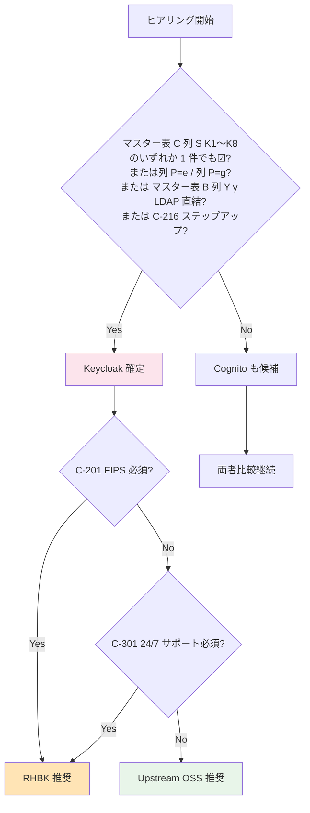
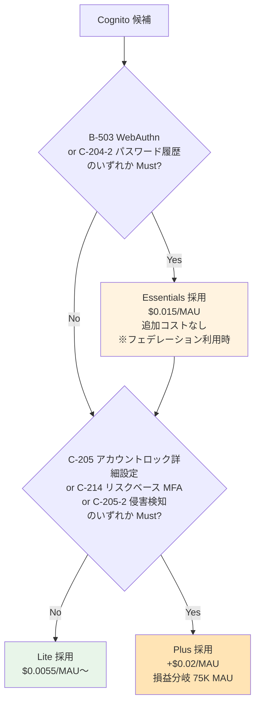

# ヒアリング項目チェックリスト（Single Source of Truth）

> 目的: 全 TBD 項目を **§0〜§5 のサブジェクト軸**で一覧化し、ヒアリング進捗を一元管理
> 上位 SSOT: [requirements-document-structure.md](requirements-document-structure.md)
> 顧客提示版との対応: [proposal/00-index.md](proposal/00-index.md)（`proposal/fr/`, `proposal/nfr/`, `proposal/common/` 配下の各章と本表は `proposal §` 列で対応）
>
> **構造再編成**（2026-05-25）: 旧 Phase A/B/C/D（**ステークホルダー軸**）→ **§0〜§5（subject-matter 軸）** に移行。判断基準は「**顧客から見えるか**」で §2 サービス要件 vs §4 技術仕様を分離。**Phase A/B/C/D は項目タグとして保持**（後方互換性 + ヒアリング会議の組み立て用）。

---

## 使い方

- ヒアリング前: 顧客に事前配布して回答を準備してもらう（可能な範囲で）
- ヒアリング中: このリストを開きながら順に質問
- ヒアリング後: 「回答」列に記入し、関連する `functional-requirements.md` / `non-functional-requirements.md` の TBD 列を更新

> **コード体系の意味で迷ったら → [terms-and-codes-reference.md](terms-and-codes-reference.md)**（P-1〜P-4 / I-1〜I-5 / α/β/γ/δ / K1〜K8 / L1〜L4 / マスター表列コード 等を 1 ページで対照確認可能）

### 凡例

- **優先度**: 🔥 最優先 / 🟡 重要 / 🟢 通常
- **Phase**: 旧ステークホルダー軸タグ。`[A]` 事業 / `[B]` 技術 / `[C]` 運用・セキュリティ / `[D]` 意思決定
- **状態**: ⏳ 未確認 / ✅ 回答済 / ⚠ 要追加確認 / ❌ ペンディング
- **proposal §**: 顧客提示資料 [proposal/](proposal/) の対応サブセクション
  - **§FR-X.Y**: 機能要件章（proposal/fr/）
  - **§NFR-X**: 非機能要件章（proposal/nfr/）
  - **§C-X.Y**: 横断章（proposal/common/）
- **回答形式**: 期待する回答の形式（具体値 / Yes/No / 選択肢 / 自由記述）
- **マスター表参照**: `→ B-100 列 S K1` のような表記は [マスター表 C 等](hearing-script/01-auth-flow.md)への統合先

---

## サマリー

| 章 | 項目数 | 🔥 最優先 | 🟡 重要 | 🟢 通常 | 状態 |
|---|:----:|:------:|:----:|:----:|:---:|
| §0 全般 | 0 | 0 | 0 | 0 | — |
| §1 前提合意（カテゴリ・パターン） | 6 | 6 | 0 | 0 | ⏳ |
| §2 サービスとしての要件 | 53 | 18 | 26 | 9 | ⏳ |
| §3 既存接続元・アプリの現状把握（旧 §3.1+§3.2 統合）| 23 | 5 | 15 | 3 | ⏳ |
| §4 技術仕様 | 28 | 1 | 19 | 8 | ⏳ |
| §5 非機能要件 | 17 | 8 | 8 | 1 | ⏳ |
| **合計** | **127** | **38** | **68** | **21** | — |

> **再編成（2026-05-25）**: 旧 Phase A/B/C/D 構造（A=19/B=47/C=35/D=6=合計 107）から §0〜§5 構造へ。**実数項目は不変**（一部マスター表内で行サイズが変わるため見かけ上の集計は変化）。Phase タグで後方互換。
>
> **マスター表 C 統合済（過去）**: 旧 B-101〜B-109 / B-202 / B-303 / B-304 / B-504 / B-704 / C-204-5 / C-207 の 17 項目を **B-100 マスター表 C** に統合。詳細は [§3.3](#33-マスター表-c-御社アプリシステム構成リスト) と [統合済 ID 一覧](#統合済-id-一覧旧-id-参照表)。

**プラットフォーム選定への影響度が高い項目（🔥 最優先 37 件）を Stage 1 前半で先行確認**することで、ADR-014 / ADR-015 / ADR-016 / ADR-017 を早期確定できる。

### ヒアリングの最上位順序

1. **§1 前提合意（カテゴリ・パターン）7 件すべて**: 後続全質問の範囲を規定する最上位判断
   - A-5-2（利用者カテゴリ P-1〜P-4）+ A-5-3（採用シナリオ α/β/γ/δ）+ A-5-4（インフラ運用者 I-1〜I-5）
   - A-11（軸 1 アプリ別ブランディング）+ A-11-α（軸 2 顧客別ブランディング）
   - D-6（Identity Broker パターン採用前提合意）
   - **D-7（内側プロトコル方針: アプリへの発行は OIDC 推奨を前提合意）**
2. **§3.1〜§3.2 の 2 大マスター表**（B-200 事業者+顧客 IdP 統合表 / B-100 アプリ）: 「**IdP × アプリ**」のマトリクスがこの 2 つで完結。**Cognito vs Keycloak 選定が事実上確定**
3. **§2.1〜§2.2 の事業・規制要件**（A-1〜A-4 / A-8 / A-9 / C-201 / C-202）: コスト試算とコンプラ範囲確定の入力

### 3 回会議への分割計画（M1 / M2 / M3）

> ヒアリングを **3 回会議に分割**して進める想定（[hearing-checklist-excel-main.tsv ヒアリング回列](hearing-checklist-excel-main.tsv) で M1/M2/M3 タグで管理可）。詳細は [hearing-checklist-excel-readme.md ヒアリング回](hearing-checklist-excel-readme.md#ヒアリング回m1--m2--m3--3-回会議への分割計画)。

| 会議 | サブ§ | 件数 | 🔥 | 狙い | 対象者 |
|---|---|:-:|:-:|---|---|
| **M1 第 1 回** | §1.1〜§1.5 + §2.1 + §2.2 + §2.7 + §3.1 + §3.2 + §3.3 | **32** | 22 | **プラットフォーム選定 8 割決着**（前提合意 + 規模 + 規制 + IdP/アプリ マスター表）| PO / 事業企画 + テックリード + 情シス |
| **M2 第 2 回** | §2.3 + §2.4 + §2.5 + §2.6 + §3.5 + §4.2 | **44** | 2 | **機能要件詳細**（マルチテナント / ユーザー管理 / SSO / MFA ポリシー / 認可）| 開発チーム / テックリード中心 |
| **M3 第 3 回** | §3.4 + §4.3 + §4.4 + §4.5 + §5.1〜§5.5 + §2.8 | **51** | 14 | **技術仕様 + NFR + 意思決定**（最終承認）| インフラ / SRE / セキュリティ + 意思決定者 |
| **合計** | - | **127** | **38** | - | - |

**順序の根拠**:
- 第 1 回が決まらないと **後続が空転**（プラットフォーム未定での詳細議論は無駄）
- 第 2 回のポリシー方針確定後、第 3 回で技術仕様の具体値を詰める
- 最終意思決定（D-1/D-3/D-4）は **第 3 回で全議論を踏まえて承認**

---

## §0. 全般（前置き）

ヒアリング項目なし。本セクションは要件定義の前置きとして、基本方針 4 柱・5 ステップナラティブ・用語整理を扱う。詳細は以下を参照：

- 基本方針 4 柱: [proposal/00-index.md §0.2](proposal/00-index.md)
- 検討事項の抽出方針: [proposal/00-index.md §0.4](proposal/00-index.md)
- ヒアリング進め方: [requirements-process-plan.md](requirements-process-plan.md)

---

## §1. 前提合意（カテゴリ・パターン）

> **後続全質問の範囲を規定する最上位判断**。Stage 1 前半で必ず先行確認。

| # | Phase | 優先度 | 項目 | 関連 FR/NFR | proposal § | 質問内容 | 期待回答 | 回答 | 状態 |
|---|:---:|:---:|------|----------|---------|---------|---------|------|:---:|
| **A-5-2** | `[A]` | 🔥 | **§1.1 受け入れる利用者カテゴリ**（P-1〜P-4 のどれか?）| FR-AUTH / FR-FED | §FR-1.2.0.0 | 本基盤を経由するユーザーのカテゴリを全選択: **P-1** 基盤運用管理者（弊社運用、Break Glass ローカル含む）/ **P-2** 顧客テナント管理者 / **P-3** 顧客一般従業員（**フェデユーザー**、現行 IdP あり）/ **P-4** 現行で IdP がなかった従業員 + ゲスト/外部協力者（**ローカル + 招待 URL**）。**B2C は本基盤対象外**（B2B SaaS 専用）。**P-3 のみなら純粋なフェデ運用、P-4 含むならローカルユーザー管理機能必須** | 該当カテゴリ複数選択 | | ⏳ |
| **A-5-3** | `[A]` | 🔥 | **§1.2 ローカルユーザー受け入れ範囲（採用シナリオ α/β/γ/δ）** | FR-AUTH / FR-FED | §FR-1.2.0.0 | 本基盤が受け入れるローカルユーザーの範囲を 4 シナリオから選択: **α** 全カテゴリ受入（P-1〜P-4、最大規模）/ **β** 管理者 + IdP なし顧客（P-1/P-2/P-4）/ **γ** **管理者層のみ**（P-1/P-2、業界推奨、顧客に IdP 必須化）/ **δ** Break Glass のみ（P-1 のみ、全顧客 IdP 強制）。事業戦略・運用負荷・MAU 課金規模・Plus ティア対象スコープ・顧客契約での「IdP 提供必須」条件の要否に直結 | α / β / γ / δ | | ⏳ |
| **A-5-4** | `[A]` | 🔥 | **§1.3 インフラ運用者カテゴリ確認（I-1〜I-5）** | NFR-OPS | §FR-1.2.0.0, §NFR-6.4 | 本基盤の**インフラを操作する人**を確認（**本基盤の認証経由ではなく AWS IAM 等で認証**）。複数該当を全選択: **I-1** AWS インフラ運用者 / **I-2** Keycloak / RHBK 運用者 / **I-3** 監視・SRE 担当 / **I-4** セキュリティ監査者 / **I-5** ベンダー / SI サポート。各カテゴリの認証経路・MFA 要件・最小権限ポリシー設計に直結 | 該当カテゴリ複数選択 + 各人数 | | ⏳ |
| **A-11** | `[A]` | 🔥 | **§1.5 ブランディング軸 1: アプリ別カスタマイズ要否** | FR-ADMIN-012 | §FR-8.3, §FR-2.3.3, §FR-2.3.3.A | 認証基盤側のログイン画面を **アプリごと**（経費精算 / 決済管理 / 人事 等）に別デザインにする必要があるか?（業界主流: Auth0 / Entra / Okta）。**Yes → パターン A' / No → パターン A**。A-11-α（軸 2 顧客別）と独立した軸。両者の組合せでパターン自動判定 | Yes（A'）/ No（A）| | ⏳ |
| **A-11-α** | `[A]` | 🔥 | **§1.5 ブランディング軸 2: 顧客別カスタマイズ要否** | FR-ADMIN-012 | §FR-8.3, §FR-2.3.3, §FR-2.3.3.A | 認証基盤側のログイン画面を **顧客企業ごと**（Acme / Globex 等）に別デザインにする必要があるか?（**Yes 部分**: パターン B、Cognito 20 顧客上限 / **Yes 完全分離**: パターン C、Pool/Realm 分離で **SSO 喪失リスク** / **No**: 顧客別はアプリ側で動的差替で完結）。A-11 軸 1 と独立した軸 | No / Yes 部分（B）/ Yes 完全分離（C）| | ⏳ |
| **D-6** | `[D]` | 🔥 | **§1.4 Identity Broker パターン採用前提合意** | — | §C-1 | Hub-and-Spoke 型 Identity Broker パターンを基盤アーキテクチャの前提として合意できるか?（業界標準パターン、§C-1 で詳述）| 合意 / 異論 / 別案検討 | | ⏳ |
| **D-7** | `[D]` | 🔥 | **§1.6 内側プロトコル方針: アプリへの発行は OIDC 推奨を前提合意** | FR-AUTH / FR-FED | §C-1, §FR-1.1 | 接続アプリへの認証情報発行プロトコルとして **OIDC 推奨を前提**として合意できるか?（業界主流 / 製品選定柔軟性 / SDK 充実 / 機能拡張容易性）。**新規アプリは OIDC 一択、既存 SAML SP アプリは OIDC 化検討を優先、OIDC 化困難な既存資産のみ SAML IdP 発行 (K5) で当面接続**。**K5 発生件数を抑制 → Cognito 採用余地拡大** | 合意 / 一部除外（既存資産のみ）/ 別案 | | ⏳ |

---

## §2. サービスとしての要件

> **判断基準**: 顧客の利用範囲・体験・契約に影響するもの（顧客から見える）。

### §2.1 規模・成長

| # | Phase | 優先度 | 項目 | 関連 FR/NFR | proposal § | 質問内容 | 期待回答 | 回答 | 状態 |
|---|:---:|:---:|------|----------|---------|---------|---------|------|:---:|
| A-1 | `[A]` | 🔥 | 想定 MAU 規模（1 年後）| NFR-SCL-001 | §C-2, §NFR-3 | 1 年後の月次アクティブユーザー数の想定は? | 具体値（例: 50,000）| | ⏳ |
| A-2 | `[A]` | 🔥 | 想定 MAU 規模（3 年後）| NFR-SCL-001 | §C-2, §NFR-3 | 3 年後の MAU の目標は? | 具体値 | | ⏳ |
| A-3 | `[A]` | 🔥 | 対象システム数 | — | §FR-1.1 | 共有基盤の初期スコープのシステム数は? | リスト + 優先度 | | ⏳ |
| A-4 | `[A]` | 🔥 | 顧客拠点の地理分布 | NFR-COMP-008 | §NFR-7 | 国内のみか、グローバル展開か? | 国内 / グローバル | | ⏳ |
| A-7 | `[A]` | 🟡 | 新規顧客追加の頻度 | NFR-SCL-003 | §FR-2.3.2 | 月平均何社の追加を想定? | 具体値 | | ⏳ |
| A-12 | `[A]` | 🟢 | 海外展開時期 | NFR-COMP-002 | §NFR-7 | GDPR / CCPA 対応の必要時期? | 時期 / 不要 | | ⏳ |
| **A-15** | `[A]` | 🔥 | **顧客企業数の現状と 5 年後想定** | NFR-SCL-002 / FR-FED-010 | §C-1.5, §C-2 | **エンドユーザー企業（テナント）の現状件数 と 5 年後想定**? IdP 数 = 顧客企業数として、本基盤のテナント分離戦略（L2 単一 Realm/Pool vs 複数 Pool 分割）と Cognito Hard Limit（IdP per Pool 〜1000、SAML 実質 〜100）抵触判定の最重要入力。**1500 顧客超で Cognito は Pool 分割必須、3000 顧客超で Keycloak 単一 Realm も性能チューニング要**（[§C-1.5 規模戦略](proposal/common/01-architecture.md#c-15-規模スケーリング戦略1500-3000-顧客企業)）| 現状件数 + 5 年後想定 + 増加カーブ | | ⏳ |

### §2.2 規制・コンプライアンス範囲

| # | Phase | 優先度 | 項目 | 関連 FR/NFR | proposal § | 質問内容 | 期待回答 | 回答 | 状態 |
|---|:---:|:---:|------|----------|---------|---------|---------|------|:---:|
| A-8 | `[A]` | 🟡 | データ所在地要件 | NFR-COMP-008 | §NFR-7 | 国内限定 / 特定リージョン制約はあるか? | リージョン名 | | ⏳ |
| A-9 | `[A]` | 🟡 | 業界規制 | NFR-COMP-001〜005 | §FR-1.2, §NFR-7 | 顧客の業界（金融/医療/政府等）| 業界名 + 規制名（PCI DSS / FFIEC / FISC 等）| | ⏳ |
| C-201 | `[C]` | 🔥 | **FIPS 140-2 認定** | NFR-COMP-006 | §NFR-7 | 業界規制で必須か?（Yes → RHBK 必須）| Yes/No | | ⏳ |
| C-202 | `[C]` | 🔥 | コンプライアンス認証 | NFR-COMP-002〜005 | §NFR-7 | SOC2 / ISO27001 / PCI DSS / FFIEC の必要性? | 認証リスト | | ⏳ |
| C-209 | `[C]` | 🟢 | 個人データ削除権 | NFR-COMP-009 | §NFR-7 | GDPR 等の対応必要? | Yes/No | | ⏳ |

### §2.3 マルチテナント運用方針

| # | Phase | 優先度 | 項目 | 関連 FR/NFR | proposal § | 質問内容 | 期待回答 | 回答 | 状態 |
|---|:---:|:---:|------|----------|---------|---------|---------|------|:---:|
| B-306 | `[B]` | 🔥 | **テナント分離粒度** | FR-AUTHZ-002 | §FR-6.1, §FR-2.3.1 | 共有 DB + tenant_id / DB 分離 / アカウント分離 のどれか? 認可設計の核心 | 方式 | | ⏳ |
| B-602 | `[B]` | 🟢 | Keycloak Organization 機能利用 | FR-FED-010 | §FR-2.3, §C-1 | Keycloak 採用時、26.0+ 標準の **Organization 機能**（マルチテナント標準サポート、Organization Groups で階層管理）を利用するか? | 利用 / 利用しない（既存 Realm 分離方式）| | ⏳ |
| B-603 | `[B]` | 🟡 | 顧客追加リードタイム期待値 | FR-FED-011 / NFR-SCL-004 | §FR-2.3.2 | 新規顧客 IdP 追加のリードタイム期待値?（業界デフォルト：< 1 営業日）| 時間 / 日数 | | ⏳ |
| B-606 | `[B]` | 🟢 | **1 ユーザー複数テナント所属の可能性** | FR-FED-010 | §FR-2.3.1, §FR-2.3.C | 1 人が複数テナントに所属する可能性はあるか?（あり → テナント切替 UI 検討）| あり / なし | | ⏳ |
| **B-606-2** | `[B]` | 🟡 | **複数テナント時の権限モデル** | FR-FED-010 | §FR-2.3.1, §FR-2.3.C, §FR-2.2.4 | B-606「あり」時、権限の扱い?（横断: GitHub Org 型 / 切替: Slack 型 / 別ユーザー扱い: §FR-2.2.1.A 独立派）。**`tenant_id` クレーム形式（スカラー / 配列）に直結** | モデル | | ⏳ |
| **B-606-3** | `[B]` | 🟢 | **テナント切替時の MFA 再要求** | FR-FED-010 / FR-MFA | §FR-2.3.C, §FR-3.2 | B-606「あり」時、テナント切替時に MFA を再要求するか?（[§FR-3.3](proposal/fr/03-mfa.md) ステップアップと連動）| 再要求する / しない / ロール別 | | ⏳ |
| **B-606-4** | `[B]` | 🟢 | **複数所属時の属性ソース** | FR-FED-009/010 | §FR-2.2.4, §FR-2.3.C | B-606「あり」時、テナントごとに属性が違う場合の管理?（テナント別管理: `memberships:[{tenant, groups, dept}]` / 統合: 最終ログイン値で上書き）| 管理方式 | | ⏳ |
| B-607 | `[B]` | 🟢 | **物理分離が必要な特殊顧客** | FR-FED-010 | §FR-2.3.1, §FR-2.3.A | データ物理分離を契約・規制要件として求める顧客があるか?（あり → 例外的に Pool/Realm per テナント = B 案採用）| あり / なし | | ⏳ |
| B-608 | `[B]` | 🟡 | **オンボーディング主体** | FR-FED-011 / FR-ADMIN-011 | §FR-2.3.2 | 顧客 IdP 追加の主体?（弊社運用チーム / 顧客企業セルフサービス）— B-404 と関連 | 弊社運用 / セルフ / ハイブリッド | | ⏳ |
| B-611 | `[B]` | 🟢 | **複数テナント所属時の選択 UI** | FR-FED-010/013 | §FR-2.3.C, §FR-2.3.3 | B-606 が「あり」の場合、①ログイン後にテナント選択 UI 必要か?（必要 / 不要 / URL ベース）+ ②必要時の**実装場所**（**業界標準: アプリ側 SPA / BFF**、基盤側は標準機能なし非推奨）。クレーム統一（B-606-4 memberships 配列）が前提ならアプリ側で完結可能。詳細は [hearing-script B-611](hearing-script/06-multitenancy.md#複数テナント所属時の選択-ui-b-611-) / [§FR-2.3.C シナリオ C](proposal/fr/02-federation.md#fr-23c-マルチテナント環境での-sso-挙動) | ①必要性 + ②実装場所（アプリ / BFF / 基盤 / ハイブリッド）| | ⏳ |

### §2.4 ユーザー管理ポリシー

> **用語前提**: 本セクションの「JIT」「SCIM」「Webhook」は以下の方向・契機を指す（[§FR-7.4.0](proposal/fr/07-user.md#fr-740-scim-の位置づけと本基盤のスタンス) と整合）:
>
> | 用語 | 方向 | 契機 | 主体 |
> |---|---|---|---|
> | **JIT プロビジョニング** | 外部 IdP → 共通基盤（**ログインのついで**）| **ユーザーが本基盤に初回ログインした瞬間** | 基盤側（自動）|
> | **SCIM プロビジョニング** | 顧客 HR/IdP → 共通基盤（**独立 REST API**）| **顧客側で人事変更（入社/異動/退職）が起きた瞬間** | 顧客側 IdP（push）|
> | **Webhook 通知** | **共通基盤 → 各アプリ**（方向逆）| **基盤側でユーザーイベント（JIT/SCIM 含む全契機）が発生した瞬間** | 基盤側（push）|

| # | Phase | 優先度 | 項目 | 関連 FR/NFR | proposal § | 質問内容 | 期待回答 | 回答 | 状態 |
|---|:---:|:---:|------|----------|---------|---------|---------|------|:---:|
| B-401 | `[B]` | 🟡 | SCIM プロビジョニング採否 | FR-USER-003 | §FR-2.2.1, §FR-7.4 | **顧客 HR/IdP → 共通基盤への push 同期（SCIM）** を採用するか?（詳細は [hearing-script/04-user-management.md B-401](hearing-script/04-user-management.md) で比較イメージ + 業界トレンド付き）| JIT のみ / SCIM 併用 / 顧客選択制 | | ⏳ |
| B-401-2 | `[B]` | 🟡 | **新規作成時のデフォルト権限**（JIT / SCIM / バルク 共通）| FR-FED-008 | §FR-2.2.1 | **ユーザーレコード新規作成時のデフォルト権限・ロールは?** 契機を問わず統一。**業界推奨は最小権限（明示的にロール付与されるまでアクセス不可）**| 最小権限 / "user" 基本ロール / 顧客側で個別指定 | | ⏳ |
| B-401-3 | `[B]` | 🟢 | **ユーザー作成イベントの通知先**（JIT / SCIM / バルク 共通）| FR-FED-008 / FR-INT-005 | §FR-2.2.1 | **共通基盤でユーザーレコードが作成された時の通知先?**（契機を問わず統一）。①B-405 Webhook / ②CloudWatch Logs / ③SIEM ストリーミング / ④管理者メール | 通知先 + 通知契機 | | ⏳ |
| B-402 | `[B]` | 🟡 | セルフサービス機能 | FR-USER-004 | §FR-7.3 | パスワードリセット / プロフィール編集 / **MFA リセット** / セッション管理を **ユーザー本人が UI で操作できる範囲**?（基盤標準提供 vs アプリ側実装）| 範囲 | | ⏳ |
| B-403 | `[B]` | 🟢 | 既存ユーザーの初期投入方法 | FR-USER-009 | §FR-2.2.1, §FR-7.4 | **新規顧客オンボーディング時、既存ユーザーをどう基盤に入れるか?** ①バルク / ②SCIM 連携 / ③JIT 任せ | 方式 + 規模 | | ⏳ |
| B-404 | `[B]` | 🟢 | テナント管理者の委譲 | FR-ADMIN-011 | §FR-8.3 | 顧客企業側で自社ユーザーを管理する形式か?（**P-2 テナント管理者**として基盤 Admin API 経由で CRUD 委譲）| Yes/No + 範囲 | | ⏳ |
| B-405 | `[B]` | 🟢 | Webhook 通知（**基盤 → 外部アプリ**）| FR-INT-005 | §FR-9.3 | **共通基盤でユーザーイベントが発生した時、外部アプリへリアルタイム通知する必要があるか?** **SCIM とは方向が逆**（[§FR-9.3.0](proposal/fr/09-integration.md) 参照）| Yes/No + 対象イベント + 連携先 | | ⏳ |
| **B-406** | `[B]` | 🟡 | **同一テナント内ユーザー重複の想定** | FR-FED-008 | §FR-2.2.1.A | 同一テナント内で **同一人物が複数経路でアクセスする** 想定はあるか?（複数 IdP 接続 / IdP 切替過渡期 / ローカル+フェデ併存 / SCIM 先行+JIT 後追い / 退職→再入社 等）| あり（経路明示）/ なし | | ⏳ |
| **B-407** | `[B]` | 🟡 | **重複検出時の挙動** | FR-FED-008 | §FR-2.2.1.A | B-406「あり」時の挙動?（自動リンク / Email OTP 確認 / 既存パスワード再認証 / エラー停止）。**自動リンクは IdP 信頼前提で乗っ取りリスクあり** | 挙動 | | ⏳ |
| **B-409** | `[B]` | 🟢 | **アカウントリンクのトリガー** | FR-FED-008 / FR-ADMIN-011 | §FR-2.2.1.A, §FR-7 | リンクのトリガー?（管理者主導 / ユーザー主導 / 自動）| トリガー | | ⏳ |
| **B-410** | `[B]` | 🟢 | **IdP 切り替え時のユーザー連続性要件** | FR-FED-008 / NFR-MIG-001 | §FR-2.2.1.A, §NFR-9 | 顧客が IdP を切り替えた場合（Okta → Entra 等）、同一プロファイルを保つ要件があるか? | あり / なし / 検討中 | | ⏳ |
| **B-IDM-1** | `[B]` | 🔴 | **email 非保有ユーザーの存在** | FR-AUTH-009 / FR-FED-008 | §FR-1.2.0.D | 顧客のエンドユーザーで **email を持たないユーザー** が存在するか?（フィールドワーカー / 工場 / 病院 / 小売 / 教育現場想定）| あり（業種・概算規模・想定 %）/ なし | | ⏳ |
| **B-IDM-2** | `[B]` | 🔴 | **顧客独自 ID の体系** | FR-AUTH-009 / FR-USER-001 | §FR-1.2.0.D | 顧客が **独自に決めた ID 体系**（社員番号 / 学籍番号 / 店舗番号 / 技能者 ID 等）を新基盤でも canonical identifier として使うか? その**命名規則・桁数**は? | 社員番号 8 桁数字 / 部門コード+連番 / 自由形式 / 顧客ごと差異 | | ⏳ |
| **B-IDM-3** | `[B]` | 🟡 | **顧客独自 ID の不変性** | FR-AUTH-009 | §FR-1.2.0.D | 顧客独自 ID は不変か?（**Layer B = 可変、Layer A = 不変** の前提との整合）| 不変 / 異動で変更 / 退職時のみ廃止 | | ⏳ |
| **B-IDM-4** | `[B]` | 🟡 | **同一顧客内での ID 衝突可能性** | FR-AUTH-009 | §FR-1.2.0.D | 顧客内で **同一 ID が複数ユーザーに付与される** ことはあるか?（部門コード重複等）| 衝突なし / 部門間で重複可（複合キー必要）| | ⏳ |
| **B-IDM-5** | `[B]` | 🟡 | **顧客間 ID 衝突** | FR-AUTH-009 / FR-FED-010 | §FR-1.2.0.D | 顧客間で **同名 ID** が衝突しうるか?（基盤内一意化のため `tenant_id` プレフィックス要否を判定）| あり / なし | | ⏳ |
| **B-IDM-6** | `[B]` | 🔴 | **アカウント復旧手段の物理制約** | FR-AUTH-014 | §FR-1.2.0.D | email 不在ユーザーの **パスワード復旧・MFA 再登録** をどう運用するか? | 対面リセット可 / SMS 可（NIST Restricted 承認要）/ 管理者主導のみ / Recovery Codes / Push | | ⏳ |
| **B-IDM-7** | `[B]` | 🟡 | **既存システム間の ID 体系統一度** | NFR-MIG-001 / FR-USER-009 | §FR-1.2.0.D, §FR-7.4.7 | 現行は **システムごとに別 ID** で管理しているか? 統一されているか? | 全システム同 ID / システムごとに別 ID（マッピング必要）| | ⏳ |
| **B-IDM-8** | `[B]` | 🟡 | **ServiceNow user_name との関係**（Point 3 連動）| FR-FED-014 | §FR-1.2.0.D | ServiceNow 連携時、ServiceNow の `user_name` は **顧客独自 ID と同じ** か別 mapping が必要か? | 同じ / 別（mapping table 必要）| | ⏳ |
| **B-IDM-9** | `[B]` | 🟡 | **顧客 IdP の NameID Format** | FR-FED-001/008 | §FR-1.2.0.D, §FR-2.2.1.A | 顧客 IdP が送出する SAML NameID Format（推奨：`persistent`）| `persistent` 受信可 / `emailAddress` のみ / `unspecified` | | ⏳ |
| **B-IDM-10** | `[B]` | 🟡 | **顧客 IdP の email 送出率** | FR-FED-009 | §FR-1.2.0.D | 顧客側 IdP は assertion で email を全員に送出するか?（一部空欄 / 全員無しの場合は補助属性扱いに変更）| 全員送信 / 一部空欄 / 全員無し | | ⏳ |
| **B-IDM-11** | `[B]` | 🟢 | **SCIM userName との関係** | FR-USER-003 | §FR-1.2.0.D, §FR-7.4 | SCIM `userName` 属性は **顧客独自 ID** と同じか別マッピングが必要か? | 同じ / 別マッピング必要 | | ⏳ |
| **B-IDM-12** | `[B]` | 🟢 | **退職者 ID の再利用** | FR-USER-009 | §FR-1.2.0.D | 退職者の ID（社員番号等）を **新入社員に再付与** することがあるか?（あれば Layer A `sub` での区別が必須）| 再利用する / しない | | ⏳ |
| **B-MIG-1** | `[B]` | 🔴 | **現行ローカル PW ハッシュアルゴリズム**（2026-06-12 追加）| NFR-MIG-001 | §FR-1.2.0.E | 現行システムが保持する PW ハッシュは?（**Keycloak ネイティブ対応**は PBKDF2 / Argon2 のみ、bcrypt 等は SPI 必要）| bcrypt / Argon2 / PBKDF2 / 独自 / 不明 | | ⏳ |
| **B-MIG-2** | `[B]` | 🔴 | **現行サインアップ機能の所在と承認フロー**（2026-06-12 追加）| FR-USER-004 / NFR-MIG | §FR-1.2.0.E | サインアップ UI はどこ?承認フローはあるか?（各アプリ独自 / 共通 UI / 管理者作成のみ + テナント管理者承認の有無）| 所在 + 承認有無 | | ⏳ |
| **B-MIG-3** | `[B]` | 🔴 | **移行アプローチ希望**（2026-06-12 追加）| NFR-MIG | §FR-1.2.0.E.1 | 移行方式の希望は?（A Big Bang / **B 並走（業界推奨）** / C 永続共存）| A / B / C + 理由 | | ⏳ |
| **B-MIG-4** | `[B]` | 🟡 | **移行期間の希望**（2026-06-12 追加）| NFR-MIG | §FR-1.2.0.E.1 | 並走期間の希望は?（3 ヶ月 / **6 ヶ月（推奨）** / 1 年 / 制約なし）| 期間 | | ⏳ |
| **B-MIG-5** | `[B]` | 🔴 | **顧客側混在状況**（2026-06-12 追加）| FR-FED-008 / NFR-MIG | §FR-1.2.0.E.5 | 同一顧客内で **社員（フェデ）+ 委託・代理店（ローカル）の混在**はあるか? | 全員フェデ / 全員ローカル / **混在あり**（規模目安） | | ⏳ |
| **B-MIG-6** | `[B]` | 🟡 | **アプリ切替単位**（2026-06-12 追加）| NFR-MIG | §FR-1.2.0.E.4 | 並走中の切替単位は?（**アプリ単位（推奨）** / 顧客単位 / 利用者カテゴリ単位）| 単位 | | ⏳ |
| **B-MIG-7** | `[B]` | 🟡 | **並走期の旧システム維持責任**（2026-06-12 追加）| NFR-OPS / NFR-MIG | §FR-1.2.0.E.4 | 並走期間中、旧 IAM の維持責任は?（弊社 / 顧客 / 共同）| 責任分担 + 窓口 | | ⏳ |
| **B-MIG-8** | `[B]` | 🟡 | **ロールバック容易性要件**（2026-06-12 追加）| NFR-MIG / NFR-AV | §FR-1.2.0.E.4 | 切替後の問題発生時、ロールバック時間目標は? | アプリ単位 1 時間以内 / 顧客単位 1 営業日 / 全体 1 週間 | | ⏳ |
| **B-MIG-9** | `[B]` | 🟡 | **既存ユーザー数規模**（2026-06-12 追加）| NFR-MIG / NFR-SCALE | §FR-1.2.0.E | 移行対象のユーザー数規模は?（全体合計 / 顧客あたり最大 / 想定ピーク同時ログイン）| 規模目安 | | ⏳ |
| **B-MIG-10** | `[B]` | 🟡 | **強制 PW リセット許容範囲**（2026-06-12 追加）| NFR-MIG / NFR-SEC | §FR-1.2.0.E.2 | 強制 PW リセット（招待メール再送）は許容できるか?（① / ② キャッシュ移行で回避できれば理想）| なし許容 / 一部のみ / 全員許容 | | ⏳ |
| **B-MIG-11** | `[B]` | 🟡 | **サインアップ UI 引継ぎ希望**（2026-06-12 追加）| FR-USER-004 | §FR-1.2.0.E.3 | 新基盤でのサインアップ UI 配置は?（α アプリ側残置 / **β 共通基盤集約（推奨）** / γ 管理者作成のみ）| α / β / γ | | ⏳ |
| **B-MIG-12** | `[B]` | 🟢 | **旧 user_id の保持期間**（2026-06-12 追加）| FR-USER-001 | §FR-1.2.0.E.4 | 旧 user_id を **`external_id` 属性として永続保持** するか、並走期終了で破棄するか? | 永続 / 並走期のみ | | ⏳ |
| **B-SN-1** | `[B]` | 🔴 | **ServiceNow 連携の対象範囲**（2026-06-15 追加）| FR-FED-014 / FR-USER | §FR-2.4, §FR-7.4.10 | ServiceNow 連携で必要な機能は?（SSO のみ / **SSO + Provisioning** / その他 SaaS Salesforce/Workday も含む）| 範囲 + 対象 SaaS 一覧 | | ⏳ |
| **B-SN-2** | `[B]` | 🟡 | **既存 ServiceNow ユーザー数 / 規模**（2026-06-15 追加）| FR-FED-014 / NFR-SCALE | §FR-2.4 | 既存 ServiceNow ユーザー規模（全体合計 / 顧客あたり最大）| 規模目安 | | ⏳ |
| **B-SN-3** | `[B]` | 🔴 | **プロビジョニング方向**（2026-06-15 追加）| FR-USER / FR-FED-014 | §FR-2.4.A | A SSO のみ / **B SSO + SAML JIT（推奨・業界標準）** / C SSO + SCIM Push（KB2599716 リスク承知）/ D 双方向（非推奨）| パターン | | ⏳ |
| **B-SN-4** | `[B]` | 🟡 | **SSO プロトコル**（2026-06-15 追加）| FR-FED-001 / FR-FED-014 | §FR-2.4.A | **SAML 2.0（推奨・業界標準）** / OIDC（ServiceNow Tokyo+ 新規構築のみ）| プロトコル | | ⏳ |
| **B-SN-5** | `[B]` | 🟡 | **既存 `user_name` 体系**（B-IDM-8 連動、2026-06-15 追加）| FR-USER-001 / FR-FED-014 | §FR-2.4, §FR-1.2.0.D | ServiceNow の `user_name` は **顧客独自 ID（Layer B `external_id`）と同じ** か別 mapping が必要か? | 同じ / 別 mapping / 不明 | | ⏳ |
| **B-SN-6** | `[B]` | 🟡 | **退職時の ServiceNow レコード扱い**（2026-06-15 追加）| FR-USER-009 | §FR-2.4 | 退職時、ServiceNow 側 `sys_user` は?（**残置・履歴保持＝業界標準** / `active=false` 同期 / 物理削除）| 方針 | | ⏳ |
| **B-SN-7** | `[B]` | 🟢 | **Multi-Provider SSO Plugin 有効化状況**（2026-06-15 追加）| FR-FED-014 | §FR-2.4.B | ServiceNow `com.snc.integration.sso.multi` プラグイン有効化済み? | 有効 / 未有効（要設定）/ 不明 | | ⏳ |
| **B-SN-8** | `[B]` | 🟢 | **他 SaaS SP 連携の予定**（2026-06-15 追加）| FR-FED-014 | §FR-2.4 | ServiceNow 以外の SaaS SP 連携予定は?（Salesforce / Workday / その他 / なし）| 一覧 + 優先度 | | ⏳ |
| **B-SN-9** | `[B]` | 🔴 | **既存 ServiceNow ローカルユーザー数**（2026-06-16 追加）| FR-FED-014 / NFR-MIG | §FR-2.4, ADR-023 §J | 現状 ServiceNow にしか居ないローカルユーザー数は?（全体 / カテゴリ別：社員 / 委託 / ベンダー等）| 規模目安 + カテゴリ別内訳 | | ⏳ |
| **B-SN-10** | `[B]` | 🔴 | **既存 SN ローカルユーザーの PW 移行希望**（2026-06-16 追加）| FR-FED-014 / NFR-MIG | §FR-2.4, ADR-023 §J-2 | PW 移行手段は?（**A User Storage SPI（推奨）** / B 強制リセット / C SSO 後も SN ローカル PW 残置）| A / B / C + 理由 | | ⏳ |
| **B-SN-11** | `[B]` | 🟡 | **SSO 開始後の SN ローカル PW 取扱い**（2026-06-16 追加）| FR-FED-014 / NFR-SEC | §FR-2.4, ADR-023 §J-3 | SSO 開始後、ServiceNow ローカル PW は?（**一般無効化 + 管理者 Break Glass 残置（推奨）** / 全員残置 / 完全削除）| 方針 | | ⏳ |
| **B-SN-12** | `[B]` | 🟡 | **顧客 ServiceNow 管理者の SAML SSO 経験**（2026-06-16 追加）| FR-FED-014 / NFR-OPS | §FR-2.4, ADR-023 §F | 顧客側の ServiceNow 管理者は **SAML SSO 連携の設定経験**があるか?（Okta / Azure AD 等の過去実績）| あり（経験 IdP）/ なし（要 Partner 支援）/ 不明 | | ⏳ |
| **B-SN-13** | `[B]` | 🟢 | **顧客 Change Management リードタイム**（2026-06-16 追加）| NFR-MIG / NFR-OPS | §FR-2.4, ADR-023 §F | ServiceNow 設定変更に**社内 Change Request が必要**か?（規制業種では 1-2 週間追加の可能性）| 不要 / 必要（リードタイム）| | ⏳ |
| **B-SN-14** | `[B]` | 🔴 | **SN-only ユーザーの存在と規模**（2026-06-16 追加、④ 採用判定）| FR-FED-014 / NFR-MIG | §FR-2.4, ADR-023 §J-1 ④ | **ServiceNow にしか居ない**（他アプリ SSO 不要）ユーザーが存在するか?（業務委託 / 外部ベンダー / 限定アクセス等）| 存在しない（全員 SSO 移行）/ 少数 < 10%（少数 ④ ハイブリッド）/ **多数 ≥ 10%（④ メイン）** | | ⏳ |
| **B-SN-15** | `[B]` | 🟡 | **④ SN ローカル残置の許容性**（2026-06-16 追加、ガバナンス観点）| NFR-SEC / NFR-OPS | §FR-2.4, ADR-023 §J-1 ④ | SN-only ユーザーを **Keycloak に移行せず ServiceNow ローカル PW のまま残置** することは、**監査・統制上許容できるか**?（規制業種では監査一元化のため不可の可能性）| 許容（④ 採用可）/ 不可（① or ② 必須）/ 検討中 | | ⏳ |
| **B-SN-16** | `[B]` | 🟡 | **Break Glass 管理者の運用**（2026-06-16 追加、SSO 障害時対応）| NFR-OPS / NFR-AV | §FR-2.4, ADR-023 §J-3-A | ServiceNow に **Break Glass 管理者**（SSO バイパス可能、緊急時用ローカル PW 残置）を運用するか?（業界標準は 2-3 名、`sso_source` 空欄 + Hardware MFA + IP 制限）| 採用（人数）/ 採用しない / 既存運用と統合（弊社運用の Break Glass を流用）| | ⏳ |
| **B-SN-17** | `[B]` | 🟢 | **SSO Routing の必要粒度**（2026-06-16 追加、ADR-023 §J-3-B）| FR-FED-014 / NFR-OPS | §FR-2.4, ADR-023 §J-3-B | ServiceNow SSO routing 制御の必要粒度は?（**L1 グローバル + L2 per-user で十分**（推奨デフォルト）/ L3 per-URL も必要 / L4 Portal 別 SSO / L5 Role 別スクリプト / L7 User Criteria 複合条件）| 必要レベル + 具体要件 | | ⏳ |

### §2.5 SSO・ログアウト方針

| # | Phase | 優先度 | 項目 | 関連 FR/NFR | proposal § | 質問内容 | 期待回答 | 回答 | 状態 |
|---|:---:|:---:|------|----------|---------|---------|---------|------|:---:|
| B-509 | `[B]` | 🟡 | SSO で繋ぐシステム範囲 | FR-SSO-001/002 | §FR-4.1 | 共通基盤 SSO で繋ぐシステム範囲?（社内システムのみ / 顧客向けも含む / 横断 SSO）| 範囲 | | ⏳ |
| B-701 | `[B]` | 🟡 | **デフォルトのログアウトレイヤー** | FR-SSO-003〜007 | §FR-5.1 | 4 レイヤー（L1 ローカル / L2 IdP セッション破棄 / L3 フェデ連動 / L4 Back-Channel）のどこまでをデフォルトに? | レイヤー | | ⏳ |
| B-702 | `[B]` | 🟡 | **フェデ連動ログアウト要否** | FR-SSO-005 | §FR-5.1 | 外部 IdP（Entra ID / Auth0 等）セッションも連動破棄するか?(Cognito は URL エンコード制約あり)| Yes/No | | ⏳ |
| B-703 | `[B]` | 🟡 | **ログアウト後リダイレクト先（全体方針）** | FR-SSO-003 | §FR-5.1 | リダイレクト先の管理方針?（基盤側で集中管理 / アプリ側で個別管理 / 顧客側で持ち込み）。**事前登録（allowlist）が前提** | 管理方針 | | ⏳ |
| B-801 | `[B]` | 🟡 | **クロス IdP SSO 方針（全体方針）** | FR-SSO-002 | §FR-4.2 | 外部 IdP（Auth0 / Entra ID 等）の SSO セッションを基盤側でも信頼するか?（全顧客有効 / 限定 / 無効）| 方針 | | ⏳ |
| **B-801-1** | `[B]` | 🟡 | **信頼レベル**（L1〜L4）| FR-SSO-002 | §FR-4.2 | デフォルトの信頼レベルは?（**L1 完全信頼** = 業界標準 / L2 部分信頼 / L3 検証ありき / L4 不信任）| L1 / L2 / L3 / L4 | | ⏳ |
| **B-801-2** | `[B]` | 🟡 | **顧客 / IdP / アプリ別の差別化要否** | FR-SSO-002 / FR-FED-010 | §FR-4.2, §FR-2.3 | 全顧客 / 全 IdP / 全アプリで同じ信頼レベル?それとも差別化?（例: 経費精算は L1、決済管理は L3、金融顧客は L4 等）| 全顧客同一 / 顧客別 / アプリ別 / 両方 | | ⏳ |
| **B-801-3** | `[B]` | 🟢 | **規制業種向け L3 オプションの要否** | FR-SSO-002 / NFR-SEC | §FR-4.2, §FR-3.3 | 金融・医療・PCI DSS 等の規制対応で L3 検証ありき信頼（acr_values + ステップアップ）を提供する必要があるか? | 必須（業種名）/ 将来検討 / 不要 | | ⏳ |
| B-803 | `[B]` | 🟢 | **同一テナント内 SSO 切断システム** | FR-SSO-001 | §FR-4.1 | 同一テナント内でも SSO を意図的に切りたいシステム（高権限管理画面等）あるか? | あり / なし | | ⏳ |
| **B-622** | `[B]` | 🔴 | **サービス選択画面 SPA 構築方針**（2026-06-12 追加）| FR-SSO-008 | §FR-4.3.1 | 認証後の **entitled apps 一覧画面（サービス選択画面）** をどう構築するか?（A 別 SPA 構築＝業界標準 / B Keycloak アカウント設定画面 流用 / C 不要・直リンクのみ）。Microsoft 365 portal / Okta Dashboard / Atlassian Cloud start が業界実例 | A / B / C + 想定アプリ数 | | ⏳ |
| **B-623** | `[B]` | 🔴 | **Sorry ページ実装パターン**（2026-06-12 追加）| FR-SSO-008 | §FR-4.3.2 | 直リンクでアプリ X にアクセス → 認証成功 → 権限なし時の Sorry ページ実装は?（A アプリ側 / B 認証基盤 Theme / **C 共通 エラー / 案内画面 SPA＝推奨**）| A / B / C | | ⏳ |
| **B-624** | `[B]` | 🟡 | **サービス選択画面 のテナント別ブランディング**（2026-06-12 追加）| FR-SSO-008 / NFR-OPS | §FR-4.3.1 | サービス選択画面 のテナント別 theme / ロゴ / 配色は必要か? | 必要（テナント別）/ 不要（共通 UI）| | ⏳ |
| **B-625** | `[B]` | 🟡 | **認証後のデフォルト着地点**（2026-06-12 追加）| FR-SSO-008 | §FR-4.3.3 | 認証完了時、`redirect_uri` を優先（直リンク尊重）か サービス選択画面 に強制遷移か? | redirect_uri 優先（推奨）/ サービス選択画面 強制 / 顧客選択 | | ⏳ |
| **B-626** | `[B]` | 🟢 | **Pre-login システム選択 UI 採否**（2026-06-12 追加）| FR-SSO-008 | §FR-4.3.0 | ログイン前にユーザーに「どのシステム?」を選ばせる UI は必要か?（**業界非推奨**、本基盤デフォルトは不採用）| 不採用（業界標準）/ 採用（社内イントラ要件あり）| | ⏳ |
| **B-627** | `[B]` | 🟡 | **サービス選択画面 表示アプリの判定根拠**（2026-06-12 追加）| FR-SSO-008 / FR-AUTHZ | §FR-4.3.1 | サービス選択画面 で「どのアプリを表示するか」の判定根拠は?（JWT roles / Keycloak Client ロール / 顧客別マッピング表 / 全部組合せ）| 根拠 + 設計責務 | | ⏳ |
| **B-628** | `[B]` | 🔴 | **AWS edge での Sorry 制御パターン**（2026-06-12 追加）| FR-SSO-008 / NFR-OPS | §FR-4.3.2.A | Sorry を AWS インフラ層のどこで制御するか?（i CloudFront Custom Error Response / **ii CloudFront + Lambda@Edge＝推奨** / iii viewer-request JWT 検証 / iv ALB authenticate-oidc / v ALB Native JWT Validation [2025 新機能]）| パターン + 適用範囲 | | ⏳ |
| **B-629** | `[B]` | 🟡 | **edge 集約 vs アプリ個別 Sorry**（2026-06-12 追加）| FR-SSO-008 / NFR-OPS | §FR-4.3.2.A | Sorry を **edge 層に集約**するか、各アプリで個別実装するか?（集約 = 変更 1 箇所で N アプリ対応、個別 = 既存変更最小）| 集約 / 個別 / 顧客選択 | | ⏳ |
| **B-630** | `[B]` | 🟡 | **CloudFront / ALB の構成**（2026-06-12 追加）| FR-SSO-008 / NFR-OPS | §FR-4.3.2.A | 業務アプリの前段インフラは?（CloudFront 前段 + ALB 配下＝標準 / ALB のみ / CloudFront + S3 のみ）。Sorry パターンの選択肢に直結 | 構成 | | ⏳ |

### §2.6 MFA 適用ポリシー

> **MFA は「適用ポリシー（§2.6）」と「技術仕様（§4.3）」の 2 章に分割**。本章は「誰に / いつ MFA を強制するか」の方針確定、§4.3 は「どの方式をサポートするか」「具体値」の技術確定。

| # | Phase | 優先度 | 項目 | 関連 FR/NFR | proposal § | 質問内容 | 期待回答 | 回答 | 状態 |
|---|:---:|:---:|------|----------|---------|---------|---------|------|:---:|
| B-501 | `[B]` | 🟡 | MFA 必須範囲 | FR-MFA-007 | §FR-3.2 | 全ユーザー / 管理者のみ / 条件付き? | 適用範囲 | | ⏳ |
| B-506 | `[B]` | 🟡 | **外部 IdP MFA 信頼度** | FR-FED-012 | §FR-2.2.3 | 外部 IdP で MFA 済みのユーザーを Broker 側でも MFA 要求するか? 全面信頼 / 部分信頼 / 全件再要求 | 信頼方針 | | ⏳ |
| B-508 | `[B]` | 🟡 | 高権限ロールへの追加 MFA 強制 | FR-MFA-009 | §FR-2.2.3, §FR-3.2 | 管理者など高権限ユーザーには Broker 側でも MFA 強制するか? | する / しない / ロール別 | | ⏳ |
| C-210 | `[C]` | 🔥 | **目標 NIST AAL レベル** | FR-MFA 全般 / NFR-SEC | §FR-3.0, §FR-3.1, §FR-5.2 | 認証保証レベルの目標は?（AAL1 = パスワードのみ / **AAL2** = MFA 必須（推奨） / AAL3 = Phishing-resistant 必須）| AAL1 / AAL2 / AAL3 | | ⏳ |
| **B-AA-1** | `[B]` | 🔴 | **Adaptive Authentication 採用方針**（2026-06-18 追加）| FR-MFA / NFR-SEC | §FR-3.6, ADR-034 | コンテキストベース動的リスク評価を採用するか?（Phase 1 から / 段階導入 / 不採用＝静的のみ）| 採用方針 + 段階 | | ⏳ |
| **B-AA-2** | `[B]` | 🟡 | **リスクスコア閾値**（2026-06-18 追加）| NFR-SEC | §FR-3.6, ADR-034 | Low/Medium/High の閾値カスタマイズ?（デフォルト 0-30/31-70/71-100 / 規制業種厳格 / B2C 緩和）| 閾値設定 | | ⏳ |
| **B-AA-3** | `[B]` | 🟡 | **Threat Intel 連携の要否**（2026-06-18 追加）| NFR-SEC | §FR-3.6, ADR-034 | 商用 Threat Intel 採用?（年額数百 USD〜 / 無料 OSS のみ / 不要）| 採否 + 製品名 | | ⏳ |
| **B-AA-4** | `[B]` | 🟢 | **異常時の管理者通知方法**（2026-06-18 追加）| NFR-OPS | §FR-3.6, ADR-034 | 異常検知時の通知先?（Slack / メール / PagerDuty / SIEM 経由）| 通知先 + 重大度別 | | ⏳ |
| **B-ITDR-1** | `[B]` | 🔴 | **ITDR 採用方針**（2026-06-18 追加）| NFR-SEC | §NFR-4.6, ADR-035 | アイデンティティ脅威検知・対応を採用?（Phase 1 から / 段階導入 / 不採用）| 採用 + 段階 | | ⏳ |
| **B-ITDR-2** | `[B]` | 🟡 | **検知対象の優先順位**（2026-06-18 追加）| NFR-SEC | §NFR-4.6, ADR-035 | 6 検知領域（Compromised Cred / Anomaly Login / Token Theft / Session Hijack / Privileged Abuse / MFA Bypass）の優先度?| 優先順位 | | ⏳ |
| **B-ITDR-3** | `[B]` | 🟡 | **SIEM 連携の要否・形式**（2026-06-18 追加）| NFR-SEC / NFR-OPS | §NFR-4.6, ADR-035 | 顧客 SIEM 連携必要?（**OCSF 推奨** / CEF / LEEF / Syslog / 不要）| 形式 + 顧客側 SIEM | | ⏳ |
| **B-ITDR-4** | `[B]` | 🟢 | **顧客 SIEM 製品**（2026-06-18 追加）| NFR-OPS | §NFR-4.6, ADR-035 | 顧客が使用する SIEM?（Splunk / QRadar / Sentinel / Datadog / その他 / なし）| 製品名 | | ⏳ |
| **B-ITDR-5** | `[B]` | 🟢 | **通知先**（2026-06-18 追加）| NFR-OPS | §NFR-4.6, ADR-035 | ITDR 検知時の通知先?（Slack / PagerDuty / メール / SIEM のみ）| 通知先 | | ⏳ |
| **B-ITDR-6** | `[B]` | 🟡 | **False Positive 許容範囲**（2026-06-18 追加）| NFR-SEC / NFR-OPS | §NFR-4.6, ADR-035 | False Positive 許容?（厳格＝FP 多くても可 / 通常 / UX 優先＝FP 最小化）| 許容範囲 | | ⏳ |
| **B-CAS-1** | `[B]` | 🔴 | **エンタープライズ顧客の獲得意思**（2026-06-18 追加）| NFR-COMPL | §NFR-7.5, ADR-036 | エンタープライズ顧客（SOC 2 監査人がエビデンス要求するレベル）獲得は?（必須 / 望ましい / 不要）| 意思 + 想定社数 | | ⏳ |
| **B-CAS-2** | `[B]` | 🔴 | **規制業種顧客の比率見込み**（2026-06-18 追加）| NFR-COMPL | §NFR-7.5, ADR-036 | 規制業種顧客の見込みは?（金融 N 社 / 医療 N 社 / 公共 N 社 / なし）| 業種別社数 | | ⏳ |
| **B-CAS-3** | `[B]` | 🟡 | **SOC 2 Type II 取得タイミング**（2026-06-18 追加）| NFR-COMPL | §NFR-7.5, ADR-036 | SOC 2 Type II 取得時期?（MVP 1 年後 / 2 年後 / 不要）| 時期 | | ⏳ |
| **B-CAS-4** | `[B]` | 🟡 | **ISO 27001 認証取得**（2026-06-18 追加）| NFR-COMPL | §NFR-7.5, ADR-036 | ISO 27001 認証取得?（1.5 年後 / 不要）| 取得方針 | | ⏳ |
| **B-CAS-5** | `[B]` | 🟡 | **PCI DSS 認証要否**（2026-06-18 追加）| NFR-COMPL | §NFR-7.5, ADR-036 | PCI DSS 認証必要?（必要＝カード処理顧客あり / 不要）| 必要性 | | ⏳ |
| **B-CAS-6** | `[B]` | 🟡 | **Compliance Team 体制**（2026-06-18 追加）| NFR-OPS | §NFR-7.5, ADR-036 | Compliance Team 体制?（専任 1 名 / 兼任 / 外部委託 / なし）| 体制 | | ⏳ |
| **B-CAS-7** | `[B]` | 🟢 | **Trust Center 公開範囲**（2026-06-18 追加）| NFR-COMPL | §NFR-7.5, ADR-036 | Trust Center 構成?（Layer 1+2+3 完全 / Layer 1+2 / Layer 1 のみ）| 範囲 | | ⏳ |
| **B-IGA-1** | `[B]` | 🔴 | **Shared Responsibility 認識**（2026-06-18 追加）| FR-USER / NFR-OPS | §FR-8.4, ADR-037 | IdP-KC ユーザーは「顧客所有・弊社ホスト」モデルで認識するか?（採用＝業界標準 / 弊社側責務拡大希望 / 顧客側責務拡大希望）| 採用方針 | | ⏳ |
| **B-IGA-2** | `[B]` | 🔴 | **Access Certification の必要性**（2026-06-18 追加）| FR-USER / NFR-COMPL | §FR-8.4, ADR-037 | 顧客テナント管理者による定期アクセスレビュー機能は?（必要＝規制業種、年次/半年次 / 不要＝顧客側で別途実施）| 必要性 + 頻度 | | ⏳ |
| **B-IGA-3** | `[B]` | 🟡 | **Access Request Workflow の必要性**（2026-06-18 追加）| FR-USER | §FR-8.4, ADR-037 | 申請承認 UI 必要?（必要＝自社内承認プロセスあり / 不要＝管理者直接付与）| 必要性 | | ⏳ |
| **B-IGA-4** | `[B]` | 🟡 | **SoD の必要性**（2026-06-18 追加）| FR-USER / NFR-COMPL | §FR-8.4, ADR-037 | Segregation of Duties ルール定義必要?（必要＝業界/規制要件 / 不要）| 必要性 | | ⏳ |
| **B-IGA-5** | `[B]` | 🟢 | **重量 IGA 連携の予定**（2026-06-18 追加）| FR-USER | §FR-8.4, ADR-037 | SailPoint / Saviynt 等の重量 IGA 連携予定?（あり＝製品名 / なし / 検討中）| 予定 + 製品 | | ⏳ |
| **B-IGA-6** | `[B]` | 🟢 | **顧客テナント管理者数**（2026-06-18 追加）| FR-USER | §FR-8.4, ADR-037 | 顧客あたりのテナント管理者数想定?（1 名 / 2-3 名 / 大規模 5+ 名）| 規模目安 | | ⏳ |
| **B-IGA-7** | `[B]` | 🟡 | **顧客 IT ガバナンス成熟度**（2026-06-18 追加）| FR-USER / NFR-OPS | §FR-8.4, ADR-037 | 顧客の IT ガバナンス成熟度?（高＝IGA 製品保有 / 中＝手動運用 / 低＝基盤側で支援必要）| 成熟度別社数 | | ⏳ |
| **B-TAP-1** | `[B]` | 🔴 | **ユーザ管理画面 の必要性**（2026-06-18 追加）| FR-USER / FR-ADMIN | §FR-8.5, ADR-038 | 顧客テナント管理者向け Admin UI 必須?（必須 / 不要＝弊社運用代行）| 必要性 | | ⏳ |
| **B-TAP-2** | `[B]` | 🔴 | **Build vs Buy**（2026-06-18 追加）| FR-ADMIN / NFR-COST | §FR-8.5, ADR-038 | 構築方式?（**自作（推奨）** / Phase Two OSS / WorkOS / Frontegg / Retool）| 方式 + 理由 | | ⏳ |
| **B-TAP-3** | `[B]` | 🟡 | **MVP 機能セットの範囲**（2026-06-18 追加）| FR-ADMIN | §FR-8.5, ADR-038 | MVP 段階の機能範囲?（Phase 1 のみ / Phase 1-2 / Phase 1-3 / 全部）| 範囲 | | ⏳ |
| **B-TAP-4** | `[B]` | 🟢 | **配置 URL 戦略**（2026-06-18 追加）| FR-ADMIN | §FR-8.5, ADR-038 | URL?（**単一サブドメイン admin.basis.example.com（推奨）** / テナント別サブドメイン）| URL 方式 | | ⏳ |
| **B-TAP-5** | `[B]` | 🟢 | **サービス選択画面 統合**（2026-06-18 追加）| FR-SSO-008 / FR-ADMIN | §FR-8.5, ADR-038, ADR-021 | サービス選択画面 に管理画面タイル配置?（統合 / 独立 URL のみ）| 統合方針 | | ⏳ |
| **B-TAP-6** | `[B]` | 🟡 | **テナント管理者数（顧客あたり）**（2026-06-18 追加）| FR-ADMIN | §FR-8.5, ADR-038 | 1 名 / 2-3 名 / 大規模 5+ 名? | 人数規模 | | ⏳ |
| **B-TAP-7** | `[B]` | 🟡 | **Bulk Import 必要性**（2026-06-18 追加）| FR-USER | §FR-8.5, ADR-038 | 初期移行 / 日常運用で必須?（必須 / 不要）| 必要性 | | ⏳ |
| **B-TAP-8** | `[B]` | 🟢 | **API キー / Webhook 管理 UI**（2026-06-18 追加）| FR-INT | §FR-8.5, ADR-038 | Phase 1 から必要 / Phase 4+ / 不要 | 必要性 + Phase | | ⏳ |
| **B-TAP-9** | `[B]` | 🟢 | **ブランディング設定セルフサービス**（2026-06-18 追加）| FR-USER / FR-FED-013 | §FR-8.5, ADR-038 | 顧客が自分で設定 / 弊社運用が設定 / 不要 | 方針 | | ⏳ |
| **B-TAP-10** | `[B]` | 🟡 | **監査ログ保持期間**（2026-06-18 追加）| NFR-COMPL | §FR-8.5, ADR-038 | 1 年 / 3 年 / 7 年（規制業種）| 保持期間 | | ⏳ |

### §2.7 移行戦略・リリース

| # | Phase | 優先度 | 項目 | 関連 FR/NFR | proposal § | 質問内容 | 期待回答 | 回答 | 状態 |
|---|:---:|:---:|------|----------|---------|---------|---------|------|:---:|
| A-5 | `[A]` | 🔥 | 既存認証からの移行有無 | NFR-MIG-001 | §C-1.3, §NFR-9 | 移行元システムはあるか? あればユーザー数は? | Yes/No + 具体値 | | ⏳ |
| A-10 | `[A]` | 🟢 | 初回リリース時期の目標 | — | §C-4 | リリース目標日は? | 日付 | | ⏳ |
| D-2 | `[D]` | 🔥 | 段階的移行 vs ビッグバン | NFR-MIG-005 | §NFR-9 | 移行戦略? | 戦略 | | ⏳ |
| D-5 | `[D]` | 🔥 | リリーススケジュール | — | §C-4 | 設計 → 開発 → テスト → 移行の各マイルストーン? | スケジュール | | ⏳ |

### §2.8 意思決定

| # | Phase | 優先度 | 項目 | 関連 ADR | proposal § | 質問内容 | 期待回答 | 回答 | 状態 |
|---|:---:|:---:|------|---------|---------|---------|---------|------|:---:|
| D-1 | `[D]` | 🔥 | プラットフォーム選定 | ADR-017, 018 | §C-2 | Cognito（Lite/Essentials/Plus）or Keycloak（OSS / RHBK）? | 選定結果 | | ⏳ |
| D-3 | `[D]` | 🔥 | 運用体制の確定 | NFR-OPS 全般 | §NFR-6 | 専任 / 兼任 / 外部委託? | 体制 | | ⏳ |
| D-4 | `[D]` | 🔥 | 予算の確定 | NFR-COST 全般 | §NFR-8 | 年間予算枠? | 予算 | | ⏳ |

---

## §3. 既存接続元・アプリの現状把握

> **2 大マスター表が核**: §3.1 マスター表 B（事業者 + 顧客 IdP 統合表）/ §3.2 マスター表 C（アプリ・システム）。この 2 表で「**IdP × アプリ**」のマトリクスが完結し、**Cognito vs Keycloak 選定が事実上確定**。
>
> **構造変更**（2026-05-25）: 旧 §3.1 マスター表 A（弊社内 IdP、1 行のみ）と旧 §3.2 マスター表 B（顧客 IdP、N 行）を **§3.1 マスター表 B に統合**（区分列で事業者/顧客を区別、用途列で対象ユーザーを明示）。旧 §3.3〜§3.6 → §3.2〜§3.5 にリナンバリング。

### §3.1 マスター表 B: 事業者・顧客 IdP 統合表

| # | Phase | 優先度 | 項目 | 関連 FR/NFR | proposal § | 質問内容 | 期待回答 | 回答 | 状態 |
|---|:---:|:---:|------|----------|---------|---------|---------|------|:---:|
| A-13 | `[A]` | 🟡 | 御社（事業者）の社内 IdP（**詳細は B-200 マスター表 B 事業者行に統合**）| FR-FED-001〜007 | §FR-2.1, §FR-1.2.0.0 | **IdP の有無 + 製品名のみ**（Entra ID / Okta / HENNGE / Google Workspace / オンプレ AD / なし）。詳細は **B-200 マスター表 B 事業者行で記入**。P-1 基盤運用管理者の認証経路に直結 | IdP 種別 + ライセンス | | ⏳ |
| A-6 | `[A]` | 🟡 | エンドユーザー（顧客企業）の IdP 種別の **概算分布**（詳細は B-200 マスター表 B 顧客行に統合 / **A-5-2 で P-3 を含む場合のみ深掘り**）| FR-FED-002〜007 | §FR-2.1 | **概算分布のみ**（Entra / Okta / SAML / LDAP / Google / IdP なし の比率%）。具体的な顧客 IdP 一覧は **B-200 マスター表 B 顧客行で詳細記入** | 概算分布 | | ⏳ |
| **B-200** | `[B]` | 🔥 | **マスター表 B: 事業者・顧客 IdP 統合表**（旧マスター表 A + B 統合、2026-05-25）| FR-FED-001〜007 | §FR-2.1, §FR-2.3, §FR-1.2.0.0 | **事業者 1 行 + 顧客 N 行**: **区分（事業者/顧客）/ 企業名 / IdP 製品（列 X）/ 接続プロトコル（列 Y）/ 接続経由（列 Z）/ SCIM 対応（列 W）/ テナント分離（列 V）/ 特殊要件 / 用途（P-1/P-3）**。詳細選択肢は [hearing-script/02-idp-federation.md マスター表 B](hearing-script/02-idp-federation.md#マスター表-b-事業者顧客-idp-統合表旧マスター表-a--b-統合) を参照。**列 Y γ LDAP 直結 = Keycloak 必須化** | 表 B 事業者 1 行 + 顧客 N 行 | | ⏳ |
| B-609 | `[B]` | 🟡 | **IdP 情報の受領形式** | FR-FED-011 | §FR-2.3.2 | 顧客から IdP 情報を受領する形式は?（SAML Metadata URL / XML / OIDC Discovery URL / 手動）| 形式 | | ⏳ |
| **B-615** | `[B]` | 🟡 | **新基盤導入時のドメイン変更計画** | FR-FED-011 / NFR-MIG | §FR-2.3.2.B, §NFR-9.3 | 新基盤導入時に変えるドメインは?（①アプリ URL / ②認証基盤 Custom Domain / ③顧客 IdP）。**前提: ドメイン持ち越しでも顧客 IdP 側で Entity ID / 証明書差し替えは必須**（URL 文字列と SP/RP 識別子は独立）。②変更時はそれに加えて Reply URL / ACS URL 更新も必要、①変更時はエンドユーザー周知必須。詳細は [proposal §FR-2.3.2.B](proposal/fr/02-federation.md#fr-232b-既存システムからの移行時のエンドユーザー影響と周知チェックリスト) | 各レベルの変更有無 + Custom Domain 持ち越し希望 | | ⏳ |
| **B-616** | `[B]` | 🟡 | **エンドユーザー周知のリードタイム期待値** | FR-FED-011 / NFR-MIG / NFR-OPS | §FR-2.3.2.B, §NFR-9.3 | 移行時のエンドユーザー周知リードタイム?（業界標準: 切替 2-4 週間前 + 当日サポート）。**パスワード or MFA 再登録が発生する場合は 2 週間以下は推奨外**。周知チャネル（顧客 IT メール / 社内ポータル / アプリ内バナー / ヘルプデスク 24h / SOC 事前共有）| リードタイム + チャネル + 該当変化項目 | | ⏳ |
| **B-617** | `[B]` | 🟢 | **顧客 IdP 管理者向け手順書テンプレ提供** | FR-FED-011 / FR-ADMIN-011 | §FR-2.3.2.A | 顧客 IdP 管理者向けに「本基盤を SP/RP として登録する手順書」テンプレを弊社で整備するか?（A: IdP 別 5-7 種 / B: 主要 3 種のみ / C: 不要・登録項目リストのみ / D: 将来セルフサービスポータル）。Layer 1 サポート体制の確定 | 整備方針 | | ⏳ |
| **B-618** | `[B]` | 🟡 | **IdP 選択 UX のハイブリッド構成採用方針** | FR-FED-013 / FR-FED-014 | §FR-2.3.3.C | **B-601 で A 案（HRD）を採用しつつ、大口顧客のみ C 案（組織固有 URL）を併用するハイブリッド構成**を採用するか?（基本は A、特定顧客のみ C 適用）。**Cognito Custom Domain 4/Region Hard Limit に注意**。Keycloak ならハイブリッド構成リファレンスは [§FR-2.3.3.C](proposal/fr/02-federation.md#fr-233c-keycloak-でのハイブリッド構成リファレンス基本-a--大口顧客のみ-c) 参照。**B-607 物理分離（L3）とは別軸**（C 経由でも Single Realm 維持が標準）| 採用 / 採用しない / 検討中 + C 経由顧客の見込み数（0 / 数社 / 10 社+）| | ⏳ |
| **B-619** | `[B]` | 🔴 | **HRD ヒントキー戦略**（email 非保有対応、2026-06-12 追加）| FR-FED-013 | §FR-2.3.3.E | HRD の **ヒントキー** は何を使うか?（① email ドメイン / ② 顧客独自 ID パターン / ③ テナントコード / ④ URL サブドメイン / ⑤ kc_idp_hint / 混在）。**B-IDM-1 で email 非保有あり = ① 単独不可、② / ④ 主推奨**。詳細は [§FR-2.3.3.E](proposal/fr/02-federation.md#fr-233e-email-非保有時の-hrd-パターン拡張--ヒントキーの選択) | ヒントキー方針 + 顧客別の混在パターン | | ⏳ |
| **B-620** | `[B]` | 🟡 | **email 非保有顧客の HRD パターン**（2026-06-12 追加）| FR-FED-013 | §FR-2.3.3.E | email 非保有顧客のログイン時、どのパターンを採るか?（D 識別子先行 / C 組織固有 URL / E kc_idp_hint / B フォールバック）| パターン + 該当顧客数 | | ⏳ |
| **B-621** | `[B]` | 🟡 | **C 案 URL 命名方式**（2026-06-12 追加、2026-06-25 Phase 2 採用候補と注記）| FR-FED-013 / NFR-OPS | §FR-2.3.3.E / ADR-055 §F | 組織固有 URL を採用する場合の命名方式?（サブドメイン `acme.basis.example.com` / パスベース `basis.example.com/t/acme` / 採用しない）。**Phase 1 は方式 A SPI 確定**、本項は Phase 2 大口顧客向けハイブリッド構成検討時に確認 | 方式 + 想定顧客数 | | ⏳ |
| **B-HRD-IMPL-1** | `[B]` | 🔴 | **HRD 実装の Java SPI 開発体制**（2026-06-25 追加、ADR-055 採用確定連動）| FR-FED-013 / ADR-055 | §FR-2.3.3 / ADR-055 §A | Custom Authenticator SPI（Java、社内開発）の体制を確認: ① 社内 Java 開発者リソース（推奨、確定済）/ 工数想定（初期 1-2 週間 + 年 1-2 回 (RHBK) or 年 4-6 回 (Upstream) のバージョン追従動作確認）/ Keycloak 内部 API 変更追従の責任者 | 体制 + 工数想定 + 担当者 | | ⏳ |
| **B-HRD-IMPL-2** | `[B]` | 🟡 | **Phase 2 URL ベース HRD 併用判断**（2026-06-25 追加）| FR-FED-013 / ADR-055 §F | §FR-2.3.3.E / ADR-055 | Phase 1 SPI 単独運用 vs Phase 2 で URL + CloudFront Function 併用（大口顧客向け `acme.basis.example.com` ブランディング統一）の採用判断時期と条件 | Phase 2 採用 / 不採用 / 顧客要件次第 | | ⏳ |
| **B-HRD-IMPL-3** | `[B]` | 🟡 | **Keycloak バージョン追従ポリシー**（2026-06-25 追加、ADR-055 §A.7 / ADR-056 連動）| FR-FED-013 / ADR-055 / ADR-056 | ADR-055 §A.7 | Keycloak / RHBK Operator アップグレード方針: ① OLM 自動更新 vs Explicit Strategy（手動承認制御）/ ② Staging で動作確認後 Manual Approval / ③ 動作確認カレンダー化（年 1-2 (RHBK) or 年 4-6 (Upstream) ）/ ④ 実行基盤確定（EKS / ROSA Classic / ROSA HCP）次第で頻度・プロセス変化 | ポリシー + 実行基盤確定の連動 | | ⏳ |
| **B-IdP-Protocol-1** | `[B]` | 🔥 | **顧客 IdP のプロトコル**（網羅性確認、2026-06-11 追加）| FR-FED-001 | §FR-2.0.C, §FR-2.0.D | 顧客 IdP のプロトコルは?（**OIDC** / **SAML 2.0** / WS-Federation / カスタム / 未定）。**OIDC + SAML 2.0 で 90%+ カバー**、WS-Federation のみ環境は ADFS 2019+ への移行 or extension 採用判断 | プロトコル一覧 + 顧客割合 | | ⏳ |
| **B-IdP-Protocol-2** | `[B]` | 🟡 | **既存 Active Directory / LDAP との統合** | FR-FED-001 | §FR-2.0.C Tier 1 | オンプレ AD / LDAP との統合は必要か?（User Storage 連携 / なし）。**必要なら Keycloak User Storage SPI 採用、Cognito 不可（K-12）**。社内 IdP として AD を直接利用する場合の認証バックエンド | 必要 / 不要 + 製品名 | | ⏳ |
| **B-IdP-Protocol-3** | `[B]` | 🟢 | **Kerberos / Windows 統合認証（社内 PC SSO）** | FR-FED-001 | §FR-2.0.C Tier 1 | 社内 PC からのシームレス SSO 要望は?（Kerberos Bridge / SPNEGO）。**Cognito 不可（K-13）、Keycloak は SPNEGO 標準対応**。業務系 / オンプレ環境の顧客に多い要望 | 必要 / 不要 + 対象顧客数 | | ⏳ |
| **B-IdP-Protocol-4** | `[B]` | 🟢 | **Social Login**（ゲスト用途、低優先）| FR-FED-001 | §FR-2.0.C Tier 1, §FR-1.2 | ゲスト/外部協力者（P-4 統合）対応の場合、Social Login は必要か?（Google / Microsoft / Apple 等）。**B2C は本基盤対象外**のため Phase 1 では基本不要、要件発生時に追加検討 | 必要 / 不要 + プロバイダ | | ⏳ |
| **B-IdP-Protocol-5** | `[B]` | 🟢 | **WS-Federation のみ対応の古い ADFS 環境** | FR-FED-001 | §FR-2.0.D | WS-Federation のみ対応の古い ADFS 環境はあるか?（**Microsoft 自身が Entra ID 移行推奨、ADFS 2019+ なら OIDC/SAML 対応**）。やむを得ない場合は Keycloak extension で対応 | 該当 / 非該当 + 移行可否 | | ⏳ |
| **B-IdP-Protocol-6** | `[B]` | 🟢 | **独自プロトコル / カスタム IdP** | FR-FED-001 | §FR-2.1 | 独自プロトコル or カスタム IdP の使用はあるか?（仕様 / プロトコル名 / 顧客内開発か商用か）。**標準プロトコル（OIDC/SAML）への移行を強く推奨**、やむを得ない場合は Identity Provider SPI で Custom 実装 | 該当 / 非該当 + 仕様詳細 | | ⏳ |

> **ID リネーム注記**（2026-05-25）: 旧 B-200-B → **B-200** に統合（B-200 が事業者 + 顧客の統合表）。旧 B-612/613/614（移行・周知系、§3.1 配下）は **B-615/616/617** にリネーム（§3.4 の B-612 ログイン画面ブランディングとの ID 衝突回避）。
>
> **B-IdP-Protocol-1〜6 追加注記**（2026-06-11）: §FR-2.0.C 12 プロトコル網羅性 + §FR-2.0.D 不採用プロトコル根拠との整合のため、ヒアリング項目を追加。OIDC + SAML 2.0 + LDAP + Kerberos + Social Login + WS-Federation の 6 軸で網羅性を確認、不採用プロトコル（WS-Trust / OpenID 2.0 / CAS 等）への対応指針も明示。

### §3.2 マスター表 C: 御社アプリ・システム構成リスト

> **🔍 統合済の主題（見落とし防止チェックリスト）**:
>
> 以下の主題はすべて **B-100 マスター表 C** に統合されています：
>
> | 主題 | マスター表 C の場所 | 旧 ID |
> |---|---|---|
> | **SPA / SSR / モバイル / M2M / CLI・IoT / Backend API のみ / SAML SP のみ** | 列 P（クライアント種別、a〜g）| 旧 B-101, B-102, B-103, B-105, B-107 |
> | **BFF vs PKCE 直接**（SPA 認証方式）| 列 Q（α/β/γ）| 旧 B-108 |
> | **Backend API 経路 / JWT 検証場所**（API GW + Lambda Authorizer / ALB+ECS / Service Mesh / サーバー内完結 / Cognito Authorizer）| 列 R（①〜⑤）| 旧 B-102-2 |
> | **Token Exchange（リレー）**（マイクロサービス間ユーザー文脈伝播）| 列 S K1 | 旧 B-104, B-304 |
> | **Device Code Flow**（CLI / IoT / Smart TV / AI Agent）| 列 P=e + 列 S K2 | 旧 B-105 |
> | **mTLS Client Authentication**（FAPI 準拠）| 列 S K3 | 旧 B-106 |
> | **DPoP（Sender-Constrained Tokens）**| 列 S K4 | 旧 B-109 |
> | **SAML IdP 発行**（本基盤 → 既存 SAML SP アプリ）| 列 P=g + 列 S K5 | 旧 B-202 |
>
> **🎯 K5 / 列 P=g に☑する前のチェック（OIDC 推奨方針 D-7 連動）**:
> 1. 該当アプリは **新規開発か既存か** — 新規なら原則 OIDC 一択
> 2. 既存の場合、**OIDC 化の技術的可能性** — フレームワーク / SDK / アプリ年代を確認
> 3. **OIDC 化コスト vs SAML IdP 発行運用コスト** の比較
> 4. **SaaS 等で自社管轄外** の場合は SaaS 側仕様に従う（K5 確定）
> → K5 確定アプリのみ Keycloak/RHBK 必須化、それ以外は OIDC で Cognito でも対応可
>
> **🎯 ドメイン構成チェック（5 項目、Cookie / CORS / Cognito Custom Domain 設計に直結）**:
> 1. **アプリのドメイン構成方針**: (A) 全アプリ同一親ドメインのサブドメイン（`app1.example.com` 等、**推奨**）/ (B) アプリ別の独立ドメイン / (C) 混在
> 2. **共通親ドメイン**: `example.com` 等（A or C 採用時）
> 3. **認証基盤の配置 URL**: `auth.example.com` / `idp.example.com` 等（Cognito Custom Domain として登録）
> 4. **Cookie 共有方針**: (A) 各サブドメイン独立（**業界推奨**、`Domain` 未指定 or Host-only Cookie）/ (B) 親ドメイン共有（**非推奨**、XSS / Subdomain Takeover リスク）
> 5. **SSO 実現方式**: OIDC リダイレクトで Hub セッション参照（**推奨、標準**）/ Cookie 共有（非推奨）
>
> → サブドメイン構成は **SameSite / 現代ブラウザ規制 (ITP / 3rd-party Cookie 廃止) / BFF / TLS 証明書管理** 全てで有利。詳細は [common/subdomain-architecture-notes.md](../common/subdomain-architecture-notes.md) 参照。
> | **UMA 2.0 細粒度認可** | 列 S K6 | 旧 B-303 |
> | **Back-Channel Logout** | 列 S K7 | 旧 B-504 |
> | **Access Token 即時 Revocation** | 列 S K8 | 旧 B-704, C-207 |
> | **既存ローカル認証 + 移行方針** | 列 T（N / M1〜M4）| 旧 C-204-5 |
>
> 詳細解説（シーケンス図 / 代替策表 / 判定フローチャート / TTL トレードオフ表 / FAQ）は [hearing-script/01-auth-flow.md マスター表 C 補足 1〜5](hearing-script/01-auth-flow.md#マスター表-c-の補足) に集約。

| # | Phase | 優先度 | 項目 | 関連 FR/NFR | proposal § | 質問内容 | 期待回答 | 回答 | 状態 |
|---|:---:|:---:|------|----------|---------|---------|---------|------|:---:|
| **B-100** | `[B]` | 🔥 | **マスター表 C: 御社アプリ・システム構成リスト**（旧 B-101〜B-109 + B-202 + B-303 + B-304 + B-504 + B-704 + C-204-5 + C-207 統合）| FR-AUTH 全般 / FR-AUTHZ / FR-FED / NFR-MIG | §FR-1.1, §FR-1.2, §FR-6, §C-1.3 | アプリ・システムごとに 1 行: **システム名 / 業務カテゴリ / クライアント種別（列 P）/ SPA 認証方式（列 Q）/ Backend API 経路（列 R）/ 特殊要件フラグ（列 S、☑ 複数可）/ 既存ローカル認証（列 T）/ 補足**。詳細選択肢・記入テンプレート・補足 1〜5 は [hearing-script/01-auth-flow.md マスター表 C](hearing-script/01-auth-flow.md#マスター表-c-御社アプリシステム構成リスト) を参照。**列 S（K1〜K8）に 1 件でも☑あれば Keycloak 必須化確定** | 表 C N 行（システム数分）| | ⏳ |

### §3.3 既存環境の移行

| # | Phase | 優先度 | 項目 | 関連 FR/NFR | proposal § | 質問内容 | 期待回答 | 回答 | 状態 |
|---|:---:|:---:|------|----------|---------|---------|---------|------|:---:|
| A-14 | `[A]` | 🟡 | 既存 AWS 利用状況 | — | §C-2.3 | 既存の AWS 利用実績 / Enterprise Support 契約 / 既存 VPC / IAM 体制? | 利用状況 + 契約レベル | | ⏳ |
| C-204-4 | `[C]` | 🟡 | **既存パスワードハッシュ移行** | NFR-MIG-001/002 | §FR-1.2, §NFR-9 | 既存ユーザーのパスワードハッシュ形式 + 持ち越し希望は? | 形式（bcrypt 等）+ 持ち越し有無 + 件数 | | ⏳ |

### §3.4 ブランディング詳細（既存環境連動）

| # | Phase | 優先度 | 項目 | 関連 FR/NFR | proposal § | 質問内容 | 期待回答 | 回答 | 状態 |
|---|:---:|:---:|------|----------|---------|---------|---------|------|:---:|
| **A-11-2** | `[A]` | 🟡 | **アプリ側の動的差替実装責務（サインイン後・サインアウト後 両方）** | FR-ADMIN-012 | §FR-2.3.3.A | A-11 = No または A-11-α = No 採用時の各アプリチームの責務確認（JWT `tenant_id` 解釈 / 動的差替 / ログアウト後ランディング 等）| 取れる / 一部支援要 / 取れない | | ⏳ |
| **A-11-3** | `[A]` | 🟡 | **カスタマイズレベル確認（A-11 = Yes or A-11-α = Yes 時）** | FR-ADMIN-012 | §FR-2.3.3.A | 認証基盤側カスタマイズを採用する場合、求めるカスタマイズレベル?（**L1-L3**: Cognito Managed Login Branding 対応可 / **L4-L8**: **Keycloak Theme 必須** または Cognito Custom UI 自前 / アプリ側寄せ）| L1-L3 / L4-L8（Keycloak 必須化）/ アプリ側寄せ | | ⏳ |
| B-208 | `[B]` | 🟡 | **Custom Domain**（独立質問として残存）| FR-FED-014 | §FR-2.1, §FR-2.3.3.A | **※ A-11「パターン A」採用時の標準動作: 共通 1 Custom Domain で全顧客カバー**。認証エンドポイント URL に顧客指定ドメインを使うか?（共通 1 つ推奨 / なし=プラットフォーム標準 / 顧客別=A-11 で B/C 検討要）| 共通 1 つ / なし / 顧客別 | | ⏳ |
| B-612 | `[B]` | 🟢 | **ログイン画面のブランディング詳細**（A-11 B/C 採用時のみ）| FR-ADMIN-012 | §FR-2.3.3, §FR-2.3.3.A, §FR-8.3, §FR-8.3.A | **※ A-11「パターン A」採用時は本質問は不要**。**A-11 で B/C 選択時のみ深掘り**: 認証基盤側画面への顧客別ロゴ表示・配色等の要件詳細 | 画面範囲 + 共通/顧客別 | | ⏳ |
| **B-703-1** | `[B]` | 🟡 | **許可リダイレクト URL の事前登録**（セキュリティ）| FR-SSO-003 / NFR-SEC | §FR-5.1, §FR-2.3.3.A | **※ A-11「パターン A」採用時の標準動作: 共通 URL + クエリ動的差替で 5-10 URL/アプリで完結**。各アプリで必要な URL リストの確認 | URL リスト | | ⏳ |
| **B-703-3** | `[B]` | 🟢 | **テナント別カスタムランディング要否**（A-11 連動）| FR-SSO-003 / FR-FED-010 | §FR-5.1, §FR-2.3, §FR-2.3.3.A | **A-11 で B/C 選択時のみ深掘り**: 顧客企業ごとに別の URL を allowlist 登録する要件詳細 | A-11 パターン A 連動 / B 顧客別 URL / なし | | ⏳ |

### §3.5 顧客 IdP 属性マッピング・解決

| # | Phase | 優先度 | 項目 | 関連 FR/NFR | proposal § | 質問内容 | 期待回答 | 回答 | 状態 |
|---|:---:|:---:|------|----------|---------|---------|---------|------|:---:|
| **B-408** | `[B]` | 🟡 | **重複検出の突合せキー** | FR-FED-008/009 | §FR-2.2.1.A, §FR-2.2.2 | アカウント統合のキー?（email / immutable sub / 雇用 ID / カスタム属性）。**email のみは乗っ取りリスク、immutable な属性を主キーに推奨** | キー | | ⏳ |
| B-604 | `[B]` | 🟡 | 属性マッピング: 顧客 IdP 命名差異 | FR-FED-009 | §FR-2.2.2 | 顧客 IdP ごとに属性名差異がある場合（Entra `tid` / Okta `org_id` / HENNGE 独自等）の対応?（Broker 側で統一形式に正規化が前提）| 命名対応表（必要なら）| | ⏳ |
| **B-604-2** | `[B]` | 🟡 | **顧客 IdP 実属性名サンプル取得手順** | FR-FED-009 | §FR-2.2.2, §FR-2.2.4 | 各顧客 IdP の **実属性名サンプル** を取得する手順は確立しているか?（メタデータ / Discovery URL / 実 ID Token サンプル）。**実物確認なしでマッピング設計は不可** | 手順テンプレ有無 | | ⏳ |
| B-605 | `[B]` | 🟡 | 属性更新タイミング（**フェデユーザーのログイン契機**）| FR-FED-009 | §FR-2.2.2 | **フェデユーザーが本基盤にログインしてくるたび**に、IdP アサーションの最新属性を **基盤側レコードに上書きするか?**: ①**Force（毎回上書き）**/ ②**初回 JIT のみ** / ③**別途トリガー**（SCIM 同期 / 定期バッチ）| 毎回上書き / 初回のみ / 別途トリガー | | ⏳ |
| **B-605-2** | `[B]` | 🟡 | **属性ごとの Source of Truth（真実の源）** | FR-FED-009 | §FR-2.2.2, §FR-2.2.4 | 属性ごとに真実の源を分けるか?（例: `groups`/`department` は IdP / `roles` は基盤 / 表示名は IdP）| 属性別ソース表 | | ⏳ |
| **B-605-3** | `[B]` | 🔥 | **退職反映 SLA** | FR-FED-009 / FR-USER / NFR-SEC | §FR-2.2.2, §FR-2.2.4, §FR-5 | **顧客 HR / IdP 側で退職処理した後、本基盤および各アプリで認可拒否されるまでの SLA?** Access Token TTL（[§FR-5.3](proposal/fr/05-logout-session.md)）と組合せて評価。Revocation 採用判断は [マスター表 C 補足 2 K8](hearing-script/01-auth-flow.md#k8-access-token-即時-revocation--両プラットフォームで個別-revoke-不可) 参照 | 時間（即時 / 5 分 / 1 時間 / 翌日）+ 同期方式 | | ⏳ |
| B-610 | `[B]` | 🟢 | **メールドメインから IdP への解決ルール** | FR-FED-013 | §FR-2.3.3 | HRD 採用時、1 ドメイン = 1 IdP / 1 顧客に複数ドメイン のどちらか?（B-601 で HRD 採用時のみ）| 解決ルール | | ⏳ |

---

## §4. 基盤としてサポートしたい技術仕様

> **判断基準**: 内部実装・プロトコル選択・具体値（顧客契約とは別）。サービス要件で「何を提供するか」が決まったら、本章で「どう実装するか・具体的にいくつか」を決める。

### §4.1 認証フロー詳細

> 本章のヒアリング項目はマスター表 C（§3.3）に統合済み。技術解説は [マスター表 C 補足 1〜5](hearing-script/01-auth-flow.md#マスター表-c-の補足) 参照（BFF / JWT 検証場所 / Knockout 条件 K1〜K8 / 業界トレンド / FAQ）。

### §4.2 認可・JWT クレーム

| # | Phase | 優先度 | 項目 | 関連 FR/NFR | proposal § | 質問内容 | 期待回答 | 回答 | 状態 |
|---|:---:|:---:|------|----------|---------|---------|---------|------|:---:|
| B-301 | `[B]` | 🔥 | 必須クレーム | FR-AUTHZ-006 | §FR-2.2.2, §FR-6.1 | 各システムが JWT に必要とする属性は? | 属性リスト | | ⏳ |
| B-302 | `[B]` | 🟡 | 認可粒度 | FR-AUTHZ 全般 | §FR-6.1 | ロール / リソース / アクション粒度? | 設計方針 | | ⏳ |
| B-305 | `[B]` | 🟢 | 既存ロール体系 | FR-AUTHZ-003/004 | §FR-6.1, §FR-2.2.2 | 現在のロールモデル?（階層 / グループ / 部署）| 階層図等 | | ⏳ |

### §4.3 MFA 方式（技術仕様）

| # | Phase | 優先度 | 項目 | 関連 FR/NFR | proposal § | 質問内容 | 期待回答 | 回答 | 状態 |
|---|:---:|:---:|------|----------|---------|---------|---------|------|:---:|
| B-502 | `[B]` | 🟡 | MFA 方式 | FR-MFA-001〜004 | §FR-3.1 | TOTP / WebAuthn / SMS / Email のどれを許可? | 方式リスト | | ⏳ |
| B-503 | `[B]` | 🟡 | **WebAuthn / FIDO2（Passkeys）** | FR-MFA-002 | §FR-3.1 | パスキー対応の必要性?（**Cognito も 2024-11〜対応**、Essentials+ ティア、ADR-016。業界 87% deploy/pilot 中）| Yes/No | | ⏳ |
| B-505 | `[B]` | 🟢 | 端末記憶 | FR-MFA-008 | §FR-3.2 | Trusted Device 対応?（詳細期間は C-215）| Yes/No | | ⏳ |
| B-507 | `[B]` | 🟡 | 信頼する `amr` / AuthnContext 値 | FR-FED-012 | §FR-2.2.3 | どの `amr` 値 / AuthnContextClassRef を MFA 済として信頼するか? | 値リスト | | ⏳ |
| C-211 | `[C]` | 🟡 | **Phishing-resistant MFA 採用方針** | FR-MFA-002 | §FR-3.1 | Passkeys / FIDO2 を Must として位置付けるか?（業界 87% deploy/pilot、NIST AAL2/3 整合）| Must / Should / Could | | ⏳ |
| C-212 | `[C]` | 🟢 | **ハードウェアキー対応** | FR-MFA 全般 | §FR-3.1 | YubiKey 等ハードウェアキー対応必要?（AAL3 必須時 or 管理者向け）| Yes/No | | ⏳ |
| C-213 | `[C]` | 🟢 | **MFA 要素の登録個数制限** | FR-MFA 全般 | §FR-3.1 | 1 ユーザーあたりの MFA 要素登録個数?（業界推奨：複数許可）| 1 / 複数 | | ⏳ |
| C-214 | `[C]` | 🟡 | **条件付き MFA の判定軸** | FR-MFA-006 | §FR-3.2 | リスクベース MFA の判定軸?（IP / 地理 / デバイス / 時間帯 / 行動パターン）| 判定軸リスト | | ⏳ |
| C-215 | `[C]` | 🟢 | **端末記憶の有効期間** | FR-MFA-008 | §FR-3.2 | Trusted Device の MFA スキップ期間?（業界デフォルト: 30 日、範囲 0〜90 日）| 日数 | | ⏳ |
| **C-216** | `[C]` | 🟡 | **ステップアップ認証（RFC 9470）の要否** | FR-MFA 全般 / FR-AUTHZ | §FR-3.3 | 高セキュ操作（決済 / 管理画面 / 大量データ出力等）で**動的に AAL を引き上げる**仕組みが必要か?（RFC 9470。Yes → 宣言的実装なら Keycloak、Cognito は Lambda 自前実装）| Yes/No + 対象操作 | | ⏳ |

### §4.4 ログアウト・セッション技術

| # | Phase | 優先度 | 項目 | 関連 FR/NFR | proposal § | 質問内容 | 期待回答 | 回答 | 状態 |
|---|:---:|:---:|------|----------|---------|---------|---------|------|:---:|
| B-601 | `[B]` | 🟡 | **IdP 選択 UX 案（HRD / セレクター / 組織固有 URL）** | FR-FED-013 | §FR-2.3.3 | ログイン画面の UX パターン?（A. メールドメイン HRD 推奨 / B. IdP セレクター / C. 組織固有ログイン URL）| パターン | | ⏳ |
| **B-703-2** | `[B]` | 🟡 | **ログアウト種類別の飛び先**（ライフサイクル）| FR-SSO-003〜007 | §FR-5.1 | L1〜L4 のログアウト種類ごとに飛び先を変えるか?（L1 = アプリトップ / L4 = 「全アプリログアウト完了」/ 強制 = 「アクセス権削除」案内 等）| 種類別 URL マッピング | | ⏳ |
| **B-703-4** | `[B]` | 🟢 | **リダイレクト先での後処理要件**（監査・運用）| FR-SSO-003 / NFR-OPS | §FR-5.1, §FR-9.2 | リダイレクト後にアプリ側で必要な後処理?（SIEM ログ送信 / ローカル Storage クリア / Service Worker キャッシュクリア 等）| 後処理リスト | | ⏳ |
| **B-703-5** | `[B]` | 🟡 | **強制ログアウト時の飛び先**（退職・管理者操作）| FR-SSO-010 | §FR-5.1, §FR-5.3 | 管理者強制ログアウト / 退職処理時の飛び先?（「アクセス権が削除されました」案内 / 共通ログイン画面）。**自発ログアウトと別 URL にして UX 明確化を推奨** | URL + メッセージ方針 | | ⏳ |
| B-705 | `[B]` | 🟡 | **管理者強制ログアウト粒度** | FR-SSO-010 | §FR-5.3 | 管理者によるセッション破棄の粒度?（全ユーザー / テナント単位 / 個別ユーザー）| 粒度 | | ⏳ |
| B-706 | `[B]` | 🟢 | **ユーザー自身のセッション管理 UI** | FR-USER-004 | §FR-5.3 | ユーザー自身がアクティブセッションを確認・破棄できる UI 必要?（Yes → Keycloak アカウント設定画面 利用）| Yes/No | | ⏳ |
| B-802 | `[B]` | 🟢 | **外部 IdP の SSO セッション TTL 尊重** | FR-SSO-008 | §FR-4.2, §FR-5.2 | 外部 IdP のセッション TTL に従うか、本基盤側で上書きするか?（業界標準は IdP TTL に従う + 本基盤 Access Token は短 TTL 5-15 分）| 従う / 上書き / IdP TTL + 短 Access TTL | | ⏳ |
| **B-802-2** | `[B]` | 🟢 | **`max_age` 制約の適用** | FR-SSO-008 / FR-AUTH | §FR-4.2 | 「N 秒以上経過した IdP 認証は再認証要求」する `max_age` 制約を適用するか?（**Cognito は未サポート、Keycloak は標準対応**）| 適用する（時間）/ 適用しない | | ⏳ |
| C-206 | `[C]` | 🟡 | トークン TTL | NFR-SEC-004〜006 | §FR-5.2, §NFR-4 | **共通基盤が発行する** Access Token / Refresh Token / ID Token の有効期限? 業界標準: Access 15-60 分 / Refresh 30 日（rotation 前提）/ ID Token 15 分。**Revocation 採用判断は [マスター表 C 補足 2 K8](hearing-script/01-auth-flow.md#k8-access-token-即時-revocation--両プラットフォームで個別-revoke-不可) 参照** | 各トークンの時間 | | ⏳ |
| **C-217** | `[C]` | 🟢 | **CAEP / 継続的アクセス評価（将来発展）** | FR-SSO-010 / NFR-SEC | §FR-5.4 | リアルタイム deprovision / デバイス侵害時の即時遮断 / リスクシグナル伝播が必要か?（**現時点 Cognito/Keycloak とも未対応**、将来発展経路として位置付け）| 必須 / 将来検討 / 不要 | | ⏳ |

### §4.5 パスワード・ローカル認証

| # | Phase | 優先度 | 項目 | 関連 FR/NFR | proposal § | 質問内容 | 期待回答 | 回答 | 状態 |
|---|:---:|:---:|------|----------|---------|---------|---------|------|:---:|
| C-204 | `[C]` | 🟡 | パスワードポリシー（基本）| FR-AUTH-009 | §FR-1.2 | **ローカルユーザー**（P-1 Break Glass / P-2 IdP なしテナント管理者 / P-4 現行で IdP がなかった従業員 + ゲスト/外部協力者）の**パスワードポリシー**要件?（最小長・複雑性・履歴・有効期限）。**顧客 IdP 経由のフェデユーザー（P-3）は対象外**。**顧客ごとに別ポリシー or 基盤共通**も論点 | 仕様 + 適用粒度 | | ⏳ |
| C-204-2 | `[C]` | 🟡 | パスワード履歴 | FR-AUTH-010 | §FR-1.2 | 過去 N 個と一致禁止が必須か? Cognito は Essentials+ で対応（ADR-016）| Yes/No + N 個 | | ⏳ |
| C-204-3 | `[C]` | 🟡 | **NIST SP 800-63B Rev 4 準拠方針** | FR-AUTH-009/010/011 | §FR-1.2 | NIST Rev 4（2024 公開、複雑性要件・90 日ローテーション非推奨、侵害検出推奨）を目指すか? | 完全準拠 / 部分採用 / 不要 | | ⏳ |
| C-205 | `[C]` | 🟡 | アカウントロック詳細設定 | FR-AUTH-011 | §FR-1.2 | 自動 BF 保護で十分か / 連続失敗回数・ロック時間の**設定可能性**が必須か? 後者なら Cognito Plus ティア必要（ADR-016）| 自動で可 / 設定 N 回 N 分 | | ⏳ |
| C-205-2 | `[C]` | 🟡 | 侵害クレデンシャル検出 | NFR-SEC-010-2 | §FR-1.2 | 漏洩パスワードの自動検知・拒否が必要か?（NIST 推奨、Cognito Plus / Keycloak+HIBP）| Yes/No | | ⏳ |

---

## §5. 非機能要件

> proposal §NFR-1〜§NFR-9 と整合（IPA「非機能要求グレード」6 大項目マッピング）。

### §5.1 可用性・SLA・DR

| # | Phase | 優先度 | 項目 | 関連 NFR | proposal § | 質問内容 | 期待回答 | 回答 | 状態 |
|---|:---:|:---:|------|---------|---------|---------|---------|------|:---:|
| C-101 | `[C]` | 🔥 | **SLA 目標** | NFR-AVL-001 | §NFR-1 | 99.9% / 99.95% / 99.99% のどれ? | 数値 | | ⏳ |
| C-102 | `[C]` | 🔥 | **RTO** | NFR-DR-001 | §NFR-5 | 災害復旧時の目標復旧時間? | 分 / 時間 | | ⏳ |
| C-103 | `[C]` | 🔥 | **RPO** | NFR-DR-002 | §NFR-5 | 災害復旧時のデータ損失許容? | 分 / 0 | | ⏳ |
| C-104 | `[C]` | 🔥 | フェイルオーバー方式 | NFR-DR-003 | §NFR-5 | 自動 / 手動? | 方式 | | ⏳ |
| C-107 | `[C]` | 🟢 | 計画メンテナンス窓 | NFR-AVL-002 | §NFR-1 | 月何時間まで許容? | 時間 | | ⏳ |

### §5.2 性能・スケール

| # | Phase | 優先度 | 項目 | 関連 NFR | proposal § | 質問内容 | 期待回答 | 回答 | 状態 |
|---|:---:|:---:|------|---------|---------|---------|---------|------|:---:|
| C-105 | `[C]` | 🟡 | 認証応答時間目標 | NFR-PERF-001 | §NFR-2 | P95 / P99 の目標? | ms 値 | | ⏳ |
| C-106 | `[C]` | 🟡 | ピーク時想定 | NFR-PERF-007 | §NFR-2 | 朝 / 業務開始時の倍率? | 倍数 | | ⏳ |

### §5.3 セキュリティ NFR

| # | Phase | 優先度 | 項目 | 関連 NFR | proposal § | 質問内容 | 期待回答 | 回答 | 状態 |
|---|:---:|:---:|------|---------|---------|---------|---------|------|:---:|
| C-203 | `[C]` | 🔥 | 監査ログ保存期間 | NFR-OPS-003 / NFR-COMP-007 | §FR-8.2, §FR-9.2, §NFR-7 | **認証イベント / 管理操作 / 設定変更履歴**のログ保存期間? **法定要件次第で大きく異なる**: SOC 2 = 1 年以上 / PCI DSS = 1 年（うち 3 ヶ月は即時アクセス）/ HIPAA = **6 年**（医療）/ FFIEC = **5-7 年**（金融）/ GDPR = データ主体権利応答可能期間 | 期間（ログ種別ごとに違う場合あり）| | ⏳ |
| C-206-2 | `[C]` | 🟡 | セッションタイムアウト目標（アイドル）| NFR-SEC-004 / FR-SSO-008 | §FR-5.2 | アイドルタイムアウトの目標値?（NIST AAL2: 1 時間 / AAL3: 15 分）| 時間 | | ⏳ |
| C-206-3 | `[C]` | 🟡 | **絶対経過タイムアウト** | NFR-SEC-004 / FR-SSO-008 | §FR-5.2 | セッション絶対経過タイムアウトの目標値?（NIST AAL2: 24 時間 / AAL3: 12 時間 / 緩い場合 7-30 日）| 時間 / 日 | | ⏳ |
| C-208 | `[C]` | 🟡 | ペネトレーションテスト | NFR-SEC-013 | §NFR-4 | 年何回実施? | 回数 | | ⏳ |

### §5.4 運用体制

| # | Phase | 優先度 | 項目 | 関連 NFR | proposal § | 質問内容 | 期待回答 | 回答 | 状態 |
|---|:---:|:---:|------|---------|---------|---------|---------|------|:---:|
| C-301 | `[C]` | 🔥 | **サポート体制** | NFR-OPS-008 | §C-2.3, §NFR-6 | 24/7 必須 or 営業時間 or 不要? | 体制 | | ⏳ |
| C-302 | `[C]` | 🔥 | 既存の Red Hat 利用実績 | — | §C-2.3 | OpenShift / RHEL の既存利用?（Yes → RHBK 採用の追い風）| Yes/No + 契約規模 | | ⏳ |
| C-304 | `[C]` | 🟡 | 監視ツール | NFR-OPS-001 | §FR-9.2, §NFR-6 | CloudWatch / Datadog / Grafana / Splunk 等? | 既存ツール | | ⏳ |
| C-305 | `[C]` | 🟡 | バージョンアップ方針 | NFR-OPS-005 | §NFR-6 | LTS のみ / 最新追従 / 任意? | 方針 | | ⏳ |
| C-306 | `[C]` | 🟡 | 変更管理プロセス | NFR-OPS-007 | §NFR-6 | **共通基盤アカウントの構成変更**（App Client 追加 / IdP 追加 / Realm 設定変更 等）の承認フローと SLA?（**共通基盤はアプリと別 AWS アカウント**のため、アプリチームからの申請プロセスが発生）。本基盤の標準は **Git PR ベース**（[§NFR-6.4 構成変更プロセス](proposal/nfr/06-operations.md)）| プロセス + 各変更種別 SLA + 緊急対応ルート | | ⏳ |

### §5.5 コスト・予算

| # | Phase | 優先度 | 項目 | 関連 NFR | proposal § | 質問内容 | 期待回答 | 回答 | 状態 |
|---|:---:|:---:|------|---------|---------|---------|---------|------|:---:|
| C-303 | `[C]` | 🔥 | RHBK サブスクリプション予算 | NFR-COST-006 | §C-2.3, §NFR-8 | 年 $15K〜90K 規模の予算枠? | Yes/No / 上限 | | ⏳ |

---

## 統合済 ID 一覧（旧 ID 参照表）

> 旧 ID から新位置を辿るための参照表。**旧 ID は依然として参照可能**（履歴管理用）。

### マスター表 B（事業者・顧客 IdP 統合表）への統合（旧 A-13 / A-6 / B-201〜B-207 / 旧マスター表 A）

> **2026-05-25 統合**: 旧マスター表 A（事業者 IdP、1 行）と 旧マスター表 B-200-B（顧客 IdP、N 行）を **B-200 統合表**に統合。区分列で事業者 / 顧客を区別。

| 旧 ID | 旧項目名 | 統合先 |
|---|---|---|
| ~~A-13~~ | 御社（事業者）の社内 IdP | **§3.1 マスター表 B 区分=事業者行**（A-13 は概観として残置）|
| ~~A-6~~ | エンドユーザー IdP 種別の概算分布 | **§3.1 マスター表 B 区分=顧客行**（A-6 は概算分布として残置）|
| ~~B-200-B~~ | マスター表 B（顧客 IdP、旧名称）| **§3.1 B-200**（事業者 + 顧客の統合表に拡張）|
| ~~B-201~~ | Entra ID 実接続 | **§3.1 マスター表 B 列 X**（A-1/A-2/A-3）|
| ~~B-203~~ | LDAP / AD 直接連携 | **§3.1 マスター表 B 列 Y**（γ 選択 = Keycloak 必須化）|
| ~~B-204~~ | Okta 接続 | **§3.1 マスター表 B 列 X**（B で確認）|
| ~~B-205~~ | Google Workspace | **§3.1 マスター表 B 列 X**（C-1/C-2 で確認）|
| ~~B-206~~ | SAML SP として受入 | **§3.1 マスター表 B 列 Y**（β で確認）|
| ~~B-207~~ | 独自プロトコル IdP | **§3.1 マスター表 B 列 Y**（δ で確認 = 接続不可）|

### マスター表 C への統合（御社アプリ・システム、旧 B-101〜B-109 / B-202 / B-303 / B-304 / B-504 / B-704 / C-204-5 / C-207）

| 旧 ID | 旧項目名 | 統合先 |
|---|---|---|
| ~~B-101~~ | SPA Auth Code + PKCE | **§3.2 マスター表 C 列 P = a**（SPA）|
| ~~B-102~~ | SSR Web App | **§3.2 マスター表 C 列 P = b**（SSR）|
| ~~B-102-2~~ | バックエンド API のエンドポイント形態（JWT 検証場所）| **§3.2 マスター表 C 列 R**（①〜⑤）|
| ~~B-103~~ | M2M / バッチ | **§3.2 マスター表 C 列 P = d**（M2M バッチ）|
| ~~B-104~~ | Token Exchange（要否のみ）| **§3.2 マスター表 C 列 S K1**（B-304 と統合）|
| ~~B-105~~ | Device Code | **§3.2 マスター表 C 列 P = e** + **列 S K2** |
| ~~B-106~~ | mTLS | **§3.2 マスター表 C 列 S K3** |
| ~~B-107~~ | ネイティブモバイル | **§3.2 マスター表 C 列 P = c**（モバイル）|
| ~~B-108~~ | SPA 認証方式（**BFF** vs PKCE）| **§3.2 マスター表 C 列 Q**（α / β / γ）|
| ~~B-109~~ | DPoP | **§3.2 マスター表 C 列 S K4** |
| ~~B-202~~ | SAML IdP として発行 | **§3.2 マスター表 C 列 P = g** または **列 S K5** |
| ~~B-303~~ | 細粒度認可（UMA）| **§3.2 マスター表 C 列 S K6** |
| ~~B-304~~ | **API 間トークンリレー / ユーザー文脈伝播**（業務シナリオ 7 軸）| **§3.2 マスター表 C 列 S K1**（業務シナリオ 7 軸は [補足 2 K1](hearing-script/01-auth-flow.md#k1-token-exchangerfc-8693--cognito-非対応)）|
| ~~B-504~~ | Back-Channel Logout | **§3.2 マスター表 C 列 S K7** |
| ~~B-704~~ | Access Token Revocation 要否 | **§3.2 マスター表 C 列 S K8** |
| ~~C-204-5~~ | 既存システムで独自ローカル認証を持つアプリの有無 | **§3.2 マスター表 C 列 T**（N / M1 / M2 / M3 / M4）|
| ~~C-207~~ | トークン失効要件 | **§3.2 マスター表 C 列 S K8**（B-704 と完全に同じ問い）|

---

## 補足: Cognito Knockout 判定フロー

**早期にマスター表 C / マスター表 B / C-201 / C-216 / C-301 を確認できれば、プラットフォーム選定の見通しが立つ**。

### Knockout 条件の起点（旧 ID との対応）

| 起点 | マスター表 / 質問 ID | 旧 ID 対応 |
|---|---|---|
| Token Exchange（OBO）| 列 S K1 | 旧 B-104, B-304 |
| Device Code | 列 P=e + 列 S K2 | 旧 B-105 |
| mTLS | 列 S K3 | 旧 B-106 |
| DPoP | 列 S K4 | 旧 B-109 |
| SAML IdP 発行 | 列 P=g + 列 S K5 | 旧 B-202 |
| UMA | 列 S K6 | 旧 B-303 |
| Back-Channel Logout | 列 S K7 | 旧 B-504 |
| Access Token Revocation | 列 S K8 | 旧 B-704, C-207 |
| LDAP 直結 | マスター表 B 列 Y γ | 旧 B-203 |
| ステップアップ認証 | C-216（§4.3）| — |

---

## 補足: Cognito ティア選定の判定フロー（[ADR-016](../adr/016-cognito-feature-tier-selection.md)）

Cognito が候補に残った場合、ティア選定のためのヒアリング項目フロー:

**注**: フェデレーション利用なら Lite と Essentials の単価は同額（$0.015/MAU）のため、Essentials 採用は事実上**追加コストなし**で機能拡張できる。Plus 採用は $0.02/MAU 追加 → 損益分岐 MAU が 175K → 75K に下がる。

---

## 補足: NIST AAL 別の推奨パラメータ（C-210 が確定すると以下が連動）

| AAL レベル | C-211 MFA | C-206-2 アイドル | C-206-3 絶対経過 | 採用例 |
|---|---|:---:|:---:|---|
| AAL1（パスワードのみ）| 不要 | 任意 | 30 日 | 内部の機密性低システム |
| **AAL2（MFA 必須、推奨）** | **必須**（TOTP 以上、Passkey 推奨）| **1 時間** | **24 時間** | 一般的な B2B SaaS |
| AAL3（最高、Phishing-resistant）| 必須（Passkey / YubiKey）| 15 分 | 12 時間 | 金融 / 政府系 |

C-210（NIST AAL レベル）が確定すれば、C-211 / C-206-2 / C-206-3 / B-505 / C-215 等のデフォルト値が連動して決まる。

---

## 補足: 旧 Phase A/B/C/D → 新 §0〜§5 のマッピング

> 旧構造（ステークホルダー軸）で慣れている人向けの参照表。新構造は **subject-matter 軸**で再編成済。

| 旧 Phase | 旧定義 | 新構造での主な配置 |
|---|---|---|
| **Phase A**（事業要件、PO/事業企画/営業）| 19 項目 | §1（5 件：A-5-2/3/4, A-11, A-11-α）/ §2（10 件：A-1〜A-10, A-12）/ §3（5 件：A-6, A-11-2/3, A-13, A-14）|
| **Phase B**（技術要件、開発/テックリード）| 47 項目 | §2（33 件：マルチテナント、ユーザー管理、SSO、MFA ポリシー）/ §3（15 件：マスター表 + 既存環境）/ §4（15 件：認証/認可/ MFA 技術仕様）|
| **Phase C**（運用・セキュリティ、情シス/SRE）| 35 項目 | §2（4 件：規制・コンプラ、AAL 目標）/ §3（1 件：パスワードハッシュ移行）/ §4（13 件：MFA 技術、ログアウト技術、パスワードポリシー）/ §5（17 件：NFR）|
| **Phase D**（最終判断、意思決定者）| 7 項目 | §1（2 件：D-6 Broker パターン合意 / **D-7 内側 OIDC 推奨合意**）/ §2（5 件：D-1〜D-5）|

→ **ヒアリング会議の組み立て時**は項目の `[A]`/`[B]`/`[C]`/`[D]` タグを使い、subject-matter 別に深掘りしたい時は §X.Y 構造を使う、2 軸を併用できる。

---

## 関連ドキュメント

- [requirements-document-structure.md](requirements-document-structure.md): 要件定義フェーズ全体 SSOT
- [proposal/00-index.md](proposal/00-index.md): 顧客提示版 SSOT（`fr/` `nfr/` `common/` 配下の各章と本表は `proposal §` 列で対応）
- [proposal/fr/00-index.md](proposal/fr/00-index.md): 機能要件章一覧
- [proposal/nfr/00-index.md](proposal/nfr/00-index.md): 非機能要件章一覧（IPA グレード対応）
- [proposal/common/00-index.md](proposal/common/00-index.md): 横断章一覧
- [requirements-process-plan.md](requirements-process-plan.md): 進め方
- [requirements-hearing-strategy.md](requirements-hearing-strategy.md): ヒアリング戦略（Phase 詳細）
- [functional-requirements.md](functional-requirements.md): 機能要件
- [non-functional-requirements.md](non-functional-requirements.md): 非機能要件
- [hearing-script/01-auth-flow.md](hearing-script/01-auth-flow.md): **マスター表 C** + 補足 1〜5（BFF / JWT 検証場所 / Knockout 条件 K1〜K8 / 業界トレンド / FAQ）
- [hearing-script/02-idp-federation.md](hearing-script/02-idp-federation.md): **マスター表 B**（事業者・顧客 IdP 統合表）
- ADR-014（認証パターン範囲）、ADR-015（RHBK 検証先送り）、[ADR-016](../adr/016-cognito-feature-tier-selection.md)（Cognito ティア選定基準）

---

## 変更履歴

| 日付 | 内容 |
|---|---|
| 2026-05-25 | **構造再編成**: 旧 Phase A/B/C/D（ステークホルダー軸）→ §0〜§5（subject-matter 軸）に移行。Phase は項目タグとして保持し後方互換。BFF / リレー / Revocation 等の K1〜K8 系は §3.2 マスター表 C に統合済（見落とし防止チェックリストを §3.3 冒頭に明示）|
| 2026-05-24 | K1 Token Exchange と K8 Access Token Revocation のリッチコンテンツ統合: **B-304（業務シナリオ 7 軸）** と **C-207（B-704 と完全重複）** を追加で統合。マスター表 C 補足 2 K1/K8 にシーケンス図・代替策表・判定フローチャート・TTL トレードオフ表が完全保存 |
| 2026-05-24 | マスター表 C（B-100）統合: 旧 B-101〜B-109 + B-202 + B-303 + B-504 + B-704 + C-204-5 の 15 項目を統合。マスター表 A/B と並列構造で「顧客 IdP × アプリ」マトリクスが完結 |
| 2026-05-18 | 業界最新動向 3 項目を補完: B-109（DPoP / RFC 9449）、C-216（ステップアップ認証 / RFC 9470）、C-217（CAEP / 継続的アクセス評価）。proposal §FR-1.1 / §FR-3.3 / §FR-5.4 と整合 |
| 2026-05-15 | proposal 章番号体系を §FR-X / §NFR-X / §C-X に全面リナンバリング（proposal フォルダが fr/ nfr/ common/ に再編されたことに伴う）|
| 2026-05-14 | C-204-5 追加（既存システムで独自ローカル認証を持つアプリの有無、§2.2.0 / §11.3 連動）|
| 2026-05-14 | proposal §4 / §5 / §6 章拡充・章リナンバリング反映、23 項目補完（B-606〜B-612, B-701〜B-706, B-801〜B-803, C-206-3, C-210〜C-215）|
| 2026-05-13 | proposal SSOT との対応列追加、Keycloak 26 Organization / BFF パターン等の最新動向反映、22 項目補完 |
| 2026-05-13 | Cognito 2024-11 WebAuthn 対応反映（C-204-2, C-205-2 追加）|
| 2026-04-21 | 初版作成（69 項目）|
