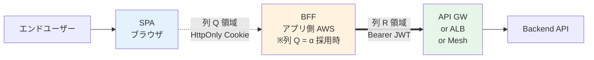
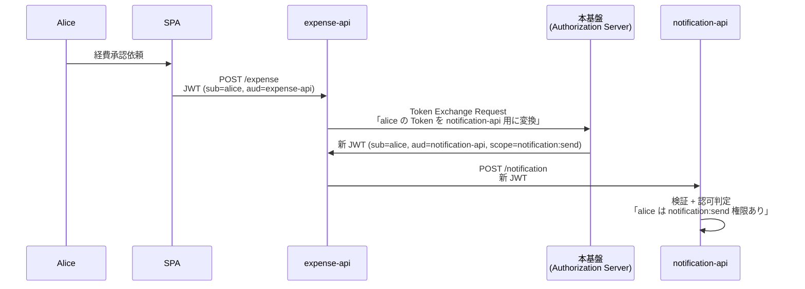
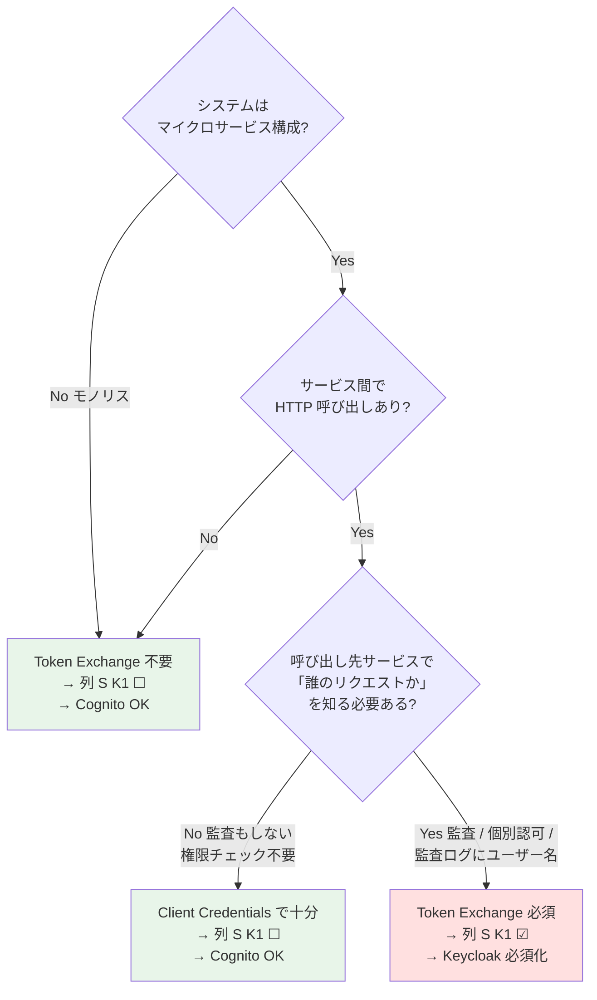

# B-1: 認証フロー / Grant Type + アプリ・システム構成（マスター表 C）

> 元データ: [../hearing-checklist.md](../hearing-checklist.md)
> 対象: 開発チーム / テックリード
> 関連: [proposal §FR-1.1](../proposal/fr/01-auth.md)
>
> **新 §X.Y 構造との対応**（[hearing-checklist.md §0〜§5](../hearing-checklist.md) で subject-matter 軸の一覧確認可）:
> - **§3.3 マスター表 C: 御社アプリ・システム構成リスト**: B-100（本ファイルの核心）— **BFF（列 Q）/ Token Exchange リレー（列 S K1）/ Device Code（列 P=e+列 S K2）/ mTLS（列 S K3）/ DPoP（列 S K4）/ SAML 発行（列 P=g+列 S K5）/ UMA（列 S K6）/ Back-Channel Logout（列 S K7）/ Access Token Revocation（列 S K8）/ 既存ローカル認証（列 T）** すべて統合済
> - **§4.1 認証フロー詳細**: マスター表 C 補足 1〜5（BFF / JWT 検証場所 / Knockout 条件 K1〜K8 / 業界トレンド / FAQ）
>
> hearing-script/ は **会議組み立て用に旧 Phase 軸**でファイル分割、hearing-checklist.md は **読み物として subject-matter 軸**で集約。両軸を併用。

---

## はじめに — 本セクションの進め方

旧 B-101（SPA）/ B-102（SSR）/ B-102-2（Backend API 経路）/ B-103（M2M）/ B-104（Token Exchange）/ B-105（Device Code）/ B-106（mTLS）/ B-107（モバイル）/ B-108（BFF vs PKCE）/ B-109（DPoP）と、他章の B-202（SAML IdP 発行）/ B-303（UMA 細粒度認可）/ B-504（Back-Channel Logout）/ B-704（Access Token Revocation）/ C-204-5（既存ローカル認証）を **マスター表 C に統合**しました。これにより:

- 「どのシステムが」「どんなクライアント種別で」「どこで JWT を検証し」「どんな特殊要件があるか」を **システム単位で 1 行ずつ**確認
- 列 S（特殊要件フラグ）で **Cognito Knockout 条件**が 1 表で可視化される
- B-200 マスター表 B（事業者・顧客 IdP 統合表）と並列構造で、**「IdP × アプリ」のマトリクスが本表 + 表 B で完結**

**本ページの構成**:
1. **マスター表 C 本体**（記入テンプレート + 列 P/Q/R/S/T の選択肢）— 顧客が記入する部分
2. **マスター表 C の補足**（補足 1〜5）— 用語解説・技術的根拠・FAQ。記入時の参考情報

事前に **マスター表 C の選択肢と用語**を読み合わせていただき、その後一括記入いただけますと最も効率的です。

---

## マスター表 C: 御社アプリ・システム構成リスト（🔥）

> **問いの位置づけ**: 御社の各アプリ・システムを 1 行ずつ把握し、本基盤がカバーすべき認証フロー・JWT 検証実装・特殊要件・移行範囲を確定する。**Cognito vs Keycloak 選定の決定打**（マスター表 B と並ぶ 2 大判定表）。
> **回答で決まること**: ①列 P クライアント種別ごとの認証フロー設計 / ②列 Q SPA 認証方式（BFF vs PKCE）/ ③列 R Backend API 経路と JWT 検証実装場所（Lambda Authorizer / アプリ側 / Sidecar）/ ④**列 S K1〜K8 が 1 件でも☑あれば Keycloak 必須化確定** / ⑤列 T 既存ローカル認証の移行戦略。

#### なぜこれを今聞くのか

**「どのアプリが何の認証フローを使うか」「特殊要件があるか」**を一括把握しないと、プラットフォーム選定（Cognito vs Keycloak）が確定できません。アプリ単位で特殊要件（Token Exchange / mTLS / DPoP 等）が**1 つでも該当すれば Keycloak 必須化**となり、コスト試算・運用設計が大きく変わります。

後から「実は SAML SP のみの既存業務系があった」「マイクロサービス間の OBO が要件」となると、**プラットフォーム選定のやり直し** + **既存設計の手戻り**になります。**初期の表 1 つで全体像を捕捉**することが圧倒的に低コストです。

#### 比較イメージ（表 C 列 S K1〜K8 の有無による帰結）

| 列 S の状態 | プラットフォーム選定への帰結 |
|---|---|
| **K1〜K8 すべて☐** | Cognito 候補に残る（コスト試算は C-301 24/7 / C-201 FIPS との合せ技）|
| **K1〜K8 のいずれか 1 件でも☑** | **Keycloak 必須化確定**（[Knockout 条件一覧](../../reference/cognito-knockout-conditions.md)）|
| 列 P に **e CLI/IoT** が含まれる | 列 S K2 暗黙☑ → Keycloak または Cognito 自前実装 |
| 列 P に **g SAML SP のみ** が含まれる | 列 S K5 暗黙☑ → Keycloak 必須化 |

→ **表の縦読み 1 回で Cognito vs Keycloak が判明する**設計。アプリの数だけ行を追加して記入してください。

### 記入テンプレート

| # | システム名 | 業務カテゴリ | クライアント種別 （列 P）| SPA 認証方式 （列 Q）| Backend API 経路 / JWT 検証場所 （列 R）| 特殊要件フラグ （列 S、☑ 複数可）| 既存ローカル認証 （列 T）| 補足・特殊要件 （自由記入）|
|:-:|---|---|---|---|---|---|:-:|---|
| 1 | _経費精算SaaS_（例）| 経理 | _a_ SPA | _α_ BFF | _①_ API GW + LA | （なし）| _N_ | |
| 2 | _決済管理_（例）| 決済 | _b_ SSR | — | _①_ API GW + LA | ☑ _K1_ ☑ _K3_ ☑ _K4_ | _N_ | FAPI 2.0 準拠 |
| 3 | _営業 iPad_（例）| 営業 | _c_ モバイル | — | _①_ API GW + LA | （なし）| _N_ | |
| 4 | _夜間集計バッチ_（例）| 内部 | _d_ M2M バッチ | — | _②_ ALB + ECS | （なし）| _N_ | 同時実行 5、日次 |
| 5 | _レガシー業務系_（例）| 内部 | _g_ SAML SP のみ | — | _④_ サーバー内完結 | ☑ _K5_ | _M1_ 段階移行 | 改修不可、Salesforce Classic 系 |
| 6 | _開発者 CLI_（例）| 内部 | _e_ CLI/IoT | — | _①_ API GW + LA | ☑ _K2_ | _N_ | 社内 30 名利用 |
| 7 | _顧客マイクロサービス群_（例）| 顧客向け | _f_ Backend API のみ | — | _③_ Service Mesh | ☑ _K1_ ☑ _K6_ | _N_ | サービス間 OBO + リソース所有者ベース |
| 8 | （以下、システムの数だけ追記）| | | | | | | |

> **記入ヒント**:
> - **同じシステム名でも「SPA フロント」と「夜間バッチ」のように別のクライアント種別を持つ場合は別行で記入**（列 Q/R/S が異なるため）。例: `経費精算SaaS (SPA)` / `経費精算SaaS (バッチ)`
> - 列 P / Q / R / T はそれぞれ **1 つだけ**選択。列 S のみ複数選択可（☑）
> - 列 Q（SPA 認証方式）は **列 P = a のみ記入**、それ以外は「—」
> - 不明な項目は「**❓ 不明**」と記入（後日キャッチアップ）
> - 用語や選択肢で迷ったら → **[マスター表 C の補足](#マスター表-c-の補足)** を参照

---

### 列 P: クライアント種別 選択肢（旧 B-101 / B-102 / B-103 / B-105 / B-107）

| コード | 種別 | 該当例 | 主な認証フロー |
|:---:|---|---|---|
| **a** | **SPA**（Single Page Application）| React / Vue / Angular / Svelte 等 | Authorization Code + PKCE（列 Q で BFF or 直接を選択）|
| **b** | **SSR**（Server-Side Rendering Web）| Next.js / Nuxt / Spring MVC / Django / Rails 等 | Authorization Code + client_secret（Confidential Client）|
| **c** | **ネイティブモバイル** | iOS / Android アプリ | Authorization Code + PKCE + Custom URL Scheme |
| **d** | **M2M バッチ**（サーバー間連携・定期実行）| 夜間集計 / API 連携 / システム間通知 | Client Credentials Grant |
| **e** | **CLI / IoT / Smart TV / AI Agent** | 開発者 CLI / IoT デバイス / ChatGPT 等 AI Agent | **Device Authorization Grant（RFC 8628）** ※列 S K2 が暗黙的に☑相当 |
| **f** | **Backend API のみ**（フロント無し）| 他システムから呼ばれるマイクロサービス | クライアントは別行に分離、本行は JWT 検証側として記入 |
| **g** | **SAML SP のみ**（レガシー、本基盤が SAML を発行する側）| Salesforce Classic / 旧 ServiceNow / オンプレ業務系 | SAML 2.0 IdP モード ※列 S K5 が暗黙的に☑相当 |

---

### 列 Q: SPA 認証方式 選択肢（列 P = a の時のみ、旧 B-108）

| コード | 方式 | 解説 |
|:---:|---|---|
| **α** | **BFF**（Backend-for-Frontend）| トークンをサーバー側で保持、SPA は HttpOnly Cookie のみ。**業界推奨**（[補足 3 業界トレンド](#補足-3-業界トレンド参考情報)）|
| **β** | **PKCE 直接** | SPA がトークンを直接保持（従来方式、XSS リスクあり）|
| **γ** | **段階移行** | 既存は PKCE、新規は BFF |
| **—** | 該当なし | 列 P ≠ a の場合 |

> 列 Q と列 R の領域分離 → **[補足 1](#補足-1-bff--ssr--モバイル-と-jwt-検証場所の関係)** を参照。

---

### 列 R: Backend API 経路 / JWT 検証場所 選択肢（旧 B-102-2）

| コード | 経路 | JWT 検証場所 | 採用シーン |
|:---:|---|---|---|
| **①** | **AWS API Gateway 経由**（**本基盤 PoC 標準・推奨**）| **Lambda Authorizer** | Serverless 構成、本基盤のマルチイシュア要件（Cognito + Keycloak 並列受理）が必要な場合は**事実上必須** |
| **②** | **ALB + ECS / EC2 直結**（API Gateway なし）| **アプリ側ライブラリ**（Spring Security / Passport.js / python-jose 等）| モノリス的アーキテクチャ、API Gateway 利用コストを避けたい |
| **③** | **Service Mesh**（EKS / ECS + Envoy / Istio Sidecar）| **Sidecar（Envoy 等）**、AuthorizationPolicy で認可 | マイクロサービス内部通信、mTLS と組み合わせ |
| **④** | **サーバー内完結型**（SSR / 集約型 BFF が内部 API + DB を直接呼ぶ、Backend API 独立せず）| **SSR / BFF サーバー内** | 古典的 Web アプリ、Cookie + Session Store ベース、または BFF が業務ロジックを内包 |
| **⑤** | **Cognito Authorizer**（API Gateway 標準機能、Lambda 不使用）| **Cognito Authorizer**（単一 Pool シンプル検証のみ）| マルチイシュア不要、カスタム認可ロジック不要の場合 |

> 本列が問うているセグメント、BFF との関係、用語（Lambda Authorizer 等）は → **[補足 1](#補足-1-bff--ssr--モバイル-と-jwt-検証場所の関係)** を参照。

---

### 列 S: 特殊要件フラグ 選択肢（複数選択可、**1 つでも☑で Cognito Knockout 条件確定**）

| コード | 特殊要件 | 一行該当判定 | Knockout 影響 |
|:---:|---|---|---|
| **K1** | Token Exchange（RFC 8693）| **業務シナリオ 7 軸**で判定（マイクロサービス構成 / A→B 内部呼出 / ログでユーザー追跡 / 個別権限 / scope 縮小 / OBO / コンプラ）→ [補足 2 K1](#k1-token-exchangerfc-8693--cognito-非対応) 詳細 | **Keycloak 必須** |
| **K2** | Device Code Flow（RFC 8628）| CLI / IoT / Smart TV / AI Agent | Cognito 自前 or Keycloak 必須（列 P=e で自動）|
| **K3** | mTLS Client Authentication（RFC 8705）| FAPI 準拠 / 高セキュリティ M2M | **Keycloak 必須** |
| **K4** | DPoP（RFC 9449、Sender-Constrained Tokens）| FAPI 2.0 / トークン盗難対策 | **Keycloak 必須** |
| **K5** | SAML IdP 発行（本基盤 → 既存アプリ）| 既存 SAML SP アプリ（Salesforce Classic 等）に SAML 出力 | **Keycloak 必須**（列 P=g で自動）|
| **K6** | UMA 2.0 細粒度認可 | リソース所有者ベース認可 | Keycloak Authorization Services または外部 PDP |
| **K7** | Back-Channel Logout（RFC 8417）| 全 RP 連動ログアウト | **Keycloak 必須** |
| **K8** | Access Token 即時 Revocation | 規制要件で短 TTL（15 分）では侵害ウィンドウ許容不可 → [補足 2 K8](#k8-access-token-即時-revocation--両プラットフォームで個別-revoke-不可) で TTL 設計トレードオフ・実装/運用コスト比較 | Cognito 自前 or Keycloak Introspection |

> K1〜K8 それぞれの **「なぜ Cognito で詰むのか」「該当判定の詳細」「実装代替案」** は → **[補足 2](#補足-2-cognito-knockout-条件-k1k8-の技術的根拠)** を参照。

---

### 列 T: 既存ローカル認証 + 移行方針 選択肢（旧 C-204-5）

> **本基盤は A 案: 共通基盤集約**が前提（[§FR-1.2.0](../proposal/fr/01-auth.md)）。C 案ハイブリッド（一部アプリのみ独自認証維持）は移行期限定で許容。

| コード | 状態 | 移行方針 |
|:---:|---|---|
| **N** | なし（新規 or 既に共通基盤前提）| 該当なし |
| **M1** | あり / **段階移行** | リリース時にすべて共通基盤集約、段階的にカットオーバー |
| **M2** | あり / **並行稼働** | 一定期間、独自認証 + 共通基盤の両方を併用 |
| **M3** | あり / **即時切替** | カットオーバー（リスク高、十分なテスト必須）|
| **M4** | あり / **維持**（C 案ハイブリッド）| 当該アプリは独自認証を維持（移行期限定で許容）|

---

## マスター表 C の補足

ここから先は **記入参考情報**です。表 C 本体の理解を深めるため、用語解説・技術的根拠・判定ルール・FAQ を集約しています。

### 補足 1: BFF / SSR / モバイル と JWT 検証場所の関係

> **このセクションが解消する誤解**:
> - 「列 Q（SPA 認証方式）と列 R（Backend API 経路）はどう違う?」
> - 「BFF を採用したら Lambda Authorizer は要らないのでは?」
> - 「SSR とモバイルで列 R の見方は変わる?」

#### 列 Q と列 R が問うているセグメント

- **列 Q が問う領域**: ブラウザ ↔ サーバーの **Cookie セッション区間**（XSS 耐性の軸）
- **列 R が問う領域**: サーバー ↔ Backend API の **Bearer JWT 区間**（JWT 検証実装の軸）

→ **両者は別レイヤー**で、SPA 採用顧客では両方を回答する必要があります。

#### クライアント種別ごとの列 R の見方

| クライアント種別（列 P）| 列 R が指すセグメント | JWT を誰が Bearer に載せるか |
|---|---|---|
| **a SPA + α BFF**（列 Q = α）| BFF → Backend API | **BFF** がトークンを保持・送信 |
| **a SPA + β PKCE 直接** | SPA → Backend API | **SPA（ブラウザ）** がトークンを保持・送信（XSS リスクあり）|
| **b SSR** | SSR サーバー → Backend API | **SSR サーバー** がトークンを保持・送信 |
| **c モバイル** | モバイル端末 → Backend API | **モバイルアプリ** がトークンを保持・送信 |
| **d M2M バッチ** | バッチサーバー → Backend API | **バッチプロセス** がトークンを保持・送信 |
| **e CLI/IoT** | CLI / IoT デバイス → Backend API | **デバイス自身** がトークンを保持・送信 |
| **f Backend API のみ** | 他システム → 本 Backend API | 本行は **JWT 検証側**として記入（クライアントは別行）|

#### 「BFF があれば Lambda Authorizer は要らない」は誤解

| 役割 | BFF（列 Q = α）| Lambda Authorizer（列 R = ①）|
|---|---|---|
| **配置** | アプリ側 AWS アカウント | 本基盤 or 中継 AWS アカウント |
| **目的** | ブラウザ層の XSS 対策（トークンを HttpOnly Cookie 化）| API 層の認可（Bearer JWT を検証） |
| **検証する対象** | Cookie セッション（自前管理）| Bearer JWT 署名 + クレーム + マルチイシュア対応 |
| **どちらが必要か** | XSS 耐性が必要なら BFF | API 公開なら Lambda Authorizer |

→ **BFF 採用時も Backend API 側に Lambda Authorizer（①）を併設するのが標準構成**です。両者は補完関係で代替関係ではありません。

詳細は [proposal §FR-1.1 B 補足-2「BFF の AWS アカウント配置と Lambda Authorizer との違い」](../proposal/fr/01-auth.md) を参照。

#### 用語ミニ辞典

| 用語 | 意味 |
|---|---|
| **Lambda Authorizer** | AWS API Gateway の前段に Lambda を挟み、Bearer JWT 署名 + クレームを検証する仕組み。マルチイシュア（Cognito + Keycloak 並列）対応の標準解 |
| **Cognito Authorizer** | API Gateway の標準機能で、単一 Cognito User Pool の JWT のみ検証可能。Lambda 不要だがマルチイシュア非対応 |
| **Service Mesh / Sidecar** | EKS/ECS Pod の隣に Envoy/Istio コンテナを起動し、JWT 検証 + AuthorizationPolicy で認可を集約する方式 |
| **Bearer JWT** | HTTP Authorization ヘッダーに `Bearer <JWT>` 形式で添付するトークン伝送方式（OAuth 2.0 標準）|

---

### 補足 2: Cognito Knockout 条件 K1〜K8 の技術的根拠

> **このセクションが答える問い**: 「**なぜ列 S K1〜K8 のどれか 1 つでも☑があると Keycloak 必須化が確定するのか?**」

各 K コードの背景・該当判定・実装代替案を整理します。詳細な根拠は [Cognito Knockout 条件一覧](../../reference/cognito-knockout-conditions.md) を参照。

#### K1: Token Exchange（RFC 8693） 🚫 Cognito 非対応

> **問いの位置づけ**: マイクロサービス間でエンドユーザー文脈を保持するか — 本基盤が「**正しい Token を正しい宛先に発行する**」責務（[§FR-6.0.B](../proposal/fr/06-authz.md)）を果たせるか。
> **回答で決まること**: ①Token Exchange ネイティブ対応の要否 / ②Cognito Knockout 条件 K1 の判定 / ③アプリ側認可の妥協（aud 緩和 / ユーザー文脈喪失 / Service Account への退化）を回避できるか。

##### なぜこれを今聞くのか

Token Exchange なしだと、アプリ側で以下のいずれかの**妥協**を強いられます:

| 代替策 | 問題 | アプリ側認可への影響 |
|---|---|---|
| **Token をパススルー** | `notification-api` が `aud=expense-api` の Token を受ける（本来拒否すべき）| **`aud` チェックを甘くする必要** = アプリ側認可ルーズ化 |
| **Client Credentials** | `sub=expense-api-service` に変わる、ユーザー文脈消失 | **「誰のリクエストか」が消える** = 監査不能、ユーザー単位認可不能 |
| **アクセス禁止** | サービス間連携不能 | 業務成立せず |

→ Token Exchange があれば、アプリは「**自分宛の正しい Token**」を受け取って**純粋に業務認可判定だけに集中**できる。**「認可はアプリ側」スタンス**（[§FR-6.0.A](../proposal/fr/06-authz.md)）を取るからこそ、本基盤側の Token Exchange サポートが**アプリ側認可をルーズ化させない前提**となります。

##### 典型シナリオ（マイクロサービス OBO）

##### 該当判定の業務シナリオ 7 軸

該当アプリで列 S K1 を☑する判定基準。**1 つでも当てはまれば K1 ☑**：

| # | 業務シナリオ | 該当例 |
|---|---|---|
| ① | マイクロサービス構成を採用している | サービス分割済 / 分割計画あり |
| ② | サービス A → B 内部呼び出しがある | 経費 → 通知 / 注文 → 在庫 / 等の内部 HTTP 連携 |
| ③ | B 側のログでエンドユーザー追跡が必須 | コンプラ要件（個人情報アクセス追跡 / 監査）|
| ④ | サービス別に異なる権限チェックが必要 | 経費 API は閲覧可、決済 API は管理者のみ 等 |
| ⑤ | scope 縮小（最小権限の段階的適用）が必要 | フロント Token は全 scope、内部呼出は最小 scope |
| ⑥ | 外部システムへの代理操作（OBO: On-Behalf-Of）| ユーザー文脈で外部 SaaS API を叩く |
| ⑦ | コンプライアンス要件（個人情報アクセスの追跡 等）| 金融 / 医療 / GDPR 対応 |

##### 判定フローチャート

##### Cognito で詰む理由

Cognito は **RFC 8693 ネイティブ非対応**。回避策は上述の代替策（パススルー / Client Credentials / アクセス禁止）のみで、いずれも**アプリ側認可をルーズ化**させる。

##### 該当時の選択肢

- **Keycloak 必須化**（[K-01](../../reference/cognito-knockout-conditions.md)）— 標準サポート、Token Exchange Endpoint 提供
- 詳細判定フロー: [§FR-6.3.4](../proposal/fr/06-authz.md)
- 関連: 旧 B-104 / B-304 業務シナリオ質問は本セクションに統合済

#### K2: Device Code Flow（RFC 8628） ⚠ Cognito 非対応（自前実装可）

**該当判定**: キーボード入力制約デバイス（CLI / IoT / Smart TV / AI Agent）が認証する必要がある。列 P = e なら自動該当。

**Cognito で詰む理由**: Cognito Hosted UI に Device Code Endpoint が存在しない。

**代替案**: Cognito では **Lambda + DynamoDB 自前実装**（user_code / device_code 発行 + ポーリング処理）が必要。Keycloak なら標準サポート。

#### K3: mTLS Client Authentication（RFC 8705） 🚫 Cognito 非対応

**該当判定**: FAPI（Financial-grade API）準拠 / 高セキュリティ M2M で証明書ベース相互認証が必要。

**Cognito で詰む理由**: Cognito は FAPI 不適合、mTLS Client Authentication 標準非対応。

**代替案**: **Keycloak（OSS or RHBK）必須**。金融・決済系で頻出。

#### K4: DPoP（RFC 9449、Sender-Constrained Tokens） 🚫 Cognito 標準非対応

**該当判定**: mTLS の代替として DPoP を採用したい。FAPI 2.0 準拠 / Open Banking / トークン盗難対策。

**Cognito で詰む理由**: DPoP 標準非対応。

**代替案**: **Keycloak 必須**。mTLS（K3）と比較して証明書管理不要で実装容易、FAPI 2.0 で採用増加中。

#### K5: SAML IdP 発行（本基盤 → 既存アプリ） 🚫 Cognito 非対応

**該当判定**: 既存の SAML SP アプリ（Salesforce Classic / 旧 ServiceNow / レガシー業務系等）に対し、本基盤が SAML を発行する必要がある。列 P = g なら自動該当。

**Cognito で詰む理由**: Cognito は SAML SP（受信側）のみ対応、IdP（発行側）として動作不可。

**代替案**: **Keycloak 必須**（[K-11](../../reference/cognito-knockout-conditions.md)）。なお SAML SP として受信するのみであれば Cognito でも可能（マスター表 B 列 Y β）。

#### K6: UMA 2.0 細粒度認可 🚫 Cognito ネイティブ非対応

**該当判定**: リソース所有者ベース認可（「ドキュメント X を user A だけ閲覧可、user B は編集可」等）。

**Cognito で詰む理由**: Cognito にはリソースレベル認可機能なし。

**代替案**: **Keycloak Authorization Services 必須**、または外部 PDP（Amazon Verified Permissions + Cedar / OPA / OpenFGA）採用。

#### K7: Back-Channel Logout（RFC 8417） 🚫 Cognito 非対応

**該当判定**: 1 つのアプリでログアウトしたら、同 IdP の全 RP（クライアント）に確実に伝播させたい。

**Cognito で詰む理由**: Back-Channel Logout 標準非対応。

**代替案**: **Keycloak 必須**。Front-Channel Logout（ブラウザ依存）で代替する場合は信頼性低下を許容する必要がある。

#### K8: Access Token 即時 Revocation ⚠ 両プラットフォームで個別 revoke 不可

> **問いの位置づけ**: 退職・侵害発覚時に、配布済 Access Token を**即時無効化**する必要があるか — 「TTL 短縮で吸収」と「Revocation で対処」の設計方針を確定する。
> **回答で決まること**: ①Token Revocation 実装方式の確定（Cognito 自前 `origin_jti` or Keycloak Introspection）/ ②Access Token TTL の設計値（短 TTL 5-15 分 or 長 TTL 60 分 + Revocation）/ ③退職反映 SLA（[B-605-3](../hearing-checklist.md)）との連動。

##### なぜこれを今聞くのか

**退職・侵害時のアクセス遮断** には 2 つのアプローチがあり、設計時に **どちらで対処するか**を確定する必要があります。両者はコストとリスクの異なるトレードオフです。

| アプローチ | 仕組み | メリット | デメリット |
|---|---|---|---|
| **A. 短 TTL で吸収**（Revocation なし）| Access Token TTL を 5〜15 分に短縮 | 実装シンプル、両プラットフォーム標準サポート | Refresh 頻度増 → API ロード増 / UX 悪化 / **Cognito M2M 150 RPS Hard Limit 抵触リスク** |
| **B. 長 TTL + Revocation**（K8 ☑）| Access Token TTL は 60 分、退職時に即時 revoke | UX 良好、API ロード低い | **実装コスト**（Cognito は `origin_jti` 自前 / Keycloak は Introspection 全 API 呼出時に問合せ）|

→ **規制要件で「即時遮断必須」と明文化されている場合は B 一択**（短 TTL でも 15 分のラグは許容できない）。**通常業務系で 15 分以内なら許容**なら A で十分。

##### 該当判定

該当アプリで列 S K8 を☑する判定基準：

| 判定 | 該当ケース |
|---|---|
| **☑ K8 必要** | 規制要件で「退職処理後 N 秒以内に全 API アクセス遮断」が SLA で要求されている（金融 / 医療 / 機微個人情報）/ 短 TTL 15 分でも侵害ウィンドウを許容できない |
| ☐ K8 不要 | 短 TTL（5〜15 分）で吸収可能 / 退職反映 SLA が 15 分以上で OK / Refresh Token revoke による間接無効化で間に合う |

##### 両プラットフォームの制約

**両者とも Access Token の個別 revoke は不可**。Refresh Token revoke による間接無効化のみが標準仕様（[RFC 7009](https://datatracker.ietf.org/doc/html/rfc7009)）。即時無効化を実現するには以下のいずれかが必要：

| プラットフォーム | 実装方式 | 実装コスト | 運用コスト |
|---|---|---|---|
| **Cognito** | `origin_jti` クレームを Lambda Pre Token で発行 + 失効リスト DynamoDB + Lambda Authorizer で都度チェック | 高（自前実装）| 中（DynamoDB 読込 + Lambda 実行）|
| **Keycloak** | Token Introspection（`/introspect`）標準提供、全 API 呼出時に Keycloak に問合せ | 低（標準機能）| 高（**全 API 呼出 → Keycloak 問合せ**、SLA / レイテンシ影響大）|

##### 関連質問との連動

- **[C-206 トークン TTL](10-security-compliance.md)**: K8 ☑なら長 TTL（60 分）+ Revocation 設計、K8 ☐なら短 TTL（5-15 分）で吸収
- **[B-605-3 退職反映 SLA](../hearing-checklist.md)**: SLA 要件次第で K8 ☑ / ☐ が決まる
- **[B-401 SCIM 採否](04-user-management.md)**: SCIM 採用 + K8 ☑ の組み合わせが「即時遮断の現実解」

##### 該当時の選択肢

- **Cognito 採用時**: `origin_jti` クレーム + DynamoDB 失効リスト + Lambda Authorizer 都度チェック の自前実装
- **Keycloak 採用時**: Token Introspection 標準提供、ただし全 API 呼出時に Keycloak 問合せが発生するため **パフォーマンス影響を要評価**
- 関連: 旧 B-704 / C-207 は本セクションに統合済

---

### 補足 3: 業界トレンド（参考情報）

#### BFF（列 Q = α）の業界推奨化

- **IETF / Curity / Duende が 2025 年から BFF を gold standard として推奨**
- 背景: ブラウザ層への JWT 露出は XSS の影響度が大きく、HttpOnly Cookie + サーバー側保持が安全
- 採用例: Auth0 BFF、Curity BFF、Duende BFF 等の商用 BFF ライブラリが増加

#### FAPI 2.0（列 S K3 mTLS / K4 DPoP）

- 金融業界（Open Banking）で 2025〜2026 に本格採用
- mTLS（K3）+ PAR（Pushed Authorization Requests）+ DPoP（K4）が標準セット
- 国内: 全国銀行協会（全銀協）、金融庁ガイドラインで言及増加

#### Device Code Flow（列 P = e / 列 S K2）— AI Agent 時代の標準

- ChatGPT / Claude 等の AI Agent が外部 API にアクセスする際の標準フロー
- IoT・Smart TV から拡大して **AI Agent 認証のデファクト**に
- 業界調査では 2026 年時点で 60% 以上のエンタープライズが Device Code 採用 or 検討中

#### SCIM 2.0（マスター表 B 列 W）

- エンタープライズ B2B のデファクト（退職者 deprovisioning 必須）
- 2026 年時点で **Entra ID Free 以外**の主要 IDaaS は全て SCIM 標準対応

---

### 補足 4: 表 C から自動的に確定する事項（判定ルール）

| 表 C の状態 | 帰結 |
|---|---|
| 列 S に **K1〜K8 のいずれか 1 件**でも☑ | **Keycloak 必須化**（[Knockout 条件](../../reference/cognito-knockout-conditions.md)）|
| 列 P に **d M2M** が多数（同時実行が高頻度）| Cognito M2M トークン **150 RPS Hard Limit** 評価が必要 |
| 列 P に **e CLI/IoT** が含まれる | 列 S K2 が暗黙的に☑、Keycloak または Cognito 自前実装が必要 |
| 列 P に **g SAML SP のみ** が含まれる | 列 S K5 が暗黙的に☑、Keycloak 必須化 |
| 列 R に **⑤ Cognito Authorizer** のみ | マルチイシュア要件（本基盤標準）なら **① API GW + Lambda Authorizer に切替推奨** |
| 列 Q に **β PKCE 直接** が含まれる | XSS リスク評価、段階的に α BFF への移行を提案（補足 3 業界トレンド参照）|
| 列 T に **M2 / M3 / M4** が含まれる | [§FR-1.2.0](../proposal/fr/01-auth.md) の移行戦略策定が必要、C 案ハイブリッド許容範囲の合意 |

---

### 補足 5: よくある質問（FAQ）

**Q1. 同じ「経費精算 SaaS」が SPA + 夜間バッチを持つ場合、1 行か 2 行か?**
A. **2 行推奨**。列 P（クライアント種別）が異なるため、別行のほうが列 Q/R/S が綺麗に埋まります。システム名は `経費精算SaaS (SPA)` / `経費精算SaaS (バッチ)` のように suffix を付けて区別してください。

**Q2. モバイルアプリ（列 P = c）+ Backend API の場合、列 R は何を書く?**
A. モバイルから直接呼ぶ Backend API の検証場所を書きます。典型的には **① API GW + Lambda Authorizer**。モバイルアプリが Bearer JWT を Authorization ヘッダーに載せて API GW に投げ、Lambda Authorizer が検証する構成です。

**Q3. マイクロサービス間呼び出しはどう書く?**
A. 呼ぶ側（クライアント）と呼ばれる側（Backend API）を **別行**で記入します:
- 呼ぶ側: 列 P = d（M2M バッチ）or 該当アプリ
- 呼ばれる側: 列 P = f（Backend API のみ）+ 列 R = ① or ③（Service Mesh が一般的）

ユーザー文脈を伝播する場合は呼ぶ側で列 S K1（Token Exchange）を☑。

**Q4. 列 P を複数選びたい（例: SPA + バッチ）。1 行で書ける?**
A. **書けません**。列 Q（SPA 認証方式）が SPA 行のみ意味を持つため、別行で記入してください（Q1 参照）。

**Q5. 「Backend API のみ（列 P = f）」と「他のクライアント種別」の違いは?**
A. 列 P = f は **クライアントを持たない（フロントエンドなし）** アプリです。他システムから呼ばれる API のみ提供するマイクロサービスが該当。クライアント種別 a〜e は **自身がエンドユーザー向け or バッチクライアントである**アプリです。

**Q6. Custom Domain（旧 B-208）は表 C のどこで聞く?**
A. **聞きません**。Custom Domain は基盤全体の設定（顧客企業全体で共通 1 つ）であり、アプリ単位ではないため、[02-idp-federation.md B-208](02-idp-federation.md) で独立質問として残しています。

**Q7. 1 つの SPA が複数の Backend API を呼ぶ場合（マイクロサービス構成）、列 R はどう書く?**
A. **代表的な経路**を 1 つ選びます。経路がアプリ内で混在する場合は補足列に「主は ①、内部マイクロサービス間は ③」のように記入してください。基本的に列 R は「**そのアプリの主要 Backend API 経路**」を指します。

**Q8. 「列 S K8 Access Token Revocation」を☑するかどうかの判断基準は?**
A. 規制要件（金融・医療等）で「退職後 N 分以内に全 API アクセスを遮断する必要がある」と SLA で要求されている場合は☑。それ以外は短 TTL（15 分）で吸収可能なので☐で OK。SCIM 採用（B-401）と組み合わせて判断してください。

---

> 関連: 顧客 IdP 構成は [02-idp-federation.md マスター表 B](02-idp-federation.md#マスター表-b-顧客企業の-idp-構成リスト旧-a-6--b-201b-207-統合) で確認。本表 C と表 B を組み合わせることで「**顧客 IdP × アプリ**」のマトリクスが完結します。
