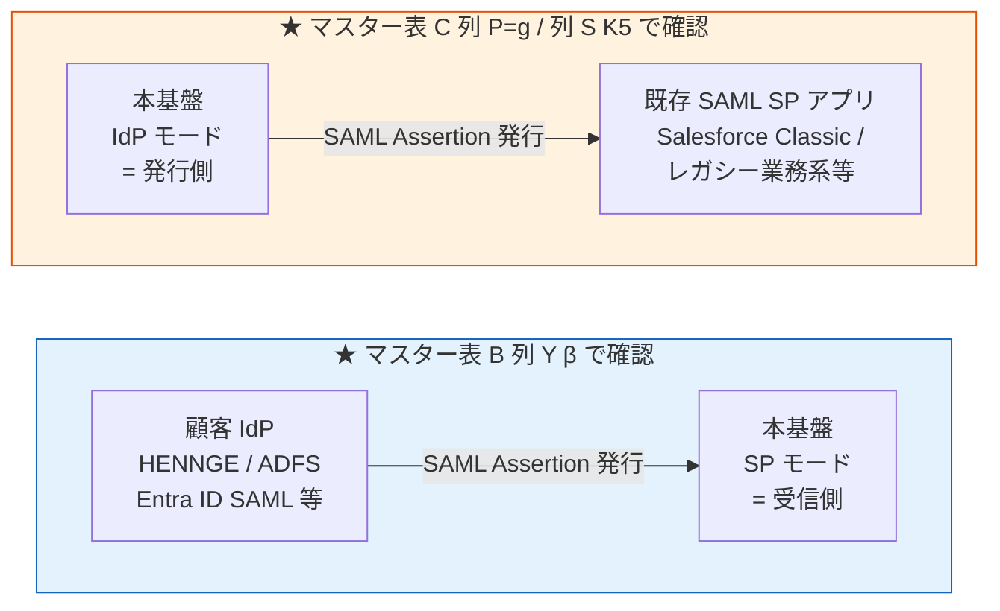
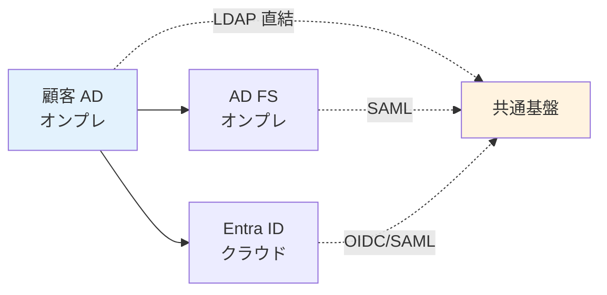
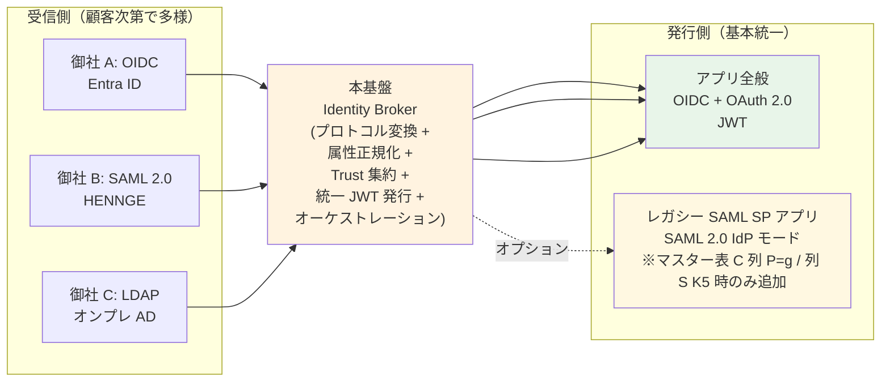

# B-2: IdP 接続種別

> 元データ: [../hearing-checklist.md](../hearing-checklist.md)
> 対象: 開発チーム / テックリード / 情シス / 営業
> 関連: [proposal §FR-2.1](../proposal/fr/02-federation.md), [§FR-1.2.0.0 利用者カテゴリ](../proposal/fr/01-auth.md#fr-1200-ローカルユーザーとは何か--利用者カテゴリ別の分析)
>
> **新 §X.Y 構造との対応**（[hearing-checklist.md §0〜§5](../hearing-checklist.md) で subject-matter 軸の一覧確認可）:
> - **§3.1 マスター表 A: 弊社内 IdP**: B-200（本ファイルのマスター表 A）
> - **§3.2 マスター表 B: 顧客 IdP**: B-200-B（本ファイルのマスター表 B）+ B-609（IdP 情報受領形式）
> - **§3.5 ブランディング詳細**: B-208（Custom Domain、基盤全体ポリシーとして残置）
> - 旧 B-202（SAML IdP 発行）は **§3.3 マスター表 C 列 P=g / 列 S K5** に統合済（本ファイル末尾の B-202 項は用語整理として残置）
>
> hearing-script/ は **会議組み立て用に旧 Phase 軸**でファイル分割、hearing-checklist.md は **読み物として subject-matter 軸**で集約。両軸を併用。

---

## はじめに — 本セクションの進め方

IdP 関連は質問が多岐にわたるため、**「マスター表に一括記入していただく」** 形式に統合しました。これにより:

- 旧 B-201（Entra ID）/ B-203（LDAP）/ B-204（Okta）/ B-205（Google）/ B-206（SAML SP）/ B-207（独自プロトコル）/ A-6（IdP 種別分布）が **マスター表 B に集約**（顧客 IdP 単位、1 行 1 顧客）
- 「どの IdP を使っているか」と「どの接続プロトコルで繋ぐか」を顧客企業単位で 1 行ずつ確認
- 旧 B-202（SAML IdP 発行）は **[マスター表 C](01-auth-flow.md#マスター表-c-御社アプリシステム構成リスト) 列 P=g（SAML SP のみ）/ 列 S K5** に統合（アプリ単位）
- 旧 B-208（Custom Domain）は **基盤全体ポリシー**のため独立質問として残します

事前に **マスター表の選択肢と用語**を読み合わせていただき、その後一括記入いただけますと最も効率的です。

---

## 本基盤の SAML における 2 つの方向（混同しやすいので最初に整理）

SAML は **「本基盤から見た方向」で SP モード / IdP モードに完全に分かれる**ため、本セクションでは別質問として扱います:

| 観点 | **SAML SP モード**（マスター表 B 列 Y β） | **SAML IdP モード**（マスター表 C 列 P=g / 列 S K5）|
|---|---|---|
| **本基盤の役割** | **受信側**（SP = Service Provider） | **発行側**（IdP = Identity Provider）|
| **接続先** | 顧客 IdP（HENNGE / ADFS / Entra ID 等） | 既存 SAML SP アプリ（レガシー業務系等）|
| **典型例** | 顧客 HENNGE One から SAML を受け取る | レガシー Salesforce / オンプレ業務系に SAML を出す |
| **本基盤対応** | ✅ Cognito / Keycloak 両方 | ❌ **Cognito 非対応** / ✅ **Keycloak のみ** |
| **Knockout への影響** | なし | **Keycloak 必須化要因 K-11** |
| **想定頻度** | 多い（顧客 IdP の多くが SAML 経由）| 少ない（既存 SAML SP-only アプリがある場合のみ）|

→ **完全に別の質問軸**。一緒にすると Cognito/Keycloak 選定の判断軸が崩れます。
→ マスター表 B 列 Y の β は **SP モードのみ**。IdP モードは **[マスター表 C 列 P=g / 列 S K5](01-auth-flow.md#マスター表-c-御社アプリシステム構成リスト)** で別途確認（旧 B-202 は表 C に統合済、本ページの B-202 項は用語整理として残置）。

---

## 用語説明（事前知識）

### プロトコル種別

| 略称 | 正式名称 | 位置づけ | 本基盤の対応 |
|---|---|---|:---:|
| **OIDC** | OpenID Connect 1.0 | 認証プロトコルの**現代の主流**。OAuth 2.0 の上に構築 | ✅ Cognito / Keycloak 両対応 |
| **SAML 2.0** | Security Assertion Markup Language 2.0 | エンタープライズ / SaaS で広く使用。XML ベース | ✅ Cognito / Keycloak 両対応（受け入れ側） |
| **LDAP** | Lightweight Directory Access Protocol（RFC 4511）| Active Directory 等のディレクトリへの**直接接続**プロトコル | ⚠ **Keycloak のみ対応**（Cognito 不可）|
| **SCIM 2.0** | System for Cross-domain Identity Management（RFC 7644）| **認証ではなくプロビジョニング**用 REST API。ユーザー情報の同期 | ✅ 共通基盤側で実装、顧客 IdP 対応次第 |

### Microsoft 系製品の区別（混同しやすい）

| 製品 | 何か | 設置場所 | 関係 |
|---|---|---|---|
| **Active Directory（AD）** | Microsoft 製ディレクトリサービス DB | **オンプレ** | ベース DB、LDAP/Kerberos で問い合わせ |
| **AD FS**（Active Directory Federation Services）| AD を SAML / OIDC で外部公開する Microsoft 製コンポーネント | **オンプレ**（AD と別サーバー）| AD のフェデブリッジ。Microsoft は廃止傾向 |
| **Entra ID**（旧 Azure AD）| Microsoft のクラウド IDaaS | **クラウド** | AD とは別製品。SAML/OIDC ネイティブ |
| **Entra Connect** | オンプレ AD ↔ Entra ID 同期ツール | **オンプレ**（同期エージェント） | ハイブリッド ID 構成で使う |

→ **AD と Entra ID は別物**（同じ Microsoft 製でも別製品）。「AD があれば Entra ID もある」とは限らず、各顧客で構成が異なる。

### 接続経路 3 パターン（顧客 AD があるとき）

| 経路 | プロトコル | 顧客側追加コンポーネント | 本基盤対応 |
|---|---|---|:---:|
| **AD → AD FS → 基盤** | SAML | AD FS（Windows Server）| ✅ Cognito / Keycloak |
| **AD → Entra Connect → Entra ID → 基盤** | OIDC / SAML | Entra ID テナント | ✅ Cognito / Keycloak |
| **AD → 基盤（直結）** | LDAP | なし | **Keycloak のみ** |

---

## プロトコル組み合わせの全体像（受信側 × 発行側は独立に選べる）

**混同しやすいポイント**: 「OIDC で認証 + OAuth でトークン発行」という表現は、実は **OIDC = OAuth 2.0 + ID Token** で同一系統です。プロトコルは「**受信側（顧客 IdP → 本基盤）**」と「**発行側（本基盤 → 御社の各アプリ）**」の **2 つの独立した軸** で考えます。

### 本基盤 = アイデンティティ仲介 Hub（Identity Broker）

> **注**: Identity Broker は「プロトコル変換」だけでなく、以下 5 つの機能を統合的に担う仲介装置です:
> 1. **プロトコル変換**（SAML → OIDC 等）
> 2. **属性正規化**（IdP ごとに違う `tid` / `org_id` 等を統一 `tenant_id` に）
> 3. **Trust 集約**（御社の各アプリは Broker 1 つだけを信頼）
> 4. **統一 JWT 発行**（受信側が何であれ同じフォーマット）
> 5. **オーケストレーション**（JIT / MFA 重複回避 / SSO セッション / ログアウト伝播）

→ **受信側は顧客次第で多様（OIDC / SAML / LDAP）、発行側は基本的に OIDC + OAuth で統一**。これにより**御社の各アプリは「JWT 検証だけ」で完結**できます。

### 6 パターンの組み合わせマトリクス

| 受信側プロトコル | 発行側プロトコル | 構成名 | 典型ケース | 本基盤対応 |
|---|---|---|---|:---:|
| **OIDC** | **OIDC + OAuth 2.0** | 標準（現代的、推奨）| 新規構築、ほとんどの B2B SaaS | ✅ |
| **SAML 2.0 SP** | **OIDC + OAuth 2.0** | **SAML→JWT フェデブリッジ** | 顧客 IdP が HENNGE / ADFS、アプリは現代的 | ✅ |
| **LDAP** | **OIDC + OAuth 2.0** | AD→JWT 変換 | 顧客が AD 直結、アプリは JWT | ✅ Keycloak のみ |
| OIDC | **SAML 2.0 IdP** | レガシー SAML SP 連携 | 顧客 IdP は OIDC、既存アプリが SAML SP-only | ✅ Keycloak のみ |
| SAML 2.0 SP | **SAML 2.0 IdP** | フル SAML（古典 SSO）| 全体 SAML、稀 | ✅ Keycloak のみ |
| LDAP | **SAML 2.0 IdP** | AD→SAML 出力 | 稀、規制業界の特殊系 | ✅ Keycloak のみ |

### OIDC と OAuth 2.0 の関係（よくある誤解）

| 用語 | 関係 |
|---|---|
| **OAuth 2.0** | **認可フレームワーク**（Token 発行プロトコル、RFC 6749）|
| **OIDC**（OpenID Connect 1.0）| **OAuth 2.0 + ID Token**（認証層を追加）|

→ 「**OIDC で認証 + OAuth で発行**」は技術的に同じ系統（OIDC が OAuth を内包）。**SAML だけが完全に別系統**。

→ **本基盤の発行側は基本 OIDC + OAuth で統一**、**SAML IdP モードはオプション**（B-202 Yes 時のみ追加）。

→ **本基盤は「正しい Token を正しい宛先に発行する」**（**意味 A の認可** = Token 発行制御）を担当。**業務認可判定**（**意味 B の認可** = 「alice は X できるか?」）は各アプリ側の責務（[§FR-6.0.A スタンス](../proposal/fr/06-authz.md)）。詳細は [B-3 認可・JWT 要件](03-authz-jwt.md)。

---

## マスター表 A: 弊社（事業者）の社内 IdP（旧 A-13 統合）

> **問いの位置づけ**: P-1 基盤運用管理者（弊社運用チーム）の認証方式を確定する。γ シナリオ（業界推奨）採用時は **弊社内 IdP 連携 + Break Glass 用最小ローカル管理者** が標準。
> **回答で決まること**: ①弊社運用管理者（P-1）の認証経路 / ②Break Glass ローカル管理者の最小数（IdP 障害時のフォールバック設計）/ ③SCIM 対応次第で deprovisioning フローが変わる / ④A-5-3 採用シナリオ γ/δ の現実性。

#### なぜこれを今聞くのか

**P-1 基盤運用管理者は本基盤を最も特権的に operate するユーザー**で、認証経路の選択が運用負荷とセキュリティに直結します。**「弊社内 IdP なし → Break Glass ローカル管理者のみ」**で運用する選択もありますが、その場合は IdP 障害時のフォールバックを兼ねた数名のローカル管理者で完結します。**MFA 必須 + 監査ログ要件**が共通の前提です。

> 参照: [§FR-1.2.0.0](../proposal/fr/01-auth.md#fr-1200-ローカルユーザーとは何か--利用者カテゴリ別の分析)

| # | IdP 製品 | 接続プロトコル | SCIM 対応 | 用途 |
|:---:|---|---|:---:|---|
| 1 | （例: 弊社 Microsoft Entra ID P2） | OIDC | ✅ | P-1 基盤運用管理者の認証 |

**回答例**:
- 弊社 Microsoft Entra ID（Premium P2 ライセンス）/ OIDC / SCIM 対応 / P-1 認証用
- 弊社 Okta / SAML / SCIM 対応 / P-1 認証用
- なし（→ Break Glass ローカル管理者のみで運用）

---

## マスター表 B: 顧客企業の IdP 構成リスト（旧 A-6 / B-201〜B-207 統合、🔥）

> **問いの位置づけ**: 顧客企業ごとの IdP 構成を 1 行ずつ把握する。**Cognito vs Keycloak 選定の 2 大判定表のひとつ**（もう 1 つは [マスター表 C](01-auth-flow.md#マスター表-c-御社アプリシステム構成リスト)）。
> **回答で決まること**: ①受信側プロトコルの種類（OIDC / SAML SP / LDAP / 独自）/ ②**列 Y γ LDAP 直結が 1 件でもあれば Keycloak 必須化** / ③列 W SCIM 対応次第で B-401 SCIM 採否が現実的かどうか / ④列 V テナント分離レベル次第で物理分離（L3）対応要否 / ⑤Cognito 採用時の Custom Domain 4 個 Hard Limit / Pool 上限への抵触判定。

#### なぜこれを今聞くのか

**「顧客 IdP がどんな構成か」**を一括把握しないと、本基盤のプラットフォーム選定・IdP 統合実装スコープが決まりません。特に **LDAP 直結要件**（Cognito 非対応）、**HENNGE / ADFS 等の SAML IdP**、**Entra Free（SCIM 非対応）**などは設計に直接影響します。

後から「実は LDAP 直結が必要だった」となると、**Cognito → Keycloak 移行 = 認証基盤全面再構築相当**のコストになります。**初期に顧客 IdP の全体像を捕捉**するのが圧倒的に低コストです。

#### 比較イメージ（表 B から自動確定する判定）

| 表 B の状態 | プラットフォーム選定への帰結 |
|---|---|
| 列 Y がすべて α OIDC | Cognito 候補に残る |
| 列 Y に **β SAML SP が混在** | Cognito も Keycloak も対応可（受信側のみ）|
| 列 Y に **γ LDAP 直結 が 1 件でも** | **Keycloak 必須化確定** |
| 列 Y に **δ 独自プロトコル** | **接続不可**、顧客側でラッパー化要請 |
| 列 W が **❌ 未対応 が多数** | B-401 SCIM 採否で「顧客選択制」推奨、JIT のみ運用 + 退職者対応の別案要 |
| 列 V に **L3 物理分離** が 1 件でも | Pool/Realm 分離、追加コスト発生（B-607 連動）|

### 記入テンプレート

| # | 顧客企業名 | IdP 製品（列 X 選択肢から）| 接続プロトコル（列 Y 選択肢から）| 接続経由（列 Z 選択肢から）| SCIM 対応（列 W 選択肢から）| テナント分離希望（列 V 選択肢から）| 特殊要件 |
|:---:|---|---|---|---|:---:|---|---|
| 1 | _Acme Corp_（例）| _A-2_ Entra ID P1 | _α_ OIDC | _①_ 直結 | _✅_ 標準対応 | _L2_ 論理 | なし |
| 2 | _Globex Inc_（例）| _B_ Okta | _α_ OIDC | _①_ 直結 | _✅_ 標準対応 | _L2_ 論理 | なし |
| 3 | _HENNGE Cust_（例）| _D_ HENNGE One | _β_ SAML | _①_ 直結 | _❓_ 不明 | _L2_ 論理 | なし |
| 4 | _DefenseCo_（例）| _G_ オンプレ AD のみ | **_γ_ LDAP 直結** | _④_ AD 直結 | _❌_ 未対応 | _L3_ 物理 | **クラウド禁止規制** |
| 5 | _TechStart_（例）| _I_ IdP なし | （該当なし）| （該当なし）| （該当なし）| _L2_ 論理 | IdP 検討中、当面ローカル |
| 6 | _SaaS Vendor X_（例）| **_L_ Keycloak**（顧客自社運用）| _α_ OIDC | _①_ 直結 | _⚠_ プラグイン依存 | _L2_ 論理 | 同製品同士のフェデ、特別対応不要 |
| 7 | _AWS-Native Cust_（例）| **_M_ Cognito**（顧客自社、別 AWS） | _α_ OIDC | _①_ 直結 | _❌_ 未対応 | _L2_ 論理 | Cross-account Cognito federation |
| 8 | _Enterprise Y_（例）| **_N_ PingOne** | _β_ SAML | _①_ 直結 | _✅_ 標準対応 | _L2_ 論理 | 大企業向け IDaaS |
| 9 | （以下、顧客の数だけ追記）| | | | | | |

### 列 X: IdP 製品 選択肢

#### Microsoft 系

| コード | 製品 | 備考 |
|:---:|---|---|
| **A-1** | Microsoft Entra ID Free | SCIM 非対応、SAML/OIDC 基本機能のみ |
| **A-2** | Microsoft Entra ID Premium P1 | **SCIM 標準対応**、Conditional Access あり |
| **A-3** | Microsoft Entra ID Premium P2 | + PIM（特権 ID 管理）、リスクベース MFA |

#### Okta 系

| コード | 製品 | 備考 |
|:---:|---|---|
| **B** | Okta（全プラン共通機能） | **SCIM 全プラン対応**、Workforce / Customer Identity 両方 |
| **K** | **Auth0**（Okta 傘下） | OIDC / SAML 両対応、SCIM 標準対応、エンタープライズで非常に多い |

#### Google 系

| コード | 製品 | 備考 |
|:---:|---|---|
| **C-1** | Google Workspace Business Standard | SCIM 未対応 |
| **C-2** | Google Workspace + Cloud Identity Premium | **SCIM 対応** |

#### 国内 IDaaS

| コード | 製品 | 備考 |
|:---:|---|---|
| **D** | HENNGE One | 国内 IDaaS シェア No.1、主に SAML |
| **E** | GMO Trust Login | 国内 SAML、1 万社実績 |
| **F** | Cloud Gate UNO / Extic | 国産 IDaaS |

#### オンプレ Active Directory 系

| コード | 製品 | 備考 |
|:---:|---|---|
| **G** | オンプレ Active Directory のみ | フェデブリッジなし、LDAP 直結 or AD FS 構築必要 |
| **H** | AD FS（Windows Server）構築済 | AD のフェデブリッジとして稼働中 |

#### OSS / 顧客自社運用系 ★同じ製品同士のフェデも標準パターンで動作

| コード | 製品 | 備考 |
|:---:|---|---|
| **L** | **Keycloak**（顧客自社運用、OSS） | OIDC / SAML 両対応、SCIM プラグイン依存。**「顧客が Keycloak」「本基盤も Keycloak」でも標準フェデで連携**（特別対応不要）。技術志向の B2B 企業 / SaaS ベンダー / 通信業界で多い |
| **M** | **Amazon Cognito**（顧客自社運用、**別 AWS アカウント**） | OIDC ネイティブ対応、SCIM 非対応。**Cross-account Cognito federation** で接続可。AWS ユーザーで自社認証基盤を持つ顧客のケース、希少だが現実的 |
| **N** | **その他主要 IDaaS** | PingOne / PingFederate / IBM Security Verify / Oracle Identity Cloud Service / **ZITADEL**（OSS、新興）/ **WSO2 Identity Server**（OSS、アジア圏で人気）/ ForgeRock 等。いずれも OIDC / SAML 準拠で標準的に接続可能。SCIM 対応は製品次第。**製品名を併記**いただく |

#### その他

| コード | 製品 | 備考 |
|:---:|---|---|
| **I** | IdP なし | ローカル受け入れ（P-4）or 営業判断（γ シナリオでは断念）|
| **J** | 自社開発 IdP | OIDC/SAML 準拠か要確認、独自プロトコルなら **接続不可** |
| **O** | その他 | 製品名 + プロトコル準拠状況を記入 |

> **「同じ製品同士のフェデ」について（コード L / M を選択した場合）**:
> 顧客の IdP が Keycloak / Cognito の場合でも、**本基盤との連携は標準 OIDC / SAML フェデレーション**で完結します。本基盤側プラットフォーム選定（Cognito / Keycloak）とは独立です。
>
> - 例 1: 本基盤 = Cognito、顧客 = Keycloak → Cognito の OIDC IdP として顧客 Keycloak を登録
> - 例 2: 本基盤 = Keycloak、顧客 = Cognito → Keycloak Identity Brokering で顧客 Cognito を OIDC IdP として登録
> - 例 3: 本基盤 = Cognito、顧客 = Cognito → Cross-account Cognito federation（OIDC）
>
> いずれも標準パターンで動作するため、**「同じ製品だから特殊」「同じ製品だから優遇」はありません**。
> ただし顧客 Keycloak / Cognito が SCIM 対応している場合は、本基盤が SCIM 受信対応であれば自動 deprovisioning も可能（[B-401](04-user-management.md)）。

### 列 Y: 接続プロトコル 選択肢（**「顧客 IdP → 本基盤」方向のみ**）

> **重要**: 本列は **本基盤が SP（受信側）として動作**するプロトコルを指します。**本基盤が IdP（発行側）として SAML を出す要件は別質問 B-202** で確認します（本セクション末尾、混同に注意）。

| コード | プロトコル | 本基盤の役割 | 対応 |
|:---:|---|---|---|
| **α** | OIDC（OpenID Connect 1.0） | OIDC RP（受信側）| ✅ Cognito / Keycloak 両対応、推奨 |
| **β** | SAML 2.0 | **SAML SP（受信側）** | ✅ Cognito / Keycloak 両対応 |
| **γ** | LDAP 直結 | LDAP Client（読み取り側）| ⚠ **Keycloak のみ対応**（Cognito 不可）|
| **δ** | 独自プロトコル | — | ❌ **接続不可**、顧客側でラッパー（OIDC/SAML 化）依頼 |

### 列 Z: 接続経由 選択肢（顧客 AD 利用時のみ）

| コード | 経路 | 必要な顧客側コンポーネント |
|:---:|---|---|
| **①** | 顧客 IdP 直結（クラウド IDaaS への直接接続） | IdP テナント |
| **②** | AD FS 経由（AD → AD FS → SAML → 基盤） | AD + AD FS サーバー（Windows Server）|
| **③** | Entra Connect 経由（AD → Entra Connect → Entra ID → 基盤） | AD + Entra Connect エージェント + Entra ID |
| **④** | AD 直結（LDAP 経由、フェデブリッジなし） | AD のみ（**Keycloak 必須化**）|

### 列 W: SCIM 対応 選択肢（[B-401](04-user-management.md) 連動）

| コード | 状態 | 意味 |
|:---:|---|---|
| **✅** | 標準対応 | 既存ライセンスで SCIM Provisioning が利用可能 |
| **⚠** | 上位ライセンス必要 | 例: Entra ID Free → P1+ へのアップグレードが必要 |
| **❌** | 未対応 | IdP 製品が SCIM クライアント機能を持たない（JIT のみ運用）|
| **❓** | 不明 | 要確認（顧客 IT 担当へヒアリング）|

### 列 V: テナント分離希望 選択肢（[§C-1.4](../proposal/common/01-architecture.md#c-14-物理分離レベルと-broker-パターンの関係) 連動）

| コード | レベル | 本基盤での実装 |
|:---:|---|---|
| **L1** | 完全集約 | 顧客 IdP なし、共通基盤ローカルのみ |
| **L2** | 論理分離（**標準**） | 単一 Pool/Realm + 複数 IdP + `tenant_id` クレーム |
| **L3** | 物理分離（規制業種向け） | 顧客専用 Pool / Realm を分割（追加料金）|

### 「特殊要件」記入の指針

- **クラウド禁止規制**（→ AD 直結要求が必須に）
- **物理分離 Must**（→ L3 採用）
- **移行過渡期**（例: Okta → Entra への移行中で両方同時受け入れ）
- **多要素 IdP 利用**（例: Acme 社が Entra ID と HENNGE を併用）
- **既存 SAML SP 連携**（→ 後述 B-202 と連動）

---

## 表 A・B から自動的に確定する事項

| 表の回答 | 確定する設計 |
|---|---|
| 列 X に **G + ④** が 1 件でも含まれる | **Keycloak 必須化**（[K-12 LDAP 直結](../../reference/cognito-knockout-conditions.md)）|
| 列 Y に **γ LDAP 直結** が 1 件でも含まれる | 同上 |
| 列 W に **❌ 未対応** が多数 | JIT のみ運用 + 退職者 deprovisioning の代替戦略要設計（[§NFR-6.5 D-3](../proposal/nfr/06-operations.md)）|
| 列 V に **L3 物理分離** が 1 件でも含まれる | L3 ハイブリッド構成、追加コスト発生 |
| 列 X に **I IdP なし** が多数 | γ シナリオ（管理者層のみローカル）が崩れる → β シナリオ採用（[§FR-1.2.0.0](../proposal/fr/01-auth.md)）|

---

## フェデユーザーのログイン画面に関する責務分担（重要）

> **フェデユーザー（P-3）のログイン操作で経由する画面は 3 つあり、それぞれ管理責務が異なります**。本セクションは [§FR-2.3.3.A フェデユーザー / ローカルユーザーの画面遷移と責務分担](../proposal/fr/02-federation.md#fr-233a-画面所在マトリクスとカスタマイズ-3-パターン) と [branding-strategy-evidence.md §6.A](../../common/branding-strategy-evidence.md) の要約。

### 3 画面の責務マトリクス（顧客対話時の重要ポイント）

| 画面 | 物理的所在 | 管理責務 | A-11 / A-11-α |
|---|---|---|:---:|
| **❶ 本基盤の IdP セレクター画面** | 本基盤（`auth.example.com`）| **本基盤チーム** | ✅ 対象 |
| **❷ 顧客 IdP のログイン画面** | **顧客 IdP**（`login.microsoftonline.com` 等）| **顧客 IT 部門**（Entra Admin Center 等） | ❌ **対象外** |
| **❸ 本基盤の補完画面**（同意 / プロファイル補完 / アカウントリンク確認）| 本基盤 | 本基盤チーム | ✅ 対象 |

### 顧客への重要な説明事項

「フェデユーザーのログイン画面をカスタマイズしたい」と顧客から要望があった場合、**❷ は本基盤管轄外** であることを **契約・SOW 段階で明示** する必要があります:

| 顧客要望 | 本基盤で対応? | 必要な対応 |
|---|:---:|---|
| 本基盤の IdP セレクター画面（❶）に顧客ロゴ | ✅ | A-11-α = Yes 部分（パターン B、Cognito 20 顧客上限）|
| **顧客 Entra ID のログイン画面（❷）のデザイン** | **❌ 管轄外** | **顧客 IT 部門に依頼**（Entra Admin Center > Company Branding 等）|
| 本基盤の補完画面（❸）の文言・配置 | ⚠ L4-L8 制約 | Cognito Managed Login は文言変更不可、Keycloak Theme なら可 |

→ 詳細な責務分担・各 IdP 製品の Branding 機能は [§FR-2.3.3.A](../proposal/fr/02-federation.md#fr-233a-画面所在マトリクスとカスタマイズ-3-パターン) / [branding-strategy-evidence.md §6.A](../../common/branding-strategy-evidence.md) 参照。

---

## 残る独立質問（表に統合できない別軸）

### 【SAML IdP モード（本基盤が SAML を発行）】 (B-202, 🔥)

> **本問は [マスター表 C](01-auth-flow.md#マスター表-c-御社アプリシステム構成リスト) 列 P = g（SAML SP のみ）または 列 S = ☑K5 に統合済**です。詳細選択肢は表 C を参照ください。本ページの本項は**用語整理と該当判定の参考情報**として残しています。
>
> **マスター表 B 列 Y β** の「SAML SP モード（顧客 IdP → 本基盤の受信）」とは **完全に別の方向 / 別の判定軸** です（冒頭 Mermaid 図参照）。

**本基盤を SAML IdP（発行側）として動作させ、SAML SP として動作する既存アプリ・業務システムと連携する必要があるか?** に該当する場合、表 C で該当アプリを記入し、列 P = g（SAML SP のみ）または列 S K5 を☑してください。

**典型的な該当ケース**:
- レガシー SaaS（Salesforce Classic / 旧 ServiceNow / 旧 Workday 等）が SAML SP として動作
- オンプレ業務システム（人事 / 経理 / 在庫管理等）が SAML SP として実装済
- 既存社内 SSO が SAML 前提で構築されており、本基盤を「新しい IdP」として差し込む構成
- 業界特化 SaaS（医療 / 金融特化）が SAML SP のみサポート

**該当しないケース**（本問 = No で OK）:
- すべてのアプリが **OIDC（JWT）で本基盤と連携** する設計
- アプリ側を新規開発 or 改修可能で、OIDC 採用が現実的
- 既存アプリも OIDC ライブラリで JWT 検証する形に統一

**記入時の補足**: 表 C の「補足・特殊要件（自由記入）」列に、当該アプリの**改修可否**（OIDC 化可 / 改修不可 / 部分改修可）を併記いただけますと、移行計画に活用できます。

**目的**: **Yes（=表 C で列 P = g or 列 S K5 が含まれる）の場合、Cognito はネイティブ非対応のため Keycloak 必須化** ([K-11](../../reference/cognito-knockout-conditions.md))。基盤からの SAML 発行は受信（マスター表 B 列 Y β）とは別の対応が必要。**No なら本基盤の出力は OIDC（JWT）のみで完結**し、Cognito / Keycloak 両方が候補に残ります。

---

### 【新基盤導入時のドメイン変更計画】 (B-612, 🟡)

> **背景**: 「顧客 IdP 追加時の動き」は実は 3 つの並行ワークストリーム（Layer 1 顧客 IdP 側 RP 登録 / Layer 2 基盤側 IdP 接続定義 / Layer 3 エンドユーザー体験）。本問は **どのドメインが変わるか** で Layer 1 / Layer 3 の作業量と慎重アナウンス必要度が変わるため、移行計画初期に確定したい項目です。詳細は [proposal §FR-2.3.2.B](../proposal/fr/02-federation.md#fr-232b-既存システムからの移行時のエンドユーザー影響と周知チェックリスト) を参照。

新基盤導入に伴う各種ドメインの変更計画をご教示ください:

- **① アプリ URL**（`app.acme.com` 等）— 変える / 変えない
- **② 認証基盤 URL**（`auth.acme.com` 等の Custom Domain）— 持ち越し希望（既存 ACM 証明書 + DNS 流用）/ 新規発行 / Custom Domain 不使用
- **③ 顧客 IdP**（`login.acme.com` 等、顧客側ドメイン）— 通常変わらない想定で問題ないか確認

> **重要な前提**: ドメインが変わるか変わらないかに関わらず、**新基盤導入そのものが顧客 IdP 側に SP/RP 識別情報（Entity ID / 証明書 / 署名鍵）の更新作業を必ず発生させます**。「URL 文字列」と「SP/RP 識別子」は独立した項目で、新基盤の Entity ID / 証明書は新規発行されるため、ドメインを完全持ち越ししても顧客 IdP 側で **Entity ID 書き換え + 証明書差し替え** は必要です（[proposal §FR-2.3.2.B](../proposal/fr/02-federation.md#fr-232b-既存システムからの移行時のエンドユーザー影響と周知チェックリスト) 参照）。
>
> 「顧客 IdP の設定不要」が成立するのは **エンドユーザー個人レベル** のみ。

| どれが変わるか | 顧客 IdP 側 RP 設定変更の範囲 | エンドユーザー影響 | 必要なアナウンス |
|---|---|---|:---:|
| ①が変わる | Entity ID / 証明書差し替え（前提）+ Reply URL 更新は通常**不要** | ブックマーク / 保存パスワード / 社内 Wiki URL の更新 | 🔥 高 |
| ②が変わる | Entity ID / 証明書差し替え（前提）+ **Reply URL / ACS URL の更新も必要** | リダイレクト先のみ変わる（通常見えない） | 🟡 中 |
| ③が変わる | 別問題（[§FR-2.2.1.A シナリオ 2](../proposal/fr/02-federation.md#fr-221a-同一テナント内ユーザー重複の扱い)）| 顧客内の IT 体制側で対応 | 🟡 中 |
| 何も変わらない | **Entity ID / 証明書差し替えは依然必要**、URL 項目は流用可 | 初回 First Broker Login の確認画面のみ | 🟢 低 |

**目的**: アプリ URL / 認証基盤 Custom Domain の維持 vs 新規発行を判断し、Cognito Custom Domain 機能 / Route 53 / ACM 証明書の事前準備、**顧客 IdP 側 RP の Entity ID / 証明書差し替え作業の依頼範囲**、エンドユーザー周知計画（B-613）の前提を確定します。

---

### 【エンドユーザー周知のリードタイム期待値】 (B-613, 🟡)

> **背景**: パスワードハッシュ持ち越し不可（[§NFR-9.2](../proposal/nfr/09-migration.md)）/ MFA 再登録 / ログイン画面ブランディング変更等、**エンドユーザーの動作が変わる項目**が 1 つでもあれば事前周知が必要。業界標準は切替 2-4 週間前から段階通知 + 当日サポート窓口拡充。詳細は [proposal §FR-2.3.2.B 周知チェックリスト](../proposal/fr/02-federation.md#fr-232b-既存システムからの移行時のエンドユーザー影響と周知チェックリスト) を参照。

移行時のエンドユーザー周知について、ご希望をご教示ください:

- **リードタイム**: 切替 4 週間前 / 2 週間前 / 1 週間前 / それ以下 / 顧客判断委ね
- **周知チャネル**（複数選択可）:
  - 顧客 IT 担当者経由メール（必須想定）
  - 社内ポータル / 社内 Wiki 更新
  - アプリ内バナー / モーダル（弊社実装）
  - 当日サポート窓口拡充（ヘルプデスク 24h）
  - SOC への事前共有（フィッシング誤認・誤通報の急増防止）
- **想定される変化項目**（該当数で周知重要度が変わる）:
  - ☑ パスワード再設定（持ち越し不可の場合）
  - ☑ MFA 再登録（持ち越し不可の場合）
  - ☑ First Broker Login 確認画面（[§FR-2.2.1.A](../proposal/fr/02-federation.md#fr-221a-同一テナント内ユーザー重複の扱い)）
  - ☑ SSO セッション切れ（切替直後の再ログイン）
  - ☑ ログイン画面ブランディング変更
  - ☑ アプリ URL / 認証基盤 URL の変更（B-612）

**目的**: 移行プロジェクトのスケジュール設計、サポート体制設計、アプリ内バナー / 通知機能の実装スコープ確定に必要な情報です。**パスワード or MFA 再登録が発生する場合は 2 週間以下のリードタイムは推奨外**（業界標準）。

---

### 【顧客 IdP 管理者向けオンボーディング手順書テンプレ提供】 (B-614, 🟢)

> **背景**: 顧客 IdP 追加は Layer 1（顧客 IdP 管理者の作業）が IdP 種別で大きく違う（Entra/Okta/Google は 1-2h、AD FS は半日-1 日）。標準手順書テンプレを弊社が提供するかは、オンボーディングリードタイム（B-603）と顧客満足度に直結します。

弊社から **顧客 IdP 管理者向けに「本基盤を SP/RP として登録する手順書」テンプレを提供**する必要はございますか:

- **A. IdP 別テンプレ必須**（Entra ID / Okta / Google Workspace / HENNGE / AD FS 各 1 セット = 計 5-7 種類のテンプレ整備）
- **B. 主要 IdP のみ**（Entra ID / Okta / Google の 3 種類で開始、他は個別対応）
- **C. テンプレ不要**（顧客 IT 担当者の知見に依存、弊社は Entity ID / ACS URL 等の登録項目リストのみ提供）
- **D. セルフサービスポータル**（将来構想、顧客が GUI で完結 - [§FR-2.3.2 対応能力](../proposal/fr/02-federation.md) Keycloak Phase Two 等）

**目的**: Layer 1 サポート体制の確定、ドキュメント整備工数の見積、顧客満足度設計に必要な情報です。

---

### 【Custom Domain 利用】 (B-208, 🟡)

> **※ [A-11](00-common.md) で「パターン A」を合意された場合、Custom Domain は共通 1 つ（例: `auth.example.com`）が標準動作となり、Cognito 4 Custom Domain / Region Hard Limit 問題を回避します。本質問は採用可否のみ確認、顧客別ドメイン戦略は A-11 で B/C 選択時に検討します。**

認証エンドポイントの URL について、ご希望をご教示ください:
- **共通 1 つの Custom Domain**（例: `auth.example.com`）= **A-11 パターン A 標準、推奨**
- **なし**（プラットフォーム標準ドメイン、例: `xxx.auth.us-east-1.amazoncognito.com`）
- **顧客別 Custom Domain**（`acme.auth.example.com` / `globex.auth.example.com` ...）= **Cognito 4 顧客上限、A-11 で B/C 採用時のみ**

**目的**: Cognito Custom Domain 機能（ACM 証明書 + Route 53）、Keycloak の Hostname 設定の利用判断、CloudFront 統合の必要性確認に必要な情報です。**顧客別ドメイン戦略を採用する場合、Cognito では 4 顧客で上限到達**、それ以上は Keycloak 必須となります。

---

## マスター表の埋め方が分からない場合の補助質問

### Q1: 顧客 IdP リストはどこで取得可能ですか?

- 既存契約書 / 営業ヒアリング記録
- 顧客 IT 担当者へのヒアリング窓口
- まだ顧客が確定していない（→ Q2 で想定分布を概算）

### Q2: 想定される顧客 IdP 製品の分布（A-6 縮小版）

新規ターゲット顧客の **業界 / 企業規模 / Microsoft 365 利用率** から、概算分布をご教示ください:
- Entra ID 系: 約 N%
- Okta: 約 N%
- SAML 系（HENNGE 等）: 約 N%
- Google Workspace: 約 N%
- 自社製 / IdP なし: 約 N%

→ 概算分布のみで、まず **「LDAP 直結や物理分離が含まれそうか」**を把握。**含まれそう → Keycloak 採用方向で進める。なし → Cognito 候補も維持**。

### Q3: 弊社の社内 IdP（マスター表 A）が未確定の場合

- 既存の社内利用 IdaaS（M365 / Google Workspace 等）はあるか
- 弊社運用チーム数（数名 / 数十名）
- → なければ Break Glass ローカル管理者のみで運用開始 + 後日 P-1 用 IdP 整備という段階移行も可能

---

## 統廃合された旧質問の対応関係

参照のため、旧 ID → 新統合先を明示します:

| 旧 ID | 旧質問 | 新統合先 |
|---|---|---|
| A-6 | 顧客 IdP 種別の分布 | **マスター表 B**（具体記入 → Q2 補助で概算回答も可）|
| A-13 | 貴社の社内 IdP | **マスター表 A** |
| B-201 | Entra ID 実接続 | **マスター表 B 列 X**（A-1/A-2/A-3 選択で確認） |
| B-203 | LDAP / AD 直接連携 | **マスター表 B 列 Y**（γ 選択 = Keycloak 必須）|
| B-204 | Okta 接続 | **マスター表 B 列 X**（B 選択）|
| B-205 | Google Workspace | **マスター表 B 列 X**（C-1/C-2 選択）|
| B-206 | SAML SP として受入 | **マスター表 B 列 Y**（β 選択）|
| B-207 | 独自プロトコル IdP | **マスター表 B 列 Y**（δ 選択 = 接続不可）|
| B-202 | **SAML IdP として発行** | **独立質問として残存**（受信ではなく発行は別軸）|
| B-208 | Custom Domain | **独立質問として残存**（IdP とは別概念）|
