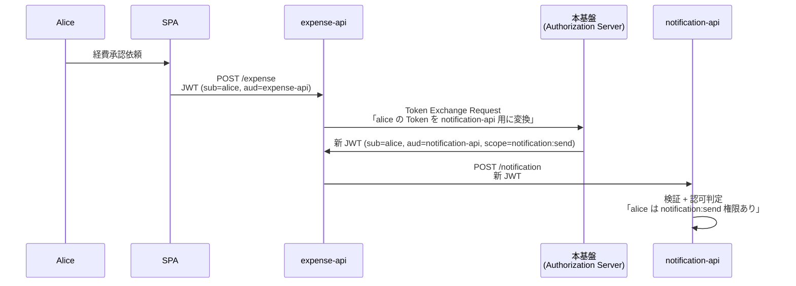
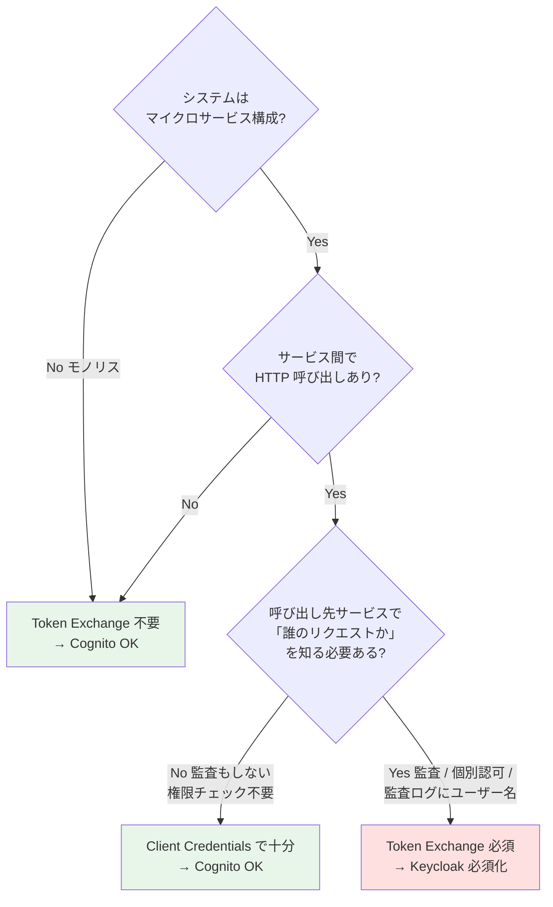

# B-3: 認可・JWT 要件

> 元データ: [../hearing-checklist.md B-3](../hearing-checklist.md#b-3-認可jwt-要件-fr-authz-5--proposal-fr-6)  
> 対象: 開発チーム / テックリード  
> 関連: [proposal §FR-6](../proposal/fr/06-authz.md)

---

## 用語の前提 — 「認可」という言葉の 2 つの意味（事前にすり合わせ）

> **本セクションで扱う質問はすべて「意味 B の認可」と「意味 A の認可フロー」の関係を前提**としています。混同しやすいので、本論に入る前に整理させてください。

OAuth / OIDC 周辺で「認可」は 2 つの意味で使われ、混同されがちです:

| 意味 | 何の話か | 担当 |
|---|---|---|
| **意味 A: 認可フレームワーク**（OAuth 2.0 そのもの）| **Token をどう発行するか**（フロー / プロトコル）| **本基盤**（Authorization Server）|
| **意味 B: 認可判定**（リソース保護）| **alice は /expense/123 を編集できるか?** という業務判定 | **御社の各アプリ**（Resource Server）|

### 本基盤のスタンス（[§FR-6.0.A](../proposal/fr/06-authz.md) より）

> **「認可は御社アプリ側」スタンス = 意味 B の認可は御社アプリの責務**。本基盤は「**認証 + 最小限のクレーム発行**」までを担当します。

### よくある誤解とその訂正

| 誤解 | 訂正 |
|---|---|
| 「認可はアプリ側だから、本基盤は Token 発行だけしてれば良い」 | **半分正解**。意味 B の判定はアプリ側だが、**意味 A の Token 発行制御**（aud / scope / 発行先）は本基盤が責任を持つ |
| 「Cognito / Keycloak はクレームを整えるだけ」 | **半分正解**。認可判定（意味 B）はしないが、**「どの Token をどのアプリに、どんな権限で発行するか」を制御**している（意味 A）|
| 「本基盤が Token Exchange できないとアプリ側で何が困るか分からない」 | **困る**。Token Exchange なしだとアプリ側で「`aud` チェックを甘くする」「ユーザー文脈を捨てる」等の妥協が必要 → **アプリ側認可がルーズ化** |

### Token Exchange が必要になるシナリオ（マイクロサービス OBO）

「**御社のシステムに『誰のリクエストか』を保持する必要のあるサービス間呼び出し**」がある場合、本基盤の **Token Exchange 機能（RFC 8693）が必須**になります。

### Token Exchange なしの代替策（いずれも妥協を強いる）

| 代替策 | 問題 | アプリ側認可への影響 |
|---|---|---|
| **Token をパススルー** | `notification-api` が `aud=expense-api` の Token を受ける（本来拒否）| **`aud` チェックを甘くする必要** = アプリ側認可ルーズ化 |
| **Client Credentials** | `sub=expense-api-service` に変わる、ユーザー文脈消失 | **「誰のリクエストか」が消える** = 監査不能、ユーザー単位認可不能 |
| **アクセス禁止** | サービス間連携不能 | 業務成立せず |

→ Token Exchange があれば、アプリは「自分宛の正しい Token」を受け取って**純粋に業務認可判定だけに集中**できます。

### Token Exchange を気にすべきかの判断フロー

→ **B-304 の質問はこの判断を引き出すための具体的な業務シナリオ確認**です。

---

### 【必須クレーム】 (B-301, 🔥)

各システム（アプリ）が JWT に必要とする属性をご教示ください。
具体的な属性リスト（例: `sub`, `tenant_id`, `email`, `roles`, `groups`, カスタム属性等）でお答えいただけますと幸いです。
**目的**: 本基盤が発行する統一クレーム形式の確定、Cognito の Pre Token Lambda V2 / Keycloak の Protocol Mapper の設計、JWT サイズ最適化に必要な情報です。最小クレーム設計（`iss` / `sub` / `aud` / `azp` / `tenant_id` / `exp` / `iat` のみ）を業界標準として推奨しています（[§FR-6.1.A](../proposal/fr/06-authz.md)）。

---

### 【認可粒度】 (B-302, 🟡)

各システムの認可判定をどの粒度で行うかの設計方針をご教示ください。
- ロール単位（admin / user / viewer 等）
- リソース単位（特定ドキュメント / 特定レコード）
- アクション単位（read / write / delete）
- 組み合わせ

**目的**: 各アプリの認可設計パターン（A: アプリ DB / B: RBAC / C: ABAC / D: 外部 PDP）の選定支援、本基盤の JWT クレーム設計の判断、Keycloak Authorization Services 採用要否の判断に必要な情報です。

---

### 【細粒度認可（UMA 2.0）の必要性】 (B-303, 🟡)

「ドキュメント X を user A だけが閲覧可、user B は編集可」のようなリソース所有者ベースの細粒度認可は必要でしょうか。
有無でお答えいただけますと幸いです。
**目的**: UMA 2.0（User-Managed Access）採用要否の判断。**Yes の場合、Cognito ネイティブ非対応のため Keycloak Authorization Services 必須**、もしくは外部 PDP（Amazon Verified Permissions + Cedar / OPA / OpenFGA）の採用が必要となります。

---

### 【API 間トークンリレー / ユーザー文脈伝播】 (B-304, 🟡)

マイクロサービス間呼び出しで「**誰の操作か**」を伝播する必要があるかご教示ください。
以下のいずれかが該当する場合は Token Exchange が必須となります:
- ① マイクロサービス構成を採用している
- ② サービス A → B 内部呼び出しがある
- ③ B 側のログでエンドユーザー追跡が必須
- ④ サービス別の個別権限チェックが必要
- ⑤ scope 縮小（最小権限の段階的適用）が必要
- ⑥ 外部システムへの代理操作（On-Behalf-Of）
- ⑦ コンプライアンス要件（個人情報アクセスの追跡等）

業務シナリオ + 想定パターン（パターン 1 Forward / パターン 2 Token Exchange / パターン 3 Service Account）でお答えいただけますと幸いです。
**目的**: Token Exchange（RFC 8693）採用要否の判断。**いずれか Yes → Token Exchange 必須 → Keycloak 必須化**となります。詳細判定フローは [§FR-6.3.4](../proposal/fr/06-authz.md) を参照してください。

---

### 【既存ロール体系】 (B-305, 🟢)

現在の貴社・顧客企業のロールモデルをご教示ください。
階層構造 / グループ / 部署 / カスタム属性などをまとめた階層図、もしくは代表的なロール一覧でお答えいただけますと幸いです。
**目的**: JWT の `roles` / `groups` クレーム設計、属性マッピングのスキーマ確定、テナント別の権限モデルの整合性確認に必要な情報です。

---

### 【テナント分離粒度】 (B-306, 🔥)

マルチテナント環境におけるデータ分離方式をご教示ください。
- **共有 DB + tenant_id クレーム**（業界標準・推奨）
- **DB 分離**（顧客ごとに別 DB）
- **アカウント分離**（顧客ごとに別 AWS アカウント）

**目的**: 認可設計の核心となる情報です。[§FR-2.3.A.1](../proposal/fr/02-federation.md) 論理分離の実態、[§C-1.4](../proposal/common/01-architecture.md) 物理分離レベル（L1〜L6）の判断、Cognito User Pool 構成・Keycloak Realm 構成の決定に直結します。
