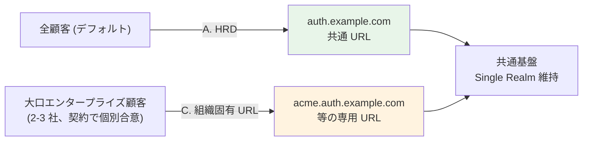

# B-6: マルチテナント運用

> 元データ: [../hearing-checklist.md](../hearing-checklist.md)  
> 対象: 開発チーム / 事業企画  
> 関連: [proposal §FR-2.3](../proposal/fr/02-federation.md)
>
> **新 §X.Y 構造との対応**（[hearing-checklist.md §0〜§5](../hearing-checklist.md) で subject-matter 軸の一覧確認可）:
> - **§2.3 マルチテナント運用方針**: B-602（Keycloak Organization）、B-603（顧客追加リードタイム）、B-606（複数テナント所属）、B-606-2（権限モデル）、B-606-3（切替時 MFA）、B-606-4（属性ソース）、B-607（物理分離特殊顧客）、B-608（オンボーディング主体）、B-611（テナント選択 UI）
> - **§3.5 ブランディング詳細**: B-612（ログイン画面ブランディング）
> - **§3.6 顧客 IdP 属性マッピング**: B-604（属性マッピング命名差異）、B-604-2（実属性名サンプル取得）、B-605（属性更新タイミング Force/Import）、B-605-2（属性別 Source of Truth）、B-605-3（**退職反映 SLA 🔥**）、B-610（HRD 解決ルール）
> - **§4.4 ログアウト・セッション技術**: B-601（IdP 選択 UX）
>
> hearing-script/ は **会議組み立て用に旧 Phase 軸**でファイル分割、hearing-checklist.md は **読み物として subject-matter 軸**で集約。両軸を併用。

---

### 【IdP 選択 UX（フェデユーザーのログイン操作）】 (B-601, 🟡)

> **前提**: 本問は [A-5-2](00-common.md) で **P-3（顧客 IdP 経由のフェデユーザー）を受け入れる**場合の質問です。本問で確定する UX は[**❶ 本基盤の IdP セレクター画面**](../proposal/fr/02-federation.md#fr-233a-画面所在マトリクスとカスタマイズ-3-パターン)（本基盤側）の話で、**❷ 顧客 IdP のログイン画面は対象外**（顧客 IT 部門の責務）。

ログイン画面で、ユーザーがどの IdP（Entra ID / Okta / HENNGE 等）にログインするかを選択する方式について、ご希望のパターンをご教示ください:

| パターン | フロー | 業界実例 | 顧客追加コスト | 顧客間混同リスク |
|---|---|---|---|:---:|
| **A. メールドメイン HRD**（Home Realm Discovery、**業界推奨**）| メール入力 → ドメインから IdP 自動判定 → 顧客 IdP へ | Microsoft 365 / Slack | ドメイン → IdP マッピング設定要 | 中（他社 IdP は表示されない）|
| **B. IdP セレクター** | 各 IdP のボタン選択 → 顧客 IdP へ | GitHub / GitLab | IdP ボタン追加のみ | **高**（他社 IdP ボタンも表示）|
| **C. 組織固有 URL** | `acme.app.example.com` から組織確定 → 顧客 IdP へ | Slack Workspace / Notion | DNS / 証明書設定要 | **低**（URL で完全分離）|

#### 採用シナリオ（A-5-3）との組合せ推奨

| A-5-3 シナリオ | フェデユーザー UX 推奨 | ローカル UI 表示 | App Client 設定 |
|---|---|---|---|
| **α 全カテゴリ受け入れ** | A. HRD + 統合 UI | あり（ローカル ID/PW フォーム）| 両方許可 |
| **β 管理者 + IdP なし顧客** | A. HRD + 統合 UI | あり（IdP なし顧客向け）| 両方許可 |
| **γ 管理者層のみ（推奨）** | **A. HRD（フェデ専用）** | なし（管理者用は別 App Client）| フェデ用 App Client = 外部 IdP のみ |
| **δ Break Glass のみ** | A. HRD or B. セレクター | なし（緊急用は別 App Client） | 同上 |

→ 詳細な業界実例・長所短所は [§FR-2.3.3.A フェデユーザーのログイン操作 UX](../proposal/fr/02-federation.md#fr-233a-画面所在マトリクスとカスタマイズ-3-パターン) / [branding-strategy-evidence.md §6.A](../../common/branding-strategy-evidence.md) 参照。

**目的**: ユーザーが迷わず正しい IdP に到達するためのフロー設計、本基盤のログイン画面実装方針、Cognito / Keycloak での実装方式選定に必要な情報です。**A-5-2 / A-5-3 でシナリオが決まれば UX 推奨が自動的に絞れます**。「Entra のログイン画面（❷）も変えたい」要望は本基盤管轄外であることを契約段階で明示することを推奨します。

> **ハイブリッド構成の検討**: A/B/C を**相互排他で選ぶ必要はありません**。「基本は A（HRD）、大口顧客のみ C（組織固有 URL）を併用」というハイブリッドが業界実用解です。本問の延長線で **B-618 ハイブリッド構成採用方針** を確認してください。

---

### 【IdP 選択 UX のハイブリッド構成（基本 A + 大口 C）採用方針】 (B-618, 🟡)

> **問いの位置づけ**: B-601 で A/B/C いずれかを選んだ後の **「複数パターンを併用するか」** を確定する。複数顧客 × 複数サービスのシナリオでは、**全顧客 A + 大口エンタープライズ顧客のみ C** が業界実用解。
> **回答で決まること**: ①Front Proxy 層（CloudFront Function / Lambda@Edge）の実装要否 / ②C 経由顧客の DNS / ACM 証明書管理プロセス / ③Cognito Custom Domain 4/Region Hard Limit 抵触判定 / ④Keycloak 採用時の Hostname Provider 設定方針 / ⑤[B-607 物理分離](#物理分離が必要な特殊顧客-b-607-) と組合せる必要があるか（C ハイブリッドだけで足りるか）。

#### なぜこれを今聞くのか

**「全顧客一律 A」「全顧客一律 C」のどちらかを最初から決める必要はありません**。業界標準的な落としどころは:

| 顧客分類 | UX パターン | 採用理由 |
|---|---|---|
| 一般顧客（中小規模 / 標準契約）| **A. HRD** | 1 URL 統一、運用負荷最小、マルチ所属対応容易 |
| **大口エンタープライズ顧客**（契約で個別合意）| **C. 組織固有 URL** | フィッシング耐性 + 顧客別ブランディング + 「専用感」訴求 |

#### プラットフォーム別の上限

| プラットフォーム | C ハイブリッド採用時の上限 | 影響 |
|---|---|---|
| **Cognito** | **Custom Domain 4 / Region（Hard Limit、増枠不可）**[^cognito-q12] | 大口 C 顧客は最大 3 社まで（共通 1 + 大口 3）|
| **Keycloak** | 制限なし（Realm Hostname 設定で任意数）| ハイブリッド方針が現実的 |

[^cognito-q12]: [cognito-knockout-conditions.md Q-12](../../reference/cognito-knockout-conditions.md)

#### Keycloak でのハイブリッド構成リファレンス

**Single Realm + Front Proxy で URL を IdP ヒント (`kc_idp_hint`) に自動変換** が業界標準パターン。詳細構成（CloudFront Function 実装、`kc_idp_hint` 自動付与、顧客追加運用フロー、推奨初期ロールアウト）は [§FR-2.3.3.C Keycloak でのハイブリッド構成リファレンス](../proposal/fr/02-federation.md#fr-233c-keycloak-でのハイブリッド構成リファレンス基本-a--大口顧客のみ-c) を参照。

要点:
- 全顧客 = 単一 Realm 維持（[§FR-2.3.A](../proposal/fr/02-federation.md) と整合）
- CloudFront Function で hostname → `kc_idp_hint` 変換
- C 経由顧客の追加リードタイムは **2-3 営業日**（DNS 伝播 + ACM 検証）
- A 経由顧客の追加リードタイムは **< 1 営業日**（[§FR-2.3.2](../proposal/fr/02-federation.md) の標準）

#### B-607 物理分離（L3）との関係

**「C 経由 = 物理分離」ではない**ことに注意:

| 要件 | 採用パターン | データ DB |
|---|---|---|
| 大口顧客が「専用 URL」要望のみ | **C ハイブリッド（本問）** | 共有（Single Realm 内、`tenant_id` 論理分離） |
| 大口顧客が「データ物理分離」要望 | **B-607 = あり**（Multi-Realm）| 専用（Realm 別） |
| 両方要望（規制金融等） | **C + B-607 両方採用** | 専用 + 専用 URL |

→ 通常は **C ハイブリッドだけで「専用感」演出は十分**。物理分離は規制・契約条項で明示された場合のみ追加。

#### 質問

IdP 選択 UX のハイブリッド構成（基本 A + 大口 C 併用）を採用する方針はございますか:

- **採用**（全顧客一律ではなく、契約で大口顧客のみ C を提供する）
  - 想定 C 経由顧客数: 0 / 1-3 社 / 4-9 社 / 10 社+
- **採用しない**（全顧客 A 一律 or 全顧客 C 一律で運用）
- **検討中**（現時点で大口顧客の見込みが立たない、初期は A のみで開始）

**併せて確認**:
- 大口顧客の見込み数（B-607 と重複可、別途確認）
- C 経由顧客の追加リードタイム期待値（2-3 営業日許容か）
- DNS 管理体制（弊社管理 / 顧客自前ドメイン）
- Cognito 採用候補が残る場合、**Custom Domain 4/Region Hard Limit 抵触**の見込み

#### 推奨初期ロールアウト

| フェーズ | 内容 | 時期 |
|---|---|---|
| **Phase 1** | A（HRD）のみで全顧客対応 + Single Realm + 共通 1 Custom Domain | リリース時 |
| **Phase 2** | CloudFront Function を導入し、最初の大口顧客に C を適用 | 大口受注後 |
| **Phase 3** | C 採用顧客が 2-3 社に増えた段階で運用パターンを確立、テンプレート化 | 半年〜1 年後 |
| **Phase 4**（例外）| 物理分離（Multi-Realm = B-607）要求顧客が現れた場合のみ別 Realm を追加 | 必要時 |

→ **「A 全顧客対応 → C は契約後に追加」** が初期構築リスクを最小化する順序。最初から C 用インフラを構築する必要なし。

#### 関連

- [B-601 IdP 選択 UX 案](#idp-選択-uxフェデユーザーのログイン操作-b-601-)（A/B/C 単独選択の質問、本問はその併用方針）
- [B-607 物理分離が必要な特殊顧客](#物理分離が必要な特殊顧客-b-607-)（別軸、組合せ可）
- [B-208 Custom Domain](02-idp-federation.md)（共通 1 / なし / 顧客別 — 顧客別なら本問の C 併用が必要）
- [A-11 ブランディング基本方針](00-common.md)（パターン B/C 採用時は本問の C ハイブリッドが連動）
- [§FR-2.3.3.C Keycloak でのハイブリッド構成リファレンス](../proposal/fr/02-federation.md#fr-233c-keycloak-でのハイブリッド構成リファレンス基本-a--大口顧客のみ-c)（実装詳細）

---

### 【Keycloak Organization 機能の利用】 (B-602, 🟢)

> **問いの位置づけ**: Keycloak 26+ 採用時の **マルチテナント実装方式** を確定する。L2 論理分離（単一 Realm + tenant_id クレーム）を **Keycloak Organization 機能で強化**するか、従来の単一 Realm 方式のままにするか。
> **回答で決まること**: ①Organization API の利用要否（ユーザー追加時の自動 Organization 紐付け 等）/ ②顧客企業ごとの可視性分離（Acme 管理者は Acme ユーザーのみ可視）の実装方式 / ③Realm 物理分離（L3）と比較した運用負荷バランス。

#### なぜこれを今聞くのか

Keycloak 26+ で標準提供される **Organization 機能** は、**L2 論理分離 + マルチテナント運用機能** を 1 つの Realm 内で実現する現代的アプローチ：

- 単一 Realm に **Organization "acme" / "globex" / ...** を作成
- 各 Organization に **メンバー（ユーザー）/ Domain（acme.com）/ Identity Provider 紐付け** を持たせる
- **テナント管理者の可視性分離**（Acme 管理者は Acme Organization のメンバーのみ閲覧・編集可）

これにより **「L3 物理分離せずに L2 でマルチテナント管理性を得る」**が可能。Cognito 採用時は本機能が存在しないため、**tenant_id クレーム + Lambda + DynamoDB で自前実装** が必要。

#### 比較イメージ（3 つの実装方式）

| 観点 | **A. 単一 Realm + tenant_id クレームのみ**（古典 L2）| **B. 単一 Realm + Organization 機能（26+）**（現代的 L2）| **C. Realm per 顧客**（L3 物理分離）|
|---|---|---|---|
| **Realm 数** | 1 つ | 1 つ | N（顧客数）|
| **ユーザー一覧** | 全顧客フラット表示 | **Organization で自動分類** | Realm ごとに分離 |
| **テナント管理者の可視性分離** | アプリ側 / 認可で実装 | **Organization メンバーシップで自動** | Realm 全体閲覧可（実質分離）|
| **IdP 紐付け** | tenant_id マッピング | **Organization → IdP 自動紐付け** | Realm ごとに別 IdP |
| **新規顧客追加** | IdP + Realm 設定変更 | **Organization 作成 + IdP 紐付け** | Realm 作成 + 全アプリ再登録 |
| **アプリ追加** | 1 Client | 1 Client（全 Organization で利用可）| N Realm × 1 Client = N 回登録 |
| **Cognito 採用時** | tenant_id + Lambda 自前実装 | **❌ Organization 相当なし** → A に近い形 | 別 User Pool（Custom Domain 4 個 Hard Limit）|
| **業界推奨度** | 古典的だが OK | **Keycloak 26+ なら推奨** | コンプラ要件のみ |

#### 質問

Keycloak を採用する場合、26.0+ で標準提供される **Organization 機能** を利用しますか。

- **利用する**（推奨、L2 論理分離の現代的アプローチ、Acme 管理者の可視性分離 / Domain 自動マッピング 等の機能をフル活用）
- **利用しない**（既存の tenant_id クレーム + アプリ側認可で完結、Cognito との互換性重視時に選択）

**併せて**: 顧客企業ごとの **テナント管理者（P-2）の可視性分離要件**（Acme 管理者が Globex ユーザーを見えてはいけないか）/ Organization Groups で階層構造を持たせたい組織の有無。

#### 関連

- [B-306 テナント分離粒度](03-authz-jwt.md)（L2 vs L3 の上位判断）
- [B-607 物理分離が必要な特殊顧客](#物理分離が必要な特殊顧客-b-607-)（L3 採用時はそちら）
- [B-404 テナント管理者の委譲](04-user-management.md)（P-2 管理者の可視性要件と連動）
- [§FR-2.3 マルチテナント運用](../proposal/fr/02-federation.md)
- [§C-1.4 物理分離レベル](../proposal/common/01-architecture.md#c-14-物理分離レベルと-broker-パターンの関係)

---

### 【顧客追加リードタイム期待値】 (B-603, 🟡)

新規顧客の IdP 追加にかかるリードタイムの期待値をご教示ください。
業界デフォルトは **< 1 営業日**です。具体的な時間 / 日数でお答えいただけますと幸いです。
**目的**: オンボーディング自動化の必要性判断、Terraform IaC の整備度、運用フロー（Git PR レビュー + CI/CD）の設計に必要な情報です。

---

### 【顧客 IdP 命名差異への対応】 (B-604, 🟡)

顧客 IdP ごとに属性名の差異がある場合の対応方針をご教示ください。
具体例: Entra ID の `tid` / Okta の `org_id` / HENNGE の独自属性 / SAML の AttributeStatement 等。
本基盤側で統一形式（`tenant_id` / `email` / `roles` 等）に正規化することを前提としていますが、命名対応表が必要な場合はご提示ください。
**目的**: 属性マッピング（[§FR-2.2.2](../proposal/fr/02-federation.md)）の設計、Cognito の `attribute_mapping` / Keycloak の IdP Mapper の実装に必要な情報です。

---

### 【顧客 IdP 実属性名サンプル取得手順】 (B-604-2, 🟡)

各顧客 IdP の **実際の属性名サンプル**を取得する手順は確立されていますか。
取得方法（メタデータ URL / Discovery URL / 実 ID Token サンプル / 顧客 IT 担当へのヒアリング）と、手順テンプレートの有無でお答えいただけますと幸いです。
**実物確認なしでマッピング設計は不可能**なため、オンボーディング標準手順としての整備が必要です。
**目的**: 顧客追加リードタイムを < 1 営業日に保つためのオンボーディング標準化、設計時の誤マッピング防止に必要な情報です。

---

### 【属性更新タイミング（フェデユーザーのログイン契機）】 (B-605, 🟡)

**フェデユーザーが本基盤にログインしてくるたび**に、御社 IdP アサーション（OIDC ID Token / SAML Assertion）の最新属性を **共通基盤側のレコードに上書きするか** ご希望をご教示ください。

- **Force（毎回上書き）= Sync Mode = Force**: ログインのたびに IdP の値で上書き → 御社 IdP 側で部署変更してもログイン時に即反映。**業界推奨デフォルト**。ただし**本基盤側で手動編集した値は次回ログインで消える**
- **初回 JIT のみ = Sync Mode = Import**: 初回ログイン時の属性のみ保持、以降の IdP 側変更は本基盤に**反映されない**。**退職反映遅延リスクあり**（退職者が再ログインしてこなければ本基盤レコードはずっと有効状態のまま）
- **別途トリガー**: SCIM 同期 / 定期バッチ / イベント駆動で別途同期する

※ ここで言う「JIT」は **共通基盤側ユーザー DB へのレコード作成 / 更新**を指します（御社 IdP 側の JIT ではありません）。

**目的**: 退職反映 SLA、ロール変更の即時性、基盤側で手動設定したロールの温存可否のバランス判断に必要な情報です。「Import」採用時の退職反映遅延は重大インシデント源となりうる点にご注意ください。

---

### 【属性ごとの Source of Truth】 (B-605-2, 🟡)

属性ごとに「真実の源」を分けるかご教示ください。
具体例:
- `groups` / `department`: IdP 側が正（Force）
- `roles`（基盤管理ロール）: 本基盤側が正（Import）
- 表示名: IdP 側が正（Force）

Force / Import を属性単位で切り替える設計を許容するか、属性別ソース表の有無でお答えいただけますと幸いです。
**目的**: 属性ライフサイクル設計（[§FR-2.2.4](../proposal/fr/02-federation.md)）の確定、Keycloak Mapper 単位の Sync Mode 設定、Cognito Pre Token Lambda V2 での個別実装スコープに必要な情報です。

---

### 【退職反映 SLA】 (B-605-3, 🔥)

**御社 HR / IdP 側で退職処理（ユーザー削除 or 無効化）が完了してから、本基盤および御社の各アプリで認可拒否されるまでの SLA（時間）** をご教示ください。

許容時間の選択肢:
- **即時（< 1 分）**: 規制業界 / 重要システム
- 数分以内: 標準的な B2B SaaS
- 数時間以内: 中リスク業務
- 翌日まで許容: 低リスク社内ツール

**同期方式による達成可能性の違い**（B-401 SCIM 採否と連動）:
- **SCIM 採用**: HR/IdP → 共通基盤への push が即座に走る → **即時〜数分** 達成可能
- **JIT のみ**: 退職者は再ログインしない限り基盤レコードが残り続ける（**Access Token 期限切れまで侵害ウィンドウ**）→ Token TTL に依存
- **定期バッチ同期**: 数時間〜翌日

→ 即時性が要件なら **SCIM 採用 + Access Token Revocation（[B-704](#)）** の組み合わせが現実解。Token TTL（[§FR-5.3](../proposal/fr/05-logout-session.md)）との連動評価が必要です。

**目的**: トークン TTL 設計、Token Revocation 実装方式（Cognito の `origin_jti` 自前 vs Keycloak の Introspection）、SCIM 連携の必要性判断、コンプライアンス要件への適合性確認に必要な情報です。**「Import」運用での退職反映遅延は重大インシデント源**となります。

---

### 【1 ユーザー複数テナント所属の可能性】 (B-606, 🟢)

1 人のユーザーが複数のテナント（顧客企業）に所属する可能性はございますか。
具体例: 業界横断コンサルタント / MSP 社員 / 業務委託フリーランス / 親子会社所属 / M&A 後の兼務 等。
あり / なし、でお答えいただけますと幸いです。
**目的**: テナント切替 UI の要否、`tenant_id` クレーム形式（スカラー vs 配列）の判断、プロファイル統合設計（memberships）の必要性確認に必要な情報です。

---

### 【複数テナント時の権限モデル】 (B-606-2, 🟡)

B-606 で「あり」の場合、権限の扱い方をご教示ください:
- **横断**（GitHub Organizations 型）: 1 ユーザーが複数テナントの権限を同時保持
- **切替**（Slack 型）: テナントを切り替えるたびに権限が変わる
- **別ユーザー扱い**（独立派）: テナントごとに別ユーザーアカウント

`tenant_id` クレーム形式（スカラー / 配列）に直結する判断です。
**目的**: マルチテナント環境での権限分離設計、JWT クレーム設計、テナント切替フローの実装方式選定に必要な情報です。

---

### 【テナント切替時の MFA 再要求】 (B-606-3, 🟢)

B-606 で「あり」かつ「切替型」採用時、テナント切替時に MFA を再要求しますか。
- 再要求する（テナントごとにセッション独立）
- しない（同一セッション内で切替）
- ロール別（管理者ロールのテナントは再要求）

**目的**: テナント切替時の UX とセキュリティのバランス、[§FR-3.3](../proposal/fr/03-mfa.md) ステップアップ MFA との連動設計に必要な情報です。

---

### 【複数所属時の属性ソース】 (B-606-4, 🟢)

B-606 で「あり」の場合、テナントごとに属性が異なる場合の管理方式をご教示ください:
- テナント別管理: `memberships: [{tenant: "acme", groups: [...], dept: "..."}, {tenant: "globex", ...}]`
- 統合: 最終ログインしたテナントの値で上書き

**目的**: 複数所属時の属性管理設計、JWT クレーム構造、属性更新タイミングの仕様確定に必要な情報です。

---

### 【物理分離が必要な特殊顧客】 (B-607, 🟢)

> **問いの位置づけ**: [B-306 テナント分離粒度](03-authz-jwt.md) で L2 論理分離（業界標準）を基本としつつ、**例外的に L3 物理分離（Realm/Pool per 顧客）を要求する顧客**がいるか確認する。「全顧客 L2」or「**L3 顧客を限定的に許容するハイブリッド**」かの判定。
> **回答で決まること**: ①L3 物理分離オプションの提供要否 / ②該当顧客の追加料金体系 / ③Cognito 採用時の Custom Domain 4 個 Hard Limit 抵触判定 / ④N×M Client 登録の運用コスト見積 / ⑤マスター表 B 列 V「L3 物理」が ☑ される件数の予測。

#### なぜこれを今聞くのか

**「物理分離してほしい」という顧客要望の真のニーズ**を掘り下げることが重要です。多くの場合、顧客の要望は **真の L3 物理分離ではなく、L2 + 認可で満たせる**ことが業界実例で確認されています：

| 顧客の表面的要望 | 真のニーズ | 適切な解決策 |
|---|---|---|
| 「データを他社と物理分離してほしい」 | 業務 DB の論理分離 + 暗号鍵分離 | **L2 + DB 暗号化鍵を顧客別 KMS Key** |
| 「監査時に他社データに触れない構成にしたい」 | 監査スコープ限定 | **L3 ハイブリッド**（規制顧客のみ別 Pool/Realm）|
| 「コンプラで物理分離が必須と言われた」 | 規制要件の具体確認（多くは暗号化 / アクセス制御で OK）| **規制条文を確認**、必要なら L3 |
| 「他社と同じ基盤を使うのが嫌」 | 心理的・契約上の要求 | **L2 + 顧客別 Custom Domain で「専用感」演出**（Cognito 4 個上限注意） |

→ **L3 採用は「契約 / 規制で物理分離必須」が明示されている顧客のみ**。安易な L3 採用は **N×M Client 登録 / Custom Domain 上限 / Identity Broker パターン崩壊 / 設定ドリフト**を招きます（詳細は [§C-1.4](../proposal/common/01-architecture.md#c-14-物理分離レベルと-broker-パターンの関係)）。

#### 比較イメージ（あり / なし / ハイブリッド）

| ケース | 該当例 | 本基盤の構成 | 追加コスト |
|---|---|---|---|
| **なし**（全顧客 L2 で OK）| 標準的な B2B SaaS | 単一 Pool/Realm + 複数 IdP | なし（業界標準）|
| **あり、規制業種数社のみ** | 金融 / 医療 / 政府系 1〜3 社 | **L3 ハイブリッド**: 規制顧客のみ別 Pool/Realm、他は L2 | 顧客あたり Realm/Pool + 全アプリ Client 再登録 |
| **あり、多数の顧客**（10 社超）| 全顧客が物理分離契約 | **L3 全面採用 = Identity Broker パターン崩壊** | 運用コスト N 倍、設計再考要 |

#### 質問

データの物理分離を **契約・規制要件として明示的に求める顧客** はございますか。
- **なし**（全顧客 L2 論理分離で対応）
- **あり**（顧客名 + 件数 + 規制条文 or 契約条項を併記）
- **検討中**（顧客から要望はあるが規制条文未確認）

**併せて確認**:
- 該当顧客の **真のニーズ**（上記の表参照、表面的要望 vs 真のニーズ）
- L3 採用時の **追加料金体系**の合意（顧客あたり月額料金 等）
- Cognito 採用候補が残る場合、**Custom Domain 4 個 Hard Limit 抵触**の見込み

#### 関連
- [B-306 テナント分離粒度](03-authz-jwt.md)（L1/L2/L3 の上位判断、本問は L3 例外採用の検討）
- [B-602 Keycloak Organization 機能利用](#keycloak-organization-機能の利用-b-602-)（L2 強化、L3 を避ける道）
- [マスター表 B 列 V テナント分離希望](02-idp-federation.md)（顧客ごとの個別判定 L1/L2/L3）
- [§C-1.4 物理分離レベル L1〜L6](../proposal/common/01-architecture.md#c-14-物理分離レベルと-broker-パターンの関係)（詳細グラデーション + 業界実例）
- [§FR-2.3.A.1 論理分離の実態](../proposal/fr/02-federation.md)

---

### 【オンボーディング主体】 (B-608, 🟡)

顧客 IdP 追加の主体（誰が登録作業をするか）をご教示ください:
- 弊社運用チーム（受領 → Terraform PR → デプロイ）
- 顧客企業セルフサービス（管理 UI から自社で登録）
- ハイブリッド（中規模顧客は弊社、大口顧客はセルフ）

**目的**: 運用工数の見積、セルフサービス UI の実装スコープ、顧客向け管理画面の機能設計に必要な情報です。

---

### 【IdP 情報の受領形式】 (B-609, 🟡)

顧客から IdP 接続情報を受領する形式をご教示ください:
- SAML Metadata URL
- SAML Metadata XML ファイル
- OIDC Discovery URL（well-known/openid-configuration）
- 手動転記（クライアント ID / 証明書を個別受領）

**目的**: オンボーディング標準手順の整備、受領フォーマットのバリエーション対応、自動化スクリプトの設計に必要な情報です。

---

### 【メールドメインから IdP への解決ルール】 (B-610, 🟢)

B-601 で「メールドメイン HRD」を採用する場合、ドメイン構成についてご教示ください:
- 1 ドメイン = 1 IdP（`@acme.com` → Acme の Entra ID）
- 1 顧客に複数ドメイン（`@acme.com` も `@acme.co.jp` も同じ IdP）
- 不規則（個別ルール定義が必要）

**目的**: HRD 解決テーブルの設計、ドメイン重複検出ロジック、運用時のメンテナンス工数評価に必要な情報です。

---

### 【複数テナント所属時の選択 UI】 (B-611, 🟢)

B-606 が「あり」の場合、ログイン後にテナント選択 UI が必要でしょうか。
必要 / 不要 / 別の方式（URL ベース等）でお答えいただけますと幸いです。
**目的**: テナント選択画面の実装スコープ、Slack 型（ログイン後切替）/ GitHub 型（横断アクセス）の UX 設計、ブランディング要件（テナント別表示）の確定に必要な情報です。

---

### 【ログイン画面のブランディング詳細】 (B-612, 🟢)（A-11 で B/C 採用時のみ）

> **※ [A-11](00-common.md) で「パターン A」を合意された場合、本質問は不要です**（認証基盤画面は本基盤標準、アプリ側で完結）。**A-11 で B/C 選択時のみ深掘り対象**。

A-11 で **パターン B（認証基盤画面にも顧客ロゴ）** または **パターン C（完全専用デザイン）** を選択された場合、カスタマイズ対象画面の範囲をご教示ください:
- **認証基盤側画面**（ログイン / MFA / パスワードリセット）への顧客別ロゴ表示要件
- **共通 UI / 顧客別カスタマイズ / ハイブリッド**のいずれをご希望か
- 対象顧客企業の範囲（全顧客 / 大口顧客のみ / Enterprise プラン顧客のみ）

**目的**: [§FR-2.3.3.A](../proposal/fr/02-federation.md) 画面所在マトリクスの判断。Cognito Managed Login Branding（Essentials+、**20 顧客上限**）の適用範囲、Keycloak カスタム Theme 開発工数、URL allowlist 設計に直結する情報です。**A-11 パターン A 合意なら本質問はスキップ可能**。
