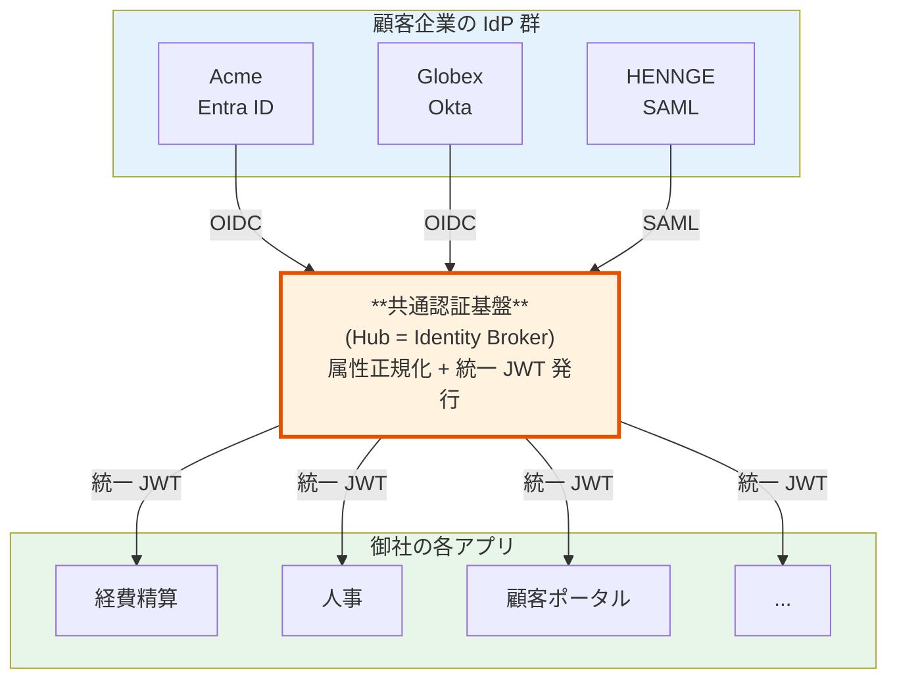
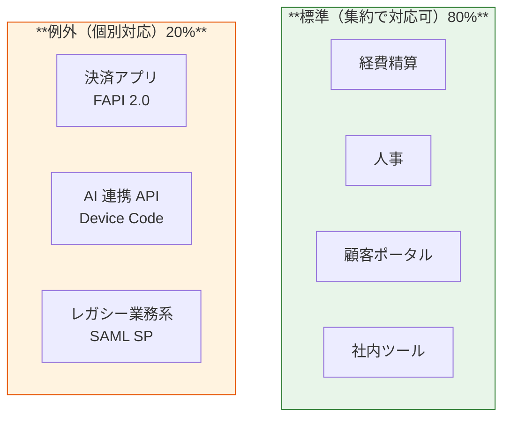
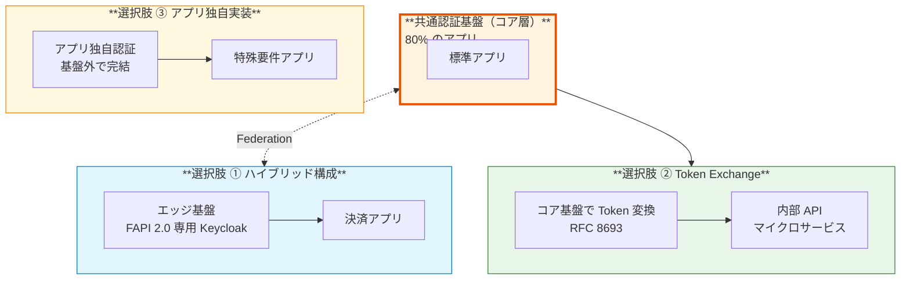
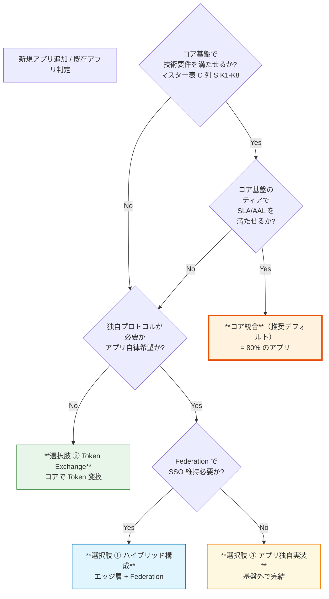

# §1.3 アーキテクチャ方針 — スライド草案

> **本資料の位置づけ**: [powerpoint-outline-and-references.md §1.3](../powerpoint-outline-and-references.md) のスライド草案。**7 スライド構成**で、基本方針「**認証基盤への集約**」+ 例外対応 3 選択肢（ハイブリッド構成 / Token Exchange / アプリ独自実装）を示す。
> **対象**: 顧客（経営層 / 情シス / アプリオーナー）
> **想定時間**: 15-20 分（質疑含む、本資料の核心）
> **narrative 方針**: 「集約をデフォルトとして安心感を与えつつ、例外対応の柔軟性も示す」
>
> **🎯 補強 narrative（2026-06-03 追加）**: 「**内側（アプリへの発行）プロトコルは OIDC を推奨**」も併せて提示。**新規アプリは OIDC 一択、既存 SAML SP は OIDC 化検討を優先**。例外ケース ③（レガシー SAML SP 連携 / K5）の発生件数を抑制することで、製品選定の自由度（Cognito 採用余地）を確保。詳細は **Phase D 前提合意 D-7** に集約。

---

## 全体構成

| # | スライドタイトル | メインメッセージ | 想定時間 |
|:-:|---|---|:-:|
| **1** | **基本方針: 認証基盤への集約** | 「認証基盤を**1 つに集約**します（Identity Broker パターン）」 | 2 分 |
| **2** | 集約のメリット（5 つ）| SSO 自動 / 運用集約 / セキュリティ baseline 統一 / 顧客追加 < 1 営業日 / コスト効率 | 3 分 |
| **3** | 業界実例 — 集約は B2B SaaS の標準 | Slack / Notion / Microsoft 365 / Linear はすべて集約 | 2 分 |
| **4** | **例外要件の認識** | 一部のアプリは集約だけでは対応困難（3 ケース）| 3 分 |
| **5** | **例外対応の選択肢 3 つ** | ①ハイブリッド構成 / ②Token Exchange / ③アプリ独自実装 | 4 分 |
| **6** | アプリ別の判定フロー | 各アプリは「コア統合 / 例外 3 選択肢」のどれを選ぶか | 3 分 |
| **7** | ヒアリング項目 + 期待される結論 | D-6, B-100 等の確認、80% コア + 20% エッジの想定 | 2 分 |

---

## スライド 1: 基本方針 — 認証基盤への集約

### タイトル
**アーキテクチャ基本方針 — 認証基盤への集約**

### メインメッセージ
> **「認証基盤を 1 つに集約します。Identity Broker パターン（業界標準）を採用し、顧客 IdP・各アプリの中央集約点として機能します。」**

### ビジュアル（§C-1.0.A 簡略版）

### 詳細テキスト

**集約とは**:
- 顧客企業ごとの **IdP（Entra ID / Okta / HENNGE 等）**は本基盤の Hub に接続
- 御社の各アプリは **本基盤の発行する統一 JWT 1 つだけを Trust**
- 顧客追加時、御社アプリの改修は不要（**Hub に IdP を追加するだけ**）

**この方針の前提**:
- §FR-2 の要件（複数 IdP 受け入れ + 属性の統一形式 + 顧客追加で各システム変更不要）が確定すれば、Broker パターンは**構造的に必然**

### スピーカーノート
- 「**集約 = Identity Broker パターン**」と用語整理しつつ説明
- 「業界の B2B SaaS は基本これ」を強調
- まだ「**例外対応はあります**」は伏せておく（スライド 4-5 で展開）

### 参考資料
- [§C-1.0.A 本基盤のアーキテクチャスタンス](../proposal/common/01-architecture.md)
- [§C-1.1 Broker パターン採用根拠](../proposal/common/01-architecture.md)

---

## スライド 2: 集約のメリット（5 つ）

### タイトル
**集約のメリット — なぜ「集約」を選ぶか**

### メインメッセージ
> **「集約により、運用負荷とセキュリティ品質の両立、顧客追加の高速化が実現できます」**

### ビジュアル（メリット 5 つの表）

| # | メリット | 内容 | 業界根拠 |
|:-:|---|---|---|
| **1** | **SSO 自動成立** | 同じ Hub の JWT を持つアプリ間で自動 SSO | Identity Broker パターン標準 |
| **2** | **運用集約** | 1 チームで全アプリの認証を運用、専門性集中 | 業界調査: **統合点 60% 削減**（WJAETS-2025）|
| **3** | **セキュリティ baseline 統一** | 全アプリで同じ MFA ポリシー / セッション TTL / 監査ログ | NIST SP 800-63 推奨 |
| **4** | **顧客追加 < 1 営業日** | Hub に IdP 設定追加するだけ、各アプリ改修不要 | §FR-2.3.2 |
| **5** | **コスト効率** | 1 つの認証基盤を全アプリで共有、運用人員 1 チーム | Cognito MAU 課金 / Keycloak 1 Cluster |

### 詳細テキスト

**比較: 個別実装 vs 集約**

| 観点 | 個別実装（分散）| 集約（Broker パターン）|
|---|---|---|
| 顧客 IdP 追加 | **全アプリで個別対応**（10 アプリなら 10 回設定）| **Hub に 1 度設定** |
| 各システムが Trust する issuer 数 | 顧客数 × プロトコル数（1500 顧客なら数千）| **1 つだけ** |
| クレーム差異の吸収 | 各アプリで対応 | **Hub で一元正規化** |
| 監査・セキュリティレビュー | 全アプリ × 全 IdP の組合せ | **Hub のみ** |
| 顧客追加リードタイム | 全システム改修（**数週間**）| **< 1 営業日** |
| 管理運用コスト（業界調査）| 高 | **最大 60% 削減**（WJAETS-2025）|

### スピーカーノート
- 表を強調しながら「**個別実装は持続不可能**」と説明
- 「Slack / Notion / Microsoft 365 もこの方針」と業界実例先取り（スライド 3 への伏線）

### 参考資料
- [§C-1.0.A の業界根拠表](../proposal/common/01-architecture.md)
- [WJAETS-2025 学術論文（統合点削減効果）](https://journalwjaets.com/sites/default/files/fulltext_pdf/WJAETS-2025-0919.pdf)

---

## スライド 3: 業界実例 — 集約は B2B SaaS の標準

### タイトル
**業界実例 — 集約は B2B SaaS のデファクトスタンダード**

### メインメッセージ
> **「Slack / Notion / Microsoft 365 / Linear など、主要 B2B SaaS はすべて『1 つの認証基盤に集約』しています」**

### ビジュアル（業界実例マトリクス）

| サービス | 集約方式 | 採用パターン | 出典 |
|---|---|---|---|
| **Slack** | 単一 Realm + Workspace 分離 | 完全統合 | [Slack Enterprise Grid](https://api.slack.com/enterprise/grid) |
| **Notion** | 単一 Workspace ベース | 完全統合 | Notion Docs |
| **Microsoft 365** | Microsoft Entra ID 集約 | 完全統合 + テナント論理分離 | Microsoft Entra |
| **Linear** | SAML + SCIM 集約 | 完全統合 | Linear Enterprise |
| **Box** | enterprise_id 識別 | 完全統合 | Box Platform |
| **Auth0**（製品自身）| ハイブリッド（Public + Private Cloud）| **規制業種顧客のみ別基盤**（後述） | Auth0 Architecture |
| **Microsoft Entra ID**（自身）| ハイブリッド（Public + GCC + GCC-High + DoD）| **政府機関のみ別基盤**（後述）| Microsoft Entra GCC |

### 詳細テキスト

**業界の現在地**:
- **中規模 SaaS は 100% 集約**（Slack / Notion / Linear 等）
- **超大規模・規制業種対応 SaaS は ハイブリッド型に進化**（Microsoft / Auth0 / Okta）
- 完全分散は **大手金融機関の業務系のみ**（規制が極端）

### スピーカーノート
- 「御社規模（1500-3000 顧客）でも**基本は集約で十分**」を強調
- 「ただし、ハイブリッド型の余地も最初から組み込みます」とスライド 4-5 への伏線

### 参考資料
- [KuppingerCole Identity Fabrics 2025](https://www.kuppingercole.com/blog/reinwarth/the-kuppingercole-identity-fabric-2025)
- [Microsoft Entra GCC Architecture](https://learn.microsoft.com/en-us/azure/azure-government/)
- [Auth0 Private Cloud Architecture](https://auth0.com/docs/customize/deploy-monitor/private-cloud)

---

## スライド 4: 例外要件の認識 — 集約だけでは対応困難なケース

### タイトル
**例外要件の認識 — 集約だけでは対応困難なケース**

### メインメッセージ
> **「ほとんどのアプリは集約で対応できますが、以下の 3 ケースは集約だけでは対応が困難です」**

### ビジュアル（例外要件マトリクス）

| 例外ケース | 該当アプリ例 | 集約での対応難度 | 業界対応 |
|---|---|---|---|
| **① 金融・規制業種**（FAPI 2.0 準拠）| 決済アプリ / Open Banking API | ⚠ **困難**（DPoP / mTLS / PAR 等の特殊プロトコル）| Keycloak FAPI Profile |
| **② AI Agent / IoT 認証** | AI 連携 API / IoT デバイス | ⚠ **困難**（Device Code Flow が AWS Cognito 非対応）| Keycloak / 独自実装 |
| **③ レガシー SAML SP 連携** | 旧 Salesforce / オンプレ業務系 | ⚠ **困難**（SAML IdP モードが Cognito 非対応）**※ OIDC 化検討を優先（D-7）** | Keycloak SAML IdP |

> **🎯 内側プロトコル方針（D-7）との関連**: 例外ケース ③ SAML SP 連携については、**新規開発は OIDC 一択**、既存アプリも **OIDC 化を優先検討**。OIDC 化困難な既存資産のみ SAML IdP 発行 (K5) で当面接続 + 中期 OIDC 移行計画。**K5 発生件数を抑制すれば Cognito 採用余地が拡大**し、本スライド「集約 → 例外対応」narrative がより成立しやすくなる。

### 例外要件の典型シナリオ

### 詳細テキスト

**80/20 の現実**:
- 御社アプリの **80%** は標準的な OIDC + JWT 認証で対応可能（集約）
- 残り **20%** は特殊要件で個別対応が必要

**例外要件の特定方法**:
- マスター表 C（B-100）で各アプリの**特殊要件フラグ K1〜K8**を確認
- K1〜K8 のいずれか ☑ ⇒ 例外対応が必要

### スピーカーノート
- 「**御社のアプリリストで、例外に該当するものを確認しましょう**」（マスター表 C への誘導）
- 例外が無い場合は **完全集約で OK**

### 参考資料
- [マスター表 C 補足 2 K1〜K8](../hearing-script/01-auth-flow.md)
- [reference/cognito-knockout-conditions.md](../../reference/cognito-knockout-conditions.md)

---

## スライド 5: 例外対応の選択肢 3 つ ⭐ 核心

### タイトル
**例外対応の選択肢 3 つ — 集約方針を保ちつつ、特殊要件に対応**

### メインメッセージ
> **「例外要件には、以下 3 つの選択肢で対応可能です。集約基盤は変えず、必要なところだけ追加対応します」**

### ビジュアル（3 選択肢の比較）

### 詳細テキスト

| 選択肢 | 使うべき場面 | メリット | デメリット |
|---|---|---|---|
| **① ハイブリッド構成（エッジ層）** | FAPI 2.0 等、コア基盤では対応不可の専用機能が必要なアプリ | エッジで最適化可、SSO は Federation で維持 | エッジ層の運用が追加 |
| **② Token Exchange (RFC 8693)** | マイクロサービス間でユーザー文脈伝播が必要なアプリ | コアを変えず、Token 変換のみで対応 | Keycloak 採用前提 |
| **③ アプリ独自実装** | 基盤外で完全独立した認証が必要な特殊ケース | アプリチームの完全自律 | SSO 維持に追加設計必要 |

### 業界根拠

| 業界知見 | 出典 |
|---|---|
| **「centralized for core functions like authentication, decentralized for edge functions」がハイブリッドの定石** | [Enterprise Architecture Hybrid Patterns](https://www.linkedin.com/advice/0/how-do-you-evaluate-trade-offs-between-centralized) |
| Microsoft Entra GCC / Auth0 Private Cloud / Okta Custom Cell も**同じハイブリッド設計** | KuppingerCole / 各社公開資料 |
| 「allow partner admins autonomy within their scope, while maintaining centralized oversight」が業界標準 | [Security Boulevard Delegated Admin Best Practices](https://securityboulevard.com/2025/06/delegated-administration-in-partner-iam-best-practices/) |

### スピーカーノート
- 「**3 選択肢のうちどれを採用するかは、アプリ別に判定**」と説明
- 次スライドの「判定フロー」で具体化

### 参考資料
- [§C-6 §6.4 Federation 接続パターン](../proposal/common/06-architecture-decision-hybrid.md)
- [RFC 8693 Token Exchange](https://datatracker.ietf.org/doc/html/rfc8693)

---

## スライド 6: アプリ別の判定フロー

### タイトル
**アプリ別の判定フロー — コア統合 / 例外対応のどれを選ぶか**

### メインメッセージ
> **「各アプリは以下のフローで『コア統合 / 例外 3 選択肢』を機械的に判定できます」**

### ビジュアル（判定フロー）

### 詳細テキスト

**判定の例**:

| アプリ | 判定 | 理由 |
|---|---|---|
| 経費精算 SaaS | **コア統合** | 標準的な OIDC、特殊要件なし |
| 人事システム | **コア統合** | 同上 |
| 顧客向けポータル | **コア統合**（High-security ティア）| 個人情報扱う、AAL3 必要 |
| **決済システム（FAPI 2.0）** | **① ハイブリッド構成** | DPoP / mTLS / PAR 必須 |
| **AI Agent 連携 API** | **① ハイブリッド構成** | Device Code Flow 必須 |
| **マイクロサービス間 API** | **② Token Exchange** | OBO 必須、コアで対応可 |
| レガシー業務系 | **① ハイブリッド構成** | SAML IdP モード必須 |

### スピーカーノート
- 「**マスター表 C を埋めれば、自動的にどのアプリがどの選択肢か機械的に決まる**」を強調
- 「アプリオーナーと一緒にマスター表 C を埋めましょう」と次のアクション提示

### 参考資料
- [§C-6 §7 アプリ振分け基準（コア / エッジ判定フロー）](../proposal/common/06-architecture-decision-hybrid.md)
- [hearing-script/01-auth-flow.md マスター表 C](../hearing-script/01-auth-flow.md)

---

## スライド 7: ヒアリング項目 + 期待される結論

### タイトル
**ヒアリング項目 — 御社のアプリ構成を確認**

### メインメッセージ
> **「以下の項目を確認させてください。回答により、コア統合 / 例外対応の比率が確定します」**

### ヒアリング項目表

| # | 項目 ID | 確認内容 | 重要度 |
|:-:|---|---|:-:|
| 1 | **D-6** | Identity Broker パターン採用前提合意（**基本方針の合意**）| 🔥 |
| 2 | **A-3** | 対象システム数（御社アプリ数）| 🔥 |
| 3 | **A-15** | 顧客企業数の現状と 5 年想定 | 🔥 |
| 4 | **B-100** マスター表 C | アプリ別の特殊要件 K1〜K8（列 S）| 🔥 |
| 5 | **B-200** マスター表 B | 顧客 IdP 構成（LDAP 直結 → Keycloak 必須化）| 🔥 |
| 6 | **D-1** | プラットフォーム選定（Cognito / Keycloak）| 🔥 |
| 7 | **C-201** | FIPS 140-2 認定要件（→ RHBK 必須化）| 🔥 |

### 期待される結論パターン

| シナリオ | コア / エッジ比率 | 推奨プラットフォーム |
|---|---|---|
| **A. 標準的な B2B SaaS** | 100% コア（例外なし）| Cognito or Keycloak |
| **B. 一般的なミックス** | 80% コア + 20% エッジ | **Keycloak**（規模 1500-3000）|
| **C. 規制業種多数** | 60-70% コア + 30-40% エッジ | **Keycloak RHBK**（FIPS 必須）|
| **D. レガシー多数** | 50% コア + 50% エッジ | **Keycloak**（SAML IdP モード必須）|

### スピーカーノート
- 「次回ヒアリング（M2）で マスター表 C を埋めましょう」
- 「マスター表 C が埋まれば、80% の判定が機械的に決まります」
- 「**例外対応の詳細設計は、コア統合の議論が終わってから個別に進めます**」（順序を強調）

### 参考資料
- [hearing-checklist.md §1 前提合意, §3 既存接続元・アプリ](../hearing-checklist.md)
- [hearing-checklist-excel-master-c.tsv](../hearing-checklist-excel-master-c.tsv)

---

## まとめ用スライド（章末）

### タイトル
**アーキテクチャ方針 — まとめ**

### メインメッセージ

| 観点 | 本基盤の方針 |
|---|---|
| **基本** | **認証基盤への集約**（Identity Broker パターン）|
| **例外対応 ①** | **ハイブリッド構成**（エッジ層 + Federation）|
| **例外対応 ②** | **Token Exchange (RFC 8693)** |
| **例外対応 ③** | **アプリ独自実装**（基盤外）|
| **判定基準** | **マスター表 C 列 S K1〜K8**で機械的に決定 |
| **想定比率** | **80% コア + 20% エッジ**（一般的な B2B SaaS）|
| **業界整合** | Microsoft / Auth0 / Okta も**同じハイブリッド設計** |

### 検討ポイント（顧客側）

- [ ] **D-6 Identity Broker パターン採用に異論なし** ✓ 合意
- [ ] **A-3 対象システム数**を共有
- [ ] **マスター表 C を次回ヒアリングまでに記入** 開始
- [ ] **特殊要件アプリ（K1〜K8 ☑）の有無**を初期確認

---

## 関連スライド草案

- [§3.2 MFA 要件 + ステップアップ認証](3.2-mfa-slides.md)
- §2.4 マルチテナント設計（別ファイル）
- §3.4 認可+JWT+API認可（別ファイル）
- §5.7 委譲管理（別ファイル）

---

## 改訂履歴

| 日付 | 内容 |
|---|---|
| 2026-06-03 | 初版。「基本は集約 → 例外対応」narrative を 7 スライド構成で実装 |
| 2026-06-03 | **内側プロトコル方針（D-7: OIDC 推奨）を補強 narrative として追加**。スライド 4 例外ケース ③（SAML SP 連携 / K5）に OIDC 化検討優先の注記追加。K5 抑制 → Cognito 採用余地拡大の連動を明示 |
| 2026-06-03 | **outline §X 構成変更に伴うクロスリファレンス周知**: 認可独立化 (§4) + ITDR 移動 (§7.4)、本スライドは旧 §1.3 → 新 §1.3 に位置付け変更（ファイル名・内容の同期は Phase 2/3 で対応）|
