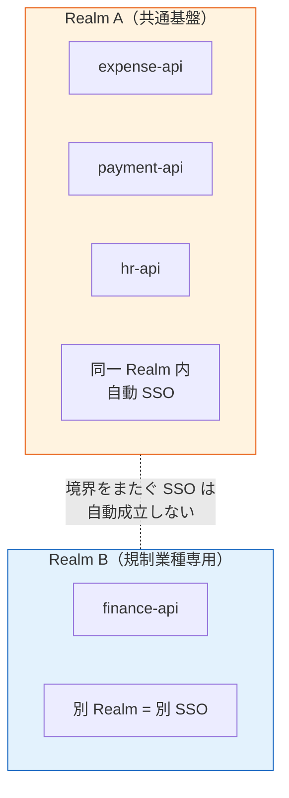
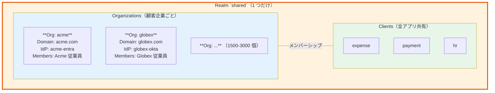
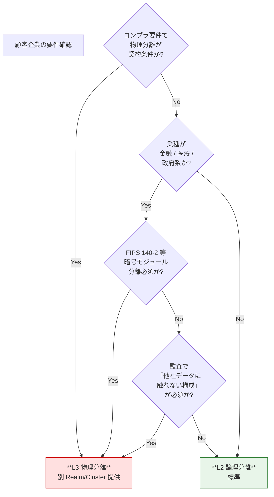
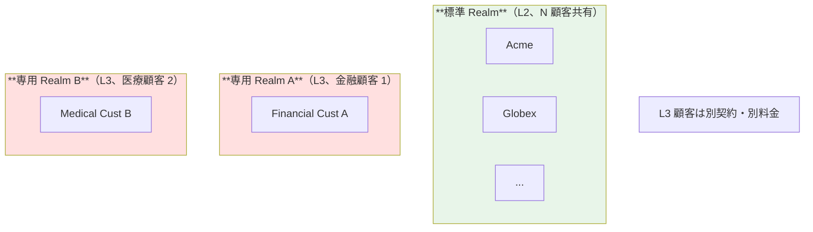

# §2.4 マルチテナント設計 — スライド草案

> **本資料の位置づけ**: [powerpoint-outline-and-references.md §2.4](../powerpoint-outline-and-references.md) のスライド草案。**6 スライド構成**で、テナント分離粒度（L1/L2/L3）+ 規模戦略（1500-3000 顧客）+ Keycloak Organization 機能 + 物理分離特殊顧客を整理。
> **対象**: 顧客（情シス / SRE / アプリオーナー）
> **想定時間**: 15 分（質疑含む）
> **narrative 方針**: 「**論理分離（L2）が標準、物理分離（L3）は規制業種のみ例外**」（§1.3 と同じ「基本 → 例外」構造）

---

## 全体構成

| # | スライドタイトル | メインメッセージ | 想定時間 |
|:-:|---|---|:-:|
| **1** | **マルチテナント設計の基本概念** | Realm（Keycloak）≈ User Pool（Cognito）= 認証境界 | 2 分 |
| **2** | **テナント分離 3 レベル（L1/L2/L3）** | L2 論理分離が標準、L3 物理分離は規制業種のみ | 3 分 |
| **3** | **規模戦略 — 1500-3000 顧客の現実** | Cognito Hard Limit と Keycloak の対応 | 3 分 |
| **4** | **Keycloak Organization 機能（26+）** | 単一 Realm でマルチテナント実現の最新機能 | 2 分 |
| **5** | **物理分離が必要な特殊顧客への対応** | L3 採用判定 + 例外的なエッジ層配置 | 2 分 |
| **6** | **ヒアリング項目一覧** | B-306, B-602, B-607 等 10 項目 | 2 分 |

---

## スライド 1: マルチテナント設計の基本概念

### タイトル
**マルチテナント設計の基本概念 — 認証境界とは**

### メインメッセージ
> **「Realm（Keycloak）と User Pool（Cognito）は同じ概念で、『認証境界（tenancy boundary）』を意味します。境界をまたいだ SSO は自動成立しません」**

### ビジュアル（用語整理表）

| 概念 | Keycloak | Cognito | 何か |
|---|---|---|---|
| **認証境界**（tenancy boundary）| **Realm** | **User Pool** | ユーザー / IdP / クライアントを内包する独立した認証単位 |
| **アプリ登録単位** | Client | App Client | 個別アプリ（expense / payment 等）の設定 |
| **SSO 範囲** | Realm 内のクライアント間で自動成立 | Pool 内の App Client 間で自動成立 | **境界をまたぐ SSO は自動成立しない** |

### 認証境界のイメージ



### 詳細テキスト

**重要な認識**:
- Realm/Pool は「認証境界」= **テナント分離の単位**
- 同じ Realm 内のアプリは **自動的に SSO 成立**
- 別 Realm のアプリとは **federation 経由でないと SSO 不成立**

**よくある誤解**:
- ❌ 「Realm をアプリ単位で分けるべき」→ **アプリ間 SSO が失われる**（推奨外）
- ✅ 「Realm は顧客単位 or 全顧客共通」が標準パターン

### スピーカーノート
- 「**用語が紛らわしいのでまず整理**」と説明
- Cognito を採用するか Keycloak を採用するかは別議論（§1.5）、ここでは概念のみ

### 参考資料
- [§C-1.4 物理分離レベルと Broker パターンの関係](../proposal/common/01-architecture.md)
- [hearing-script/03-authz-jwt.md B-306 テナント分離粒度](../hearing-script/03-authz-jwt.md)
- [terms-and-codes-reference.md §10c テナント分離レベル](../terms-and-codes-reference.md)

---

## スライド 2: テナント分離 3 レベル（L1 / L2 / L3）

### タイトル
**テナント分離 3 レベル — L2 論理分離が業界標準**

### メインメッセージ
> **「テナント分離は L1/L2/L3 の 3 段階。本基盤は L2 論理分離を標準とし、L3 物理分離は規制業種顧客のみに限定します」**

### ビジュアル（3 レベル比較）

| レベル | 構成 | SSO 範囲 | 業界実例 | 本基盤での扱い |
|:-:|---|---|---|---|
| **L1**<br/>完全集約 | 1 Realm/Pool、外部 IdP なし、ローカルユーザーのみ | 共通基盤内全アプリ | B2C SaaS、社内ツール | 該当顧客のみ |
| **L2**<br/>論理分離 ⭐ | **1 Realm/Pool**、複数 IdP 登録、`tenant_id` クレームで識別 | 同一顧客のアプリ間で自動成立 | **Slack / Notion / Linear / Box** | **標準採用** |
| **L3**<br/>物理分離 | **N Realm/Pool**（顧客数分） | 同一顧客内のアプリで SSO | Auth0 Private Cloud / Microsoft Entra GCC | **規制業種顧客のみ例外的に** |

### L2 論理分離（標準）の動作

```mermaid
flowchart TB
    subgraph CustIdPs["顧客 IdP 群"]
        I1[Acme<br/>Entra ID]
        I2[Globex<br/>Okta]
        I3[Customer N<br/>HENNGE]
    end

    subgraph Realm["共通 Realm（1 つだけ）"]
        Hub["IdP 集約 + 統一 JWT 発行<br/>tenant_id クレームで識別"]
    end

    subgraph Apps["全アプリ（全顧客共通）"]
        A1[expense]
        A2[payment]
        A3[hr]
    end

    I1 --> Hub
    I2 --> Hub
    I3 --> Hub
    Hub -->|JWT(tenant_id=acme)| A1
    Hub -->|JWT(tenant_id=globex)| A2
    Hub -->|JWT(tenant_id=customer_n)| A3

    style Realm fill:#fff3e0,stroke:#e65100,stroke-width:3px
    style CustIdPs fill:#e3f2fd
    style Apps fill:#e8f5e9
```

### 詳細テキスト

**L2 のメリット（業界標準）**:
- **Identity Broker パターン完全成立**（各アプリは Realm 1 つだけを Trust）
- **アプリ追加コスト最小**（1 Client 登録で全顧客利用可）
- **顧客追加コスト最小**（新 IdP 連携を 1 回追加）
- **Cognito Custom Domain 4 個 Hard Limit を回避**

**L3 を選ぶべき場合**:
- 顧客企業が **物理分離を契約条件として要求**（金融 / 医療等）
- **コンプライアンス監査で他社データに触れない構成が必須**

→ **L3 は例外、L2 が業界標準**

### スピーカーノート
- 「L2 = Slack / Notion / Linear / Box が採用、業界標準」を強調
- L3 を求める顧客があれば「**規制業種のみ別 Realm 提供**」と例外対応

### 参考資料
- [§C-1.4 物理分離レベル 6 段階](../proposal/common/01-architecture.md)
- [§FR-2.3 マルチテナント運用](../proposal/fr/02-federation.md)
- [Auth0 B2B Multi-tenancy](https://auth0.com/blog/demystifying-multi-tenancy-in-b2b-saas/)
- [Wristband B2B Multi-tenant Auth](https://www.wristband.dev/blog/multi-tenant-b2b-authentication-explained-key-concepts-components)

---

## スライド 3: 規模戦略 — 1500-3000 顧客の現実 ⭐ 重要

### タイトル
**規模戦略 — 1500-3000 顧客企業での選択**

### メインメッセージ
> **「1500-3000 顧客規模では、Cognito 単一 Pool は物理的に不可能。Keycloak 単一 Realm + Organization 機能が現実解です」**

### ビジュアル（規模別の現実）

| プラットフォーム | 〜100 社 | 〜500 社 | **1500 社** | **3000 社** |
|---|:-:|:-:|:-:|:-:|
| **Cognito 単一 Pool** | ✅ | ⚠ | ❌ | ❌ |
| **Cognito 複数 Pool 分割**（cohort 別）| - | 5 Pool | **15 Pool** | **30 Pool** |
| **Keycloak 単一 Realm + Organization** | ✅ | ✅ | ✅ | ✅ |
| **Keycloak 複数 Realm 分割** | - | - | △ | △ |

### Cognito Hard Limit の実態

| リソース | デフォルト上限 | 引き上げ可否 | 1500-3000 顧客時の影響 |
|---|---:|---|---|
| **Identity Providers per User Pool** | 1,000 | ⚠ 引き上げ要相談（実質ハード）| 単一 Pool で**不足**（1500 で抵触）|
| **SAML IdPs per User Pool**（実質）| 約 50-100 | 個別案件 | **HENNGE / ADFS が 100 社超で抵触** |
| **Custom Domain per Region** | **4** | ❌ **完全ハード** | Pool ごとに別 Domain にすると **4 Pool で詰む** |

### Keycloak の対応力

| 観点 | 内容 | 業界根拠 |
|---|---|---|
| **Realm per 顧客方式** | 最大 1000 Realm 対応可、ただし **300 Realm で管理画面性能劣化** | [Prepare.sh: Architecting for Scale](https://prepare.sh/articles/architecting-for-scale-best-practices-for-high-availability-and-multi-tenant-keycloak-deployments-in-a-cloud-native-world) |
| **単一 Realm + Organization 機能（26 GA）** | **無制限の Organization** 対応、推奨方式 | [Keycloak Organizations Docs](https://www.keycloak.org/docs/latest/server_admin/#_managing-organizations) |
| **500 Realm 以上スケール時** | Envoy 等の front proxy パターン推奨 | [NexAI Tech Multi-Tenant SaaS](https://nexaitech.com/multi-tenant-saas-authentication/) |

### スピーカーノート
- 「**1500 社で Cognito 単一 Pool は不可**」を強調（事実、引き上げ不可）
- 「Keycloak 単一 Realm + Organization 機能（26 GA）が現実解」を提示
- 「規模軸でプラットフォーム選定が事実上 Keycloak に絞られる」（§1.5 への伏線）

### 参考資料
- [§C-1.5 規模スケーリング戦略（1500-3000 顧客企業）](../proposal/common/01-architecture.md)
- [AWS Cognito Service Quotas](https://docs.aws.amazon.com/cognito/latest/developerguide/limits.html)
- [Keycloak Multi-Tenant Guide](https://skycloak.io/blog/the-ultimate-best-guide-on-keycloak-multi-tenancy-part-1/)

---

## スライド 4: Keycloak Organization 機能（26+）

### タイトル
**Keycloak Organization 機能（26+）— 単一 Realm でのマルチテナント**

### メインメッセージ
> **「Keycloak 26（2025-）から GA となった Organization 機能により、単一 Realm で 1500-3000 顧客のマルチテナント管理が可能になりました」**

### ビジュアル（Organization 機能の構造）



### Organization 機能の特徴

| 機能 | 内容 |
|---|---|
| **メンバーシップ管理** | ユーザーが**複数の Organization に属する**ことができる、組織別ロール / 属性 |
| **Organization 別 IdP** | 各 Organization に固有の IdP を紐付け（顧客 IdP federation）|
| **招待ワークフロー** | Organization 管理者がユーザーを招待する標準機能 |
| **ドメインベースのルーティング** | メールドメインから自動的に Organization を判定（HRD）|
| **Realm 内で 1st-class サポート** | プラグイン不要、Keycloak 公式機能（26 GA、2025-）|

### 業界根拠

- **Keycloak 25 で preview 導入**、**26 で GA 化**（2025-）
- [GitHub p2-inc/keycloak-orgs](https://github.com/p2-inc/keycloak-orgs) の community プラグインを公式化
- [Keycloak Organizations Docs](https://www.keycloak.org/docs/latest/server_admin/#_managing-organizations)

### スピーカーノート
- 「**Keycloak 26 で GA 化された最新機能**」を強調
- 「これにより 1500-3000 Organization の管理画面操作性が大幅改善」と説明
- 採用前提: Keycloak 26 以降のバージョンを利用

### 参考資料
- [Keycloak Organizations 公式ドキュメント](https://www.keycloak.org/docs/latest/server_admin/#_managing-organizations)
- [SkyCloak Keycloak Multi-Tenancy Guide](https://skycloak.io/blog/the-ultimate-best-guide-on-keycloak-multi-tenancy-part-1/)
- [hearing-script/06-multitenancy.md B-602](../hearing-script/06-multitenancy.md)

---

## スライド 5: 物理分離が必要な特殊顧客への対応

### タイトル
**物理分離が必要な特殊顧客 — L3 採用判定**

### メインメッセージ
> **「物理分離（L3）が必要な顧客は例外的に別 Realm/Cluster を提供します。事業者・顧客双方で追加コストが発生するため、契約条件として明確化します」**

### ビジュアル（L3 採用判定フロー）



### L3 採用時の構成



### 詳細テキスト

**L3 採用時の追加コスト**:
| 項目 | 内容 |
|---|---|
| **インフラ** | 顧客ごとに別 Realm/Cluster、別 DB |
| **運用** | 監視 / バックアップ / バージョンアップが N 倍 |
| **設定ドリフト管理** | Realm ごとに認証フロー / ポリシーが独立 → 顧客間で設定がずれるリスク |
| **顧客契約** | 物理分離を契約条件として明文化、追加料金請求 |

**L3 顧客の想定**:
- 全顧客 1500-3000 社のうち、**L3 は 1-5 社程度**を想定
- 大多数の顧客は L2 で対応

### スピーカーノート
- 「L3 は例外、運用コスト大」を強調
- 「物理分離要望の顧客は『真のニーズ』を確認」（コンプラ vs UI/UX 等）

### 参考資料
- [§C-1.4 物理分離レベル 6 段階](../proposal/common/01-architecture.md)
- [hearing-script/06-multitenancy.md B-607 物理分離が必要な特殊顧客](../hearing-script/06-multitenancy.md)
- [§FR-2.3.A アーキテクチャ判断](../proposal/fr/02-federation.md)

---

## スライド 6: ヒアリング項目一覧

### タイトル
**ヒアリング項目 — マルチテナント関連 10 項目**

### メインメッセージ
> **「以下 10 項目について御社の方針をお聞かせください。回答により分離レベル・Organization 機能採否・特殊顧客対応が決まります」**

### ヒアリング項目表

| # | 項目 ID | 確認内容 | 期待回答 | 重要度 |
|:-:|---|---|---|:-:|
| 1 | **B-306** ⭐ | **テナント分離粒度（L1 / L2 / L3）**| L1 / L2 / L3 | 🔥 |
| 2 | **B-602** | Keycloak Organization 機能利用 | 利用 / 利用しない | 🟢 |
| 3 | **B-603** | 顧客追加リードタイム期待値（業界デフォルト < 1 営業日）| 時間 / 日数 | 🟡 |
| 4 | **B-606** | 1 ユーザー複数テナント所属の可能性 | あり / なし | 🟢 |
| 5 | **B-606-2** | 複数テナント時の権限モデル | GitHub Org 型 / Slack 型 / 別ユーザー | 🟡 |
| 6 | **B-606-3** | テナント切替時の MFA 再要求 | する / しない / ロール別 | 🟢 |
| 7 | **B-606-4** | 複数所属時の属性ソース | テナント別管理 / 統合 | 🟢 |
| 8 | **B-607** ⭐ | **物理分離が必要な特殊顧客の有無** | あり / なし | 🟢 |
| 9 | **B-608** | オンボーディング主体 | 弊社運用 / セルフ / ハイブリッド | 🟡 |
| 10 | **B-611** | 複数テナント所属時の選択 UI | 必要 / 不要 | 🟢 |

### 期待される結論パターン

| 顧客企業数 | 推奨設計 |
|---:|---|
| 〜100 社 | L2 単一 Realm（Cognito / Keycloak 両方可）|
| 〜500 社 | L2 単一 Realm + Organization 機能（Keycloak 推奨）|
| **〜1500 社（御社想定）** | **L2 単一 Realm + Organization + DB チューニング**（Keycloak 強推奨）|
| 〜3000 社 | L2 単一 Realm or 2-3 分割（規模次第） |

### スピーカーノート
- **B-306 と B-607 が最重要**（基本方針 + 例外確認）
- 残りは詳細実装、回答後に設計フェーズで具体化

### 参考資料
- [hearing-checklist.md §2.3 マルチテナント運用方針](../hearing-checklist.md)
- [hearing-checklist-excel-main.tsv](../hearing-checklist-excel-main.tsv)（M2 タグ）

---

## まとめ用スライド

### タイトル
**マルチテナント設計 — まとめ**

| 観点 | 本基盤の方針 |
|---|---|
| **基本（標準）** | **L2 論理分離**（単一 Realm + tenant_id クレーム）|
| **例外（規制業種）** | **L3 物理分離**（別 Realm/Cluster、追加コスト）|
| **規模戦略** | **Keycloak 単一 Realm + Organization 機能**（1500-3000 顧客対応）|
| **業界整合** | Slack / Notion / Linear / Box が L2 を採用 |
| **物理分離想定数** | 1500-3000 顧客のうち **1-5 社程度** |

### 検討ポイント（顧客側）

- [ ] **B-306 テナント分離粒度**を L2 で合意可能か
- [ ] **B-607 物理分離が必要な特殊顧客**の有無を確認
- [ ] **マスター表 B で顧客 IdP 一覧**を準備（次回ヒアリング）
- [ ] **Keycloak 採用前提**で OK か（規模軸での Cognito 制約理解）

---

## 関連スライド草案

- [§1.3 アーキテクチャ方針](1.3-architecture-strategy-slides.md)
- [§3.2 MFA 要件 + ステップアップ認証](3.2-mfa-slides.md)
- §3.4 認可+JWT+API認可（別ファイル）
- §5.7 委譲管理（別ファイル）

---

## 改訂履歴

| 日付 | 内容 |
|---|---|
| 2026-06-03 | 初版。L2 標準 + L3 例外 narrative、規模戦略、Keycloak 26 Organization 機能反映 |
