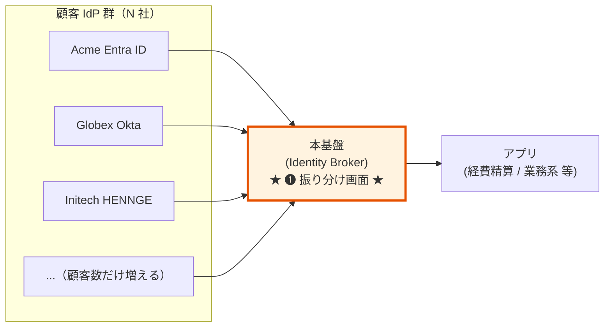
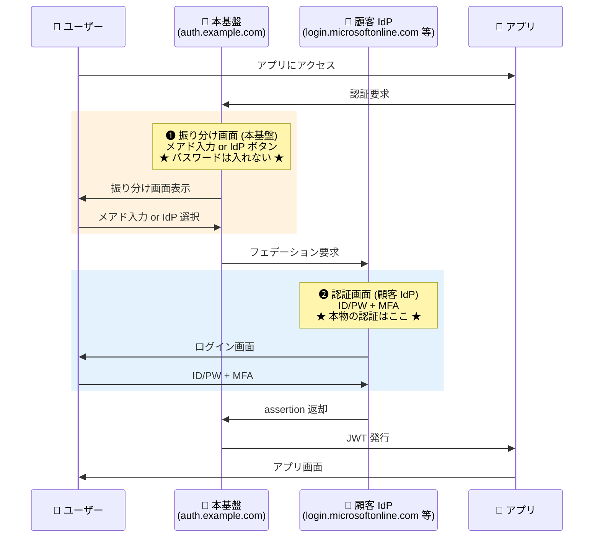
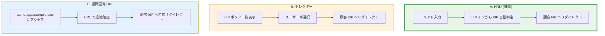
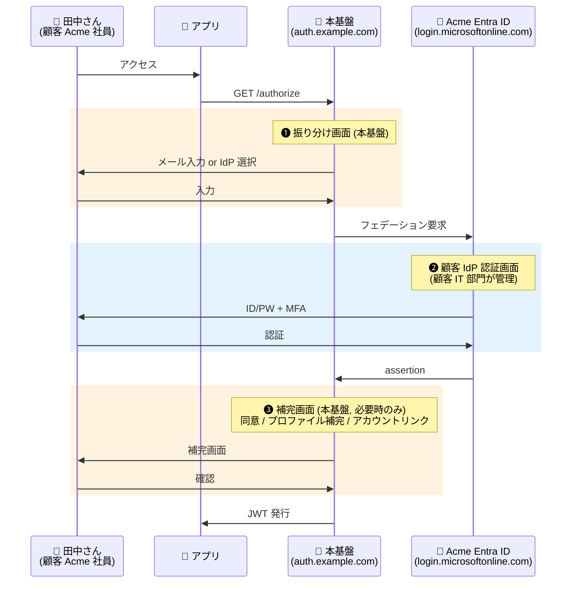
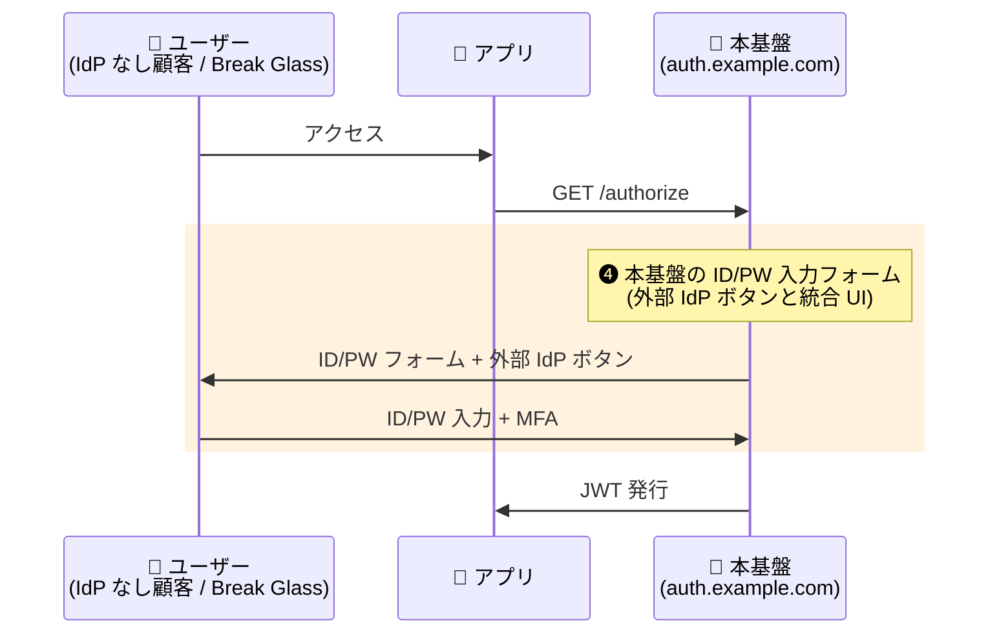

# §3.1 ログイン方式・画面設定 — スライド草案

> **本資料の位置づけ**: [powerpoint-outline-and-references.md §3.1](../powerpoint-outline-and-references.md) のスライド草案。**6 スライド構成**で、基本構造「**❶ 振り分け画面 + ❷ IdP 認証画面**」の 2 段構成を明示し、IdP 選択 UX (HRD / セレクター / 組織固有 URL) + Custom Domain + 画面所在の責務分担を示す。
> **対象**: 顧客（情シス / セキュリティ責任者 / アプリオーナー）
> **想定時間**: 12-15 分（質疑含む）
> **narrative 方針**: §3.2 と同じ「**基本構造の合意 → UX 選択肢 → ドメイン設計 → 責務分担 → ヒアリング**」順序

> **重要な誤解対策**: 「IdP に集約するなら IdP のログイン画面だけでは?」という顧客誤解への対応がスライド 1 の核心。**本基盤は Broker（中間者）であり、複数の顧客 IdP を束ねるため「振り分け画面 ❶」が必須**。Microsoft 365 / Slack / Notion / Salesforce など主要 B2B SaaS すべてに存在する画面で、業界標準である旨を最初に合意する。

---

## 全体構成

| # | スライドタイトル | メインメッセージ | 想定時間 |
|:-:|---|---|:-:|
| **1** | **基本構造: ❶ 振り分け画面 + ❷ IdP 認証画面** | 「**マルチテナント B2B SaaS の業界標準。本基盤は ❶ を統一提供、❷ は顧客 IdP に委ねる**」 | 3 分 |
| **2** | IdP 選択 UX 3 パターン（A / B / C）+ ハイブリッド | A. HRD 推奨、大口は C. 組織固有 URL 併用（業界実用解）| 3 分 |
| **3** | Custom Domain の設計判断 | 共通 1 つを推奨、Cognito は 4/Region Hard Limit 注意 | 2 分 |
| **4** | **画面所在マトリクス**（❶❷❸❹）と責務分担 | ローカル / フェデ ユーザーで経由画面が違う、❷ は顧客 IT 部門 | 3 分 |
| **5** | メールドメイン → IdP 解決ルール（HRD 採用時）| 1 ドメイン = 1 IdP が基本、複数ドメイン許容も可 | 1 分 |
| **6** | **ヒアリング項目一覧** | 顧客に確認する 4 項目（B-601 / B-208 / B-610 / B-618）| 1 分 |

---

## スライド 1: 基本構造 — ❶ 振り分け画面 + ❷ IdP 認証画面

### タイトル
**ログイン画面の基本構造 — 「振り分け画面 ❶ + IdP 認証画面 ❷」の 2 段構成**

### メインメッセージ
> **「本基盤は複数の顧客 IdP を束ねる Identity Broker。"どの IdP に飛ばすか" を決める画面（❶）が必須で、その後に顧客 IdP の認証画面（❷）が来る。これは Microsoft 365 / Slack / Notion / Salesforce と同じ業界標準構造です。」**

### ビジュアル（Mermaid 図 1: Broker 構造）



### ビジュアル（Mermaid 図 2: 画面遷移）



### 詳細テキスト

**❶ と ❷ は責務が決定的に違う**:

| 画面 | 所在 | やること | パスワード入力？ |
|---|---|---|:---:|
| **❶ 振り分け画面** | 本基盤（`auth.example.com`）| 「あなたはどの会社の人？」を識別 | **入力しない**（識別子のみ）|
| **❷ 認証画面** | 顧客 IdP（`login.microsoftonline.com` 等）| ID/PW + MFA で本人確認 | **入力する**（本物の認証）|

**業界主要 B2B SaaS すべて同じ構造**:

| サービス | ❶ 振り分け画面 | ❷ IdP 認証画面 |
|---|---|---|
| Microsoft 365 | メアド入力（`microsoft.com`）| Entra ID 画面（`microsoftonline.com`）|
| Slack | Workspace URL or メアド | 顧客 IdP の SSO 画面 |
| Notion | メアド → SSO 自動振り分け | 顧客 IdP 画面 |
| Salesforce | My Domain URL | 顧客 IdP 画面 |
| GitHub Enterprise SSO | IdP ボタン | 顧客 IdP 画面 |

### スピーカーノート
- **このスライドが最も重要**。ここを揃えないと「2 回ログインさせるのか?」誤解が後続でずっと続く
- 「**操作は 2 段階だが認証は 1 回**」を強調（パスワード入力は ❷ のみ）
- 「Microsoft 365 と同じ構造」と言うと納得しやすい
- 「顧客 IdP が 1 社しかない場合は ❶ を省略する設計もある（後述スライド 2 のパターン C）」と先回り
- ローカルユーザー（IdP を持たない顧客従業員）は ❷ もなく本基盤側で完結（スライド 4 で説明）

### 参考資料
- [§FR-2.3.3.A 画面所在マトリクスとカスタマイズ 3 パターン](../proposal/fr/02-federation.md#fr-233a-画面所在マトリクスとカスタマイズ-3-パターン)
- [§FR-2.3.3 ログイン画面で IdP 選択 UX](../proposal/fr/02-federation.md)
- [common/identity-broker-multi-idp.md](../../common/identity-broker-multi-idp.md)

---

## スライド 2: IdP 選択 UX 3 パターン + ハイブリッド

### タイトル
**❶ 振り分け画面の UX パターン — HRD / セレクター / 組織固有 URL**

### メインメッセージ
> **「業界推奨は A. HRD（メアド入力 → 自動振り分け）。複数顧客 × 複数サービスの場合は A 基本 + 大口顧客のみ C 併用が業界実用解。」**

### ビジュアル（Mermaid 図: 3 パターン比較）



### ビジュアル（比較表）

| 観点 | A. HRD | B. セレクター | C. 組織固有 URL | A+C ハイブリッド |
|---|:---:|:---:|:---:|:---:|
| **UX シンプルさ** | ◎ メール 1 回 | ○ ボタン選択 | ◎ URL で確定 | ◎ |
| **顧客追加リードタイム** | △ マッピング設定 | ◎ ボタン追加のみ | ⚠ DNS / 証明書要 | A+ C 両工程 |
| **顧客間混同リスク** | ❌ 他社ボタン見える | ❌ 他社ボタン見える | ✅ URL で完全分離 | 大口のみ ✅ |
| **ブランディング** | △ 共通 | △ 共通 | ✅ 組織別 | 大口のみ ✅ |
| **マルチテナント所属時** | ✅ メールで判定 | ⚠ 手動選択 | ⚠ 別 URL 訪問要 | A 側で判定 |
| **業界実例** | **Microsoft 365 / Slack** | GitHub / GitLab | Slack Workspace / Notion | **Microsoft 365 + Enterprise / Atlassian** |
| **推奨度** | ⭐ **業界推奨** | ○ | ○（大口向け）| ⭐ **業界実用解** |

### 詳細テキスト

**A 案（HRD）のフロー**:
1. ユーザーがメアド入力（例: `alice@acme.com`）
2. 本基盤がドメイン部 `acme.com` を解決ロジックに渡す
3. ドメイン → IdP マッピングテーブルで `Acme Entra ID` と特定
4. Acme Entra ID にフェデーション要求 → ❷ に遷移

**A+ C ハイブリッド構成（推奨）**:
- 一般顧客 → `auth.example.com` で A. HRD
- 大口エンタープライズ顧客 → `acme.auth.example.com` で C. 組織固有 URL
- 内部的には Single Realm + CloudFront Function で `kc_idp_hint` 自動付与（Keycloak の場合）
- **Cognito 採用時は Custom Domain 4/Region Hard Limit に注意**（C 顧客最大 3 社まで）

### スピーカーノート
- 「**A 推奨**」を明言（Microsoft 365 / Slack も A）
- 「大口顧客 = 専用感を求める = C 併用」が現実解
- 全顧客一律 C は Cognito で詰む（Hard Limit）、Keycloak でも運用負荷大
- 「B（セレクター）は ❶ で全顧客の IdP ボタンが見えるため、機密性を気にする顧客は嫌う」を補足

### 参考資料
- [§FR-2.3.3 3 案併記](../proposal/fr/02-federation.md)
- [§FR-2.3.3.C Keycloak でのハイブリッド構成リファレンス](../proposal/fr/02-federation.md#fr-233c-keycloak-でのハイブリッド構成リファレンス基本-a--大口顧客のみ-c)
- [hearing-script/06-multitenancy.md B-601, B-618](../hearing-script/06-multitenancy.md)
- [Home Realm Discovery (Shibboleth)](https://shibboleth.atlassian.net/wiki/spaces/SP3/pages/2065335462/HomeRealmDiscovery)

---

## スライド 3: Custom Domain の設計判断

### タイトル
**Custom Domain — 認証エンドポイント URL の所在**

### メインメッセージ
> **「共通 1 つ（`auth.example.com`）が推奨。Cognito 採用時は Custom Domain 4/Region Hard Limit が C 案併用数の天井。」**

### ビジュアル（設計判断表）

| パターン | URL 例 | UX 案との整合 | 採用シーン | 推奨度 |
|:-:|---|---|---|:-:|
| **共通 1 つ** | `auth.example.com` | A. HRD / B. セレクター | **一般的な B2B SaaS** | ⭐ **推奨** |
| **顧客別** | `acme.auth.example.com` / `globex.auth.example.com` | C. 組織固有 URL | 大口顧客 + ハイブリッド | ○（限定）|
| **なし** | プラットフォーム標準（`xxx.auth.us-east-1.amazoncognito.com` 等）| — | PoC / 非本番のみ | ✕（本番不可）|

### 詳細テキスト

**共通 1 つを推奨する理由**:
- ✅ **フィッシング耐性**: ユーザーが「`auth.example.com` だけが正規」と覚えられる
- ✅ **DR 時の URL 統一**: 東京/大阪リージョン切替時も URL 変わらず
- ✅ **証明書管理が 1 つで済む**: ACM 証明書 1 枚で運用
- ✅ **Custom Domain 上限消費が最小**: Cognito 4/Region のうち 1 つだけ使う

**プラットフォーム別の制約**:

| プラットフォーム | 実現方法 | Hard Limit |
|---|---|---|
| **Cognito** | Hosted UI Custom Domain + ACM 証明書 | **4 / Region**（Custom Domain）|
| **Keycloak** | Hostname 設定 + ALB + ACM 証明書 | 実質上限なし（ALB Listener Rule 数で律速）|

→ **Cognito でハイブリッド構成（A+ C）を組む場合、C 採用顧客は実質 3 社が天井**（共通用 1 つ + 顧客別 3 つ = 計 4）。これを超える要件なら Keycloak 採用を検討。

### スピーカーノート
- 「フィッシング耐性 + DR + 証明書 の 3 観点で共通 1 つが有利」を強調
- Cognito の 4 上限は契約フェーズで顧客に明示すべき制約
- 顧客から「弊社専用 URL がいい」と言われたら → ハイブリッド構成（スライド 2 参照）で対応

### 参考資料
- [§FR-2.1 Custom Domain ベースライン](../proposal/fr/02-federation.md)
- [hearing-script/02-idp-federation.md B-208](../hearing-script/02-idp-federation.md)
- [Cognito Managed Login Branding 公式](https://docs.aws.amazon.com/cognito/latest/developerguide/managed-login-brandings.html)

---

## スライド 4: 画面所在マトリクス（❶❷❸❹）と責務分担

### タイトル
**画面の責務分担 — フェデユーザー / ローカルユーザーで経由画面が違う**

### メインメッセージ
> **「❶❸❹ は本基盤が描画（カスタマイズ可）、❷ は顧客 IdP が描画（顧客 IT 部門の責務）。」**

### ビジュアル（Mermaid 図 1: フェデユーザー画面遷移）



### ビジュアル（Mermaid 図 2: ローカルユーザー画面遷移）



### 詳細テキスト

**4 つの画面と責務分担**:

| 画面 | 物理的所在 | 誰が管理 | カスタマイズ可? | 主な利用者カテゴリ |
|---|---|---|:---:|---|
| **❶ 振り分け画面**（IdP セレクター or HRD）| 本基盤（`auth.example.com`）| 本基盤チーム | ✅ A-11 / A-11-α 対象 | P-3 フェデユーザー |
| **❷ 顧客 IdP 認証画面**（ID/PW + MFA）| **顧客 IdP**（`login.microsoftonline.com` 等）| **顧客 IT 部門** | ❌ **本基盤管轄外** | P-3 フェデユーザー |
| **❸ 補完画面**（同意 / プロファイル補完 / リンク確認）| 本基盤 | 本基盤チーム | ✅ 対象（初回ログイン時のみ）| P-3 + 初回 |
| **❹ ID/PW 入力フォーム**（ローカル + 外部 IdP ボタン統合 UI）| 本基盤 | 本基盤チーム | ✅ 対象 | P-2 / P-4 / P-5 ローカル |

**❷ は本基盤からは触れない理由**:
- ブラウザの URL バーが `login.microsoftonline.com` を指している間、本基盤の JS は **Same-Origin Policy** によりその DOM を触れない（XSS / CSRF 対策の根幹）
- 「顧客 Entra ID のログイン画面のデザインも変えたい」要望は **Entra Admin Center > Company Branding 機能** で顧客 IT 部門が設定する

**App Client 単位で「誰が見るか」を制御可能**:

| App Client | 設定 | 表示 UI | 採用シーン |
|---|---|---|---|
| 経費精算（フェデ強制）| 外部 IdP のみ許可 | IdP ボタンのみ | γ シナリオ |
| 管理画面（ローカル専用）| ローカル Pool のみ許可 | ID/PW フォームのみ | 管理者専用 |
| 汎用アプリ（フェデ + ローカル）| 両方許可 | 統合 UI | β シナリオ |

### スピーカーノート
- 「**❷ は本基盤の責務外**」を契約・SOW 段階で必ず明示（顧客 IT 部門への依頼事項）
- ブランディング詳細は §2.5 で別途扱う（このスライドでは責務分担のみ）
- A-11（アプリ別ブランディング）/ A-11-α（顧客別ブランディング）の対象範囲が ❶❸❹ であることを示す

### 参考資料
- [§FR-2.3.3.A 画面所在マトリクスとカスタマイズ 3 パターン](../proposal/fr/02-federation.md#fr-233a-画面所在マトリクスとカスタマイズ-3-パターン)
- [§FR-2.3.3.A フェデユーザー / ローカルユーザーの画面遷移と責務分担](../proposal/fr/02-federation.md)
- [hearing-script/00-common.md A-11, A-11-α](../hearing-script/00-common.md)

---

## スライド 5: メールドメイン → IdP 解決ルール（HRD 採用時）

### タイトル
**HRD 採用時のドメイン解決ルール — 1 ドメイン = 1 IdP を基本**

### メインメッセージ
> **「`@acme.com` → Acme Entra ID の 1 対 1 マッピングが基本。顧客が複数ドメインを持つ場合は N 対 1 を許容。」**

### ビジュアル（解決ルール表）

| パターン | 例 | 設計可? | 設定方法 |
|:-:|---|:---:|---|
| **1 ドメイン = 1 IdP**（標準）| `@acme.com` → Acme Entra ID | ✅ **基本** | マッピングテーブル 1 行 |
| **1 顧客に複数ドメイン**（N 対 1）| `@acme.com`, `@acme-corp.co.jp` → Acme Entra ID | ✅ **許容** | マッピングテーブル N 行（同じ IdP に向ける）|
| **1 ドメインに複数 IdP**（1 対 N）| `@acme.com` → どれか選択 | ⚠ レアケース | 二段階選択 UI 必要（推奨外）|
| **不明ドメイン**（マッピングなし）| `@unknown.com` | △ | 「組織が見つかりません」エラー or ローカルログインへフォールバック |

### 詳細テキスト

**標準フロー（1 対 1）**:
```
alice@acme.com 入力
  ↓
ドメイン部 = "acme.com" 抽出
  ↓
マッピングテーブル lookup: acme.com → idp_acme_entra
  ↓
identity_provider=idp_acme_entra で認証要求
  ↓
Acme Entra ID にリダイレクト
```

**マッピング設計の TBD**:
- ドメイン部のみで解決 (`acme.com` だけ見る) vs サブドメイン考慮 (`sales.acme.com` を別扱い)
- ワイルドカード許容（`*.acme.com` → Acme Entra）するか
- マッピングテーブルの管理 UI（管理画面 / Terraform / 顧客セルフサービス）

### スピーカーノート
- B-610 で確認（HRD = A 案採用時のみ）
- 1 対 N（1 ドメインに複数 IdP）はユーザー混乱を招くため業界では避けられる
- 不明ドメインの挙動は「ローカルフォールバック」「明示的エラー」を顧客と合意

### 参考資料
- [§FR-2.3.3 A 案フロー](../proposal/fr/02-federation.md)
- [hearing-script/06-multitenancy.md B-610](../hearing-script/06-multitenancy.md)

---

## スライド 6: ヒアリング項目一覧 — 御社に確認する 4 項目

### タイトル
**ヒアリング項目 — ログイン方式・画面設定 関連 4 項目**

### メインメッセージ
> **「以下 4 項目について、御社の方針をお聞かせください」**

### ヒアリング項目表

| # | 項目 ID | 確認内容 | 期待回答形式 | 重要度 |
|:-:|---|---|---|:-:|
| 1 | **B-601** ⭐ | **IdP 選択 UX 案** | **A. HRD（推奨）/ B. セレクター / C. 組織固有 URL** | 🔥 |
| 2 | **B-208** | **Custom Domain** | 共通 1 つ（推奨）/ 顧客別 / なし | 🟡 |
| 3 | **B-610** | メールドメイン → IdP 解決ルール（B-601 で A 採用時のみ）| 1 対 1 / N 対 1 / 1 対 N | 🟢 |
| 4 | **B-618** ⭐ | **A+ C ハイブリッド構成採用方針** | **採用（大口のみ C）/ 採用しない / 検討中 + C 経由顧客見込み数** | 🟡 |

### 補助項目（必要に応じて）

| # | 項目 ID | 確認内容 |
|:-:|---|---|
| - | A-11 | アプリ別ブランディングの要否（→ §2.5 で詳細） |
| - | A-11-α | 顧客別ブランディングの要否（→ §2.5 で詳細）|
| - | B-609 | IdP 情報の受領形式（→ §5.4 オンボーディングで詳細）|
| - | B-615 | 新基盤導入時のドメイン変更計画（→ §5.4）|

### スピーカーノート
- **B-601 と B-618 が最重要**（UX 全体の意思決定に直結）
- B-208 は Cognito 採用時の制約（4/Region）を必ず添える
- B-610 は B-601 で A 採用時のみ深掘り、B/C 採用時はスキップ可

### 参考資料
- [hearing-checklist.md §3.1, §4.4](../hearing-checklist.md)
- [hearing-checklist-excel-main.tsv](../hearing-checklist-excel-main.tsv)（M2 ヒアリング回タグ）

---

## まとめ用スライド（任意、章末用）

### タイトル
**ログイン方式・画面設定 — まとめ**

### メインメッセージ

| 観点 | 本基盤の方針 |
|---|---|
| **基本構造** | **❶ 振り分け画面（本基盤）+ ❷ IdP 認証画面（顧客 IdP）の 2 段構成**（業界標準）|
| **IdP 選択 UX** | **A. HRD を推奨**、大口顧客は C. 組織固有 URL 併用（**A+ C ハイブリッド**）|
| **Custom Domain** | **共通 1 つ**（`auth.example.com`）を推奨、Cognito は 4/Region 上限 |
| **画面責務分担** | **❶❸❹ は本基盤 / ❷ は顧客 IdP**（顧客 IT 部門の責務）|
| **ブランディング** | §2.5 で別途扱う（A-11 / A-11-α）|
| **認証フロー** | §3.6 で別途扱う（Authorization Code+PKCE 等）|

### 検討ポイント（顧客側）

- [ ] **IdP 選択 UX**（A / B / C / ハイブリッド）の方針確定
- [ ] **Custom Domain** の取得・DNS 設定可否（ACM 証明書含む）
- [ ] **大口顧客の C 経由予定数**（Cognito 4 上限内か）
- [ ] **❷ 顧客 IdP 画面のカスタマイズ依頼**（顧客 IT 部門への依頼内容）

---

## 制作 Tips

### Mermaid 図の PowerPoint への取り込み

| 方法 | 手順 |
|---|---|
| **A. スクリーンショット** | Mermaid を [mermaid.live](https://mermaid.live/) でレンダリング → PNG ダウンロード → 貼り付け |
| **B. ベクター化** | mermaid.live で SVG エクスポート → PowerPoint に貼り付け（拡縮可）|
| **C. 手動再描画** | Mermaid 内容を PowerPoint Shape で再描画（編集可能、推奨）|

### 色使い指針

| 用途 | 色 |
|---|---|
| **本基盤画面**（❶❸❹）| オレンジ系 `#fff3e0` / `#e65100` |
| **顧客 IdP 画面**（❷）| 青系 `#e3f2fd` / `#1565c0` |
| **アプリ画面** | 緑系 `#e8f5e9` / `#2e7d32` |
| **推奨パターン** | 緑強調 + ⭐ |
| **非推奨 / アンチパターン** | 赤系 `#ffe0e0` / `#cc0000` |

### スライドあたり時間配分

| シーン | 時間 |
|---|---|
| 説明 | 1.5-2 分 |
| 質疑（ハイライト） | 0.5-1 分 |
| 章間移動 | 30 秒 |

### よくある顧客質問への回答テンプレート

| 質問 | 回答骨子 |
|---|---|
| 「IdP に集約するなら IdP の画面だけでは?」 | スライド 1 を引用: 「本基盤は複数の顧客 IdP を束ねる Broker。"どの IdP に飛ばすか" を決める画面が必須。Microsoft 365 と同じ構造」|
| 「フェデなのに 2 回ログインさせるのか?」 | 「操作は 2 段階（❶ 識別子入力 + ❷ 認証）ですが、認証（パスワード入力）は 1 回だけです。これは Microsoft 365 / Slack 等の業界標準です」|
| 「弊社専用のログイン画面にしてほしい」 | スライド 2 の C 案 + ハイブリッド構成を提示。Cognito の場合は 4 上限を明示 |
| 「Entra ID のログイン画面のデザインも変えたい」 | スライド 4 を引用: 「❷ は本基盤管轄外。Entra Admin Center > Company Branding で顧客 IT 部門が設定」|

---

## 関連スライド草案

- §2.5 顧客別ブランディング（未作成）— ❶❸❹ の見た目カスタマイズ詳細
- §3.2 MFA 要件 + ステップアップ認証（作成済）
- §3.3 ローカルユーザー認証ポリシー（未作成）
- §3.4 認可スタンス + JWT クレーム + API 認可フロー（未作成）
- §3.5 ITDR 統合戦略（未作成）
- §3.6 認証フロー一覧（未作成）— Authorization Code+PKCE 等の**プロトコル**フロー

---

## 改訂履歴

| 日付 | 内容 |
|---|---|
| 2026-06-03 | 初版。「❶ 振り分け画面 + ❷ IdP 認証画面の 2 段構成」を最初に合意する narrative で 6 スライド構成。「IdP に集約 = IdP 画面のみ」誤解への対策を中核に据えた |
