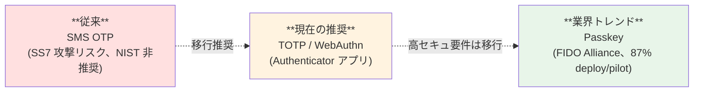

# §3.2 MFA 要件（初回認証）— スライド草案

> **本資料の位置づけ**: [powerpoint-outline-and-references.md §3.2](../powerpoint-outline-and-references.md) のスライド草案。**6 スライド構成**で、基本方針「**MFA は顧客 IdP に委ねる**」+ 例外パターン（ローカルユーザー / 高権限ロール / 規制業種）を示す。
> **対象**: 顧客（情シス / セキュリティ責任者 / アプリオーナー）
> **想定時間**: 12-15 分（質疑含む）
> **narrative 方針**: §1.3 と同じ「**基本（集約 = 顧客 IdP 任せ）→ 例外対応**」順序
>
> **スコープ注記（2026-06-03 修正）**: 本スライドは「**初回ログイン時の MFA**」のみを扱う。
> - **強制再認証**（退職検知 / Risk / 管理者操作で **システム側がセッションを切断**）→ [§4.6](../powerpoint-outline-and-references.md#46-強制再認証ステップアップ認証forced--step-up-re-authentication) で別途扱う
> - **ステップアップ認証**（高権限操作時に **アプリ側が追加 MFA を要求**, RFC 9470）→ [§4.6](../powerpoint-outline-and-references.md#46-強制再認証ステップアップ認証forced--step-up-re-authentication) で別途扱う
> - 本スライド内のステップアップ MFA への言及は「**例外パターン② / 信頼レベル『部分信頼』** の概要紹介」に留め、ポリシー詳細・トリガー一覧・実装方式は §4.6 へ委譲

---

## 全体構成

| # | スライドタイトル | メインメッセージ | 想定時間 |
|:-:|---|---|:-:|
| **1** | **基本方針: MFA は顧客 IdP に委ねる** | 「**フェデユーザの MFA は顧客 IdP の責務、認証基盤は強制しない**」 | 2 分 |
| **2** | 業界標準への準拠 | NIST SP 800-63 / Auth0 / Microsoft Entra も federation MFA 信頼 | 2 分 |
| **3** | **例外パターン 3 つ**（基盤側で MFA が必要なケース）| ローカルユーザー / 高権限ロール / 規制業種 | 3 分 |
| **4** | 顧客 IdP MFA の信頼レベル設定 | `amr` / AuthnContextClassRef の信頼判定、3 パターン | 2 分 |
| **5** | NIST AAL レベルと MFA 方式 | AAL1 / AAL2（推奨）/ AAL3 の整理 + Passkey 業界動向 | 3 分 |
| **6** | **ヒアリング項目一覧** | 顧客に確認する 8 項目（B-501〜509, C-210〜216）| 2 分 |

---

## スライド 1: 基本方針 — MFA は顧客 IdP に委ねる

### タイトル
**MFA 基本方針 — 顧客 IdP に委ね、認証基盤では強制しない**

### メインメッセージ
> **「フェデユーザ（顧客企業の従業員）の MFA は、顧客 IdP（Entra ID / Okta / HENNGE 等）で実施いただき、認証基盤側では再要求しません。」**

### ビジュアル（Mermaid 図）

```mermaid
flowchart LR
    User[ユーザー<br/>alice@acme.com]
    CustIdP["顧客 IdP<br/>(Acme Entra ID)<br/>★MFA 実施★"]
    Core["共通認証基盤<br/>MFA 強制せず<br/>顧客 IdP の MFA を信頼"]
    App[アプリ]

    User -->|ID/PW + MFA| CustIdP
    CustIdP -->|認証済 + amr=mfa| Core
    Core -->|JWT 発行| App

    style CustIdP fill:#e8f5e9,stroke:#2e7d32,stroke-width:3px
    style Core fill:#fff3e0,stroke:#e65100
```

### 詳細テキスト

**この方針のメリット**:
- ✅ **二重 MFA 回避** — ユーザーは 1 度の MFA で全アプリ利用可（UX 最適化）
- ✅ **顧客のセキュリティポリシー尊重** — 各顧客の MFA 方針（強度 / 方式 / 例外）を顧客自身が決定
- ✅ **運用負荷の最小化** — 基盤側で MFA デバイス登録・リセット等の運用不要

### スピーカーノート
- 「業界主流は federation MFA 信頼」を強調
- 「再要求すると **「フェデなのに 2 回ログイン」誤解** が発生」と注意喚起
- 顧客の不安に先回り: 「**例外はあります、次のスライドで説明します**」

### 参考資料
- [ADR-009 MFA Responsibility by IdP](../../adr/009-mfa-responsibility-by-idp.md)
- [hearing-script/05-mfa.md B-506 外部 IdP MFA 信頼度](../hearing-script/05-mfa.md)
- [§FR-2.2.3 MFA 重複回避](../proposal/fr/02-federation.md)

---

## スライド 2: 業界標準への準拠

### タイトル
**業界標準 — Federation MFA 信頼は B2B SaaS の常識**

### メインメッセージ
> **「主要 IDaaS（Auth0 / Microsoft Entra / Okta）も、B2B Federation 経由の MFA を信頼するのが既定動作」**

### ビジュアル（比較表）

| サービス | Federation MFA 信頼の既定 | 根拠資料 |
|---|---|---|
| **NIST SP 800-63** | ✅ AAL を IdP 経由で継承可能 | [NIST SP 800-63B Rev 4 §6 Federation](https://pages.nist.gov/800-63-4/sp800-63b.html) |
| **Microsoft Entra B2B** | ✅ Home IdP の MFA を Resource Tenant 側で信頼 | [Microsoft Entra B2B Cross-Tenant Access](https://learn.microsoft.com/en-us/entra/external-id/cross-tenant-access-settings-b2b-collaboration) |
| **Auth0 B2B** | ✅ Federated IdP MFA を信頼（既定）| [Auth0 B2B Multi-tenancy](https://auth0.com/blog/demystifying-multi-tenancy-in-b2b-saas/) |
| **Okta B2B** | ✅ 同上 | [Okta Workforce Identity](https://www.okta.com/products/) |

### 詳細テキスト

**なぜ業界はこの方針か**:
1. **顧客 IdP は AAL を保証する責任を持つ**（Microsoft / Okta は SOC 2 / ISO 27001 認証）
2. **二重 MFA は UX を著しく損なう** — 業界 87% の B2B SaaS が federation MFA を信頼
3. **federation = trust contract** — IdP 間の信頼関係こそ federation の本質

### スピーカーノート
- 「**御社だけ二重 MFA を要求すると、業界標準から外れます**」と説明
- 業界実例を 1-2 個提示（Slack / Notion / Box の federation MFA 信頼）

### 参考資料
- [NIST SP 800-63B Rev 4 §6 Federation Assertions](https://pages.nist.gov/800-63-4/sp800-63b.html)
- [Microsoft Entra B2B Cross-Tenant Access Settings](https://learn.microsoft.com/en-us/entra/external-id/cross-tenant-access-settings-b2b-collaboration)
- [Auth0 B2B Multi-tenancy Guide](https://auth0.com/blog/demystifying-multi-tenancy-in-b2b-saas/)

---

## スライド 3: 例外パターン 3 つ — 基盤側で MFA が必要なケース

### タイトル
**例外パターン — 基盤側で MFA を実施する 3 ケース**

### メインメッセージ
> **「基本は顧客 IdP に任せますが、以下の 3 ケースは基盤側で MFA を実施します」**

### ビジュアル（例外パターン表）

| 例外ケース | 対象 | 基盤側で行う MFA | 理由 |
|---|---|---|---|
| **① ローカルユーザー** | P-4（IdP なし顧客従業員）/ P-5（Break Glass）/ P-6（B2C）| 基盤側で**必須** | 顧客 IdP が存在しないため、基盤側で MFA する以外に手段なし |
| **② 高権限ロール** | テナント管理者 / 基盤運用者（P-1, P-2）等 | **ステップアップ MFA**（必要時のみ追加）**→ 詳細は §4.6** | 高権限操作（ロール付与 / IdP 設定変更 等）は追加保証が必要 |
| **③ 規制業種顧客** | 金融 / 医療 / 政府系 | **AAL レベル検証**（IdP MFA + 基盤側で AAL 整合確認）| FFIEC / HIPAA 等の規制で IdP MFA だけでは不十分なケース |

### 詳細テキスト

**①ローカルユーザー詳細**:
- 顧客 IdP を持たない顧客企業（中小企業の一部）の従業員
- Break Glass 用ローカル管理者（弊社運用者の緊急アクセス）
- B2C コンシューマーユーザー
- → これらは**基盤側で MFA を提供する以外の選択肢がない**

**②高権限ロール（ステップアップ MFA, RFC 9470）** — **詳細は §4.6 へ委譲**:
- 通常操作は MFA なし or 顧客 IdP MFA で許可
- 「ユーザー削除」「ロール変更」「IdP 設定変更」等の**高権限操作の直前に追加 MFA を要求**
- 業界標準（GitHub / AWS / Google Workspace）でも採用
- ➡ **トリガー定義・実装方式・ヒアリング項目は [§4.6 強制再認証・ステップアップ認証](../powerpoint-outline-and-references.md#46-強制再認証ステップアップ認証forced--step-up-re-authentication) で扱う**

**③規制業種顧客**:
- 金融（FFIEC）/ 医療（HIPAA）等で **AAL3 必須**
- 顧客 IdP MFA で AAL3 を満たしているか **`amr` / AuthnContextClassRef で検証**
- 不足する場合は基盤側で**追加 MFA**を要求

### スピーカーノート
- 「**御社のお客様の業界は?**」を確認
- ローカルユーザーの有無を確認（採用シナリオ α/β/γ/δ）

### 参考資料
- [hearing-script/05-mfa.md B-501 MFA 必須範囲, B-508 高権限ロール](../hearing-script/05-mfa.md)
- §4.6 強制再認証・ステップアップ認証（ステップアップ MFA / RFC 9470 / C-216 の詳細はそちら）
- [hearing-script/10-security-compliance.md C-216 ステップアップ認証（RFC 9470）](../hearing-script/10-security-compliance.md)
- [RFC 9470 OAuth Step-up Authentication Challenge Protocol](https://datatracker.ietf.org/doc/html/rfc9470)

---

## スライド 4: 顧客 IdP MFA の信頼レベル設定

### タイトル
**顧客 IdP MFA の信頼レベル — `amr` クレーム検証**

### メインメッセージ
> **「顧客 IdP が "MFA 実施済" と言っていることを、基盤側で `amr` / AuthnContextClassRef で検証します」**

### ビジュアル（信頼レベル表、4 パターン）

| 信頼パターン | 内容 | 基盤側挙動 | 採用シーン | 推奨度 |
|:-:|---|---|---|:-:|
| **全面信頼** | 顧客 IdP の MFA をそのまま信頼 | `amr=mfa` があれば追加 MFA 不要 | 一般的な B2B SaaS（IdP MFA 設定済顧客）| ⭐ **業界標準** |
| **信頼レベル評価（条件付き）** ★NEW | `amr` 評価して未実施なら基盤側で MFA 補完 | `amr=mfa` あり → スキップ / なし → WebAuthn 補完 | **MFA 設定済 / 未設定顧客が混在する場合** | ⭐⭐ **本基盤推奨**（[§FR-3.4 案 3](../proposal/fr/03-mfa.md)）|
| **部分信頼** | 高権限ロールのみ追加検証 | ロール別にステップアップ MFA（§4.6）| 規制業種 + 高権限混在 | ◎ |
| **全件再要求** | 顧客 IdP MFA を無視、基盤側で必ず再 MFA | 二重 MFA 強制 | レガシー、業界推奨外 | ✕ アンチパターン |

### 詳細テキスト

**`amr`（Authentication Methods References）クレーム**:
```json
{
  "sub": "alice@acme.com",
  "amr": ["pwd", "mfa", "otp"],   ← 顧客 IdP が「MFA 済」と宣言
  "acr": "urn:mace:incommon:iap:bronze",
  ...
}
```

**信頼する `amr` 値の例**:
- `mfa` — 一般的な MFA（OIDC 標準）
- `otp` — OTP（TOTP / HOTP）
- `hwk` — ハードウェアキー（FIDO2 / YubiKey）
- `mca` — Multi-Channel Authentication
- AuthnContextClassRef: `urn:oasis:names:tc:SAML:2.0:ac:classes:MultiFactorContract`（SAML）

**設計判断**:
- どの `amr` 値を「MFA 済」として信頼するか（B-507）
- 顧客 IdP ごとに `amr` 値が違う（Entra / Okta / HENNGE）

### 🎯 信頼レベル評価方式（条件付き）の詳細（2026-06-08 追加、[§FR-3.4](../proposal/fr/03-mfa.md) 連動）

**動作**:
```
顧客 IdP からの amr クレーム評価
├─ amr に "mfa" / "otp" / "hwk" / "mca" / "fpt" 等あり → 基盤側 MFA スキップ ★UX 維持★
└─ amr 上記値なし or 空 → 基盤側で WebAuthn / Passkey で MFA 補完
```

**データ最小化の観点（重要）**:

| データ | 全面信頼（IdP MFA 済顧客）| 信頼レベル評価（MFA 補完対象）| 全件再要求（アンチパターン）|
|---|:-:|:-:|:-:|
| WebAuthn 公開鍵 | ❌ 持たない | ✅ 補完対象のみ保持（ゼロ価値）| 全ユーザー分（無駄）|
| TOTP Secret | ❌ 持たない | ⚠ WebAuthn 不可ユーザーのみ（KMS 暗号化）| 全ユーザー分（リスク大）|
| パスワード | ❌ 顧客 IdP 側 | ❌ 顧客 IdP 側 | ❌ 顧客 IdP 側 |
| データ最小化 | ✅ 最高 | ✅ **高（公開鍵主体）** | ❌ 最大データ量 |

→ **信頼レベル評価方式 + WebAuthn 主体採用 で「基盤側で持つ MFA データは実質ゼロ価値の公開鍵のみ」を実現**。

**全利用者カテゴリの 4 ケース完全整理**（[§FR-3.4.0.B](../proposal/fr/03-mfa.md) 連動）:

| ケース | ユーザー類型 | 顧客 IdP 経由 | 基盤側 MFA | 基盤側パスワード | 基盤側 MFA データ | データ評価 |
|:-:|---|:-:|:-:|:-:|:-:|:-:|
| **A** | **P-3 IdP MFA 済**（amr 評価で済判定）| ✅ | ❌ スキップ | ❌ なし | ❌ **なし** | ✅✅ **完全ゼロ** |
| **B** | **P-3 IdP MFA 未済 + WebAuthn 可** | ✅ | ✅ WebAuthn | ❌ なし | ✅ **公開鍵のみ**（ゼロ価値）| ✅ **実質ゼロ** |
| **C** | **P-3 IdP MFA 未済 + WebAuthn 不可**（古いデバイス、約 5%）| ✅ | ✅ TOTP | ❌ なし | ⚠ **TOTP Secret**（KMS 暗号化）| ◯ **低リスク** |
| **D** | **ローカルユーザー**（P-1/P-2/P-4/P-5/P-6）| ❌ | ✅ 必須 | ⚠ bcrypt/Argon2 ハッシュ | ✅ WebAuthn / ⚠ TOTP | ◯ **必須要件** |

→ **ケース A + B + C で全フェデユーザーを網羅、ケース D でローカルユーザーを別軸カバー**。**4 ケース全てで MFA 強制を確保**しつつ、**センシティブな MFA Secret は実質 5% 以下のユーザー分のみ**。

**重要な認識ポイント**:
- ✅ 「**1 (IdP 側 MFA) + 2 (基盤側 MFA)**」で網羅できるのは **フェデユーザーのみ**
- ⚠ **ローカルユーザー（P-1/P-2/P-4/P-5/P-6）は別軸**（ケース D、§3.2 例外パターン①でカバー）
- ⚠ 「**WebAuthn なら危険な情報持たない**」は **WebAuthn 可能ユーザーのみ**、不可ユーザーは TOTP フォールバック（KMS 暗号化で実質低リスク）
- ⚠ `amr` 不送出 / 単要素のみ `amr` の IdP は **ケース B / C へ自動流入**

→ **WebAuthn / Passkey 主体採用 + Trust Device 機能で UX 影響最小化、4 ケース完全カバー**。

### 🎯 amr 不送出 IdP の振る舞い（2026-06-11 追加、よくある懸念への回答）

**Q: amr クレームを送出しない顧客 IdP（ADFS / 独自 IdP 等）の場合、MFA なしで認証されてしまうのでは?**
**A: 安全側で「未済」扱い → 自動的に基盤側 MFA 補完が起動、MFA なし認証は起こらない**

**amr の 4 パターンと本基盤の動作**:

| 顧客 IdP の amr | 例 | 判定 | 動作 |
|---|---|:-:|---|
| **送出なし**（属性自体存在しない）| `{"sub":"...","iss":"..."}` (amr なし) | ⚠ 判定不可 → 安全側「未済」 | **基盤側 MFA 補完** |
| **空配列** | `"amr":[]` | ⚠ 同上 | **基盤側 MFA 補完** |
| **単要素のみ**（pwd 等）| `"amr":["pwd"]` | ❌ 未済 | **基盤側 MFA 補完** |
| **MFA 系含む** | `"amr":["pwd","mfa"]` | ✅ 済 | スキップ |

→ **「amr がない = MFA なし認証」ではなく、「amr がない = 安全側で未済扱い → 基盤側で MFA 補完」**。これが業界主流（Microsoft Entra B2B / Auth0 / Okta も同パターン）。

**顧客 IdP 別の amr 送出実態**:

| 顧客 IdP | amr 送出 | 設定要否 | 本基盤の動作 |
|---|:-:|---|---|
| Microsoft Entra ID / Okta / Google Workspace | ✅ デフォルト送出 | 不要 | amr 評価可能 |
| **ADFS / 独自 IdP** | ⚠ **デフォルト送出しない**（Claim Rule 設定時のみ）| 顧客側で要設定（任意）| **設定なし = 未済扱い → 基盤側 MFA 補完** |

→ **顧客に Claim Rule 設定を強制する必要はなく**、未設定でも本基盤側で MFA 必須化を確保（PCI DSS 8.3 適合）。

### 🎯 OIDC / SAML 別の MFA 評価対象（2026-06-11 追加、Salesforce 事例ベース）

**重要: amr は OIDC 専用、SAML では別のクレーム/属性を評価する必要あり**

| プロトコル | 評価対象 | 例 | 補足 |
|---|---|---|---|
| **OIDC** | `amr` クレーム | `["pwd", "mfa", "otp"]` | RFC 8176 標準 |
| **SAML 標準** | `AuthnContextClassRef` | `urn:oasis:names:tc:SAML:2.0:ac:classes:MultiFactorContract` | Okta / Google Workspace / Shibboleth |
| **SAML (Microsoft 拡張)** | `authnmethodsreferences` | `["mfa", "multipleauthn"]` | **Microsoft Entra SAML 専用**（AuthnContextClassRef は MFA 判定に使えない仕様）|

**顧客 IdP × プロトコル別の評価対象**:

| 顧客 IdP | OIDC 経由 | SAML 経由 |
|---|:-:|:-:|
| Microsoft Entra ID | ✅ amr | ⚠ **AuthnContextClassRef は無効**、authnmethodsreferences で評価 |
| Okta | ✅ amr | ✅ AuthnContextClassRef |
| Google Workspace | ✅ amr | ✅ AuthnContextClassRef |
| ADFS | △ Claim Rule 設定時のみ | △ Claim Rule 設定時のみ |

**業界事例**: Salesforce も OIDC / SAML で評価方法を分けて実装（2026-02-17 update で Entra の `multipleauthn` 値もサポート追加）。

**本基盤の実装方針**: 統一 User Attribute `mfa_indicator` への正規化により、Conditional Authenticator は単一属性のみ評価で済む設計（[jit-scim-coexistence-keycloak.md §10.8.5.C](../../common/jit-scim-coexistence-keycloak.md) 参照）。

→ **新規顧客 IdP 追加時の影響範囲が IdP 設定内に閉じ、Conditional Authenticator は変更不要**。

### スピーカーノート
- 「**信頼レベル評価方式が本基盤推奨**」（業界主流 + データ最小化 + UX 維持）
- 「**WebAuthn / Passkey 主体採用**でデータ持つ懸念を解消（公開鍵のみ = 漏洩しても無効）」
- 「**SMS OTP は不採用**」（NIST 非推奨、PII リスク）
- **「フェデユーザーは A/B/C、ローカルユーザーは D の別軸」を必ず説明**（混同しがち）
- 「**WebAuthn 不可ユーザー（5%）は TOTP Secret 保持、KMS 暗号化で実質低リスク**」と正確に伝える（過剰約束しない）
- `amr` 値の確認は B-507 で顧客 IdP ごとに実施
- **「amr 不送出 IdP（ADFS 等）でも MFA なし認証は起こらない」を強調**（よくある懸念）
- **「Keycloak の amr 評価は標準機能のみで実装可能、Custom SPI は複雑要件時のみ」**（実装方針、[jit-scim-coexistence-keycloak.md §10.8.5](../../common/jit-scim-coexistence-keycloak.md) 参照）
- **「amr は OIDC 専用、SAML では AuthnContextClassRef + authnmethodsreferences を評価」**（Salesforce 事例、Entra SAML 特殊仕様に注意）
- **「統一 mfa_indicator 属性で OIDC/SAML 統合評価、新規 IdP 追加時の影響範囲を最小化」**（保守性、§10.8.5.C）
- **PCI DSS 8.3 / APPI 安全管理措置に適合**（[§FR-3.4.6 ベースライン](../proposal/fr/03-mfa.md)）

### 参考資料
- [hearing-script/05-mfa.md B-506 外部 IdP MFA 信頼度, B-507 信頼する amr 値](../hearing-script/05-mfa.md)
- [OIDC Core 1.0 §2 ID Token amr Claim](https://openid.net/specs/openid-connect-core-1_0.html#IDToken)
- [RFC 8176 Authentication Method Reference Values](https://datatracker.ietf.org/doc/html/rfc8176)

---

## スライド 5: NIST AAL レベルと MFA 方式

### タイトル
**NIST AAL レベル — 目標値の合意（C-210）**

### メインメッセージ
> **「業界推奨は AAL2、Phishing-resistant が必要な場合は AAL3（Passkey 推奨）」**

### ビジュアル（AAL 整理表）

| AAL レベル | 必要 MFA | アイドルタイムアウト | 絶対経過 | 採用例 |
|:-:|---|:-:|:-:|---|
| **AAL1** | パスワードのみ（MFA 不要）| 任意 | 30 日 | 内部の機密性低システム |
| **AAL2** ⭐ | **MFA 必須**（TOTP / WebAuthn / Passkey 等）| **1 時間** | **24 時間** | **一般的な B2B SaaS（推奨）** |
| **AAL3** | **Phishing-resistant**（Passkey / FIDO2 / YubiKey）| 15 分 | 12 時間 | 金融 / 政府系 / 規制業種 |

### MFA 方式の業界トレンド（2025-2026）



### 詳細テキスト

**Passkey（業界推奨）**:
- Apple / Google / Microsoft が共同推進
- **2025-2026 年は Passkey 採用の急速な拡大期**
- フィッシング耐性 + UX 改善（パスワードレス）の両立
- 業界調査: **87% のエンタープライズが deploy/pilot 中**

**SMS OTP（非推奨）**:
- SS7 攻撃で傍受可能
- NIST SP 800-63B Rev 4 で**非推奨**
- ただし「無いより良い」と考える企業は依然多い

### スピーカーノート
- 「**目標 AAL を最初に合意してください**」を強調（C-210）
- AAL2 が標準、AAL3 は規制業種

### 参考資料
- [hearing-script/10-security-compliance.md C-210 NIST AAL レベル, C-211 Phishing-resistant MFA, C-212 ハードウェアキー](../hearing-script/10-security-compliance.md)
- [hearing-script/05-mfa.md B-502 MFA 方式, B-503 WebAuthn/Passkey](../hearing-script/05-mfa.md)
- [NIST SP 800-63B Rev 4](https://pages.nist.gov/800-63-4/sp800-63b.html)
- [FIDO Alliance Passkey Specification](https://fidoalliance.org/passkeys/)

---

## スライド 6: ヒアリング項目一覧 — 御社に確認する 8 項目

### タイトル
**ヒアリング項目 — MFA 関連 8 項目**

### メインメッセージ
> **「以下 8 項目について、御社の方針をお聞かせください」**

### ヒアリング項目表

| # | 項目 ID | 確認内容 | 期待回答形式 | 重要度 |
|:-:|---|---|---|:-:|
| 1 | **B-501** | MFA 必須範囲 | 全ユーザー / 管理者のみ / 条件付き | 🟡 |
| 2 | **B-502** | MFA 方式 | TOTP / WebAuthn / SMS / Email から選択 | 🟡 |
| 3 | **B-503** | WebAuthn / FIDO2 (Passkey) 採用 | Yes/No | 🟡 |
| 4 | **B-506** ⭐ | **外部 IdP MFA 信頼度** | **全面信頼 / 部分信頼 / 全件再要求**（推奨: 全面信頼）| 🟡 |
| 5 | **B-507** | 信頼する `amr` 値 | 値リスト（mfa / otp / hwk 等）| 🟡 |
| 6 | **B-508** | 高権限ロールへの追加 MFA 強制 → **§4.6 に移管予定** | する / しない / ロール別 | 🟡 |
| 7 | **C-210** ⭐ | **目標 NIST AAL レベル** | **AAL1 / AAL2 / AAL3** | 🔥 |
| 8 | **C-211** | Phishing-resistant MFA（Passkey）採用方針 | Must / Should / Could | 🟡 |

### 補助項目（必要に応じて）

| # | 項目 ID | 確認内容 |
|:-:|---|---|
| - | C-212 | ハードウェアキー対応（YubiKey 等）|
| - | C-213 | MFA 要素の登録個数（1 / 複数）|
| - | C-214 | 条件付き MFA 判定軸（IP / 地理 / デバイス / 行動）|
| - | C-215 | 端末記憶（Trusted Device）有効期間（業界デフォルト 30 日）|
| - | C-216 | ステップアップ認証（RFC 9470）の要否 → **§4.6 に移管予定** |

### スピーカーノート
- **C-210 と B-506 が最重要**（基本方針の意思決定に直結）
- 残りは詳細実装、回答後に設計フェーズで具体化

### 参考資料
- [hearing-checklist.md §2.6 MFA 適用ポリシー, §4.3 MFA 方式](../hearing-checklist.md)
- [hearing-checklist-excel-main.tsv](../hearing-checklist-excel-main.tsv)（M2/M3 ヒアリング回タグ）

---

## まとめ用スライド（任意、章末用）

### タイトル
**MFA 方針 — まとめ**

### メインメッセージ

| 観点 | 本基盤の方針 |
|---|---|
| **基本** | **MFA は顧客 IdP に委ねる**（業界標準）|
| **例外 1** | ローカルユーザー（P-4/P-5/P-6）→ 基盤側で MFA 必須 |
| **例外 2** | 高権限ロール → ステップアップ MFA（必要時追加、**詳細は §4.6**）|
| **例外 3** | 規制業種 → `amr` 検証 + 必要に応じて追加 MFA |
| **目標 AAL** | **AAL2 が標準**、規制業種は AAL3（Passkey） |
| **業界トレンド** | **Passkey 採用を将来的に推奨** |

### 検討ポイント（顧客側）

- [ ] 御社の顧客企業の業界規制を確認（AAL レベル決定）
- [ ] ローカルユーザー（P-4/P-5）の存在有無を確認
- [ ] 高権限ロールにステップアップ MFA を必要とするか確認 → **§4.6 で本格議論**
- [ ] Passkey 採用の方針（Must / Should / Could）

---

## 制作 Tips

### Mermaid 図の PowerPoint への取り込み

| 方法 | 手順 |
|---|---|
| **A. スクリーンショット** | Mermaid を [mermaid.live](https://mermaid.live/) でレンダリング → PNG ダウンロード → 貼り付け |
| **B. ベクター化** | mermaid.live で SVG エクスポート → PowerPoint に貼り付け（拡縮可）|
| **C. 手動再描画** | Mermaid 内容を PowerPoint Shape で再描画（編集可能、推奨）|

### 色使い指針

| 用途 | 色 |
|---|---|
| **顧客 IdP**（信頼するもの）| 緑系 `#e8f5e9` / `#2e7d32` |
| **本基盤**（中央）| オレンジ系 `#fff3e0` / `#e65100` |
| **アプリ** | 黄系 `#fff8e1` / `#f57c00` |
| **アンチパターン**（避ける）| 赤系 `#ffe0e0` / `#cc0000` |
| **推奨マーク** | ⭐ |
| **基本方針** | 太字 + ハイライト |

### スライドあたり時間配分

| シーン | 時間 |
|---|---|
| 説明 | 1.5-2 分 |
| 質疑（ハイライト） | 0.5-1 分 |
| ハイライトない場合の質疑 | 30 秒〜1 分 |
| 章間移動 | 30 秒 |

---

## 関連スライド草案

- §3.1 ログイン方式・画面設定（未作成）
- §3.3 ローカルユーザー認証ポリシー（未作成）
- [§3.4 認可スタンス + JWT クレーム + API 認可フロー](3.4-authz-jwt-api-flow-slides.md)
- §3.5 ITDR 統合戦略（未作成）
- **§4.6 強制再認証・ステップアップ認証**（未作成、本スライドのステップアップ言及はそちらに委譲）

---

## 改訂履歴

| 日付 | 内容 |
|---|---|
| 2026-06-03 | 初版。「MFA は顧客 IdP に委ねる」基本方針 + 例外 3 パターン + AAL 整理 + ヒアリング 8 項目を 6 スライド構成で作成 |
| 2026-06-03 | タイトルを「§3.2 MFA 要件（初回認証）」に純化。**ステップアップ認証 / 強制再認証は §4.6 へ分離**（スコープ注記追加、ステップアップ言及箇所に §4.6 リンク追記、B-508 / C-216 を §4.6 移管予定とマーク） |
| 2026-06-03 | **outline §X 構成変更に伴うクロスリファレンス周知**: 認可独立化 (§4) + ITDR 移動 (§7.4)、本スライドは旧 §3.2 → 新 §3.2 に位置付け変更（ファイル名・内容の同期は Phase 2/3 で対応）|
| 2026-06-08 | **スライド 4 信頼レベル設定を 3 → 4 パターンに拡張**。新パターン「**信頼レベル評価方式（条件付き）**」追加（[§FR-3.4](../proposal/fr/03-mfa.md) 連動）。MFA 設定済 / 未設定顧客が混在する場合の本基盤推奨方式として、データ最小化観点（WebAuthn 公開鍵のみ保持 = 実質ゼロ価値）+ 顧客タイプ別動作マトリクス + PCI DSS 8.3 / APPI 安全管理措置適合を明示 |
| 2026-06-11 | **「amr 不送出 IdP の振る舞い」セクション追加**（よくある懸念への回答）。amr の 4 パターン（送出なし / 空 / 単要素 / MFA 含む）と本基盤動作 + 顧客 IdP 別 amr 送出実態（Entra/Okta デフォルト送出 vs ADFS デフォルト送出なし）。「amr がなければ MFA なし認証ではなく、安全側で未済扱い → 基盤側 MFA 補完」を明示。スピーカーノートに amr 評価の Keycloak 実装方針（標準機能のみ vs Custom SPI）追記 |
| 2026-06-11 | **「OIDC / SAML 別の MFA 評価対象」セクション追加**（Salesforce 事例ベース、proposal §FR-3.5.6/7 連動）。**amr は OIDC 専用、SAML では AuthnContextClassRef + authnmethodsreferences が必要**を明示。Microsoft Entra SAML の特殊仕様（AuthnContextClassRef は MFA 判定に使えない、authnmethodsreferences 必須）+ 顧客 IdP × プロトコル別評価対象表 + 統一 `mfa_indicator` 属性正規化方針を追加 |
