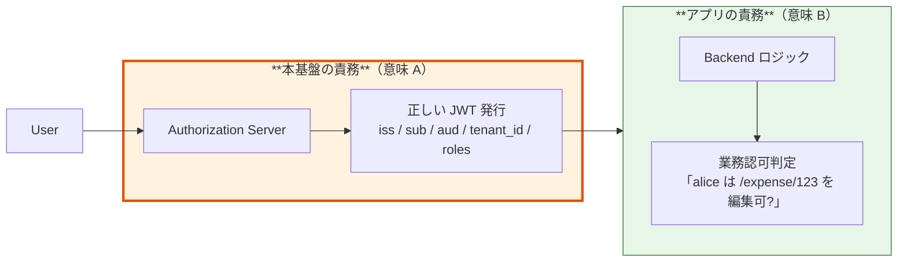
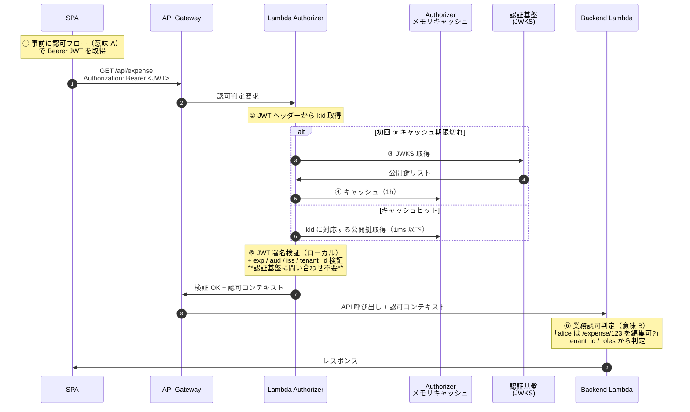
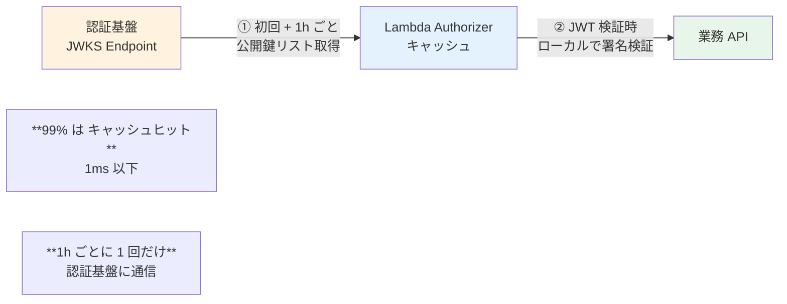
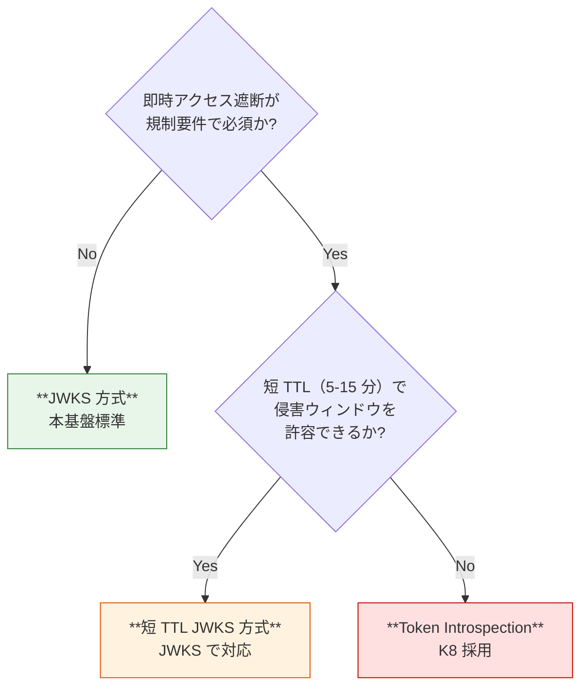

# §3.4 認可スタンス + JWT クレーム + API 認可フロー — スライド草案

> **本資料の位置づけ**: [powerpoint-outline-and-references.md §3.4](../powerpoint-outline-and-references.md) のスライド草案。**6 スライド構成**で、認可の 2 つの意味 + 必須クレーム + Bearer JWT/JWKS 動作 + Token Introspection 代替を整理。
> **対象**: 顧客（テックリード / 開発チーム / セキュリティ）
> **想定時間**: 15 分（質疑含む、技術深度高い）
> **narrative 方針**: 「**認可は本基盤とアプリで責任分界**、本基盤は『正しい JWT を発行』、アプリは『業務認可判定』」

---

## 全体構成

| # | スライドタイトル | メインメッセージ | 想定時間 |
|:-:|---|---|:-:|
| **1** | **「認可」の 2 つの意味（誤解を解く）** | 意味 A（Token 発行制御）vs 意味 B（業務認可判定）の責任分界 | 3 分 |
| **2** | **JWT クレーム設計 — 必須項目** | 最小クレーム設計（iss / sub / aud / tenant_id / roles 等）| 3 分 |
| **3** | **API 認可フロー — Bearer JWT による動作** | SPA → API GW → Lambda Authorizer → Backend | 3 分 |
| **4** | **JWKS — 公開鍵検証の標準動作** | 1h キャッシュ + ローカル検証で SPOF 緩和 | 2 分 |
| **5** | **Token Introspection — 例外採用の判断軸** | 即時失効必須時のみ、性能影響あり | 2 分 |
| **6** | **ヒアリング項目一覧** | B-301, B-302, B-305 等 + 認可スタンス合意 | 2 分 |

---

## スライド 1: 「認可」の 2 つの意味 ⭐ 最重要

### タイトル
**「認可」の 2 つの意味 — 本基盤とアプリの責任分界**

### メインメッセージ
> **「『認可』という言葉は OAuth/OIDC 文脈で 2 つの意味を持ちます。混同すると本基盤とアプリの責任分界が曖昧になります」**

### ビジュアル（2 つの意味の対比）

| 意味 | 何の話か | 担当者 | OAuth 用語 |
|---|---|---|---|
| **意味 A: 認可フレームワーク**（OAuth 2.0 そのもの）| **Token をどう発行するか**（フロー / プロトコル）| **本基盤**（Authorization Server）| Authorization Grant Flow |
| **意味 B: 認可判定**（リソース保護）| **「alice は /expense/123 を編集できるか?」業務判定** | **各アプリ**（Resource Server）| Resource Access Control |

### 責任分界フロー



### 詳細テキスト

**本基盤のスタンス**（[§FR-6.0.A](../proposal/fr/06-authz.md)）:
> **「意味 B の認可判定は各アプリの責務」**。本基盤は「**認証 + 最小限のクレーム発行**」までを担当。

**よくある誤解と訂正**:

| 誤解 | 訂正 |
|---|---|
| 「認可はアプリ側だから、本基盤は Token 発行だけしてれば良い」 | **半分正解**。意味 B の判定はアプリ側だが、**意味 A の Token 発行制御**（aud / scope / 発行先）は本基盤の責任 |
| 「Cognito / Keycloak はクレームを整えるだけ」 | **半分正解**。意味 B の判定はしないが、**「どの Token をどのアプリに、どんな権限で発行するか」を制御**（意味 A） |

### スピーカーノート
- 「**この区別を最初に合意することが最重要**」と強調
- 「意味 A を本基盤が誤ると、アプリ側で意味 B が正しくできない」と説明

### 参考資料
- [§FR-6.0.A 認可スタンス](../proposal/fr/06-authz.md)
- [§C-1.2.D 認可フロー種別の整理（6 種）](../proposal/common/01-architecture.md)
- [terms-and-codes-reference.md §16 認可の 2 つの意味, §20 認可フロー 6 種](../terms-and-codes-reference.md)
- [hearing-script/03-authz-jwt.md 用語の前提](../hearing-script/03-authz-jwt.md)

---

## スライド 2: JWT クレーム設計 — 必須項目

### タイトル
**JWT クレーム設計 — 最小クレーム設計（業界推奨）**

### メインメッセージ
> **「本基盤は OIDC 標準 + 業界推奨の『最小クレーム』を発行します。不要な属性を含めない（業界推奨 §FR-6.1.A）」**

### ビジュアル（クレーム構造）

```json
{
  "iss": "https://auth.example.com",      // ★必須: 発行者
  "sub": "alice@acme.com",                // ★必須: ユーザー識別子
  "aud": "expense-api",                   // ★必須: 発行先（audience）
  "azp": "spa-client-id",                 // 推奨: 認可された client
  "tenant_id": "acme",                    // ★必須: テナント識別
  "roles": ["user", "approver"],          // ★必須: ロール（業務認可で使用）
  "groups": ["finance", "managers"],      // 任意: グループ
  "email": "alice@acme.com",              // 任意: メール（OIDC 標準）
  "exp": 1717000000,                      // ★必須: 有効期限
  "iat": 1716996400                       // ★必須: 発行時刻
}
```

### クレーム設計の指針

| クレーム | 必須/任意 | 用途 | 注意点 |
|---|:-:|---|---|
| `iss` | **必須** | 発行者検証（issuer 検証）| 必ず検証する |
| `sub` | **必須** | ユーザー識別子 | immutable な ID 推奨 |
| `aud` | **必須** | audience 検証 | 必ず検証する（aud チェック緩めるアンチパターン）|
| `tenant_id` | **必須** | マルチテナント識別 | アプリ側で必ず検証 |
| `roles` | **必須** | 業務認可判定（意味 B）の入力 | 階層化推奨 |
| `groups` | 任意 | グループベースの認可 | 必要なアプリのみ |
| `email` | 任意 | 表示用、認可には使わない | PII 注意 |
| `exp` | **必須** | 有効期限 | 必ず検証する |

### 最小クレーム設計の理由（業界推奨）

| 観点 | 理由 |
|---|---|
| **トークンサイズ最小化** | クッキー上限（4KB）/ HTTP ヘッダー上限への抵触回避 |
| **PII 漏洩リスク削減** | 不要な個人情報を含めない |
| **クレーム差し替えやすさ** | 後からクレームを変更する際の影響範囲を最小化 |
| **業界推奨**（[§FR-6.1.A](../proposal/fr/06-authz.md)）| OIDC Core / OAuth 2.0 BCP の推奨 |

### スピーカーノート
- 「必須 5 つ（iss / sub / aud / tenant_id / roles）+ exp / iat」を強調
- 「**aud チェック緩めはアンチパターン**」と注意喚起

### 参考資料
- [§FR-6.1 JWT クレーム設計](../proposal/fr/06-authz.md)
- [§FR-6.1.A 最小クレーム設計](../proposal/fr/06-authz.md)
- [hearing-script/03-authz-jwt.md B-301 必須クレーム, B-302 認可粒度](../hearing-script/03-authz-jwt.md)
- [RFC 7519 JWT](https://datatracker.ietf.org/doc/html/rfc7519)
- [OIDC Standard Claims](https://openid.net/specs/openid-connect-core-1_0.html#StandardClaims)

---

## スライド 3: API 認可フロー — Bearer JWT による動作

### タイトル
**API 認可フロー — Bearer JWT による標準動作**

### メインメッセージ
> **「SPA → API Gateway → Lambda Authorizer → Backend という標準フローで、JWT 検証 + 認可判定が完結します」**

### ビジュアル（API 認可フロー sequence）



### 各層の責務

| 層 | 責務 |
|---|---|
| **SPA** | Bearer JWT を Authorization ヘッダーで送信 |
| **API Gateway** | Lambda Authorizer を呼び出し（HTTP API なら JWT Authorizer も選択肢）|
| **Lambda Authorizer** | JWT 検証（署名 / exp / aud / iss）+ tenant_id 抽出 + JWKS 取得・キャッシュ |
| **Backend Lambda** | 業務認可判定（**意味 B**）+ ビジネスロジック実行 |

### 業界実装パターン

| パターン | 採用シーン | 出典 |
|---|---|---|
| **Lambda Authorizer + JWKS（本基盤標準）** | マルチイシュア対応必須 / カスタム認可ロジック必要 | [AWS Cognito + Custom Authorizer](https://docs.aws.amazon.com/apigateway/latest/developerguide/http-api-jwt-authorizer.html) |
| **API Gateway JWT Authorizer**（HTTP API のみ）| 単純な OIDC JWT 検証で十分 | [Auth0 + API Gateway HTTP API](https://auth0.com/blog/securing-aws-http-apis-with-jwt-authorizers/) |
| **アプリ側ライブラリ検証** | API Gateway 不使用、ALB + ECS 等 | Spring Security / Passport.js |

### スピーカーノート
- 「**標準動作で SPOF を作らない**」を強調（JWKS キャッシュ）
- 「**API Gateway JWT Authorizer は HTTP API のみ**」と注意（マスター表 C 列 R で確認）

### 参考資料
- [§C-1.2.D Bearer JWT / JWKS / 認可フロー 6 種](../proposal/common/01-architecture.md)
- [マスター表 C 列 R Backend API 経路](../hearing-script/01-auth-flow.md)
- [AWS API Gateway JWT Authorizer 公式](https://docs.aws.amazon.com/apigateway/latest/developerguide/http-api-jwt-authorizer.html)
- [Descope: JWT Authorizers and OIDC](https://www.descope.com/blog/post/jwt-authorizer-oidc)

---

## スライド 4: JWKS — 公開鍵検証の標準動作

### タイトル
**JWKS — 認証基盤に問い合わせず JWT 検証を行う標準動作**

### メインメッセージ
> **「JWKS（公開鍵リスト）を 1 時間キャッシュ + ローカル検証することで、認証基盤の SPOF 影響を緩和します」**

### ビジュアル（JWKS フロー）



### JWKS の動作詳細

| 観点 | 内容 |
|---|---|
| **Endpoint** | `https://auth.example.com/.well-known/jwks.json` |
| **取得頻度** | 初回 + 1 時間ごと（業界標準）|
| **キャッシュ** | Lambda Authorizer のメモリキャッシュ |
| **検証** | ローカルで RS256 / ES256 署名検証（1ms 以下）|
| **認証基盤への通信** | 1h に 1 回のみ（クリティカルパス外）|

### JWKS の中身（例）

```json
{
  "keys": [
    {
      "kty": "RSA",                    // 鍵タイプ（RSA）
      "kid": "abc123",                 // Key ID（JWT ヘッダーと照合）
      "use": "sig",                    // 用途（署名検証）
      "alg": "RS256",                  // アルゴリズム
      "n": "0vx7agoebGcQSuuPiL...",    // RSA 公開鍵（modulus）
      "e": "AQAB"                      // RSA 公開鍵（exponent）
    }
  ]
}
```

### Key Rotation のベストプラクティス

| 観点 | 内容 |
|---|---|
| **猶予期間** | 鍵ローテーション時、**旧鍵と新鍵を一定期間並存**させる（業界標準）|
| **JWT 検証時の挙動** | JWT の `kid` で該当鍵を選択、旧鍵で署名された JWT も検証可 |
| **キャッシュ更新** | 旧鍵が JWKS から削除されたら、その時点でキャッシュも更新 |

### スピーカーノート
- 「**99% はキャッシュヒット = 認証基盤に問い合わせない**」を強調
- 「認証基盤が一時的にダウンしても、JWKS キャッシュ内は継続動作」と説明

### 参考資料
- [§C-1.2.D.5 JWKS とは](../proposal/common/01-architecture.md)
- [§C-1.2.D.7 「Authorizer → JWKS」矢印の正しい解釈](../proposal/common/01-architecture.md)
- [RFC 7517 JSON Web Key Set](https://datatracker.ietf.org/doc/html/rfc7517)
- [terms-and-codes-reference.md §21 Bearer Token / JWT / JWKS / Token Introspection](../terms-and-codes-reference.md)

---

## スライド 5: Token Introspection — 例外採用の判断軸

### タイトル
**Token Introspection — 例外採用（即時失効必須時のみ）**

### メインメッセージ
> **「Token Introspection は『毎回認証基盤に問い合わせ』方式で、即時失効が可能。ただし性能影響大、規制要件時のみ採用」**

### ビジュアル（JWKS vs Introspection 比較）

| 観点 | **JWKS 方式（本基盤標準）** | Token Introspection |
|---|---|---|
| **認証基盤への通信頻度** | **初回 + 1h ごと** | **API 呼び出しの度** |
| **レイテンシ** | キャッシュヒット = 1ms 以下 | 毎回 50-200ms |
| **認証基盤負荷** | 軽 | 重（全 API リクエスト分）|
| **認証基盤の SPOF 影響** | **キャッシュ内は継続動作** | **基盤障害で全 API 停止** |
| **トークン即時失効** | ❌ TTL 内は失効不可 | ✅ 即座に反映 |
| **採用シーン** | 標準的な OAuth/OIDC API | 規制要件で即時遮断必須（[K8 Access Token Revocation](../proposal/common/01-architecture.md)）|

### Token Introspection が必要なケース



### Token Introspection の実装

| プラットフォーム | 実装方式 |
|---|---|
| **Cognito** | `origin_jti` クレーム + 失効リスト DynamoDB + Lambda Authorizer で都度チェック（**自前実装**）|
| **Keycloak** | Token Introspection (`/introspect`) **標準提供** |

### スピーカーノート
- 「**JWKS 方式が標準、Token Introspection は例外**」を強調
- 「規制要件（金融 / 医療）で『退職処理後 N 秒以内に全 API アクセス遮断』が SLA 要求されている場合のみ K8 採用」

### 参考資料
- [マスター表 C 補足 2 K8 Access Token Revocation](../hearing-script/01-auth-flow.md)
- [RFC 7662 OAuth 2.0 Token Introspection](https://datatracker.ietf.org/doc/html/rfc7662)
- [hearing-script/07-logout-session.md B-704 → K8](../hearing-script/07-logout-session.md)
- [hearing-script/10-security-compliance.md C-207 トークン失効要件](../hearing-script/10-security-compliance.md)

---

## スライド 6: ヒアリング項目一覧

### タイトル
**ヒアリング項目 — 認可 + JWT + API 認可フロー関連**

### メインメッセージ
> **「以下の項目を確認させてください。回答により、JWT 設計と API 認可方式が確定します」**

### ヒアリング項目表

| # | 項目 ID | 確認内容 | 期待回答 | 重要度 |
|:-:|---|---|---|:-:|
| 1 | **§FR-6.0.A** | **認可スタンス（意味 A / 意味 B）の合意** | 合意 / 別案 | 🔥 |
| 2 | **B-301** ⭐ | 必須クレーム（アプリが JWT に必要とする属性）| 属性リスト | 🔥 |
| 3 | **B-302** | 認可粒度（ロール / リソース / アクション）| 設計方針 | 🟡 |
| 4 | **B-305** | 既存ロール体系 | 階層図 | 🟢 |
| 5 | **K1** マスター表 C 列 S | Token Exchange の必要性（マイクロサービス間 OBO）| Yes/No + 業務シナリオ | 🟡 |
| 6 | **K8** マスター表 C 列 S | Access Token 即時 Revocation の必要性（規制要件）| Yes/No + 規制名 | 🟡 |
| 7 | **B-100 列 R** マスター表 C | Backend API 経路（API GW + Lambda / ALB+ECS / Service Mesh）| アプリ別マッピング | 🔥 |
| 8 | **B-306** | テナント分離粒度（JWT クレームで識別 / DB 分離）| L1 / L2 / L3 | 🔥 |

### 期待される結論パターン

| シナリオ | 推奨設計 |
|---|---|
| **A. 標準的な B2B SaaS** | JWT 最小クレーム + JWKS 方式 + Lambda Authorizer |
| **B. マイクロサービス多数** | + Token Exchange（K1）= Keycloak |
| **C. 規制業種（金融 / 医療）** | + Token Introspection（K8）= Cognito 自前 or Keycloak |

### スピーカーノート
- **§FR-6.0.A 認可スタンス合意が最重要**（責任分界が決まる）
- **B-301 必須クレーム**はアプリチームと連動して埋める
- マスター表 C の K1 / K8 で例外対応が決まる

### 参考資料
- [hearing-checklist.md §4.2 認可・JWT クレーム](../hearing-checklist.md)
- [hearing-script/03-authz-jwt.md 用語整理 + B-301〜305](../hearing-script/03-authz-jwt.md)

---

## まとめ用スライド

### タイトル
**認可・JWT・API 認可フロー — まとめ**

| 観点 | 本基盤の方針 |
|---|---|
| **認可の責任分界** | 意味 A（Token 発行）= 本基盤、意味 B（業務判定）= 各アプリ |
| **JWT クレーム** | **最小クレーム設計**（iss / sub / aud / tenant_id / roles 必須）|
| **API 認可フロー** | SPA → API GW → **Lambda Authorizer + JWKS** → Backend |
| **JWKS 検証** | 1h キャッシュ + ローカル検証（SPOF 緩和）|
| **Token Introspection** | 例外（K8 規制要件時のみ）|
| **Token Exchange** | 例外（K1 マイクロサービス間 OBO 時のみ）|

### 検討ポイント（顧客側）

- [ ] **認可スタンス合意**（意味 B はアプリ責務、本基盤は意味 A）
- [ ] **B-301 必須クレーム**を **アプリチームと協議**して確定
- [ ] **マスター表 C で K1 / K8 の有無**を確認（次回ヒアリング）
- [ ] **Backend API 経路**（マスター表 C 列 R）をアプリ別に確認

---

## 関連スライド草案

- [§1.3 アーキテクチャ方針](1.3-architecture-strategy-slides.md)
- [§2.4 マルチテナント設計](2.4-multi-tenant-slides.md)
- [§3.2 MFA 要件 + ステップアップ認証](3.2-mfa-slides.md)
- §5.7 委譲管理（別ファイル）

---

## 改訂履歴

| 日付 | 内容 |
|---|---|
| 2026-06-03 | 初版。認可の 2 つの意味 + 最小クレーム設計 + JWKS 標準動作 + Token Introspection 例外採用を 6 スライド構成で実装 |
| 2026-06-03 | **outline §X 構成変更に伴うクロスリファレンス周知**: 認可独立化 (§4) + ITDR 移動 (§7.4)、本スライドは旧 §3.4 → 新 §4.1 に位置付け変更（ファイル名・内容の同期は Phase 2/3 で対応）|
| 2026-06-08 | **§4.1 に「属性マッピング/クレーム変換」統合（outline §0/§4.1/§5.5/§9）**。「顧客 IdP の属性 → 基盤の正規化属性 → JWT クレーム」end-to-end パイプライン議論を一体化（業界整理 Auth0/Okta/Entra/Keycloak と整合）。本スライドへの新節追加（属性マッピング詳細）は Phase 2/3 で対応予定。当面は outline §4.1 末尾のパイプライン図 + 旧 §5.5 / §6.5 の B-604 系を参照 |
