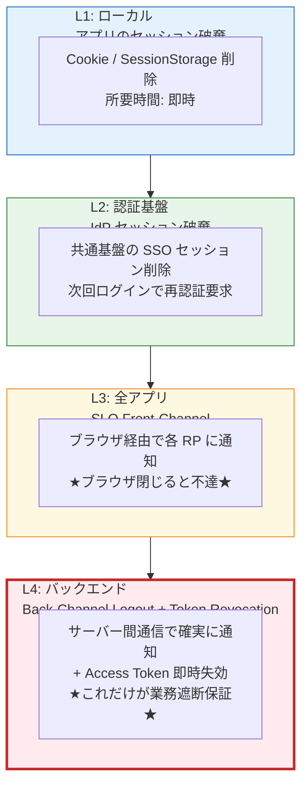
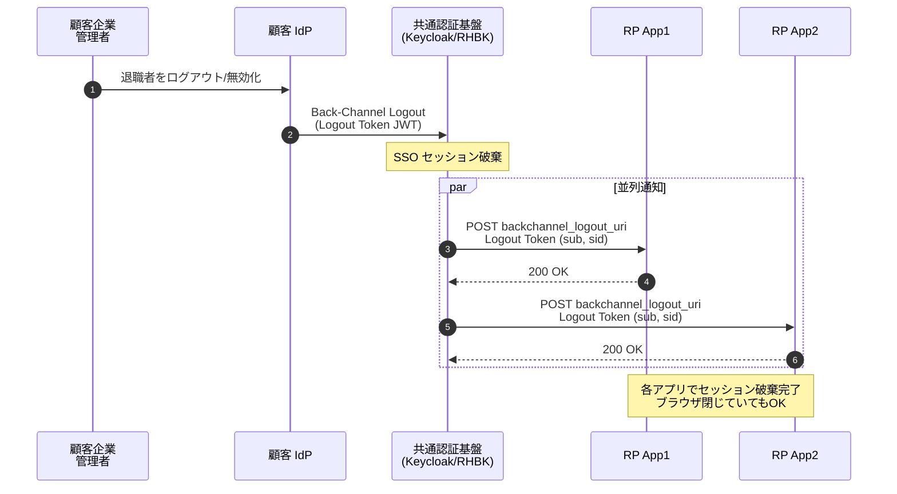
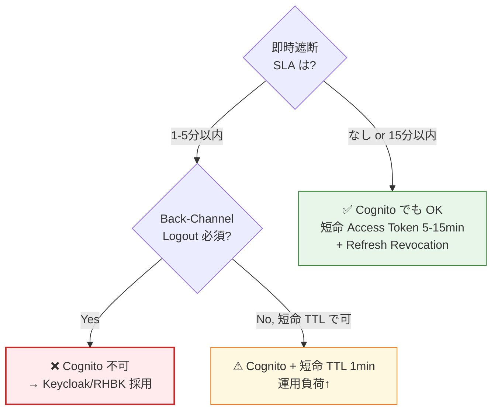

# §4.3 SLO + Back-Channel Logout + Token Revocation — スライド草案

> **本資料の位置づけ**: [powerpoint-outline-and-references.md §4.3](../powerpoint-outline-and-references.md) のスライド草案。**6 スライド構成**で、SLO（Single Logout）の必須範囲、Back-Channel Logout (RFC 8417 / OIDC BCL 1.0、K7)、Access Token 即時 Revocation (RFC 7009、K8) を整理する。
> **対象**: 顧客（情シス / セキュリティ責任者 / アプリオーナー）
> **想定時間**: 12-15 分（質疑含む）
> **narrative 方針**: 「**ログアウトには 4 レイヤーある、どこまで保証するか**」 → 「即時遮断が必要な業務には Back-Channel Logout + Access Token Revocation が必須」 → 「Cognito では K7/K8 が制約、Keycloak/RHBK で対応可能」

---

## 全体構成

| # | スライドタイトル | メインメッセージ | 想定時間 |
|:-:|---|---|:-:|
| **1** | **ログアウトの 4 レイヤー L1〜L4** | 「**ログアウト＝1つではない**、どこまで遮断するかで設計が変わる」 | 2 分 |
| **2** | **SLO（Single Logout）の業界標準と限界** | OIDC RP-Initiated / SAML SLO / Front-Channel / Back-Channel の比較 | 2 分 |
| **3** | **Back-Channel Logout (K7) — 業務遮断の標準** | RFC 8417 + OIDC BCL 1.0、なぜ Front-Channel では足りないか | 3 分 |
| **4** | **Access Token 即時 Revocation (K8)** | JWT ステートレスの罠 + RFC 7009 + Introspection + 短命トークン戦略 | 3 分 |
| **5** | **Cognito Knockout K7/K8 と回避策** | Cognito 制約 → Keycloak/RHBK 採用 or アプリ側で短命 TTL | 2 分 |
| **6** | **ヒアリング項目一覧** | 即時遮断 SLA / 対象範囲 / 実装方式（6 項目）| 2 分 |

---

## スライド 1: ログアウトの 4 レイヤー L1〜L4

### タイトル
**ログアウトには 4 レイヤーある — どこまで遮断するかで設計が変わる**

### メインメッセージ
> **「『ログアウト』と一言で言っても、L1=ブラウザの Cookie 消去から L4=Access Token の即時無効化まで 4 段階。業務要件で必要なレイヤーを確定させる。」**

### ビジュアル（4 レイヤー図）

### 詳細テキスト

**各レイヤーの典型ユースケース**:

| レイヤー | ユースケース | 実装 | 業務遮断保証 |
|---|---|---|:-:|
| **L1 ローカル** | 普通の「ログアウト」ボタン | `clearStorage()` / `signOut()` | ❌ 同一ブラウザのみ |
| **L2 IdP セッション** | 別タブで他アプリも切る | OIDC `end_session_endpoint` | △ ブラウザ閉じてからは別 |
| **L3 Front-Channel SLO** | 全 RP に通知 | `<iframe>` で各 RP へ HTTP GET | ❌ ブラウザ閉じると不達 |
| **L4 Back-Channel + Revocation** | **退職者の即時遮断** | サーバー間 POST + Token Revocation | ✅ **唯一の業務遮断保証** |

### スピーカーノート
- 「お客様の現状の『ログアウト』要件は L1〜L4 のどこか、ヒアリングで確定する」
- 「**退職者・委託契約終了の即時アクセス遮断 SLA がある場合は L4 が必須**」
- 「L1〜L3 だけだと『退職者のブラウザに残っている Access Token は失効しない』」

### 参考資料
- [hearing-checklist.md §4.4 ログアウト](../hearing-checklist.md)
- [§FR-5.1 SLO 設計](../proposal/fr/05-logout-session.md)
- [OIDC Session Management 1.0](https://openid.net/specs/openid-connect-session-1_0.html)

---

## スライド 2: SLO（Single Logout）の業界標準と限界

### タイトル
**SLO の業界標準 — 4 つの仕様、それぞれの限界**

### メインメッセージ
> **「SLO の仕様は OIDC RP-Initiated / Front-Channel / Back-Channel / SAML SLO の 4 種、各々の前提と限界を理解した上で選ぶ。」**

### ビジュアル（SLO 仕様比較表）

| 仕様 | 通知方式 | 限界 | 業界推奨度 |
|---|---|---|:-:|
| **OIDC RP-Initiated Logout** | ユーザーが IdP の `end_session_endpoint` に遷移 | 単一アプリのみ、他 RP は無通知 | ✅ 標準 |
| **OIDC Front-Channel Logout 1.0** | IdP が `<iframe>` で各 RP の logout_uri を叩く | **ブラウザを閉じると不達**、サードパーティ Cookie ブロックで失敗 | △ レガシー |
| **OIDC Back-Channel Logout 1.0** | IdP → RP へサーバー間 POST（Logout Token JWT） | RP が公開エンドポイントを持つ必要、SPA は別途設計 | ✅ **業界標準（B2B SaaS）** |
| **SAML SLO (Single Logout Profile)** | SOAP / HTTP-POST / Redirect | 実装が複雑、IdP ごとに動作差 | △ レガシー継続のみ |

### 詳細テキスト

**Front-Channel の致命的問題**:
- ユーザーが「ログアウトボタンを押した瞬間にブラウザを閉じる」と、`<iframe>` の HTTP GET が完了しない
- 結果: アプリ側のセッションが**残る**（実態のあるバグ。Microsoft / Google 等の業界調査でも報告多数）
- **Back-Channel Logout 1.0 が現代の業界標準** （2020年代後半に主流化、Microsoft Entra / Auth0 / Keycloak が標準対応）

**SAML SLO の歴史的問題**:
- IdP ごとに「`LogoutResponse` 待ち vs 待たない」の動作差
- Shibboleth / ADFS / SimpleSAMLphp で実装非互換が頻発
- **新規実装では OIDC BCL 推奨**

### スピーカーノート
- 「『SLO ありますか？』と聞いた時、お客様の認識は SAML SLO のことが多い、Back-Channel Logout との違いを説明」
- 「**現代の B2B SaaS では Back-Channel Logout が事実上の標準**」

### 参考資料
- [OIDC Back-Channel Logout 1.0](https://openid.net/specs/openid-connect-backchannel-1_0.html)
- [OIDC Front-Channel Logout 1.0](https://openid.net/specs/openid-connect-frontchannel-1_0.html)
- [SAML SLO Profile](https://docs.oasis-open.org/security/saml/v2.0/saml-profiles-2.0-os.pdf)

---

## スライド 3: Back-Channel Logout (K7) — 業務遮断の標準

### タイトル
**Back-Channel Logout — IdP → 各 RP へサーバー間通知で確実に遮断**

### メインメッセージ
> **「ブラウザに依存せず IdP→RP サーバー間で Logout Token (JWT) を POST。退職者の即時遮断や、SOC2 / ISO27001 で求められる『アクセス取消の検証可能性』を満たす唯一の SLO。」**

### ビジュアル（BCL シーケンス図）

### 詳細テキスト

**Logout Token JWT の中身**（OIDC BCL 1.0 §2.4）:
- `iss` / `aud` / `iat` / `jti`（リプレイ防止）
- `sub`（ユーザー識別）または `sid`（セッション識別）
- `events`: `{"http://schemas.openid.net/event/backchannel-logout": {}}`

**RP 側の実装要件**:
- 公開 HTTPS エンドポイント (`backchannel_logout_uri`) を持つ
- Logout Token の署名検証（JWKS から IdP 公開鍵取得）
- セッション破棄 + 200 OK 返却
- **SPA は別途設計**（BCL が直接 SPA に届かないため、サーバー側で破棄 → 次回 API 呼び出しで 401 検出 → SPA 側で signOut）

**Cognito の対応状況（2026 時点）**:
- ❌ **Back-Channel Logout 未対応（K7 ノックアウト）**
- RP-Initiated Logout のみ
- 業務遮断要件があると Cognito 不採用要因

### スピーカーノート
- 「Back-Channel Logout が**業務 SLO 保証の唯一の標準**」
- 「Cognito 未対応のため、退職者即時遮断要件があれば Keycloak/RHBK 必須（K7 制約）」
- 「**ヒアリング項目**: 退職反映 SLA / 必要な業務シナリオ」

### 参考資料
- [RFC 8417 Security Event Token](https://datatracker.ietf.org/doc/html/rfc8417)
- [OIDC Back-Channel Logout 1.0](https://openid.net/specs/openid-connect-backchannel-1_0.html)
- [Keycloak Back-Channel Logout 設定](https://www.keycloak.org/docs/latest/securing_apps/#backchannel-logout-url)

---

## スライド 4: Access Token 即時 Revocation (K8)

### タイトル
**Access Token 即時 Revocation — JWT の罠と対策**

### メインメッセージ
> **「JWT は『ステートレスで速い』が裏返すと『発行後は IdP で取り消せない』。即時遮断には RFC 7009 Token Revocation + Token Introspection + 短命 TTL 戦略のいずれか or 組み合わせ。」**

### ビジュアル（Token Revocation 戦略マトリクス）

| 戦略 | 仕様 | 即時性 | コスト | Cognito | Keycloak |
|---|---|:-:|---|:-:|:-:|
| **A. 短命 Access Token (5-15min)** | TTL 短縮 + Refresh Token Revocation のみ | △ TTL 分の遅延 | ◯ 安価 | ✅ (Refresh Revocation OK) | ✅ |
| **B. Token Revocation エンドポイント (RFC 7009)** | `POST /revoke` で Access Token を失効 | ✅ 即時 | ◯ | ❌ **K8 未対応** | ✅ |
| **C. Token Introspection (RFC 7662)** | RP が毎リクエスト `/introspect` 呼ぶ | ✅ 即時 | ✕ 高頻度 RTT | ❌ | ✅ |
| **D. JWKS Key Rotation + 全失効** | 鍵を回す（全ユーザー失効）| ✅ 即時 | ✕ 全 RP 巻き添え | ✅ | ✅ |
| **E. Deny-list（DB / Redis）** | Revoked `jti` を RP 側でキャッシュ | ✅ 即時 | △ RP 側実装 | ✅ | ✅ |

### 詳細テキスト

**業界標準パターン（2026 時点）**:
1. **B2B SaaS 一般**: A（短命 TTL 15min）+ Refresh Token Revocation
   - 退職反映 SLA が「15 分以内」なら追加実装不要
2. **金融 / 医療**: B または C（即時遮断 SLA「1 分以内」級）
   - + DPoP（RFC 9449）で Token 盗難耐性向上
3. **マルチテナント B2B**: A + E（テナント単位 deny-list）

**Cognito K8 ノックアウト**:
- ❌ Access Token Revocation 未対応（Refresh Token のみ可能）
- 即時遮断要件があれば Cognito 不採用要因（または短命 TTL 容認）

**Keycloak/RHBK の対応**:
- ✅ RFC 7009 Token Revocation（Access / Refresh 両方）
- ✅ RFC 7662 Token Introspection
- ✅ Offline Session Revocation API

### スピーカーノート
- 「『JWT は速い』とよく聞きますが、**裏返すと取消困難**、これを正確に伝える」
- 「ヒアリング: **即時遮断 SLA は何分以内が必要か** → 15分以上なら短命 TTL で十分」
- 「金融/医療など 1 分級ならば B+C 併用」

### 参考資料
- [RFC 7009 Token Revocation](https://datatracker.ietf.org/doc/html/rfc7009)
- [RFC 7662 Token Introspection](https://datatracker.ietf.org/doc/html/rfc7662)
- [RFC 9449 DPoP](https://datatracker.ietf.org/doc/html/rfc9449)
- [hearing-checklist.md §3.2 K8 Access Token Revocation](../hearing-checklist.md)

---

## スライド 5: Cognito Knockout K7/K8 と回避策

### タイトル
**Cognito 制約 K7/K8 — Back-Channel Logout / Access Revocation 未対応**

### メインメッセージ
> **「Cognito は Back-Channel Logout (K7) と Access Token Revocation (K8) が未対応。即時遮断要件が必須なら Keycloak/RHBK、要件緩和できれば Cognito + 短命 TTL で回避可能。」**

### ビジュアル（K7/K8 影響と回避策）

### 詳細テキスト

**K7 (Back-Channel Logout) 影響範囲**:
- 退職者の即時アクセス遮断ができない（ブラウザ閉じた後の Access Token は残存）
- SOC2 / ISO27001 監査の「アクセス取消の検証可能性」要件で指摘されるリスク
- 対象業務: 金融 / 医療 / 個人情報を扱う B2B SaaS

**K8 (Access Token Revocation) 影響範囲**:
- Access Token TTL 中は失効不可（Cognito の最小 TTL = 5 分）
- Refresh Token Revocation はできる（次の Refresh 時に新 Access 取得不可）
- 結論: Cognito での即時遮断 SLA 下限 = **5 分**

**ハイブリッド回避策**（§1.3 narrative との整合）:
- コア（弊社管理ユーザー）= Keycloak（K7/K8 対応）
- エッジ（汎用アプリ）= Cognito（短命 TTL）
- 退職反映 SLA 厳しいテナントだけ Keycloak へ集約

### スピーカーノート
- 「Cognito vs Keycloak の選定で **最大の分かれ目** が K7/K8」
- 「お客様の即時遮断 SLA を **明示的に確認する** ことで適切な製品選定が可能」
- 「§1.3 で示した『基本は集約、例外はハイブリッド』の典型例」

### 参考資料
- [hearing-checklist.md §3.2 Cognito Knockout K1-K8](../hearing-checklist.md)
- [§C-6 §6.4 Federation 接続パターン](../proposal/common/06-architecture-decision-hybrid.md)
- [AWS Cognito Token Validity Limits](https://docs.aws.amazon.com/cognito/latest/developerguide/amazon-cognito-user-pools-using-tokens-with-identity-providers.html)

---

## スライド 6: ヒアリング項目一覧 — 御社に確認する 6 項目

### タイトル
**ヒアリング項目 — SLO + Token Revocation 設計に必要な 6 項目**

### メインメッセージ
> **「以下 6 項目を確定することで、SLO 範囲・Back-Channel Logout 採否・Token TTL 戦略・製品選定（Cognito vs Keycloak）まで一気通貫で決定可能。」**

### ヒアリング項目表

| # | ID | 質問 | 想定回答パターン | 影響 |
|:-:|---|---|---|---|
| 1 | **B-704 / K8** | Access Token の即時 Revocation は必要か？ | 不要 / 必要（5-15分OK） / 必要（1分級） | 製品選定 K8 |
| 2 | **B-504 / K7** | Back-Channel Logout は必要か？（全 RP へ即時通知） | 不要 / 必要 | 製品選定 K7 |
| 3 | **B-605-3** | 退職者の即時アクセス遮断 SLA は何分以内？ | 1分 / 5分 / 15分 / 1時間 | TTL 戦略 |
| 4 | **C-206** | Access Token / Refresh Token / ID Token の TTL 希望は？ | 業界デフォルト / 短命指向 / 長命指向 | TTL 設定 |
| 5 | **C-206-2** | アイドルタイムアウト / 絶対経過タイムアウトの設定は？ | 業界推奨 30min / 8h / なし | セッション設計 |
| 6 | **C-217** | CAEP（Continuous Access Evaluation Protocol）相当の仕組みは必要か？ | 不要 / 検討中 / 必要 | 将来拡張 |

### 補助項目（必要に応じて）
- **業務シナリオ**: 退職者 / 委託契約終了 / セキュリティインシデント時の対応想定
- **監査要件**: SOC2 / ISO27001 / FISC 等の「アクセス取消の検証可能性」要否
- **既存システムの動作**: 現在のログアウト動作をどこまで踏襲する必要があるか

### スピーカーノート
- 「6 項目のうち #3 退職反映 SLA が**最も影響大**（製品選定を左右）」
- 「お客様内で『SLO 必要』とおっしゃるとき、L1〜L4 のどこか必ず確認」
- 「金融/医療業界の場合は #6 CAEP も将来的に必要、今回は将来拡張で枠を確保」

### 参考資料
- [hearing-script/05-mfa.md B-504 → K7](../hearing-script/05-mfa.md)
- [hearing-script/07-logout-session.md B-704 → K8](../hearing-script/07-logout-session.md)
- [hearing-script/10-security-compliance.md C-206, C-206-2/3, C-217](../hearing-script/10-security-compliance.md)

---

## まとめ用スライド（任意、章末用）

### タイトル
**SLO + Token Revocation — 設計判断のサマリー**

### メインメッセージ
> **「『ログアウト』を 4 レイヤーで再定義 → 業務 SLO で必要なレイヤーを確定 → 即時遮断要件で Cognito/Keycloak を選定 → TTL とハイブリッド構成で運用最適化。」**

### 検討ポイント（顧客側）
1. **ログアウトの 4 レイヤー、御社で必要なのは L1〜L4 のどこまでか**
2. **退職者の即時アクセス遮断 SLA は何分以内か**
3. **監査（SOC2/ISO27001/FISC）で『アクセス取消の検証可能性』が問われているか**
4. **金融/医療など即時遮断 1 分級なら Keycloak/RHBK 必須**
5. **15 分以上 OK なら Cognito + 短命 TTL で十分**

---

## 制作 Tips

### Mermaid 図の PowerPoint への取り込み
- Mermaid Live Editor（https://mermaid.live）で PNG/SVG エクスポート
- L1〜L4 の色分け（青→緑→黄→赤）で重要度を視覚化

### 色使い指針
| 用途 | 色 | 例 |
|---|---|---|
| 安全（L1-L2）| 青 / 緑 | 軽量ログアウト |
| 注意（L3）| 黄 | Front-Channel 限界 |
| 重要（L4）| 赤 | 業務遮断保証 |
| Cognito ノックアウト | 赤太枠 | K7/K8 制約 |

### スライドあたり時間配分
- スライド 1 (4 レイヤー): 2 分 — 「ログアウトは 1 つではない」が大事
- スライド 3 (BCL): 3 分 — シーケンス図で「サーバー間通信」を強調
- スライド 4 (Revocation): 3 分 — 5 つの戦略を比較表で
- スライド 5 (Cognito 制約): 2 分 — 決定木で製品選定の分岐を見せる
- スライド 6 (ヒアリング): 2 分 — 「今日確認したい 6 項目」と明示

---

## 関連スライド草案
- [1.3 アーキテクチャ方針](1.3-architecture-strategy-slides.md) — 例外時のハイブリッド構成（Cognito K7/K8 回避）
- [3.2 MFA 要件](3.2-mfa-slides.md) — 認証強度との連動
- [3.4 認可 + JWT + API 認可](3.4-authz-jwt-api-flow-slides.md) — JWT TTL / Introspection 設計

---

## 改訂履歴
- 2026-06-03: 初版作成（§4.3 SLO + Back-Channel Logout + Token Revocation）
