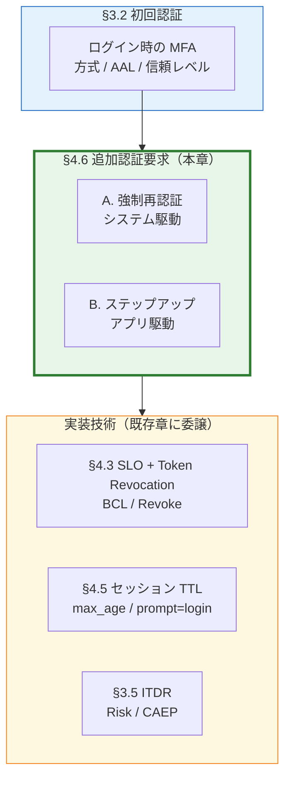
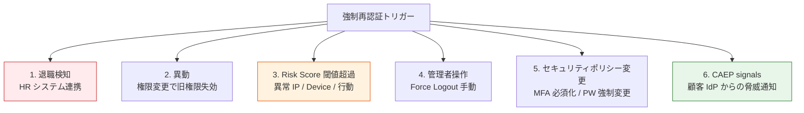
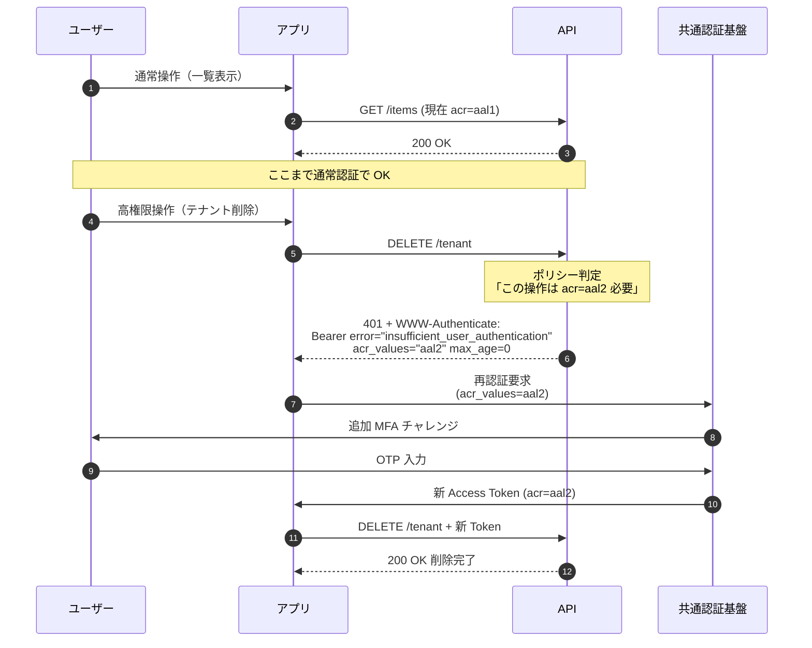
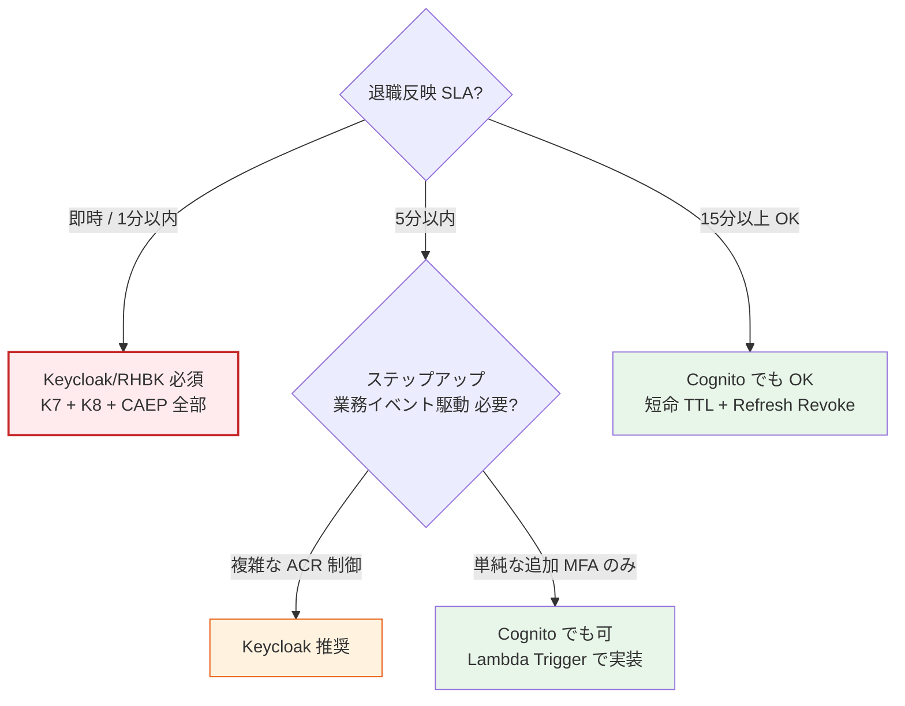
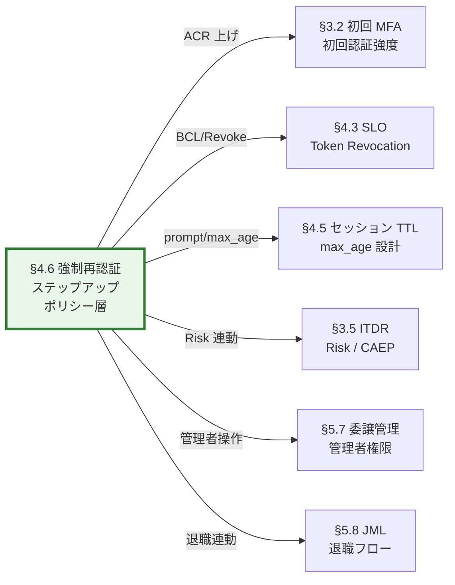

# §4.6 強制再認証・ステップアップ認証（Forced & Step-up Re-authentication）— スライド草案

> **本資料の位置づけ**: [powerpoint-outline-and-references.md §4.6](../powerpoint-outline-and-references.md) のスライド草案。**6 スライド構成**で、「初回認証後に **追加で認証を要求する**」要件をポリシー層として整理。システム駆動（強制再認証）+ アプリ駆動（ステップアップ）の 2 系統を束ねる。
> **対象**: 顧客（情シス / セキュリティ責任者 / 運用責任者 / 一部アプリオーナー）
> **想定時間**: 12-15 分（質疑含む）
> **narrative 方針**: 「**§3.2 は初回認証 / §4.6 は追加認証要求**」を明確に分離 → 2 系統（システム駆動 / アプリ駆動）の業界整理 → 実装技術は §4.3 / §4.5 / §3.5 へ委譲

---

## 全体構成

| # | スライドタイトル | メインメッセージ | 想定時間 |
|:-:|---|---|:-:|
| **1** | **§4.6 全体像 — 「追加で認証を要求する」2 系統** | 「§3.2 初回認証 vs §4.6 追加認証要求」の分離 + ポリシー層位置付け | 2 分 |
| **2** | **強制再認証（システム駆動）— トリガー一覧** | 退職 / 異動 / Risk / 管理者 / ポリシー変更 / CAEP の 6 トリガー | 3 分 |
| **3** | **ステップアップ認証（アプリ駆動、RFC 9470）** | 高権限操作で `acr_values` 引き上げ要求、業務イベント駆動 | 3 分 |
| **4** | **実装技術スタック + 切断深度マトリクス** | 6 つの共通実装技術、各トリガーごとの「どこまで切るか」 | 2 分 |
| **5** | **Cognito vs Keycloak 製品対応 + 業界実装例** | 製品制約（K7/K8 が大きく影響）+ Microsoft Entra CAE / GitHub sudo-mode | 2 分 |
| **6** | **ヒアリング項目一覧 + 関連章連動** | 6 項目 + §3.2 / §4.3 / §4.5 / §3.5 / §5.7 との連動マップ | 2 分 |

---

## スライド 1: §4.6 全体像 — 「追加で認証を要求する」2 系統

### タイトル
**§4.6 の位置付け — 「初回認証」と「追加認証要求」を分離**

### メインメッセージ
> **「§3.2 は『初回ログインで MFA するか』、§4.6 は『初回認証後に何らかの理由で追加認証を要求するか』。後者には『システム駆動（強制再認証）』と『アプリ駆動（ステップアップ）』の 2 系統があり、ポリシー層として束ねて議論する。」**

### ビジュアル（位置付け図）



### 詳細テキスト

**§3.2（初回認証）と §4.6（追加認証要求）の責務分離**:

| 観点 | §3.2 初回認証 | §4.6 追加認証要求 |
|---|---|---|
| **タイミング** | ログイン時 1 回 | ログイン後、必要に応じて何度でも |
| **誰が決めるか** | 認証ポリシー（基盤）| **システム** or **アプリ** |
| **典型例** | 「ログイン時に MFA 必須」 | 「退職時に全 Token Revoke」「テナント削除時に追加 MFA」|
| **実装技術** | 認証フロー / MFA UI | `prompt=login` / `max_age` / `acr_values` / Token Revocation |

**§4.6 の 2 系統**:

| 系統 | A. 強制再認証 | B. ステップアップ認証 |
|---|---|---|
| **駆動主体** | **システム/管理者**（外部イベント）| **アプリ**（業務イベント）|
| **典型トリガー** | 退職検知 / 異動 / Risk / 管理者操作 / CAEP | 高権限操作 / 高額決済 / 機微情報 |
| **業界標準仕様** | 各種（BCL / Revocation / CAEP）| **RFC 9470 OAuth Step-up Challenge** |
| **顧客の関心事** | **業務 SLA + コンプラ**（退職遮断）| **業務リスク**（不正取引防止）|

**なぜ束ねるか**:
- **実装技術はほぼ共通**（`prompt=login` / `acr_values` / Token Revocation / Session 強制終了）
- **「追加で認証を要求する」という同じ問い** → 両方を一つの議論で整理することで設計効率向上
- **顧客側の意思決定者も同じ**（情シス / セキュリティ責任者）

### スピーカーノート
- 「**§3.2 と本章を分離した理由**: 性質が違うので別議論にする方が分かりやすい」
- 「お客様が『MFA いつ要求しますか』と聞かれて混乱しないよう、**初回 / 追加** を明示」
- 「実装技術は他章にあるので、本章では **ポリシー（要件）を確定** することがゴール」

### 参考資料
- [§FR-3.3 ステップアップ認証](../proposal/fr/03-mfa.md)
- [§FR-5.3 Token Revocation](../proposal/fr/05-logout-session.md)
- [§FR-5.4 CAEP](../proposal/fr/05-logout-session.md)
- [RFC 9470 OAuth Step-up Authentication Challenge](https://datatracker.ietf.org/doc/html/rfc9470)

---

## スライド 2: 強制再認証（システム駆動）— トリガー一覧

### タイトル
**強制再認証（システム駆動）— 6 つのトリガー**

### メインメッセージ
> **「『システムが今すぐ再認証させる』要件は 6 トリガーに分類。各トリガーで切断深度（L1〜L4 + Token Revocation）と SLA が異なる。」**

### ビジュアル（6 トリガー）



### 詳細テキスト

**各トリガー別の典型要件**:

| # | トリガー | 業界 SLA 例 | 切断深度 | 連携ソース |
|:-:|---|---|---|---|
| 1 | **退職検知** | 5分〜15分以内 | **L4 Full**（BCL + Access Revoke + MFA Reset）| HR / IdP DELETE / Webhook |
| 2 | **異動** | 翌営業日 | L2-L3（再ログインで権限再評価）| HR / IdP attr 更新 |
| 3 | **Risk Score 閾値超過** | 即時 | L2-L4（リスクに応じ段階）| ITDR / SIEM / Risk Engine |
| 4 | **管理者操作** | 即時 | L4 Full（管理者選択）| 管理コンソール / API |
| 5 | **セキュリティポリシー変更** | 次回ログイン時 | L1-L2（次回 `prompt=login`）| ポリシー設定変更 |
| 6 | **CAEP signals** | 即時（受信後数秒）| L2-L4（イベントタイプによる）| 顧客 IdP / Shared Signals Framework |

**業界での実装事例（2026 時点）**:

- **Microsoft Entra Continuous Access Evaluation (CAE)**:
  - 退職 / 異動 / アカウント無効化 / Risk 検出 で**即時セッション失効**
  - 元来 Access Token は 1h 有効だが、CAE で「**特定イベント検出時に数秒以内に失効**」を実現
  - Office 365 / Microsoft Graph 全体で標準動作
- **AWS IAM Identity Center Session Revocation**:
  - 管理コンソールから「すべてのアクティブセッションを終了」操作
  - SAML 連携先全体への通知
- **Okta Universal Logout**:
  - 退職時に全 SP（接続アプリ）へ Single Logout を一斉送出
  - Workforce Identity Cloud の標準機能

**CAEP / Shared Signals Framework の概要**:
- **OpenID Foundation 標準化**、2024-2025 にかけて Microsoft / Google / Apple が実装
- 顧客 IdP が「**このユーザーに何かあった**」と認識した瞬間に、RP（本基盤含む）へ Push 通知
- イベントタイプ: `session-revoked` / `token-claims-change` / `credential-change` / `device-compliance-change` / `verification-failure`

### スピーカーノート
- 「**1. 退職検知が最重要トリガー** — お客様の業務要件で必ず議論」
- 「**6. CAEP は将来拡張**、Microsoft Entra 等を使うお客様は既に経験済」
- 「Risk Score 閾値（#3）は §3.5 ITDR と密接連動、本章ではトリガーの存在確認まで」

### 参考資料
- [Microsoft Entra Continuous Access Evaluation](https://learn.microsoft.com/en-us/entra/identity/conditional-access/concept-continuous-access-evaluation)
- [OpenID Shared Signals Framework (CAEP)](https://openid.net/wg/sharedsignals/)
- [Okta Universal Logout](https://www.okta.com/blog/2023/03/single-logout-okta-universal-logout-feature/)
- [hearing-script/06-multitenancy.md B-605-3 退職 SLA](../hearing-script/06-multitenancy.md)

---

## スライド 3: ステップアップ認証（アプリ駆動、RFC 9470）

### タイトル
**ステップアップ認証 — アプリが追加 MFA を要求（RFC 9470）**

### メインメッセージ
> **「アプリ側で『この操作には強い認証が必要』と判断した時、`acr_values` 引き上げチャレンジを送る業界標準パターン。B2B SaaS では『高権限操作 / 機微情報アクセス』に限定して使う。」**

### ビジュアル（ステップアップ フロー）



### 詳細テキスト

**RFC 9470 の標準動作**:

API が返す `WWW-Authenticate` ヘッダー例:
```http
HTTP/1.1 401 Unauthorized
WWW-Authenticate: Bearer
  error="insufficient_user_authentication",
  error_description="A different authentication level is required",
  acr_values="urn:mace:incommon:iap:silver",
  max_age=0
```

**典型的なステップアップ対象操作（B2B SaaS）**:

| カテゴリ | 操作例 | 必要 ACR |
|---|---|---|
| **管理操作** | テナント削除 / 委譲管理者任命 / 全ユーザー削除 | AAL2 / Phishing-resistant |
| **課金** | 支払方法変更 / 高額契約締結 | AAL2 |
| **機密設定** | IdP メタデータ変更 / JWT 鍵ローテ | AAL3 |
| **個人データ大量操作** | 全ユーザー Export / 一括 Erasure | AAL2 |

**業界実装事例**:

- **GitHub Sudo Mode**:
  - 設定変更や SSH キー追加など重要操作時、最後の認証から **5 分以内** でなければ MFA 再要求
  - URL: `/sessions/sudo`
- **AWS Management Console MFA**:
  - IAM ロール切替時、特定操作時に MFA 再要求（条件付き）
- **Google Workspace Admin Console**:
  - 「重要な変更」（ドメイン削除等）に Re-authentication 必須
- **Salesforce High Assurance Session**:
  - 「ユーザー権限変更」等の操作で MFA 再要求

**B2B SaaS でステップアップを使う場面（実態）**:
- ❌ 業務オペレーション全般での頻繁なステップアップ → UX 低下、生産性損失
- ✅ **限定的に管理操作のみ** → 業界主流パターン
- ✅ **PAM (Privileged Access Management) との連動** → 一時的な権限昇格時に必須

**ステップアップ vs 初回 AAL の判定**:

| 戦略 | 採用ケース | メリット | デメリット |
|---|---|---|---|
| **初回 AAL2 強制**（§3.2）| 全業務が高機密 | 操作ごとの煩雑なし | 通常業務でも MFA 必須、UX 低下 |
| **初回 AAL1 + ステップアップ**（§4.6）| 高権限操作のみ MFA 要 | 通常業務は軽量、機密操作のみ MFA | アプリ側のステップアップ判定実装 |
| **両方併用** | 規制業種 + 一部超高権限あり | 階層的セキュリティ | 設計複雑 |

### スピーカーノート
- 「**B2B SaaS では限定的な利用** が現実、無理にステップアップ多用すると UX 悪化」
- 「**Phase 1 は無し、Phase 2 で高権限操作のみ導入** が無難な進め方」
- 「GitHub Sudo Mode は **5 分以内ルール** が業界デファクト」

### 参考資料
- [RFC 9470 OAuth 2.0 Step-up Authentication Challenge Protocol](https://datatracker.ietf.org/doc/html/rfc9470)
- [GitHub Sudo Mode](https://docs.github.com/en/authentication/keeping-your-account-and-data-secure/sudo-mode)
- [hearing-script/10-security-compliance.md C-216 ステップアップ認証](../hearing-script/10-security-compliance.md)
- [§FR-3.3 ステップアップ認証](../proposal/fr/03-mfa.md)

---

## スライド 4: 実装技術スタック + 切断深度マトリクス

### タイトル
**実装技術スタック — 6 つの共通技術 + 切断深度マトリクス**

### メインメッセージ
> **「強制再認証もステップアップも、実装は『次回認証時要求』『Token Revocation』『セッション破棄』『ACR 引き上げ』の組合せ。各トリガーで『どこまで切るか』を切断深度マトリクスで定義。」**

### 6 つの共通実装技術

| # | 技術 | 仕様 | 該当章 | 用途 |
|:-:|---|---|---|---|
| 1 | `prompt=login` / `max_age=0` | OIDC Core 1.0 §3.1.2.1 | §4.5 | 次回認証時に強制再ログイン |
| 2 | `acr_values` 引き上げ要求 | OIDC + RFC 9470 | §3.2 / §4.6 | AAL 上げる（追加 MFA）|
| 3 | Back-Channel Logout (BCL) | RFC 8417 + OIDC BCL 1.0 | §4.3 / **K7** | サーバー間ログアウト通知 |
| 4 | Access / Refresh Token Revocation | RFC 7009 | §4.3 / **K8** | Token 即時失効 |
| 5 | SSO セッション破棄 | OIDC `end_session_endpoint` | §4.2 / §4.3 | IdP 側セッション削除 |
| 6 | CAEP / Shared Signals Framework | OpenID SSF | §3.5 / §4.6 | 連続的アクセス評価 |

### 切断深度マトリクス（トリガー × 必要技術）

| トリガー | #1 prompt=login | #2 acr 上げ | #3 BCL | #4 Token Revoke | #5 SSO 破棄 | #6 CAEP |
|---|:-:|:-:|:-:|:-:|:-:|:-:|
| **退職検知** | △ | - | **◎** | **◎** | **◎** | △ |
| **異動** | ◎ | △ | △ | △ | △ | - |
| **Risk Score 超過** | ◎ | ◎ | ◎ | ◎ | ◎ | ◎ |
| **管理者 Force Logout** | △ | - | ◎ | ◎ | ◎ | - |
| **ポリシー変更** | ◎ | △ | - | - | △ | - |
| **CAEP signals 受信** | - | - | △ | △ | △ | **◎** |
| **ステップアップ操作** | - | **◎** | - | - | - | - |

**凡例**: ◎ 必須 / △ 場合により / - 不要

### 詳細テキスト

**切断深度の考え方**:

- **L1 ローカル**: アプリ側 Cookie / Storage クリアのみ
- **L2 IdP セッション**: 共通基盤の SSO セッション破棄（次回再認証）
- **L3 全アプリ通知 (Front-Channel)**: 限界あり、ブラウザ閉じると不達
- **L4 サーバー間 (Back-Channel + Token Revoke)**: 業務遮断保証

**トリガー別の推奨切断深度**:

| トリガー | 推奨深度 | 補足 |
|---|---|---|
| 退職検知 | **L4 Full** | SOC2/ISO27001 で監査される |
| 異動 | L2-L3 | 次回ログインで権限再評価で十分 |
| Risk Score 超過 | リスクレベルによる段階 | 低=L2, 高=L4 |
| 管理者操作 | L4 Full | 明示意図のため最強切断 |
| ポリシー変更 | L1-L2 | 次回ログイン時 |
| CAEP signals | イベントタイプ依存 | `session-revoked` なら L4、`credential-change` なら L3 |
| ステップアップ | 切断ではなく ACR 引き上げ | セッション継続、操作のみブロック |

**「切断と追加認証要求は別概念」**:
- ❌ 「強制再認証 = ログアウトすること」だけではない
- ✅ 「次回認証時に **より強い認証** を求める」も含む（`acr_values` 引き上げ）
- ✅ 「**今すぐ切断**」と「**次回認証時に変える**」の組合せが多い

### スピーカーノート
- 「**切断深度マトリクスを顧客と一緒に埋める** ことが本章のゴール」
- 「『退職時にどこまで切るか』の合意が一番大事（製品選定にも影響）」
- 「全部 L4 にすると Cognito 不可、L2 までならどっちでも」

### 参考資料
- [OIDC Core 1.0 §3.1.2.1 Authentication Request](https://openid.net/specs/openid-connect-core-1_0.html#AuthRequest)
- [§4.3 SLO + Token Revocation スライド](4.3-slo-token-revocation-slides.md)

---

## スライド 5: Cognito vs Keycloak 製品対応 + 業界実装例

### タイトル
**製品対応 — Cognito K7/K8 制約が大きく影響**

### メインメッセージ
> **「強制再認証の SLA 厳しい場合（即時 / 5 分以内）= Keycloak/RHBK 必須。15 分以上 OK なら Cognito + 短命 TTL で対応可能。ステップアップは両者対応。」**

### 製品対応マトリクス

| 技術 | Cognito | Keycloak / RHBK | コメント |
|---|:-:|:-:|---|
| `prompt=login` / `max_age` | ✅ | ✅ | OIDC 標準、両者対応 |
| `acr_values` 引き上げ | ⚠ 限定 | ✅ | Keycloak は acr ベース Authentication Flow |
| Back-Channel Logout (BCL) | ❌ **K7** | ✅ | Cognito 未対応、退職 SLA 厳しい場合致命的 |
| Access Token Revocation | ❌ **K8** | ✅ | Cognito は Refresh Revoke のみ |
| Refresh Token Revocation | ✅ | ✅ | 両者対応 |
| SSO `end_session_endpoint` | ✅ | ✅ | 両者対応 |
| CAEP / Shared Signals 受信 | ⚠ Lambda 実装 | ⚠ プラグイン | 両者未標準、実装次第 |
| RFC 9470 Step-up Challenge | ⚠ アプリ側で実装 | ✅ Authentication Flow 連動 | Keycloak の方が標準的 |

### SLA 別 製品選定フロー



### 業界実装例（2025-2026）

**Microsoft Entra Conditional Access + CAE**:
- 退職 / 異動 / Risk → **CAE で数秒以内に全 RP セッション失効**
- 「Continuous Access Evaluation」が業界の最先端標準
- Office 365 / Microsoft Graph 全体で標準動作
- 一般 B2B SaaS でも段階的に CAEP/SSF 対応進行中

**Okta Workflows + Universal Logout**:
- HR システム連動で退職 → Workflow で全 SP に SLO 発射
- カスタムイベント駆動で強制再認証実装

**Auth0 Refresh Token Rotation + Detection**:
- Refresh Token 盗難検出時に **全 Token 失効 + 強制再ログイン**
- ITDR と連動

**GitHub Enterprise SSO 2FA Requirements**:
- 組織管理者が「2FA 必須化」設定変更
- → 全メンバー次回ログイン時に **強制 2FA 登録**

### 詳細テキスト

**Cognito で K7/K8 制約を回避する手法**:
1. **短命 Access Token (5 分)** + Refresh Token Revocation
   - 退職反映 SLA = 5 分以内程度に抑制可能
2. **Lambda Trigger (Pre Token Generation)** で都度ユーザー状態検証
   - DB 参照コストとレイテンシ増加トレードオフ
3. **アプリ側で Token Introspection 相当**を独自実装
   - 各 RP の実装負担増

**Keycloak/RHBK の強制再認証エコシステム**:
- Authentication Flow を `acr_values` ベースで分岐可能
- Event SPI で CAEP/SSF イベント連動の実装が容易
- Admin REST API で管理者 Force Logout が標準
- Backchannel Logout / Token Revocation / Session 破棄が標準

### スピーカーノート
- 「**退職 SLA 1 分 → Keycloak 必須**、5 分でも厳しい場合 Keycloak 推奨」
- 「Microsoft Entra CAE は **業界の最先端**、これに追従するには Keycloak が必須」
- 「Cognito + Lambda Trigger の実装はコスト高い、初期から Keycloak の方が結果安い場合多い」

### 参考資料
- [hearing-checklist.md §3.2 Cognito Knockout K7/K8](../hearing-checklist.md)
- [Microsoft Entra Conditional Access + CAE](https://learn.microsoft.com/en-us/entra/identity/conditional-access/concept-continuous-access-evaluation)
- [Auth0 Refresh Token Rotation](https://auth0.com/docs/secure/tokens/refresh-tokens/refresh-token-rotation)
- [§C-6 §6.4 Federation 接続パターン](../proposal/common/06-architecture-decision-hybrid.md)

---

## スライド 6: ヒアリング項目一覧 + 関連章連動

### タイトル
**ヒアリング項目 — 強制再認証・ステップアップ設計に必要な 6 項目**

### メインメッセージ
> **「以下 6 項目を確定することで、トリガー一覧 → 切断深度 → 製品選定 → 関連章（§3.2 / §4.3 / §4.5 / §3.5 / §5.7）の設計まで一気通貫で決定可能。」**

### ヒアリング項目表

| # | ID | 質問 | 想定回答 | 影響 |
|:-:|---|---|---|---|
| 1 | **B-704 / 新規** | 強制再認証のトリガー: 退職 / 異動 / Risk / 管理者 / ポリシー変更 / CAEP のうち必要なものは？ | 6 トリガーから複数選択 | トリガー一覧 |
| 2 | **B-605-3** | 退職反映 SLA は何分以内？ | 即時 / 5分 / 15分 / 翌日 | 製品選定（Cognito K7/K8）|
| 3 | **新規** | 各トリガー別の**切断深度**（L1 IdP セッションのみ / L4 全 Token Revoke まで）| トリガー × 深度マトリクス | §4.3 連動 |
| 4 | **C-216** | ステップアップ認証（RFC 9470）の必要性 + 対象操作（高権限 / 高額決済等）| 必要 / 不要 + 対象一覧 | §3.2 切り分け |
| 5 | **B-608 / 新規** | 管理者の Force Logout 権限（誰が誰のセッションを切れるか）| 全管理者 / 階層権限 | §5.7 委譲管理 連動 |
| 6 | **C-217** | CAEP / Shared Signals 採否（顧客 IdP からの脅威シグナル受信） | 不要 / 検討中 / 必要 | §3.5 ITDR 連動 |

### 関連章との連動マップ



### 補助項目（必要に応じて）
- 業務シナリオ（退職時 / 委託契約終了時の対応想定）
- 管理者 Force Logout の実行ログ要件（誰がいつ誰を切ったか）
- ステップアップ対象操作の網羅リスト（アプリオーナーと協議）
- CAEP receiver 対応の Phase 計画（Phase 1=未対応, Phase 2 で実装等）

### スピーカーノート
- 「**6 項目のうち #1 トリガー定義 + #2 SLA + #3 切断深度** が最重要」
- 「§4.6 で決まったポリシーが、§3.2 / §4.3 / §4.5 / §3.5 / §5.7 / §5.8 に**全て影響**」
- 「**全章の交差点的な役割**、本章で抜けがあると後工程で再議論が必要」

### 参考資料
- [hearing-script/05-mfa.md B-504 BCL](../hearing-script/05-mfa.md)
- [hearing-script/07-logout-session.md B-704 Token Revoke](../hearing-script/07-logout-session.md)
- [hearing-script/06-multitenancy.md B-605-3 退職 SLA, B-608 管理者権限](../hearing-script/06-multitenancy.md)
- [hearing-script/10-security-compliance.md C-216 Step-up, C-217 CAEP](../hearing-script/10-security-compliance.md)

---

## まとめ用スライド（任意、章末用）

### タイトル
**強制再認証・ステップアップ — 設計判断のサマリー**

### メインメッセージ
> **「『追加で認証を要求する』は 2 系統（システム駆動 + アプリ駆動）。6 トリガー × 切断深度マトリクスを確定 → 製品選定（Cognito K7/K8 影響）→ 関連 6 章（§3.2/§4.3/§4.5/§3.5/§5.7/§5.8）への展開。」**

### 検討ポイント（顧客側）
1. **強制再認証の 6 トリガー、御社で必要なものは？**
2. **退職反映 SLA は何分以内?**（製品選定を左右）
3. **各トリガー × 切断深度マトリクスの埋め合わせ**
4. **ステップアップ認証の必要性 + 対象操作リスト**
5. **管理者の Force Logout 権限ポリシー（誰が誰を切れるか）**
6. **CAEP / Shared Signals 採否（将来拡張含む）**

---

## 制作 Tips

### Mermaid 図の PowerPoint への取り込み
- 全体像図（スライド 1）は §3.2 と §4.6 の責務分離を強調（青と緑の対比）
- 切断深度マトリクス（スライド 4）は表形式で「◎/△/-」を視覚化
- 製品選定フロー（スライド 5）の決定木は商談で活躍

### 色使い指針
| 用途 | 色 |
|---|---|
| §4.6 本章（ポリシー層）| 緑（強調）|
| §3.2 初回認証（参照のみ）| 青 |
| 関連実装章 §4.3 / §4.5 / §3.5 | 黄 |
| 製品制約（Cognito K7/K8）| 赤太枠 |

### スライドあたり時間配分
- スライド 1 (位置付け): 2 分 — §3.2 / §4.6 の責務分離を明示
- スライド 2 (強制再認証): 3 分 — 6 トリガー詳細
- スライド 3 (ステップアップ): 3 分 — RFC 9470 + GitHub Sudo Mode 業界事例
- スライド 4 (実装技術): 2 分 — 切断深度マトリクス
- スライド 5 (製品対応): 2 分 — Cognito vs Keycloak
- スライド 6 (ヒアリング): 2 分 — 関連章連動マップ

---

## 関連スライド草案
- [3.2 MFA 要件（初回認証）](3.2-mfa-slides.md) — 本章と分離、初回認証強度の議論
- [4.3 SLO + Token Revocation](4.3-slo-token-revocation-slides.md) — 実装技術 (BCL / Revoke / K7/K8)
- §4.5 セッション TTL（未作成）— `max_age` / `prompt=login` 詳細
- §3.5 ITDR 統合戦略（未作成）— Risk / CAEP との連動
- [5.7 委譲管理](5.7-delegated-admin-slides.md) — 管理者 Force Logout 権限
- [5.8 JML ライフサイクル](5.8-jml-lifecycle-slides.md) — 退職フロー全体との連動

---

## 改訂履歴
- 2026-06-03: 初版作成（§4.6 強制再認証・ステップアップ認証）。§3.2 から #7 を独立化したポリシー層の中心章として位置付け

- 2026-06-03: **outline §X 構成変更に伴うクロスリファレンス周知**: 認可独立化 (§4) + ITDR 移動 (§7.4)、本スライドは旧 §4.6 → 新 §5.6 に位置付け変更（ファイル名・内容の同期は Phase 2/3 で対応）
