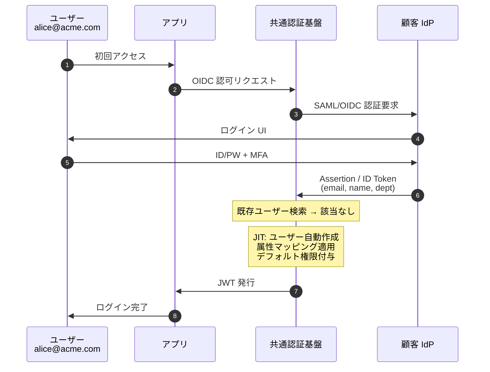
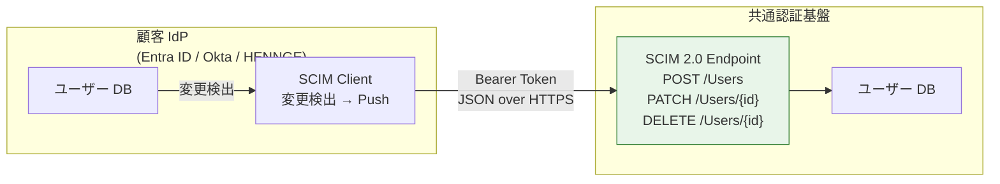
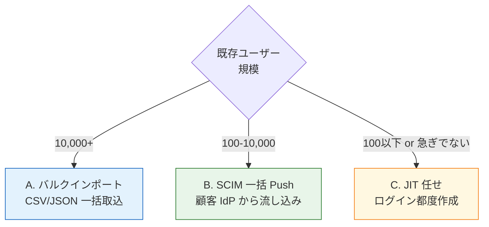

# §5.1 フェデユーザ同期（JIT / SCIM）— スライド草案

> **本資料の位置づけ**: [powerpoint-outline-and-references.md §5.1](../powerpoint-outline-and-references.md) のスライド草案。**6 スライド構成**で、フェデユーザの同期戦略（JIT vs SCIM）、初期投入、Mover/Leaver 連携、Cognito 制約を整理する。
> **対象**: 顧客（情シス / アプリオーナー）
> **想定時間**: 12-15 分（質疑含む）
> **narrative 方針**: 「**基本は JIT（軽量・低運用負荷）、業務要件に応じて SCIM を追加**」 → 業界推奨は JIT-first

---

## 全体構成

| # | スライドタイトル | メインメッセージ | 想定時間 |
|:-:|---|---|:-:|
| **1** | **基本方針: JIT-first、必要に応じて SCIM 併用** | 「JIT で軽量に開始、Leaver 即時遮断が必要なら SCIM 追加」 | 2 分 |
| **2** | **JIT (Just-In-Time) プロビジョニング** | 初回ログイン時にユーザー自動作成、業界標準 | 2 分 |
| **3** | **SCIM 2.0 プロビジョニング (RFC 7644)** | Push 型同期、Leaver / Mover 即時反映 | 3 分 |
| **4** | **JIT vs SCIM 比較 + 併用パターン** | 単独 / 併用の 4 パターンと判定軸 | 3 分 |
| **5** | **既存ユーザー初期投入の 3 戦略** | バルクインポート / SCIM 一括 / JIT 任せ | 2 分 |
| **6** | **ヒアリング項目一覧 + Cognito 制約** | 必要 6 項目 + Cognito SCIM 未対応制約 | 2 分 |

---

## スライド 1: 基本方針 — JIT-first、必要に応じて SCIM 併用

### タイトル
**フェデユーザ同期 基本方針 — JIT-first、Leaver 反映が必要なら SCIM 追加**

### メインメッセージ
> **「フェデユーザは初回ログイン時に JIT（Just-In-Time）で自動作成。退職反映 SLA や事前ユーザー一覧が必要な場合のみ SCIM 2.0 を併用する。」**

### ビジュアル（基本方針図）

```mermaid
flowchart LR
    Start[フェデユーザ同期戦略]
    Q1{Leaver 即時遮断<br/>SLA 必要?}
    Q2{事前ユーザー<br/>一覧 必要?<br/>(招待制 / Role 事前付与)}

    Start --> Q1
    Q1 -->|No| Q2
    Q1 -->|Yes| SCIM[SCIM 2.0 採用<br/>Push 型同期]
    Q2 -->|No| JIT[JIT のみ<br/>★軽量・低運用負荷★]
    Q2 -->|Yes| Both[JIT + SCIM 併用]

    style JIT fill:#e8f5e9,stroke:#2e7d32,stroke-width:3px
    style SCIM fill:#fff8e1,stroke:#f57f17
    style Both fill:#fff3e0,stroke:#e65100
```

### 詳細テキスト

**JIT-first を推奨する理由**:
- ✅ **低運用負荷**: 顧客 IdP 側の SCIM 設定が不要、HTTP/SAML 受信のみで動く
- ✅ **顧客 IdP 仕様非依存**: SCIM 未対応の IdP（古い ADFS、独自実装）にも対応
- ✅ **不要ユーザー作成を抑制**: アクセスしないユーザーは基盤に作られない（GDPR 観点でも好ましい）

**SCIM 追加を検討するトリガー**:
- 退職反映 SLA が「数分〜数時間」級（JIT は本人ログイン契機なので Leaver 反映不可）
- 事前ユーザー一覧が必要（例: 招待メール送信、ロール事前設定）
- 監査要件（SOC2 / ISO27001）で「在籍ユーザー一覧の取得可能性」が必須

### スピーカーノート
- 「『フェデユーザの同期どうしましょう』に対する**最初の選択肢は JIT のみ**」
- 「SCIM は『良いものだが、必要なケースだけ』と位置付け」
- 「Cognito は SCIM 未対応（K 列対象外、Cognito IdP 設定で代替）」

### 参考資料
- [hearing-script/04-user-management.md B-401, B-403](../hearing-script/04-user-management.md)
- [§FR-7.4 SCIM スタンス](../proposal/fr/07-user.md)
- [§FR-2.2.1 JIT プロビジョニング](../proposal/fr/02-federation.md)

---

## スライド 2: JIT (Just-In-Time) プロビジョニング

### タイトル
**JIT プロビジョニング — 初回ログイン時にユーザー自動作成**

### メインメッセージ
> **「顧客 IdP から SAML/OIDC で初回ログインしてきた時点で、認証基盤にユーザーレコードを自動作成。OIDC/SAML の Claim から属性を取り込み、デフォルト権限を付与する。」**

### ビジュアル（JIT シーケンス図）



### 詳細テキスト

**JIT で取り込む典型属性**:
- `sub` / `email` / `name` / `given_name` / `family_name`
- `department` / `employee_id`（カスタム Claim）
- `groups` / `roles`（IdP 側マッピング設定）

**JIT のみで運用する場合の前提**:
- ✅ ユーザー一覧は「ログイン履歴で見える」で OK
- ✅ Leaver 反映は「次回ログイン拒否」で OK（顧客 IdP 側で削除）
- ⚠ Access Token TTL 中は引き続きアクセス可能 → §4.3 Token Revocation と併せて議論

**JIT のデフォルト権限設計**:
- パターン A: 最小権限のみ（業界推奨、テナント管理者が後付け）
- パターン B: テナント標準ロール付与（運用効率優先）
- パターン C: 属性ベース動的決定（dept から自動マッピング）

### スピーカーノート
- 「JIT は **業界標準パターン**（Auth0 / Microsoft Entra B2B / Okta 全て採用）」
- 「『SCIM ないとダメじゃない？』への反論材料: JIT で十分動く、SCIM は追加機能」

### 参考資料
- [Auth0 JIT Provisioning](https://auth0.com/docs/manage-users/user-migration/configure-automatic-migration-from-your-database)
- [Keycloak Identity Provider JIT](https://www.keycloak.org/docs/latest/server_admin/#_identity_broker_first_login)
- [§FR-2.2.1 JIT プロビジョニング](../proposal/fr/02-federation.md)

---

## スライド 3: SCIM 2.0 プロビジョニング (RFC 7644)

### タイトル
**SCIM 2.0 — Push 型同期で Leaver 即時反映、業務 SLA 確保**

### メインメッセージ
> **「顧客 IdP 側のユーザー変更（Joiner/Mover/Leaver）を、リアルタイムに認証基盤へ Push。SLA 即時遮断 / 事前ユーザー一覧 / 監査要件を満たす標準仕様。」**

### ビジュアル（SCIM 同期図）



### 詳細テキスト

**SCIM 2.0 主要オペレーション**（RFC 7644）:
| HTTP メソッド | エンドポイント | 用途 |
|---|---|---|
| `POST` | `/Users` | 新規ユーザー作成（Joiner） |
| `GET` | `/Users/{id}` | ユーザー検索 |
| `PUT` / `PATCH` | `/Users/{id}` | 属性更新（Mover） |
| `DELETE` | `/Users/{id}` | ユーザー削除（Leaver） |
| `POST` | `/Groups` | グループ管理 |

**主要 IdP の SCIM サポート（2026 時点）**:
| IdP | SCIM 対応 | 特記事項 |
|---|:-:|---|
| **Microsoft Entra ID** | ✅ | Galllery アプリ自動連携 / カスタム SCIM URL |
| **Okta** | ✅ | Lifecycle Management 機能 |
| **HENNGE One** | ✅ | カスタムアプリ対応 |
| **OneLogin** | ✅ | リアルタイム同期 |
| **Google Workspace** | ⚠ | 限定的（Google Cloud Identity Premium が必要） |
| **ADFS** | ❌ | SCIM 未対応（JIT のみ） |
| **独自 IdP** | △ | 個別開発 |

**実装上の注意**:
- 顧客 IdP 側で SCIM Client 設定が必要（顧客の運用負荷増）
- Bearer Token の発行・更新フロー設計
- SCIM Endpoint のスケール（テナント数 × ユーザー数 × 変更頻度）

### スピーカーノート
- 「SCIM は **Microsoft Entra ID / Okta では数クリックで設定可能**」
- 「ただし顧客の SCIM 設定運用が必要 → 一部顧客は『面倒だから JIT で』を選択する」
- 「Cognito は SCIM 受け側が**未対応**、Keycloak/RHBK は SCIM プラグイン（Captain-P-Goldfish/scim-for-keycloak）」

### 参考資料
- [SCIM 2.0 (RFC 7644)](https://datatracker.ietf.org/doc/html/rfc7644)
- [Keycloak SCIM Plugin](https://github.com/Captain-P-Goldfish/scim-for-keycloak)
- [Microsoft Entra SCIM Provisioning](https://learn.microsoft.com/en-us/entra/identity/app-provisioning/use-scim-to-provision-users-and-groups)

---

## スライド 4: JIT vs SCIM 比較 + 併用パターン

### タイトル
**JIT vs SCIM の選択 — 4 パターンと判定軸**

### メインメッセージ
> **「業界では 4 パターン（JIT のみ / SCIM のみ / JIT+SCIM / 既存 DB 連携）に分類。退職反映 SLA、事前一覧、IdP 仕様の 3 軸で決定。」**

### ビジュアル（比較表）

| 観点 | JIT のみ | SCIM のみ | **JIT + SCIM 併用** | 既存 DB 連携 |
|---|:-:|:-:|:-:|:-:|
| **Joiner（新規作成）** | ◯ 初回ログイン時 | ◯ Push 受信時 | ◯ どちらでも | ✕ 別途必要 |
| **Mover（属性更新）** | △ ログイン時のみ | ◯ リアルタイム | ◯ リアルタイム | △ |
| **Leaver（削除）即時反映** | ❌ 不可 | ✅ 数秒 | ✅ 数秒 | △ |
| **事前ユーザー一覧** | ❌ 不可 | ✅ 可能 | ✅ 可能 | ✅ |
| **顧客 IdP 設定負担** | ✅ なし | ⚠ あり | ⚠ あり | ⚠ あり |
| **基盤側の運用負荷** | ✅ 低 | △ SCIM スケール考慮 | △ | ✕ 高 |
| **業界推奨度** | ✅ ★★★ | ★★ | ★★★ | ★ |

### 詳細テキスト

**判定軸 1: 退職反映 SLA**
- 「次回ログイン時拒否で OK」→ JIT
- 「数分以内」→ SCIM 必須

**判定軸 2: 事前ユーザー一覧の必要性**
- 招待メール送信が必要 → SCIM
- 「ログイン履歴で一覧化」で OK → JIT

**判定軸 3: 顧客 IdP の SCIM 対応**
- Microsoft Entra / Okta / HENNGE → SCIM 設定容易
- ADFS / 独自 IdP → SCIM 未対応、JIT 一択

**併用パターンの典型**:
- 大口顧客（Enterprise 契約）→ SCIM 設定支援、Leaver 即時遮断
- 小規模顧客（Standard 契約）→ JIT のみ、運用負荷最小
- 同一基盤でテナント別に切り替え可能（テナントメタデータで判定）

### スピーカーノート
- 「**お客様の業界・規模・契約レベルで判定が変わる**、画一的に決めない」
- 「『SCIM ある方が高機能』ではなく『SCIM は SLA 必要な時の追加機能』」

### 参考資料
- [Auth0 SCIM vs JIT 比較](https://auth0.com/blog/automated-user-provisioning-scim/)
- [hearing-checklist.md §2.4 (B-403)](../hearing-checklist.md)

---

## スライド 5: 既存ユーザー初期投入の 3 戦略

### タイトル
**既存ユーザーの初期投入 — 3 つの戦略と選択基準**

### メインメッセージ
> **「既存システムから移行する場合、(A) バルクインポート / (B) SCIM 一括 Push / (C) JIT 任せ の 3 戦略。規模と急ぎ度で選ぶ。」**

### ビジュアル（3 戦略比較）



### 詳細テキスト

**戦略 A: バルクインポート**
- Cognito: `cognito-idp create-import-job` + CSV
- Keycloak: Realm import (JSON)
- メリット: 高速（数万ユーザーを数分）、Day1 から全員ログイン可能
- デメリット: パスワード移行制約（Cognito はハッシュ形式制限）、属性マッピング事前設計

**戦略 B: SCIM 一括 Push**
- 顧客 IdP 側から SCIM Push（Microsoft Entra Provisioning UI で 1 クリック）
- メリット: フェデユーザの場合、自然な流れ（パスワード移行不要）
- デメリット: 数時間〜数日かかる場合あり（SCIM Push のレート制限）

**戦略 C: JIT 任せ**
- 何もしない、各ユーザーが初回ログインで自動作成
- メリット: 運用コストゼロ、不要ユーザー作成抑制（GDPR 観点で好ましい）
- デメリット: 全員ログインするまで一覧把握できない、ロール事前付与不可

**実務でよくある組み合わせ**:
- Day1: 管理者 + 主要ユーザー（数十名）を A or B
- Day2 以降: 残りを C で順次取り込み

### スピーカーノート
- 「**ローカル認証ユーザーの移行**はパスワードハッシュ形式が課題（Cognito の制約大）」
- 「**フェデユーザの移行**は SCIM Push か JIT 任せでスムーズ」
- 「Cognito の bulk import は AWS Console から CSV アップロードが楽」

### 参考資料
- [AWS Cognito Bulk Import](https://docs.aws.amazon.com/cognito/latest/developerguide/cognito-user-pools-using-import-tool.html)
- [Keycloak Realm Import/Export](https://www.keycloak.org/server/importExport)

---

## スライド 6: ヒアリング項目一覧 + Cognito 制約

### タイトル
**ヒアリング項目 — フェデユーザ同期に必要な 6 項目**

### メインメッセージ
> **「以下 6 項目を確定することで、JIT/SCIM 選定 → 初期投入戦略 → 製品選定（Cognito SCIM 非対応）まで決定可能。」**

### ヒアリング項目表

| # | ID | 質問 | 想定回答 | 影響 |
|:-:|---|---|---|---|
| 1 | **B-401** | フェデユーザの同期方式は JIT / SCIM / 既存 DB のいずれか？ | JIT / SCIM / 併用 | 同期方式 |
| 2 | **B-403** | 既存ユーザーは何名くらい在籍？ どこまで事前投入が必要か？ | 規模 + 必要度 | 初期投入 |
| 3 | **B-605-3** | 退職反映の SLA は何分以内？ | 即時 / 数分 / 数時間 / 翌日 | SCIM 採否 |
| 4 | **B-401-2** | JIT/SCIM 時のデフォルト権限はどう設定するか？ | 最小権限 / 標準ロール / 属性ベース | デフォルト権限 |
| 5 | **B-401-3** | ユーザー作成・削除を外部システムに Webhook 通知する必要は？ | あり / なし | Webhook 設計 §5.3 |
| 6 | **B-410** | アカウント重複時の挙動は？（同一メールで複数 IdP）| マージ / 別アカウント / エラー | アカウントリンク §5.4 |

### Cognito 制約注意点

| 項目 | Cognito 対応 | Keycloak/RHBK 対応 |
|---|:-:|:-:|
| **SCIM 2.0 受信エンドポイント** | ❌ 標準機能なし（独自実装必要）| ✅ プラグイン |
| **JIT プロビジョニング** | ✅ Federated Identity Provider 設定 | ✅ |
| **バルクインポート** | ✅ AWS CLI / Console | ✅ Realm Import |
| **Webhook 通知** | ⚠ Lambda Trigger で独自実装 | ✅ Event Listener SPI |

### スピーカーノート
- 「**SCIM 必須 = Cognito 不採用要因**（Lambda + 独自エンドポイント実装で代替可能だが運用負荷大）」
- 「JIT のみで OK なら Cognito で十分」
- 「§5.7 委譲管理、§5.8 JML、§4.3 Token Revocation と密接に関連、合わせて設計」

### 参考資料
- [hearing-script/04-user-management.md B-401, B-403, B-410](../hearing-script/04-user-management.md)
- [hearing-checklist.md §2.4](../hearing-checklist.md)

---

## まとめ用スライド（任意、章末用）

### タイトル
**フェデユーザ同期 — 設計判断のサマリー**

### メインメッセージ
> **「JIT-first を基本に、Leaver SLA / 事前一覧 / 監査要件で SCIM を追加判定。Cognito SCIM 非対応により、SCIM 必須なら Keycloak/RHBK 選定。」**

### 検討ポイント（顧客側）
1. **退職反映 SLA、御社の業務要件で何分以内が必要か**
2. **顧客 IdP は SCIM 対応しているか**（Microsoft Entra / Okta はほぼ対応）
3. **既存ユーザー数と移行スピード要件**
4. **Webhook 通知 / Leaver 即時遮断 / アカウントリンクとセットで議論**

---

## 制作 Tips

### Mermaid 図の PowerPoint への取り込み
- 決定木はそのまま PNG、シーケンス図は SVG が綺麗
- JIT/SCIM の色分けは「JIT=緑（推奨）/ SCIM=黄（追加）」で一貫

### 色使い指針
| 用途 | 色 |
|---|---|
| 推奨パターン（JIT-first）| 緑 |
| 追加機能（SCIM）| 黄 |
| Cognito 制約 | 赤 |

### スライドあたり時間配分
- スライド 1 (基本方針): 2 分 — 「JIT-first」を強調
- スライド 2-3 (JIT/SCIM 詳細): 各 2-3 分
- スライド 4 (比較): 3 分 — 4 パターンの判定軸
- スライド 5 (初期投入): 2 分
- スライド 6 (ヒアリング): 2 分

---

## 関連スライド草案
- [5.7 委譲管理](5.7-delegated-admin-slides.md) — テナント管理者がユーザー管理する場合の責務
- [5.8 JML ライフサイクル](5.8-jml-lifecycle-slides.md) — Joiner/Mover/Leaver 統合視点
- [5.4 アカウント重複・リンク](5.4-account-duplication-linking-slides.md) — JIT/SCIM 重複時の処理
- [4.3 SLO + Token Revocation](4.3-slo-token-revocation-slides.md) — Leaver 反映と Token 失効の連動

---

## 改訂履歴
- 2026-06-03: 初版作成（§5.1 フェデユーザ同期 JIT/SCIM）

- 2026-06-03: **outline §X 構成変更に伴うクロスリファレンス周知**: 認可独立化 (§4) + ITDR 移動 (§7.4)、本スライドは旧 §5.1 → 新 §6.1 に位置付け変更（ファイル名・内容の同期は Phase 2/3 で対応）
- 2026-06-08: **混在環境（JIT + SCIM 併用）の詳細設計を追加文書化**: 設計判断は **[proposal §FR-7.4.5/6/7](../proposal/fr/07-user.md)** にシーケンス 5 種類 + 競合解決ルール + 段階移行手順を追加。Keycloak 実装目線の詳細（externalId 突合 / Sync Mode / First Broker Login Flow 拡張 / マージスクリプト）は **[common/jit-scim-coexistence-keycloak.md](../../common/jit-scim-coexistence-keycloak.md)** に集約。本スライドのスライド 4「JIT vs SCIM 比較」は概要のまま、詳細は上記参照
