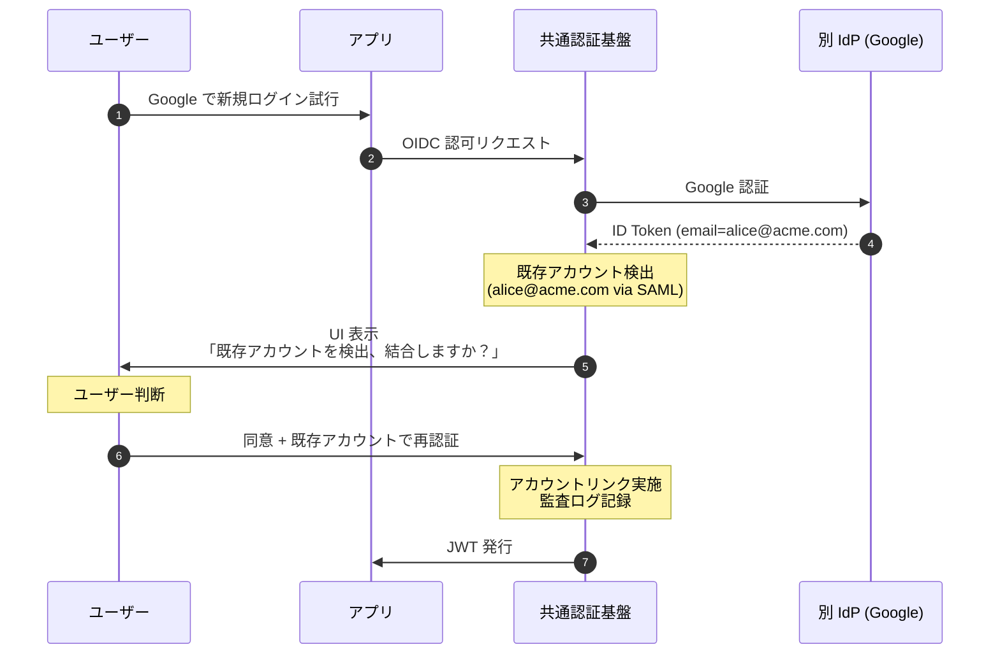
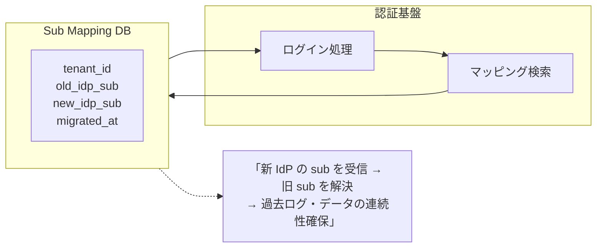

# §5.4 アカウント重複・リンク方針 — スライド草案

> **本資料の位置づけ**: [powerpoint-outline-and-references.md §5.4](../powerpoint-outline-and-references.md) のスライド草案。**6 スライド構成**で、同一テナント内ユーザー重複の検出 + リンクトリガー + IdP 切替時のユーザー連続性を整理する。
> **対象**: 顧客（情シス / アプリオーナー / セキュリティ責任者）
> **想定時間**: 12-15 分（質疑含む）
> **narrative 方針**: 「**業界デフォルトは『別アカウント扱い』、明示的リンクのみ実施**」 → セキュリティリスクが大きいため、自動マージは原則しない

---

## 全体構成

| # | スライドタイトル | メインメッセージ | 想定時間 |
|:-:|---|---|:-:|
| **1** | **アカウント重複が発生する 4 つの状況** | 「IdP 移行 / 複数 IdP 併用 / メールアドレス再利用 / セルフ登録」 | 2 分 |
| **2** | **業界デフォルト: 別アカウント扱い** | OWASP / NIST / Microsoft / Auth0 全て「自動マージしない」 | 2 分 |
| **3** | **重複検出 + リンクの 3 つの戦略** | 厳格分離 / 確認後リンク / 検証済み自動リンク | 3 分 |
| **4** | **Cognito / Keycloak 各製品の実装方針** | Cognito 3 落とし穴 + Keycloak FBL 認証器 | 3 分 |
| **5** | **IdP 切替時のユーザー連続性** | テナント IdP 変更 / IdP 統廃合 / Sub Migration 戦略 | 2 分 |
| **6** | **ヒアリング項目一覧** | 突合せキー / リンクトリガー / IdP 切替計画（6 項目）| 2 分 |

---

## スライド 1: アカウント重複が発生する 4 つの状況

### タイトル
**アカウント重複 — 発生する 4 つの状況**

### メインメッセージ
> **「『同一人物が複数アカウントを持つ』状況は (1) IdP 移行 / (2) 複数 IdP 併用 / (3) メール再利用 / (4) セルフ登録の 4 種、それぞれ対応戦略が異なる。」**

### ビジュアル（4 つの状況図）

```mermaid
flowchart TB
    subgraph Case1["①IdP 移行"]
        C1[同じ alice@acme.com<br/>旧 IdP → 新 IdP 切替]
    end
    subgraph Case2["②複数 IdP 併用"]
        C2[alice@acme.com via SAML<br/>+ alice@acme.com via Google]
    end
    subgraph Case3["③メール再利用"]
        C3[alice@acme.com 退職<br/>→ 別人 alice@acme.com 入社]
    end
    subgraph Case4["④セルフ登録"]
        C4[alice@gmail.com 自己登録<br/>+ alice@acme.com via SSO]
    end

    style Case1 fill:#e3f2fd
    style Case2 fill:#e8f5e9
    style Case3 fill:#fff8e1
    style Case4 fill:#ffebee
```

### 詳細テキスト

**各状況の対応戦略**:

| # | 状況 | 推奨対応 | リスク |
|---|---|---|---|
| ① | **IdP 移行** | 旧 IdP `sub` → 新 IdP `sub` のマイグレーション計画 | データロス、過去ログ追跡不能 |
| ② | **複数 IdP 併用** | アカウントリンク（ユーザー明示確認）| 自動リンクは権限昇格攻撃のリスク |
| ③ | **メール再利用**（退職→別人入社）| **絶対に同一扱いしない**、過去の sub と切り離す | プライバシー / セキュリティ重大事故 |
| ④ | **セルフ登録 + SSO**（B2C 寄り）| ユーザーに明示確認後リンク | 「乗っ取り」のリスク（メール所有確認必須）|

### スピーカーノート
- 「お客様の業務シナリオで **どの状況が発生し得るか** を確認」
- 「③メール再利用は **B2B SaaS で頻発する事故源**、設計で防ぐ」
- 「業界では『**メール = 一意キー』にしてはいけない**』が定説」

### 参考資料
- [hearing-script/04-user-management.md B-406〜410](../hearing-script/04-user-management.md)
- [§FR-2.2.1.A 同一テナント内ユーザー重複](../proposal/fr/02-federation.md)
- [project_account_linking_investigation.md](#内部メモ)

---

## スライド 2: 業界デフォルト — 別アカウント扱い

### タイトル
**業界デフォルト — 「自動マージしない」が標準**

### メインメッセージ
> **「OWASP / NIST / Microsoft Entra / Auth0 / Okta、業界の主要プレイヤー全てが『同一メールでも自動マージしない』を既定動作としている。」**

### ビジュアル（業界スタンス比較）

| プレイヤー | スタンス | 根拠 |
|---|---|---|
| **OWASP** | 「**自動アカウントリンクは権限昇格攻撃の温床**」 | [OWASP Authentication Cheat Sheet](https://cheatsheetseries.owasp.org/cheatsheets/Authentication_Cheat_Sheet.html) |
| **NIST SP 800-63B** | 「フェデレーション時の主体は `sub` であり、メール等の属性ではない」 | NIST SP 800-63B §6.1 |
| **Microsoft Entra ID** | デフォルトは別アカウント、明示的 `Invite to External Tenant` 必要 | Microsoft Docs |
| **Auth0** | デフォルトは別、管理画面で `Account Linking` 有効化必要 | Auth0 Docs |
| **Okta** | デフォルトは別、`Profile Sourcing` 設定で結合可能（ただし慎重）| Okta Docs |

### 詳細テキスト

**「自動マージ」が危険な理由**:

1. **権限昇格攻撃 (Privilege Escalation)**:
   - 攻撃者が自分のメール `victim@example.com` で別 IdP に登録
   - 同名メールで自動マージ → 被害者の権限を取得

2. **メール再利用問題**:
   - 退職者のメールアドレスを後任者が引き継ぐ（一般的な企業運用）
   - 自動マージすると、後任者が前任者のデータにアクセス可能に

3. **メール所有確認の脆弱性**:
   - 古い IdP の検証済みメールが現在も有効とは限らない
   - 信頼すべきは **IdP 側のメール検証ステータス + 直前確認**

**業界推奨パターン**:
- **明示的リンク**: ユーザーが「これは私の別アカウントです」と認証後に申告
- **管理者リンク**: テナント管理者が手動で結合（監査ログ必須）
- **検証済み自動リンク**: 同一 IdP 内 + メール検証済み + 直前認証完了 の **3 条件揃った場合のみ**

### スピーカーノート
- 「『便利だから自動マージしてよ』というリクエストには **業界スタンダードを根拠に反論**」
- 「セキュリティ責任者がいる場では、この業界スタンスを最初に共有」

### 参考資料
- [OWASP Authentication Cheat Sheet](https://cheatsheetseries.owasp.org/cheatsheets/Authentication_Cheat_Sheet.html)
- [Microsoft Account Linking Best Practices](https://learn.microsoft.com/en-us/entra/identity/users/users-restrict-guest-permissions)
- [Auth0 Account Linking](https://auth0.com/docs/manage-users/user-accounts/user-account-linking)

---

## スライド 3: 重複検出 + リンクの 3 つの戦略

### タイトル
**重複検出 + リンク — 3 つの戦略**

### メインメッセージ
> **「(A) 厳格分離（自動マージなし、管理者のみ操作可）/ (B) 確認後リンク（ユーザー明示同意で結合）/ (C) 検証済み自動リンク（3 条件揃いのみ）の 3 戦略から、業務リスク許容度で選ぶ。」**

### ビジュアル（3 戦略比較）

| 観点 | A. 厳格分離 | B. 確認後リンク | C. 検証済み自動リンク |
|---|:-:|:-:|:-:|
| **既定動作** | 別アカウント | 別アカウント、UI で結合提案 | 条件揃ったら自動結合 |
| **必要条件** | - | ユーザー明示同意 | 同 IdP + メール検証済 + 直前認証 |
| **業務 UX** | △ 不便 | ◯ 良好 | ◎ シームレス |
| **セキュリティ** | ✅ 最高 | ✅ 高 | ⚠ 中（条件設定誤りで脆弱）|
| **適用業界** | 金融 / 医療 / 政府 | 一般 B2B SaaS | B2C / 小規模 |
| **推奨度** | ★★（高セキュリティ）| **★★★（業界標準）** | ★（要件次第）|

### 戦略 B（確認後リンク）の典型フロー



### 詳細テキスト

**戦略 C（自動リンク）の 3 条件詳細**:
1. **同一 IdP 内**: 例えば「Google」内での重複（メール変更等）のみ
2. **メール検証済み (`email_verified=true`)**: IdP が「このメールは本当に本人のもの」と保証
3. **直前認証完了**: 最後の認証から数分以内（リプレイ攻撃防止）

**「同意 UI」設計のベストプラクティス**:
- 既存アカウントを誰でも見えないよう、メールマスキング (`a***@a***.com`)
- 既存 IdP での **再認証必須**（所有確認）
- リンク操作の **元に戻せない性質を明示**
- **監査ログに完全記録**（後追い可能に）

### スピーカーノート
- 「**戦略 B が業界標準**、戦略 A は『高セキュリティ業務のみ』、戦略 C は『要件慎重に』」
- 「お客様の業界・データの機密度で判定」
- 「リンク UI のセキュリティ設計は **OWASP 推奨パターンを必ず遵守**」

### 参考資料
- [OWASP Account Linking](https://cheatsheetseries.owasp.org/cheatsheets/Authentication_Cheat_Sheet.html#account-linking)
- [Auth0 Account Linking Flows](https://auth0.com/docs/manage-users/user-accounts/user-account-linking/link-user-accounts)

---

## スライド 4: Cognito / Keycloak 各製品の実装方針

### タイトル
**製品別の実装方針 — Cognito 3 落とし穴 + Keycloak FBL 認証器**

### メインメッセージ
> **「Cognito は『落とし穴』が 3 つ（Linked Identity / Email Reuse / Sub Migration）、Keycloak は『First Broker Login (FBL) 認証器』で安全にリンク可能。製品選定にも影響。」**

### Cognito の 3 落とし穴

| # | 落とし穴 | 影響 | 対策 |
|:-:|---|---|---|
| 1 | **Linked Identity の混乱**: 同一メールで Cognito Pool 内ユーザー + Federated Identity が紐付く既定挙動 | 想定外の自動リンク発生 | Lambda Trigger で明示制御（Pre-Sign-Up） |
| 2 | **Email Reuse**: メールアドレスがユニーク制約だが、Federated Identity 経由は重複可能 | メール再利用時の事故 | Custom Attribute で `sub` を一意キー化 |
| 3 | **Sub Migration の不可逆性**: 一度発行された `sub` (UUID) を変更不可 | IdP 移行時の連続性問題 | カスタム ID マッピングテーブル別途構築 |

### Keycloak の First Broker Login (FBL) 認証器

```
[Identity Provider Redirector]
   ↓
[Cookie] (既存 SSO セッション確認)
   ↓
[Identity Provider Authentication]
   ↓
[First Broker Login Flow] ← ★ここでリンク判定★
   ↓
[Review Profile] (属性確認・編集)
   ↓
[Create User If Unique] (新規 or 既存検出)
   ↓
[Confirm Link Existing Account] ← ★ユーザー同意 UI★
   ↓
[Verify Existing Account by Re-authentication] ← ★再認証で所有確認★
```

### 詳細テキスト

**Cognito 採用時の追加実装**:
- Pre-Sign-Up Lambda Trigger: メール重複時の挙動制御
- Custom Attribute: `external_sub`（IdP 側 sub を保存）+ `linked_idps`（連携 IdP リスト）
- AdminLinkProviderForUser API: 管理者が手動リンク
- 監査ログ用 CloudWatch Custom Metric / Lambda Logs

**Keycloak 採用時の標準機能**:
- FBL Authentication Flow: 上記フローが標準提供
- 管理画面で各ステップの有効/無効・順序を変更可能
- `kc_idp_hint` パラメータで IdP 強制指定
- Account Console でユーザー自身がリンク管理可能

**比較表**:
| 項目 | Cognito | Keycloak |
|---|:-:|:-:|
| 自動リンク既定 | ⚠ 一部あり（混乱の元）| ✅ なし（明示的フロー）|
| ユーザー同意 UI | ✕ 自作必要 | ✅ 標準 |
| 管理者リンク API | ✅ あり | ✅ あり |
| 監査ログ | △ Lambda 経由 | ✅ Event SPI 標準 |
| 推奨度 | △ 慎重設計必要 | ✅ 推奨 |

### スピーカーノート
- 「**アカウントリンク要件が複雑 = Keycloak 推奨**」
- 「Cognito の 3 落とし穴は弊社 PoC で検証済み（[project_account_linking_investigation.md] 参照）」
- 「Keycloak の FBL は B2B SaaS のデファクト」

### 参考資料
- [Keycloak First Broker Login](https://www.keycloak.org/docs/latest/server_admin/#_identity_broker_first_login)
- [AWS Cognito AdminLinkProviderForUser](https://docs.aws.amazon.com/cognito-user-identity-pools/latest/APIReference/API_AdminLinkProviderForUser.html)
- 内部: project_account_linking_investigation.md

---

## スライド 5: IdP 切替時のユーザー連続性

### タイトル
**IdP 切替時のユーザー連続性 — Sub Migration 戦略**

### メインメッセージ
> **「テナントが顧客 IdP を変更（例: Okta → Microsoft Entra）する際、ユーザー `sub` が変わる。データの連続性を保つには 3 つの Migration 戦略のいずれかが必要。」**

### ビジュアル（3 Migration 戦略）

| 戦略 | 内容 | 適用シナリオ | コスト |
|---|---|---|---|
| **A. Sub Mapping Table** | 旧 sub → 新 sub の対応表を別 DB で保持 | 大規模移行 / 過去ログ完全保持 | ◯ |
| **B. Email ベース再リンク** | メールアドレス + ユーザー同意で再リンク | 中規模 / 段階移行 | ◯ |
| **C. アプリ側でユーザー再リンク UI** | ユーザーに「移行完了」確認させる | 小規模 / B2C | ✅ |

### Sub Mapping Table 戦略の構成



### 詳細テキスト

**Migration 実施時の典型課題**:

1. **過去ログの追跡可能性**: 旧 `sub` で記録された監査ログを新 `sub` でも辿れるか
2. **アプリ DB の外部キー**: 各アプリが `sub` を主キーとして使っている場合の更新
3. **段階移行**: 全ユーザー一斉ではなく順次切替の場合のハイブリッド運用
4. **ロールバック**: 移行失敗時の旧 IdP 復帰手順

**推奨アプローチ（業界事例）**:
- Phase 1: Sub Mapping Table 構築 + 双方の IdP 並行運用 (2-4 週間)
- Phase 2: 各テナントで個別切替実施、Mapping Table に登録
- Phase 3: 旧 IdP を Read-only に、新 IdP を本番化
- Phase 4: 3-6 ヶ月の Cool-down 期間後に旧 IdP 撤去

**Cognito vs Keycloak の Migration 機能**:
- Cognito: `sub` 変更不可、Sub Mapping Table 別途必須
- Keycloak: Identity Provider Mapper で柔軟マッピング、`syncMode=FORCE` で属性再取得可能

### スピーカーノート
- 「Sub Migration は **見落とされがちな運用課題**、PoC 段階から設計に組み込む」
- 「Mapping Table は **顧客企業ごとに独立**、テナント単位で管理」
- 「**移行失敗時のロールバック手順** を必ず Runbook 化」

### 参考資料
- [§FR-2.2.4 属性ライフサイクル設計](../proposal/fr/02-federation.md)
- [Microsoft Entra B2B Migration Guide](https://learn.microsoft.com/en-us/entra/external-id/cross-tenant-access-overview)

---

## スライド 6: ヒアリング項目一覧

### タイトル
**ヒアリング項目 — アカウント重複・リンク設計に必要な 6 項目**

### メインメッセージ
> **「以下 6 項目を確定することで、戦略選定 → 製品選定 → Sub Migration 計画まで決定可能。」**

### ヒアリング項目表

| # | ID | 質問 | 想定回答 | 影響 |
|:-:|---|---|---|---|
| 1 | **B-406** | 同一テナント内ユーザー重複は発生し得るか？想定されるシナリオは？ | IdP 移行 / 複数 IdP / メール再利用 / セルフ登録 | 設計範囲 |
| 2 | **B-407** | 重複検出時の挙動: 別アカウント / 確認後リンク / 自動リンク | A / B / C 戦略選択 | 戦略選定 |
| 3 | **B-408** | 突合せキー: メール / sub / カスタム ID | メール / カスタム | 重複判定 |
| 4 | **B-409** | アカウントリンクのトリガー: ユーザー操作 / 管理者操作 / 自動 | UI / Admin / Auto | リンクフロー |
| 5 | **B-410** | IdP 切替時のユーザー連続性: Sub Mapping / Email 再リンク / 不要 | A / B / C 戦略 | Migration |
| 6 | **B-605-3** | 退職者のメール再利用ポリシー: 即時 / 一定期間後 / 永久禁止 | ポリシー | 重複判定 |

### スピーカーノート
- 「6 項目のうち **#2 戦略選択 + #5 IdP 切替** が最重要」
- 「お客様内で『**メール再利用ポリシー**』を明文化していない場合が多い、ここで議論する」
- 「§5.7 委譲管理（テナント管理者の権限）、§5.8 JML（Leaver 反映）と密接に関連」

### 参考資料
- [hearing-script/04-user-management.md B-406〜410](../hearing-script/04-user-management.md)
- [hearing-checklist.md §2.4, §3.5 (B-408)](../hearing-checklist.md)

---

## まとめ用スライド（任意、章末用）

### タイトル
**アカウント重複・リンク — 設計判断のサマリー**

### メインメッセージ
> **「業界デフォルトは『別アカウント扱い』、明示的リンクのみ実施。Cognito 3 落とし穴を理解、Keycloak FBL が標準パターン。Sub Migration は別途計画必須。」**

### 検討ポイント（顧客側）
1. **どの状況の重複が発生し得るか**（4 つの状況）
2. **戦略 A/B/C のどれを選ぶか**（業務リスク許容度で）
3. **IdP 切替の予定はあるか**（Sub Migration 戦略）
4. **退職者のメール再利用ポリシーは**
5. **Cognito 3 落とし穴 vs Keycloak FBL の比較**

---

## 制作 Tips

### Mermaid 図の PowerPoint への取り込み
- 4 状況の図は色分け（青/緑/黄/赤）でリスク順
- シーケンス図で「ユーザー同意」フローを強調

### 色使い指針
| 用途 | 色 |
|---|---|
| 業界標準（戦略 B）| 緑 |
| 高セキュリティ（戦略 A）| 青 |
| 注意要（戦略 C / 自動マージ）| 赤 |
| Cognito 落とし穴 | 赤太枠 |

### スライドあたり時間配分
- スライド 1 (4 状況): 2 分
- スライド 2 (業界デフォルト): 2 分 — 自動マージ NG を強調
- スライド 3 (3 戦略): 3 分 — シーケンス図必須
- スライド 4 (製品比較): 3 分 — Cognito 3 落とし穴
- スライド 5 (Sub Migration): 2 分
- スライド 6 (ヒアリング): 2 分

---

## 関連スライド草案
- [5.1 フェデユーザ同期](5.1-federation-sync-slides.md) — JIT/SCIM 時の重複検出
- [5.7 委譲管理](5.7-delegated-admin-slides.md) — 管理者リンク権限
- [5.8 JML ライフサイクル](5.8-jml-lifecycle-slides.md) — Leaver 後のメール再利用

---

## 改訂履歴
- 2026-06-03: 初版作成（§5.4 アカウント重複・リンク方針）

- 2026-06-03: **outline §X 構成変更に伴うクロスリファレンス周知**: 認可独立化 (§4) + ITDR 移動 (§7.4)、本スライドは旧 §5.4 → 新 §6.4 に位置付け変更（ファイル名・内容の同期は Phase 2/3 で対応）
