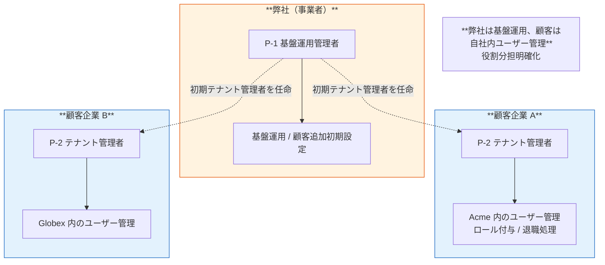
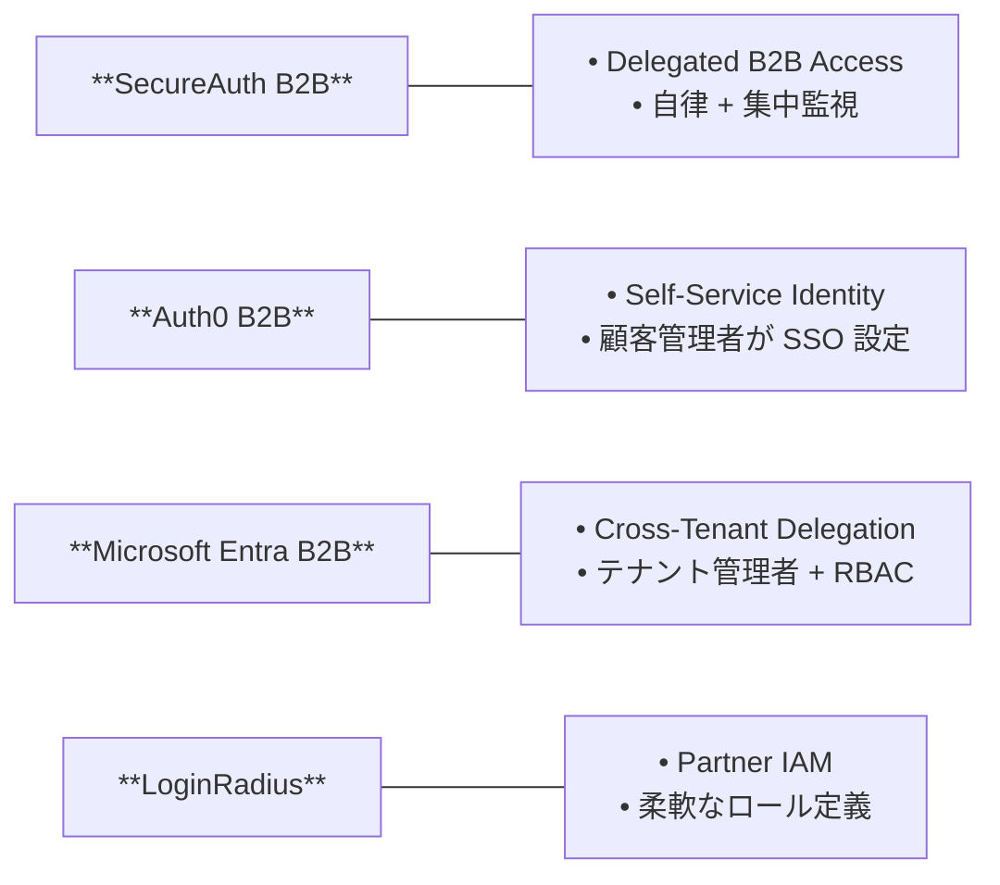
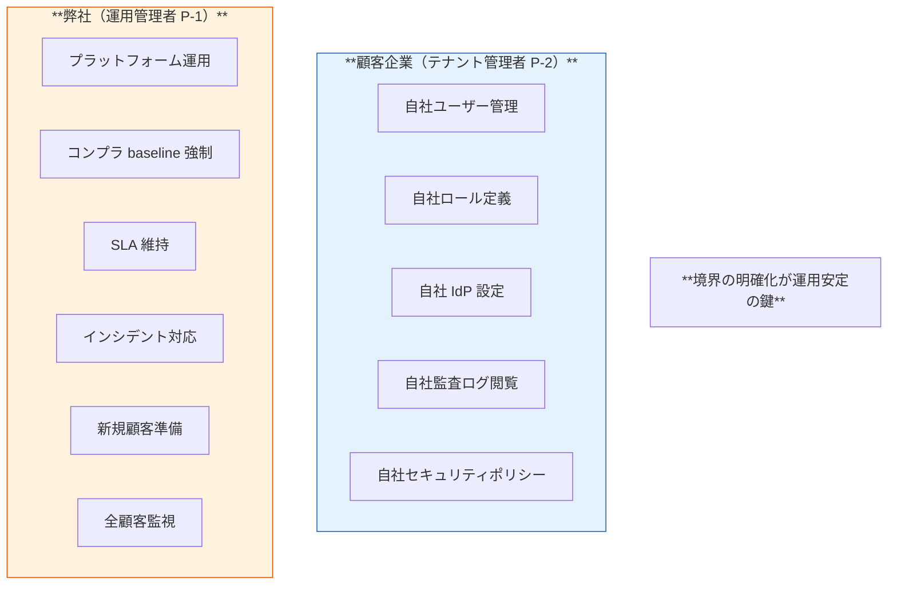

# §5.7 委譲管理（Delegated Administration）— スライド草案

> **本資料の位置づけ**: [powerpoint-outline-and-references.md §5.7](../powerpoint-outline-and-references.md) のスライド草案。**6 スライド構成**で、顧客テナント管理者への委譲設計を整理。**ユーザー Q2「全件委譲でも定義必要事項あり」を反映**。
> **対象**: 顧客（情シス / 経営層 / アプリオーナー）
> **想定時間**: 12-15 分（質疑含む）
> **narrative 方針**: 「**autonomy within scope, centralized oversight**（業界標準）」+ Q2 で議論した「全件委譲でも 5 項目の定義必要」を明示

---

## 全体構成

| # | スライドタイトル | メインメッセージ | 想定時間 |
|:-:|---|---|:-:|
| **1** | **委譲管理とは — B2B SaaS の必須要件** | 顧客テナント管理者に自社ユーザー管理を任せる仕組み | 2 分 |
| **2** | **業界標準: autonomy + centralized oversight** | LoginRadius / SecureAuth / Wristband のベストプラクティス | 2 分 |
| **3** | **委譲範囲の選択肢（全権 / 段階的 / 限定）** | 4 パターン提示 | 3 分 |
| **4** | **全件委譲でも定義必要な 5 項目（Q2 反映）** | 「全件委譲だから何もしない」は誤り | 3 分 |
| **5** | **弊社側に残るガバナンス領域** | 委譲外の責務（コンプラ baseline / SLA 維持 等）| 2 分 |
| **6** | **ヒアリング項目一覧** | B-404, B-608 等 + 委譲範囲合意 | 2 分 |

---

## スライド 1: 委譲管理とは — B2B SaaS の必須要件

### タイトル
**委譲管理（Delegated Administration）— B2B SaaS の必須要件**

### メインメッセージ
> **「委譲管理とは、顧客企業の管理者（P-2 テナント管理者）が自社ユーザー管理を独立して実施できる仕組みです。B2B SaaS では必須要件です」**

### ビジュアル（委譲管理の構造）



### 詳細テキスト

**委譲管理が必要な理由**:
- **顧客企業のユーザーは顧客自身が一番よく知っている**（誰が誰か / 何をするか）
- 弊社が顧客内のユーザー管理に介入すると **サポート工数爆発 + UX 悪化**
- **業界調査**: B2B SaaS の必須機能（[LoginRadius](https://www.loginradius.com/blog/identity/b2b-iam-best-practices), [SecureAuth](https://docs.secureauth.com/iam/overview-b2b-identity-and-access-mgmt)）

**委譲管理の対象**:
- 顧客企業内のユーザー CRUD（追加 / 編集 / 削除）
- ロール / 権限の付与
- 顧客 IdP 設定変更（接続情報の更新）
- 監査ログ閲覧（自社分のみ）
- セキュリティポリシー設定（自社分のみ）

### スピーカーノート
- 「**「全て弊社で管理する」は B2B SaaS では現実的でない**」を強調
- 「**顧客が IdP federation で全件流入する場合でも委譲管理は必要**」（Q2 への伏線）

### 参考資料
- [hearing-script/04-user-management.md B-404 テナント管理者の委譲](../hearing-script/04-user-management.md)
- [§FR-8.3 管理機能 / 委譲管理](../proposal/fr/08-admin.md)
- [Auth0 B2B Multi-tenancy](https://auth0.com/blog/demystifying-multi-tenancy-in-b2b-saas/)

---

## スライド 2: 業界標準 — autonomy within scope + centralized oversight

### タイトル
**業界標準 — 「自律 + 監視」の両立**

### メインメッセージ
> **「業界ベストプラクティスは『各テナント管理者に自律性を与えつつ、ログ・承認・例外処理で中央監視を維持』する設計」**

### ビジュアル（業界標準の整理）

| 業界ベストプラクティス | 内容 | 出典 |
|---|---|---|
| **autonomy within scope** | 各テナント管理者は**自社内で完結**して操作可能 | [Security Boulevard 2025](https://securityboulevard.com/2025/06/delegated-administration-in-partner-iam-best-practices/) |
| **centralized oversight** | 弊社側で**ログ / 承認 / 例外処理**を集中監視 | 同上 |
| **role templates + fine-grained permissions** | 静的な "Admin/Member/Viewer" でなく**柔軟なロール定義** | [WorkOS Top RBAC providers 2025](https://workos.com/blog/top-rbac-providers-for-multi-tenant-saas-2025) |
| **task-based design**（**not authority-based**）| 「管理者だから何でもできる」ではなく**タスク単位で権限を絞る** | [Wristband B2B Auth](https://www.wristband.dev/blog/multi-tenant-b2b-authentication-explained-key-concepts-components) |
| **high-impact actions require additional verification** | 高権限操作（ロール変更 / 削除）には追加 MFA / 承認 | 同上 |
| **self-service identity management** | 顧客管理者が SSO / SCIM / ドメイン / ユーザー管理を**独立して設定** | [Security Boulevard 2025](https://securityboulevard.com/2025/06/delegated-administration-in-partner-iam-best-practices/) |

### 業界実例



### スピーカーノート
- 「**全部弊社が管理 vs 全部顧客に任せる、ではない**」を強調
- 「**autonomy + oversight の両立**」が業界標準

### 参考資料
- [Security Boulevard: Delegated Administration in Partner IAM 2025](https://securityboulevard.com/2025/06/delegated-administration-in-partner-iam-best-practices/)
- [Wristband B2B Multi-tenant Auth](https://www.wristband.dev/blog/multi-tenant-b2b-authentication-explained-key-concepts-components)
- [SecureAuth Delegated B2B Access](https://secureauth.com/resources/webinars/delegated-b2b-access)
- [LoginRadius B2B IAM Best Practices](https://www.loginradius.com/blog/identity/b2b-iam-best-practices)

---

## スライド 3: 委譲範囲の選択肢（4 パターン）

### タイトル
**委譲範囲の選択肢 — 4 パターンから選択**

### メインメッセージ
> **「委譲範囲は『ユーザー CRUD のみ』から『全権委譲』まで段階的に選択できます。御社の運用方針に合わせて決定」**

### ビジュアル（4 パターン比較）

| パターン | 委譲範囲 | 弊社側責務 | 採用シーン | 想定顧客 |
|:-:|---|---|---|---|
| **A. 弊社管理** | 委譲なし、弊社で全管理 | 全件 | 小規模顧客のみ | × 1500-3000 顧客では不可 |
| **B. ユーザー CRUD のみ委譲** | 追加 / 編集 / 削除のみ | ロール定義・IdP 設定 | 段階導入時 | 段階導入の初期 |
| **C. + ロール管理委譲** | + ロール付与・編集 | IdP 設定・コンプラ | 一般的な B2B SaaS | **業界標準** |
| **D. 全権委譲** ⭐ | + IdP 設定 + 監査ログ閲覧 + セキュリティポリシー | 基盤運用・SLA 維持・コンプラ baseline 強制 | 顧客企業の IT 成熟度高 | **御社想定** |

### ロール定義の例

```
Tenant Admin（全権、パターン D）
├── User Admin（CRUD + ロール付与）
│   └── Helpdesk（PW リセット + アカウント閲覧のみ）
├── IdP Admin（IdP 設定変更のみ）
└── Auditor（監査ログ閲覧のみ、Read-Only）
```

### 詳細テキスト

**パターン D（全権委譲）採用時のメリット**:
- 顧客企業の自律性最大化、サポート工数最小化
- 顧客企業 IT 部門が自社のセキュリティポリシーを反映可能

**パターン D 採用時の注意**:
- **「全権委譲だから何もしなくていい」は誤り**（次スライド詳述）
- **5 項目の定義 + 弊社ガバナンス領域の明確化が必要**

### スピーカーノート
- 「**御社は全権委譲（パターン D）を想定**」を確認
- 「業界標準は C か D」と説明、御社規模では D 推奨

### 参考資料
- [hearing-script/04-user-management.md B-404](../hearing-script/04-user-management.md)
- [WorkOS Top RBAC providers 2025](https://workos.com/blog/top-rbac-providers-for-multi-tenant-saas-2025)

---

## スライド 4: 全件委譲でも定義必要な 5 項目 ⭐ Q2 反映

### タイトル
**全件委譲でも定義必要な 5 項目（Q2 への対応）**

### メインメッセージ
> **「『全権委譲』を選んでも、以下 5 項目は必ず定義が必要です。これを定義しないと運用が破綻します」**

### ビジュアル（5 項目チェックリスト）

| # | 定義必要事項 | 内容 | 該当ヒアリング ID |
|:-:|---|---|---|
| **1** | **テナント管理者の認証方法** | 顧客 IdP 経由でフェデ認証（OK、決定済）| B-200 マスター表 B |
| **2** | **初期テナント管理者の任命方法** | 新規顧客オンボーディング時、誰が最初の管理者になるか:<br/>(a) 弊社で初期付与<br/>(b) セルフサインアップ | **B-608** オンボーディング主体 |
| **3** | **テナント管理者の権限範囲** | 全権委譲でも**具体的範囲を明示**:<br/>- ユーザー CRUD<br/>- ロール管理<br/>- IdP 設定変更<br/>- 監査ログ閲覧<br/>- 退職処理<br/>- SCIM 設定<br/>- セキュリティポリシー設定 | **B-404** 委譲管理 |
| **4** | **管理者間の権限移譲** | テナント管理者が他テナント管理者を任命できるか?<br/>退職時の引継ぎフロー | 新規（B-404-2 推奨）|
| **5** | **弊社側に残るガバナンス領域** | 次スライドで詳述 | §FR-8.3 |

### よくある誤解と訂正

| 誤解 | 訂正 |
|---|---|
| 「全件委譲 = 何もしなくていい」 | ❌ 5 項目の定義 + ガバナンス領域は依然必要 |
| 「自社（弊社）ユーザの管理は不要」 | ❌ 基盤運用管理者（P-1）の管理は別途必要（次スライド）|
| 「顧客が IdP federation で全件流入する場合は委譲管理不要」 | ❌ federation 後の**基盤側のユーザー管理権限**は別の話 |

### スピーカーノート
- 「**ユーザー Q2 への直接回答**」と明示
- 「全件委譲でも 5 項目は必須」を強調
- 特に **B-608 初期任命** と **B-404 権限範囲明示**は重要

### 参考資料
- [hearing-script/04-user-management.md B-404](../hearing-script/04-user-management.md)
- [hearing-script/06-multitenancy.md B-608 オンボーディング主体](../hearing-script/06-multitenancy.md)
- [§FR-8.3 管理機能・委譲管理](../proposal/fr/08-admin.md)

---

## スライド 5: 弊社側に残るガバナンス領域 ⭐ 重要

### タイトル
**弊社側に残るガバナンス領域 — 委譲外の責務**

### メインメッセージ
> **「全権委譲しても、以下のガバナンス領域は弊社の責務として残ります」**

### ビジュアル（ガバナンス領域マトリクス）

| 領域 | 内容 | 理由 |
|---|---|---|
| **コンプラ baseline 強制** | パスワードポリシー / MFA レベル / セッション TTL を弊社で強制 | 全顧客で**最低限のセキュリティ baseline**を担保 |
| **SLA 維持** | 99.95-99.99% 可用性、性能、レイテンシ | プラットフォーム責務 |
| **インシデント対応** | 障害 / 侵害 / 脆弱性発見時の対応 | プラットフォーム責務 |
| **セキュリティ baseline 強制** | 暗号化 / 監査ログ / アクセス制御 | コンプラ要件（SOC 2 / ISO 27001）|
| **プラットフォーム障害対応** | Cognito / Keycloak のバージョンアップ / パッチ適用 | プラットフォーム責務 |
| **新規顧客追加準備** | Realm/Organization 作成、IdP 連携初期設定 | 弊社運用管理者（P-1）の責務 |
| **緊急時の Break Glass アクセス** | 顧客側で運用困難時の弊社最終手段 | P-5 ローカル管理者 |
| **課金管理** | MAU 課金、ティア別料金 | 事業者責務 |
| **全顧客横断の監視** | プラットフォーム全体の健全性監視 | SRE 責務 |
| **法定対応** | GDPR / 個人情報保護法対応 | 事業者責務 |

### 弊社・顧客の責任分界図



### 詳細テキスト

**弊社運用管理者（P-1）の管理は別途必要**:
- 顧客テナント管理は委譲しても、**プラットフォーム自体の運用**は弊社責務
- 弊社内 IdP 経由で認証（マスター表 B 事業者行）
- Break Glass ローカル管理者（P-5）を 2-3 名保持（緊急時の最後の砦）

### スピーカーノート
- 「**全権委譲 ≠ 弊社が手放す**」を強調
- 「**ガバナンスは弊社責務**として残ることを明示」

### 参考資料
- [§FR-1.2.0.0 利用者カテゴリ P-1 / P-2 / P-5](../proposal/fr/01-auth.md)
- [§FR-8.3 管理機能・委譲管理](../proposal/fr/08-admin.md)

---

## スライド 6: ヒアリング項目一覧

### タイトル
**ヒアリング項目 — 委譲管理関連 5 項目**

### メインメッセージ
> **「以下 5 項目について御社の方針をお聞かせください。回答により委譲範囲とガバナンス境界が決まります」**

### ヒアリング項目表

| # | 項目 ID | 確認内容 | 期待回答 | 重要度 |
|:-:|---|---|---|:-:|
| 1 | **B-404** ⭐ | **テナント管理者の委譲範囲（4 パターン A/B/C/D）** | パターン選択 + 範囲明示 | 🟢 |
| 2 | **B-608** ⭐ | **オンボーディング主体（初期管理者任命方法）** | 弊社運用 / セルフ / ハイブリッド | 🟡 |
| 3 | **B-404-2**（新規）| **管理者間の権限移譲**（他テナント管理者を任命できるか）| Yes/No | 🟢 |
| 4 | **§FR-8.3** | **弊社側に残るガバナンス領域の合意** | 合意 / 追加領域あり | 🟡 |
| 5 | **A-5-2 / A-5-3** | **利用者カテゴリ確認**（P-1 / P-2 / P-5 の有無）| 該当カテゴリ | 🔥 |

### 期待される結論（御社想定）

| 項目 | 想定回答 |
|---|---|
| **B-404 委譲範囲** | **パターン D 全権委譲**（顧客企業の IT 成熟度高い前提）|
| **B-608 オンボーディング** | **弊社運用 + セルフサービス混合**（初期は弊社、以降は顧客）|
| **B-404-2 管理者間移譲** | **Yes**（顧客企業内で完結可能）|
| **ガバナンス領域** | 上記 10 項目すべて弊社責務として合意 |
| **利用者カテゴリ** | **採用シナリオ γ**（管理者層のみローカル、P-1/P-2/P-5）|

### スピーカーノート
- 「**Q2 への直接回答**: 全件委譲でも 5 項目は必須」を最後にもう一度強調
- 「次回ヒアリングまでに権限範囲の詳細を確認」とアクション提示

### 参考資料
- [hearing-checklist.md §2.4 ユーザー管理ポリシー](../hearing-checklist.md)
- [hearing-checklist-excel-main.tsv B-404, B-608](../hearing-checklist-excel-main.tsv)

---

## まとめ用スライド

### タイトル
**委譲管理 — まとめ**

| 観点 | 本基盤の方針 |
|---|---|
| **基本（業界標準）** | **autonomy within scope + centralized oversight** |
| **委譲範囲** | **パターン D 全権委譲**（御社想定）|
| **全件委譲でも必須** | **5 項目の定義**（認証 / 初期任命 / 権限範囲 / 管理者間移譲 / ガバナンス領域）|
| **弊社責務** | コンプラ baseline / SLA 維持 / インシデント対応 / Break Glass 等 10 領域 |
| **業界実例** | SecureAuth / Auth0 / Microsoft Entra / LoginRadius も同方針 |

### 検討ポイント（顧客側）

- [ ] **B-404 委譲範囲をパターン D 全権委譲で合意**
- [ ] **B-608 初期管理者任命方法**（弊社運用 / セルフ / ハイブリッド）
- [ ] **B-404-2 管理者間の権限移譲**を許容するか
- [ ] **弊社責務 10 領域に異論がないか**
- [ ] **利用者カテゴリ確認**（A-5-2: P-1 / P-2 / P-5 の有無）

---

## 関連スライド草案

- [§1.3 アーキテクチャ方針](1.3-architecture-strategy-slides.md)
- [§2.4 マルチテナント設計](2.4-multi-tenant-slides.md)
- [§3.2 MFA 要件 + ステップアップ認証](3.2-mfa-slides.md)
- [§3.4 認可+JWT+API認可](3.4-authz-jwt-api-flow-slides.md)

---

## 改訂履歴

| 日付 | 内容 |
|---|---|
| 2026-06-03 | 初版。「autonomy + oversight」業界標準 + 全件委譲 5 項目 + 弊社ガバナンス 10 領域を 6 スライド構成で実装（ユーザー Q2 反映） |
| 2026-06-03 | **outline §X 構成変更に伴うクロスリファレンス周知**: 認可独立化 (§4) + ITDR 移動 (§7.4)、本スライドは旧 §5.7 → 新 §6.7 に位置付け変更（ファイル名・内容の同期は Phase 2/3 で対応）|
