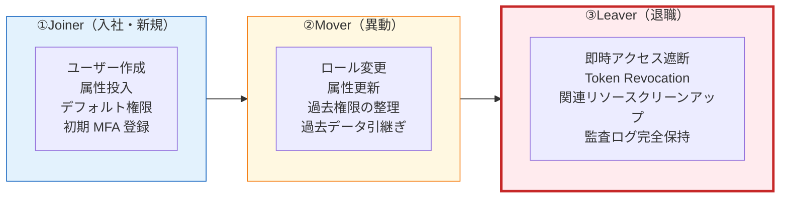
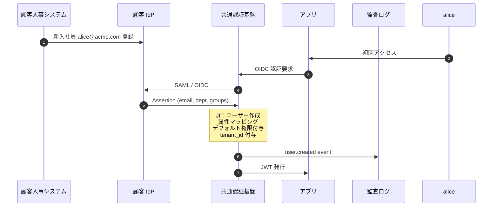
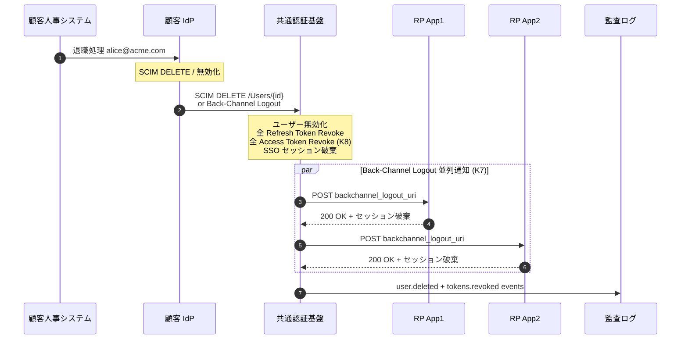
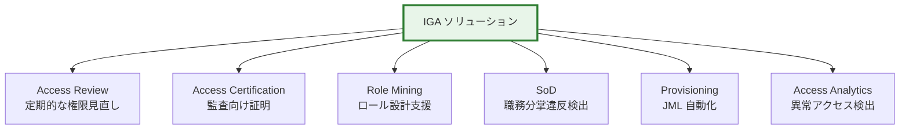

# §5.8 ユーザーライフサイクル管理（JML: Joiner/Mover/Leaver）— スライド草案

> **本資料の位置づけ**: [powerpoint-outline-and-references.md §5.8](../powerpoint-outline-and-references.md) のスライド草案。**6 スライド構成**で、ユーザーライフサイクル全体（入社/異動/退職）を統合視点で整理し、JIT/SCIM/Token Revocation/監査ログを連動させた一貫設計を示す。
> **対象**: 顧客（情シス / 人事 / セキュリティ責任者）
> **想定時間**: 12-15 分（質疑含む）
> **narrative 方針**: 「**JIT/SCIM は Joiner だけ、Mover/Leaver まで含めた一貫設計が必要**」 → IGA（Identity Governance & Administration）の業界視点

---

## 全体構成

| # | スライドタイトル | メインメッセージ | 想定時間 |
|:-:|---|---|:-:|
| **1** | **JML 統合視点 — Joiner/Mover/Leaver の全体像** | 「ライフサイクルは 3 段階、各段階で必要なオペレーションを定義」 | 2 分 |
| **2** | **Joiner（入社・新規）** | JIT / SCIM / バルクで作成、デフォルト権限付与 | 2 分 |
| **3** | **Mover（異動）** | ロール変更 + 属性更新 + Force/Import モード選択 | 3 分 |
| **4** | **Leaver（退職）— 即時アクセス遮断 SLA** | Token Revocation + Back-Channel Logout + 関連リソースクリーンアップ | 3 分 |
| **5** | **IGA（Identity Governance & Administration）の業界視点** | SailPoint / Saviynt / Microsoft Entra ID Governance 比較 | 2 分 |
| **6** | **ヒアリング項目一覧 + Cognito/Keycloak 対応** | 6 項目 + 製品対応マトリクス | 2 分 |

---

## スライド 1: JML 統合視点 — Joiner/Mover/Leaver の全体像

### タイトル
**JML 統合視点 — ライフサイクルは 3 段階**

### メインメッセージ
> **「ユーザーライフサイクルは入社（Joiner）/ 異動（Mover）/ 退職（Leaver）の 3 段階。各段階で必要なオペレーションと SLA を定義し、認証基盤・SCIM・Token Revocation・監査ログを連動させる。」**

### ビジュアル（JML ライフサイクル図）

### 詳細テキスト

**統合視点が必要な理由**:
- ❌ JIT/SCIM だけ議論すると **Joiner 中心**になり、Mover/Leaver の設計が手薄
- ❌ Leaver は「ユーザー削除」だけでは不十分、**Token Revocation / セッション破棄 / 関連リソース** まで考慮
- ✅ **3 段階を一貫設計**することで、SOC2 / ISO27001 / IGA 監査要件を満たす

**業界用語の整理**:
- **JML**: Joiner / Mover / Leaver の頭文字、ヒューマンリソース管理用語
- **IGA**: Identity Governance & Administration、JML 統合管理のソリューション領域
- **Provisioning**: ユーザー作成・属性投入の総称（Joiner 中心）
- **De-provisioning**: ユーザー削除・アクセス取消（Leaver 中心）

### スピーカーノート
- 「『同期どうする？』への回答は JIT/SCIM **だけでは不完全**、JML 全体で議論」
- 「お客様の人事システム（HR-Driven）との連携を意識」
- 「Leaver の即時遮断要件 = §4.3 SLO/Token Revocation と密接連動」

### 参考資料
- [SailPoint IGA Lifecycle](https://www.sailpoint.com/identity-library/identity-governance)
- [CrowdStrike IGA](https://www.crowdstrike.com/en-us/cybersecurity-101/identity-protection/identity-governance-and-administration-iga/)
- [§FR-7.4 SCIM](../proposal/fr/07-user.md)

---

## スライド 2: Joiner（入社・新規）

### タイトル
**Joiner — ユーザー作成 + デフォルト権限 + 初期 MFA**

### メインメッセージ
> **「Joiner は『JIT / SCIM / バルク』のいずれかで作成、デフォルト権限と初期 MFA 設定が肝。§5.1 で議論した内容を Joiner 文脈で再整理。」**

### Joiner 時のオペレーション一覧

| # | オペレーション | 必須度 | 実装 |
|:-:|---|:-:|---|
| 1 | ユーザーレコード作成 | ◎ | JIT / SCIM / バルク（§5.1）|
| 2 | 必須属性投入 (sub/email/name) | ◎ | IdP Claim マッピング |
| 3 | カスタム属性投入 (dept/employee_id) | ◯ | IdP Claim マッピング |
| 4 | デフォルト権限・ロール付与 | ◎ | §5.2 |
| 5 | 初期 MFA 要素登録（基盤側 MFA 時のみ）| △ | §3.2 |
| 6 | 初回ログインメール送信（招待制時のみ）| △ | カスタム実装 |
| 7 | テナント所属設定 | ◎ | tenant_id 付与 |
| 8 | Welcome / Onboarding 通知（Webhook）| △ | §5.3 |
| 9 | 監査ログ記録（user.created）| ◎ | §6.3 |

### Joiner シーケンス（JIT 例）

### 詳細テキスト

**デフォルト権限戦略**（§5.2 参照）:
- パターン A: 最小権限のみ（業界推奨、後付け）
- パターン B: テナント標準ロール
- パターン C: 属性ベース動的決定（dept から自動）

**事前ユーザー一覧が必要な場合**:
- 招待メール送信、ロール事前付与 → SCIM 必須
- 詳細は §5.1 を参照

### スピーカーノート
- 「Joiner は **§5.1 同期 + §5.2 デフォルト権限** の組み合わせ」
- 「初期 MFA は基盤側 MFA 時のみ、顧客 IdP MFA に委ねるなら不要」

### 参考資料
- [§FR-7.4 SCIM](../proposal/fr/07-user.md)
- [§FR-2.2.1 JIT](../proposal/fr/02-federation.md)

---

## スライド 3: Mover（異動）

### タイトル
**Mover — ロール変更 + 属性更新 + Force/Import モード選択**

### メインメッセージ
> **「Mover は『属性が変わる』『ロールが変わる』の 2 種、IdP からの属性同期モード（Force / Import）+ 過去権限の整理が肝。」**

### Mover 時のオペレーション一覧

| # | オペレーション | 必須度 | 実装 |
|:-:|---|:-:|---|
| 1 | 属性更新（dept / title 等）| ◎ | SCIM Push / JIT 上書き |
| 2 | ロール変更（昇格 / 降格 / 部署異動）| ◎ | ロールマッピング再評価 |
| 3 | 過去ロールの取消 | ◎ | 旧 group_membership 削除 |
| 4 | 関連リソース引継ぎ（所有データ / 承認権限）| △ | アプリ側責務 |
| 5 | アクティブセッションの更新 or 強制再認証 | ◯ | Token Revocation（部分）|
| 6 | 監査ログ記録（user.updated, role.changed）| ◎ | §6.3 |
| 7 | 異動通知（Webhook）| △ | §5.3 |

### 属性同期モード（Keycloak ベース）

| モード | 動作 | 適用 |
|---|---|---|
| **IMPORT** | 初回ログイン時のみ属性投入、以降は基盤側で管理 | セルフサービス重視 |
| **LEGACY** | 都度上書き、基盤側で属性編集不可 | IdP Source of Truth 重視 |
| **FORCE** | **毎回 IdP の値で強制上書き**、基盤側変更も上書き | Mover 即時反映、推奨 |

### 詳細テキスト

**Mover で頻発する落とし穴**:

1. **過去ロールの取消漏れ**:
   - 「営業 → 開発」異動時、営業ロールが残ったまま開発ロール追加 → 権限肥大化
   - 対策: **常に「全置換」モード**（IdP からの groups を信頼）

2. **属性差分の検出失敗**:
   - JIT モードでは「ログインしてはじめて更新」、ログインしないと反映されない
   - 対策: SCIM Push を併用、または Force ログアウト → 再ログイン強制

3. **関連リソースの引継ぎ**:
   - 旧部署で承認待ちの申請、所有していたドキュメント、契約データ
   - 認証基盤の責務外、**アプリ側で処理ロジック必要**

**業界ベストプラクティス**:
- 異動 = 一度退職 + 再入社 として扱う（権限リセット → 新規付与）
- 重要な権限変更は **承認ワークフロー必須**（自動付与は最小権限まで）
- 異動から 30 日後に **古いセッション一掃**（Force Logout）

### スピーカーノート
- 「Mover は **Joiner/Leaver より複雑**、業務ロジック多い」
- 「権限肥大化（Privilege Creep）は SOC2 / ISO27001 監査の頻出指摘」
- 「Force モード推奨、ただし顧客側で SCIM 設定運用が必要」

### 参考資料
- [Keycloak Identity Provider Sync Mode](https://www.keycloak.org/docs/latest/server_admin/#general-identity-provider-configuration)
- [NIST SP 800-53 AC-2 Account Management](https://csrc.nist.gov/projects/cprt/catalog#/cprt/framework/version/SP_800_53_5_1_1/home)

---

## スライド 4: Leaver（退職）— 即時アクセス遮断 SLA

### タイトル
**Leaver — 即時アクセス遮断 + Token Revocation + リソースクリーンアップ**

### メインメッセージ
> **「Leaver は『ユーザー削除』だけでは不十分。Token Revocation + Back-Channel Logout + 関連リソースクリーンアップ + 監査ログ保持の 4 セットで完了する。」**

### Leaver 時のオペレーション一覧

| # | オペレーション | 必須度 | 実装 |
|:-:|---|:-:|---|
| 1 | アカウント無効化（disabled）or 削除 | ◎ | SCIM DELETE / JIT は反映遅延 |
| 2 | **Refresh Token Revocation**（全 Refresh Token 失効）| ◎ | §4.3 |
| 3 | **Access Token Revocation**（即時失効）| ◎ 業務 SLA 厳しい場合 | §4.3 K8 |
| 4 | **Back-Channel Logout**（全 RP 通知）| ◎ 業務 SLA 厳しい場合 | §4.3 K7 |
| 5 | アクティブセッション破棄 | ◎ | IdP 側セッション削除 |
| 6 | MFA 要素のリセット | ◯ | 攻撃者再利用防止 |
| 7 | 関連リソースのオーナーシップ移譲 | △ | アプリ側責務 |
| 8 | 監査ログの完全保持（GDPR Erasure の例外）| ◎ | §6.3 |
| 9 | 退職通知（Webhook）| △ | §5.3 |
| 10 | メール再利用ポリシー適用 | ◯ | §5.4 |

### Leaver シーケンス（フルセット例）

### 詳細テキスト

**SLA 別の実装要件**:

| SLA | 必須実装 | 製品選定 |
|---|---|---|
| **翌営業日まで OK** | 1. アカウント無効化のみ | Cognito / Keycloak どちらでも |
| **15 分以内** | 1 + 2 (Refresh Revoke) + 短命 TTL 15min | Cognito / Keycloak どちらでも |
| **5 分以内** | 1 + 2 + 3 (Access Revoke) | Keycloak 推奨（Cognito K8 不可）|
| **1 分以内** | 1 + 2 + 3 + 4 (BCL) + 5 (Session) + 6 (MFA Reset) | Keycloak/RHBK 必須（K7+K8 対応）|

**監査ログ完全保持の理由**:
- GDPR Right to Erasure は「**正当な業務理由がある場合は除外**」(Article 17.3)
- SOC2 / ISO27001 監査では **退職者のアクセス履歴も保管必須**
- 個人情報を **匿名化** することは可能（ハッシュ化 / トークン化）

**Cognito K7/K8 ノックアウト時の代替**:
- Cognito: Refresh Token Revocation のみ + 短命 Access Token (5min) + Custom Trigger
- 制約: Access Token TTL 中はアクセス可能、即時遮断不可
- 業界ベストプラクティス: 5min 以内のアクセス猶予が業務的に許容できるか確認

### スピーカーノート
- 「**Leaver = §4.3 SLO + §6.3 監査ログの集約点**、合わせて議論する」
- 「『退職処理しました』への回答が **何分以内に全アクセス遮断完了** で測られる」
- 「金融/医療 = 1 分級、一般 SaaS = 15 分級 が業界平均」

### 参考資料
- [§FR-5.3 Token Revocation](../proposal/fr/05-logout-session.md)
- [§FR-7.4 SCIM DELETE](../proposal/fr/07-user.md)
- [GDPR Article 17 Right to Erasure](https://gdpr-info.eu/art-17-gdpr/)

---

## スライド 5: IGA（Identity Governance & Administration）の業界視点

### タイトル
**IGA 業界視点 — SailPoint / Saviynt / Microsoft Entra ID Governance**

### メインメッセージ
> **「JML を統合管理するソリューション領域が IGA（Identity Governance & Administration）。本基盤は IGA 機能を**標準提供しない**（顧客側 IdP + 人事システム + 委譲管理）が、IGA 連携可能な設計とする。」**

### 主要 IGA ベンダー（2026 時点）

| ベンダー | 製品 | 特徴 |
|---|---|---|
| **SailPoint** | IdentityIQ / IdentityNow | エンタープライズ最大手、AI ベースアクセス分析 |
| **Saviynt** | Enterprise Identity Cloud | クラウドネイティブ、多くの DevOps 統合 |
| **Microsoft** | Entra ID Governance | Microsoft 365 連携、Access Review 標準 |
| **Okta** | Okta Identity Governance | Okta Workflow 統合 |
| **One Identity** | Identity Manager | オンプレ強み |

### IGA で提供される機能（参考）

### 詳細テキスト

**本基盤のスタンス**:
- ❌ IGA 機能は**標準提供しない**（Access Review / Role Mining / SoD 等）
- ✅ IGA との **連携可能性を保証**（SCIM 2.0 / Webhook / 監査ログ API）
- ✅ 顧客が IGA を導入している場合、本基盤はその「実行エージェント」として動作

**顧客側で発生する選択**:
1. IGA 導入済み（SailPoint / Saviynt 等）→ 本基盤は SCIM / Webhook 受信のみ
2. IGA 検討中 → 本基盤は JML 基本機能（Joiner JIT、Mover SCIM、Leaver Revocation）提供
3. 当面 IGA 不要 → 本基盤は人事システム連携 (CSV / Webhook) で十分

**業界トレンド（2026）**:
- ITDR (Identity Threat Detection & Response) との統合（§3.5）
- AI ベース Access Pattern 分析
- Just-In-Time (JIT) Access for Privileged Access（PAM 連携）
- Continuous Access Evaluation (CAE) 標準化進行中

### スピーカーノート
- 「IGA は **高度機能、本基盤のスコープ外**」
- 「お客様が IGA 導入予定なら、連携設計のみ議論」
- 「§3.5 ITDR、§5.7 委譲管理と密接に関連」

### 参考資料
- [SailPoint IGA Overview](https://www.sailpoint.com/identity-library/identity-governance)
- [Microsoft Entra ID Governance](https://learn.microsoft.com/en-us/entra/id-governance/)
- [Gartner Magic Quadrant IGA](https://www.gartner.com/en/research/methodologies/magic-quadrants-research)

---

## スライド 6: ヒアリング項目一覧 + Cognito/Keycloak 対応

### タイトル
**ヒアリング項目 — JML 設計に必要な 6 項目**

### メインメッセージ
> **「以下 6 項目を確定することで、JML 各段階の実装 + 製品選定 + IGA 連携計画まで決定可能。」**

### ヒアリング項目表

| # | ID | 質問 | 想定回答 | 影響 |
|:-:|---|---|---|---|
| 1 | **B-401** | Joiner: ユーザー作成方式は JIT / SCIM / バルク | §5.1 と連動 | Joiner 実装 |
| 2 | **B-605-2** | Mover: 異動時の属性同期モード（Force / Import）| Force / Import | Mover 実装 |
| 3 | **B-605-3** | Leaver: 退職反映 SLA は何分以内？ | 1分 / 5分 / 15分 / 翌日 | 製品選定 |
| 4 | **B-704** | Leaver: Access Token Revocation 必要か？ | 必要 / 不要 | K8 / 製品選定 |
| 5 | **B-504** | Leaver: Back-Channel Logout 必要か？ | 必要 / 不要 | K7 / 製品選定 |
| 6 | **B-410** | Leaver 後のメール再利用ポリシー | 即時可 / 30日待機 / 永久禁止 | §5.4 連動 |

### Cognito vs Keycloak 製品対応マトリクス

| JML イベント | 機能 | Cognito | Keycloak/RHBK |
|---|---|:-:|:-:|
| Joiner | JIT プロビジョニング | ✅ | ✅ |
| Joiner | SCIM 受信 | ❌（Lambda 実装）| ✅（プラグイン）|
| Joiner | バルクインポート | ✅ | ✅ |
| Mover | 属性 Force 上書き | ⚠ Lambda Trigger | ✅ Sync Mode FORCE |
| Mover | ロール再評価 | ⚠ Lambda Trigger | ✅ Identity Provider Mapper |
| Leaver | Refresh Token Revocation | ✅ | ✅ |
| Leaver | Access Token Revocation (K8) | ❌ | ✅ |
| Leaver | Back-Channel Logout (K7) | ❌ | ✅ |
| Leaver | SCIM DELETE 受信 | ❌（Lambda 実装）| ✅ |
| Leaver | 監査ログ完全保持 | ✅ CloudWatch | ✅ Event SPI |

### スピーカーノート
- 「**6 項目のうち #3 退職反映 SLA が製品選定を左右**」
- 「お客様で『JML』という用語が使われていない場合、『入社/異動/退職時の処理』で言い換え」
- 「IGA 導入予定があれば、本基盤は連携前提の設計（Webhook / SCIM / API）」

### 参考資料
- [hearing-script/04-user-management.md B-401, B-410](../hearing-script/04-user-management.md)
- [hearing-script/06-multitenancy.md B-605-2/3](../hearing-script/06-multitenancy.md)
- [hearing-script/07-logout-session.md B-704](../hearing-script/07-logout-session.md)

---

## まとめ用スライド（任意、章末用）

### タイトル
**JML ライフサイクル — 設計判断のサマリー**

### メインメッセージ
> **「Joiner = §5.1 同期 + §5.2 デフォルト権限、Mover = Force モード + 権限再評価、Leaver = §4.3 Token Revocation + §6.3 監査ログ。3 段階一貫設計で SOC2/ISO27001 IGA 要件を満たす。」**

### 検討ポイント（顧客側）
1. **JML 3 段階の各 SLA と必要オペレーション**
2. **退職反映 SLA が製品選定を決定**（1 分級 → Keycloak / 15 分以上 → Cognito 可）
3. **IGA 導入有無 / 予定**（SailPoint / Saviynt / Microsoft 等）
4. **人事システム連携**（HR-Driven な JML 自動化）
5. **Mover の属性同期モード**（Force 推奨）

---

## 制作 Tips

### Mermaid 図の PowerPoint への取り込み
- JML 3 段階は青→黄→赤で深刻度視覚化
- Leaver シーケンス図は K7/K8 対応箇所を赤強調

### 色使い指針
| 用途 | 色 |
|---|---|
| Joiner（軽量）| 青 |
| Mover（注意）| 黄 |
| Leaver（重要）| 赤 |
| 製品制約（Cognito K7/K8）| 赤太枠 |

### スライドあたり時間配分
- スライド 1 (JML 全体): 2 分
- スライド 2 (Joiner): 2 分 — §5.1 と連動
- スライド 3 (Mover): 3 分 — 権限肥大化問題
- スライド 4 (Leaver): 3 分 — SLA 別実装要件
- スライド 5 (IGA): 2 分 — スコープ外明示
- スライド 6 (ヒアリング): 2 分

---

## 関連スライド草案
- [5.1 フェデユーザ同期](5.1-federation-sync-slides.md) — Joiner の実装
- [4.3 SLO + Token Revocation](4.3-slo-token-revocation-slides.md) — Leaver の実装
- [5.4 アカウント重複・リンク](5.4-account-duplication-linking-slides.md) — メール再利用
- [5.7 委譲管理](5.7-delegated-admin-slides.md) — テナント管理者の JML 権限
- [6.3 セキュリティ NFR](6.3-security-audit-keymgmt-slides.md) — 監査ログとの連動

---

## 改訂履歴
- 2026-06-03: 初版作成（§5.8 JML 統合視点）
