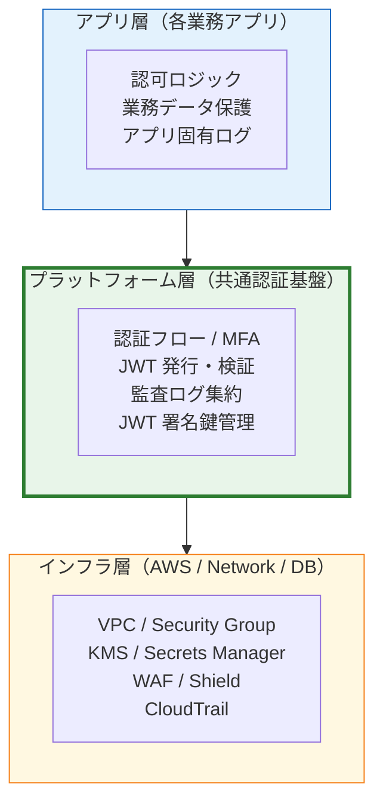
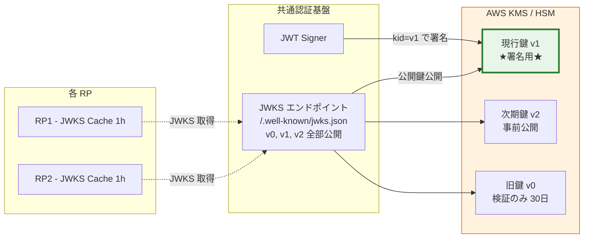
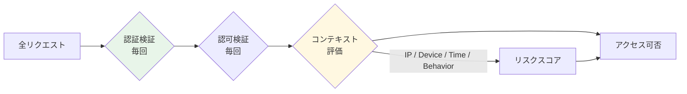

# §6.3 セキュリティ NFR + 監査ログ + Key Management — スライド草案

> **本資料の位置づけ**: [powerpoint-outline-and-references.md §6.3](../powerpoint-outline-and-references.md) のスライド草案。**6 スライド構成**で、セキュリティ NFR + 監査ログ（SIEM 連携）+ JWT 署名鍵管理（KMS/HSM）+ 暗号化・ゼロトラスト原則を整理する。
> **対象**: 顧客（情シス / セキュリティ責任者 / 監査担当）
> **想定時間**: 15-18 分（質疑含む）
> **narrative 方針**: 「**業界フレームワーク（NIST/OWASP/CIS）準拠 + 監査要件（SOC2/ISO27001/FISC）+ 鍵管理ベストプラクティス**」を **3 つの層** で整理

---

## 全体構成

| # | スライドタイトル | メインメッセージ | 想定時間 |
|:-:|---|---|:-:|
| **1** | **セキュリティ 3 レイヤー** | 「アプリ層 / プラットフォーム層 / インフラ層」を分離して責務明確化 | 2 分 |
| **2** | **セキュリティフレームワーク準拠** | NIST SP 800-53 / OWASP Top 10 / CIS Controls v8 マッピング | 3 分 |
| **3** | **監査ログ詳細 + SIEM 連携** | 必須イベント 12 種 + 改ざん防止 + SIEM (Splunk/Sentinel) 連携 | 3 分 |
| **4** | **JWT 署名鍵管理 (KMS/HSM)** | AWS KMS / Keycloak 鍵管理 + 鍵ローテーション戦略 | 3 分 |
| **5** | **暗号化 + ゼロトラスト原則** | 通信/保管/メモリ暗号化 + Zero Trust Architecture | 2 分 |
| **6** | **ヒアリング項目一覧 + コンプライアンス対応** | SOC2/ISO27001/FISC/PCI DSS 対応マトリクス | 2 分 |

---

## スライド 1: セキュリティ 3 レイヤー

### タイトル
**セキュリティ 3 レイヤー — 責務を分離して設計**

### メインメッセージ
> **「セキュリティ要件は『アプリ層 / プラットフォーム層 / インフラ層』に分離。各層で担当者・コントロール・監査ログが異なる。」**

### ビジュアル（3 レイヤー図）



### 詳細テキスト

**各層の責務**:

| 層 | 主要コントロール | 監査ログ | 主担当 |
|---|---|---|---|
| **アプリ層** | 業務ロジック認可 / 入力検証 / SQL injection 防御 | アプリ固有イベント（注文作成 / データアクセス）| アプリオーナー |
| **プラットフォーム層** | 認証 / MFA / 委譲管理 / JWT 発行 / 鍵管理 | ログイン / ログアウト / MFA / 管理操作 | 認証基盤チーム |
| **インフラ層** | NW 分離 / 暗号化 / WAF / DDoS / 物理鍵管理 | VPC Flow / CloudTrail / WAF Logs | クラウド/SRE |

**境界の責務問題**:
- アプリ層 ↔ プラットフォーム層: **JWT クレーム検証はどちらの責務か** → §3.4 で議論
- プラットフォーム層 ↔ インフラ層: **JWT 署名鍵は KMS かソフトウェアか** → スライド 4 で議論

### スピーカーノート
- 「3 層分離の意義: **責任範囲の明確化、監査時の証跡分離、インシデント対応時の切り分け**」
- 「本資料は**プラットフォーム層**の話、アプリ層・インフラ層は別資料/別議論」

### 参考資料
- [§NFR-4 セキュリティ](../proposal/nfr/04-security.md)
- [NIST SP 800-53 Rev 5](https://csrc.nist.gov/publications/detail/sp/800-53/rev-5/final)
- [AWS Well-Architected Security Pillar](https://docs.aws.amazon.com/wellarchitected/latest/security-pillar/welcome.html)

---

## スライド 2: セキュリティフレームワーク準拠

### タイトル
**セキュリティフレームワーク準拠 — NIST / OWASP / CIS / IPA マッピング**

### メインメッセージ
> **「業界標準フレームワーク 4 種に準拠して設計、顧客の監査要件（SOC2 / ISO27001 / FISC / PCI DSS）に対応可能。」**

### ビジュアル（フレームワークマッピング）

| フレームワーク | 認証基盤での主要コントロール | 適用範囲 |
|---|---|---|
| **NIST SP 800-53 Rev 5** | IA (Identification & Authentication) / AU (Audit) / SC (System Communications) | 政府 / 金融 |
| **OWASP Top 10 (2021)** | A07 認証失敗 / A02 暗号化失敗 / A09 ログ・モニタリング失敗 | Web アプリ全般 |
| **CIS Controls v8** | Control 5 Account Mgmt / Control 6 Access Control / Control 8 Audit Log | 業界横断 |
| **IPA 非機能要求グレード E. セキュリティ** | E.1 認証 / E.2 ログ / E.3 暗号化 | 日本国内 SI |

### 詳細テキスト

**NIST SP 800-63 Rev 4（認証基盤の特化版）**:
- AAL1 / AAL2 / AAL3 のレベル定義 → §3.2 MFA で議論
- IAL（Identity Assurance Level）/ FAL（Federation Assurance Level）

**OWASP Top 10 2021 認証関連の主要項目**:
- **A07:2021 Identification and Authentication Failures**: 弱パスワード / セッション固定化 / Brute Force
- **A02:2021 Cryptographic Failures**: 弱い暗号 / HTTPS 不徹底 / 鍵管理
- **A09:2021 Security Logging and Monitoring Failures**: 監査ログ欠落 / アラート未設定

**Defense in Depth（多層防御）の実装**:
1. ネットワーク層: WAF / Shield / VPC 分離
2. アプリ層: 入力検証 / 認可ロジック
3. データ層: 暗号化 / 最小権限 IAM

### スピーカーノート
- 「フレームワーク準拠は **監査対応コストを大幅削減** する（『どう監査に答えるか』の事前準備）」
- 「お客様の業界によって優先 FW が異なる: 金融=NIST/PCI、医療=HIPAA、政府=NIST、一般=OWASP/CIS」

### 参考資料
- [OWASP Top 10 (2021)](https://owasp.org/Top10/)
- [NIST SP 800-53 Rev 5](https://csrc.nist.gov/publications/detail/sp/800-53/rev-5/final)
- [CIS Controls v8](https://www.cisecurity.org/controls)
- [IPA 非機能要求グレード E. セキュリティ](https://www.ipa.go.jp/sec/softwareengineering/std/ent03-b.html)

---

## スライド 3: 監査ログ詳細 + SIEM 連携

### タイトル
**監査ログ — 必須イベント 12 種 + 改ざん防止 + SIEM 連携**

### メインメッセージ
> **「認証基盤の監査ログは『誰が・いつ・何を・どこから』を全て記録、改ざん防止しつつ SIEM へリアルタイム連携。SOC2 / ISO27001 監査の中核証跡。」**

### ビジュアル（必須監査イベント 12 種）

| # | カテゴリ | イベント | SIEM 必須度 |
|:-:|---|---|:-:|
| 1 | 認証 | ログイン成功 | ◎ |
| 2 | 認証 | ログイン失敗（理由付き） | ◎ |
| 3 | 認証 | MFA チャレンジ / 成功 / 失敗 | ◎ |
| 4 | 認証 | ログアウト（L1〜L4 全層） | ◯ |
| 5 | セッション | Access Token 発行 / 更新 / Revocation | ◎ |
| 6 | ユーザー管理 | ユーザー作成 / 更新 / 削除 (CRUD) | ◎ |
| 7 | ユーザー管理 | パスワード変更 / リセット | ◎ |
| 8 | ユーザー管理 | MFA 要素登録 / 解除 | ◎ |
| 9 | 管理操作 | テナント設定変更 | ◎ |
| 10 | 管理操作 | 委譲管理者の任命 / 解任 | ◎ |
| 11 | 管理操作 | IdP 設定変更（メタデータ更新等）| ◎ |
| 12 | セキュリティ | アカウントロック / 侵害検出 / Bot 保護トリガー | ◎ |

### ログ項目の業界標準（CEF / OCSF 準拠）

```json
{
  "timestamp": "2026-06-03T14:23:11.234Z",
  "event_id": "evt_12345",
  "event_type": "user.login.success",
  "tenant_id": "acme",
  "user_id": "alice@acme.com",
  "ip_address": "203.0.113.45",
  "user_agent": "...",
  "session_id": "sess_abc",
  "auth_method": "saml_mfa",
  "amr": ["pwd", "otp"],
  "result": "success",
  "trace_id": "..."
}
```

### 詳細テキスト

**改ざん防止戦略**:
- ✅ **Append-Only ストレージ**: S3 Object Lock (WORM) / CloudWatch Logs（削除不可化）
- ✅ **暗号学的ハッシュチェーン**: 前イベントのハッシュを次に含める（Blockchain 風）
- ✅ **デジタル署名**: KMS で各ログエントリ署名（金融業界）

**SIEM 連携の主要パターン**:
| SIEM | 連携方式 | 推奨用途 |
|---|---|---|
| **Splunk** | HTTP Event Collector (HEC) / Splunk Forwarder | エンタープライズ |
| **Microsoft Sentinel** | Log Analytics Workspace / Azure Event Hub | Azure 系顧客 |
| **AWS CloudWatch + OpenSearch** | CloudWatch Logs → Kinesis Firehose → OpenSearch | AWS Native |
| **Datadog** | Datadog API | DevOps 統合 |
| **Sumo Logic** | HTTP Source | 中小企業 |

**保管期間（業界推奨）**:
- 通常運用: 90 日（オンライン）+ 7 年（アーカイブ S3 Glacier）
- 金融 (FISC) / 医療 (HIPAA): 7 年保管必須
- PCI DSS: 1 年（うち 3ヶ月オンライン）

### スピーカーノート
- 「『監査ログ取ってますか？』への回答は **12 種を全部取っているか** で測られる」
- 「SIEM 連携は **顧客の既存 SIEM** に合わせるのが標準（顧客が運用ノウハウ持つ）」
- 「**改ざん防止**は SOC2 Type II / ISO27001 監査の頻出指摘点」

### 参考資料
- [§FR-8.2 監査ログ](../proposal/fr/08-admin.md)
- [OCSF (Open Cybersecurity Schema Framework)](https://schema.ocsf.io/)
- [AWS S3 Object Lock](https://docs.aws.amazon.com/AmazonS3/latest/userguide/object-lock.html)

---

## スライド 4: JWT 署名鍵管理 (KMS/HSM)

### タイトル
**JWT 署名鍵管理 — KMS / HSM + ローテーション戦略**

### メインメッセージ
> **「JWT 署名鍵は『漏洩 = 全テナント認証突破』の最重要資産。HSM（Hardware Security Module）or AWS KMS で物理保護し、定期ローテーション + JWKS 連動で全 RP 自動切り替え。」**

### ビジュアル（鍵管理アーキテクチャ）



### 詳細テキスト

**鍵の保管方式（業界標準）**:
| 方式 | 保護レベル | コスト | 適用範囲 |
|---|:-:|---|---|
| **AWS KMS Customer Managed Key (CMK)** | FIPS 140-2 Level 2 | ◯ 月額 $1/key | 一般 SaaS |
| **AWS CloudHSM** | FIPS 140-2 Level 3 | ✕ 高 ($1.45/h) | 金融 / 政府 |
| **HSM On-Premises (nCipher / Thales)** | FIPS 140-2 Level 3-4 | ✕✕ 高 | 大手金融 |
| **Keycloak ソフトウェア鍵 + DB 暗号化** | △ | ✅ 標準 | 軽量 |

**鍵ローテーション戦略**:
1. **定期ローテーション**: 90 日 / 180 日 / 365 日（業界推奨）
2. **緊急ローテーション**: 漏洩疑い時の即時実施手順
3. **無停止ローテーション**:
   - Step1: 新鍵 (v2) を JWKS に追加公開
   - Step2: 全 RP の JWKS Cache TTL（1h）経過待ち
   - Step3: 署名鍵を v1→v2 に切り替え
   - Step4: 30 日後に旧鍵 (v1) を JWKS から削除

**Cognito vs Keycloak の鍵管理**:
| 項目 | Cognito | Keycloak |
|---|---|---|
| 鍵保管 | AWS 内部管理（不可視）| 設定可能（DB / Java KeyStore / KMS） |
| ローテーション | 自動 | 手動 or スクリプト |
| アルゴリズム | RS256 のみ | RS256 / ES256 / EdDSA |
| KMS/HSM 連携 | ✅ AWS 標準 | ⚠ カスタム実装 |

### スピーカーノート
- 「**鍵漏洩は全テナント突破** → 最高レベルの保護必要」
- 「無停止ローテーションには **JWKS Cache TTL** の事前周知が必要（RP 側に 1h 以上の Cache 設定推奨）」
- 「Cognito は鍵管理を AWS に任せられる → セキュリティ責任分界点が明確」

### 参考資料
- [common/jwks-public-exposure.md](../../common/jwks-public-exposure.md)
- [AWS KMS Best Practices](https://docs.aws.amazon.com/kms/latest/developerguide/best-practices.html)
- [Keycloak Key Management](https://www.keycloak.org/server/keys)
- [NIST SP 800-57 Key Management Recommendations](https://csrc.nist.gov/publications/detail/sp/800-57-part-1/rev-5/final)

---

## スライド 5: 暗号化 + ゼロトラスト原則

### タイトル
**暗号化 + ゼロトラスト — 「Never Trust, Always Verify」**

### メインメッセージ
> **「通信 / 保管 / メモリの 3 つの暗号化、+ ゼロトラスト原則（境界防御に頼らず、毎リクエスト検証）。」**

### ビジュアル（暗号化 3 層 + ZT 原則）

| 層 | 対象 | 標準 | 実装 |
|---|---|---|---|
| **Transit（通信）** | RP ↔ 基盤 / 基盤 ↔ DB | TLS 1.2+ (TLS 1.3 推奨) | ALB / NLB + ACM 証明書 |
| **At Rest（保管）** | ユーザー DB / Refresh Token DB / 監査ログ | AES-256 | KMS Envelope Encryption / RDS Encryption |
| **In Memory（メモリ）** | 機密データ（パスワード / Token）| Secure Enclave / SGX | AWS Nitro Enclaves（金融用途）|

### ゼロトラスト原則（NIST SP 800-207）



### 詳細テキスト

**ZT の認証基盤での具体実装**:
1. **境界防御に頼らない**: VPN 内部からのアクセスでも毎回 JWT 検証
2. **最小権限**: 各 Token の `scope` 最小化（一括「admin」より細粒度）
3. **継続的検証**: CAEP (Continuous Access Evaluation Protocol) で異常検知時に即時 Revoke
4. **コンテキスト評価**: IP / Device / Time / 過去行動と照合して Risk-Based Auth

**通信暗号化の要件**:
- ✅ HTTPS 強制（HTTP → HTTPS リダイレクト + HSTS）
- ✅ TLS 1.2 以上（TLS 1.0/1.1 拒否）
- ✅ Cipher Suite 制限（FORWARD SECRECY 必須）
- ✅ 証明書 Pinning（モバイル / 機密度高アプリ）

**保管暗号化のキー階層**:
- ユーザーデータ → DEK (Data Encryption Key) → KEK (Key Encryption Key) → CMK (Customer Master Key in KMS)

### スピーカーノート
- 「ゼロトラストは **アーキテクチャ原則であって製品ではない**」
- 「認証基盤での実装ポイントは『毎リクエスト JWT 検証 + Risk-Based Auth』」
- 「TLS 1.0/1.1 受け入れ拒否は PCI DSS / SOC2 で必須」

### 参考資料
- [NIST SP 800-207 Zero Trust Architecture](https://nvlpubs.nist.gov/nistpubs/SpecialPublications/NIST.SP.800-207.pdf)
- [AWS Zero Trust on AWS](https://aws.amazon.com/security/zero-trust/)
- [Google BeyondCorp](https://cloud.google.com/beyondcorp)

---

## スライド 6: ヒアリング項目一覧 + コンプライアンス対応

### タイトル
**ヒアリング項目 — セキュリティ NFR 設計に必要な 8 項目**

### メインメッセージ
> **「監査ログ / 鍵管理 / 暗号化 / コンプラ要件の 4 軸で 8 項目を確認、SOC2 / ISO27001 / FISC / PCI DSS 対応マトリクスへ反映。」**

### ヒアリング項目表

| # | ID | 質問 | 想定回答 | 影響 |
|:-:|---|---|---|---|
| 1 | **C-203** | 監査ログ要件: 保管期間 / アーカイブ / SIEM 連携先 | 90日+7年 / Splunk / Sentinel | 監査ログ設計 |
| 2 | **C-203-2** | 必須監査イベント 12 種の取得有無 | 全種 / 一部 | ログ実装 |
| 3 | **C-206-2** | アイドルタイムアウト / 絶対経過タイムアウト | 30min / 8h | セッション §4.5 |
| 4 | **C-208** | ペネトレーションテスト要件（頻度 / 範囲）| 年1回 / 半年 / 都度 | NFR |
| 5 | **C-208-2** | JWT 署名鍵管理: KMS / HSM / ソフトウェア | KMS / HSM / SW | 鍵管理戦略 |
| 6 | **C-208-3** | 鍵ローテーション頻度 / 緊急ローテ手順 | 90日 / 180日 / 365日 | ローテ戦略 |
| 7 | **C-208-4** | 暗号化要件: TLS 1.2/1.3、AES-256、保管暗号化 | 業界標準 / カスタム | NW/DB 設計 |
| 8 | **C-209** | コンプラ準拠: SOC2 / ISO27001 / FISC / PCI DSS / GDPR | 必須 FW 一覧 | 全体設計 |

### コンプライアンス対応マトリクス（参考）

| 認証基盤コントロール | SOC2 | ISO27001 | FISC | PCI DSS | GDPR |
|---|:-:|:-:|:-:|:-:|:-:|
| MFA 強制 | ✅ | ✅ | ✅ | ✅ | △ |
| 監査ログ 12 種 + WORM 保管 | ✅ | ✅ | ✅ | ✅ | ✅ |
| JWT 鍵 KMS/HSM 管理 | ✅ | ✅ | ✅ | ✅ | △ |
| TLS 1.2+ 強制 | ✅ | ✅ | ✅ | ✅ | ✅ |
| 暗号化保管（AES-256）| ✅ | ✅ | ✅ | ✅ | ✅ |
| ペネトレ年 1 回以上 | ✅ | △ | ✅ | ✅ | △ |
| Cookie Consent / DSR | - | △ | - | - | ✅ (§7.4) |

### スピーカーノート
- 「**8 項目のうち #1 監査ログ + #5 鍵管理が最重要**（製品選定にも影響）」
- 「お客様の必須コンプライアンス FW を確認 → マトリクスから優先実装項目を特定」
- 「§7.4 プライバシー（GDPR DSR）と一部重複、合わせて議論」

### 参考資料
- [hearing-script/10-security-compliance.md C-203, C-208](../hearing-script/10-security-compliance.md)
- [hearing-checklist.md §5.3](../hearing-checklist.md)
- [§NFR-4 セキュリティ](../proposal/nfr/04-security.md)

---

## まとめ用スライド（任意、章末用）

### タイトル
**セキュリティ NFR + 監査 + 鍵管理 — 設計判断のサマリー**

### メインメッセージ
> **「3 レイヤー責務分離 → FW 準拠 → 監査ログ 12 種 + SIEM → 鍵管理 KMS/HSM → ゼロトラスト原則 → コンプラマトリクスで網羅検証。」**

### 検討ポイント（顧客側）
1. **必須コンプライアンス FW（SOC2 / ISO27001 / FISC / PCI DSS / GDPR）の明示**
2. **既存 SIEM（Splunk / Sentinel / Datadog 等）への連携要件**
3. **JWT 署名鍵を KMS / HSM どちらで管理するか**
4. **監査ログ保管期間（金融なら 7 年）**
5. **ペネトレ年次計画 + 緊急時鍵ローテ手順**

---

## 制作 Tips

### Mermaid 図の PowerPoint への取り込み
- 3 レイヤー図は青→緑→黄でレイヤー視覚化
- 鍵管理アーキは KMS を赤太枠で「最重要資産」と強調

### 色使い指針
| 用途 | 色 |
|---|---|
| プラットフォーム層（主役）| 緑 |
| KMS / 鍵管理 | 赤（最重要）|
| インフラ層 | 黄 |
| 業界標準 | 青 |

### スライドあたり時間配分
- スライド 1 (3 レイヤー): 2 分 — 責務分離の意義
- スライド 2 (FW 準拠): 3 分 — 4 FW マッピング
- スライド 3 (監査ログ): 3 分 — 12 種一覧 + SIEM
- スライド 4 (鍵管理): 3 分 — KMS/HSM 比較 + ローテ戦略
- スライド 5 (暗号化+ZT): 2 分
- スライド 6 (ヒアリング): 2 分 — 8 項目 + コンプラマトリクス

---

## 関連スライド草案
- [3.2 MFA 要件](3.2-mfa-slides.md) — 認証強度
- [3.3 ローカル認証ポリシー](なし) — パスワード + ロック + 侵害検出
- [4.3 SLO + Token Revocation](4.3-slo-token-revocation-slides.md) — 監査ログとの連動
- [7.4 プライバシー](7.4-privacy-consent-gdpr-slides.md) — GDPR/DSR 詳細

---

## 改訂履歴
- 2026-06-03: 初版作成（§6.3 セキュリティ NFR + 監査 + Key Management）
