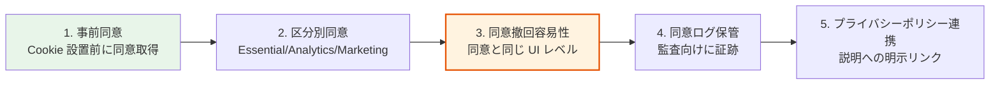
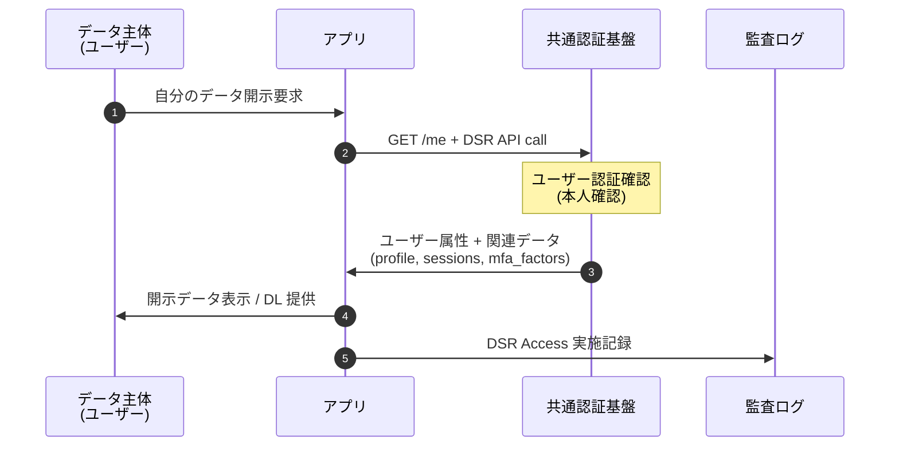
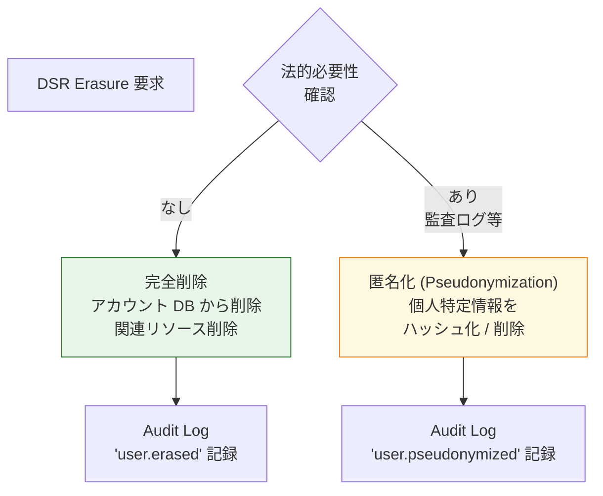
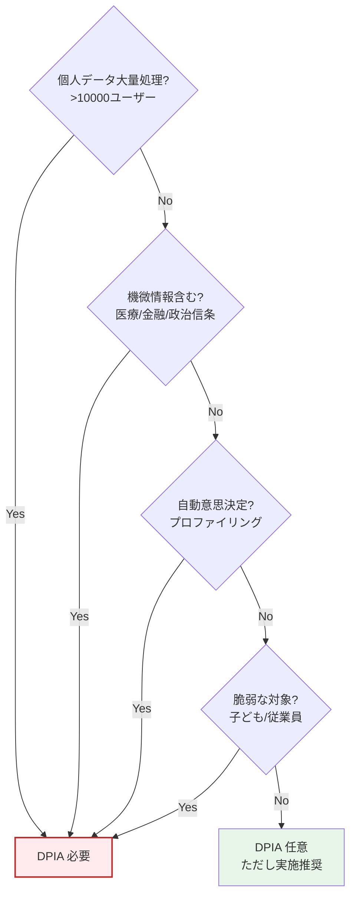

# §7.4 プライバシー / Cookie Consent / GDPR DSR — スライド草案

> **本資料の位置づけ**: [powerpoint-outline-and-references.md §7.4](../powerpoint-outline-and-references.md) のスライド草案。**6 スライド構成**で、GDPR / CCPA / APPI 等のプライバシー規制対応、Cookie Consent UI、Data Subject Rights（DSR）実装方針を整理する。
> **対象**: 顧客（情シス / 法務 / セキュリティ責任者 / DPO）
> **想定時間**: 12-15 分（質疑含む）
> **narrative 方針**: 「**規制 → 必須要件 → 実装パターン**」 → グローバル展開（GDPR）/ 国内（APPI）/ 米国（CCPA）の 3 軸で整理

---

## 全体構成

| # | スライドタイトル | メインメッセージ | 想定時間 |
|:-:|---|---|:-:|
| **1** | **プライバシー規制マップ — GDPR / CCPA / APPI** | 「3 大規制 + 業界 SoC2/ISO27701 + 認証基盤での該当範囲」 | 2 分 |
| **2** | **Cookie Consent — 業界標準 UI/UX** | 必須要件 5 つ + 同意撤回の容易性 + 同意ログ保管 | 3 分 |
| **3** | **GDPR Data Subject Rights (DSR) — 7 つの権利** | Article 15-22 全権利、認証基盤での実装範囲 | 3 分 |
| **4** | **Right to Erasure（忘れられる権利）の実装** | アカウント削除 + 監査ログ保持の両立 | 2 分 |
| **5** | **Data Portability + Privacy by Design** | データ可搬性 + 設計段階からのプライバシー配慮 | 2 分 |
| **6** | **ヒアリング項目一覧 + DPIA 必要性** | 6 項目 + Data Protection Impact Assessment | 2 分 |

---

## スライド 1: プライバシー規制マップ — GDPR / CCPA / APPI

### タイトル
**プライバシー規制マップ — 3 大規制 + 認証基盤の該当範囲**

### メインメッセージ
> **「グローバル展開 = GDPR、米国 = CCPA/CPRA、国内 = APPI（個人情報保護法）。認証基盤は『個人データを大量に扱う』ため、これら全てで主要対応箇所。」**

### ビジュアル（規制比較表）

| 規制 | 適用範囲 | 罰金上限 | 認証基盤で重要な権利 |
|---|---|---|---|
| **GDPR**（EU 一般データ保護規則）| EU 居住者の個人データ | 全世界売上の 4% or €2000万 | 全 DSR（Article 15-22）+ Consent |
| **CCPA / CPRA**（カリフォルニア州）| カリフォルニア州民 | $7500/件 | Access / Delete / Opt-Out |
| **APPI**（個人情報保護法）| 日本居住者の個人データ | 1億円 | 開示 / 訂正 / 利用停止 |
| **PIPL**（中国個人情報保護法）| 中国居住者の個人データ | 50百万元 or 売上 5% | Consent / Cross-Border Transfer |
| **LGPD**（ブラジル）| ブラジル居住者 | 5000万BRL | GDPR 類似 |

### 業界 + 認証関連プライバシーフレームワーク

| FW / 標準 | 認証基盤での該当範囲 |
|---|---|
| **ISO/IEC 27701** | ISO27001 拡張、PIMS（Privacy Information Management System）|
| **NIST Privacy Framework** | プライバシーリスク管理の体系 |
| **OECD Privacy Guidelines** | 8 原則（収集制限、データ品質等）|
| **GDPR Article 32** | セキュリティ（Pseudonymisation、Encryption）|

### 詳細テキスト

**認証基盤が「個人データの中核」である理由**:
- 大量の **氏名 / メール / 認証属性** を保管
- **ログイン履歴 / IP アドレス** は「行動データ」として広範な個人データ
- フェデレーション経由で **顧客 IdP からの属性を受信・保管**
- 監査ログには **個人の行動詳細** が記録される

**「処理者 (Processor)」と「管理者 (Controller)」の役割**:
- 弊社（基盤提供）= **Processor**（顧客の指示で個人データを処理）
- 顧客企業 = **Controller**（自社従業員データの管理者）
- DPA (Data Processing Agreement) 締結が必須

### スピーカーノート
- 「**規制が複数同時適用** されるケースが多い（グローバル展開しているお客様）」
- 「弊社は Processor として動作 → DPA で責任範囲を明確化」
- 「お客様が Controller として最終責任を負うが、本基盤の機能で大部分の DSR を実現可能」

### 参考資料
- [GDPR](https://gdpr-info.eu/)
- [CCPA / CPRA](https://oag.ca.gov/privacy/ccpa)
- [個人情報保護法（APPI）](https://www.ppc.go.jp/)
- [ISO/IEC 27701:2019](https://www.iso.org/standard/71670.html)

---

## スライド 2: Cookie Consent — 業界標準 UI/UX

### タイトル
**Cookie Consent — 業界標準 UI/UX + 必須要件 5 つ**

### メインメッセージ
> **「Cookie Consent は『同意取得 → 撤回が同意と同じくらい簡単 → 同意ログ保管』の業界標準パターン。GDPR / ePrivacy Directive で求められる必須要件 5 つを満たす。」**

### Cookie Consent 必須要件 5 つ

### 詳細テキスト

**Cookie 利用区分（業界標準）**:

| 区分 | 同意要否 | 例 | 認証基盤での該当 |
|---|:-:|---|---|
| **Essential / Strictly Necessary** | 不要（既定許可）| セッション Cookie、CSRF Token | 認証セッション Cookie |
| **Functional** | 必要 | 言語設定、UI 設定 | 言語/テーマ設定 |
| **Analytics / Performance** | 必要 | Google Analytics、Hotjar | 利用統計 |
| **Marketing / Advertising** | 必要 | Facebook Pixel、Ads Cookie | 認証基盤では原則使わない |

**Cookie Consent UI のベストプラクティス**:
- ✅ **Reject All** ボタンを **Accept All** と同じ視認性で配置（GDPR 解釈）
- ✅ **「同意なし = 拒否」**（オプトイン、暗黙の同意は NG）
- ❌ **「同意しないとサイトが使えない」は基本 NG**（Cookie Wall、限定的に許容）
- ✅ **詳細設定パネル**で区分別 ON/OFF 可能
- ✅ **撤回 UI を常時アクセス可能**（フッターリンク / 設定画面）

**主要 Cookie Consent 管理プラットフォーム（CMP）**:
| CMP | 特徴 | 適用範囲 |
|---|---|---|
| **OneTrust** | エンタープライズ最大手 | 大企業 |
| **Cookiebot** | 中小企業向け | 中小 |
| **Usercentrics** | ヨーロッパ強み | EU 中心 |
| **Termly** | 低コスト | 小規模 |

**業界トレンド（2026）**:
- **Global Privacy Control (GPC)** ヘッダーへの対応（ブラウザ送信の Opt-Out 信号）
- **Privacy Sandbox**（Google Chrome）への移行
- **Apple ITP** / **WebKit Tracking Prevention** との整合

### スピーカーノート
- 「Cookie Consent は **UI 設計 + 同意ログ保管 + 撤回機能** の 3 セット」
- 「お客様で CMP（OneTrust 等）を既に導入しているか確認」
- 「認証基盤の Cookie は **Essential が中心**、Marketing は基本使わない」

### 参考資料
- [Secure Privacy Mobile Consent](https://secureprivacy.ai/blog/mobile-app-sdk-consent-management)
- [OneTrust Cookie Compliance](https://www.onetrust.com/products/cookie-consent/)
- [Global Privacy Control](https://globalprivacycontrol.org/)

---

## スライド 3: GDPR Data Subject Rights (DSR) — 7 つの権利

### タイトル
**GDPR DSR — 7 つの権利 + 認証基盤での実装範囲**

### メインメッセージ
> **「GDPR Article 15-22 で定義される 7 つの DSR、認証基盤で『標準実装 / セルフサービス化 / 顧客側責務』を区別して提示。」**

### GDPR DSR 7 つの権利

| # | Article | 権利 | 認証基盤での実装 |
|:-:|---|---|---|
| 1 | **Art. 15** | Right of Access（開示）| ✅ セルフサービス（プロフィール画面）|
| 2 | **Art. 16** | Right to Rectification（訂正）| ✅ セルフサービス（属性編集）|
| 3 | **Art. 17** | Right to Erasure（削除 / 忘れられる権利）| △ アカウント削除 API + 監査ログ保持の両立 |
| 4 | **Art. 18** | Right to Restriction（処理制限）| △ アカウント無効化（disabled）|
| 5 | **Art. 19** | Notification Obligation（通知義務）| ✅ Webhook 通知（§5.3）|
| 6 | **Art. 20** | Right to Portability（データ可搬性）| ✅ JSON エクスポート API |
| 7 | **Art. 21** | Right to Object（処理への異議）| △ 顧客側責務（処理目的による）|
| 8 | **Art. 22** | Automated Decision-Making（自動意思決定）| △ ITDR 関連、§3.5 |

### DSR 対応シーケンス（例: Right of Access）

### 詳細テキスト

**「セルフサービス化」が業界推奨である理由**:
- 30 日以内の対応期限（GDPR 規定）を確実に守れる
- 法務・サポート部門の負荷削減
- 監査ログに自動記録
- スケーラビリティ（数万ユーザーの個別対応は不可能）

**Right of Access の標準実装**:
- プロフィール画面で属性閲覧（基本）
- 「個人データすべてダウンロード」ボタン（JSON / CSV）
- 連携アプリ別の保管データ一覧
- ログイン履歴 / セッション履歴

**Right to Rectification の標準実装**:
- セルフサービス画面で編集（§5.6）
- フェデユーザの場合、IdP 側で訂正 → 同期反映

**Right to Object / Automated Decision の業界対応**:
- 利用目的（マーケティング / プロファイリング）別に Opt-Out 機能
- ITDR の自動アカウントロックは「セキュリティのため」として説明可能（GDPR Recital 47）

### スピーカーノート
- 「**7 つすべて対応可能** が業界標準、認証基盤として責任を持つ範囲を明確化」
- 「お客様（Controller）と弊社（Processor）の責任分界を DPA で定義」
- 「セルフサービス化が **法務コスト削減 + GDPR 期限厳守** の鍵」

### 参考資料
- [GDPR Article 15-22 Data Subject Rights](https://gdpr-info.eu/chapter-3/)
- [Microsoft GDPR Compliance](https://learn.microsoft.com/en-us/compliance/regulatory/gdpr)
- [Auth0 GDPR Compliance](https://auth0.com/docs/secure/security-guidance/data-privacy-and-compliance/gdpr)

---

## スライド 4: Right to Erasure（忘れられる権利）の実装

### タイトル
**Right to Erasure — アカウント削除 + 監査ログ保持の両立**

### メインメッセージ
> **「『忘れられる権利』は完全削除ではなく『個人を特定できなくする』。アカウント削除 + 個人特定情報の匿名化 + 法的必要性のあるログは保持（Article 17.3 例外）。」**

### ビジュアル（Erasure 実装フロー）

### 詳細テキスト

**Article 17.3 例外（法的に削除しなくてよい場合）**:
- (a) 表現の自由
- (b) 法的義務の履行（**監査要件 SOC2/ISO27001、税法、労働法など**）
- (c) 公益（公衆衛生等）
- (d) 学術研究
- (e) 法的請求の確立・行使・防御

**監査ログの扱い（よくある質問）**:
- ❌ 「監査ログから個人情報を全削除する必要はない」
- ✅ 「ログ自体は法的義務（SOC2/ISO27001）で保持必要、ただし**個人特定子を匿名化**できる」

**匿名化（Pseudonymization）の実装パターン**:
| データ項目 | 元データ | 匿名化後 |
|---|---|---|
| `user_id` | `alice@acme.com` | `pseudo_abc123...` (HMAC) |
| `email` | `alice@acme.com` | `[ERASED]` |
| `name` | `Alice Smith` | `[ERASED]` |
| `ip_address` | `203.0.113.45` | `203.0.113.0/24`（マスキング）|

**アカウント完全削除時のクリーンアップリスト**:
1. ユーザーアカウント無効化 → 物理削除
2. アクティブセッション全破棄（§4.3）
3. 全 Refresh Token Revocation
4. MFA 要素削除
5. 連携アプリへの Webhook 通知（§5.3）
6. 監査ログの該当箇所を匿名化（個人特定情報のみ）
7. プロビジョニング先（SCIM 同期先）の DELETE 通知

**Cognito vs Keycloak での Erasure 対応**:
| 機能 | Cognito | Keycloak |
|---|:-:|:-:|
| ユーザー削除 API | ✅ `AdminDeleteUser` | ✅ Admin REST API |
| 関連 Token 失効 | △ 部分対応 | ✅ |
| 監査ログ匿名化 | ⚠ 別途設計 | ⚠ Event SPI 拡張 |
| エクスポート（Portability）| ✅ Export job | ✅ |

### スピーカーノート
- 「『削除 = 全消去』は誤解、**法的義務との両立**が業界標準」
- 「お客様の業界別に **保管必須データ** を特定（金融 7 年、医療 5-10 年等）」
- 「ECJ 判例（Google Spain 等）で『削除 vs パブリック利益』のバランスが議論」

### 参考資料
- [GDPR Article 17 Right to Erasure](https://gdpr-info.eu/art-17-gdpr/)
- [EDPB Guidelines on Right to Erasure](https://edpb.europa.eu/our-work-tools/our-documents/guidelines/guidelines-052020-consent-under-regulation-2016679_en)

---

## スライド 5: Data Portability + Privacy by Design

### タイトル
**Data Portability + Privacy by Design — 設計段階からの配慮**

### メインメッセージ
> **「Data Portability（Article 20）= 機械可読形式での個人データ移行。Privacy by Design = 設計段階で 7 原則を組み込む。両方を認証基盤の標準機能として提供。」**

### Data Portability の実装

| 機能 | 標準形式 | 実装 |
|---|---|---|
| **属性データエクスポート** | JSON | `GET /me/export` API |
| **ログイン履歴エクスポート** | CSV / JSON | `GET /me/login-history` |
| **同意履歴エクスポート** | JSON | `GET /me/consents` |
| **MFA 要素一覧（移行用）** | 標準仕様なし | 「同等の MFA を新システムで再登録」のガイド |

### Privacy by Design 7 原則（Ann Cavoukian, 2010）

| # | 原則 | 認証基盤での実装 |
|:-:|---|---|
| 1 | **Proactive not Reactive**（事後ではなく事前）| 設計段階からプライバシー考慮 |
| 2 | **Privacy as the Default**（既定で保護）| Opt-in / 最小権限 / 最小データ収集 |
| 3 | **Embedded into Design**（設計に組込）| アーキテクチャでプライバシー実装 |
| 4 | **Full Functionality**（機能性犠牲にしない）| プライバシー保護 = UX 低下ではない |
| 5 | **End-to-End Security**（全工程セキュア）| §6.3 セキュリティと統合 |
| 6 | **Visibility & Transparency**（可視性）| 同意管理 + DSR セルフサービス |
| 7 | **Respect for User Privacy**（ユーザー尊重）| わかりやすい説明 + 撤回容易性 |

### 詳細テキスト

**Privacy by Default の認証基盤での具体実装**:
- ❌ 「マーケティング Cookie デフォルト ON」→ ✅ 「Opt-in」
- ❌ 「全属性を全アプリに渡す」→ ✅ 「scope ベースで最小限」
- ❌ 「ログを永続保管」→ ✅ 「業務必要期間のみ」

**Data Minimization 原則**:
- 認証に必要な属性のみ収集（職務情報など、本当に必要な分のみ）
- 顧客 IdP からの不要属性は **マッピングで弾く**
- ログには **必要十分** な情報のみ（フルパス URL より分類カテゴリ）

**ISO/IEC 27701 PIMS（Privacy Information Management System）**:
- ISO27001 拡張、プライバシー特化の管理体系
- 認証基盤として 27701 認証取得 → 顧客の Controller 責任軽減
- 業界トレンド: 大手 SaaS 各社が 27701 取得（Microsoft / Google / Salesforce 等）

### スピーカーノート
- 「Data Portability は **JSON 標準フォーマット** で対応すれば OK」
- 「Privacy by Design は **後付け対応より設計段階で組み込む** 方が圧倒的に低コスト」
- 「ISO27701 認証取得は中期的検討（顧客に提示できる強み）」

### 参考資料
- [GDPR Article 20 Right to Data Portability](https://gdpr-info.eu/art-20-gdpr/)
- [Privacy by Design (Ann Cavoukian)](https://www.ipc.on.ca/en/privacy-and-design)
- [ISO/IEC 27701:2019](https://www.iso.org/standard/71670.html)

---

## スライド 6: ヒアリング項目一覧 + DPIA 必要性

### タイトル
**ヒアリング項目 — プライバシー設計に必要な 6 項目 + DPIA**

### メインメッセージ
> **「以下 6 項目でプライバシー対応範囲を確定、DPIA（Data Protection Impact Assessment）の実施判定も含む。」**

### ヒアリング項目表

| # | ID | 質問 | 想定回答 | 影響 |
|:-:|---|---|---|---|
| 1 | **A-12-2** | 適用プライバシー規制（GDPR / CCPA / APPI / PIPL 等）| 規制一覧 + 主要市場 | 全体設計 |
| 2 | **C-209** | Cookie Consent 取得方針 + CMP 利用有無 | OneTrust / 独自 / なし | UI 設計 |
| 3 | **C-209-2** | DSR 実装方針: セルフサービス / オンデマンド対応 | セルフ / オンデマンド | API 設計 |
| 4 | **C-209-3** | Right to Erasure 範囲: 完全削除 / 匿名化 / 期間保持 | 戦略選択 | 削除実装 |
| 5 | **C-209-4** | Data Portability エクスポート要件 | JSON / CSV / なし | API 設計 |
| 6 | **A-12-3** | DPIA 実施必要性 + DPO 任命有無 | 必要 / 不要 | 全体設計 |

### DPIA（Data Protection Impact Assessment）必要性判定

### DPIA 必須実施が必要な認証基盤シナリオ

| シナリオ | DPIA 必要性 | 理由 |
|---|:-:|---|
| 数万ユーザーの認証基盤 | ✅ 必要 | 大量処理 (GDPR Art. 35) |
| 医療系業務アプリの認証 | ✅ 必要 | 機微情報処理 |
| ITDR で自動アカウントロック | ✅ 必要 | 自動意思決定 (Art. 22) |
| 一般 B2B SaaS（〜1000ユーザー）| △ 推奨 | リスク次第 |

### スピーカーノート
- 「**6 項目のうち #1 規制 + #6 DPIA** が最重要（全体設計に影響）」
- 「お客様で DPO (Data Protection Officer) が任命されているか確認」
- 「§6.3 セキュリティ NFR の §6 と一部重複、合わせて議論」

### 参考資料
- [hearing-script/10-security-compliance.md C-209](../hearing-script/10-security-compliance.md)
- [GDPR Article 35 DPIA](https://gdpr-info.eu/art-35-gdpr/)
- [EDPB Guidelines on DPIA](https://edpb.europa.eu/our-work-tools/our-documents/guidelines/guidelines-dpia_en)

---

## まとめ用スライド（任意、章末用）

### タイトル
**プライバシー / Cookie Consent / GDPR DSR — 設計判断のサマリー**

### メインメッセージ
> **「規制マップ確認 → Cookie Consent UI 標準実装 → DSR 7 権利のセルフサービス化 → Erasure と監査ログ両立 → Privacy by Design 設計原則 → DPIA 実施判定。」**

### 検討ポイント（顧客側）
1. **適用規制の特定**（グローバル展開 = GDPR、国内のみ = APPI）
2. **Cookie Consent UI 既存利用有無**（OneTrust 等の CMP）
3. **DSR セルフサービス化の範囲**
4. **Right to Erasure と監査ログ保持のバランス**
5. **DPIA 実施判定 + DPO 任命**
6. **ISO27701 認証取得の中期計画**

---

## 制作 Tips

### Mermaid 図の PowerPoint への取り込み
- フロー図は決定木として明確化
- Erasure フローは「完全削除 vs 匿名化」の色分け

### 色使い指針
| 用途 | 色 |
|---|---|
| 規制要件（必須）| 赤 |
| 業界標準 | 緑 |
| Privacy by Design | 青 |
| DPIA 必要 | 赤太枠 |

### スライドあたり時間配分
- スライド 1 (規制マップ): 2 分
- スライド 2 (Cookie Consent): 3 分 — UI 設計詳細
- スライド 3 (DSR 7 権利): 3 分 — 認証基盤での実装範囲
- スライド 4 (Erasure): 2 分 — 監査ログとの両立
- スライド 5 (Portability + PbD): 2 分
- スライド 6 (ヒアリング + DPIA): 2 分

---

## 関連スライド草案
- [6.3 セキュリティ NFR + 監査ログ](6.3-security-audit-keymgmt-slides.md) — 監査ログ保持との両立
- [5.8 JML ライフサイクル](5.8-jml-lifecycle-slides.md) — Leaver 時のデータ削除
- [5.6 セルフサービス機能](なし) — DSR セルフサービス UI

---

## 改訂履歴
- 2026-06-03: 初版作成（§7.4 プライバシー / Cookie Consent / GDPR DSR）
