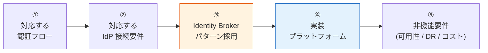

# 共有認証基盤 要件定義 提示版

> 作成日: 2026-05-13
> 最終更新: 2026-05-13（FR/NFR と 1:1 対応 / 用語を要件定義語に統一）
> ステータス: 🚧 **骨格のみ**（中身はサブセクションごとに合意取りながら順次記述）
> 対象読者: 顧客（要件定義 初期合意フェーズ）
> 関連 SSOT: [requirements-document-structure.md](requirements-document-structure.md)

---

## 0. はじめに

### 0.1 本資料の目的

（埋める：共有認証基盤の構築にあたり、要件定義の初期合意を取るための **要件ベースライン提示資料**）

### 0.2 本資料の読み方

各サブセクションは以下の対構造で記載する:

| ラベル | 内容 |
|---|---|
| **ベースライン** | 弊社が現時点で「こう定義したい」と提示する要件案（推奨値・想定範囲） |
| **TBD / 要確認** | 確定のために御社から教えていただく必要がある事項（ヒアリングで確定） |

詳細マトリクスは [functional-requirements.md](functional-requirements.md) / [non-functional-requirements.md](non-functional-requirements.md) にリンクで委譲し、本資料は要件の方向性合意に集中する。

### 0.3 全体スケジュール

（埋める：本資料合意 → ヒアリング → 要件定義書 → 設計 → 実装 の各マイルストーン）

---

## 1. 要件ベースラインの全体像

### 1.1 合意したい 5 ステップ

各ステップが順番に積み上がる構造。① と ② を確定すると、③ は構造的に決まる。④ は ①〜③ の要件次第。

### 1.2 本資料と詳細ドキュメントの対応

| 本資料セクション | 一次ソース（詳細）| カバーする FR/NFR |
|---|---|---|
| §2 認証 | [functional-requirements.md §1](functional-requirements.md) | FR-AUTH §1.1 認証フロー / §1.2 ローカル PW |
| §3 フェデレーション | [functional-requirements.md §2](functional-requirements.md) | FR-FED §2.1 IdP接続 / §2.2 ユーザー処理 / §2.3 マルチテナント運用 |
| §4 MFA | [functional-requirements.md §3](functional-requirements.md) | FR-MFA §3.1 要素 / §3.2 適用ポリシー |
| §5 SSO・ログアウト | [functional-requirements.md §4](functional-requirements.md) | FR-SSO §4.1 SSO / §4.2 ログアウト / §4.3 セッション |
| §6 認可 | [functional-requirements.md §5](functional-requirements.md) | FR-AUTHZ §5.1 基本 / §5.2 細粒度 |
| §7 ユーザー管理 | [functional-requirements.md §6](functional-requirements.md) | FR-USER §6.1 CRUD / §6.2 属性ロール / §6.3 セルフサービス / §6.4 プロビジョニング |
| §8 管理機能 | [functional-requirements.md §7](functional-requirements.md) | FR-ADMIN §7.1 設定 / §7.2 監査 / §7.3 委譲 |
| §9 外部統合 | [functional-requirements.md §8](functional-requirements.md) | FR-INT §8.1 プロトコル / §8.2 ログ / §8.3 API |
| §10 アーキテクチャ | [identity-broker-multi-idp.md](../common/identity-broker-multi-idp.md) | — |
| §11 プラットフォーム | [platform-selection-decision.md](platform-selection-decision.md) | — |
| §12 非機能要件 | [non-functional-requirements.md](non-functional-requirements.md) | NFR 全 9 カテゴリ |

---

## 2. 認証

> 詳細: [functional-requirements.md §1](functional-requirements.md)

### 2.1 認証フロー / Grant Type（→ FR-AUTH §1.1）

**ベースライン**: OIDC / OAuth 2.0 標準フロー（PKCE / Confidential / M2M）を基盤側でカバー。

（埋める：SPA / SSR / Mobile / M2M クライアントごとの想定フロー）

**TBD / 要確認**:
- 御社のシステム種別（SPA / SSR / Mobile / バッチ）と件数
- 特殊フロー（Token Exchange / Device Code / mTLS）の要否

### 2.2 パスワード・ローカルユーザー管理（→ FR-AUTH §1.2）

**ベースライン**: ローカル IdP モードで動作するときのパスワードポリシー（最小長・複雑性・履歴・ロックアウト・有効期限・セルフリセット・初期変更強制）。

（埋める：推奨デフォルト値）

**TBD / 要確認**:
- 御社のパスワードポリシー基準（業界標準 / 独自要件）
- 既存システムからの移行制約

---

## 3. フェデレーション / 外部 IdP 連携

> 詳細: [functional-requirements.md §2 FR-FED](functional-requirements.md)、[identity-broker-multi-idp.md](../common/identity-broker-multi-idp.md)

### 3.1 IdP 接続種別（→ FR-FED §2.1）

**ベースライン**: Entra ID / Okta / Google Workspace（OIDC）を主軸、SAML 2.0 / LDAP は要件次第で拡張。

**TBD / 要確認**: 御社が使用中の IdP、エンドユーザー（顧客企業）の IdP 種別と数

### 3.2 フェデレーションユーザー処理（→ FR-FED §2.2）

**ベースライン**: JIT プロビジョニング、属性マッピング、MFA 重複回避を基盤側で吸収。

**TBD / 要確認**: 顧客 IdP ごとに異なるクレーム名・属性の有無、MFA 適用方針

### 3.3 マルチテナント運用（→ FR-FED §2.3）

**ベースライン**: 複数 IdP 並行運用、顧客追加のオンボーディングフロー、ログイン画面の IdP 選択 UX。

**TBD / 要確認**: 想定顧客企業数、顧客追加リードタイム期待値

---

## 4. MFA（多要素認証）

> 詳細: [functional-requirements.md §3 FR-MFA](functional-requirements.md)、[ADR-009](../adr/009-mfa-responsibility-by-idp.md)

### 4.1 MFA 要素（→ FR-MFA §3.1）

**ベースライン**: TOTP を Must、WebAuthn / FIDO2（Passkeys）を Should、SMS / Email / バックアップコードは要件次第。

**TBD / 要確認**: ユーザー層に応じた MFA 手段（社員・顧客企業ユーザー・エンドユーザー）

### 4.2 MFA 適用ポリシー（→ FR-MFA §3.2）

**ベースライン**: ロール単位での MFA 強制 / 任意切替、フェデレーションユーザーは外部 IdP 側 MFA を尊重（重複回避）。

**TBD / 要確認**: 条件付き MFA（IP / リスクベース）の要否、ロール別 MFA 方針

---

## 5. SSO・ログアウト

> 詳細: [functional-requirements.md §4 FR-SSO](functional-requirements.md)

### 5.1 SSO（→ FR-SSO §4.1）

**ベースライン**: 同一 IdP 内の複数 Client 間 SSO + Auth0/Entra 経由のクロス IdP SSO を Must で提供。

**TBD / 要確認**: SSO で繋ぐシステム範囲

### 5.2 ログアウト（→ FR-SSO §4.2）

**ベースライン**: ローカル / IdP RP-Initiated / フェデレーション連動 / Front-Channel / Back-Channel のレイヤー別対応。

**TBD / 要確認**: どのレイヤーまでログアウトを伝播させるか（Back-Channel Logout の要否）

### 5.3 セッション管理（→ FR-SSO §4.3）

**ベースライン**: セッションタイムアウト、トークン Revocation、管理者による強制全セッション破棄。

**TBD / 要確認**: セッションタイムアウト目標値、強制無効化の業務要件

---

## 6. 認可

> 詳細: [functional-requirements.md §5 FR-AUTHZ](functional-requirements.md)、[authz-architecture-design.md](../common/authz-architecture-design.md)

### 6.1 クレームベース基本認可（→ FR-AUTHZ §5.1）

**ベースライン**: JWT クレーム（`tenant_id`, `roles`）で API Gateway + Lambda Authorizer によるロール認可 + テナント分離。

**TBD / 要確認**: ロール体系、テナント分離の粒度、API 認可方式

### 6.2 細粒度認可（→ FR-AUTHZ §5.2）

**ベースライン**: UMA 2.0 / ABAC は Could。要件次第で Keycloak Authorization Services を採用。

**TBD / 要確認**: リソースレベル認可・動的属性認可の必要性

---

## 7. ユーザー管理

> 詳細: [functional-requirements.md §6 FR-USER](functional-requirements.md)

### 7.1 ユーザー CRUD（→ FR-USER §6.1）

**ベースライン**: 標準的な CRUD・検索・有効化/無効化を Admin API 経由で提供。

**TBD / 要確認**: 想定ユーザー数（MAU）、削除時の関連データ要件

### 7.2 属性・ロール（→ FR-USER §6.2）

**ベースライン**: カスタム属性、グループ、ロール割り当てを統一形式で管理。

**TBD / 要確認**: 必要なユーザー属性・グループ・ロール

### 7.3 セルフサービス（→ FR-USER §6.3）

**ベースライン**: プロフィール編集・招待メール対応。

**TBD / 要確認**: セルフサービス機能の範囲

### 7.4 プロビジョニング（→ FR-USER §6.4）

**ベースライン**: SCIM 2.0 は TBD、バルクインポート Should、管理者による強制リセット Must。

**TBD / 要確認**: SCIM 自動同期の必要性、初期データ移行の規模

---

## 8. 管理機能

> 詳細: [functional-requirements.md §7 FR-ADMIN](functional-requirements.md)

### 8.1 基盤設定管理（→ FR-ADMIN §7.1）

**ベースライン**: 管理コンソール UI、テナント・IdP・クライアント・ロールの管理、テナント別設定分離。

**TBD / 要確認**: 管理操作の主体（弊社運用 / 顧客企業の管理者）

### 8.2 監査・可視性（→ FR-ADMIN §7.2）

**ベースライン**: CloudTrail / Event Listener による監査ログ閲覧、設定変更履歴。

**TBD / 要確認**: 監査の頻度・保存期間・閲覧者

### 8.3 権限委譲・カスタマイズ（→ FR-ADMIN §7.3）

**ベースライン**: 管理者 RBAC、テナント管理者委譲（顧客企業の自社運用）、ログイン UI カスタマイズ。

**TBD / 要確認**: 顧客企業への管理権限委譲の要否、ログイン UI 要件（ブランディング）

---

## 9. 外部統合

> 詳細: [functional-requirements.md §8 FR-INT](functional-requirements.md)

### 9.1 プロトコル準拠（→ FR-INT §8.1）

**ベースライン**: OIDC 1.0 / OAuth 2.0 / SAML 2.0 / JWKS 公開エンドポイント / API Gateway 統合の標準準拠。

**TBD / 要確認**: 統合先システムの対応プロトコル

### 9.2 ログ・監視（→ FR-INT §8.2）

**ベースライン**: CloudWatch / S3 / Kinesis への監査ログ外部出力。SIEM 連携は要件次第。

**TBD / 要確認**: 使用中の SIEM（Splunk / Datadog 等）、ログ保存期間

### 9.3 API・IaC・Webhook（→ FR-INT §8.3）

**ベースライン**: 管理 REST API、Terraform / IaC 管理、Webhook イベント通知（要件次第）。

**TBD / 要確認**: 既存 CI/CD / IaC との統合要件、Webhook で連携したいイベント

---

## 10. アーキテクチャ — Identity Broker パターン

> 詳細: [identity-broker-multi-idp.md](../common/identity-broker-multi-idp.md)

### 10.1 なぜ Broker パターンか

**ベースライン**: §3 で示した複数 IdP 接続と、§9 で示した「各システムは標準 OIDC JWT を検証するだけ」を両立するには、認証基盤を **Hub-and-Spoke 型 Identity Broker** にする必要がある。

（埋める：①② を満たすには集約点が必要 → Hub-and-Spoke 構成 = Identity Broker パターン）

- 顧客 IdP が増えても各システムは変更不要
- JWT の検証は 1 つの issuer のみ
- 業界標準パターン（Microsoft Azure Architecture Center 公式パターン、KuppingerCole Identity Fabrics）

### 10.2 アーキテクチャ概要

（埋める：identity-broker-multi-idp.md §2 の図を簡素化）

### 10.3 TBD / 要確認

- アプローチに異論ないか
- 既存システムからの移行制約
- 組織横断 IdP 統合の運用主体

---

## 11. 実装プラットフォーム

> 詳細: [platform-selection-decision.md](platform-selection-decision.md)、[ADR-006](../adr/006-cognito-vs-keycloak-cost-breakeven.md)、[ADR-014](../adr/014-auth-patterns-scope.md)

### 11.1 2 案併記

| 観点 | 第一案：AWS Cognito | 第二案：Keycloak on AWS |
|---|---|---|
| 性質 | マネージドサービス | OSS（または RHBK 商用版） |
| 運用負荷 | 低 | 中〜高 |
| 自由度 | 中 | 高 |
| 損益分岐 | 〜17.5万 MAU 程度で優位 | 大規模・特殊要件で優位 |

### 11.2 選定論点

選定に関わる必須要件:
- FR-AUTH §1.1 - 005〜007（Token Exchange / Device Code / mTLS）が Must → Keycloak 必須
- FR-FED §2.1 - 006/007（SAML IdP 発行 / LDAP 直連携）が Must → Keycloak 必須
- NFR-COMP §7.2 - FIPS 140-2 が Must → RHBK 必須

### 11.3 TBD / 要確認

- MAU 規模（1 年後 / 3 年後）
- 商用サポート要否
- 既存 AWS 利用状況
- FIPS 等のコンプライアンス要件

---

## 12. 非機能要件

> 詳細: [non-functional-requirements.md](non-functional-requirements.md)

### 12.1 可用性（→ NFR-AVL）

**ベースライン**: 99.9% / 99.95% / 99.99% のいずれか。マルチ AZ 配置・自動復旧・ゼロダウンデプロイを標準装備。

**TBD / 要確認**: SLA 目標、計画メンテナンス窓

### 12.2 性能（→ NFR-PERF）

**ベースライン**: 応答時間 P95 < 1s, P99 < 2s。スループットは MAU 規模から逆算。

**TBD / 要確認**: スループット要件、ピーク時間帯倍率

### 12.3 拡張性（→ NFR-SCL）

**ベースライン**: MAU 自動スケール、IdP 追加 < 1 営業日、マルチリージョン対応は要件次第。

**TBD / 要確認**: MAU 成長見込み、マルチリージョン要否

### 12.4 セキュリティ（→ NFR-SEC §4.1〜§4.4）

**ベースライン**: TLS 1.2+ / KMS / RS256 / Refresh Token Rotation / WAF / Private Subnet / VPC Endpoint。

**TBD / 要確認**: トークン TTL ポリシー、攻撃対策の追加要件（侵害クレデンシャル検出等）

### 12.5 DR（→ NFR-DR）

**ベースライン**: RTO/RPO の選定肢を提示。Cognito は Route 53 自動フェイルオーバー、Keycloak は Aurora Global DB。

**TBD / 要確認**: RTO/RPO 目標、DR 訓練頻度

### 12.6 運用（→ NFR-OPS §6.1〜§6.3）

**ベースライン**: CloudWatch 監視、CI/CD 自動デプロイ、24/7 体制は要件次第。

**TBD / 要確認**: ログ保存期間、24/7 サポート要否、運用主体

### 12.7 コンプライアンス（→ NFR-COMP §7.1〜§7.3）

**ベースライン**: 個人情報保護法 Must。GDPR / SOC 2 / ISO 27001 / FIPS は要件次第。

**TBD / 要確認**: 適用される業界規制、データ所在地制約

### 12.8 コスト（→ NFR-COST）

**ベースライン**: MAU 規模次第で Cognito vs Keycloak が損益分岐。3 年 TCO で比較提示。

**TBD / 要確認**: 予算レンジ、コスト評価期間

### 12.9 移行性（→ NFR-MIG）

**ベースライン**: 既存認証システムからの段階的移行をサポート。パスワードハッシュ移行は方式次第。

**TBD / 要確認**: 既存システム種別、移行期限

---

## 13. TBD / 要確認 事項サマリー

> 詳細: [hearing-checklist.md](hearing-checklist.md)

（埋める：上記から最重要 5〜10 項目を抜粋）

優先度（プラットフォーム選定に直結する順）:
1. （埋める）
2. （埋める）
...

---

## 14. 想定スケジュール

> 詳細: [requirements-process-plan.md §7](requirements-process-plan.md)

（埋める：本資料合意 → ヒアリング Phase A/B/C → 要件定義書 → 設計 → 実装）

---

## 15. 参考：弊社内の事前検証について

（埋める：本提案は、事前に内部で技術検証（PoC）を実施した結果に基づく。Cognito / Keycloak それぞれで認証・認可・DR・マルチ IdP・VPC 完全プライベート JWKS まで検証済み。詳細結果が必要な場合は別途共有可能）

> 内部資料: [poc-summary-evaluation.md](poc-summary-evaluation.md)

---

## 16. 関連ドキュメント

- [requirements-document-structure.md](requirements-document-structure.md): 要件定義 SSOT
- [functional-requirements.md](functional-requirements.md): 機能要件詳細（FR-AUTH/FED/MFA/SSO/AUTHZ/USER/ADMIN/INT、各サブセクション付き）
- [non-functional-requirements.md](non-functional-requirements.md): 非機能要件詳細（NFR-AVL/PERF/SCL/SEC/DR/OPS/COMP/COST/MIG）
- [identity-broker-multi-idp.md](../common/identity-broker-multi-idp.md): Broker パターン詳細
- [platform-selection-decision.md](platform-selection-decision.md): プラットフォーム選定判断書
