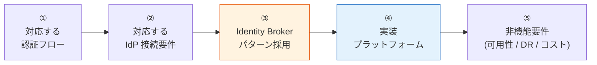

# 共有認証基盤 要件定義 提示版（SSOT）

> 作成日: 2026-05-13
> 最終更新: 2026-05-13（ファイル分割 / proposal/ フォルダ化）
> ステータス: 🚧 サブセクションごとに合意取り中
> 対象読者: 顧客（要件定義 初期合意フェーズ）
> 上位 SSOT: [../requirements-document-structure.md](../requirements-document-structure.md)

---

## 0. はじめに

### 0.1 本資料群の目的

共有認証基盤の構築にあたり、要件定義の初期合意を取るための **要件ベースライン提示資料**。各章は独立した md ファイルに分割し、本ファイル（00-index.md）が **proposal SSOT** として全章を統括する。

### 0.2 本基盤の北極星（Vision Statement）

本基盤は **「絶対安全に、どんなアプリでも、効率よく認証し、運用負荷やコストがかからない」共通認証基盤** を目指す。各機能・非機能要件は次の 4 軸で判断する：

| 北極星の柱 | 解釈 | 反映先 |
|---|---|---|
| **絶対安全** | セキュリティ最優先（業界最新ベストプラクティス準拠） | 各章の "ベースライン" は OAuth 2.1 / NIST SP 800-63B Rev 4 等を参照 |
| **どんなアプリでも** | 認証フロー・IdP・クライアント種別の網羅性 | [§2 認証](02-auth.md) / [§3 フェデレーション](03-federation.md) / [§11 Identity Broker](11-architecture.md) |
| **効率よく認証** | 顧客追加・システム追加のフリクションレス | [§3.3 マルチテナント運用](03-federation.md#33-マルチテナント運用) / [§5 SSO](05-sso.md) |
| **運用負荷・コスト最小** | マネージド優先、自前運用は限定 | [§12 プラットフォーム選定軸](12-platform.md) / [§13.6 運用](13-nfr.md#136-運用) / [§13.8 コスト](13-nfr.md#138-コスト) |

すべての要件は **AWS マルチアカウント前提**で **Cognito / Keycloak OSS / Keycloak RHBK のいずれでも構成可能**な設計を採用する。

### 0.3 本資料の読み方

各章のサブセクションは以下の対構造で記載する:

| ラベル | 内容 |
|---|---|
| **ベースライン** | 弊社が現時点で「こう定義したい」と提示する要件案（推奨値・想定範囲） |
| **TBD / 要確認** | 確定のために御社から教えていただく必要がある事項（ヒアリングで確定） |

詳細マトリクスは [../functional-requirements.md](../functional-requirements.md) / [../non-functional-requirements.md](../non-functional-requirements.md) にリンクで委譲し、本資料は要件の方向性合意に集中する。

---

## 1. 要件ベースラインの全体像

### 1.1 合意したい 5 ステップ

各ステップが順番に積み上がる構造。① と ② を確定すると、③ は構造的に決まる。④ は ①〜③ の要件次第。

### 1.2 章一覧とナビゲーション

| 章 | ファイル | 内容 | 一次ソース（詳細） | 状態 |
|---|---|---|---|:---:|
| §2 | [02-auth.md](02-auth.md) | 認証（認証フロー / パスワード） | [FR-AUTH §1](../functional-requirements.md) | ✅ 記載済 |
| §3 | [03-federation.md](03-federation.md) | フェデレーション（IdP 接続 / ユーザー処理 / マルチテナント運用） | [FR-FED §2](../functional-requirements.md) | ✅ 記載済 |
| §4 | [04-mfa.md](04-mfa.md) | MFA（要素 / 適用ポリシー） | [FR-MFA §3](../functional-requirements.md) | ✅ 記載済 |
| §5 | [05-sso.md](05-sso.md) | SSO（同一 IdP / クロス IdP） | [FR-SSO §4.1](../functional-requirements.md) | ✅ 記載済 |
| §6 | [06-logout-session.md](06-logout-session.md) | ログアウト・セッション管理（4 レイヤー / ライフサイクル / Revocation） | [FR-SSO §4.2-4.3](../functional-requirements.md) | ✅ 記載済 |
| §7 | [07-authz.md](07-authz.md) | 認可（基本 / 細粒度） | [FR-AUTHZ §5](../functional-requirements.md) | 📋 骨格のみ |
| §8 | [08-user.md](08-user.md) | ユーザー管理（CRUD / 属性ロール / セルフサービス / プロビジョニング） | [FR-USER §6](../functional-requirements.md) | ✅ 記載済 |
| §9 | [09-admin.md](09-admin.md) | 管理機能（設定 / 監査 / 委譲） | [FR-ADMIN §7](../functional-requirements.md) | ✅ 記載済 |
| §10 | [10-integration.md](10-integration.md) | 外部統合（プロトコル / ログ / API） | [FR-INT §8](../functional-requirements.md) | ✅ 記載済 |
| §11 | [11-architecture.md](11-architecture.md) | アーキテクチャ — Identity Broker パターン | [identity-broker-multi-idp.md](../../common/identity-broker-multi-idp.md) | ✅ 記載済 |
| §12 | [12-platform.md](12-platform.md) | 実装プラットフォーム(Cognito / Keycloak / RHBK) | [platform-selection-decision.md](../platform-selection-decision.md) | 📋 骨格のみ |
| §13 | [13-nfr.md](13-nfr.md) | 非機能要件(NFR 全 9 カテゴリ) | [non-functional-requirements.md](../non-functional-requirements.md) | 📋 骨格のみ |
| §14 | [14-tbd-summary.md](14-tbd-summary.md) | TBD / 要確認 事項サマリー | [hearing-checklist.md](../hearing-checklist.md) | 📋 骨格のみ |
| §15 | [15-schedule.md](15-schedule.md) | 想定スケジュール | [requirements-process-plan.md](../requirements-process-plan.md) | 📋 骨格のみ |
| §16 | [16-poc-note.md](16-poc-note.md) | 弊社内の事前検証について(PoC 控えめ) | [poc-summary-evaluation.md](../poc-summary-evaluation.md) | 📋 骨格のみ |

---

## 2. 全体スケジュール

（埋める：本資料合意 → ヒアリング → 要件定義書 → 設計 → 実装 の各マイルストーン）

詳細: [15-schedule.md](15-schedule.md)

---

## 3. 関連ドキュメント

- [../requirements-document-structure.md](../requirements-document-structure.md): 要件定義フェーズ全体 SSOT
- [../functional-requirements.md](../functional-requirements.md): 機能要件詳細（FR-AUTH/FED/MFA/SSO/AUTHZ/USER/ADMIN/INT、各サブセクション付き）
- [../non-functional-requirements.md](../non-functional-requirements.md): 非機能要件詳細（NFR-AVL/PERF/SCL/SEC/DR/OPS/COMP/COST/MIG）
- [../../common/identity-broker-multi-idp.md](../../common/identity-broker-multi-idp.md): Broker パターン詳細
- [../platform-selection-decision.md](../platform-selection-decision.md): プラットフォーム選定判断書
- [../hearing-checklist.md](../hearing-checklist.md): ヒアリング項目一覧
