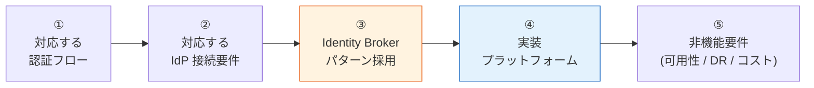

# 共有認証基盤 要件定義 提示版（SSOT）

> ステータス: 🚧 サブセクションごとに合意取り中   
> 対象読者: 顧客（要件定義 初期合意フェーズ）   
> 上位 SSOT: [../requirements-document-structure.md](../requirements-document-structure.md)

---

## 0. はじめに

### 0.1 本資料群の目的

共有認証基盤の構築にあたり、要件定義の初期合意を取るための **要件ベースライン提示資料**。各章は独立した md ファイルに分割し、本ファイル（00-index.md）が **proposal SSOT** として全章を統括する。

### 0.2 本基盤の基本方針

本基盤は **「絶対安全に、どんなアプリでも、効率よく認証し、運用負荷やコストがかからない」共通認証基盤** を目指す。各機能・非機能要件は次の 4 軸で判断する：

| 基本方針の柱 | 解釈 | 反映先 |
|---|---|---|
| **絶対安全** | セキュリティ最優先（業界最新ベストプラクティス準拠） | 各章の "ベースライン" は OAuth 2.1 / NIST SP 800-63B Rev 4 等を参照 |
| **どんなアプリでも** | 認証フロー・IdP・クライアント種別の網羅性 | [§FR-1 認証](fr/01-auth.md) / [§FR-2 フェデレーション](fr/02-federation.md) / [§C-1 Identity Broker](common/01-architecture.md) |
| **効率よく認証** | 顧客追加・システム追加のフリクションレス | [§FR-2.3 マルチテナント運用](fr/02-federation.md) / [§FR-4 SSO](fr/04-sso.md) |
| **運用負荷・コスト最小** | マネージド優先、自前運用は限定 | [§C-2 プラットフォーム選定軸](common/02-platform.md) / [§NFR-6 運用](nfr/06-operations.md) / [§NFR-8 コスト](nfr/08-cost.md) |

すべての要件は **AWS マルチアカウント前提**で **Cognito / Keycloak OSS / Keycloak RHBK のいずれでも構成可能**な設計を採用する。

### 0.3 本資料の読み方

各章のサブセクションは以下の対構造で記載する:

| ラベル | 内容 |
|---|---|
| **ベースライン** | 弊社が現時点で「こう定義したい」と提示する要件案（推奨値・想定範囲） |
| **TBD / 要確認** | 確定のために御社から教えていただく必要がある事項（ヒアリングで確定） |

詳細マトリクスは [../functional-requirements.md](../functional-requirements.md) / [../non-functional-requirements.md](../non-functional-requirements.md) にリンクで委譲し、本資料は要件の方向性合意に集中する。

### 0.4 検討事項（要件項目）の抽出方針

本資料および [../hearing-checklist.md](../hearing-checklist.md)（全 123 項目）の検討事項は、以下の **4 軸を交差させて抽出**している。1 軸だけでは漏れが出るため、複数軸が同じ項目に行き着くかをチェックしながら積み上げる方針を採った。

#### 抽出の 4 軸

**軸 1: 基本方針 4 柱（§0.2）への対応**

各検討事項は「**絶対安全 / どんなアプリでも / 効率よく / 低運用負荷・コスト**」のいずれかの柱に必ず紐づく。柱に対応しない項目は基盤の合意対象から外している。各章 §X.0 で「この章がどの柱に答えるか」を冒頭で明示する規約と整合。

**軸 2: 業界標準・公式仕様への網羅マッピング**

内部主観で項目を絞らないよう、以下の外部基準にマップして網羅性を担保する:

| 領域 | 参照基準 |
|---|---|
| 機能要件（認証） | OAuth 2.1 / OIDC Core / RFC 8693 (Token Exchange) / RFC 8628 (Device Code) / RFC 8705 (mTLS) / RFC 9449 (DPoP) / FAPI 2.0 |
| パスワード・MFA | NIST SP 800-63B Rev 4、業界主流（Auth0 / Entra / Okta）デフォルト |
| 非機能要件 | **IPA「非機能要求グレード」6 大項目**（A 可用性 / B 性能・拡張性 / C 運用・保守性 / D 移行性 / E セキュリティ / F 環境）と §NFR-1〜9 を 1:1 マッピング（§1.3 参照）|
| プロビジョニング | SCIM 2.0 (RFC 7644) |
| SSO 業界動向 | IETF / Curity / Duende 2025 推奨（BFF gold standard）等 |

→ 「**外部標準に項目が存在するなら、本基盤でも採否を必ず決めておく**」という抜け漏れ防止のチェックリストとして機能する。

**軸 3: PoC 検証結果による実装可能性の裏付け**

弊社内 9 フェーズの PoC で実機検証した Cognito / Keycloak の対応差分（✅ / 🟡 / 🟠 / ❌）から、**プラットフォーム選定・設計フェーズで効いてくる項目を 🔥 最優先として抽出**している。代表例:

- Cognito 非対応の Token Exchange / Device Code / mTLS / SAML 発行側 / LDAP 直結
- Cognito Plus ティア依存機能（リスクベース適応認証 等）
- マルチアカウント Custom Domain 4 個 Hard Limit
- Cognito Essentials ティア依存の `PasswordHistorySize` 等

「机上では選択肢だが実装段階で必ず効いてくる項目」を、PoC で踏んだ事実に基づいて先回りで問う構造。

**軸 4: ステークホルダー視点（Phase A / B / C / D）**

「誰しか答えられない問い」を分離し、聞くべき相手を取りこぼさない設計:

| Phase | 対象 | 主な検討対象 |
|---|---|---|
| A. 事業要件 | プロダクトオーナー / 事業企画 / 営業 | MAU 規模、顧客 IdP 分布、リリース時期、ブランディング要件 |
| B. 技術要件 | 開発チーム / テックリード | Grant Type、JWT クレーム、テナント分離方式、API 形態 |
| C. 運用・セキュリティ | 情シス / SRE / セキュリティ | SLA / RTO・RPO、監査ログ、コンプラ、MFA ポリシー |
| D. 最終判断 | 意思決定者 | プラットフォーム最終決定、予算、マイルストーン |

#### 抽出方針の根拠

1. **後戻りコストの非対称性**: 認証基盤はユーザー ID 体系・トークン署名鍵・テナント分離方式が本番稼働後にほぼ変更不能で、設計時の取り違えがそのまま積み残しになる。事前ヒアリングのコスト ≪ 事後発覚の修正コストであり、「**網羅性 > 簡潔性**」を優先する判断は合理的である。
2. **外部基準による網羅性担保**: 軸 2 のマッピングにより、第三者監査・社内レビューに耐える根拠を持つ。「弊社内部の主観で要件を絞っていない」ことを明示できる。
3. **意思決定との連動**: 全項目に「優先度（🔥 / 🟡 / 🟢）」「関連 FR/NFR ID」「proposal §」を紐付け、回答取得 → 反映先（[functional-requirements.md](../functional-requirements.md) / ADR / プラットフォーム選定）が事前に決まっている。「聞いた後で考える」項目は混ぜていない。

#### 量に対する設計

123 項目のうち **🔥 最優先 39 件** をプラットフォーム選定（Cognito vs Keycloak、ティア選定）に直結する判断材料として Stage 1 前半で先行確認する。Phase 別の担当者分離（A 19 件 / B 61 件 / C 37 件 / D 6 件）により、**1 人あたりの回答負担は 20〜60 項目程度**に抑える設計。回答形式も `Yes/No` / `選択肢` / `具体値` で事前定義し、自由記述で考え込ませない。

詳細プロセス（ヒアリング 4 ステージ、実装可能性評価、要件定義書化）は [../requirements-process-plan.md](../requirements-process-plan.md) を参照。

### 0.5 フォルダ構造

```
proposal/
├── 00-index.md          ← 本ファイル（SSOT）
├── fr/                  ← 機能要件（§FR-1 〜 §FR-9）
│   ├── 01-auth.md
│   ├── 02-federation.md
│   ├── 03-mfa.md
│   ├── 04-sso.md
│   ├── 05-logout-session.md
│   ├── 06-authz.md
│   ├── 07-user.md
│   ├── 08-admin.md
│   └── 09-integration.md
├── nfr/                 ← 非機能要件（§NFR-1 〜 §NFR-9、IPA 6 大項目マッピング付き）
│   ├── 00-index.md
│   ├── 01-availability.md
│   ├── 02-performance.md
│   ├── 03-scalability.md
│   ├── 04-security.md
│   ├── 05-dr.md
│   ├── 06-operations.md
│   ├── 07-compliance.md
│   ├── 08-cost.md
│   └── 09-migration.md
└── common/              ← 横断（§C-1 〜 §C-5）
    ├── 01-architecture.md
    ├── 02-platform.md
    ├── 03-tbd-summary.md
    ├── 04-schedule.md
    └── 05-poc-note.md
```

---

## 1. 要件ベースラインの全体像

### 1.1 合意したい 5 ステップ



各ステップが順番に積み上がる構造。① と ② を確定すると、③ は構造的に決まる。④ は ①〜③ の要件次第。

### 1.2 機能要件（FR）章一覧

| 章 | ファイル | 内容 | 一次ソース（詳細） |
|---|---|---|---|
| §FR-1 | [fr/01-auth.md](fr/01-auth.md) | 認証（認証フロー / パスワード） | [FR-AUTH §1](../functional-requirements.md) |
| §FR-2 | [fr/02-federation.md](fr/02-federation.md) | フェデレーション（IdP 接続 / ユーザー処理 / マルチテナント運用） | [FR-FED §2](../functional-requirements.md) |
| §FR-3 | [fr/03-mfa.md](fr/03-mfa.md) | MFA（要素 / 適用ポリシー） | [FR-MFA §3](../functional-requirements.md) |
| §FR-4 | [fr/04-sso.md](fr/04-sso.md) | SSO（同一 IdP / クロス IdP） | [FR-SSO §4.1](../functional-requirements.md) |
| §FR-5 | [fr/05-logout-session.md](fr/05-logout-session.md) | ログアウト・セッション管理（4 レイヤー / ライフサイクル / Revocation） | [FR-SSO §4.2-4.3](../functional-requirements.md) |
| §FR-6 | [fr/06-authz.md](fr/06-authz.md) | 認可（JWT クレーム / 4 パターン） | [FR-AUTHZ §5](../functional-requirements.md) |
| §FR-7 | [fr/07-user.md](fr/07-user.md) | ユーザー管理（CRUD / 属性ロール / セルフサービス / プロビジョニング） | [FR-USER §6](../functional-requirements.md) |
| §FR-8 | [fr/08-admin.md](fr/08-admin.md) | 管理機能（設定 / 監査 / 委譲・カスタマイズ） | [FR-ADMIN §7](../functional-requirements.md) |
| §FR-9 | [fr/09-integration.md](fr/09-integration.md) | 外部統合（プロトコル / ログ / API） | [FR-INT §8](../functional-requirements.md) |

### 1.3 非機能要件（NFR）章一覧 — IPA 非機能要求グレード対応

| 章 | ファイル | 内容 | IPA 大項目 |
|---|---|---|---|
| - | [nfr/00-index.md](nfr/00-index.md) | NFR 全体 + IPA マッピング | - |
| §NFR-1 | [nfr/01-availability.md](nfr/01-availability.md) | 可用性（SLA / RTO / RPO） | **A. 可用性** |
| §NFR-2 | [nfr/02-performance.md](nfr/02-performance.md) | 性能（応答時間 / スループット） | **B. 性能・拡張性** |
| §NFR-3 | [nfr/03-scalability.md](nfr/03-scalability.md) | 拡張性（MAU / 同時接続） | **B. 性能・拡張性** |
| §NFR-4 | [nfr/04-security.md](nfr/04-security.md) | セキュリティ（脅威対策 / 暗号化 / ゼロトラスト） | **E. セキュリティ** |
| §NFR-5 | [nfr/05-dr.md](nfr/05-dr.md) | DR（リージョン障害対応） | **A. 可用性（災害対策）** |
| §NFR-6 | [nfr/06-operations.md](nfr/06-operations.md) | 運用（監視 / デプロイ / サポート） | **C. 運用・保守性** |
| §NFR-7 | [nfr/07-compliance.md](nfr/07-compliance.md) | コンプライアンス（規制 / 認定） | **E + C**（独立章） |
| §NFR-8 | [nfr/08-cost.md](nfr/08-cost.md) | コスト（3 年 TCO） | （IPA 範囲外、独立章） |
| §NFR-9 | [nfr/09-migration.md](nfr/09-migration.md) | 移行性（既存基盤からの移行） | **D. 移行性** |

> 注: IPA グレードの **F. システム環境・エコロジー** はクラウド（AWS）前提で本基盤独自要件にはならないため省略。

### 1.4 横断章（Common）

| 章 | ファイル | 内容 |
|---|---|---|
| §C-1 | [common/01-architecture.md](common/01-architecture.md) | アーキテクチャ — Identity Broker パターン |
| §C-2 | [common/02-platform.md](common/02-platform.md) | 実装プラットフォーム（Cognito / Keycloak OSS / RHBK）選定軸 |
| §C-3 | [common/03-tbd-summary.md](common/03-tbd-summary.md) | TBD / 要確認 事項サマリー |
| §C-4 | [common/04-schedule.md](common/04-schedule.md) | 想定スケジュール |
| §C-5 | [common/05-poc-note.md](common/05-poc-note.md) | 弊社内の事前検証について（PoC 控えめ） |

---

## 2. 全体スケジュール

（埋める：本資料合意 → ヒアリング → 要件定義書 → 設計 → 実装 の各マイルストーン）

詳細: [common/04-schedule.md](common/04-schedule.md)

---

## 3. 関連ドキュメント

- [../requirements-document-structure.md](../requirements-document-structure.md): 要件定義フェーズ全体 SSOT
- [../functional-requirements.md](../functional-requirements.md): 機能要件詳細（FR-AUTH/FED/MFA/SSO/AUTHZ/USER/ADMIN/INT、各サブセクション付き）
- [../non-functional-requirements.md](../non-functional-requirements.md): 非機能要件詳細（NFR-AVL/PERF/SCL/SEC/DR/OPS/COMP/COST/MIG）
- [../../common/identity-broker-multi-idp.md](../../common/identity-broker-multi-idp.md): Broker パターン詳細
- [../platform-selection-decision.md](../platform-selection-decision.md): プラットフォーム選定判断書
- [../hearing-checklist.md](../hearing-checklist.md): ヒアリング項目一覧
