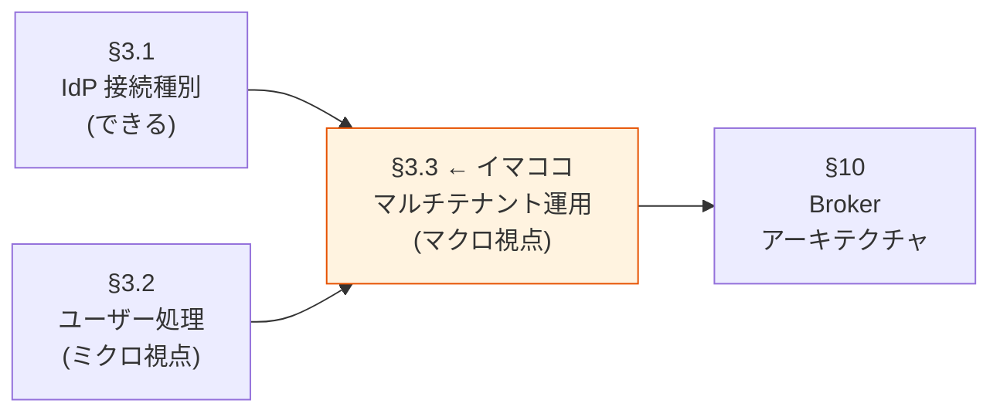
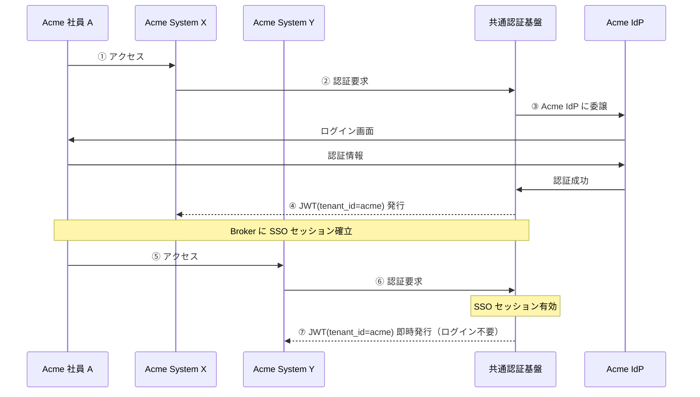
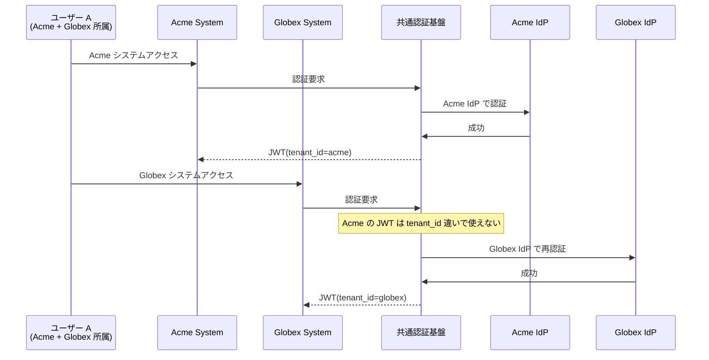
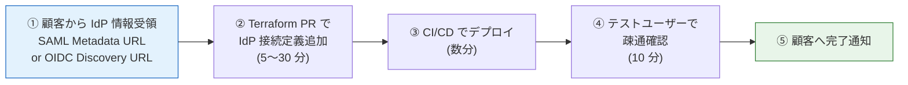
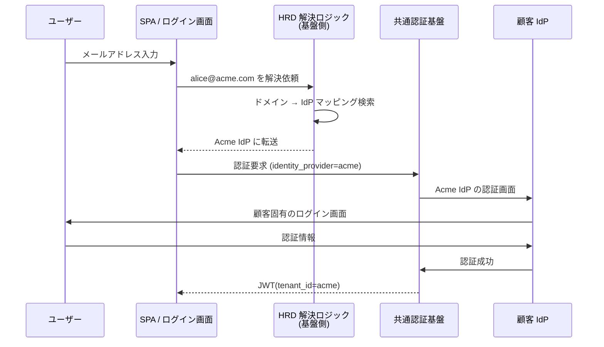

# §3 フェデレーション / 外部 IdP 連携

> 上位 SSOT: [00-index.md](00-index.md)
> 詳細: [../functional-requirements.md §2 FR-FED](../functional-requirements.md)、[../../common/identity-broker-multi-idp.md](../../common/identity-broker-multi-idp.md)
> カバー範囲: FR-FED §2.1 IdP 接続種別 / §2.2 ユーザー処理（§2.2.1 JIT / §2.2.2 属性マッピング / §2.2.3 MFA 重複回避）/ §2.3 マルチテナント運用

---

## 3.1 IdP 接続種別（→ FR-FED §2.1）

> **このサブセクションで定めること**: 本基盤が外部 IdP として**受け入れ可能なプロトコル**（OIDC / SAML 2.0 / LDAP）と、想定する**主要 IdP 製品**（Entra ID / Okta / HENNGE One 等）の接続実績。
> **主な判断軸**: 御社・御社顧客の IdP 構成、SAML IdP 発行モード / LDAP 直接連携の要否（Keycloak 必須化に直結）
> **§3 全体との関係**: §3.1 = 接続「できる範囲」、§3.2 = 受け入れたユーザーの「処理」、§3.3 = 「並行運用」

「**どんな顧客 IdP でも接続可能**」という capability を示す。具体接続先は §B 確認後に確定。

### 業界の現在地（2026 年時点の調査結果）

**グローバル**:
- **Microsoft Entra ID + Okta が 2 強**（合計でエンタープライズ需要の約 80% カバー）
- **Google Workspace** が残りの多くをカバー
- Ping / IBM / Oracle / Thales / Auth0 が次集団

**日本特有**:
- **HENNGE One** — 国内 IDaaS シェア No.1
- **GMO Trust Login** — 累計 1 万社以上の導入実績
- **Cloud Gate UNO、Extic** — 国産 IDaaS
- 共通点：いずれも **SAML 2.0 を主軸**（OIDC も対応進行中）

**プロトコル動向**:
- OIDC が新規システムの主流。SAML は依然エンタープライズ・SaaS で広く使用
- LDAP / Active Directory 直接連携はレガシー領域で根強い需要

### 我々のスタンス（北極星に基づく）

| 北極星の柱 | IdP 接続での実現 |
|---|---|
| **絶対安全** | 業界標準（OIDC 1.0 / SAML 2.0）準拠の IdP のみを受け入れる。独自プロトコルは受け入れない |
| **どんなアプリでも** | **OIDC または SAML が話せる IdP なら何でも接続可能**。Cognito / Keycloak 両方でグローバル主要 + 日本主要 IdP をカバー |
| **効率よく認証** | Broker パターンで顧客追加でも各システム変更不要（[§11](11-architecture.md)）|
| **運用負荷・コスト最小** | OIDC は Discovery 自動化、SAML は Metadata XML 投入で完結。両方 Terraform 管理可能 |

### 対応能力マトリクス（裏どり）

**A. 接続方法（プロトコル別の対応）**

「**どんなプロトコルを話す IdP まで受けられるか**」の境界線：

| プロトコル | Cognito | Keycloak (OSS / RHBK) | 備考 |
|---|:---:|:---:|---|
| **OIDC IdP**（標準準拠なら何でも）| ✅ 標準対応 | ✅ 標準対応 | RFC 6749 / OIDC 1.0 |
| **SAML 2.0 SP モード**（外部 IdP からのアサーション受け入れ）| ✅ 標準対応 | ✅ 標準対応 | エンタープライズ / 日本 IDaaS が主に SAML |
| **SAML 2.0 IdP モード**（共通基盤が SAML を発行）| ❌ 不可 | ✅ 標準対応 | 共通基盤が他システムに対して SAML 発行 |
| **LDAP / Active Directory 直接連携** | ❌ 不可 | ✅ User Federation（標準機能）| ADFS 経由なし、AD 直結 |
| 独自プロトコル IdP | ❌ | ❌ | OIDC/SAML へのラッパー設計を要請 |

**B. 接続先（主要 IdP の対応実績）**

「**実際に名指しされる IdP を接続できるか**」の確認：

| IdP | プロトコル | Cognito | Keycloak (OSS / RHBK) | 備考 |
|---|---|:---:|:---:|---|
| Microsoft Entra ID（旧 Azure AD）| OIDC / SAML | ✅ | ✅ | グローバル No.1 |
| Okta | OIDC / SAML | ✅ | ✅ | グローバル 2 番手 |
| Google Workspace | OIDC / SAML | ✅ | ✅ | テック企業に多い |
| Auth0 | OIDC | ✅（PoC 実証済）| ✅（PoC 実証済）| Entra ID 代替として PoC 検証 |
| HENNGE One | SAML | ✅ | ✅ | 国内 IDaaS シェア No.1 |
| GMO Trust Login | SAML | ✅ | ✅ | 国内中堅、1 万社実績 |
| Cloud Gate UNO / Extic | SAML / OIDC | ✅ | ✅ | 国産 IDaaS |
| 顧客独自 SAML / OIDC IdP | SAML / OIDC | ✅ | ✅ | プロトコル準拠なら可 |
| ソーシャル（Google / Facebook / Apple / Amazon 等）| OIDC | ✅ ネイティブ統合 | ✅ ネイティブ統合 | コンシューマ向け |

### ベースライン

**1. プロトコル対応範囲**

| プロトコル | 対応 | 採用プラットフォーム |
|---|:---:|---|
| **OIDC 1.0**（外部 IdP として受け入れ） | ✅ Must | Cognito / Keycloak 両方 |
| **SAML 2.0 SP モード**（外部 IdP として受け入れ）| ✅ Must | Cognito / Keycloak 両方 |
| **SAML 2.0 IdP モード**（共通基盤が SAML を発行）| 要件次第 | **Keycloak のみ**（Cognito 不可）|
| **LDAP / AD 直接連携** | 要件次第 | **Keycloak のみ**（Cognito 不可）|
| 独自プロトコル IdP | ❌ Won't | OIDC/SAML へのラッパー設計を要請 |

**2. 主要 IdP の接続実績**（我々が裏どり済み）

| IdP | 種別 | 接続実績 | 想定優先度 |
|---|---|:---:|:---:|
| Microsoft Entra ID（旧 Azure AD）| OIDC / SAML | PoC で Auth0 を Entra ID 代替検証 | **Must 候補** |
| Auth0 | OIDC | ✅ PoC Phase 2, 7 で実証 | 検証完了 |
| Okta | OIDC / SAML | 公式手順あり | Should 候補 |
| Google Workspace | OIDC / SAML | 公式手順あり | Could 候補 |
| HENNGE One | SAML | 国内 No.1、SAML 経由で接続可能 | 国内顧客向け Must 候補 |
| GMO Trust Login | SAML | 国内 SAML 対応 | 国内中堅向け |
| 顧客独自 SAML / OIDC IdP | SAML / OIDC | プロトコル準拠なら接続可能 | 要件次第 |

**3. Custom Domain**

| 項目 | ベースライン |
|---|---|
| 認証エンドポイント URL | `auth.example.com` 等の顧客指定ドメイン |
| Cognito 実現方法 | Hosted UI Custom Domain + ACM 証明書 |
| Keycloak 実現方法 | Hostname 設定 + ACM/ALB 証明書 |
| 必要性 | フィッシング耐性 + ブランディング + DR 時の URL 統一に重要 |

### TBD / 要確認

**A. 御社・御社顧客の IdP 構成（影響最大）**

| 確認項目 | 回答例 |
|---|---|
| 御社の社内 IdP | Entra ID / Okta / HENNGE One / オンプレ AD / なし |
| エンドユーザー（顧客企業）の IdP | リスト + 各社の種別 |
| 想定する顧客企業数（1 年後 / 3 年後）| N 社 / M 社 |
| 顧客企業の IdP 種別の比率 | OIDC 系 X% / SAML 系 Y% / AD 直結 Z% |

**B. プロトコル要件（プラットフォーム選定に直結）**

| 確認項目 | 影響 |
|---|---|
| SAML IdP モード（共通基盤が SAML 発行）が必要か | **Yes → Keycloak 必須**（Cognito 不可、FR-FED-006）|
| LDAP / AD 直接連携が必要か | **Yes → Keycloak 必須**（Cognito 不可、FR-FED-007）|
| 独自プロトコル IdP の有無 | ある場合は接続不可、ラッパー設計を要請 |

**C. Custom Domain**

| 確認項目 | 回答例 |
|---|---|
| カスタムドメインを使うか | 使う（推奨）/ 使わない |
| 想定ドメイン | `auth.example.com` 等 |
| TLS 証明書管理 | ACM / 既存証明書 |

### 参考資料（業界動向の裏どり）

- [ETR Research: Identity Security 2026](https://research.etr.ai/blog-observatory/identity-security-entra-and-okta-set-the-pace)
- [WorkOS: Best IAM Providers 2026](https://workos.com/blog/best-identity-access-management-providers-2026)
- [Cognito SAML IdP 公式](https://docs.aws.amazon.com/cognito/latest/developerguide/cognito-user-pools-saml-idp.html)
- [Cognito OIDC IdP 公式](https://docs.aws.amazon.com/cognito/latest/developerguide/cognito-user-pools-oidc-idp.html)
- [Keycloak Identity Brokering 公式](https://www.keycloak.org/docs/latest/server_admin/index.html)
- [HENNGE One IdP 解説](https://hennge.com/jp/service/one/glossary/what-is-idp/)
- [ITreview SSO 比較（日本）](https://www.itreview.jp/categories/sso)

---

## 3.2 フェデレーションユーザー処理（→ FR-FED §2.2）

> **このサブセクションで定めること**: 外部 IdP で認証されたユーザーを本基盤がどう受け入れ・正規化するか（JIT プロビ・属性マッピング・MFA 重複回避）。Broker パターンの「**属性変換層**」の中核。
> **主な判断軸**: SCIM 併用の必要性、属性命名規則、外部 IdP の MFA 主張をどこまで信頼するか
> **§3 全体との関係**: §3.1 で「接続できる IdP」を決め、§3.2 で「接続後の処理」を決め、§3.3 で「並行運用」を扱う。

3 つの性質（プロビ / マッピング / MFA）に分けて記載。

### 3.2.1 JIT プロビジョニング（→ FR-FED-008）

> **このサブ・サブセクションで定めること**: 外部 IdP 経由で初めてログインしたユーザーを基盤側で自動作成する方式（JIT）と、SCIM 2.0 との併用方針。
> **主な判断軸**: 退職時の即時 deprovision 要件、SCIM 連携の必要性、デフォルト権限レベル
> **§3.2 内の位置付け**: 3 つのユーザー処理のうち「**初回作成**」を扱う。属性は §3.2.2、MFA は §3.2.3

#### 業界の現在地

| 方式 | 何をする | いつ使う |
|---|---|---|
| **JIT (Just-in-Time)** | SSO ログイン時に基盤側でユーザーレコードを自動作成 | 日常の新規ログイン受け入れ |
| **SCIM 2.0** | IdP 側からの API で事前プロビジョニング + ライフサイクル管理 | 大量投入・大量無効化・退職フロー |
| **推奨：ハイブリッド** | JIT で日常、SCIM で一括 | エンタープライズ |

業界ベストプラクティス（2026 年）:
- **デフォルト権限は最小**（後で属性マッピングでロール上書き）
- **JIT 生成イベントは必ず監査ログ記録**（誰がいつ自動生成されたか追跡可能に）

#### 我々のスタンス（北極星に基づく）

| 北極星の柱 | JIT 領域での実現 |
|---|---|
| **絶対安全** | デフォルト最小権限。JIT 生成は監査ログ必須 |
| **どんなアプリでも** | OIDC / SAML 標準準拠なら JIT 自動 |
| **効率よく** | 顧客企業の新規ユーザーは初回 SSO で即時利用可（事前プロビ不要） |
| **運用負荷・コスト最小** | JIT は自動、追加ライセンス不要。SCIM 併用は顧客要件に応じて |

#### 対応能力マトリクス

| 機能 | Cognito | Keycloak (OSS / RHBK) | 備考 |
|---|:---:|:---:|---|
| JIT プロビジョニング（OIDC）| ✅ 自動（初回ログイン時）| ✅ First Broker Login Flow | 両方標準 |
| JIT プロビジョニング（SAML）| ✅ 自動 | ✅ 自動 | 同上 |
| SCIM 2.0 プロビジョニング | ⚠ ネイティブ非対応（自前実装要） | ✅ プラグイン対応 | エンタープライズ要件次第 |
| デフォルト権限の指定 | ✅ App Client 設定 / Pre Token Lambda | ✅ Default Roles / First Login Flow | 両方標準 |
| JIT 生成監査ログ | ✅ CloudTrail | ⚠ Event Listener 自前実装 | Cognito が楽 |

#### ベースライン

| 項目 | ベースライン |
|---|---|
| 方式 | 初回 SSO ログイン時に基盤側でユーザーレコード自動作成 |
| デフォルト権限 | **最小権限**（業界ベストプラクティス）。後から属性マッピングでロール上書き |
| SCIM 併用 | 顧客が SCIM 対応 IdP の場合は併用（大量退職時の一括 deprovision 用）|
| 監査ログ | JIT 生成イベントを CloudWatch / Event Listener に出力 |

#### TBD / 要確認

| 確認項目 | 回答例 |
|---|---|
| JIT のみで十分か / SCIM 併用が必要か | 想定退職フローの規模次第 |
| デフォルト権限レベル | "最小権限" 標準で OK か、別レベルか |
| 既存ユーザーの初期投入方法 | バルクインポート / SCIM / JIT 任せ |
| JIT 生成イベントの通知先 | CloudWatch / SIEM / メール通知 |

---

### 3.2.2 属性マッピング / クレーム変換（→ FR-FED-009）

> **このサブ・サブセクションで定めること**: 各 IdP が返す多様な属性名・形式を本基盤の統一クレーム形式（`sub` / `tenant_id` / `roles` 等）に正規化する仕組み。
> **主な判断軸**: 各システムが JWT に必要とする属性、IdP ごとのクレーム命名差異、Access Token への注入範囲
> **§3.2 内の位置付け**: 「**属性正規化**」を扱う。JIT は §3.2.1、MFA は §3.2.3。基盤発行クレーム全体像は [§7.1](07-authz.md#71-認証基盤が発行する-jwt-クレーム--fr-authz-51) と整合

#### 業界の現在地

**Identity Broker の核心 = 「乱雑な入力を統一フォーマットに正規化する」属性変換層**

共通の落とし穴：
- IdP ごとの命名揺れ（`email` vs `User.Email` vs `NameID` vs `preferred_username`）
- SAML `NameID` ↔ OIDC `sub` の対応が曖昧
- `groups` クレームを盲信して別テナントのロールが混入
- 重複アカウント（同一ユーザーが複数 IdP 経由で別アカウントに）
- 属性更新タイミング（初回 JIT 時のみ vs 毎回上書き）

#### 我々のスタンス（北極星に基づく）

| 北極星の柱 | 属性マッピング領域での実現 |
|---|---|
| **絶対安全** | IdP 側クレームを Broker で「正規化」し統一形式 JWT を発行。各システムは Broker JWT のみ信頼 |
| **どんなアプリでも** | Entra `tid` / Okta `org_id` / HENNGE 属性 等の差異を吸収し、常に同じクレーム名で各システムに渡す |
| **効率よく** | マッピングは宣言的に記述（Terraform / Admin Console）、コード書かない |
| **運用負荷・コスト最小** | Cognito は `attribute_mapping`、Keycloak は IdP Mapper で完結。高度ロジックのみ Lambda / Custom Mapper |

#### 対応能力マトリクス

| 機能 | Cognito | Keycloak (OSS / RHBK) | 備考 |
|---|:---:|:---:|---|
| 属性マッピング（宣言的） | ✅ `attribute_mapping`（Terraform） | ✅ IdP Mapper（Admin Console / Terraform） | 両方標準 |
| クレーム変換（複雑ロジック）| ✅ Pre Token Lambda V2（Node.js / Python）| ✅ Protocol Mapper（宣言 + Java カスタム）| 言語の好み次第 |
| Access Token へのクレーム注入 | ⚠ Pre Token Lambda **V2** 必須（V1 は ID Token のみ）| ✅ Protocol Mapper（標準） | V2 はマイクロサービス認可で必須 |
| 属性更新タイミング制御 | ⚠ デフォルト JIT 時のみ、Pre Token Lambda で都度上書き可 | ✅ Sync Mode（Force / Import / Legacy）| Keycloak がフラグ 1 つ |
| 重複アカウント検出 | ⚠ 同じ email でユーザー競合の可能性 | ✅ "Trust Email" + アカウント自動リンク | Keycloak が手厚い |
| NameID / sub マッピング | ✅ `attribute_mapping` | ✅ IdP Mapper | 両方標準 |
| groups → roles 変換 | ✅ Pre Token Lambda | ✅ Protocol Mapper（宣言）| Keycloak が楽 |

#### ベースライン

| 項目 | ベースライン |
|---|---|
| 統一クレーム名 | `sub` / `email` / `name` / `tenant_id` / `roles` / `groups`（共通基盤の固定形式）|
| マッピング層 | Cognito: `attribute_mapping` + Pre Token Lambda V2 ／ Keycloak: IdP Mapper + Protocol Mapper |
| 命名揺れ吸収例 | Entra `tid` → `tenant_id` ／ Okta `org_id` → `tenant_id` ／ HENNGE 属性 → `tenant_id` |
| `groups` の扱い | IdP 側のグループ名を盲信せず、**マッピングテーブルで Broker 側ロールに変換** |
| Access Token への注入 | **Pre Token Lambda V2 必須**（Cognito）／ Protocol Mapper（Keycloak）|
| 属性更新タイミング | 毎回上書き（Sync Mode = Force 相当）を標準とし、特殊要件のみ JIT 時のみ |

#### TBD / 要確認

| 確認項目 | 回答例 |
|---|---|
| 各システムが JWT に必要とする属性 | 属性リスト |
| グループ / ロール / 部署 / テナント の定義 | データモデル |
| 属性更新の即時性要件 | 毎回上書き / JIT 時のみ / 別途トリガー |
| 顧客 IdP ごとの命名差異 | クレーム名対応表 |

---

### 3.2.3 MFA 重複回避（→ FR-FED-012）

> **このサブ・サブセクションで定めること**: 外部 IdP で既に MFA 済みのユーザーに、本基盤側で MFA を**再要求しない**ためのポリシーと実装方式。
> **主な判断軸**: 外部 IdP の MFA 主張（AuthnContext / `amr` クレーム）をどこまで信頼するか、ロール別の例外要件
> **§3.2 内の位置付け**: 「**MFA 整合**」を扱う。MFA 全般は [§4 MFA](04-mfa.md)、本サブセクションは「フェデユーザーに対する MFA」のみ

#### 業界の現在地

- 外部 IdP で MFA 済みのユーザーに、Broker 側でも MFA を要求 = **UX 悪化 + 顧客クレーム原因**
- 解決方法は 2 通り：
  - **AuthnContext / `amr` クレーム尊重**: 外部 IdP の MFA 主張を信頼（SAML AuthnContext / OIDC `amr=mfa` 等）
  - **Conditional MFA**: Broker 側で「フェデレーションユーザーは MFA スキップ」のフロー設計
- **既知の問題**: Entra ID + 外部フェデの組み合わせで「ログインを 2 回求められる」事象あり（Microsoft 公式に文書化）

#### 我々のスタンス（北極星に基づく）

| 北極星の柱 | MFA 重複回避での実現 |
|---|---|
| **絶対安全** | 外部 IdP の MFA 主張（AuthnContext / `amr`）を検証して信頼。信頼しない外部 IdP は接続しない |
| **どんなアプリでも** | OIDC / SAML 標準の MFA assertion を尊重 |
| **効率よく** | フェデユーザーは MFA を再要求しない（[ADR-009](../../adr/009-mfa-responsibility-by-idp.md)）|
| **運用負荷・コスト最小** | Keycloak は Conditional OTP（標準フロー）で完結、Cognito は Lambda で実装 |

#### 対応能力マトリクス

| 機能 | Cognito | Keycloak (OSS / RHBK) | 備考 |
|---|:---:|:---:|---|
| MFA 重複回避（AuthnContext 尊重）| ⚠ 個別実装（Pre Token Lambda + Conditional） | ✅ Conditional OTP（標準フロー）| **Keycloak が大幅に楽** |
| MFA `amr` クレーム検査 | ⚠ Lambda で自前検査 | ✅ Authentication Flow で標準対応 | 同上 |
| 高権限ロールへの追加 MFA | ⚠ Lambda + Custom Auth Challenge | ✅ Authentication Flow Conditional | 同上 |
| SAML AuthnContextClassRef 検査 | ⚠ Lambda | ✅ 標準対応 | 同上 |

#### ベースライン

| 項目 | ベースライン |
|---|---|
| 基本方針 | **外部 IdP で MFA 済みのユーザーには Broker 側で再要求しない**（[ADR-009](../../adr/009-mfa-responsibility-by-idp.md)）|
| 実現方式（Cognito） | Pre Token Lambda + Conditional MFA で `amr` クレーム検査（個別実装）|
| 実現方式（Keycloak） | Conditional OTP（Authentication Flow 標準）|
| 信頼境界 | 外部 IdP の MFA 主張（AuthnContext / `amr`）を信頼。信頼しない外部 IdP は接続しない |
| 例外 | 管理者ロール等の高権限ユーザーには Broker 側でも MFA 強制（条件付き）|

#### TBD / 要確認

| 確認項目 | 回答例 |
|---|---|
| 外部 IdP の MFA を全面的に信頼するか | はい（推奨）/ 部分的（ロール別） |
| 信頼する `amr` 値 / AuthnContext クラス | `mfa` / `urn:oasis:names:tc:SAML:2.0:ac:classes:MultiFactorContract` 等 |
| 高権限ロールへの追加 MFA 強制 | する / しない |

---

### 参考資料（§3.2 全体）

- [JIT Provisioning Best Practices - Security Boulevard](https://securityboulevard.com/2026/03/how-to-implement-just-in-time-jit-user-provisioning-with-sso-and-scim/)
- [OIDC and SAML Integration for Multi-Tenant - SSOJet](https://ssojet.com/enterprise-ready/oidc-and-saml-integration-multi-tenant-architectures)
- [SAML attributes to OIDC claims mapping - REFEDS](https://wiki.refeds.org/display/GROUPS/Mapping+SAML+attributes+to+OIDC+Claims)
- [Microsoft - Federated MFA assertion handling](https://learn.microsoft.com/en-us/entra/identity/authentication/how-to-mfa-expected-inbound-assertions)
- [Cognito attribute mapping 公式](https://docs.aws.amazon.com/cognito/latest/developerguide/cognito-user-pools-specifying-attribute-mapping.html)
- [Cognito Pre Token Lambda 公式](https://docs.aws.amazon.com/cognito/latest/developerguide/user-pool-lambda-pre-token-generation.html)
- [Keycloak Protocol Mapper 解説](https://blog.elest.io/mapping-claims-and-assertions-in-keycloak/)

---

## 3.3 マルチテナント運用（→ FR-FED §2.3）

> 本サブセクションは「**N 社の顧客 IdP を並行運用する全体運用設計**」を示すためのもの。§3.1 / §3.2 が "できる" の話なら、§3.3 は "どう運用するか" の話。

### 3.3.0 マルチテナント運用とは何か（前提と背景）

#### 用語整理

| 用語 | 本基盤での意味 |
|---|---|
| **テナント** | 共通認証基盤を利用する顧客企業（例：Acme 社、Globex 社）。それぞれ独自の社員・IdP・データを持つ |
| **マルチテナント運用** | 1 つの認証基盤で**複数のテナントを並行ホスト**する運用形態 |
| **テナント境界** | データ / 権限 / セッション の分離線。基盤が必ず守る不変条件 |

#### なぜここ（§3.3）で決めるか

§3.1 / §3.2 は「**できる**」の話。§3.3 は「**どう運用するか**」の話。スケール・運用フロー・UX を確定させる。

---

### 3.3.A アーキテクチャ判断：単一 Pool/Realm + 複数 IdP を採用

#### 3 つの選択肢のトレードオフ

| アプローチ | テナント分離 | スケール上限 | 運用負荷 | Broker パターン整合 | 採用 |
|---|:---:|:---:|:---:|:---:|:---:|
| **A. 1 Pool/Realm + 複数 IdP** | 中（`tenant_id` クレームで分離）| 高（実用上 1000+ 顧客）| **低** | ✅ 完全整合 | **✅ 推奨** |
| B. Pool/Realm per テナント | 高（完全分離） | 中（Cognito Quota 1000 / Keycloak 100s で性能劣化） | 高（管理対象 N 倍）| ⚠ issuer が N 個に分散 | 例外時のみ |
| C. AWS Account per テナント | 最高（コスト分離も）| 低（運用工数爆発） | 最高 | ❌ Broker 崩壊 | ❌ |

#### A 案（採用）の根拠

**Broker パターンの本質は「集約点が 1 つ」**:
- 各バックエンドシステムが検証する issuer は 1 つだけ
- テナントごとに Pool/Realm を分けると issuer が分散 → 各システムが N 個の issuer を検証する羽目に
- B 案・C 案は **Broker パターンの恩恵を捨てる**ことになる（[§11](11-architecture.md) と整合しない）

**スケールも十分**:
- Keycloak: 10K IdPs まで性能劣化なしの実証あり
- Cognito: 数百 IdP までは問題なし（千超は外部 Broker 検討）
- 通常の B2B SaaS（顧客 100〜1000 社）なら A 案で完全カバー

**テナント分離は別レイヤーで担保**:
- 認可層（[§7](07-authz.md)）で `tenant_id` クレームベースのスコープ検証
- バックエンドが「JWT.tenant_id != path.tenantId なら 403」を必ず実行
- これで A 案でも完全分離を実現

#### B 案を例外的に採用するケース

| ケース | 理由 |
|---|---|
| 顧客契約で「データを物理的に分離」と明記 | データ所在地・暗号化キー分離が要件 |
| 規制上の理由（金融とそれ以外の混在禁止等）| コンプライアンス |
| 1 顧客が極めて大規模（10 万 MAU 超）| 性能・コスト個別最適化 |

→ いずれもレアケース。**デフォルトは A 案**。

---

### 3.3.B 我々のスタンス（北極星に基づく）

| 北極星の柱 | マルチテナント運用での実現 |
|---|---|
| **絶対安全** | テナント境界の厳格分離（`tenant_id` クレーム必須、cross-tenant データアクセス遮断） |
| **どんなアプリでも** | 顧客が何 IdP を持っていても並行運用可能。100〜1000 社規模を想定 |
| **効率よく認証**（中核）| **顧客追加で各システム変更不要**。基盤側で IdP 追加 → 統一 JWT 発行が完結（Broker パターンの本質） |
| **運用負荷・コスト最小** | IaC（Terraform）で自動化。手動 Console 設定は最小限 |

---

### 3.3.C マルチテナント環境での SSO 挙動

「**SSO がテナントを跨ぐとどうなるか**」は顧客が必ず気にする論点。本セクションでは Cognito / Keycloak 共通の SSO **挙動シナリオ**を整理する。
（SSO 機能の Cognito vs Keycloak 比較は [§5 SSO](05-sso.md) / [§6 ログアウト・セッション管理](06-logout-session.md) で詳述。本表は **multi-tenant 文脈に絞った挙動の整理**。）

#### シナリオ A：同一テナント内 SSO（最も一般的）

→ **Broker（Cognito Pool / Keycloak Realm）内の SSO セッションが共有**されるため、同一顧客内のシステム間はシームレス。A 案を採用する大きなメリット。

#### シナリオ B：クロステナント所属ユーザー

→ **同一人物でもテナントが違えば別 JWT**。これは**仕様**であり、テナント境界を守るために必要な挙動。

#### シナリオ C：テナント切替 UI

複数テナント所属ユーザー向け：
- ログイン後に「どのテナントとして動くか」を選択する UI
- AWS Console の "Switch Role" と同様
- 実装：基盤に "user → tenants" マッピングを持ち、選択 UI を提供

→ 要件次第。多くの B2B SaaS では「1 アカウント = 1 テナント」で十分。

#### SSO 挙動の比較（multi-tenant 文脈）

「multi-tenant 運用に直接関わる SSO 挙動」だけに絞った Cognito vs Keycloak 比較。網羅的な機能比較は [§5 SSO](05-sso.md) / [§6 ログアウト・セッション管理](06-logout-session.md) を参照。

| SSO 挙動 | Cognito | Keycloak (OSS / RHBK) | 備考 |
|---|:---:|:---:|---|
| 同一 Pool/Realm 内 SSO セッション共有（同一テナント内）| ✅ User Pool 内 | ✅ Realm 内 | A 案採用時の標準挙動 |
| クロステナントで別 JWT 発行 | ✅ `tenant_id` クレームで識別 | ✅ `tenant_id` クレームで識別 | 設計で担保 |
| テナント切替 UI | ⚠ 自前 SPA 実装 | ⚠ 自前 SPA 実装 | プラットフォーム標準機能なし、SPA 側で実装 |
| 同一 Broker への複数 IdP 並行 SSO | ✅ Pool に複数 IdP | ✅ Realm に複数 IdP | A 案の前提 |
| Broker ログアウトで全テナントセッション破棄 | ✅ Global Sign-Out | ✅ Realm-level Logout | テナント境界で限定する場合は設計工夫が必要 |

詳細な SSO / ログアウト機能比較（Back-Channel Logout / Front-Channel Logout 等）は [§6 ログアウト・セッション管理](06-logout-session.md) を参照。

---

### 3.3.1 複数 IdP 並行運用（→ FR-FED-010）

> **このサブ・サブセクションで定めること**: 1 つの認証基盤に N 社の外部 IdP を同時登録して並行運用する技術構成（単一 Pool/Realm + 複数 IdP）と、テナント分離の方式。
> **主な判断軸**: 想定顧客企業数、テナント分離の粒度（クレームベース vs 物理分離）、1 ユーザー複数テナント所属の可能性
> **§3.3 内の位置付け**: §3.3.A アーキテクチャ判断（採用方針）を**具体実装**として確定。§3.3.2 オンボーディング・§3.3.3 UX と組合せて全体運用が完成

#### ベースライン

- **単一 Cognito User Pool / 単一 Keycloak Realm** に複数の外部 IdP を並行登録（A 案、3.3.A で根拠提示）
- 各ユーザーは `tenant_id` クレームで所属顧客企業を識別
- JWT には `tenant_id` / `roles` / `email` を統一形式で注入（[§3.2.2](#322-属性マッピング--クレーム変換--fr-fed-009) と連動）
- バックエンド API は `tenant_id` でテナントスコープ検証（cross-tenant アクセス遮断）

#### 対応能力

| 項目 | Cognito | Keycloak |
|---|:---:|:---:|
| 単一 Pool/Realm への IdP 接続数 | 数十〜数百（実用上）| **10K** 実証済 |
| テナント分離 | `custom:tenant_id` クレーム | `tenant_id` クレーム |
| PoC 検証 | ✅ Phase 4, 5 | ✅ Phase 9 |

#### TBD / 要確認

| 確認項目 | 回答例 |
|---|---|
| 想定顧客企業数（1 年後 / 3 年後）| N 社 / M 社 |
| テナント分離の粒度 | データ完全分離 / 一部共有 |
| 1 ユーザーが複数テナントに所属する可能性 | あり / なし |
| 物理分離が必要な特殊顧客 | あり（B 案）/ なし |

---

### 3.3.2 顧客追加オンボーディング（→ FR-FED-011）

> **このサブ・サブセクションで定めること**: 新規顧客企業の IdP を本基盤に接続する**運用フロー**（誰が・どんな手順で・どのくらいの時間で）と自動化方針。
> **主な判断軸**: オンボーディング主体（弊社運用 / 顧客企業セルフサービス）、目標リードタイム、SCIM 連携の必要性
> **§3.3 内の位置付け**: §3.3.1 の並行運用を**「持続的に拡張」**する運用面。IaC 自動化により [§9.1 基盤設定管理](09-admin.md#91-基盤設定管理--fr-admin-71) と整合

#### ベースライン

**Terraform / IaC で自動化**を標準とする。

#### オンボーディングフロー

**目標リードタイム**：**< 1 営業日**（複雑な顧客でも 2〜3 営業日）

#### 対応能力

| 機能 | Cognito | Keycloak | 備考 |
|---|:---:|:---:|---|
| Terraform / IaC | ✅ `aws_cognito_identity_provider` | ✅ `keycloak_*_identity_provider` | 両方標準 |
| SAML Metadata 自動取り込み | ✅ URL / XML 指定 | ✅ URL Import | 両方 |
| OIDC Discovery 自動取り込み | ✅ `.well-known` URL | ✅ Discovery URL | 両方 |
| セルフサービスポータル | ❌ 自前 | ⚠ プラグイン（Phase Two 等）| 将来検討 |

#### TBD / 要確認

| 確認項目 | 回答例 |
|---|---|
| オンボーディング主体 | 弊社運用チーム / 顧客企業の管理者（セルフサービス）|
| 目標リードタイム | < 1 営業日 / N 日 |
| IdP 情報の受領形式 | SAML Metadata URL / XML / OIDC Discovery URL / 手動 |
| SCIM プロビジョニング | 必要 / 不要（JIT で OK）|

---

### 3.3.3 ログイン画面で IdP 選択 UX / Home Realm Discovery（→ FR-FED-013）

> **このサブ・サブセクションで定めること**: ユーザーがログイン画面に来た時、**どの IdP に振り分けるか**の UX 設計（メールドメイン HRD / IdP セレクター / 組織固有 URL）。
> **主な判断軸**: 推奨 UX パターン、メールドメイン → IdP 解決ルール、複数テナント所属時の選択 UI、ブランディング要件
> **§3.3 内の位置付け**: §3.3.1 並行運用・§3.3.2 オンボーディングを**エンドユーザー体験**として完成させる UX 層

#### 3 案併記（要件次第で選定）

| 案 | UX | 実装 | 採用例 |
|---|:---:|---|---|
| **A. メールドメインベース HRD**（推奨）| ◎ ユーザーは email だけ入れれば OK | 基盤側にドメイン → IdP マッピングテーブル | Auth0、Entra ID、Notion |
| B. IdP セレクター | ○ ボタン選択 | Keycloak 標準 / Cognito Hosted UI カスタム | Google、多くの SaaS |
| C. 組織固有ログイン URL | ◎ ブランディング両立 | Custom Domain（[§3.1](#31-idp-接続種別-fr-fed-21)）+ ルーティング | Slack、Figma |

#### A 案（メールドメイン HRD）のフロー

#### 対応能力

| パターン | Cognito | Keycloak |
|---|:---:|:---:|
| IdP セレクター（ボタン）| ⚠ Hosted UI カスタム | ✅ **自動表示** |
| メールドメイン HRD | ⚠ 自前実装（Lambda + Custom UI） | ⚠ プラグイン or カスタム |
| 組織固有 URL | ✅ Custom Domain | ✅ Hostname / Realm 別 |
| SPA 変更要否（顧客追加時）| ⚠ IdP ボタン追加要 | ✅ **不要** |

#### TBD / 要確認

| 確認項目 | 回答例 |
|---|---|
| 推奨 UX パターン | メールドメイン HRD / IdP セレクター / 組織固有 URL |
| メールドメインから IdP への解決ルール | 1 ドメイン = 1 IdP / 1 顧客に複数ドメイン |
| 複数テナント所属時の選択 UI | ログイン後にテナント選択 / 別途 |
| ログイン画面のブランディング | 共通 UI / 顧客企業ごとカスタマイズ |

---

### 参考資料（§3.3 全体）

- [Keycloak Multi-Tenancy Options - Phase Two](https://phasetwo.io/blog/multi-tenancy-options-keycloak/)
- [Keycloak Scalability of IdPs - GitHub Issue](https://github.com/keycloak/keycloak/issues/30084)
- [Microsoft - Home Realm Discovery Policy](https://learn.microsoft.com/en-us/entra/identity/enterprise-apps/home-realm-discovery-policy)
- [Auth0 B2B Authentication](https://auth0.com/docs/get-started/architecture-scenarios/business-to-business/authentication)
- [Scalekit - B2B Universal vs Org-Specific Logins](https://www.scalekit.com/blog/designing-b2b-authentication-experiences-universal-vs-organization-specific-login)
- [WorkOS - Model B2B SaaS with Organizations](https://workos.com/blog/model-your-b2b-saas-with-organizations)
