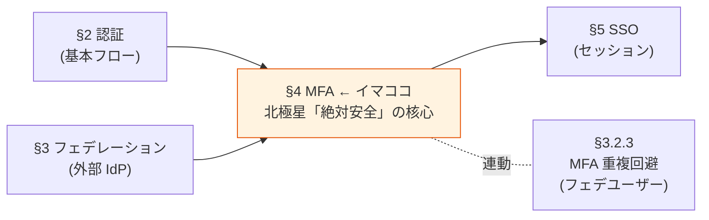

# §4 MFA（多要素認証）

> 上位 SSOT: [00-index.md](00-index.md)
> 詳細: [../functional-requirements.md §3 FR-MFA](../functional-requirements.md)、[../../adr/009-mfa-responsibility-by-idp.md](../../adr/009-mfa-responsibility-by-idp.md)
> カバー範囲: FR-MFA §3.1 要素 / §3.2 適用ポリシー

---

## §4.0 前提と背景

### 用語整理

| 用語 | 本基盤での意味 |
|---|---|
| **MFA（Multi-Factor Authentication）** | パスワード（知識）に加え、別の認証要素（所持 / 生体）を要求する仕組み |
| **AAL（Authentication Assurance Level）** | NIST が定義する認証の保証レベル。AAL1（パスワードのみ）/ AAL2（MFA 必須）/ AAL3（phishing-resistant MFA 必須） |
| **Phishing-resistant MFA** | フィッシング攻撃に耐えられる MFA。WebAuthn / FIDO2 / Passkey が代表 |
| **適用ポリシー** | MFA を「誰に・いつ・どんな条件で」要求するかのルール |
| **アダプティブ MFA** | ユーザーの行動・コンテキスト（IP / 地理 / デバイス）からリスクを動的判定し、必要な時だけ MFA を要求 |

### なぜここ（§4）で決めるか



**MFA は北極星 4 軸の「絶対安全」を実現する最重要要素**。理由：
- パスワード単独突破が依然として攻撃ベクター 1 位
- NIST SP 800-63B Rev 4 で AAL2 以上では MFA 必須化
- B2B SaaS では侵害被害が顧客全社に波及するため、MFA を疎かにできない

### 共通認証基盤として「MFA」を検討する意義

| 観点 | 個別アプリで実装した場合 | 共通認証基盤で実装した場合 |
|---|---|---|
| MFA 要素の一貫性 | アプリごとに別実装 → UX バラバラ | **基盤側で統一**、全システムで同じ MFA |
| 顧客企業のポリシー対応 | 各アプリで個別対応必要 | **基盤側のポリシー設定で一元化** |
| Passkey / WebAuthn 対応 | アプリごとに WebAuthn 実装 → 重い | **基盤側で標準提供**、アプリは JWT を信じるだけ |
| フェデユーザーの MFA 重複回避 | 各アプリで個別判定 | **基盤側で `amr` クレームを検査して一元判定**（[§3.2.3](03-federation.md#323-mfa-重複回避--fr-fed-012)）|
| MFA 適用ポリシー変更 | 全アプリ改修が必要 | **基盤側設定のみで反映** |

→ 共通認証基盤で MFA を中央集約することが、北極星「**絶対安全・どんなアプリでも・効率よく・運用負荷低**」を全て満たす唯一の道。

### 本章で扱うサブセクション

| サブセクション | 内容 | 関連 FR |
|---|---|---|
| §4.1 MFA 要素 | どんな MFA 手段（TOTP / Passkey / SMS / Email / ハードウェアキー）を提供できるか | FR-MFA-001〜005 |
| §4.2 MFA 適用ポリシー | いつ・誰に・どんな条件で MFA を要求するか | FR-MFA-006〜009 |

---

## §4.1 MFA 要素（→ FR-MFA §3.1）

### 業界の現在地（2026 年時点の調査結果）

**1. NIST SP 800-63B Rev 4 の MFA 保証レベル**

| AAL | 要件 | 該当する認証手段 |
|---|---|---|
| **AAL3**（最高）| **Phishing-resistant 必須**、デバイスバインド秘密鍵 | デバイスバインド Passkey、FIDO2 ハードウェアキー（YubiKey 等） |
| **AAL2** | Phishing-resistant **推奨** | 同期 Passkey（Apple iCloud / Google Password Manager）、TOTP（条件付き） |
| AAL1 | 単要素 OK | パスワード単独 |

→ **Passkeys（FIDO2 / WebAuthn）が NIST 公式に phishing-resistant 認定**

**2. Passkeys の普及（2026）**

- **エンタープライズの 87% が deploy or pilot 中**（HID/FIDO Alliance 2025 調査、2 年前 53% から急伸）
- Apple / Google / Microsoft が cross-platform passkey portability を実装済（ベンダーロックイン解消）
- **業務効果**: パスワードリセット 60-80% 減、サイバー保険料 15-30% 割引（FIDO2 deploy 証明で）
- **コスト**: 1 パスワードリセット = $70（Forrester ベンチマーク）→ Passkey で大幅削減

**3. SMS OTP の世界的非推奨化**

| リスク | 説明 |
|---|---|
| SIM swap 攻撃 | 攻撃者がキャリアに電話番号移管を依頼 → SMS 全傍受 |
| SS7 脆弱性 | テレコム網への不正アクセスで SMS リダイレクト |
| Reverse-proxy phishing | リアルタイムで OTP を中継・悪用 |
| データ漏洩 | T-Mobile 2021/2023 漏洩で本人確認情報が流出 → SIM swap 補助 |

→ NIST も「downgrade（弱体扱い）」、CISA も「phishing-resistant に非該当」と分類。**今後の新規実装では非推奨**。レガシー互換目的のみ。

### 我々のスタンス（北極星に基づく）

| 北極星の柱 | MFA 要素での実現 |
|---|---|
| **絶対安全** | **Passkeys（phishing-resistant）を強く推奨**。NIST AAL2/AAL3 整合、業界 87% 採用 |
| **どんなアプリでも** | TOTP / WebAuthn / SMS / Email / バックアップ すべてサポート可能、顧客選択 |
| **効率よく** | 1 ユーザー複数 MFA 要素登録可、UI フローを自動最適化 |
| **運用負荷・コスト最小** | Cognito Essentials+ で WebAuthn ネイティブ（追加コスト極小）、SMS は AWS SNS で従量課金 |

### 対応能力マトリクス

| MFA 要素 | Cognito Lite | Cognito Essentials+ | Cognito Plus | Keycloak (OSS/RHBK) | NIST AAL |
|---|:---:|:---:|:---:|:---:|:---:|
| **TOTP** | ✅ | ✅ | ✅ | ✅ | AAL2（条件付き）|
| **WebAuthn / FIDO2（Passkeys）** | ⚠ | ✅ **ネイティブ**（2024-11〜）| ✅ | ✅ | **AAL2 同期 / AAL3 デバイスバインド** |
| **ハードウェアキー（YubiKey 等）** | ⚠ | ✅（WebAuthn 経由）| ✅ | ✅ | **AAL3** |
| **SMS OTP** | ✅（追加課金、SNS） | ✅ | ✅ | ⚠ プラグイン | downgrade（非推奨）|
| **Email OTP** | ✅（Essentials+）| ✅ | ✅ | ✅ | NIST 削除（非推奨）|
| **バックアップコード** | ❌ | ❌ | ❌ | ✅ | — |
| **Push 通知（Authenticator アプリ）** | ⚠ | ⚠ | ⚠ | ⚠ プラグイン | AAL2（条件付き）|

### ベースライン

| MFA 要素 | 優先度 | 推奨理由 |
|---|:---:|---|
| **TOTP**（Google Authenticator 等）| **Must** | 全プラットフォーム対応、コスト最小、AAL2 整合 |
| **WebAuthn / Passkeys** | **Must（推奨）** | NIST 公認 phishing-resistant、業界 87% 採用、UX 良好。**Cognito Essentials+ でネイティブ、追加コスト極小** |
| ハードウェアキー（YubiKey 等）| Should | AAL3 必須時。WebAuthn 経由で対応 |
| バックアップコード | Should | 端末紛失時の救済手段（Keycloak は標準、Cognito は要設計）|
| SMS OTP | **Could**（非推奨）| レガシー互換のみ。新規実装では Passkey を推奨 |
| Email OTP | **Could**（非推奨）| NIST 削除。本人確認の補助のみ |
| Push 通知 | TBD | 顧客 IdP（Entra ID 等）側で実現する場合が多い |

→ **業界の方向性は Passkeys へのシフト**。本基盤は Passkeys を中心に据え、TOTP を最低保証、SMS/Email は明示的に非推奨と位置付ける。

### TBD / 要確認

| 確認項目 | 回答例 |
|---|---|
| 目標とする NIST AAL レベル | AAL2（推奨）/ AAL3（高セキュリティ）/ AAL1（パスワードのみ）|
| Passkeys を Must とするか | はい（推奨、業界標準）/ Should / Could |
| SMS / Email OTP の必要性 | レガシー顧客向け / 一切不要 |
| ハードウェアキー対応の必要性 | はい（管理者向け等）/ いいえ |
| MFA 要素の登録個数制限 | 1 / 複数許可（推奨） |

---

## §4.2 MFA 適用ポリシー（→ FR-MFA §3.2）

### 業界の現在地

**アダプティブ / リスクベース MFA がトレンド**:
- Cognito Plus: **Adaptive Authentication**（risk score 自動算出、デバイス・地理・行動分析）
- Keycloak: **Conditional Flow**（カスタムロジックで条件分岐）
- 2026 トレンド：AI 駆動、行動バイオメトリクス、継続的認証
- 市場規模：$2.98B by 2030（CAGR 15.5%）

### 我々のスタンス（北極星に基づく）

| 北極星の柱 | MFA ポリシーでの実現 |
|---|---|
| **絶対安全** | ロール単位での MFA 強制、条件付き MFA でリスク評価 |
| **どんなアプリでも** | フェデユーザーは外部 IdP の MFA を尊重（[§3.2.3](03-federation.md#323-mfa-重複回避--fr-fed-012)）|
| **効率よく** | リスクスコアが低ければ MFA スキップ、UX 良好 |
| **運用負荷・コスト最小** | Cognito Plus は AI ベース自動判定、Keycloak は宣言的フロー |

### 対応能力マトリクス

| ポリシー | Cognito Lite/Essentials | Cognito Plus | Keycloak (OSS/RHBK) | 備考 |
|---|:---:|:---:|:---:|---|
| **MFA 強制 / 任意切替**（User 単位）| ✅ | ✅ | ✅ | 両方標準 |
| **MFA 強制 / 任意切替**（ロール単位）| ⚠ Pre Token Lambda で自前 | ⚠ Pre Token Lambda で自前 | ✅ Authentication Flow（標準）| **Keycloak が楽** |
| **条件付き MFA（リスクベース、IP / 地理 / デバイス）**| ❌ | ✅ **Adaptive Authentication**（risk score）| ✅ Conditional Flow（カスタムロジック）| Cognito Plus は AI 駆動、Keycloak は宣言的 |
| **端末記憶（Trusted Device、N 日 MFA スキップ）**| ✅ Remember Device | ✅ Remember Device | ⚠ 設定要 | Cognito が標準 |
| **管理者 MFA 強制** | ✅ | ✅ | ✅ | 両方標準 |
| **フェデユーザー MFA 重複回避** | ⚠ Pre Token Lambda 個別実装 | ⚠ 同上 | ✅ Conditional OTP（標準）| **[§3.2.3](03-federation.md#323-mfa-重複回避--fr-fed-012) 参照** |
| **MFA 失敗時の動作**（一定回数でロック）| ✅ Lockout 設定 | ✅ | ✅ Brute Force Detection | 両方標準 |
| **AI / 行動バイオメトリクス** | ❌ | ⚠ ContextData 経由で外部連携 | ❌ | 将来トレンド |

### ベースライン

| ポリシー | 推奨デフォルト | 設定可能範囲 |
|---|---|---|
| MFA 必須 / 任意 | **ロール単位で制御**（管理者 Must、一般 Should）| ユーザー単位 / ロール単位 / 全員 |
| 条件付き MFA | **有効**（リスクスコア >= 中で MFA 要求）| Cognito Plus or Keycloak Conditional Flow |
| 端末記憶 | 有効、**30 日**スキップ | 0〜90 日 |
| 管理者 MFA | **強制**（Must）| 設定不可（常時 ON）|
| フェデユーザー MFA | **外部 IdP に委譲**（重複回避、[§3.2.3](03-federation.md#323-mfa-重複回避--fr-fed-012)）| 信頼するか個別判断 |
| MFA 失敗時ロック | 5 回失敗で 30 分（[§2.2 アカウントロック](02-auth.md#22-パスワードローカルユーザー管理-fr-auth-12)と統一）| 任意 |

### 適用フロー例

```mermaid
flowchart TD
    Login[ユーザーログイン試行] --> CheckFed{フェデ<br/>ユーザー?}
    CheckFed -- Yes --> CheckExtMFA{外部 IdP で<br/>MFA 済み<br/>(amr claim)?}
    CheckExtMFA -- Yes --> Success[認証成功<br/>MFA スキップ]
    CheckExtMFA -- No --> RequireMFA
    CheckFed -- No --> CheckRole{ロール = 管理者?}
    CheckRole -- Yes --> RequireMFA[MFA 要求]
    CheckRole -- No --> CheckRisk{リスクスコア<br/>>= 中?}
    CheckRisk -- Yes --> RequireMFA
    CheckRisk -- No --> CheckDevice{端末記憶<br/>有効?}
    CheckDevice -- Yes --> Success
    CheckDevice -- No --> RequireMFA
    RequireMFA --> VerifyMFA{MFA 検証}
    VerifyMFA -- 成功 --> Success
    VerifyMFA -- 失敗 --> Retry{失敗回数<br/>5 未満?}
    Retry -- Yes --> RequireMFA
    Retry -- No --> Lock[30 分ロック]

    style Success fill:#d3f9d8,stroke:#2b8a3e
    style Lock fill:#fff0f0,stroke:#cc0000
```

### TBD / 要確認

| 確認項目 | 回答例 |
|---|---|
| MFA 強制の粒度 | 全員 / ロール別（管理者 Must、一般 Should）/ 任意 |
| 条件付き MFA の要否 | はい（リスクベース）/ いいえ |
| 条件付き MFA の判定軸 | IP / 地理 / デバイス / 時間帯 / 行動パターン |
| 端末記憶の有効期間 | 0 / 7 / 30 / 90 日 |
| プラットフォーム選定への影響 | 条件付き MFA Must → Cognito Plus or Keycloak |

---

### 参考資料（§4 全体）

- [NIST SP 800-63B Rev 4 公式](https://pages.nist.gov/800-63-4/sp800-63b.html)
- [NIST SP 800-63B-4 (PDF)](https://nvlpubs.nist.gov/nistpubs/SpecialPublications/NIST.SP.800-63B-4.pdf)
- [87% of Enterprises Deploying Passkeys 2026](https://securityboulevard.com/2026/04/8-reasons-87-of-enterprises-are-deploying-passkeys-in-2026/)
- [CISA - Implementing Phishing-Resistant MFA](https://www.cisa.gov/sites/default/files/publications/fact-sheet-implementing-phishing-resistant-mfa-508c.pdf)
- [SMS OTP 世界的禁止動向](https://mojoauth.com/blog/6-reasons-sms-otp-is-being-banned-worldwide-and-what-to-deploy-instead)
- [Cognito Adaptive Authentication 公式](https://docs.aws.amazon.com/cognito/latest/developerguide/cognito-user-pool-settings-adaptive-authentication.html)
- [Microsoft Entra Passkeys 2026 Update](https://en.ittrip.xyz/microsoft-365/entra-passkeys-fido2-2026)
