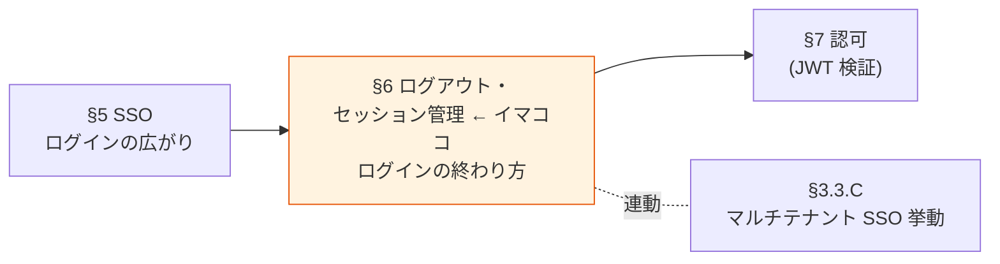
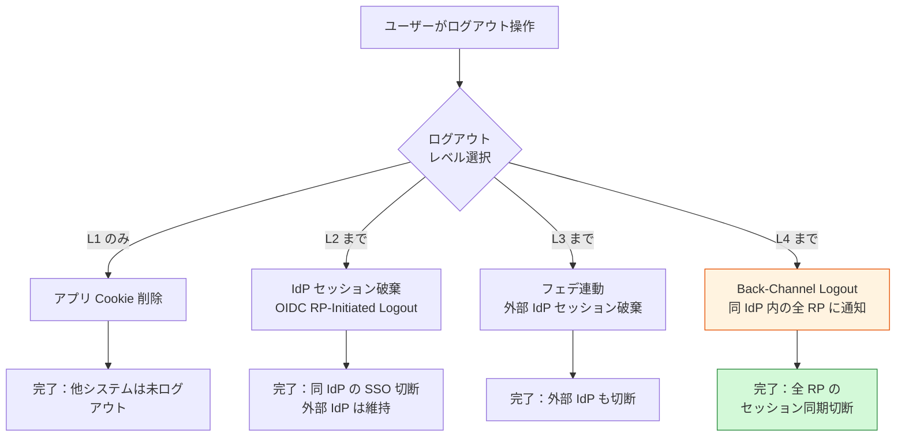

# §6 ログアウト・セッション管理

> 上位 SSOT: [00-index.md](00-index.md)
> 詳細: [../functional-requirements.md §4 FR-SSO/LOGOUT](../functional-requirements.md)
> カバー範囲: FR-SSO §4.2 ログアウト / §4.3 セッション管理（SSO 本体は [§5](05-sso.md)）

---

## §6.0 前提と背景

### 用語整理

| 用語 | 本基盤での意味 |
|---|---|
| **ローカルログアウト** | アプリ側 Cookie / SPA トークンストアの削除のみ |
| **RP-Initiated Logout** | RP（アプリ）から OP（基盤）にログアウト要求を送る方式（OIDC 標準）|
| **Back-Channel Logout** | OP → RP に**サーバー間直接通信**でログアウト通知（OIDC 標準、最も信頼性高い）|
| **Front-Channel Logout** | ブラウザ iframe 経由でログアウト通知（古典的、ブラウザセッション依存）|
| **SLO（Single Logout）** | 一度のログアウト操作で複数システムのセッションを破棄する仕組み |
| **セッションタイムアウト** | アイドル / 絶対経過時間で自動失効 |
| **Token Revocation** | アクティブなトークンを強制無効化（盗難対応等）|
| **Refresh Token Rotation** | 各 refresh token を単回使用とし、再利用検知でトークンファミリー全停止 |

### なぜここ（§6）で決めるか

SSO は便利な反面、**ログアウトとセッション管理を疎かにすると "認証残骸" がセキュリティリスクになる**。Back-Channel Logout / Refresh Token Rotation / Token Revocation は **北極星「絶対安全」の最終防衛線**。

### 共通認証基盤として「ログアウト・セッション管理」を検討する意義

| 観点 | 個別アプリで実装した場合 | 共通認証基盤で実装した場合 |
|---|---|---|
| ログアウト伝播 | 各アプリで個別実行 → 漏れ発生 | **基盤側で一元ログアウト**、漏れ防止 |
| Back-Channel Logout | アプリごとに実装 → 重い | **基盤側で標準提供**、アプリは callback だけ実装 |
| セッションタイムアウト | アプリごとに別ポリシー → UX バラバラ | **基盤側で統一**、全システムで同じ挙動 |
| トークン Revocation | 不可能（JWT はステートレス）| **基盤側で revocation list 管理** |
| Refresh Token 不正検知 | アプリでは検知困難 | **基盤側で Token Rotation + Reuse Detection** |

→ ログアウト・セッション管理を中央集約することで、**個別アプリでは絶対に実現できないセキュリティレベル**を提供。

### 本章で扱うサブセクション

| サブセクション | 内容 | 関連 FR |
|---|---|---|
| §6.1 ログアウト | 4 レイヤー（ローカル / IdP / フェデ連動 / Channel Logout）| FR-SSO-003〜007 |
| §6.2 セッションライフサイクル | セッション TTL / アイドルタイムアウト | FR-SSO-008、NFR-SEC-004〜007 |
| §6.3 トークン Revocation | Access Token / Refresh Token の強制無効化 | FR-SSO-009、NFR-SEC-008 |

---

## §6.1 ログアウト（→ FR-SSO §4.2）

> **このサブセクションで定めること**: ログアウト時に**どのレイヤーまでセッションを破棄するか**（L1 ローカル / L2 IdP / L3 フェデ連動 / L4 Back-Channel Logout）。
> **主な判断軸**: デフォルトログアウトレイヤー、Back-Channel Logout の要否（Cognito 非対応 → Keycloak 必須化に直結）
> **§6 全体との関係**: §6.1 = 「ログアウト範囲」、§6.2 = 「セッション寿命」、§6.3 = 「強制無効化」。3 つで認証セッションの**終わり方**を完全に規定

### 業界の現在地

**ログアウトには 4 つの「レイヤー」がある**。どこまで破棄するかを設計判断する。

| レイヤー | 対象 | 仕様 |
|---|---|---|
| **L1 ローカルログアウト** | アプリ Cookie / SPA トークンストア | アプリ独自 |
| **L2 IdP セッション破棄** | 共通基盤側の SSO セッション | OIDC RP-Initiated Logout（OpenID Connect Core 1.0）|
| **L3 フェデ連動ログアウト** | 外部 IdP（Auth0 / Entra 等）のセッション | 連鎖呼び出し |
| **L4 Channel Logout** | 同一 IdP 内の他 RP（システム） | OIDC Front-Channel / **Back-Channel Logout** |

**Back-Channel Logout の優位性**:
- サーバー間直接通信 → ブラウザ依存なし、確実に伝播
- 同期 / 非同期通知可能
- Auth0 / PingOne / ZITADEL 等の主要 IdP が標準実装
- Cognito は**非対応**、Keycloak は**標準対応**（PoC Phase 7 で実証済）

**SLO（Single Logout）の業界課題**:
- IdP/SP の SLO サポート未整備でフェデ連鎖が壊れやすい
- 1 つの SP が無反応 = チェーン全体崩壊
- 解決策：iframe 並列ログアウト、Back-Channel 採用

### 我々のスタンス（北極星に基づく）

| 北極星の柱 | ログアウトでの実現 |
|---|---|
| **絶対安全** | Back-Channel Logout で確実な伝播（ブラウザ閉じても確実）。トークン残骸を残さない |
| **どんなアプリでも** | L1〜L4 のレイヤー別ログアウトを基盤側で API 化 |
| **効率よく** | ワンクリックで指定レイヤーまでログアウト |
| **運用負荷・コスト最小** | Keycloak は標準、Cognito は L4 を要設計（[§12 プラットフォーム選定](12-platform.md)）|

### 対応能力マトリクス

| ログアウト機能 | Cognito | Keycloak (OSS/RHBK) | PoC 検証 |
|---|:---:|:---:|:---:|
| L1 ローカルログアウト | ✅ | ✅ | ✅ |
| L2 IdP セッション破棄（OIDC RP-Initiated） | ✅ `/logout` | ✅ `/logout?id_token_hint=...` | ✅ |
| L3 フェデ連動（外部 IdP セッション破棄） | ⚠ URL エンコード制約あり | ✅ | ✅ Phase 2, 5 |
| **L4 Back-Channel Logout（OIDC 標準）** | ❌ **非対応** | ✅ **ネイティブ対応** | ✅ Phase 7（Keycloak のみ）|
| L4 Front-Channel Logout | ✅ | ✅ | ❌ |

### ログアウトレイヤー図

### ベースライン

| ログアウトレイヤー | 推奨 | 理由 |
|---|:---:|---|
| L1 ローカル | **Must** | 基本動作 |
| L2 OIDC RP-Initiated | **Must** | 基盤の SSO セッション破棄に必須 |
| L3 フェデ連動 | **Should** | 完全ログアウトの実現に必要。Cognito は URL エンコード制約あり |
| **L4 Back-Channel Logout** | **Should**（強く推奨）| 確実なセッション伝播。**Keycloak のみ対応**、Cognito は実現不可 |
| L4 Front-Channel Logout | Could | ブラウザ依存、信頼性低い |

→ **L4 Back-Channel Logout を Must とする場合、Keycloak（OSS or RHBK）必須**。

### TBD / 要確認

| 確認項目 | 回答例 |
|---|---|
| デフォルトのログアウトレイヤー | L1 / L2 / L3 / L4 |
| Back-Channel Logout の要否 | はい（推奨）→ Keycloak 必須 / いいえ（Cognito でも OK）|
| フェデ連動ログアウトの要否 | 必須 / 不要 |
| ログアウト後のリダイレクト先 | 顧客指定 / 統一画面 |

---

## §6.2 セッションライフサイクル（→ FR-SSO-008、NFR-SEC-004〜007）

> **このサブセクションで定めること**: トークン（Access / ID / Refresh）の有効期限、セッションの絶対経過 / アイドルタイムアウト、Refresh Token Rotation の方針。
> **主な判断軸**: 目標 NIST AAL レベル、Access Token TTL、アイドルタイムアウト
> **§6 全体との関係**: §6.1 が「能動的なログアウト」、§6.2 が「**自動失効**」、§6.3 が「強制無効化」

### 業界の現在地

**1. NIST SP 800-63B Rev 4 セッションタイムアウト推奨値（2024）**

| AAL | 絶対経過タイムアウト | アイドルタイムアウト |
|---|---|---|
| AAL1 | 30 日 | 任意 |
| **AAL2** | **24 時間** | **1 時間** |
| AAL3 | 12 時間 | 15 分 |

**2. JWT トークン TTL 2026 ベストプラクティス**

| トークン種別 | 推奨 TTL | 理由 |
|---|---|---|
| Access Token | **15〜60 分**（短期） | 漏洩時の被害最小化 |
| ID Token | **15 分** | アクセス制御に使わない、認証情報のみ |
| Refresh Token | **30 日**（rotation 前提） | UX 確保 + 盗難検知 |

**3. Refresh Token Rotation（必須）**:
- 各 refresh token は単回使用
- 同じ refresh token の再利用 → トークンファミリー全体を即時無効化
- Cognito: ⚠ デフォルト OFF（要明示設定）／ Keycloak: ✅ デフォルト ON

### 我々のスタンス（北極星に基づく）

| 北極星の柱 | セッションライフサイクルでの実現 |
|---|---|
| **絶対安全** | NIST AAL2 整合（24h / 1h）、Refresh Token Rotation 必須 |
| **どんなアプリでも** | SPA / SSR / Mobile で同じセッション挙動 |
| **効率よく** | UX を損なわない TTL（15-30 分 access + 30 日 refresh rotation）|
| **運用負荷・コスト最小** | プラットフォーム標準機能で実現 |

### 対応能力マトリクス

| 機能 | Cognito | Keycloak (OSS/RHBK) | 備考 |
|---|:---:|:---:|---|
| セッションタイムアウト設定 | ✅ App Client 設定 | ✅ Realm 設定 | 両方標準 |
| Access Token TTL（15〜60 分）| ✅ | ✅ | 両方標準 |
| ID Token TTL | ✅ | ✅ | 両方標準 |
| Refresh Token TTL | ✅ | ✅ | 両方標準 |
| **Refresh Token Rotation** | ⚠ **デフォルト OFF**（要明示設定）| ✅ **デフォルト ON** | Cognito 側で要注意 |
| アイドルタイムアウト | ⚠ アプリ側実装 | ✅ Realm 設定 | Keycloak が楽 |

### ベースライン

| 項目 | 推奨デフォルト | 設定可能範囲 | NIST AAL 整合 |
|---|---|---|:---:|
| Access Token TTL | **30 分** | 15〜60 分 | AAL2 ✅ |
| ID Token TTL | **15 分** | 15〜30 分 | AAL2 ✅ |
| Refresh Token TTL | **30 日** | 1〜90 日 | — |
| 絶対経過タイムアウト | **24 時間**で再認証 | 12〜30 日 | AAL2 ✅ |
| アイドルタイムアウト | **1 時間** | 15 分〜2 時間 | AAL2 ✅ |
| Refresh Token Rotation | **有効**（必須） | ON/OFF | — |
| Reuse Detection | **有効**（不正検知でトークンファミリー全停止）| — | — |

### TBD / 要確認

| 確認項目 | 回答例 |
|---|---|
| 目標 NIST AAL レベル | AAL2（推奨）/ AAL3（より厳格）|
| Access Token TTL | 15 / 30 / 60 分 |
| アイドルタイムアウト | 15 / 30 / 60 分 |
| 絶対経過タイムアウト | 24 時間 / 7 日 / 30 日 |

---

## §6.3 トークン Revocation（→ FR-SSO-009, 010、NFR-SEC-008）

> **このサブセクションで定めること**: TTL を待たずにトークンを**強制無効化**する仕組み（盗難対応・退職時即時遮断・管理者強制ログアウト）。
> **主な判断軸**: Access Token Revocation の要否（Cognito 非対応 → Keycloak 必須化に直結）、管理者強制ログアウトの粒度、ユーザー自身のセッション管理 UI
> **§6 全体との関係**: §6.1 ログアウト・§6.2 ライフサイクルでカバーできない「**緊急時の即時無効化**」を担保

### 業界の現在地

**Token Revocation（JWT のジレンマ）**:
- JWT はステートレスなので発行後の Revocation が困難
- 解決策：
  - (a) 短い TTL（自然失効を待つ）
  - (b) jti / session ID ベースの revocation list
  - (c) Refresh Token のみ revoke（Access Token は短 TTL で吸収）
- Cognito: **Refresh Token のみ revoke 可、Access Token は不可**
- Keycloak: **Token Revocation 標準対応**（RFC 7009）

**2026 レイヤード防御**:
1. 短い Access Token TTL（5-15 分）
2. Token Binding（mTLS / DPoP for 高リスク API）
3. Refresh Token Rotation + Reuse Detection
4. jti / session ID ベースの revocation list

### 我々のスタンス（北極星に基づく）

| 北極星の柱 | Token Revocation での実現 |
|---|---|
| **絶対安全** | 盗難時に即時無効化、Reuse Detection で家族トークン全停止 |
| **どんなアプリでも** | 標準 API で Revocation 実行可能 |
| **効率よく** | 管理者操作 1 つで全セッション破棄 |
| **運用負荷・コスト最小** | Keycloak は標準、Cognito は Lambda + DynamoDB で blacklist 自前実装 |

### 対応能力マトリクス

| 機能 | Cognito | Keycloak (OSS/RHBK) | 備考 |
|---|:---:|:---:|---|
| **Token Revocation（Access Token）** | ❌ **非対応** | ✅ Token Revocation（RFC 7009）| **Keycloak 優位** |
| Token Revocation（Refresh Token）| ✅ | ✅ | 両方 |
| jti / session ID ベース blacklist | ⚠ Lambda + DynamoDB 自前 | ✅ Token Revocation 経由 | Keycloak が楽 |
| 強制全セッション破棄（管理者操作） | ✅ AdminUserGlobalSignOut | ✅ Admin Console | 両方標準 |
| ユーザー自身でのセッション一覧・破棄 | ⚠ アプリ側実装 | ✅ Account Console | Keycloak が楽 |

### ベースライン

| 項目 | 推奨デフォルト | 備考 |
|---|---|---|
| Access Token Revocation | **対応**（Keycloak ネイティブ、Cognito は Refresh のみで代替） | プラットフォーム選定論点 |
| Refresh Token Revocation | **必須** | 両プラットフォーム標準 |
| 管理者強制ログアウト | **有効** | 両プラットフォーム標準 |
| 異常検知時の自動 Revocation | **有効**（Reuse Detection と連動）| Refresh Rotation 設定で自動 |

### TBD / 要確認

| 確認項目 | 回答例 |
|---|---|
| Access Token Revocation の要否 | 必須（高セキュリティ）→ Keycloak 必須 / 短 TTL で吸収可（Cognito でも OK）|
| 管理者強制ログアウトの粒度 | 全ユーザー / テナント単位 / 個別ユーザー |
| ユーザー自身のセッション管理 UI | 必要（Keycloak Account Console）/ 不要 |
| プラットフォーム選定への影響 | Token Revocation Must → Keycloak |

---

### 参考資料（§6 全体）

- [OpenID Connect Back-Channel Logout 1.0 公式](https://openid.net/specs/openid-connect-backchannel-1_0.html)
- [OpenID Connect RP-Initiated Logout 1.0 公式](https://openid.net/specs/openid-connect-rpinitiated-1_0.html)
- [OpenID Connect Front-Channel Logout 1.0 公式](https://openid.net/specs/openid-connect-frontchannel-1_0.html)
- [NIST SP 800-63B Session Management](https://pages.nist.gov/800-63-3-Implementation-Resources/63B/Session/)
- [SAML SLO Challenges - Duende](https://www.identityserver.com/articles/the-challenge-of-building-saml-single-logout)
- [JWT Security Best Practices 2026](https://www.devtoolkit.cloud/blog/jwt-security-best-practices-2026)
- [JWT Token Lifecycle Management](https://skycloak.io/blog/jwt-token-lifecycle-management-expiration-refresh-revocation-strategies/)
- [RFC 7009 OAuth 2.0 Token Revocation](https://www.rfc-editor.org/rfc/rfc7009)
